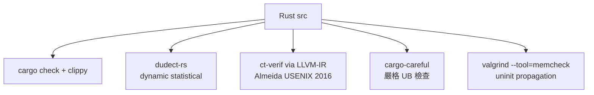
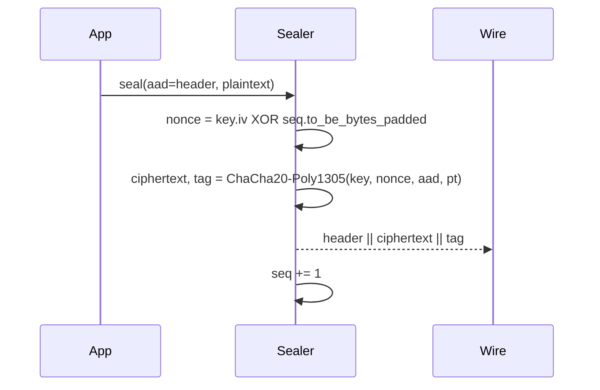
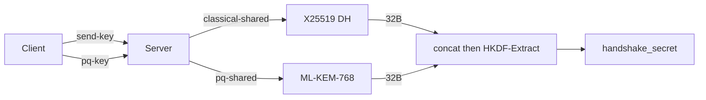

# 課堂 12.2 — 實作（一）：核心密碼學原語

## 學前知道
- 前置課：3.2 (AEAD), 3.3 (KDF), 3.5 (curves), 3.6 (KEX), 3.8 (Noise), 3.13 (side-channels), 3.14 (crypto eng), 11.5 (spec packet format)
- 預計閱讀時間：**55 分鐘**
- 必讀:
  - **Almeida, Barbosa, Barthe, Dupressoir, Emmi**. *Verifying Constant-Time Implementations*. USENIX Security 2016 — ct verification 形式化
  - **Bernstein, Lange**. *SafeCurves*. ECRYPT 2014
  - **Langley** (Adam). *crypto/tls: enable Curve25519, ChaCha20-Poly1305, AEAD*. Go std lib commit series 2016 — production crypto rollout 案例
  - **Project Everest** (Bhargavan et al.). *HACL\* / Vale*. CCS 2017 — verified crypto in F\* compiled to C
  - **Trail of Bits**. *RustCrypto Audit Report* 2024 — third-party audit findings
  - **briansmith/ring** [`src/aead/chacha20_poly1305.rs`](https://github.com/briansmith/ring/blob/main/src/aead/chacha20_poly1305.rs) — production constant-time AEAD wrapper
- 必讀原始碼:
  - `ring/src/aead/chacha20_poly1305.rs` 主入口
  - `ring/crypto/fipsmodule/aes/asm/aesni-x86_64.pl` AES-NI asm pipeline
  - `boringssl/crypto/chacha/chacha.c` portable + asm dispatch
  - `RustCrypto/chacha20poly1305/src/lib.rs` pure Rust 版本
  - `golang.org/x/crypto/chacha20poly1305/chacha20poly1305_amd64.s`
- 自我反省問題:
  - 如果你要從 0 寫一個 ChaCha20，會擔心哪些 timing leak？
  - 你看過 `subtle::ConstantTimeEq` 的 implementation 嗎？它為什麼比 `==` 安全？

## 動機

Part 3 教你密碼學的數學與 game-based security。Part 12.2 是把它轉成 **真的會在生產跑的 code**。在這個轉換中，三件事決定成敗：

1. **不發明 primitive**：用 audited 的 ring / RustCrypto / *ring 或 BoringSSL；不用 OpenSSL 1.0 老 API
2. **不發明 mode**：spec 寫的密碼套件 = TLS / Noise 已經 audit 過的；自定 mode 只在 PRF 用法上做新組合
3. **API 邊界把 ct property 與 zeroize 強制化**：用 `subtle::Choice` / `Zeroizing<T>` 包裹敏感型別，違反 type 就 build fail

本堂課帶你逐個建構 spec 要的 crypto block：

```mermaid
flowchart LR
    KEY[KEM/KEX:<br/>X25519 + Kyber768]
    HASH[Hash/PRF:<br/>BLAKE3, HKDF-SHA-256]
    AEAD[AEAD:<br/>ChaCha20-Poly1305<br/>AES-128-GCM (HW-accel)]
    SIG[Signature (optional):<br/>Ed25519]
    HPKE[HPKE-DHKEM<br/>for ECH]
    KEY --> HSDF[Handshake<br/>secret derivation]
    HASH --> HSDF
    HSDF --> RKR[Record key rotation]
    AEAD --> RKR
    SIG --> AUTH[Server auth proof]
    HPKE --> ECH[Inner-CH protection]
    classDef ours fill:#fde,stroke:#c39;
    class HSDF,RKR ours;
```

你寫的不是 primitive，你寫的是 **glue + ct wrapper + key management**。這 glue 是 90% 的 bug 來源。

---

## 核心概念

### 1. Crypto API 邊界設計：「Rusty crypto」三原則

#### 原則 1: 敏感型別不可 `Copy` / `Debug`

```rust
use zeroize::{Zeroize, ZeroizeOnDrop};
use subtle::ConstantTimeEq;

#[derive(Zeroize, ZeroizeOnDrop)]
pub struct SessionKey([u8; 32]);

impl SessionKey {
    pub fn from_bytes(bytes: [u8; 32]) -> Self { Self(bytes) }
    pub fn ct_eq(&self, other: &Self) -> subtle::Choice {
        self.0.ct_eq(&other.0)
    }
}

// 故意不 derive Debug / Display / Clone / Copy
// Clone 必須顯式：避免無意間複製出 lifetime 過長的 key
impl SessionKey {
    pub fn clone_for_test(&self) -> Self { Self(self.0) }
}
```

**為什麼**：
- `Copy`/`Clone` 預設讓 key 散在 stack 不可控位置
- `Debug` 印 log 是 log injection 的 key disclosure 經典 root cause（Cloudflare 2017 cloudbleed 教訓）
- `Drop` 自動 zeroize — 但 compiler 可能 elide；用 `ZeroizeOnDrop` + `std::sync::atomic::compiler_fence` 阻擋

#### 原則 2: ct 性質透過 type encoding

```rust
use subtle::{Choice, ConditionallySelectable};

// 對「分支取決於秘密」的 case 用 Choice 而非 bool
fn select_branch(secret_bit: Choice, a: u32, b: u32) -> u32 {
    u32::conditional_select(&a, &b, secret_bit)
}
// 編譯後變成 cmov / and / or，無 branch
```

**為什麼**：用 `bool` + `if`，LLVM 可能優化成 jmp；用 `Choice` 強制 ct selector。
搭配 `cargo-careful` + `dudect`（dynamic ct verification）。

#### 原則 3: nonce 由 type system 防 reuse

```rust
pub struct Sealer {
    key: ChaChaKey,
    next_nonce: u64,   // 從 0 開始，單調遞增
}

impl Sealer {
    pub fn seal(&mut self, aad: &[u8], plaintext: &mut Vec<u8>) -> Result<(), Error> {
        let nonce = nonce_from_u64(self.next_nonce);
        self.next_nonce = self.next_nonce.checked_add(1)
            .ok_or(Error::NonceExhausted)?;
        // ... AEAD seal ...
        Ok(())
    }
}
```

`&mut self` 保證 single-threaded seal；無法多次取得同 sequence。

### 2. Primitive 選擇與 mapping 到 lib

| Spec 要求 | Primitive | Rust crate | Go pkg | 為何選它 |
|---|---|---|---|---|
| AEAD（hot path） | ChaCha20-Poly1305 | `ring::aead::CHACHA20_POLY1305` | `chacha20poly1305` | 無需 HW；mobile + server 同樣快；無 side-channel |
| AEAD（HW-rich path） | AES-128-GCM | `ring::aead::AES_128_GCM` | std `crypto/cipher` | x86 AES-NI / ARMv8 crypto ext 下 throughput 3-5x |
| Hash / PRF | BLAKE3 | `blake3` | `lukechampine.com/blake3` | SIMD 並行；簡潔 API；無已知 attack |
| Backup hash（與 IETF 相容） | SHA-256 | `ring::digest::SHA256` | `crypto/sha256` | TLS / HPKE 仍需此 |
| KDF | HKDF-SHA-256 / BLAKE3-derive | `ring::hkdf`/`blake3::Hasher::derive_key` | `crypto/hkdf` | RFC 5869 |
| Static DH | X25519 | `ring::agreement::X25519` | `crypto/ecdh` | Bernstein 2006，無 invalid-curve 風險 |
| PQ KEM | ML-KEM-768 (Kyber) | `pqcrypto-mlkem` / `ring-pq` | `crypto/mlkem` (1.24+) | NIST PQC v1.0 (FIPS 203) |
| Signatures | Ed25519 | `ring::signature::ED25519` | `crypto/ed25519` | 確定性 / strong unforgeability |
| HPKE | DHKEM(X25519, HKDF-SHA256) + ChaCha20-Poly1305 | `hpke-rs` / `rust-hpke` | `crypto/hpke` (1.24+) | RFC 9180; ECH 必備 |

注意「ring 對應 ring」的歷史：`*ring*` 是 BoringSSL 之 Rust binding fork（briansmith/ring）。FIPS 級 audit 但不 FIPS 認證。

### 3. 「不發明 primitive」的具體含意

不發明 = 不寫自己的 ChaCha20、不重寫 SHA-256、不自定 mode。
可發明 = 把 audited primitive 組合成新的 KDF tree、新的 packet AEAD framing、新的 transcript hashing。

例如本協議的 transcript hashing：

```text
transcript_hash[i] = BLAKE3(
    label_i || packet_header_i || ciphertext_i || transcript_hash[i-1]
)
```

這是合法的「新組合」；新 collision-resistance 還原為 BLAKE3 的 collision-resistance。

反例（**不能做**）：
- 自己改 ChaCha 的 round 數（少於 20）
- 自己 XOR 兩個 cipher output 得到「更安全」cipher（多數情況反而更弱，見 *Joux Forbidden 2006*）
- 自己定義 MAC = `H(K || m)`（vulnerable to length extension if H = SHA-256）

### 4. Constant-time 工程實踐

#### CT 不只是 cipher 內部

| 表面看起來無關，但常 leak 的地方 | 修法 |
|---|---|
| `memcmp(mac1, mac2, 16)` | `subtle::ConstantTimeEq` |
| `if bytes[0] == 0 { ... }`（解 padding） | bit-level ct mask + 後續 conditional select |
| `HashMap<SessionId, Session>` lookup | 對於 secret key 不 hashable，改 ct linear scan if N small；否則用 hmac-keyed PRF index |
| Base64 / hex 解析路徑 | 用 ct-base64 crate（如 `data-encoding`） |
| `Vec::with_capacity(n)` 其中 n 來自 attacker | size cap + 預先 ct-clamp |

#### 驗證工具



`dudect`（Reparaz et al., HOST 2017）通過 Welch t-test 判斷 implementation 是否 ct：對隨機 vs 固定輸入跑大量 sample，看 timing distribution 是否可區。
`ct-verif`（Almeida et al., USENIX Security 2016）對 LLVM-IR 做 taint-like 分析，可機械化證明特定函式 ct。

### 5. AEAD 的 packet API 細節

我們協議的 record layer 大致對應 TLS 1.3：



**陷阱**：
- nonce 不可重用：seq 是 stateful；切記不要在 retransmit 或 stateless server 跑 seal 兩次（解法：Part 11 spec 採用 explicit packet number，無重複）
- AAD 必須包含 epoch / direction：避免 reflection / cross-epoch 攻擊
- key update 機制：每 N 個 packet 或 N bytes 後 derive 新 key（RFC 8446 §5.5 限制）

代碼示意：

```rust
fn nonce_from_seq(static_iv: &[u8; 12], seq: u64) -> [u8; 12] {
    let mut n = *static_iv;
    let seq_be = seq.to_be_bytes(); // 8 bytes
    for i in 0..8 {
        n[4 + i] ^= seq_be[i]; // RFC 8446 §5.3
    }
    n
}
```

### 6. KDF 樹的具體實作

對應 Part 3.3 / 4.3 / 11.6：

```text
salt = 0  ┐                                    
PSK ──────┤ HKDF-Extract → es                  
                                                
es ─label "ext-binder"─→ binder_key             
es ─label "c hs"─→ ...                          
...                                             
                                                
es + DH ─→ HKDF-Extract → hs                    
hs ─label "c hs traffic"─→ c_hs_secret          
hs ─label "s hs traffic"─→ s_hs_secret          
                                                
hs ─derived─ + 0 ─→ HKDF-Extract → ms           
ms ─label "c ap traffic"─→ c_ap_secret          
ms ─label "s ap traffic"─→ s_ap_secret          
```

Rust：

```rust
fn derive_secret(prk: &Prk, label: &[u8], transcript_hash: &[u8]) -> SecretKey {
    let info = hkdf_label(label, transcript_hash);
    let mut out = Zeroizing::new([0u8; 32]);
    prk.expand(&[&info], HKDF_SHA256).expand(&mut out[..]).unwrap();
    SecretKey::from_bytes_zeroizing(out)
}
```

`hkdf_label` 即 RFC 8446 §7.1 的 `HkdfLabel` struct：

```text
struct {
    uint16 length;
    opaque label<7..255> = "tls13 " + Label;
    opaque context<0..255> = Context;
} HkdfLabel;
```

我們會把 `"tls13 "` 換成 `"$protoname "` 來確保 cross-protocol domain separation（避免 Selfie attack，見 *Drucker 2021*）。

### 7. PQ-hybrid KEM 的整合



**Combiner 的安全性**：concat-then-KDF 在 Bindel-Brendel-Fischlin-Goncalves-Stebila（PQ Crypto 2019）證明可保留 hybrid security（至少其中一個 KEM 安全則整體安全）。**不要** XOR。

實作：

```rust
let mut combined = [0u8; 32 + 32];
combined[..32].copy_from_slice(x25519_shared.as_ref());
combined[32..].copy_from_slice(mlkem_shared.as_ref());
let prk = HKDF_SHA256.extract(&salt, &combined);
combined.zeroize();
```

### 8. 安全測試與 KAT vectors

每個 primitive 必須附 **Known-Answer Tests**：

```rust
#[test]
fn chacha20_poly1305_rfc8439_test_vector() {
    let key = hex!("808182...");
    let nonce = hex!("070000004041424344454647");
    let aad = hex!("50515253c0c1c2c3c4c5c6c7");
    let plaintext = b"Ladies and Gentlemen of the class of '99...";
    let expected_ct = hex!("d31a8d34648e60db7b86afbc53ef7ec2...");
    let (ct, tag) = seal(&key, &nonce, aad, plaintext);
    assert_eq!(ct, expected_ct);
}
```

對於 HKDF / Ed25519 / X25519 / ML-KEM 都應該抄 RFC / NIST CAVP vectors。`wycheproof` test suite（Google）包含 thousands of edge cases — 必跑。

### 9. 邊角陷阱清單（10 條）

1. **`memzero` 被 compiler elide**：用 `zeroize` crate，內含 `compiler_fence`
2. **Stack-allocated key 沒 zeroize**：drop glue + `[u8; 32].zeroize()` 不影響 stack；但 stack 不能保證；audited crate 用 `core::mem::take` 寫回 zero
3. **`Vec<u8>` reserve 後可能 realloc → 舊 buffer 留 key**：使用 `Zeroizing<Vec<u8>>` + 預先 `with_capacity`，避免 grow
4. **`format!("{:?}", key)`**：dervie 阻止
5. **Random source 用 `rand::thread_rng()` 沒 cryptographic 標**：用 `rand::rngs::OsRng` 或 `ring::rand::SystemRandom`
6. **mlock 沒呼叫 → page out → swap 含 key**：對 server 用 `mlock` + `MADV_DONTDUMP`
7. **`std::env::var("KEY")`**：environ 表在 `/proc/self/environ` 可讀；改用 systemd credentials / sealed file
8. **錯誤回傳 generic `Result<_, Box<dyn Error>>`**：dyn Error allocates；error path 可能 leak timing → 使用具體 enum + non-allocating message
9. **AES table-based fallback**：T-table AES leak cache timing — 強制 reject AES key 若 lacking HW
10. **DRBG seed 從 fast clock**：禁；只能從 OS entropy

### 10. 全模組 layout

```text
crates/
├── proto-crypto/
│   ├── src/
│   │   ├── lib.rs            -- 公開 API surface
│   │   ├── aead.rs           -- Sealer / Opener
│   │   ├── hash.rs           -- BLAKE3 + SHA-256 wrapper
│   │   ├── kdf.rs            -- HKDF + HkdfLabel
│   │   ├── kem.rs            -- X25519 + ML-KEM combiner
│   │   ├── sig.rs            -- Ed25519
│   │   ├── hpke.rs           -- ECH 需要
│   │   ├── transcript.rs     -- transcript hash
│   │   ├── random.rs         -- CSPRNG wrapper
│   │   └── ct.rs             -- subtle re-export + helpers
│   ├── tests/
│   │   ├── kat_aead.rs
│   │   ├── kat_kdf.rs
│   │   ├── wycheproof.rs
│   │   └── ct_dudect.rs
│   └── benches/
│       └── aead_throughput.rs   # criterion + perf
```

公開 API 嚴格控制到 < 30 個 items，所有 `pub` 必須有 docstring + `# Safety` 區（若 unsafe）。

---

## 與我們協議設計的關聯

- **Part 12.3 握手實作** 直接使用 `proto-crypto::kdf` + `kem` + `transcript`
- **Part 12.4 資料路徑** 在 hot loop 用 `aead::Sealer`，且 batch 多 packet → 在 `proto-crypto` 中提供 `seal_in_place_batch` 介面
- **Part 12.8 fuzzing** 對 `proto-crypto::record::parse` + `kdf::derive_secret` 用 cargo-fuzz；任何 panic = bug
- **Part 12.9** 對應 KAT + wycheproof + dudect CI gate
- **Part 11.10 ProVerif** 模型把 KDF tree 對應為 `funct` 宣告；本堂的 label 命名要跟 ProVerif 模型一致

---

## 動手

1. 建 cargo workspace，在 `crates/proto-crypto` 寫 `Sealer::seal` 並通過 RFC 8439 KAT
2. 寫 `cargo bench` 比較 `ring::aead` 與 `chacha20poly1305` 純 Rust crate；在你的 Apple Silicon 量測單核 Gbps
3. 對 `Sealer::seal` 跑 `dudect-rs`，比較 fixed-secret-key vs 隨機-key 的 timing distribution，產出 t-statistics
4. 寫 `cargo-careful run --tests`，看是否有任何 UB 報告
5. 用 `wycheproof` 的 chacha20_poly1305_test.json，要求 100% pass

## 自我檢查

1. 為什麼用 `subtle::Choice` 不是 `bool`？compiler 對兩者輸出的 asm 差在哪？
2. AEAD 的 nonce reuse 後果是什麼？對 ChaCha20-Poly1305 vs AES-GCM，後果嚴重程度差別？
3. `Zeroize` 為何要 `compiler_fence`？沒有的話會發生什麼？
4. HKDF-Extract 跟 HKDF-Expand 為什麼要拆兩步？把 IKM 直接 Expand 不行嗎？
5. 對 X25519 + ML-KEM hybrid，如果你 XOR 兩個 shared secret 而不是 concat-then-KDF，安全性如何被打破？

## 延伸閱讀

- *crypto-book*（Boneh & Shoup） 第 1-8 章 — 你已讀，這裡是 reference
- *RustCrypto Project*：[github.com/RustCrypto](https://github.com/RustCrypto) 全家桶
- *Project Wycheproof*：[github.com/C2SP/wycheproof](https://github.com/C2SP/wycheproof)
- *Cryptographic Right Answers* (Latacora 2018 + 2024 update)
- *Real World Cryptography* (Wong, Manning 2021) — 應用層視角
- *The Cryptopals Crypto Challenges* — 動手練習

---

## 研究級補遺

### 1. 學界詞彙

| 中文/口語 | 學界詞彙 |
|---|---|
| 常時實作 | constant-time / timing-resistant implementation |
| 副通道 | side-channel: timing / cache / power / EM |
| 動態 ct 測試 | dynamic constant-time verification（dudect, ctgrind） |
| 靜態 ct 測試 | static constant-time verification（ct-verif, Jasmin, FaCT） |
| 隨機數 / DRBG | Deterministic Random Bit Generator (NIST SP 800-90A) |
| 已知答案測試 | Known-Answer Test (KAT) / Algorithm Validation Suite |
| 域分離 | domain separation; label-based KDF binding |

### 2. 對手分類學

| 對手 | 想攻 | 防禦 |
|---|---|---|
| 同機 process timer | cache / branch timing | ct + cache-coloring + page-aware allocator |
| Hyperthread cohabitant | last-level cache leak | `prctl(PR_SET_SPECULATION_CTRL)` / 禁 SMT |
| Remote network timing | flush+reload 不可能；但 net jitter 仍可（Brumley-Tuveri 2011） | ct + 等效 latency padding |
| Power / EM (lab) | 對 ChaCha 旋轉常數無大影響；對 AES-NI minimal | 不在 threat model（不防硬體攻擊） |
| Cold-boot RAM | key 散在 stack / heap | mlock + zeroize + ephemeral key rotation |

### 3. 形式化定義

**IND-CCA2 for AEAD**: $\mathsf{Adv}^{\text{auth-ind}}_{\mathsf{AEAD}}(\mathcal{A}) := |\Pr[\mathcal{A}^{\mathsf{Enc}_K, \mathsf{Dec}_K} \Rightarrow 1] - \Pr[\mathcal{A}^{\$_K, \bot} \Rightarrow 1]|$

ChaCha20-Poly1305 在 multi-user setting 的 tight bound 見 *Bellare-Tackmann CRYPTO 2016*（已 fetched，notes/papers/bellare-tackmann-multiuser-2016.md）。

**Constant-time formal**: $\forall x_1, x_2 \in I, t(x_1) = t(x_2)$ where $I$ is secret-equivalence class, $t$ is timing trace. 加強版需考量 cache footprint trace, branch trace, memory access pattern。

### 4. 領域的關鍵論文 / 規格 / 原始碼

1. **RFC 8439** — ChaCha20-Poly1305 spec
2. **RFC 5869** — HKDF
3. **RFC 7748** — X25519/X448
4. **RFC 8032** — EdDSA
5. **RFC 9180** — HPKE
6. **FIPS 203** — ML-KEM (NIST 2024) — 12.8 fuzzing 重點 input
7. **Almeida et al. USENIX Security 2016** — ct-verif
8. **Bernstein, ChaCha 2008** — 已 fetched
9. **Bellare-Namprempre 2000** — encrypt-then-MAC，已 fetched
10. **Project Everest** — HACL\*, Vale → 對 Rust implementer 是 「我們追不到的高度」之上限參照

### 5. 我們協議的座標 / 設計取捨

- G1（保密）+ G3（FS）：由 AEAD + 每 epoch 新 derive key + Zeroize 三層支撐
- G7（0-RTT replay）：record layer 之 anti-replay window 由 nonce 上限保證；超過 N 個 packet 強制 key update
- G8（DoS）：握手 KEM 之 cost asymmetry — ML-KEM-768 decap > encap 2x；對 server 是 DoS surface，採 cookie + rate-limit
- **Open**：是否支援 ASCON (NIST LWC) 為 IoT 客戶端的 AEAD 選項？暫不（複雜度 vs adoption）

### 6. 必追資源 / 社群入口

- IACR ePrint feed（subscribe）
- RustCrypto Discord / Matrix
- IETF CFRG mailing list
- NIST PQC / LWC seminars
- Real World Crypto (RWC) 年會 — 對應用 crypto 工程必聽

### 7. 開放問題

1. **完整 ct 證明的 Rust 工具鏈**：目前 ct-verif 對 LLVM-IR 工作；Rust borrow checker 與 ct 之 integration 仍 open（學術界 attempts: FaCT, Verus）
2. **PQ migration 之 KDF cost**：concat-then-KDF 在 large shared secret（如 Kyber-1024）時 HKDF-Extract 需 2-block；對 mobile 是否可省一 block 的 derivation？
3. **零知識 KEM auth**：是否能在不暴露 server long-term key 下完成 mutual auth（除 OPAQUE 外）？跟 G5 (server privacy) 相關
4. **AEAD with auth-data 之 incremental MAC**：對 streaming（每 small chunk 都 seal）的 amortized cost 如何 lower bound？
