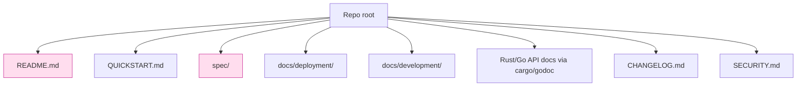
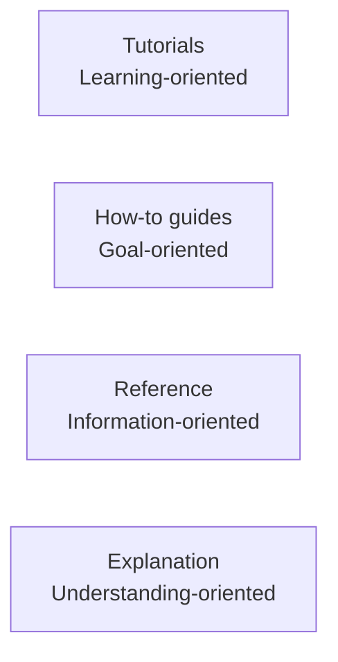

# 課堂 12.20 — 文件撰寫：README / spec / 部署指南 / 開發者文件

## 學前知道
- 前置課：12.1-12.19 全部（文件對象）
- 預計閱讀時間：**35 分鐘**
- 必讀:
  - **Daniele Procida**. *Diátaxis Documentation Framework* — 文件 4 大類別之公認 framework
  - **The Rust API Guidelines**
  - **Google Documentation Style Guide**
  - **RFC Editor Style Manual**
- 自我反省問題:
  - 你 setup Hysteria2 第一次時，最 frustrate 的文件問題是什麼？
  - 你看過 Caddy / Tailscale 之 documentation 嗎？比 OpenVPN docs 好太多 — 差在哪？

## 動機

「實作再強，文件爛 = 沒有 user / contributor」。Tailscale 之 success 70% 歸功於 docs；OpenVPN 之 stagnation 70% 歸於 docs incomprehensibility.

我們協議至少需要 6 類文件：



## 核心概念

### 1. Diátaxis framework

文件 4 大類：



對我們專案：
- Tutorial: «第一次 deploy 之 30 分鐘 walkthrough»
- How-to: «怎麼 enable PQ-hybrid», «怎麼 rotate user PSK», «怎麼整合 Caddy»
- Reference: spec, API doc, config schema
- Explanation: design rationale, threat model

### 2. README.md：5 分鐘決定使用

```markdown
# protoxx

> Censorship-resistant, high-performance proxy protocol with formal verification.

[] [] []

## What is protoxx?

protoxx is a UDP-based proxy protocol that combines:
- **VLESS+REALITY-grade probe resistance** via Caddy-fronted fallback
- **Hysteria2-grade speed** via Rust + io_uring + adaptive BBR
- **PQ-ready cryptography** with ML-KEM-768 hybrid handshake
- **Formally verified** security properties (ProVerif, TLA+)

**Status**: v0.1.0, research-preview. Not yet production-recommended.

## Quick start

\```bash
# Server (Linux)
curl -L https://github.com/...you/releases/v0.1.0/protoxx-server-linux-amd64 -o protoxx-server
chmod +x protoxx-server
./protoxx-server init --domain my-site.com
./protoxx-server run
\```

\```bash
# Client (macOS)
brew install protoxx/tap/protoxx
protoxx config add protoxx://eyJ...@my-site.com:443
protoxx start
\```

## Documentation

- [Quickstart](./QUICKSTART.md)
- [Server Deployment](./docs/deployment/server.md)
- [Client Setup](./docs/deployment/client.md)
- [Protocol Specification](./spec/v0.1.0/)
- [Security Considerations](./docs/security.md)
- [Threat Model](./docs/threat-model.md)
- [Architecture](./docs/architecture.md)
- [Contributing](./CONTRIBUTING.md)

## How it compares

See [evaluation results](./docs/evaluation/) and our paper (link).

## Security disclosure

See [SECURITY.md](./SECURITY.md). PGP key: ...
```

關鍵：
- 一句話 「what + why»
- status 明示 (research-preview / production / deprecated)
- 5 行 quickstart
- doc index 清晰
- security disclosure 顯眼

### 3. Spec：RFC-grade 文件

```
spec/
├── v0.1.0/
│   ├── 00-introduction.md
│   ├── 01-terminology.md
│   ├── 02-overview.md
│   ├── 03-cryptography.md
│   ├── 04-record-layer.md
│   ├── 05-handshake.md
│   ├── 06-state-machine.md
│   ├── 07-padding-and-shaping.md
│   ├── 08-error-handling.md
│   ├── 09-security-considerations.md
│   ├── 10-iana-considerations.md
│   ├── A-test-vectors.md
│   ├── B-asn1-and-formats.md
│   └── README.md (overview of all)
└── changelog.md
```

每節遵 RFC 風格：
- MUST / SHOULD / MAY 大寫
- 結構化 sections
- 每節 byte-level 描述 + Mermaid state diagram
- Test vectors 附 hex
- Security Considerations §（與 TLS 1.3 spec 同詳盡度）

### 4. Server deployment guide

```
docs/deployment/server.md:

# Server Deployment

## System requirements

- Linux kernel ≥ 6.10 (for io_uring batching)
- 2 CPU cores, 1 GB RAM, 10 GB disk
- Domain with valid TLS cert (Let's Encrypt auto)
- Outbound :443/UDP open
- Inbound :443/UDP open

## Step 1: Install binary

[bash one-liner]

## Step 2: Configure cover site (Caddy)

[Caddyfile example]

## Step 3: Generate first user

[CLI command + screenshot]

## Step 4: Verify deployment

[curl + nmap verification commands]

## Step 5: Maintain

- Logs: /var/log/protoxx/
- Restart: systemctl restart protoxx
- Update: ...

## Troubleshooting

- Symptom A → Likely cause + fix
- Symptom B → ...

## Hardening checklist

[10-item checklist + linkbacks]
```

### 5. Client setup

每 platform 一頁：macOS / Windows / Linux / Android / iOS / OpenWrt
含 screenshot；對 GUI 用戶必備。

### 6. Threat model

```
docs/threat-model.md:

# Threat Model

## Adversaries

A1: passive Internet observer (description, capabilities, what we promise)
A2: active prober (description, capabilities, what we promise)
...

## Trust assumptions

T1: ...
T2: ...

## Goals

G1: confidentiality of inner data against A1-A6
G2: ...

## Non-goals

N1: we do NOT protect against...
N2: ...

## Out-of-scope attacks

[explicit list with reasoning]

## References

[paper, formal verification artifacts]
```

明示 non-goal 與 out-of-scope 是 academic honesty 必要；user 才能 informed-consent.

### 7. Security disclosure (SECURITY.md)

```
docs/SECURITY.md:

# Security Policy

## Reporting

PGP-encrypted email to security@protoxx.dev (key fingerprint).
Response within 24h.

## Embargo

We follow a 90-day embargo (standard CVD).

## Scope

In-scope: core protocol, reference impl, official client.
Out-of-scope: third-party integrations, deployment misconfig.

## Reward

We do not offer monetary reward but will credit researcher.

## CVE assignment

We are a CNA (or use MITRE root).
```

### 8. Developer / contributor docs

```
docs/development/:

- architecture.md      — high-level design
- code-layout.md       — crate map
- build.md             — full build instructions, CI explanation
- testing.md           — test strategy, fuzz, KAT
- spec-process.md      — how to propose spec change
- release-process.md   — version bump, signing, distribution
- coding-style.md      — rustfmt config, naming
- CONTRIBUTING.md      — PR process, DCO/CLA
```

每 doc 250-1000 字；目標：新貢獻者 1 天 onboard。

### 9. API docs

Rust：`cargo doc --no-deps --open`；每 `pub` item 必有 docstring + example。
Go：`godoc` 同理；每 exported 必 doc。

對 cdylib FFI：cbindgen-generated header 含 doc comment。

### 10. CHANGELOG.md

```
## v0.1.0 (2026-XX-XX)
- Initial public release.
- Spec v0.1.0 frozen.
- Reference impl in Rust + Go shim.
- Evaluation result in `docs/evaluation/v0.1.0.pdf`.

## v0.1.0-rc.3 (2026-XX-XX)
- [Fix] DF detection rate from 85% → 73% via shaping profile rotation
- [Fix] cgo batch FFI fixed
- [Spec] §7.2 padding upper bound clarified
```

Format：[Keep a Changelog](https://keepachangelog.com)；semver tags.

### 11. Code comment policy

- Public API: 必 doc，含 example
- Private function: 一行 comment 若 nontrivial
- Inline comment 解釋 why，不解釋 what
- 「TODO / FIXME / HACK」 明示 owner + date

CI 跑 `cargo clippy::missing_docs` 強制 public API doc。

### 12. Internationalization

- README 提供中文版（zh-CN, zh-TW）— 對我們 user base 是 P0
- Client GUI i18n： i18next / fluent，cover en / zh / ja / fa（伊朗）/ ru
- spec 只英文（IETF 慣例）；中文翻譯 community-contributed

### 13. Documentation site (optional but recommended)

用 mdBook / Docusaurus 建文件 site：
- `https://docs.protoxx.dev`
- search built-in
- versioned docs
- API doc embedded

對 SEO 與 user discoverability 重要。

---

## 與我們協議設計的關聯

- **Part 12.21 release**：本堂之 doc 是 release-blocker
- **Part 12.22-23 paper**：spec + threat-model 可直接 cite
- **Part 12.1 ADR** (Architecture Decision Records)：本堂之 architecture.md 引用 ADR

## 動手

1. 從 README template 開始；寫 5 分鐘版
2. 寫 server deployment guide；對 own VPS 跑 dry-run，確認步驟可重現
3. 寫 spec v0.1.0 之 cover page + table of contents
4. 設 mdBook / Docusaurus 之 first build
5. 對 docs 跑 markdown lint + dead-link check

## 自我檢查

1. Diátaxis 4 類別之差別與必要性？對 OpenVPN docs 之問題哪屬？
2. README 之 status field 對 user 之 informed consent 為何重要？
3. Threat model 中 non-goal / out-of-scope 對 academic honesty 為何 essential？
4. CHANGELOG 用 Keep a Changelog format 之 advantage？
5. Doc i18n 之 ROI evaluation：哪些 language 之 user base 對我們最 critical？

## 延伸閱讀

- *Diátaxis: A Systematic Framework for Technical Documentation* (Procida)
- *Docs as Code* (Anne Gentle)
- *The Documentation System* — divio.com
- Tailscale docs / Caddy docs / Rustdoc Book

---

## 研究級補遺

### 1. 學界詞彙

| 中文/口語 | 學界詞彙 |
|---|---|
| 文件框架 | documentation framework (Diátaxis) |
| 規範文件 | specification document |
| 變更紀錄 | changelog; semver |
| 安全披露 | coordinated vulnerability disclosure (CVD) |
| 漏洞編號 | CVE; CNA |

### 2. 對手分類學

對 docs 而言「對手」是 misinformation + UX failure：

| Threat | Defense |
|---|---|
| Outdated docs vs latest spec | docs versioned + CI lint |
| Localized → drift | en is source of truth |
| Misleading examples → user mistake | example tested in CI |
| Security disclosure mishandled | SECURITY.md + PGP key + embargo policy |

### 3. 形式化定義

**Document specification soundness**: 文件 claim 必須 spec-derivable 或 impl-verifiable，不可 hand-wave.

### 4. 領域的關鍵論文 / 規格 / 原始碼

1. **Procida Diátaxis** (online)
2. **RFC Editor Style Manual**
3. **Keep a Changelog standard**
4. **Semantic Versioning standard (semver.org)**
5. **FIRST CVD framework**
6. **NIST SP 800-150 Cyber Threat Information Sharing**

### 5. 我們協議的座標 / 設計取捨

- v0.1：英文 + 中文 README
- v0.2：加日文 / 波斯文
- spec 永遠英文
- docs-as-code + CI lint

### 6. 必追資源 / 社群入口

- Write the Docs community
- Google Docs Style Guide
- Microsoft Writing Style Guide

### 7. 開放問題

1. **Doc auto-generation from spec/code**：spec 改 → docs sync — 工具仍 nascent
2. **AI-assisted docs translation**：quality vs human translator — open
3. **Doc test coverage metric**：not yet standardized
4. **Long-term doc maintenance cost**：proxy 之 community lifespan vs docs maintenance — open economic question
