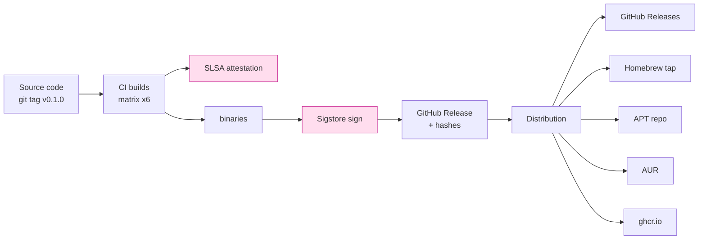

# 課堂 12.21 — 發布準備：版本、簽章、reproducible build

## 學前知道
- 前置課：12.1 (toolchain), 12.20 (docs), 12.9 (CI), 12.10 (interop)
- 預計閱讀時間：**35 分鐘**
- 必讀:
  - **SLSA framework v1.0**：[slsa.dev](https://slsa.dev) — supply chain integrity levels
  - **Sigstore documentation**：[sigstore.dev](https://sigstore.dev) — keyless signing of artifacts
  - **Reproducible Builds project**：[reproducible-builds.org](https://reproducible-builds.org)
  - **Apple Notarization / Developer ID Guide**
  - **Microsoft Authenticode + EV cert process**
- 自我反省問題:
  - 你 download 一個 GitHub release binary 後會驗 SHA / signature 嗎？
  - 你聽過 SLSA 嗎？知道 level 0 → level 4 之差別嗎？

## 動機

對 proxy / VPN binary，「supply chain safety」 = «user 跑你 binary 不被植 backdoor»。Bad signing = 整 user base RCE。

我們的 release 目標：
1. **Reproducible build**：reviewer 可重現 byte-identical binary
2. **Signed artifact**：cryptographic provenance；user 可 verify
3. **Multiple distribution channel**：減少 single point of failure
4. **Version policy clear**：user 能 informed-update
5. **Rollback friendly**：v0.1.1 broke 即可 retract



## 核心概念

### 1. Semantic versioning policy

```text
v MAJOR . MINOR . PATCH [- prerelease ] [+ build ]

MAJOR: spec wire-format breaking change (v0 → v1)
MINOR: spec extension (compatible), new feature
PATCH: bug fix, no spec change

v0.x.y : pre-1.0, anything may change
v0.1.0-rc.1 : release candidate
v1.0.0+sha.abc123 : build metadata
```

對 spec 與 impl 同步：

| Spec | Impl |
|---|---|
| v0.1.0 | v0.1.x (any patch impl v0.1.0 spec) |
| v0.2.0 | v0.2.x (new spec features) |
| v1.0.0 | stable; protected backward compat |

CI 強制：tag 只 `vX.Y.Z` 才 trigger release.

### 2. Release CI matrix

GitHub Actions:

```yaml
on:
  push:
    tags: ['v[0-9]+.[0-9]+.[0-9]+']

jobs:
  build:
    strategy:
      fail-fast: false
      matrix:
        target:
          - { os: ubuntu-22.04, triple: x86_64-unknown-linux-gnu }
          - { os: ubuntu-22.04, triple: x86_64-unknown-linux-musl }
          - { os: ubuntu-22.04, triple: aarch64-unknown-linux-gnu }
          - { os: macos-14, triple: x86_64-apple-darwin }
          - { os: macos-14, triple: aarch64-apple-darwin }
          - { os: windows-2022, triple: x86_64-pc-windows-msvc }
          - { os: ubuntu-22.04, triple: aarch64-linux-android }
    runs-on: ${{ matrix.target.os }}
    steps:
      - uses: actions/checkout@v4
      - uses: dtolnay/rust-toolchain@1.85.0
      - run: rustup target add ${{ matrix.target.triple }}
      - run: cargo build --release --target ${{ matrix.target.triple }}
      - run: ./scripts/strip-and-package.sh ${{ matrix.target.triple }}
      - uses: actions/upload-artifact@v4
        with:
          name: protoxx-${{ matrix.target.triple }}
          path: dist/protoxx-${{ matrix.target.triple }}.tar.gz

  sign-and-release:
    needs: build
    permissions:
      id-token: write
      contents: write
      attestations: write
    runs-on: ubuntu-22.04
    steps:
      - uses: actions/download-artifact@v4
      - name: Generate SLSA attestation
        uses: actions/attest-build-provenance@v1
        with:
          subject-path: |
            ./protoxx-*/protoxx-*.tar.gz
      - name: Sign with sigstore
        run: cosign sign-blob --yes ...
      - name: Create release
        uses: softprops/action-gh-release@v2
        with:
          files: |
            ./protoxx-*/protoxx-*.tar.gz
            ./protoxx-*/protoxx-*.tar.gz.sig
            ./SHA256SUMS
          generate_release_notes: true
```

### 3. Reproducible build

Rust 已大致 reproducible，但需控制：
- toolchain version fixed (`rust-toolchain.toml`)
- crate versions fixed (`Cargo.lock`)
- `--remap-path-prefix` 移除 build path
- `SOURCE_DATE_EPOCH` 控制 embed timestamp
- 不在 binary 內 embed hostname / username

驗證：CI 在 2 個獨立 runner build，diff binary：

```bash
$ sha256sum target/release/protoxx-server
abc123...
# Run again on different machine
$ sha256sum target/release/protoxx-server
abc123...   # must match
```

GoReleaser 對 Go binary 同理；Go 1.21+ 預設 reproducible if `-trimpath`.

### 4. SLSA levels

| Level | Requirement |
|---|---|
| 0 | No guarantees |
| 1 | Build process documented |
| 2 | Build is automated + version-controlled |
| 3 | Source + provenance signed + verifiable |
| 4 | Hermetic build + reproducible |

我們 v0.1 target **SLSA 3**：
- GitHub Actions 之 keyless OIDC + sigstore attestation
- 之後 v1.0 target SLSA 4 (hermetic via Nix or Bazel)

### 5. Sigstore: keyless signing

```bash
# Server signs:
cosign sign-blob --yes \
    --output-certificate=binary.crt \
    --output-signature=binary.sig \
    binary

# User verifies:
cosign verify-blob \
    --certificate=binary.crt \
    --signature=binary.sig \
    --certificate-identity-regexp='^https://github.com/yourorg/protoxx/.github/workflows/release.yml@refs/tags/v.*' \
    --certificate-oidc-issuer='https://token.actions.githubusercontent.com' \
    binary
```

優點：無 long-lived signing key 需 keep；CI workflow 的 OIDC token 即身分。
缺點：依賴 Sigstore trust root (Rekor + Fulcio)。

對 user 體驗：`cosign` 是新工具；對 conservative user 仍提供 traditional GPG signature.

### 6. SHA256SUMS file + GPG

```text
SHA256SUMS:
abc123def456...  protoxx-x86_64-unknown-linux-gnu.tar.gz
fed987cba321...  protoxx-aarch64-unknown-linux-gnu.tar.gz
...

SHA256SUMS.asc:  GPG signature of SHA256SUMS
```

User：

```bash
gpg --recv-keys [our key fingerprint]
gpg --verify SHA256SUMS.asc SHA256SUMS
sha256sum -c SHA256SUMS
```

雙保險：sigstore + GPG。

### 7. Notarization (macOS / Windows)

macOS: 必 Apple Developer ID 簽 + 上 notary service：

```bash
codesign --force --options runtime --timestamp \
    --sign "Developer ID Application: NAME (TEAMID)" \
    protoxx-server

xcrun notarytool submit protoxx-server.zip \
    --apple-id ... --team-id ... --password ...
```

否則 macOS Gatekeeper 拒。

Windows: EV cert（成本 $500+/年）讓 binary 不觸 SmartScreen warning。
我們對 v0.1：community-tier，不買 EV；接受 SmartScreen warning + 文件說明。

### 8. Distribution channels

```text
Primary:
  - GitHub Releases (sigstore + GPG signed)

Secondary:
  - Homebrew tap: brew install protoxx/tap/protoxx
  - Cargo: cargo install protoxx
  - AUR: yay -S protoxx-bin
  - APT: deb.protoxx.dev (signed repo)
  - RPM: rpm.protoxx.dev
  - Docker: ghcr.io/protoxx/server:v0.1.0
  - Android: F-Droid (signed apk)

Tertiary (community-maintained):
  - apk-Alpine
  - openwrt-feeds
```

每 channel 之 update 之 cadence + maintainership 在 docs 標清。

### 9. Reproducible Android apk

Android apk 需 signed by developer key（不能 keyless）。
建議：
- Store apk signing key in a hardware token (YubiKey)
- F-Droid mirrors with reproducible build verification

### 10. Release notes 寫法

```text
## v0.1.0 (2026-XX-XX)

### Highlights
- First public release.
- Spec v0.1.0 frozen.
- 32-platform binary (Linux/macOS/Windows/Android, x86_64/aarch64).

### New
- Adaptive shaping profile, HTTPS-browsing-like
- ML-KEM-768 hybrid handshake (opt-in)

### Changed
- Default congestion control switched to BBRv2

### Fixed
- (n/a, first release)

### Security
- See SECURITY.md

### Known issues
- iOS client not yet released; see roadmap
- 1Mb/s ceiling on Windows wintun (driver issue, not ours)

### Verification

\```
sha256sum -c SHA256SUMS
gpg --verify SHA256SUMS.asc
cosign verify-blob ...
\```

### Acknowledgments

Thanks to ... for review and feedback.
```

### 11. Rollback / retract

對 critical bug：
- 不刪除 GitHub Release（仍可被 reference）
- 加 `[YANKED]` label + release notes warning
- 推 v0.1.1 with fix
- 通告通道：blog post + GitHub Discussion + 中文 channels

`cargo yank` for crates.io / `npm deprecate` for npm 同理。

### 12. Backwards compatibility commitment

對 v0.1.0：no formal commitment（pre-1.0）。
對 v1.0.0：
- Spec wire-format 變更需 MAJOR version
- Default config breaking change 需 MAJOR
- Config file format 變更需 MINOR + migration tool
- API breaking 視 release impl 而非 spec

### 13. Build-time customization

不允許 user 自由改 default config 後分發為 «protoxx»（trademark 保護）。
contributing：提供 docker build for upstream-canonical binary；fork ok 但 必須 rename.

---

## 與我們協議設計的關聯

- **Part 12.20 docs**：本堂之 release notes / SECURITY.md 在 docs 引用
- **Part 12.22-23 paper**：artifact 之 reproducibility 對 USENIX AE 必要
- **Part 12.18 真實環境**：監測之 binary 必 signed，避免被 swapped

## 動手

1. 設 GitHub Actions release workflow；tag v0.1.0-rc.0 試跑
2. 驗證 cosign sign-blob + verify-blob 完整 round trip
3. 在 2 個獨立 machine reproducible build；diff 兩個 binary
4. 寫 v0.1.0-rc.0 release notes
5. 在 Homebrew tap 寫 formula；`brew install ./formula.rb` 試裝

## 自我檢查

1. SLSA 1 vs SLSA 3 之具體 requirement 差別?
2. Sigstore keyless 相對於 GPG signing 之 advantage / disadvantage?
3. Reproducible build 為何對 supply chain 是 P0?
4. macOS notarization 失敗會發生什麼？User 怎麼 bypass？
5. v0.1 vs v1.0 之 backward compat commitment 差別?

## 延伸閱讀

- *Trusted Computing's Reproducible Build* (Lamb, Zacchiroli, CACM 2022)
- *Reproducible Builds in Go* (Filippo Valsorda blog)
- *Supply-chain Security for Open Source Software* (NIST IR 8407)

---

## 研究級補遺

### 1. 學界詞彙

| 中文/口語 | 學界詞彙 |
|---|---|
| 供應鏈安全 | software supply chain security (SSCS) |
| 可重現建置 | reproducible build / bit-identical build |
| 來源證明 | provenance attestation; SLSA |
| 密鑰簽章 | binary signing; code signing |
| 信任根 | trust root; PKI; transparency log |

### 2. 對手分類學

| 對手 | 攻擊 | 防禦 |
|---|---|---|
| Upstream compromise | inject backdoor in source | code review + spec separation |
| Build infra compromise | malicious CI runner | hermetic + SLSA 4 |
| Distribution mirror compromise | replace binary on mirror | SHA + signature |
| Endpoint user | trick via fake update | signature + cert pinning |
| 國家級 actor (SolarWinds-style) | compromise dev key | hardware token + sigstore |

### 3. 形式化定義

**Build integrity**: $\forall$ binary $B$, $\exists$ provenance $P$ s.t. $\mathsf{Verify}(B, P, S) = 1$ for source $S$.
**Reproducibility**: $B_1 = B_2$ byte-identical for builds 1 and 2 of same $S$.

### 4. 領域的關鍵論文 / 規格 / 原始碼

1. **SLSA framework v1.0**
2. **Sigstore docs**
3. **Lamb-Zacchiroli Reproducible Builds CACM 2022**
4. **NIST IR 8407**
5. **SolarWinds report 2021** — 為何 supply chain 是 hot topic
6. **The Update Framework (TUF)** spec
7. **`actions/attest-build-provenance` source**

### 5. 我們協議的座標 / 設計取捨

- v0.1：SLSA 3 (sigstore-based)
- v1.0：SLSA 4 (hermetic Nix)
- 提供 sigstore + GPG dual signature
- 不買 EV cert（cost vs UX trade）

### 6. 必追資源 / 社群入口

- OpenSSF / Sigstore community
- SLSA TC
- TUF / in-toto community

### 7. 開放問題

1. **Hermetic Rust build**：Nix flake 是否能達 100% byte-identical？
2. **Long-tail platform**：MIPS OpenWrt build reproducibility — open
3. **Mobile signing key rotation**：Android apk 之 long-term key custody — hardware token + emergency fallback
4. **Public trust establishment for new project**：first-release 之 trust bootstrapping — open social engineering question
