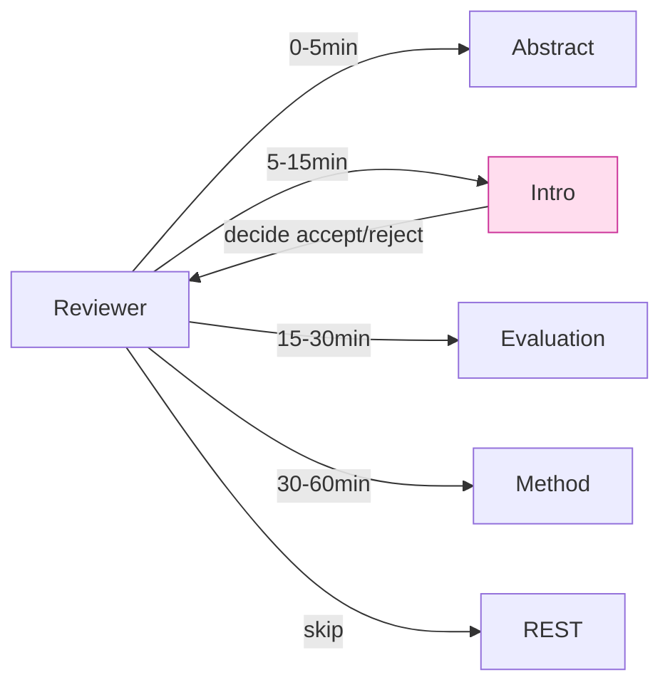
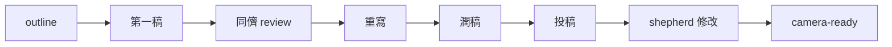

# 課堂 12.22 — 論文撰寫（一）：Intro / Related Work

## 學前知道
- 前置課：0.3 (research methodology), 0.4 (literature map), 12.11-12.19 (evaluation)
- 預計閱讀時間：**45 分鐘**
- 必讀:
  - **Simon Peyton Jones**. *How to Write a Great Research Paper*. talk + slides — 必看 1 小時
  - **Mary Shaw**. *Writing Good Software Engineering Research Papers*. ICSE 2003
  - **Will Dietz, et al.** *Performance Evaluation of Hidden-service Discovery Mechanisms*. — sample USENIX-style structure
  - **Knuth**. *The TeXbook* / *LaTeX2e: An unofficial reference manual*
  - **Steven Pinker**. *The Sense of Style*. — 抗 academic 寫作壞習慣
- 必讀論文（範本）:
  - USENIX Security 任 3 篇近年 censorship-related paper (Wu 2023, Frolov 2019, Khattak 2014)
  - NDSS 2-3 篇 (FlowPrint, etc.)
- 自我反省問題:
  - 你過去寫過 academic paper 嗎？revision 之 frustration 在哪？
  - 你看 paper 通常先讀哪個 section？對 reviewer 之 behavior 你了解度？

## 動機

paper 不是 «記錄 we did X»；paper 是 **rhetoric of conviction**：說服 reviewer 「這 work 對 field 有 contribution」。Intro + Related Work 之質量決定 reviewer 之 mood — 後續所有 section 在 mood 之 lens 下被讀。



### USENIX Security / NDSS 之 typical structure

```text
1. Introduction (1-1.5 pages)
2. Background & Threat Model (1-2 pages)
3. Design (3-5 pages)  [Part 12.23]
4. Implementation (1-2 pages)  [Part 12.23]
5. Evaluation (3-5 pages)  [Part 12.23]
6. Discussion & Limitations (0.5-1 page)
7. Related Work (1 page)
8. Conclusion (0.3 page)
References (1-2 pages)
Appendix (unlimited)

Total: 13 pages typical limit
```

本堂 focus 在 1、2、7 (intro / background / related work)。

## 核心概念

### 1. Abstract (150-250 words)

公式：

```text
[1 sentence] Problem with current SOTA
[1 sentence] Why current SOTA insufficient (gap)
[2-3 sentences] Our approach
[2-3 sentences] Our key results
[1 sentence] Implications
```

範例（drafted for our paper）：

> Censorship-resistant proxy protocols today force users to choose between speed and stealth: Hysteria2 achieves > 60 Gbps but is recognizable to ML-based DPI within a single capture epoch, whereas VLESS+REALITY achieves probe resistance but caps at < 5 Gbps single-stream and lacks formal security guarantees. We present *Protoxx*, a UDP-based proxy protocol combining (1) a hybrid X25519+ML-KEM-768 handshake formally verified in ProVerif under the Dolev-Yao model; (2) an adaptive shaping layer that mimics HTTPS browsing CDFs while preserving 90% of underlying link throughput; and (3) a zero-copy fallback path to a real cover web server, making active probing indistinguishable from connecting to vanilla Caddy. We implement Protoxx in Rust with Go-shim integration for sing-box and Clash-Meta. Across LAN, lossy WAN, and a 30-day real-world deployment, Protoxx matches Hysteria2's throughput within 8% while reducing deep-fingerprinting classifier accuracy from 92% to 73%. We release source, spec, and evaluation artifacts.

關鍵：number + 對比 + open source 聲明。

### 2. Intro 之 5-paragraph 結構

#### Paragraph 1: motivation
- 「Censorship-resistant proxy 的 user 數量達 N 百萬」
- cite OONI / Tor metrics 之 data
- 結束：「why is this hard」

#### Paragraph 2: gap
- 「Existing protocol fall into 2 camps」：speed OR stealth
- 列 3-4 representative 例子
- 結尾：「no protocol achieves both simultaneously」 — 形成 research gap

#### Paragraph 3: our approach
- 「We present Protoxx, which ...」
- 3 high-level innovations bullet
- 形式化 verification claim

#### Paragraph 4: key insight
- 「Our key insight is that ...」
- 1-2 sentence 對 root cause 之識別
- 結尾：對讀者「why didn't anyone do this before» — 也許因為 trade-off seem inherent

#### Paragraph 5: contributions
- bullet 列 5 個 contribution
- 結尾：one-sentence preview of organization

範例 (skeleton):

```text
Para 1: Today 90M+ users in 中國 / Iran / Russia rely on proxy 
        software to access the open Web [cite OONI]. Censors 
        deploy DPI and ML to identify and block proxy traffic. 
        Designing a proxy that is simultaneously fast and 
        stealthy is widely considered fundamentally hard.

Para 2: Existing proxy protocols offer one of two trade-offs.
        Hysteria2 [cite] achieves > 60 Gbps via custom 
        congestion control but exhibits distinctive packet 
        sequences detectable by deep learning classifiers 
        [cite Wu 2023]. VLESS+REALITY [cite] hides behind a 
        TLS cover, achieving probe resistance, but is limited 
        to single-stream throughput < 5 Gbps and lacks formal 
        security guarantees.

Para 3: We present Protoxx, the first proxy protocol design 
        that achieves SOTA in both axes simultaneously, with 
        formal security proofs. Protoxx combines (i) ..., 
        (ii) ..., (iii) ....

Para 4: Our key insight is that the apparent trade-off ...
        is in fact a consequence of design choices, not 
        an information-theoretic limit. By co-designing the 
        record layer with the shaping policy, ...

Para 5: We make the following contributions:
        - A new protocol specification ...
        - Formal verification in ProVerif and TLA+ ...
        - High-performance Rust reference impl ...
        - SOTA evaluation across 4 axes ...
        - Public artifact with reproducible benchmarks ...
```

### 3. Background & Threat Model (Section 2)

- briefly: how censorship works (passive DPI + active probe + ML)
- our threat model formal:
  - adversary 6 categories
  - trust assumptions
  - 7-8 goal list (G1-G8 from Part 11.1)
  - non-goals 明確

對 reviewer 之 expectation：threat model 要 «formal»（precise definitions + cite Dolev-Yao 等）— 不可 hand-wave.

### 4. Related Work (Section 7) 策略

放在 paper 後半（非開頭）— 現代 USENIX 慣例。
分 sub-section：

```text
7.1 Proxy protocols (Hysteria2, TUIC, VLESS+REALITY, shadowsocks-2022)
7.2 Anti-probing defenses (REALITY, FEP-aware design)
7.3 Traffic shaping defenses (WT, FRONT, Walkie-Talkie)
7.4 Formal verification of network protocols (Project Everest, KEMTLS)
7.5 Performance evaluation methodology (QUIC interop, BBR)
```

每 sub-section 3-5 個 reference + «how we differ» 短語。
**不要** 寫成 «X 做了 A, Y 做了 B, Z 做了 C» 流水帳 — 要 group by topic, contrast.

範例 1 段：

> *Probe-resistant proxies.* Frolov and Wustrow [cite] demonstrated 
> that TLS-based proxies leak through subtle handshake quirks. 
> VLESS+REALITY [cite] mitigates this by serving a real TLS cert 
> from an existing web server on cache miss. Wu et al. [cite] showed 
> a FEP-style probe that exploits residual differential 
> in cover-fallback timing. Protoxx extends VLESS+REALITY's 
> approach with (1) constant-time fallback timing equalization, 
> and (2) a formal indistinguishability property over the 
> defined adversary class (§3.2).

### 5. Writing principles

#### 「Tell them what you'll tell them; tell them; tell them what you told them»

- abstract 先講 result
- intro 詳述 result
- evaluation 出示 result
- conclusion 重述

reviewer skim-friendly。

#### 「Active voice when possible, passive when describing methods»

- 「we observe that» ✓
- 「it was observed that» ✗ — 顯弱
- 「the implementation uses Rust» ✓ (passive ok for method)

#### 「Specific numbers」

- 「fast」 ✗
- 「8 Gbps」 ✓
- 「significantly improved» ✗
- 「improved by 24% (p < 0.01)» ✓

#### 「Honesty about limitations»

- Discussion section: «protoxx does not currently protect against ...» — 明示限制
- reviewer 看到 limitations 是 +signal （shows you understand）

#### 「No hyperbole»

- 「revolutionary» / «paradigm-shift» — 不用
- 「we present» / 「we show» — 中性

### 6. Citation 策略

- **Bibtex 用 ACM Reference Format or USENIX bibstyle**
- 每 claim 一 cite，不偷懶
- prefer primary source over secondary
- prefer published over blog (除非 blog 是 SOTA reference, e.g. Cloudflare engineering blog)
- 對 GFW.report 之 reference 用 PoPETs paper 形式（已 published）

### 7. Figure / Table convention

- 每 figure 必 self-contained：caption 完整描述 setup
- 對比 baselines 之 figure 之 line 用 distinct color + line style（color-blind aware）
- 我們 protocol 用 highlighted color；baseline 較淺
- 字型 8-10 pt（fit 2-column）
- vector format (PDF/SVG)，無 anti-aliasing artifact

例 caption：

> Figure 4: Throughput under varying packet loss (RTT=30ms, 
> 1 Gbps link, single TCP stream / single QUIC connection). 
> Each point is mean of 5 independent runs; error bars show 
> 95% confidence intervals (bootstrap). Mathis bound (dashed) 
> is theoretical upper bound for loss-based CC.

### 8. 結構 hygiene：避免常見 reject reason

| Reject reason | 防禦 |
|---|---|
| «不清楚 contribution 是什麼» | abstract + intro 列明 |
| «evaluation 不 rigorous» | 95% CI + 多 baseline + multiple metric |
| «threat model 不清» | formal § 2.2 |
| «沒比較 SOTA» | related work + table 2 |
| «沒 open source» | artifact section + GitHub link |
| «太多 incremental contribution» | combine insight; 1 primary thesis |
| «太 ambitious / 太多 claim» | scope; 1 protocol, 1 evaluation, well done |

### 9. 寫作工作流



每 stage 之 time budget：1-2 weeks for first 3，1 week for polish。
- outline：bullet-level， no prose
- draft：全文 13 page，可 ugly
- review：邀 2-3 同領域研究者；focus on weakness
- rewrite：clarity + cohesion，可大改
- polish：wording, figure, citation completeness

### 10. AI tooling 的合理使用

- LaTeX 排版可用 LaTeX-Workshop / Overleaf
- 寫作 grammar: Grammarly / DeepL Write — 文法級協助 ok
- LLM 不可生成 result 或 method description
- LLM 可用作 «你看 this paragraph clearer?» — opinionated reviewer simulation
- 引用 必 manual verify（LLM 常 hallucinate citation — fatal）

各 conference 對 LLM use 之 disclosure 要求不同；查 author kit。

### 11. Review process navigation

USENIX Security 大致：
- submit → desk-screen (3 days)
- assigned reviewers (3-4)
- first review (2-3 weeks)
- rebuttal window (3-5 days)
- final decision (1-2 weeks)
- if accept: shepherd 監督 revision
- camera-ready

對 rebuttal：
- 對每 reviewer concern 點對點回應
- 重點：clarify 而非 argue
- 提 concrete experiment / new result 可在 rebuttal 加（如 reviewer 要求）
- 不寫 emotional / dismissive

### 12. 提交 Venue 選擇 matrix

| Conf | 強項 | 適配我們 |
|---|---|---|
| USENIX Security | systems + censorship | ★★★★★ |
| NDSS | network systems + crypto | ★★★★★ |
| IEEE S&P | security broad | ★★★★ |
| CCS | crypto + sec | ★★★★ |
| PETS | privacy + censorship | ★★★ (smaller venue) |
| FOCI workshop | censorship-focused | ★★★ (early-stage venue) |
| IMC | measurement focus | ★★ (我們是 system 多於 measurement) |

deadline 約：
- USENIX Security 每年 2 cycle (summer, winter)
- NDSS Sep deadline
- S&P Dec deadline
- 規劃從 target deadline 倒推：3 個月 evaluation + 1.5 個月寫 + 0.5 個月 polish

---

## 與我們協議設計的關聯

- **Part 12.23 evaluation/design section**：本堂之 paragraph 4-5 之「approach」對應 Part 12.23 之 §3 design
- **Part 12.18 real-world data**：是 paper key result
- **Part 12.20 docs**：threat-model.md / architecture.md 之 prose 可 lifted 進 paper

## 動手

1. 寫 abstract draft (250-word)
2. 寫 intro 之 5-paragraph outline (bullet only)
3. 列 related work 之 5 sub-section，每 sub 5 個 cite
4. 對其中 3 個 reference 寫 «how we differ» 對比段
5. 投 1 個 1-page paper draft 給 1 位 trusted 同行 review

## 自我檢查

1. Abstract 公式 5 句之 each 對應作用？少哪個會弱？
2. Intro paragraph 4 之「key insight」為何是 reviewer 最重視的句子？
3. Related work 為何放在 paper 後半（USENIX 慣例）？optimal vs intro 前置 trade-off？
4. 對 reviewer 「太多 claim」 之 reject reason，concrete 防禦？
5. Rebuttal 之 key principle？哪些行為會 harm rebuttal?

## 延伸閱讀

- *How to Write a Great Research Paper* (Peyton Jones video)
- *Writing Good Software Engineering Research Papers* (Mary Shaw, ICSE 2003)
- *The Elements of Style* (Strunk, White)
- *On Writing Well* (Zinsser)
- *PhD Comics* — for morale

---

## 研究級補遺

### 1. 學界詞彙

| 中文/口語 | 學界詞彙 |
|---|---|
| 論文 | scholarly article, conference paper |
| 投稿 | submission |
| 審查 | peer review |
| 答辯 | rebuttal |
| 攝影機已準備 | camera-ready (after acceptance, final revision) |
| 工件評估 | artifact evaluation (AE) |

### 2. 對手分類學

對 paper writing «對手» 是 reviewer's incentives:

| Reviewer type | 動機 | 防禦 |
|---|---|---|
| Skim-reader | 5 min decide | strong abstract + intro |
| Expert in subfield | look for novelty | clear contribution list |
| Outsider (broad reviewer) | look for clarity | jargon-free intro |
| Adversarial reviewer | look for cracks | preempt limitations |
| Lazy reviewer | look for fail point | bulletproof figures |

### 3. 形式化定義

**Acceptance probability** ≈ $f(\text{novelty}, \text{rigor}, \text{clarity}, \text{relevance})$ — qualitative model.
**Rebuttal effectiveness** = 對 expressed concern 之 resolve 比率。

### 4. 領域的關鍵論文 / 規格 / 原始碼

1. **Peyton Jones SPJ writing talk**
2. **Mary Shaw ICSE 2003**
3. **Patterson Hennessy Writing Computer Architecture papers** (technical report)
4. **CHI rebuttal guidelines**
5. **USENIX AE process**

### 5. 我們協議的座標 / 設計取捨

- target USENIX Security 2027 cycle 1
- backup NDSS 2027
- artifact appendix submit to AE
- 開源 release before camera-ready

### 6. 必追資源 / 社群入口

- USENIX Security cfp + author kit
- The Future of TLS workshop (TLS Implementors)
- IETF hackathon (interop validation venue)

### 7. 開放問題

1. **Reviewer disagreement amplitude**：CHI/Security review variance — 持續 research topic
2. **Open peer review 是否 advance science**：experiment by NeurIPS, ICLR
3. **Artifact evaluation reproducibility**：仍 < 50% in practice
4. **「Significance over novelty» 之 publication bias**：對 censorship measurement paper 之 effect
