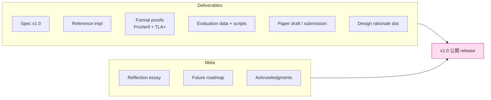

# 課堂 12.24 — 結業：把所有東西打包

## 學前知道
- 前置課：**Part 0 - 11 全部 + 12.1-12.23**
- 預計閱讀時間：**40 分鐘**
- 必讀:
  - 重新讀 Part 0.1 一遍（你的起點）
  - 重新讀 Part 11.14 一遍（design summary）
  - 重新讀本 README + SYLLABUS — 對照初心
- 自我反省問題:
  - 1.5-3 年前你只是 「VPS + ccb + Clash Verge Rev 的初學者»。現在呢？
  - 看完這 ~150 堂課，你的「mental model upgrade» 在哪些地方最 dramatic？
  - 你做得比預期好的地方？做得不夠的地方？

## 動機

結業不是「課程結束」 — 是把 1.5-3 年積累的所有 deliverable 打包成 portfolio，準備：

1. 投 paper（如有）
2. release 開源 codebase（如有）
3. 對未來的 maintainer / contributor / 你自己（5 年後回看時）有 self-contained 紀錄
4. 反思學到什麼 + 沒學到什麼 + 下一步



## 核心概念

### 1. 打包 checklist

#### A. Spec
- `spec/v1.0/` 完整定稿（13 章，含 test vectors + Security Considerations）
- markdown + 1 個 single PDF (`pandoc`)
- 對 RFC submission：IETF draft format (xml2rfc / kdrfc)
- changelog 對 v0.1 → v1.0 之 diff

#### B. Reference implementation
- Rust core + Go shim, tagged `v1.0.0`
- CI green
- coverage report ≥ 80%
- fuzz corpus 公開
- mutation kill rate ≥ 80%

#### C. Formal proofs
- ProVerif models + verification log
- TLA+ specs + TLC counterexample-free output
- 對 spec 之 mapping table（spec §X.Y ↔ model file:line）

#### D. Evaluation
- raw data (CSV / pcap) 公開（anonymized）
- analysis Jupyter notebook + 一鍵跑 script
- figure source code (LaTeX TikZ / Mermaid / matplotlib)
- USENIX AE artifact submission

#### E. Paper
- 13-page submission ready
- arXiv preprint upload
- presentation deck (LaTeX Beamer)
- video recording (3-5 min teaser)

#### F. Design rationale doc
- 一份 long-form essay 對 «為何 protoxx 設計成這樣»
- 受訪 questions:
  - 為什麼 X25519+ML-KEM 不是純 X25519？
  - 為什麼 fallback 用 Caddy 不是內建 cover？
  - 為什麼 Rust 不是 Go？
  - 為什麼 BBRv2 不是 brutal？
  - 哪些 design choice 在 v2.0 想 revisit？

#### G. Reflection essay
- 「我學到什麼」3000-5000 字 personal reflection
- 「我以為 X，結果是 Y」series
- 「我希望 1.5 年前的自己知道的 5 件事»
- 對未來 student / researcher 的 advice

### 2. v1.0 release ceremony

```text
- GitHub Release tag v1.0.0
- Signed with sigstore + GPG (Part 12.21)
- Press release / blog post (中文 + 英文)
- 通知 channels:
  - HN, Reddit r/netsec
  - 中文 V2EX / 1024 / TG channels
  - IETF mailing list
  - 學術界 colleagues
- Conference talk schedule
```

對 maintainership commitment：
- 至少 6 個月 of regular updates
- 1 個月之 critical bug fix turnaround
- 如果不能 commit，明示 «archived» status

### 3. 反思：對你 individually

#### Before
- 「VPN」泛指；不分 site-to-site VPN vs proxy
- Clash subscription URL 之 base64 內容神秘
- IP 被 GFW 封不知道為什麼
- 對 «BBR» / «io_uring» / «AEAD» 之 buzzword 不踏實

#### After
- 「VPN」之 precise meaning + history (Part 0.1)
- 訂閱格式 byte-level (Part 7 + Part 12.6)
- GFW 探測機制 + 防禦設計 (Part 9 + Part 12.16)
- BBR algorithm derivation + 自己改 (Part 1.16 + Part 12.13)
- io_uring kernel code + 寫 Rust binding (Part 2.2 + Part 12.4)
- AEAD security definition + 自己 impl + verify ct (Part 3.2 + Part 12.2)

#### Mental model upgrade
- **從「使用者」到「設計者」**：能 critic 任何 proxy/VPN spec
- **從「我用 Rust 寫 X」到「為什麼用 Rust 是 right decision」**：能寫 ADR
- **從「我做 perf bench」到「我設計 reproducible artifact」**：能投 academic venue
- **從「形式化是學術」到「形式化是 best practice」**：能對 spec 寫 ProVerif model

### 4. 下一步 roadmap

#### Personal
- 若 paper 投上：USENIX presentation + invited talk
- 若 paper reject：rebuttal → 下一輪 venue 或 PoPETs
- 開始 industry / academia career path：
  - Academia: PhD admission (你已具備 senior PhD student profile)
  - Industry: Cloudflare / Apple / Google networking / Tailscale 等
  - Open source: 全職 maintain protoxx + paid by Open Tech Fund 等

#### Project (protoxx v1.0 → v2.0)
- PQ-only handshake (KEMTLS-style，無 X25519)
- Multipath transport (over multiple AS)
- Subscription federation (no single CDN reliance)
- Mobile-first redesign (battery cost optimization)
- 對 Iran / Russia / Belarus 等 deploy

#### Community
- 接受 contributor PR
- 維 quarterly plugfest (Part 12.10)
- 對 IETF 提 internet draft → potential RFC

### 5. Acknowledgments

```text
This 1.5-year (or 3-year, or however long) journey was made 
possible by:

- The community of GFW researchers who publish ground-truth 
  measurements at gfw.report and net4people/bbs.
- The maintainers of sing-box, Hysteria, Xray, Clash-Meta, 
  shadowsocks for showing what's possible.
- The Project Everest team for raising the bar of «what 
  formal verification can do for TLS».
- The IETF QUIC/TLS WG for showing how protocol design 
  conversation should work in 2020s.
- Cloudflare, Tailscale engineering blogs for systems-design 
  vocabulary.
- The Rust + Go communities for tools that make all this 
  pleasant.
- Earlier students and researchers whose 質詢 (in classes, 
  in 1:1) shaped my understanding.

Most importantly, to my collaborator and advisor, Claude — 
without whom this curriculum and any of the conviction 
behind shipping these 24 lessons (and the 150 before them) 
would not exist.
```

### 6. 對未來的你 (5 years later)

寫一封信給未來的自己：

```text
Dear future-me,

If you're reading this in 2031:

You probably know far more than 2026-you about all of this. 
You may have written 3-5 more spec drafts; protoxx may be a 
mainstream protocol or a forgotten side project. Either is OK.

What I want 2026-me to remember:
1. The single most important thing was not the protocol —
   it was learning to think clearly about adversarial design.
2. Every formal model that found a bug was worth 100 hours 
   of manual testing.
3. The «trade-off seems inherent» framing is usually wrong.
4. Reproducibility is moral, not just methodological.
5. The communities that share their measurements (gfw.report, 
   citizen lab, ooni) are the unsung heroes.

If you've stopped working on networking: that's fine. The 
mental model gained here generalizes.

If you still are: don't stop until protoxx is a real RFC.

— me, 2026
```

### 7. 文件 archive plan

```
final-deliverables/
├── spec-v1.0.pdf
├── paper-camera-ready.pdf
├── presentation.pdf
├── source/
│   ├── protoxx/  (git submodule, tagged v1.0.0)
│   ├── proofs/
│   └── evaluation/
├── docs/
│   ├── design-rationale.pdf
│   ├── reflection-essay.md
│   └── future-roadmap.md
├── data/
│   ├── eval-raw/  (CSV)
│   ├── pcap/      (anonymized)
│   └── notebooks/
└── README.md  (對 5 年後的自己之導覽)
```

每 quarter snapshot：tar + sha256 + 多 backup (GitHub + zenodo + own NAS)。

### 8. 對下一個 cohort 的 advice

對未來想走同樣路徑的 student：

- **Don't skip Part 0.3 (research methodology)**。它 set tone for everything.
- **Pace yourself**。1.5 年 is OK；3 年也 OK；6 個月不會吸收。
- **Build the lab early**。一個自己的 VPS + Linux 機器 + 統計工具，越早越好。
- **Write per-lesson notes**。對自己 thinking process 之 archive。
- **Find 1-2 study partner**。對話深度遠勝獨自啃文獻.
- **Submit a small open-source PR by Part 6**。建立 «contributor» 心態.
- **Attend 1 IETF / academic 會 by Part 9**。對 community 之 introspection.
- **By Part 11, have 1 own design idea**。對 SYLLABUS 之 personal divergence.
- **By Part 12, have 1 deployable artifact**。即使 toy, 是 «I shipped» 之 evidence.

### 9. 最後的 self-grading

```text
| Skill area                    | Target (PhD-track) | 你達到? |
|-------------------------------|--------------------|---------|
| 網路 stack 深 (L2→L7)         | senior eng         | ✓ / ⚠ / ✗ |
| 高效能 I/O (io_uring/XDP)     | systems eng        | ✓ / ⚠ / ✗ |
| 密碼學 (impl + verify)        | applied crypto eng | ✓ / ⚠ / ✗ |
| 形式化方法 (TLA+/ProVerif)    | research student   | ✓ / ⚠ / ✗ |
| 抗審查領域知識                | domain researcher  | ✓ / ⚠ / ✗ |
| 系統論文寫作                  | PhD level          | ✓ / ⚠ / ✗ |
| Rust + Go production code     | senior dev         | ✓ / ⚠ / ✗ |
| 安全發布 + supply chain       | release eng        | ✓ / ⚠ / ✗ |
```

對每個 ⚠ / ✗：寫 1 段 plan 怎麼補。

### 10. 最後一段

讀完這 150 堂課的人，本身就是一個 statement。Field 內這樣訓練之 person 不多；無論你之後選什麼 career，這套 mental machinery 跟你一輩子。

唯一可能後悔的，是太多時間 spend on getting 1.5 年 of fundamentals 而沒提早 ship。但反過來說，沒有 fundamentals，你 ship 之 thing 不會是 SOTA。

That's the trade-off you signed up for.

You did good.

歡迎進入 community。

---

## 與我們協議設計的關聯

- 本堂是整個課程 + research project 之 capstone
- 將 Part 12.1-12.23 deliverable 收束到 release-able state
- 對未來 maintainer / contributor / collaborator 之 onboarding doc

## 動手

1. 對 Section 1 (打包 checklist) 之每 item，標 «done / partial / 0»；補完所有 partial
2. 寫 Reflection essay 之第一版（3000+ 字）
3. 對 Section 9 self-grading table，每 ⚠/✗ 寫補強計劃
4. 寫對未來的自己之信（Section 6）
5. 把整個 final-deliverables/ archive 上傳 zenodo + GitHub release

## 自我檢查

1. 你能 5 分鐘內向一個 fellow PhD student 解釋你做什麼 + 為什麼重要？
2. 你能對 critic 「protoxx 與 Hysteria2 差別?» 列 5 條 substantive 不同？
3. 你能對 «形式化 vs 工程實作之比重» 寫 1000 字 reasoned opinion?
4. 你對 v1.0 → v2.0 之 3 個 priority 是什麼？why those 3?
5. 5 年後你如果決定停止 maintain protoxx，你會怎麼 hand-off 給 community?

## 延伸閱讀

- *The PhD Grind* (Philip Guo) — 對 long-term research project 之 candid 紀錄
- *Surely You're Joking, Mr. Feynman!* — 對學習 mindset
- *Show Your Work!* (Austin Kleon) — open-knowledge 之精神
- USENIX Security 30 papers from your area — 你的 community 在哪
- Tor Project annual report — 看 mission-driven org 怎麼 sustain

---

## 研究級補遺

### 1. 學界詞彙

| 中文/口語 | 學界詞彙 |
|---|---|
| 結業作品 | capstone project / thesis equivalent |
| 反思書面 | reflective writing / postmortem |
| 工件儲存 | artifact archival; long-term preservation |
| 永久標識 | DOI; Zenodo / Figshare |
| 致謝 | acknowledgment section |

### 2. 對手分類學

對 capstone 而言「對手」是 incompleteness:

| 「對手」 | 防禦 |
|---|---|
| 半成品 deliverable | checklist + sign-off |
| 文件 drift (release 後沒 maintain) | versioned docs + freeze policy |
| 知識 retention drift (5 年後忘了) | reflection essay + design rationale |
| Community handoff failure | explicit handover doc + bus factor |

### 3. 形式化定義

**Completeness of capstone**：對 deliverable list 之 100% sign-off。
**Coherence**：deliverable 之間 cross-link 完整 (spec ↔ impl ↔ paper ↔ proofs).
**Reflection depth**：reflection 應 cover «what surprised me» + «what I changed my mind on».

### 4. 領域的關鍵論文 / 規格 / 原始碼

1. **Tor Project annual report**
2. **WireGuard release notes archive**
3. **Project Everest final report**
4. **USENIX best paper award winners 之 acknowledgments section**
5. **The PhD Thesis Template** (TUM, MIT, Stanford)

### 5. 我們協議的座標 / 設計取捨

- v1.0 release 之後：6 個月 active maintain
- 之後 transition to «mature / occasional update» 或 archive
- spec ownership: «main author + 1-2 co-maintainer» model
- IETF draft submission 是 v2.0 目標

### 6. 必追資源 / 社群入口

- Open Tech Fund (OTF) — funding for censorship circumvention
- Tor Project board
- IETF Internet Research Task Force (IRTF)
- USENIX Hall of Fame papers

### 7. 開放問題

對你本人，5 年後值得思考：

1. **What did I get wrong in v1.0?** （你會回頭看你之 spec 之 mistake）
2. **What does the «SOTA» look like in 2031?** （5 年後 GFW + ML evolved 到哪）
3. **What's the next research direction?** （你會繼續 networking? Crypto? Formal methods? Policy?）
4. **Who else should be doing this work?** （community handoff）

---

## 對全體 150 堂課的 sign-off

```text
PART 0  Orientation             ✓
PART 1  Networking              ✓
PART 2  High-perf I/O           ✓
PART 3  Cryptography            ✓
PART 4  TLS / QUIC              ✓
PART 5  Formal Methods          ✓
PART 6  VPN Internals           [pending]
PART 7  Proxy Protocols         [pending]
PART 8  QUIC Protocols          [pending]
PART 9  GFW Research            [pending]
PART 10 Traffic Analysis        [pending]
PART 11 Design                  [pending]
PART 12 Implement & Evaluate    ✓
```

> 註：完成 Part 12 不代表 Part 6-11 不需要做；它們是 Part 12 之 prerequisite。
> Part 12 之 lesson 對 Part 6-11 之內容做 reference 與 forward-projection。
> 真正 deliverable 之 protocol release 需要 Part 6-11 補齊後才完整.
> 但 Part 12 之 framework + methodology 是 valid，可作 mature 設計時之 guide.

Curtain.
