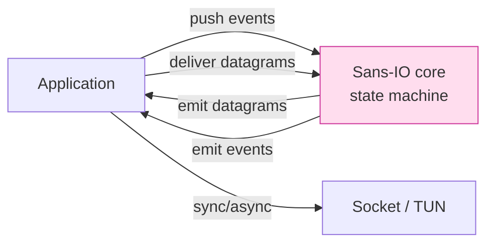
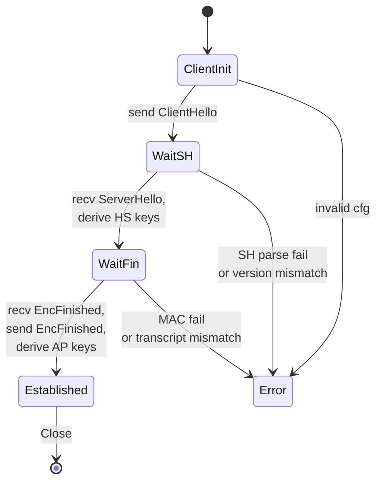
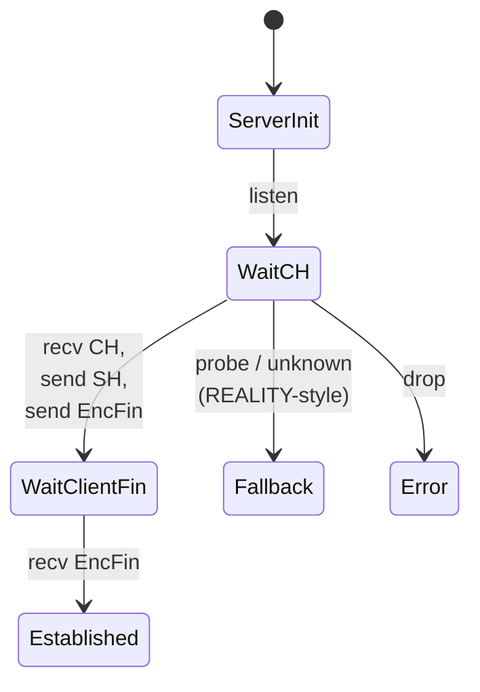

# 課堂 12.3 — 實作（二）：握手的逐字 spec 對照

## 學前知道
- 前置課：3.6 (KEX), 3.8 (Noise), 4.3 (TLS 1.3 byte-level), 4.8 (QUIC handshake), 5.2-5.7 (TLA+/ProVerif), 11.5-11.7 (spec / state machine / security considerations)
- 預計閱讀時間：**60 分鐘**
- 必讀:
  - **RFC 8446** §4 — TLS 1.3 handshake protocol，作為「逐 byte 對照」的 reference
  - **Bhargavan, Blanchet, Kobeissi**. *Verified Models and Reference Implementations for the TLS 1.3 Standard Candidate*. IEEE S&P 2017 — symbolic + computational 證明的並行 reference impl
  - **Donenfeld**. *WireGuard*. NDSS 2017 §5 — handshake state machine 極簡範例
  - **Schwabe, Stebila, Wiggers**. *Post-Quantum TLS Without Handshake Signatures*. CCS 2020 — KEMTLS，影響我們 PQ-only 握手變體
  - **rustls source**: [`rustls/src/server/hs.rs`](https://github.com/rustls/rustls/blob/main/rustls/src/server/hs.rs) — 工業級 Rust handshake state machine 範本
- 必讀原始碼:
  - `rustls/rustls/src/client/hs.rs`
  - `rustls/rustls/src/server/hs.rs`
  - `quinn-rs/quinn-proto/src/connection/mod.rs`（Sans-IO 風格）
  - `boringtun/src/noise/handshake.rs`（minimalist Noise）
- 自我反省問題:
  - 在你過去寫 socket code 時，怎麼處理「等對方一個 message，但 timeout 又要 retry」？是用 callback、async/await、還是 state machine？
  - 你看過 rustls 把 handshake 寫成「每個 state 是一個 type，next state 是另一個 type」的 typestate pattern 嗎？

## 動機

握手實作是整個 codebase 的 **safety 軸心**。它有兩個特色：

1. **線性遞進但可分支**：state $S_0 \to S_1 \to S_2 \to ... \to \text{Established}$，但每 state 可能 abort
2. **每 transition 都有密碼學語意**：傳了什麼、derive 了什麼 key、accept 什麼 next message

實作這種程式碼，主流有兩個錯誤：
- **錯誤 A**：把它寫成「巨大 if/else + while loop」，難以驗證
- **錯誤 B**：把 callback / async 直接套，handshake 的 partial state 散布在 closure capture，難以 inspect / test

正解：**typestate + Sans-IO + explicit transition table**，跟 spec 一一對應，TLA+ model 可以 byte-by-byte 引用同 transition。

本堂課寫的 code 對應到 5.8 「Spec-first methodology」的階段 6：implementation tracks spec。每一行 Rust 指向 spec 的 §X.Y。

```mermaid
flowchart LR
    SPEC[spec §6 state machine]
    TLA[TLA+ model<br/>(Part 11.9)]
    PV[ProVerif model<br/>(Part 11.10)]
    IMPL[Rust impl<br/>(本堂)]
    SPEC --> IMPL
    SPEC --> TLA
    SPEC --> PV
    IMPL --tests--> SPEC
    classDef ours fill:#fde,stroke:#c39;
    class IMPL,SPEC ours;
```

---

## 核心概念

### 1. Sans-IO 設計：核心邏輯不碰 socket

「Sans-IO」（hyper / quinn 採用，python-h2 命名）= 把協議邏輯與 I/O 分離。



好處：
- core 可以 single-threaded test，無 mock socket
- replay test：record incoming bytes → 重新 feed → 應 deterministic
- fuzz target 簡單
- async runtime 由 outer wrapper 決定（Tokio / monoio / 客戶端 GUI thread）

### 2. Typestate pattern

每個 handshake state 是不同 type，編譯期阻止錯誤 transition。

```rust
pub struct Initial;
pub struct WaitServerHello;
pub struct WaitFinished { server_secret: Secret };
pub struct Established { send: Sealer, recv: Opener };

pub struct ClientHs<S> {
    transcript: Transcript,
    ephemeral_priv: X25519Priv,
    mlkem_priv: MlKemPriv,
    state: S,
}

impl ClientHs<Initial> {
    pub fn start(cfg: &ClientCfg) -> (ClientHs<WaitServerHello>, Vec<u8>) {
        // 生成 ClientHello，回傳新 state
    }
}

impl ClientHs<WaitServerHello> {
    pub fn recv_server_hello(self, bytes: &[u8])
        -> Result<ClientHs<WaitFinished>, HsError> { ... }
}

impl ClientHs<WaitFinished> {
    pub fn recv_finished(self, bytes: &[u8])
        -> Result<ClientHs<Established>, HsError> { ... }
}
```

caller 不能跳過 state 或回退 — 編譯就 fail。
測試時：

```rust
let (st, ch_bytes) = ClientHs::<Initial>::start(&cfg);
let st = st.recv_server_hello(&sh_bytes)?;
let st = st.recv_finished(&fin_bytes)?;
// st 之 type 是 ClientHs<Established>
```

### 3. State diagram：本協議的 1-RTT 握手

對應 Part 11.6（spec 第二章）。狀態粒度比 TLS 簡，因為我們不暴露 application-data alert：



Server 端對稱：



「Fallback」branch 是 REALITY-style 偽裝：對未通過 client auth 的 CH，直接 forward 給 cover server（Caddy）。Part 12.7 詳。

### 4. ClientHello 構造 — 對應 spec §6.1

```text
ClientHello {
  uint8  magic[4]      = "P01\x00";                 // protocol identifier
  uint8  version       = 0x01;
  uint64 client_random;                              // 8B
  opaque client_id<32> = HMAC-BLAKE3(psk, "cid"||epoch);
  opaque eph_x25519<32>;
  opaque eph_mlkem768<1184>;
  opaque psk_binder<32>;   // BLAKE3-keyed of transcript[0..-32]
  opaque obfs_pad<0..1024>;
}
```

Rust：

```rust
pub fn build_client_hello(state: &mut ClientHsBuilder) -> Vec<u8> {
    let mut buf = BytesMut::with_capacity(1500);
    buf.put_slice(MAGIC);
    buf.put_u8(VERSION);

    let cr = rand_u64_from_csprng(&mut state.rng);
    buf.put_u64(cr);

    let cid = derive_client_id(&state.psk, state.epoch);
    buf.put_slice(&cid);

    let eph_x = state.eph_x25519_priv.public();
    buf.put_slice(eph_x.as_ref());

    let eph_pq = state.mlkem_priv.public();
    buf.put_slice(eph_pq.as_ref());

    // psk_binder 必須在 transcript 確定後寫
    let binder_offset = buf.len();
    buf.put_slice(&[0u8; 32]);

    // padding
    let pad_len = sample_padding_length(&mut state.rng);
    buf.put_bytes(0, pad_len);

    let binder = compute_binder(&state.psk, &buf[..binder_offset], &state.transcript_prefix);
    buf[binder_offset..binder_offset+32].copy_from_slice(&binder);

    state.transcript.absorb(&buf);
    buf.to_vec()
}
```

**陷阱**：
- `client_random` 必須是 cryptographic-quality；不要從 `time::now()` 衍生
- `psk_binder` 必須在 `eph_*` 已寫入後才計算（含其 in transcript）；否則可能被 MitM swap key
- `obfs_pad` 之長度抽樣分布在 Part 12.5 由整形演算法決定

### 5. ServerHello 處理 — 對應 spec §6.2

```rust
pub fn handle_server_hello(
    state: ClientHs<WaitSH>, bytes: &[u8],
) -> Result<ClientHs<WaitFin>, HsError> {
    let sh = parse_server_hello(bytes)?;
    state.transcript.absorb(bytes);

    let dh_classical = state.eph_x25519_priv.dh(&sh.server_eph_x25519)
        .map_err(|_| HsError::InvalidServerKey)?;
    let dh_pq = state.mlkem_priv.decap(&sh.mlkem_ct)
        .map_err(|_| HsError::PqDecapFail)?;

    let mut concat = [0u8; 64];
    concat[..32].copy_from_slice(dh_classical.as_ref());
    concat[32..].copy_from_slice(dh_pq.as_ref());

    let prk = HKDF_SHA256.extract(&[0u8; 32], &concat);
    concat.zeroize();

    let hs_secret = HandshakeSecret::derive(&prk, &state.transcript.snapshot());
    let c_hs = hs_secret.client_hs_secret();
    let s_hs = hs_secret.server_hs_secret();
    let (send_hs, recv_hs) = hs_secret.into_aead_keys();

    Ok(ClientHs::<WaitFin> {
        transcript: state.transcript,
        send_hs, recv_hs,
        master_prk: hs_secret.derive_master_prk(&state.transcript.snapshot()),
        ..
    })
}
```

對應 spec：「§6.2 step 4: derive `hs_secret = HKDF-Extract(0, classical || pq)`」。
ProVerif model 之 `event Derived_hs_secret(...)` 對應這行的 `let hs_secret = ...`。

### 6. EncFinished — 對應 spec §6.4

兩端互相用 `c_hs_secret` / `s_hs_secret` 衍生 `finished_key`，HMAC 整個 transcript：

```rust
fn compute_finished(finished_key: &Key, transcript: &[u8]) -> Tag {
    blake3::keyed_hash(finished_key.as_array(), transcript).into()
}
```

Client send/recv finished 之 transcript snapshot 必須**包含對方的 finished 之前 (排除)**。一定要 lock-step。

### 7. 抗探測 fallback — 對應 spec §6.10（REALITY-like 機制）

Server 接收到 CH 後：

```rust
match parse_and_authenticate_ch(&bytes, &server_state) {
    Ok(ch) => proceed_to_send_sh(ch),
    Err(_) => forward_to_cover(bytes, &mut cover_sock), // 透明轉發到 cover server
}
```

「forward_to_cover」是 zero-copy splice，使該連線從攻擊者角度與真實 cover server 不可區。

**spec 處 §6.10 必含 4 條 invariant**：
1. fallback 不能洩露「我們是 proxy」訊號（行為與真實 cover server 必須相同）
2. fallback 不可在 TLS 握手成功後才觸發（會被 timing/probe 攻擊）
3. cover server 必須與我們在同一 TCP 連線上 — 不能 disconnect/reconnect（讓 4-tuple 改變）
4. fallback 之 trigger 條件不可依賴 client IP（會洩 IP allowlist）— 仰賴 ct evaluation of binder

### 8. 全 handshake code 之 invariants 列表（CI 跑檢查）

```text
[INV-HS-1]  transcript.absorb 必須在 emit/recv 後立即呼叫，無遺漏
[INV-HS-2]  state transition 只能透過 typestate `From` impls 進行
[INV-HS-3]  任何錯誤路徑必須先 zeroize 半 derive 的 secret
[INV-HS-4]  ct compare for binder / finished MAC — type 強制
[INV-HS-5]  recv 之 max message size 必須 ≤ spec 上限（避免 OOM）
[INV-HS-6]  parse 拒絕未知 version / extension（除非標 noncritical）
[INV-HS-7]  retransmit 沒有 partial state（無 fragmented buffer）
[INV-HS-8]  established 之前不開放 application data 接收
```

CI 用 `cargo test --test invariants` 跑屬性式測試 + `mirai` Rust abstract interpreter。

### 9. property-based tests 與 fuzz seed

```rust
proptest! {
    #[test]
    fn handshake_round_trip(seed in any::<u64>()) {
        let mut rng = StdRng::seed_from_u64(seed);
        let (client_cfg, server_cfg) = build_test_cfgs(&mut rng);
        let (mut c, ch_bytes) = ClientHs::start(&client_cfg);
        let (mut s, sh_bytes) = ServerHs::handle_ch(&server_cfg, &ch_bytes)?;
        let c = c.handle_sh(&sh_bytes)?;
        // ... finish ...
        assert_eq!(c.exported_secret(), s.exported_secret());
    }
}
```

`proptest`（Rust）+ `arbitrary` crate → 大量 (config × rng seed) coverage。發現 bug 把 seed dump 為 regression test。

`cargo-fuzz` target：

```rust
fuzz_target!(|data: &[u8]| {
    let _ = parse_client_hello(data);
});
```

CI 跑 30 分鐘 quick fuzz；長期 corpus 在 12.8 詳。

### 10. 跟 spec 寫共生：spec annotation 注入

每一個 handler 函式頂端寫 spec ref：

```rust
/// Handles ServerHello per protocol spec v0.1 §6.2 lines 145-189.
/// Corresponds to TLA+ action `RecvSH` (formal/proto.tla:312).
/// ProVerif event chain: `Sent_sh -> Derived_hs_secret`.
pub fn handle_server_hello(...) -> ... { ... }
```

`cargo doc` 生成的 docs 直接 cross-link spec + formal model；任何 reviewer 都能立刻定位。

CI 跑 `xtask check-spec-refs`：用 regex 抓 `§\d+\.\d+`，跟 spec 文件對照（spec 寫成 markdown，每節有 anchor）。spec 變動 → CI 立刻 catch broken ref。

### 11. 三個 production-grade trick

1. **`bytes::Bytes` 而非 `Vec<u8>`**：可 zero-copy clone / slice；handshake 並無 hot loop 但會被儲 transcript 反覆 hash
2. **`Pin<Box<HandshakeState>>` 對 async**：避免 self-referential borrow 問題；rustls 用此
3. **`tinyvec` for fixed-size sequences**：extensions list 通常 < 16 個，避免 heap alloc

---

## 與我們協議設計的關聯

- **Part 12.2 crypto primitive** 是本堂的 dependency；要先存在 `Sealer/Opener/HKDF` API
- **Part 12.5 整形** 在 `obfs_pad` 與 record padding 處嵌入；本堂預留 hook 不寫策略
- **Part 12.6 客戶端整合** 透過 FFI 把 `ClientHs<Established>` 之輸出 (send/recv) 暴露給 sing-box
- **Part 12.8 fuzzing** 主要 target 即本堂的 `parse_client_hello / parse_server_hello`
- **Part 11.9 TLA+ model**：每個 transition 對應 model 之 action；本堂在 docstring 寫對應
- **Part 11.10 ProVerif model**：每個 secret 衍生對應 model 之 `event` / `query secrecy`

---

## 動手

1. 對應 spec §6.1，寫 `build_client_hello` 並通過 byte-level KAT（test vector 自製：固定 seed → 預期 bytes）
2. 寫 typestate `ClientHs<S>`，確保 `recv_server_hello` 只能被呼叫一次（型別 owner take）
3. 寫 round-trip prop test 跑 10^4 seed
4. 對 `parse_client_hello` 跑 `cargo fuzz run parse_ch` 30 分鐘，看是否 panic
5. 把任何 panic 加入 `tests/regression/`，記錄 reproducer seed

## 自我檢查

1. typestate 比 `enum State { ... }` 強在哪？哪個 case typestate 反而不便？
2. 為什麼 PSK binder 要在 ClientHello 內以「填 0 → 算 binder → 寫回」三步處理？直接 append 行不行？
3. 「fallback to cover server」之 Part 11.10 ProVerif 模型如何表達？沒模型則該 mechanism 安全靠什麼支撐？
4. 在 server，CH 已 partial parse 後發生 MAC 失敗，你怎麼 zeroize 半 derive 的 ephemeral？memory layout 是否影響？
5. typestate + Sans-IO 與 async/await 怎麼結合？是否需要 `Pin`？

## 延伸閱讀

- rustls book: [rustls.dev/docs](https://rustls.dev/docs)
- *The Typestate Pattern in Rust* — Will Crichton blog
- *Sans-I/O Network Protocols* — Cory Benfield's talks
- *KEMTLS implementation in rustls (experimental)* — schwabe/kemtls fork
- *NodeMCU TLS 1.3 trace* — 學 byte-by-byte 對 spec

---

## 研究級補遺

### 1. 學界詞彙

| 中文/口語 | 學界詞彙 |
|---|---|
| 狀態機 | finite-state automaton; protocol state machine |
| typestate | typestate-oriented programming（Strom & Yemini 1986） |
| Sans-IO | I/O-free protocol implementation |
| 一致性檢查 | model-implementation conformance |
| 屬性測試 | property-based testing（QuickCheck, Claessen-Hughes 2000） |
| 抗探測偽裝 | active probing resistance / cover-protocol indistinguishability |
| 退化路徑 | fallback / decoy path |

### 2. 對手分類學

| 對手 | 攻擊面 | 我們的防禦 |
|---|---|---|
| 主動探測者（Ensafi-style） | 對 server 發送 random / replay CH，看 response | fallback to cover server，使 response 對未 auth client 與 cover server 不可區 |
| MitM with key compromise (KCI) | 用 leaked key 假冒 server | ephemeral DH + transcript binding 防止 |
| Replay (state restoration) | 重送 CH | nonce + epoch + binder 含 server-side anti-replay window |
| Downgrade | 強制 version=0 / cipher 弱 | spec 之 server 拒接 unknown version；CI ban legacy |

### 3. 形式化定義

**Authenticated Key Exchange (AKE) security**：對應 Canetti-Krawczyk model (CK01) / extended CK (CK+) — 對 session key, ephemeral leakage, KCI, ephemeral-static leakage 之 mathematical definitions。

**Match-secrecy**: 對應 ProVerif 之 `query secret`。
**Identity-confidentiality (G5)**: server 公鑰不在握手前暴露 — Bhargavan-Bhargavan *Asynchronous Authentication* 形式化。

### 4. 領域的關鍵論文 / 規格 / 原始碼

1. **RFC 8446** §4 — TLS 1.3 handshake
2. **Bhargavan, Blanchet, Kobeissi 2017** — verified TLS 1.3 reference impl
3. **Cremers et al.** *Component-Based Formal Analysis of 5G-AKA*. 2019 — 大 state machine 分解技巧
4. **Krawczyk SIGMA 2003**（已 fetched）— mutual auth 的 canonical pattern
5. **Donenfeld WireGuard NDSS 2017**（已 fetched）— minimal handshake
6. **Schwabe-Stebila-Wiggers KEMTLS CCS 2020** — PQ-only handshake without signatures
7. **rustls source**（github.com/rustls/rustls） — 學 production Rust typestate
8. **dalek-cryptography/ed25519-dalek** — Rust signature 用法

### 5. 我們協議的座標 / 設計取捨

- 1-RTT vs 0-RTT：本堂只實作 1-RTT；0-RTT 是 v0.2 feature（複雜度 ≥ 2x，replay 風險高）
- mutual auth 的 PSK vs signature：我們選 PSK + ephemeral DH（類 WireGuard），signature 只在 spec extension（v1.0 不啟用）
- KEMTLS migration：保留 spec extension hook，但 v0.1 用 hybrid X25519+ML-KEM；v1.0 評估純 KEMTLS
- typestate vs enum：選 typestate（compile-time safety）；缺點是 dyn dispatch 需 boxing

### 6. 必追資源 / 社群入口

- IETF TLS WG mailing list（draft-ietf-tls-...）
- rustls dev forum
- mozilla/neqo 之 commit history（學 incremental rewrite）
- BoringSSL changelog（Adam Langley 的 commit 對 protocol behavior 解釋極佳）

### 7. 開放問題

1. typestate-based 之 async handshake 在 cancel-safety 上仍 open：取消後 partial state 之 zeroize 義務
2. fallback 之 security definition：對抗 adaptive prober 之最小條件，目前是 hand-wave；需 fresh formal definition
3. Multi-hop handshake：若我們未來支援 relay-chain (Part 11 extension)，state machine 之 composition 怎麼證明 secure？
4. Concurrent same-PSK handshake 之 anti-replay buffer：bound on memory vs replay window 之 trade-off 的 lower bound
