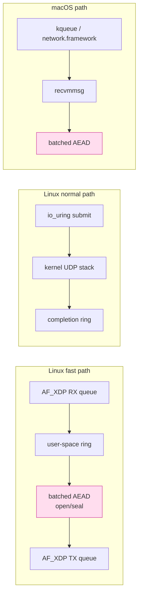
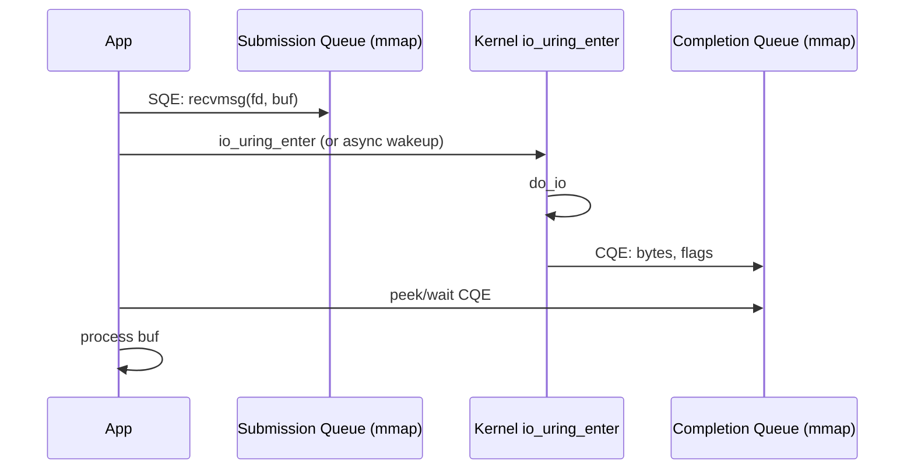

# 課堂 12.4 — 實作（三）：資料路徑（零拷貝 / io_uring / AF_XDP）

## 學前知道
- 前置課：1.10 (sockets), 1.13 (NIC), 2.1 (epoll), 2.2 (io_uring), 2.3 (zero-copy), 2.4 (XDP/eBPF), 2.5 (DPDK/AF_XDP), 2.10 (NUMA)
- 預計閱讀時間：**60 分鐘**
- 必讀:
  - **Axboe**. *Efficient IO with io_uring*. 2019 — 必讀，已 fetched
  - **Høiland-Jørgensen et al.** *The eXpress Data Path: Fast Programmable Packet Processing in the Operating System Kernel*. CoNEXT 2018 — 已 fetched
  - **Rizzo**. *netmap: a novel framework for fast packet I/O*. USENIX ATC 2012 — 已 fetched
  - **Han, Marshall, Chun, Ratnasamy**. *MegaPipe: A New Programming Interface for Scalable Network I/O*. OSDI 2012 — 已 fetched
  - **Jeong et al.** *mTCP: a Highly Scalable User-level TCP Stack for Multicore Systems*. NSDI 2014 — 已 fetched
  - **Karsten, Barghi**. *User-level Threading: Have Your Cake and Eat It Too*. SIGMETRICS 2020 — 對 Tokio vs glommio scheduler 設計影響
  - **Cloudflare**. *Cloudflare Architecture and how BPF eats the world*. 2019 blog series
- 必讀原始碼:
  - `tokio-rs/io-uring`（純 binding）
  - `bytecodealliance/io_uring_async` / `glommio`（thread-per-core async）
  - `cilium/ebpf` Go XDP loader / `aya-rs/aya` Rust XDP loader
  - `xdp-project/xdp-tutorial` 第 6-9 章
  - `wireguard-go/tun/` 對 mac OS / Linux TUN abstraction
- 自我反省問題:
  - 你了解一個 packet 從 NIC RX queue → kernel → userspace 走幾次 copy 嗎？
  - 你有用過 `MSG_ZEROCOPY` 嗎？知道它的 completion 機制與普通 `send()` 差在哪嗎？

## 動機

握手只佔一個 connection 的最初 5KB；之後 99.9% 的 byte 走 data path。你的 Part 12.12-12.14 throughput / CPU / RAM 數字都由本堂決定。

我們的目標：
- 單核 ≥ 10 Gbps userspace forwarding（與 Hysteria2 / TUIC v5 同級）
- p99 < 1ms 延遲
- AF_XDP 路徑單核 ≥ 25 Gbps（與 kernel WireGuard 同級）
- macOS 客戶端用 `recvmmsg`+TUN，目標 5 Gbps 單核（移動端足夠）

實作層三條 path：



---

## 核心概念

### 1. 「零拷貝」的層次與限制

「零拷貝」是一個 spectrum：

| 程度 | 例 | 何處仍有 copy |
|---|---|---|
| 完全零拷貝 | AF_XDP / DPDK | 無 (UMEM mmap)；但 crypto 必須在原 buffer in-place 操作 |
| Kernel-bypass 部分 | `splice` / `sendfile` | userland 不見得，但 kernel 對 page 仍可能 reference-counted copy |
| Userspace zero-copy | `MSG_ZEROCOPY` | kernel still copy meta；page pinning |
| 沒 zero-copy | recv to heap, encrypt, send | 兩次 copy（kernel→user→kernel） |

對我們協議的 reality check：**AEAD in-place** 是 SOTA 必備。Hysteria2 / quic-go 並未做完全 zero-copy；空間最大。

### 2. io_uring 流程：submit / completion ring



最大優點：syscall 攤銷（一次 `io_uring_enter` 可 reap 數十 CQE）。對 high pps server 是 game changer。

Rust 用 `tokio-uring`（compat mode）或 `monoio`/`glommio`（thread-per-core）：

```rust
let ring = io_uring::IoUring::new(4096)?;
let (submitter, mut sq, mut cq) = ring.split();

for slot in 0..N {
    let entry = opcode::RecvMsg::new(types::Fd(fd), &mut msghdr[slot] as *mut _)
        .build()
        .user_data(slot as u64);
    unsafe { sq.push(&entry)?; }
}
submitter.submit_and_wait(1)?;

for cqe in &mut cq {
    let slot = cqe.user_data() as usize;
    handle_packet(&mut bufs[slot][..cqe.result() as usize]);
    // re-arm SQE
}
```

**陷阱**：
- buffer lifetime — kernel 仍持有時 user 不能 free → 用 fixed buffers + buffer group
- 在 multi-thread share ring：每 thread 自己 ring；用 `IORING_SETUP_SQPOLL` 啟用 kernel poll thread
- 對 macOS：無 io_uring；用 `recvmmsg` 配 kqueue

### 3. recvmmsg / sendmmsg：portable 半批次

對 macOS / older Linux：`recvmmsg(fd, msgvec[N], N, flags, timeout)` 一次拿 N 包：

```rust
let mut iovecs: [iovec; 64] = ...;
let mut mmsghdrs: [mmsghdr; 64] = ...;
for i in 0..64 {
    iovecs[i] = iovec { iov_base: bufs[i].as_mut_ptr() as _, iov_len: 1500 };
    mmsghdrs[i].msg_hdr.msg_iov = &mut iovecs[i];
    mmsghdrs[i].msg_hdr.msg_iovlen = 1;
}
let n = unsafe { recvmmsg(fd, mmsghdrs.as_mut_ptr(), 64, 0, std::ptr::null_mut()) };
for i in 0..n as usize {
    let len = mmsghdrs[i].msg_len as usize;
    handle_packet(&mut bufs[i][..len]);
}
```

vs `recvmsg` 單包：amortize syscall 30-50x。

GSO/GRO + UDP segmentation offload：對 large packet 可在 NIC level 切片，userspace 看似一大塊。Linux 5.x 起穩定（`UDP_SEGMENT` socket option）。

### 4. AF_XDP 結構

```mermaid
flowchart TD
    subgraph Userspace
        UMEM[UMEM<br/>shared mmap memory]
        UMEM --> FQ[Fill ring<br/>給 kernel 用]
        UMEM --> CQ2[Completion ring]
        UMEM --> RX[RX ring]
        UMEM --> TX[TX ring]
    end
    subgraph Kernel
        XDPP[XDP program<br/>(BPF, in kernel)]
        XDPP --> DRV[NIC driver<br/>zero-copy mode]
    end
    DRV <-- bidirectional --> UMEM
    DRV --> FQ
    DRV --> RX
    UMEM --> XDPP
    classDef ours fill:#fde,stroke:#c39;
    class UMEM,XDPP ours;
```

關鍵：
- UMEM 是固定 mmap (通常 4MB-256MB 多 page)；NIC 直接 DMA 到 UMEM
- XDP 程式選擇 redirect 到 AF_XDP socket（`XDP_REDIRECT` + `bpf_redirect_map`）
- userland kernel 共享：無 copy
- Zero-copy mode 要 NIC driver 支援（ixgbe, i40e, mlx5）；fallback copy mode 比 normal kernel UDP 略慢但仍可用

Rust binding：`xdp-rs` (Cloudflare) / `aya-rs/aya` (XDP program in Rust)。Go：`asavie/xdp`、`cilium/ebpf`。

**陷阱**：
- NIC IRQ + softirq 與 user thread 對 core affinity 必須對齊：用 `RPS` / `RFS` + cpuset
- UMEM frame size 與 jumbo frame：標準 2048B，jumbo 需 4096B+
- multi-queue NIC：每 queue 一個 AF_XDP socket；user thread 對應；scale linear

### 5. 加密與資料路徑融合

**反例（壞 design）**：

```text
recv → copy to encrypt_buf → encrypt → copy to send_buf → send
                                ↑ 2 extra copies, 2 extra allocs
```

**正解**：

```rust
// 接收緩衝直接是 ciphertext+tag；decrypt in-place
let pkt = &mut umem.frame_mut(slot);
let (cipher, tag) = pkt.split_at_mut(pkt.len() - 16);
opener.open_in_place(nonce, aad, cipher, tag)?;
// 不複製；payload 就在 pkt[0..pkt.len()-16]

// 反方向：先預留 16B tail
let pkt = &mut umem.frame_mut(slot);
pkt.truncate(payload.len() + 16);
pkt[..payload.len()].copy_from_slice(payload);  // 唯一 copy（從 TUN 進來）
let (pt, tag_slot) = pkt.split_at_mut(payload.len());
let tag = sealer.seal_in_place(nonce, aad, pt)?;
tag_slot.copy_from_slice(&tag);
```

唯一拷貝：「從 TUN read 到 UMEM frame」。若 TUN driver 也支援 zero-copy (`IFF_NAPI_FRAGS`)，可省此。

### 6. Batched AEAD：amortize crypto cost

```rust
pub fn seal_batch(
    sealer: &Sealer,
    pkts: &mut [Packet],
) -> Result<(), Error> {
    // 1. 排序：相同 stream key → 集中
    // 2. 對每包：產 nonce, 計 AAD
    // 3. 呼叫 ring's seal_in_place 多次（SIMD utilize）
    for p in pkts.iter_mut() {
        let nonce = nonce_from_seq(&sealer.iv, p.seq);
        sealer.seal_in_place(nonce, &p.aad, &mut p.payload)?;
    }
    Ok(())
}
```

未來可進一步：**AVX-512 ChaCha20** 在單次 call 處理 8 個 block（512B）。`ring` 已內建。

### 7. NUMA / IRQ affinity / RSS

對 server 拿好 single-core 數字後，scale 到 N core 必須做：

| 設定 | 為什麼 |
|---|---|
| `irqbalance off; smp_affinity_list` 設每 NIC RX queue → 一 core | 避免 cross-NUMA cache miss |
| `RSS hash` 設 RX queue 數 = core 數 | 各 core 處理 disjoint flow |
| user thread `sched_setaffinity` 對應 RX queue core | 同上 |
| `mlock(MAP_LOCKED)` UMEM | 避免 swap |
| `transparent_hugepage=madvise` + `MADV_HUGEPAGE` | 減 TLB miss |
| `numactl --cpubind=0 --membind=0` 起 proxy | 對齊 NUMA node |

`perf stat -d` 可看 cache miss rate；目標 < 5%。

### 8. TUN driver 細節

Client 端：要把系統 traffic 引到 proxy。三種 strategy：

1. **System proxy (HTTP/SOCKS)**：簡單，但只攔截 HTTP-aware app；現代 mobile/desktop 普遍用 SOCKS5 + PAC
2. **TUN device**：建虛擬網卡，系統 default route 指過去；攔截一切 IP 流量
3. **eBPF redirect**（Linux only）：cgroup-based per-process redirect

我們選 TUN + 路由表，跟 sing-box / Clash-Meta 一致。

TUN 在 Linux：

```rust
let mut tun = tun::Configuration::default()
    .name("utun42")
    .address("198.18.0.1")
    .destination("198.18.0.2")
    .netmask("255.255.255.0")
    .up()
    .build()?;
// tun.read(&mut buf)? -> ip packet
```

在 macOS：用 `utunX` (kernel utun) 或 user mode `tun-darwin`，後者效能佳但需 root（無 wifi 改變）。Apple 推 `NetworkExtension` 框架（NEPacketTunnelProvider）— 但要 entitlement。

**陷阱**：
- macOS 上 utun 包含 4B prefix (AF_INET / AF_INET6)；Linux 沒有 → 抽象 layer 必須處理
- MTU：TUN 預設 1500；over-the-wire MTU - overhead = TUN MTU。對 ChaCha20-Poly1305 overhead 16B + header 32B → TUN MTU = 1452。錯 MTU 觸發 fragmentation，吞吐崩
- Windows：用 wintun（WireGuard 推），效能比 OpenVPN tap 好 3-5x

### 9. 流控與 pacing（與 Part 11 spec 的 reshaping 對接）

對 UDP-based 協議，沒有 TCP 的 in-kernel pacing；要 user-space pacing。
參考 quic-go 的 `pacer`：

```rust
pub struct Pacer {
    last_sent: Instant,
    interval: Duration, // = MSS / bandwidth_estimate
}

impl Pacer {
    pub fn next_send_time(&mut self) -> Instant {
        self.last_sent + self.interval
    }
    pub fn record_sent(&mut self, now: Instant) {
        self.last_sent = now;
    }
}
```

與 BBR / CUBIC congestion control 整合：估 bottleneck bandwidth，pacing rate = `1.0 - 1.25 × bw`。
Hysteria 之 brutal CC 直接由 user 設 bandwidth（強悍但對網路不友善）— 我們的 spec 預設 BBRv2 風格 self-tuning。

### 10. 評估清單（給 12.12）

```text
[BENCH-DP-1]  單流 throughput at 0% loss: ≥ 10 Gbps (Linux normal path)
[BENCH-DP-2]  AF_XDP single-core: ≥ 25 Gbps
[BENCH-DP-3]  io_uring 對比 epoll baseline: +30% pps
[BENCH-DP-4]  macOS recvmmsg path: ≥ 5 Gbps
[BENCH-DP-5]  p50 latency: < 200µs; p99 < 1ms
[BENCH-DP-6]  CPU 利用率：encrypt+forward < 50% of single core at 10 Gbps
[BENCH-DP-7]  記憶體：每 100k flow < 256MB RSS
```

跑 `perf stat -e cache-misses,cycles,instructions,branch-misses` 與 `bpftrace` profile，確認 hot path 沒 unexpected syscall。

---

## 與我們協議設計的關聯

- **Part 12.5 整形**：本堂預留 hook（pacing layer）給整形演算法插入；padding payload 由整形決定
- **Part 12.11-12.14**：所有 benchmark 對本堂的 hot path
- **Part 11 spec §7**：MTU、PMTUD、packet size 上限要與本堂協調
- **Part 9 GFW 反制**：QoS layer 可能對 UDP 高 pps 降速；本堂需測 loss profile
- **Part 2.10 NUMA**：對齊 RSS + IRQ 即本堂工程化的延伸

---

## 動手

1. 寫 `proto-dp` crate，提供兩個 trait：`AsyncDatagramSocket`（io_uring）+ `XdpSocket`（AF_XDP）。實作 echo server
2. 對 echo server 跑 `iperf3 -u -b 0 -t 30`，量 single-core 上限
3. 開 AF_XDP zero-copy mode；對相同硬體比較
4. 用 `perf record -g` 抓 flamegraph，看 hot function；理想是 80% 時間在 AEAD
5. 換 io_uring `SQPOLL` mode，看 pps 提升

## 自我檢查

1. 為什麼 io_uring 對 high-pps 比 epoll 快？syscall 數差幾倍？
2. AF_XDP zero-copy mode 與 copy mode 區別？對於不支援 driver 的 NIC 用 copy mode 仍有意義嗎？
3. 在 NUMA 兩 socket 機器，proxy 程式不做 NUMA-aware 設定會發生什麼？預期效能下降多少？
4. macOS 沒有 io_uring，我們的 client 怎麼做到 5 Gbps？瓶頸是 TUN 還是 crypto？
5. AEAD in-place 與 separate buffer 之差別在於哪些 cache line？

## 延伸閱讀

- Axboe blog: [kernel.dk](https://kernel.dk) 之 io_uring updates
- *XDP Tutorial*: [github.com/xdp-project/xdp-tutorial](https://github.com/xdp-project/xdp-tutorial)
- Cloudflare blog: *Programming socket lookup with BPF* / *Linux conntrack*
- *BPF Performance Tools* (Gregg) 第 10 章 networking
- *Network Acceleration with FlexNIC*（Kaufmann et al., OSDI 2016）— hardware offload 視角

---

## 研究級補遺

### 1. 學界詞彙

| 中文/口語 | 學界詞彙 |
|---|---|
| 零拷貝 | zero-copy I/O; kernel-bypass networking |
| 批次系統呼叫 | syscall batching; submission/completion ring |
| 快速資料路徑 | fast data path (XDP / DPDK) vs slow path |
| 軟中斷 | softirq, NAPI polling |
| 對齊核心 | core / IRQ affinity, NUMA locality |
| 速率整形 | traffic pacing / shaping; congestion-window pacing |
| 載入分散 | RSS (Receive-Side Scaling), RPS, RFS |

### 2. 對手分類學（對 datapath）

| 對手 | 攻擊 | 我們的防禦 |
|---|---|---|
| 流量整形 attacker (中間 ISP) | drop / rate-limit UDP | 自帶 congestion control + 多 path / over-TCP fallback |
| Cache side-channel co-tenant | flush+reload AES T-table | 用 AES-NI / ChaCha — 無 T-table |
| Memory-bandwidth contention | DoS by NUMA-cross writes | NUMA pin |
| TLP-level DoS | 大量小包打滿 PPS | XDP early-drop unknown 4-tuple |
| Slowloris-UDP | 半完成 handshake 大量留 state | handshake cookie + LRU eviction |

### 3. 形式化定義

**Worst-case packet processing latency** $L_{p99}$：對 stationary workload $W$, $\Pr[L > L_{p99}] = 0.01$。
**Throughput goodput** $T$：bytes/sec userful delivered to app；vs raw line-rate。
Pacing 對 throughput 影響：Floyd-Jacobson 模型；BBR 之 BtlBw × min RTT 推得。

### 4. 領域的關鍵論文 / 規格 / 原始碼

1. **Axboe io_uring 2019**（fetched）
2. **Høiland-Jørgensen XDP CoNEXT 2018**（fetched）
3. **Rizzo netmap ATC 2012**（fetched）
4. **Jeong mTCP 2014**（fetched）
5. **Han MegaPipe 2012**（fetched）
6. **Cardwell BBR CACM 2017**（fetched）
7. **DPDK Programmers Guide** — 設計參考
8. **`include/uapi/linux/io_uring.h`** — 第一手 spec
9. **`tools/lib/bpf/libbpf.h`** — XDP loader

### 5. 我們協議的座標 / 設計取捨

- 對 Linux server：必走 io_uring；XDP 作 v0.2 加速
- 對 Windows server：用 RIO (Registered I/O)；非 mainstream
- 對 mobile：power efficiency > 極限 throughput；不用 io_uring（不適用），用 batched recvmmsg
- 是否需 DPDK：跳過。adoption 門檻 + license + 取捨 ≠ open source proxy 的精神

### 6. 必追資源 / 社群入口

- LKML / netdev mailing list
- Linux Plumbers conference (networking track)
- io_uring mailing list (`io-uring@vger.kernel.org`)
- xdp-newbies mailing list
- Cloudflare engineering blog (networking)

### 7. 開放問題

1. **io_uring + crypto offload**：Linux 6.x 起的 `IORING_OP_CRYPT`（experimental）— 是否值得用？kernel AEAD 與 userspace 性能差距
2. **AF_XDP + SmartNIC**：把 AEAD offload 到 NIC（Mellanox BlueField）— SOTA proxy 是否值得？對開源社群門檻太高
3. **Multipath data path**：spec v1.0 是否支援 simultaneous send over 多 path？complexity vs robustness
4. **Userspace TCP stack**：對協議若選 TCP-based fallback，是否值得 ship mTCP fork？或繼續 kernel stack？
