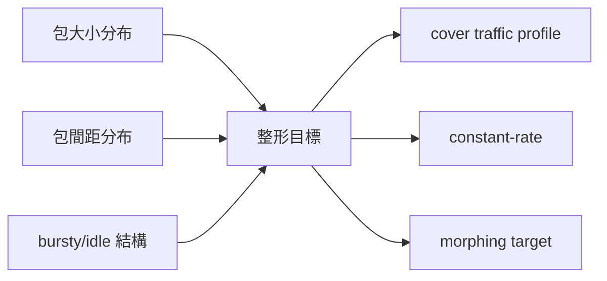

# 課堂 12.5 — 實作（四）：流量整形落地

## 學前知道
- 前置課：10.1-10.10 (traffic analysis 全部), 11.3-11.4 (整形策略 design choice), 12.4 (data path)
- 預計閱讀時間：**50 分鐘**
- 必讀:
  - **Wright, Coull, Monrose**. *Traffic Morphing: An Efficient Defense Against Statistical Traffic Analysis*. NDSS 2009 — 整形理論奠基
  - **Dyer, Coull, Ristenpart, Shrimpton**. *Peek-a-Boo, I Still See You: Why Efficient Traffic Analysis Countermeasures Fail*. S&P 2012 — 整形 lower bound
  - **Cai, Nithyanand, Wang, Johnson, Goldberg**. *A Systematic Approach to Developing and Evaluating Website Fingerprinting Defenses*. CCS 2014
  - **Wang, Goldberg**. *Walkie-Talkie: An Efficient Defense Against Passive Website Fingerprinting Attacks*. USENIX Security 2017
  - **Wu, Wang, Wang, Eckert**. *Detecting Probe-Resistant Proxies via Active TLS Probing*. USENIX Security 2023（fetched as wu-fep-detection.md）
  - **Houmansadr, Brubaker, Shmatikov**. *The Parrot Is Dead: Observing Unobservable Network Communications*. S&P 2013（fetched）
- 必讀原始碼:
  - `xtls/Xray-core` reality 整形部分
  - `apernet/hysteria/core/cs.go` 之 padding 與 send 整形
  - obfs4：[`yawning/obfs4` `obfs4proxy/obfs4.go`](https://gitlab.com/yawning/obfs4)
  - `meek` 的 cover-traffic 邏輯
- 自我反省問題:
  - 你能想像「Padding 為什麼可能反而暴露 proxy」嗎？
  - 你以為「random padding」夠強嗎？看完本堂回答能改變嗎？

## 動機

Part 10 教你 GFW / 進階 traffic analyzer 用什麼 feature 抓 proxy；Part 11 設計時你選了整形策略；現在要把策略變成 code。三件事決定成敗：

1. **整形不破壞 throughput**：壞整形會把 10 Gbps 變 1 Gbps
2. **整形不引入新指紋**：random padding 的 entropy 本身就是 feature
3. **整形可動態切換 profile**：依鏈路條件（移動 / wifi / VPS）/ cover traffic 模式（HTTPS 瀏覽 / 視訊 / 下載）切換

本堂課把這三條翻譯為 **可量化的 API**：

```rust
pub trait ShapingProfile {
    fn next_send_delay(&mut self, ctx: &SendCtx) -> Duration;
    fn next_padding_len(&mut self, ctx: &SendCtx) -> usize;
    fn cover_packet(&mut self) -> Option<Vec<u8>>; // 主動發 cover
    fn name(&self) -> &'static str;
}
```

實作者寫 profile；config 載入時動態 plug-in。

```mermaid
flowchart TD
    APP[Application data]
    SCH[Shaping scheduler]
    Q[per-flow queue]
    PAD[Padding generator]
    PACE[Pacer + token bucket]
    OUT[Datagram out]
    APP --> Q
    Q --> SCH
    PAD --> SCH
    SCH --> PACE
    PACE --> OUT
    CFG[Profile<br/>(YouTube-like / HTTPS / TUIC)] --> SCH
    classDef ours fill:#fde,stroke:#c39;
    class SCH,PAD,PACE ours;
```

---

## 核心概念

### 1. 整形維度三軸



主流整形策略：

| 策略 | 維度 | 代價 (bandwidth overhead) | 抗 ML 強度 |
|---|---|---:|---:|
| **No shaping** | - | 0% | 弱 (baseline) |
| **Random padding** | size only | 10-30% | 弱 — 仍可看 timing |
| **Constant rate** | timing+size | 100-200% | 強，但破壞 throughput |
| **Traffic morphing**（Wright 2009） | size | 10-50% | 中-強，但 timing 仍 leak |
| **Cover traffic injection** | all | 30-100% | 強 |
| **Walkie-Talkie**（Wang 2017） | size+timing | 30% | 強（half-duplex 模仿） |
| **Regulator / FRONT**（Gong-Wang USENIX 2020） | front-loaded burst | 70% | 強 (defeats SOTA WF) |
| **TrafficSliver**（De la Cadena CCS 2020） | size+path | 50% | 強（multipath） |

**我們的協議**選 **Adaptive Profile**：依環境 + cover traffic library 切換，預設 「HTTPS-browsing-like」 profile，cost ≈ 25% overhead。

### 2. Pacing：精準 send-time 控制

```rust
pub struct Pacer {
    bucket: f64,
    last_refill: Instant,
    rate_bps: f64,
}

impl Pacer {
    pub fn poll_send(&mut self, now: Instant, pkt_len: usize) -> Option<Duration> {
        let elapsed = (now - self.last_refill).as_secs_f64();
        self.bucket = (self.bucket + elapsed * self.rate_bps / 8.0)
                       .min(self.rate_bps / 8.0 / 1000.0); // ≤ 1ms 之 burst
        self.last_refill = now;
        if self.bucket >= pkt_len as f64 {
            self.bucket -= pkt_len as f64;
            None // 可立刻送
        } else {
            let wait_bytes = pkt_len as f64 - self.bucket;
            let wait = Duration::from_secs_f64(wait_bytes / (self.rate_bps / 8.0));
            Some(wait)
        }
    }
}
```

**配合 `timerfd_create` (Linux) / `kqueue EVFILT_TIMER` (macOS)**：避免 busy-wait。

**精度問題**：Linux scheduler 預設 jiffies 1ms；想要 < 100µs 精度需要 `SCHED_FIFO` + `prctl(PR_SET_TIMERSLACK)`。或用 io_uring 的 `IORING_OP_TIMEOUT` (kernel 端 hi-res timer)。

### 3. 包大小整形

#### 方法 A：Padding 到分布 target

```rust
fn next_padding_len(payload_len: usize, profile: &SizeProfile) -> usize {
    // profile 內含 CDF of target size distribution
    let target = profile.sample(payload_len);
    if target > payload_len + 16 + HEADER {
        target - payload_len - 16 - HEADER
    } else {
        0
    }
}
```

`profile` 由 cover traffic 之 CDF 統計而來。例如 HTTPS browsing CDF: 大量 < 200B 的 ACK-like 包 + 大量 1380B 的 full-MTU 包；中間少。
**錯誤做法**：uniform random padding。這個 entropy footprint 跟「真 HTTPS」差太多。

#### 方法 B：包切割（splitting）

對大 app payload（如 video chunk），拆成多個 ≤ MTU 包 + 部分 padded。可在 record layer 用 frame fragmentation。

代價：每包 16B AEAD tag + header → overhead 隨切割比例線性增。

#### 方法 C：包合併（packing）

對小 app payload (`HEAD` request 等)，多個 stream frame 合併到一 packet。減少 syscall + 視覺上 «每秒包數» 與 cover traffic 一致。

我們協議在 record layer 預留 `STREAM_FRAME` + `PADDING_FRAME`，類 QUIC frame layer。

### 4. Timing 整形

#### Inter-packet gap (IPG) shaping

樣本 cover traffic 的 IPG CDF；發包前 sample 一個 next-gap。
**錯誤做法**：sample 從 Poisson — Poisson IPG 之 burstiness 與 HTTPS 不符。要 sample 自實測 CDF 或 GMM (Gaussian Mixture Model)。

#### Burst-level shaping

HTTP/2 over TLS：典型 burst 模式 = REQ (1-2 small) → idle 100ms → RES (10-30 large+small) → idle 1s → next REQ。
我們協議在 application data quiet 時，仍可主動 send `PADDING_ONLY` 包來維持 burst 形狀；或主動進入 idle (no cover) 對應「使用者離開瀏覽器」。

### 5. Cover traffic injection

最強防禦。但代價高。具體實作：

```rust
pub struct CoverInjector {
    rng: ChaChaRng,
    profile: CoverProfile,
    last_emit: Instant,
}

impl CoverInjector {
    pub fn maybe_emit(&mut self, now: Instant) -> Option<CoverPacket> {
        if (now - self.last_emit) >= self.profile.next_gap(&mut self.rng) {
            let len = self.profile.next_len(&mut self.rng);
            self.last_emit = now;
            Some(CoverPacket::new(len))
        } else {
            None
        }
    }
}
```

`CoverPacket` 在 record layer 是 `PADDING_FRAME`，server 端 drop。

**安全性條件**：cover packet 必須與 real packet **同 key 同 nonce sequence**。否則 attacker 觀察可區（如果 cover 用 separate key, ciphertext entropy 可能不同）。

### 6. Profile 範例：HTTPS-browsing

收集真實 Chrome 訪問 Cloudflare-fronted top-1k 網站之 capture，build：

```rust
pub static HTTPS_PROFILE: CoverProfile = CoverProfile {
    name: "https-browsing-v1",
    size_cdf: precomputed_cdf!(
        [40, 0.15], [80, 0.20], [200, 0.05], [500, 0.05],
        [800, 0.05], [1200, 0.10], [1380, 0.40],
    ),
    ipg_cdf_ms: precomputed_cdf!(
        [0.1, 0.30], [1.0, 0.25], [10.0, 0.20], [100.0, 0.15], [1000.0, 0.10],
    ),
    burst_idle_threshold_ms: 250.0,
    cover_active: true,
    direction_ratio: 0.55, // client→server 比例
};
```

可動態下載 profile（從 server 主動推送），如同 antivirus 之 signature update：對 GFW 演進 fast adapt。

### 7. Server-side 對應

Server 不必主動整形 outgoing — 客戶端的整形對「離開 client → 進入 GFW」最關鍵。但 server side：

- **不要立刻 ACK**：若 spec 用 ACK frame，整形要把 ACK 與 server-emit 對齊，避免 IPG 規律
- **fallback path**：未通過 auth 連線 forward 到 Caddy；整形是真實 Caddy → 自然 cover
- **多客 IP 同一 server**：避免「server-side 對所有 client 相同 cover pattern」之 cross-flow correlation

### 8. 整形對 throughput 影響：量化模型

Constant rate $R$ + average app rate $\bar{a}$：
- 若 $\bar{a} < R$：app 永遠不被 bottleneck，但 bandwidth waste = $R - \bar{a}$
- 若 $\bar{a} > R$：app throughput 上限變 $R$ — bad

Adaptive：$R(t)$ 隨 app rate 動態 — 但 $R$ 變動本身可能是 feature。
我們選 **token bucket with hysteresis**：rate 變更頻率上限 + cool-down，避免 $R(t)$ 快速波動。

### 9. 動態 profile 切換

```rust
pub enum ProfileMode {
    Idle,            // 不發 cover, app rate 主導
    LightBrowsing,   // 模仿 HTTPS 慢瀏覽
    HeavyDownload,   // 模仿 file download (1380B-burst, low IPG)
    Streaming,       // 模仿 video streaming (250-1000B mid IPG)
    VoiceCall,       // 模仿 WebRTC SRTP (固定 50ms IPG, 200B)
}

impl Shaping {
    pub fn adapt(&mut self, recent_stats: &Stats) {
        self.mode = match (recent_stats.app_pps, recent_stats.app_avg_pktlen) {
            (0..=5, _) => ProfileMode::Idle,
            (6..=50, ..1000) => ProfileMode::LightBrowsing,
            (51..=500, 1200..) => ProfileMode::HeavyDownload,
            _ => ProfileMode::Streaming,
        };
    }
}
```

切換本身要平滑：interpolate rate/size profile 透過 EWMA，避免 sudden jump。

### 10. 安全性 invariants

```text
[INV-SH-1]  padding bytes 由 CSPRNG；不可預測
[INV-SH-2]  PADDING_FRAME 與 STREAM_FRAME 之 ciphertext 統計分布不可區
            (因為皆 AEAD-encrypted; tag random; 一致 nonce seq)
[INV-SH-3]  Cover injector 之亂源獨立於 app data； gestützt by PRF (HKDF expand)
[INV-SH-4]  整形 latency 不可顯著影響 handshake (handshake 階段不啟動 shaping)
[INV-SH-5]  失敗 path (timeout) 之 retransmit 必須走同 profile，不可繞過整形 fast-send
[INV-SH-6]  Profile string 不在握手明文 expose; 全部 channel 加密後配置
```

### 11. 整形與 Congestion Control 互動

整形 = 我們主動降速；CC = 對網路狀況降速。兩者必須 cooperate：

- shaping rate $R_s$，CC pacing $R_c$
- 實際 send rate = $\min(R_s, R_c)$
- 若 $R_s > R_c$：CC 主導，我們的整形上界沒效；但因為 $R_c$ 是真實 bottleneck，不是 feature → 安全
- 若 $R_s < R_c$：整形主導；我們刻意限速，但若 $R_s$ 太低 user experience 差

**最佳策略**：$R_s = R_c × 0.9$（保留 10% headroom）；觀察 CC bw estimate 作為 $R_s$ ceiling。

---

## 與我們協議設計的關聯

- **Part 12.4 data path**：本堂的 `next_send_delay` hook 由 12.4 的 pacer 呼叫
- **Part 12.15-12.17 抗審查評測**：本堂的 profile 在 nDPI / Wu-FEP / ML classifier 上接受真實測試
- **Part 11.3 設計空間**：本堂選 Adaptive 是 11.3 決議的延伸
- **Part 10.7 regularization disruption**：我們的隨機抽樣 + EWMA hysteresis 是其工程化版本

---

## 動手

1. 建 `proto-shaping` crate，實作 `Pacer` + `ProfileMode::LightBrowsing` 一個 profile
2. 在 echo server 開 / 關 shaping，跑 iperf3 看 throughput 差
3. 抓 200 個真實 Chrome→Cloudflare 訪問 capture，build 自己的 size/IPG CDF
4. 對 `cargo bench` 量 `next_send_delay` 之 p99 latency；目標 < 1µs（pure compute）
5. 用 `wireshark` filter，截 100 個 shaped flow + 100 個真實 HTTPS flow，用 `tshark -T fields` 匯出 size/IPG，跑 `scipy.stats.ks_2samp` 對比兩個分布 — KS p-value 應 > 0.05

## 自我檢查

1. 為什麼 uniform random padding 是 anti-pattern？實證上會 leak 什麼？
2. constant-rate shaping 對 streaming / browsing / file download 三類 app，trade-off 差別在哪？
3. server-side 不主動整形可以嗎？什麼條件下 server-side 整形必要？
4. 為什麼 cover packet 要與 real packet 同 key / 同 nonce sequence？
5. 「整形 lower bound」是什麼意思（Dyer 2012）？對我們協議的含意？

## 延伸閱讀

- *Tor Project*: anti-fingerprinting research index
- *Walkie-Talkie* USENIX video 之 design 解說
- *FRONT defense* GitHub: 提供 Python ref impl
- *Censorship-resistance: a SoK* (Khattak, fetched)

---

## 研究級補遺

### 1. 學界詞彙

| 中文/口語 | 學界詞彙 |
|---|---|
| 整形 | traffic shaping / morphing / padding |
| 同步整形 | timing obfuscation, IPG smoothing |
| 假流量 | cover / decoy / chaff traffic |
| 主動探測 | active probing |
| 流量隔離 | flow segregation / multipath splitting |
| 抗網站指紋 | Website Fingerprinting (WF) defense |

### 2. 對手分類學

| 對手 | 攻擊 feature | 我們的防禦元素 |
|---|---|---|
| Passive Wu-FEP detector | packet size entropy, periodicity | size profile match + jitter |
| ML classifier (CNN / Transformer) | full sequence | morphing + cover + multipath |
| Active probing (Ensafi-style) | response timing differential | fallback to cover server |
| Time-correlation across flows | timing autocorrelation | inter-flow jitter; cover decorrelates |
| Adaptive learner (online) | model updates with traffic | rotation of profile, profile signing |

### 3. 形式化定義

**$\epsilon$-Indistinguishability** (Goldberg-style WF defense def)：對 attacker $\mathcal{A}$ 觀察 traffic distribution $D_{\text{shaped}}$ vs $D_{\text{cover}}$：

$$\mathsf{Adv}_{\mathcal{A}} = |\Pr[\mathcal{A}(D_{\text{shaped}}) = 1] - \Pr[\mathcal{A}(D_{\text{cover}}) = 1]| \leq \epsilon$$

Target: $\epsilon \leq 0.1$ (Proteus, Part 11)。實證上由 ML classifier accuracy ≤ 0.55 (binary, 0.5 = random) 衡量。

### 4. 領域的關鍵論文 / 規格 / 原始碼

1. **Wright Morphing NDSS 2009**
2. **Dyer Peek-a-Boo S&P 2012** — lower bound
3. **Wang Walkie-Talkie USENIX 2017**
4. **Gong Regulator USENIX 2020**
5. **De la Cadena TrafficSliver CCS 2020**
6. **Wu FEP USENIX 2023** — fetched
7. **Houmansadr Parrot S&P 2013** — fetched
8. **obfs4 spec / yawning/obfs4**
9. **Hysteria padding mechanism**（source）
10. **Cai SoK WF CCS 2014**

### 5. 我們協議的座標 / 設計取捨

- 我們不採用 constant rate（throughput cost 過高）
- 採用 cover-mimicking adaptive profile（cost 25%）
- profile rotation：v0.1 不支援；v1.0 支援 weekly auto-rotation
- multipath：v0.1 不支援；v2.0 考慮
- Active prober 防禦倚賴 fallback (Part 12.7)

### 6. 必追資源 / 社群入口

- PETS / WPES proceedings — privacy defenses
- IMC, NDSS — WF/measurement
- GFW.report（fetched 過 Hoang 2021 等）— 真 GFW 演進
- Tor anti-censorship team Wiki

### 7. 開放問題

1. 「真實 HTTPS」之 ground truth 從哪取？Cloudflare Top1k 與 GFW behind 觀察不同 — research question
2. 對 ML 分類器 adversarial robust 之 shaping：是否存在 GAN-trained shaping policy？
3. cover bandwidth 之 lower bound：Dyer 給出，但對 multipath / dynamic profile 仍 open
4. Profile fingerprint：profile 本身會被 fingerprint 嗎（meta-fingerprinting）？

