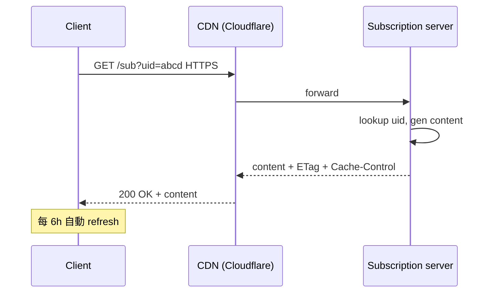

# 課堂 12.6 — 實作（五）：客戶端整合（sing-box / Clash / 訂閱）

## 學前知道
- 前置課：6.x (VPN clients), 7.x (proxy protocols), 12.1 (Rust core + Go shim), 12.3 (handshake API)
- 預計閱讀時間：**50 分鐘**
- 必讀:
  - **sing-box 文件**：[sing-box.sagernet.org](https://sing-box.sagernet.org)，特別是 [Outbound Plugin Protocol](https://sing-box.sagernet.org/configuration/outbound/) 與 [Custom Transport API](https://github.com/SagerNet/sing/blob/main/protocol/README.md)
  - **Clash-Meta 文件 + commit history**：[github.com/MetaCubeX/mihomo](https://github.com/MetaCubeX/mihomo)
  - **Xray-core outbound 接口**：[xtls/xray-core/main/proxy](https://github.com/XTLS/Xray-core/tree/main/proxy)
  - **WireGuard subscription / Surge config format** — 為何 proxy 訂閱長這樣的歷史
  - **draft-ietf-httpbis-resumable-uploads / Apple `.mobileconfig`** — 訂閱安全的近代思路（不直接相關但啟發）
- 必讀原始碼:
  - `SagerNet/sing-box/transport/v2rayws/server.go` — 別人怎麼塞 transport
  - `SagerNet/sing-box/protocol/vless/protocol.go` — 加進 sing-box 的 outbound 範本
  - `MetaCubeX/mihomo/adapter/outbound/*` — Clash 系列 adapter
  - `clavinjune/sub-converter` — 訂閱 converter 典型 impl
- 自我反省問題:
  - 你開 Clash Verge Rev 時手動貼過 vmess URL 嗎？你知道那串 base64 裡有哪些欄位嗎？
  - 你有想過為什麼 sing-box 客戶端能跑 10 種協議？它的 abstraction layer 看起來是什麼樣？

## 動機

「協議再強，沒有客戶端 = 0 user」。我們協議要 ship 到使用者手上需穿過 **三層 plumbing**：

1. **Core integration**：把 Rust core 透過 FFI 暴露成 Go-callable
2. **Adapter shim**：在 sing-box / Clash-Meta / Xray-core 寫 outbound adapter
3. **訂閱格式**：使用者貼一條 URL，client 解析、加進 profile

每層都有「使用者體驗」與「安全」之間 trade-off。本堂課把每層 design 做到 production-grade。

```mermaid
flowchart TD
    U[User] -->|paste URL| GUI[Clash Verge Rev / sing-box App]
    GUI --> SUB[Subscription decoder]
    SUB --> CFG[Profile config]
    CFG --> OUT[Outbound adapter<br/>(our protocol)]
    OUT --> SHIM[Go shim (cgo)]
    SHIM --> CORE[Rust core cdylib]
    CORE --> NET[Network]
    classDef ours fill:#fde,stroke:#c39;
    class CORE,SHIM,OUT,SUB ours;
```

---

## 核心概念

### 1. FFI 設計 — Rust cdylib

定義最小 C ABI：

```rust
#[no_mangle]
pub extern "C" fn proto_session_new(
    cfg_json: *const c_char,
    cfg_len: usize,
    out_err: *mut *const c_char,
) -> *mut SessionHandle { ... }

#[no_mangle]
pub extern "C" fn proto_session_close(h: *mut SessionHandle) { ... }

#[no_mangle]
pub extern "C" fn proto_session_write(
    h: *mut SessionHandle,
    data: *const u8,
    len: usize,
    out_written: *mut usize,
) -> i32 { ... }

#[no_mangle]
pub extern "C" fn proto_session_read(
    h: *mut SessionHandle,
    buf: *mut u8,
    cap: usize,
    out_read: *mut usize,
) -> i32 { ... }

#[no_mangle]
pub extern "C" fn proto_version() -> *const c_char { ... }

#[no_mangle]
pub extern "C" fn proto_last_error() -> *const c_char { ... }
```

8 個函數，無 trait object 傳遞，無 Rust panic 越界（`catch_unwind` 包住）。

`cbindgen` 自動生產 C header；CI 跑 `cargo test --features test-c-header` 確保 binding compile。

### 2. Go shim package layout

```text
proto-shim-go/
├── go.mod
├── ffi.go              -- cgo bindings (only file with #include)
├── session.go          -- Go-facing Session type
├── config.go           -- Profile <-> JSON
├── error.go            -- 把 i32 -> Go error
├── interop_test.go
├── lib/                -- vendored .so / .dylib / .dll
│   ├── amd64-linux/libproto.so
│   ├── arm64-darwin/libproto.dylib
│   ├── arm64-android/libproto.so
│   └── amd64-windows/proto.dll
└── README.md
```

每個 platform 預先 build .so/.dylib/.dll；Go binary `embed` 進去（或 `go:embed` 後 dump 到 tmpfs + dlopen）。
maintenance 心累：要管 cross-compile matrix。但 user 端 zero-install。

```go
package proto

/*
#include "proto.h"
*/
import "C"

type Session struct {
    handle *C.SessionHandle
}

func NewSession(cfg *Config) (*Session, error) {
    var errCStr *C.char
    j, _ := json.Marshal(cfg)
    cs := C.CString(string(j))
    defer C.free(unsafe.Pointer(cs))
    h := C.proto_session_new(cs, C.size_t(len(j)), &errCStr)
    if h == nil {
        return nil, errors.New(C.GoString(errCStr))
    }
    s := &Session{handle: h}
    runtime.SetFinalizer(s, func(s *Session) { C.proto_session_close(s.handle) })
    return s, nil
}
```

陷阱：`runtime.SetFinalizer` 不保證即時 release；對 sensitive resource (key) 仍要 explicit `Close()`。

### 3. sing-box outbound adapter

sing-box 之 outbound interface（簡化）：

```go
type Outbound interface {
    Tag() string
    Type() string
    DialContext(ctx context.Context, network string, dest M.Socksaddr) (net.Conn, error)
    ListenPacket(ctx context.Context, dest M.Socksaddr) (net.PacketConn, error)
}
```

我們的 adapter：

```go
package outbound_protoxx

type Outbound struct {
    tag    string
    cfg    *proto.Config
    pool   *sessionPool
}

func (o *Outbound) DialContext(ctx context.Context, network string, dest M.Socksaddr) (net.Conn, error) {
    if network != "tcp" && network != "udp" {
        return nil, E.New("unsupported network: ", network)
    }
    sess, err := o.pool.acquire(ctx)
    if err != nil {
        return nil, err
    }
    stream, err := sess.OpenStream(ctx, dest)
    if err != nil {
        o.pool.release(sess)
        return nil, err
    }
    return stream, nil
}
```

**session pool**：每 server 允許 N 並行 session (default 4)；以 `acquire/release` 取得，避免每 request 新握手（latency 災難）。session 內 multiplex stream (類 H2/H3 stream 概念)。

`Listener.ServeStream` API 對應 server 端，註冊 inbound 同理。

向 sing-box 主程式註冊：

```go
// adapter/registry/registry.go (sing-box main code)
func RegisterProtoXX(registry *registry.Registry) {
    registry.RegisterOutbound("protoxx", func(...) (adapter.Outbound, error) { ... })
}
```

提 PR 上游或 fork：兩條路都通。fork 對 quick iteration 友善，但增加 user 操作成本（要下載 fork build）。**Recommended**：先 fork build + 用戶下載 ipa/apk；穩定後上游 PR。

### 4. Clash-Meta adapter

Clash-Meta（mihomo）之 outbound interface 類似但欄位多：

```go
type ProxyAdapter interface {
    Name() string
    Type() C.AdapterType
    DialContext(ctx context.Context, metadata *C.Metadata, opts ...dialer.Option) (C.Conn, error)
    ListenPacketContext(ctx context.Context, metadata *C.Metadata, opts ...dialer.Option) (C.PacketConn, error)
    SupportUDP() bool
    Unwrap(metadata *C.Metadata, touch bool) C.Proxy
    // ... 等等
}
```

對 server config 的 marshalling 用 `adapter/outbound/protoxx.go` 結構：

```go
type ProtoXXOption struct {
    BasicOption
    Name     string `proxy:"name"`
    Server   string `proxy:"server"`
    Port     int    `proxy:"port"`
    Password string `proxy:"password"`
    SNI      string `proxy:"sni,omitempty"`
    Profile  string `proxy:"profile,omitempty"` // shaping profile
    PSK      string `proxy:"psk"`
    PQ       bool   `proxy:"pq,omitempty"`
}
```

用 yaml/json tag 暴露給 Clash-Meta config；自動進 Clash Verge GUI 的 proxy list。

### 5. 訂閱（subscription）格式設計

主流訂閱格式：
- `vmess://base64({...})`（v2ray 系列）
- `vless://uuid@host:port?type=tcp&security=reality&...`（最新 VLESS-REALITY）
- `ss://...`（Shadowsocks SIP002）
- `trojan://...`
- `hysteria2://...`
- 整批訂閱：base64(纯文本，多行 URL) 或 sing-box JSON outbound array

我們選 **「URL + 整批訂閱」雙 format**：

#### Single-server URL

```text
protoxx://<base64url(psk)>@<host>:<port>/?
    sni=<sni>&
    pq=<0|1>&
    profile=<profile_name>&
    obfs=<base64url(extra_data)>&
    cdn=<0|1>#<remark>
```

範例：

```text
protoxx://aGVsbG93b3JsZA@vps.example.com:8443/?
    sni=cdn.example.com&pq=1&profile=https-browsing-v1#我的香港節點
```

設計準則：
- 不含敏感 server 資訊（如 internal-only routes）
- PSK 是 base64url，避免 query string 特殊字元
- 預留 `obfs=` 給未來 extension
- fragment (`#`) 為人讀 label

#### 訂閱列表

支援三種訂閱形式：

1. **純文字 base64(URL 多行)**（v2ray 慣例）— 最相容
2. **sing-box JSON** — 直接餵 sing-box
3. **YAML (Clash 風格)** — 直接餵 Clash-Meta

#### Subscription update mechanics



**陷阱**：
- 訂閱 URL 是 long-lived secret — 一旦洩露 attacker 拿到所有 server IP
- 用 short-lived (1h) signed URL：`?uid=...&exp=...&sig=HMAC(secret, uid||exp)`
- 訂閱 server 看到客戶 IP — 可被當作 first-contact identification → 用 CDN-fronting 隱藏
- 訂閱內容若靜態 cache，CDN edge 可能洩露給其他 user — 用 `Vary: uid` 或 unique URL

#### 私密訂閱：sealed config

進階：訂閱內容用 PSK 加密：`AES-GCM(K=PBKDF2(user_pw, salt), config_json)`。client 端在 GUI 輸入密碼解密。對 server credentials 增加一層 — 即使中間 CDN compromise，亦無法洩 PSK。

### 6. 多平台特殊處理

| 平台 | 入口 | 我們要做 |
|---|---|---|
| macOS | sing-box-mac / FoXray / Clash Verge Rev | Universal .dmg；Notarized |
| Windows | sing-box-windows / Clash Verge Rev | .exe；signed by EV cert |
| Linux | sing-box CLI / box-for-linux | deb / rpm / AUR |
| Android | sing-box-android / NekoBox / Clash-Meta-Android | apk + Google Play |
| iOS | Shadowrocket / Quantumult X / Stash / sing-box | 整合於現有 app（commercial） |
| OpenWrt | sing-box ipk | 對 router CPU 編 mipsel/armv7 |

iOS 是最難整合的：App Store 嚴管 VPN entitlement；只能 (a) 自己上 App Store + NetworkExtension or (b) 整合進現有 commercial app。對 hobby project，現實路徑為 (b)。

Android：NekoBox 是社群 best practice；fork + 加 outbound type；apk 可離線下載。

### 7. 自動化：訂閱 converter

使用者拿到一條 URL 但 client 是 Clash-Meta（不支援我們協議格式）：寫一個 sub-converter 把 URL → Clash YAML：

```text
GET /sub?token=<long>&target=clash → 200 yaml
GET /sub?token=<long>&target=sing-box → 200 json
GET /sub?token=<long>&target=v2ray → 200 base64
```

Open source converter 為 [tindy2013/subconverter](https://github.com/tindy2013/subconverter)；fork 加我們 protocol parser 即可。

### 8. UX 細節（容易被低估）

| 細節 | 推薦做法 |
|---|---|
| 訂閱失敗錯誤訊息 | 明確：「TLS handshake failed」、「DNS resolve failed for X」；不要 generic |
| 連線 latency 顯示 | 主動探測（健康檢查），UI 顯示 RTT；探測流量自帶整形避免被 fingerprint |
| 切換 proxy 不斷流 | sing-box 之 `urltest` group 內 fast-switch；要支援 graceful drain |
| 流量統計 | rx/tx counter；client UI 顯示 |
| TUN 模式 vs system proxy 模式 | 預設 TUN（蓋全部），可選 system proxy（給敏感 app 用） |

### 9. 安全 invariant

```text
[INV-CL-1]  client config 不在 plaintext 落地（macOS Keychain / Android Keystore）
[INV-CL-2]  訂閱 URL 不會被印到 log
[INV-CL-3]  TUN packet 在退出 process 前不能跨 process 流出 (mDNS/DHCP leak)
[INV-CL-4]  Switch profile 時 prior session keys must be zeroized within 10s
[INV-CL-5]  TLS pinning：訂閱 server cert pinning，避免被中間人改寫訂閱
[INV-CL-6]  Update mechanism 必須 signature-verified（避免被植入 backdoored binary）
```

### 10. 性能：cgo overhead 緩解

cgo call ~100ns @ Go 1.24。對 1 Gbps + 1.5KB packet → 80k packet/s → 8M ns/s ≈ 8ms 純 cgo = 0.8% CPU。可接受。
**但**：對 < 100B packet 高 pps 場景（VoIP，每秒 5k packet）—cgo 開銷顯著。緩解：

1. **Batch FFI call**：一次傳 multiple packet 給 Rust（`proto_session_write_batch(h, pkts, lens, count)`）
2. **Direct memory access**：Rust 直接寫 Go-allocated buffer（unsafe.Slice + cgo.Handle）
3. **避免 thread switch**：cgo 切到 worker goroutine 之 lock OS thread — 預先 `runtime.LockOSThread()` 在 dedicated worker

對 high pps 用 (1) + (3)。

---

## 與我們協議設計的關聯

- **Part 12.7 server**：本堂的 Client URL 與 server 端 acceptance 必須對稱
- **Part 12.20 docs**：本堂的訂閱格式要寫進使用者文件
- **Part 9.x GFW**：本堂的訂閱更新機制可被 GFW 阻擋（封 sub server IP）；對策是 CDN-fronting + Tor PT3 之 rendezvous
- **Part 11.7 spec security considerations**：subscription 之 threat model 要列入

---

## 動手

1. 在 `proto-ffi/` 寫 8 個 cdylib export；`cbindgen` 生 header
2. 在 `proto-shim-go/` 寫 Go binding；跑 `go test -race`
3. 在 `mihomo` fork 加 `adapter/outbound/protoxx.go`；本地起 server 連線
4. 寫 `proto-url` Rust crate 解析我們 URL；對 1k random fuzz input 確保不 panic
5. 部署一個 minimal 訂閱 server (Caddy + small Rust binary)，含 ETag / Vary 處理；用 `xh` 測 cache 行為

## 自我檢查

1. 為什麼選 cgo 不選 Wasm component？兩者 trade-off？
2. 訂閱 URL 之 short-lived 簽名為什麼比 long-lived UUID 安全？
3. iOS 為什麼最難整合？只有哪兩條合理路徑？
4. cgo batch call 與單包 call 對 1 Gbps small-packet 場景 throughput 差多少？
5. TUN 模式 vs system proxy 模式 之 DNS leakage 風險差別？

## 延伸閱讀

- *VPN client implementations* (Awesome list): github.com/2dust/proxy-list
- *Subscription Format* 規範參考：v2rayN 文件
- *Apple NetworkExtension Documentation*
- *Android VpnService docs* (developer.android.com)

---

## 研究級補遺

### 1. 學界詞彙

| 中文/口語 | 學界詞彙 |
|---|---|
| 外部介接 | foreign function interface (FFI), ABI |
| 客戶端整合 | client integration, transport adapter |
| 訂閱機制 | subscription / configuration provisioning |
| CDN 前置 | domain fronting / CDN-fronting (Fifield et al. 2015) |
| 客戶端指紋 | TLS / HTTP client fingerprint (JA3/JA4) |

### 2. 對手分類學

| 對手 | 攻擊 | 防禦 |
|---|---|---|
| 訂閱 URL 洩露者 | leak 一條 URL → 拿全 server list | short-lived signed URL + rotating secret |
| 訂閱中間人 | CDN edge 看見內容 | 訂閱內容對稱加密（PBKDF2 key） |
| 客戶端二進位 backdoor | malicious build distribution | reproducible build + signature; SLSA L3 |
| 訂閱 server DoS | flooding | rate-limit per IP + Cloudflare |
| client fingerprint via JA3 | TLS handshake 識別客戶端 | uTLS-style mimic of common browser fingerprint |

### 3. 形式化定義

**訂閱 unlinkability**：兩條 sub URL $u_1, u_2$ 對 attacker 是否屬於同 user 不可區。形式上：與 IND-CPA 類比。

### 4. 領域的關鍵論文 / 規格 / 原始碼

1. **Fifield, Lan, Hynes, Wegmann, Paxson**. *Blocking-resistant communication through domain fronting*. PETS 2015 — domain fronting 開山
2. **Bocovich et al.** *Surreptitious Transmission of Cover Traffic via Decoy Routing*. NDSS 2016
3. **sing-box 源碼**
4. **mihomo (Clash-Meta) 源碼**
5. **Xray-core 源碼**
6. **The Tor Pluggable Transport spec v3**: tools/PT-spec
7. **Apple Network Extension docs**

### 5. 我們協議的座標 / 設計取捨

- 訂閱 URL 用 short-lived signed：cost = subscription server 必須 always-online
- subscription 內容加密 (v0.1 unsigned, v1.0 加密+簽)
- 客戶端整合：v0.1 通過 sing-box fork；v0.2 上游 PR；v1.0 提供 mobile app
- 訂閱 over CDN-fronting：依靠 Cloudflare/Fastly（research shows fronting 有 limited TTL，但仍 valuable）

### 6. 必追資源 / 社群入口

- Awesome-vpn-client GitHub list
- shadowsocks-org wiki
- Tor Project: Snowflake bridge distribution architecture
- v2ray TG channels / sing-box GitHub Issues

### 7. 開放問題

1. **訂閱 trust establishment**：first-contact 之 trust on first use (TOFU) 或更強 cert pinning？尚無 SOTA
2. **訂閱 censorship resistance**：GFW 封 subscription server → 客戶端離線。Snowflake 之 rendezvous 機制是否可借鑑？
3. **Cross-protocol client fingerprint**：我們 client (sing-box fork) 之 TLS fingerprint 與 vanilla sing-box / Chrome 比對如何？
4. **行動端電量影響**：constant-rate cover traffic 對 mobile 電量 cost 是 open；尚缺實證
