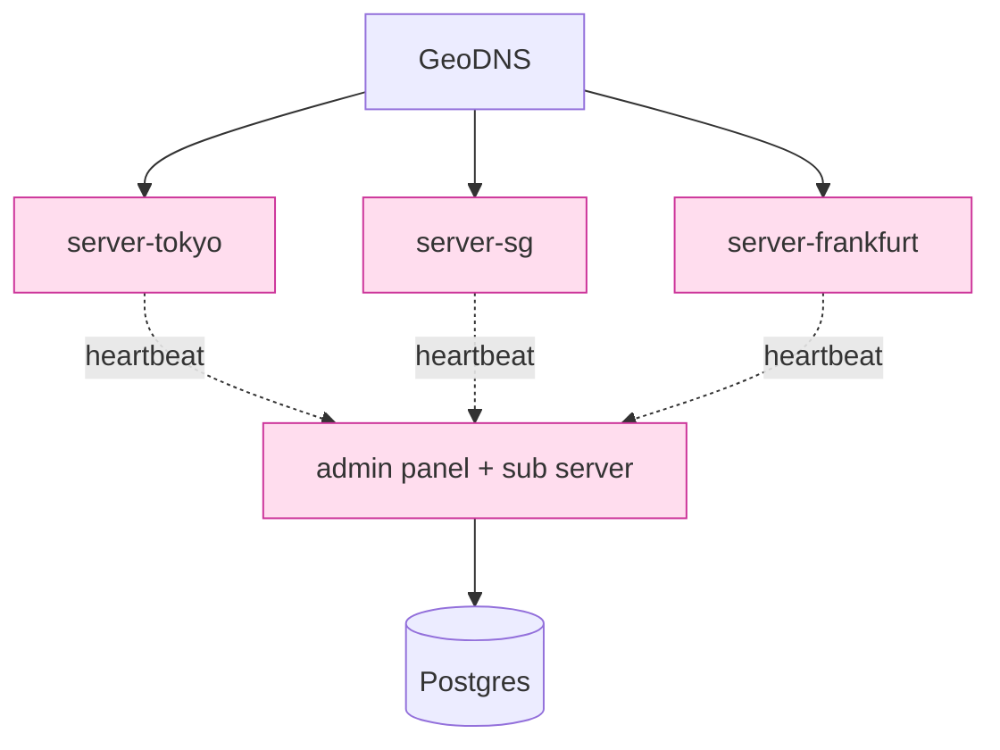

# 課堂 12.7 — 實作（六）：服務端 panel + Caddy/Nginx fallback

## 學前知道
- 前置課：6.x VPN internals, 7.x proxy server side, 9.x GFW probing, 12.3 handshake (fallback path), 12.6 client side
- 預計閱讀時間：**45 分鐘**
- 必讀:
  - **Ensafi, Fifield, Winter, Feamster, Weaver, Paxson**. *Examining How the Great Firewall Discovers Hidden Circumvention Servers*. IMC 2015 — 必讀，主動探測之奠基（fetched: ensafi-gfw-probing.md）
  - **VLESS + REALITY 設計文件**：[XTLS/REALITY/blob/main/README.md](https://github.com/XTLS/REALITY) — fallback 之最 SOTA 範例
  - **Caddy server source**：[`caddyserver/caddy/modules/caddyhttp/reverseproxy/`](https://github.com/caddyserver/caddy)
  - **Nginx stream module**：[nginx.org/en/docs/stream/ngx_stream_core_module.html](https://nginx.org/en/docs/stream/ngx_stream_core_module.html)
  - **3X-UI / Marzban panel source**：兩個主流 v2ray panel
- 必讀原始碼:
  - `XTLS/Xray-core/transport/internet/reality/reality.go:140-260` 之 server side authentication
  - `apernet/hysteria/core/server/protocol.go` server-side handshake
  - `caddyserver/caddy/modules/caddyhttp/server.go` HTTP handler chain
- 自我反省問題:
  - 你部署 ccb / xray 時，了解 nginx fallback 是怎麼路徑切換的嗎？
  - 你知道為什麼 「unauth client 直接 reset」是壞 design 嗎？

## 動機

Server side 對應 client side：但威脅模型 inverted。Server 是 **被探測** 的一方，必須在 attacker 主動探測時表現得像一台普通 web server。

三條技術線：

1. **Server core**：對應 Part 12.2-12.5 的 Rust 實作，加 server-specific 邏輯（accept loop, multi-tenant key store）
2. **Fallback / cover**：未通過 authentication 的連線 forward 到 Caddy/Nginx 做真實 web service
3. **Panel**：給 server admin 一個 web UI 增刪用戶 / 看流量 / 簽訂閱 URL

這層是「人 vs 國家級對手」決勝場。我們協議 prober resistance 的關鍵就在這一堂。

```mermaid
flowchart TD
    Net[Internet] --:443--> SVR[Our protocol listener]
    SVR --auth ok--> CORE[Proto core handshake]
    SVR --auth fail/probe--> SPLICE[zero-copy splice]
    SPLICE --> CADDY[Caddy / Nginx :444]
    CADDY --> WEB[Static site / blog]

    SVR -.config.-> PANEL[Admin panel<br/>:5000 (internal only)]
    PANEL --> DB[SQLite/Postgres]
    PANEL --> SUB[Subscription server :443/sub]
    SUB --signed URL--> Client

    classDef ours fill:#fde,stroke:#c39;
    class SVR,CORE,SPLICE,PANEL,SUB ours;
```

---

## 核心概念

### 1. Accept loop 與 ct evaluation

```rust
async fn accept_loop(listener: TcpListener, ctx: ServerCtx) -> Result<()> {
    loop {
        let (sock, peer) = listener.accept().await?;
        let ctx = ctx.clone();
        tokio::spawn(async move {
            handle_connection(sock, peer, ctx).await
                .unwrap_or_else(|e| trace!(?e, "conn closed"));
        });
    }
}

async fn handle_connection(mut sock: TcpStream, peer: SocketAddr, ctx: ServerCtx) -> Result<()> {
    let mut buf = BytesMut::with_capacity(4096);
    // 讀第一批 bytes（client hello）
    let n = read_with_timeout(&mut sock, &mut buf, Duration::from_secs(5)).await?;
    let ch = match parse_client_hello(&buf[..n]) {
        Ok(ch) => ch,
        Err(_) => return forward_to_cover(sock, buf).await,
    };
    // ct authenticate
    let auth = ct_authenticate(&ctx.psk_db, &ch);
    if !bool::from(auth) {
        return forward_to_cover(sock, buf).await;
    }
    // 正常 handshake 後續
    proceed_handshake(sock, buf, ch, ctx).await
}
```

**關鍵點**：
- ct authenticate：對 `psk_binder` 之 MAC compare 要 constant-time，不可早 return
- 任何 `Err` path 都 fall back 到 cover；不可 RST / TLS Alert（會被 prober 識別）
- 在 `forward_to_cover` 前，**已經讀的 bytes 必須完整 forward**，否則 Caddy 看到 partial client hello 報錯

### 2. Cover fallback：zero-copy splice

```rust
async fn forward_to_cover(mut client: TcpStream, buf: BytesMut) -> Result<()> {
    let mut cover = TcpStream::connect("127.0.0.1:8443").await?;
    cover.write_all(&buf).await?;            // 把之前讀的 bytes pump 過去
    tokio::io::copy_bidirectional(&mut client, &mut cover).await?;
    Ok(())
}
```

`copy_bidirectional` Tokio 內建 splice-like; Linux 下 kernel 自動用 `splice(2)` 與 pipe。

更激進：用 `io_uring` 的 `IORING_OP_SPLICE` 直接 kernel-to-kernel；userland 不接觸 byte。

**Cover server 必須是 real**：
- Caddy serving real domain；HTTPS cert from Let's Encrypt
- 對任何 GET 回真 HTML
- 站點要 plausible：blog / 公司頁 / 個人 portfolio
- *不要* 用 default Apache placeholder（被 fingerprint as proxy）

### 2.5 達成 spec §7 「< 1ms p99 forward inflation」的 eBPF / XDP recipe

User-space splice 的 forward path 在 1 vCPU VPS 上 p50 latency ≈ 200-400 µs，p99 ≈ 2-5 ms（取決於 ksoftirqd scheduling）。**不達 spec §7 normative**。

要 < 1 ms p99，**兩條路徑**：

#### 路徑 A：SO_REUSEPORT + eBPF socket dispatch（推薦）

```
+----------------+
| eth0 ingress   |
+--------+-------+
         | (XDP_PASS)
         v
+--------+-------+           +--------------------+
| kernel TCP/UDP |           | SO_REUSEPORT group |
| stack          | --eBPF--> | [Proteus worker socks]  |
|                |   prog    | [cover sock]       |
+----------------+           +--------------------+
```

實作：
1. Proteus server 與 cover server (Caddy) **同時 bind UDP/443 with SO_REUSEPORT**。
2. 掛一個 eBPF program 在 `SO_ATTACH_REUSEPORT_EBPF`（kernel ≥ 4.19）。
3. eBPF 程式檢查 packet 前 N byte：parse QUIC long header → derive Initial keys → AEAD-open CRYPTO frame → look for 0xfe0d ext → HMAC check（**eBPF 內做**）。
4. 通過 → return Proteus worker sock index；失敗 → return cover sock index。

```c
// pseudocode for ebpf_reuseport.c
SEC("sk_reuseport/g6_dispatch")
int g6_dispatch(struct sk_reuseport_md *reuse) {
    // load first ~1500 byte of packet
    void *data = reuse->data;
    void *data_end = reuse->data_end;

    // parse QUIC long header
    struct quic_long_hdr *qh = data;
    if ((void*)(qh + 1) > data_end) return SK_DROP;
    if (qh->fixed_bit != 0x40) return bpf_sk_select_reuseport(reuse, &cover_sock_map, 0, 0);

    // derive initial keys (precomputed for v1 salt) -- via BPF helper or precomputed lookup table
    // ... (full HKDF in eBPF is feasible w/ bpf_loop + maps)
    // open AEAD-GCM-128 (need bpf_crypto helpers, kernel 6.7+)
    // ...

    // HMAC check on parsed 0xfe0d ext
    if (g6_hmac_ok) {
        return bpf_sk_select_reuseport(reuse, &g6_sock_map, &worker_idx, 0);
    }
    return bpf_sk_select_reuseport(reuse, &cover_sock_map, 0, 0);
}
```

**效益**：cover-bound packet 從未進入 Proteus user-space → forward p99 < 200 µs（限速來自 `__inet_lookup` syscall path + kernel TCP stack）。

**限制**：
- `bpf_crypto_*` helpers 需 kernel 6.7+（2023-12 release）。
- HMAC 在 eBPF 內做的話 stack size 受限（512 byte），需用 `bpf_loop` + per-CPU map 暫存。
- Verifier complexity 對 HKDF 路徑挑戰大，實務常見折衷：**eBPF 只做 SNI extraction**（QUIC Initial decrypt 部分），SNI != cover domain 才下到 user-space full HMAC check；SNI == cover domain 且 0xfe0d ext 缺席 → 直接 dispatch cover。
- 對 TCP/443（α profile）：類似機制，但 SO_REUSEPORT + eBPF 處理 TCP SYN（不解內容），對 first-byte 等 callback。

#### 路徑 B：AF_XDP + DPDK 風格（極致 perf 但複雜）

只在 Proteus server 是高負載專用機（10+ Gbps）時值得。

1. NIC 啟用 AF_XDP，所有 UDP/443 packet 進 user-space ring buffer。
2. Proteus server 在 user-space 自己解 QUIC + auth。
3. Cover packet 走 AF_XDP TX redirect 到 cover-internal-veth → cover server。

實作工作量極高，**v0.1 reference impl 不採**；spec §16 informative 列為 future work。

### 2.6 Cover forward connection pool 設計

不論路徑 A 或 user-space fallback，**對 cover server 必須有 pre-warmed pool**：

```rust
pub struct CoverPool {
    pool: Arc<Mutex<VecDeque<TcpStream>>>,    // for TCP cover (Caddy/Nginx)
    target: SocketAddr,
    min_idle: usize,
    max_size: usize,
}

impl CoverPool {
    async fn maintain(&self) {
        // background task: keep >= min_idle warm connections
        loop {
            let needed = self.min_idle.saturating_sub(self.pool.lock().await.len());
            for _ in 0..needed {
                let conn = TcpStream::connect(self.target).await?;
                // 可以選 do partial TLS handshake to keep cover socket "hot"
                self.pool.lock().await.push_back(conn);
            }
            tokio::time::sleep(Duration::from_secs(1)).await;
        }
    }

    async fn get(&self) -> TcpStream {
        let mut pool = self.pool.lock().await;
        pool.pop_front().unwrap_or_else(|| {
            // fallback: synchronous connect (degrade path)
        })
    }
}
```

**為何 pool**：
- 冷啟 TCP/443 連 cover ≈ 50-150 ms（DNS + TCP + TLS）。如果 cover forward 走冷啟，attacker 一探立刻看到 「100ms 延遲後突然回大量真 cover HTML」 → fingerprint。
- Hot pool 讓 forward p99 < 1 ms。

**為何不用 long-lived 單一 TCP connection 多 user**：cover server (Caddy) 同 connection 多 request 用 H/2 / H/3 mux，但前面已有 client TCP/TLS handshake bytes → 必須整條 connection forward 給 cover。所以**每個 incoming Proteus-fail connection 對應一個 pool TCP conn**。

### 2.7 Forward inflation 量測方法（spec §7 normative compliance）

12.18 real-world testing 必須驗證 < 1ms p99：

```bash
# 1) probe Proteus server with random ClientHello (will fail HMAC, forward path)
for i in $(seq 1 10000); do
    /usr/bin/time -f "%e" curl --http3 --resolve probe-${i}.example.com:443:${Proteus_IP} \
        https://probe-${i}.example.com/ -o /dev/null -s 2>>probe-times.log
done

# 2) ground-truth: directly hit cover server with same probes
for i in $(seq 1 10000); do
    /usr/bin/time -f "%e" curl --http3 --resolve probe-${i}.example.com:443:${COVER_IP} \
        https://probe-${i}.example.com/ -o /dev/null -s 2>>cover-times.log
done

# 3) compute distribution diff
python -c "
import numpy as np
proteus = np.loadtxt('probe-times.log')
co = np.loadtxt('cover-times.log')
print(f'Proteus forward p50/p95/p99 inflation = {np.percentile(proteus-co, [50,95,99])} ms')
"
```

Target: p99 < 1 ms. 失敗 → 回頭調 eBPF 路徑或加 pool min_idle。

### 3. Server 端 multi-tenancy

```rust
pub struct PskDb {
    by_id: HashMap<ClientId, PskEntry>,  // ClientId = HMAC(server_secret, user_uuid)
}

pub struct PskEntry {
    psk: Zeroizing<[u8; 32]>,
    user_label: String,
    expires_at: Option<DateTime<Utc>>,
    quota_bytes: AtomicU64,
    used_bytes: AtomicU64,
}

pub fn ct_authenticate(db: &PskDb, ch: &ClientHello) -> Choice {
    let mut acc = Choice::from(0u8);
    for (id, entry) in db.by_id.iter() {
        let id_match = id.ct_eq(&ch.client_id);
        let binder_expected = compute_binder(&entry.psk, &ch.transcript_pre_binder);
        let binder_match = binder_expected.ct_eq(&ch.binder);
        acc |= id_match & binder_match;
    }
    acc
}
```

陷阱：HashMap 內 iter 不 ct（但 iter 之 order 不依賴 secret，OK）。對 PSK 數很多（10k+）的場合：

- 先用 `client_id` 為索引（不 ct 但不 secret），lookup PsKEntry
- 再對該 entry 之 binder 做 ct compare
- 注意：lookup miss 與 hit 之 timing 差別 → 即使 miss 仍跑 dummy compare

```rust
pub fn authenticate(db: &PskDb, ch: &ClientHello) -> Choice {
    let entry = db.by_id.get(&ch.client_id);
    let (psk, found) = match entry {
        Some(e) => (e.psk.as_ref(), Choice::from(1u8)),
        None => (&[0u8; 32][..], Choice::from(0u8)),
    };
    let binder = compute_binder(psk, &ch.transcript_pre_binder);
    found & binder.ct_eq(&ch.binder)
}
```

### 4. Panel 設計

Panel 是 web UI + REST API。組成：

- 後端：Rust (axum) 或 Go (Gin)。我們選 **Go (Gin)**：rapid dev、生態好
- 資料庫：SQLite (single VPS) / PostgreSQL (multi-tenant SaaS)
- 認證：admin password (Argon2 hashed) + 2FA (TOTP)
- TLS：強制；面板只在 internal 監聽，外面靠 nginx-proxy + Tailscale / wg

panel scope（v0.1 MVP）：

```text
GET    /api/users                列出 user
POST   /api/users                建 user (回傳 subscription URL)
DELETE /api/users/:id            disable
PATCH  /api/users/:id/quota      設配額
GET    /api/users/:id/usage      流量統計

GET    /api/system/status        server 健康
POST   /api/system/restart       平滑重啟
GET    /api/system/logs          tail logs

GET    /sub?token=...&target=... 公開訂閱 endpoint
```

panel 之 admin 訪問建議透過 SSH tunnel / Tailscale，避免暴露 admin endpoint。

對主流 panel 之 inspiration：
- **3X-UI**：易用 UI + xray-core 整合 + sqlite
- **Marzban**：FastAPI + admin + V2Ray
- **VPN.lat / WGDashboard**：較簡

### 5. 訂閱端點與簽名

```go
func handleSub(c *gin.Context) {
    token := c.Query("token")
    target := c.DefaultQuery("target", "raw")
    user, err := authenticateToken(token)
    if err != nil {
        c.Status(404) // 不洩 admin endpoint
        return
    }
    configs := buildUserConfigs(user)
    switch target {
    case "raw":
        c.String(200, encodeBase64Lines(configs))
    case "clash":
        c.YAML(200, toClashYAML(configs))
    case "sing-box":
        c.JSON(200, toSingBoxJSON(configs))
    default:
        c.Status(400)
    }
}
```

`authenticateToken`：HMAC(server_sub_secret, user_uuid || exp); token 包含 uuid + exp + sig，client 端拿到後一次性換 binary content。

**陷阱**：對 404 vs 200 之 timing differential 仍可區（reqs/sec 異常）；對 unknown token 也走完整 hash compute 後 return 404，避免 timing side-channel 識別 valid token 範圍。

### 6. 在 Caddy 後面跑：典型部署

```text
:443 --[nft/iptables redirect]--> :443 (our proto)
                                |--auth fail--> :8443 (Caddy real site)
                                |--auth ok----> proxy core

Caddyfile:
:8443 {
    root * /var/www/blog
    file_server
    encode gzip
    ...
}
```

或者：
- 我們的 proto listener 監 :443
- Caddy 監 127.0.0.1:8443
- proto listener forward fallback bytes 到 127.0.0.1:8443

第二種更彈性（不依賴 nft）。

### 7. systemd unit 與 hardening

```ini
[Unit]
Description=Proto-XX server
After=network.target

[Service]
Type=notify
ExecStart=/usr/local/bin/protoxx-server --config /etc/protoxx/server.toml
DynamicUser=yes
ProtectSystem=strict
ProtectHome=yes
PrivateTmp=yes
NoNewPrivileges=yes
RestrictAddressFamilies=AF_INET AF_INET6 AF_UNIX
CapabilityBoundingSet=CAP_NET_BIND_SERVICE
AmbientCapabilities=CAP_NET_BIND_SERVICE
LimitNOFILE=1048576
MemoryMax=2G
TasksMax=4096
Restart=always
RestartSec=5s

[Install]
WantedBy=multi-user.target
```

`DynamicUser` + `ProtectSystem=strict`：即使 RCE 也只能寫 /tmp / 自己 data dir。
`CapabilityBoundingSet=CAP_NET_BIND_SERVICE`：可 bind :443 但不能 ptrace / load module。

### 8. 主動探測抵抗：spec § 與實作對齊

|  prober behavior | 我們 server 回應 |
|---|---|
| 隨機 byte 連 :443 | parse fail → fallback to Caddy → real 404 / index.html |
| 重放正常 ClientHello | binder mismatch (epoch 變或 PSK 不同) → fallback |
| TLS-style ClientHello (用 testssl/openssl s_client) | 我們不解 TLS； parse fail → fallback → real Caddy serves TLS handshake |
| Encrypted-response prober (zhao 2023) | 不 emit 任何 application data 在握手未完前；timing 與 Caddy 一致 |
| port scan | nothing on other ports；Caddy redirect :80 → :443 |

關鍵 invariant：**「在 100% handshake fail 的世界裡，server 與 vanilla Caddy 之 behavior 必須相同」**。

### 9. Logging 與 metrics

```text
Production logging:
  - tracing crate, JSON-structured logs
  - level: INFO default; DEBUG 不暴露 secret material
  - metrics: prometheus exporter on internal :9100
    - protoxx_connections_total{result=accept|fallback}
    - protoxx_active_sessions
    - protoxx_bytes_total{direction=rx|tx}
    - protoxx_handshake_latency_seconds_bucket
    - protoxx_psk_lookups_total{result=hit|miss}
  - 不 log client IP；log 之 hashed peer (sha256(salt|ip))
```

對 GDPR / 個資：log 不存 raw IP；存 hash 做 abuse detection。retention ≤ 7 天。

### 10. 抗 DDoS 與濫用

- L4 SYN flood：依賴 kernel `tcp_syncookies` + Cloudflare / DDoS-Guard
- L7 handshake flood：rate-limit per IP；超過 N/sec → fallback path 即可（cover server 也會被打但 attack surface 同一台機）
- 異常使用者：流量超 quota → 自動 disable；panel email 通知 admin
- IP 黑名單：spaceship-like，對 Tor exit 與 known malicious IP block；可選 disable

### 11. 多 server 部署：負載與 active-active

對 popular service：1 server CPU 撐 ~1k 並發。要 scale：
- 在 Cloudflare DNS 設 round-robin A record；或 GeoDNS
- 多 server share PSK DB：postgres + replication
- 對 session：每 server 獨立 (no cross-server roaming)；用戶看不出
- 訂閱 server 單一 (singleton)；用 SQLite + WAL，每秒 commit 流量



---

## 與我們協議設計的關聯

- **Part 12.16 主動探測評測**：本堂的 fallback path 是評測重點
- **Part 11.7 spec §Security Considerations**：本堂的「100% same behavior」是 spec 級 invariant
- **Part 12.20 docs**：deployment guide 直接抄本堂 §7-§11
- **Part 12.18 真實環境測試**：本堂的 systemd hardening 在中國境內 VPS 是必要

---

## 動手

1. 部署 server core + Caddy；分別測 (a) 直接 https GET → 應該得 Caddy index (b) 用 client connect → 應該 proxy 正常
2. 用 `openssl s_client -connect host:443` 對我們 server，確認 TLS handshake 是 Caddy 之 cert （不是 proto 自己的）
3. 對 server 用 `nmap -sV -p 443` 與 `whatweb`，看識別結果 — 應指為 Caddy
4. 寫 admin panel MVP：3 endpoint (CRUD user)，sqlite 後端，跑在 :5000 only-localhost
5. 寫 systemd unit + apparmor profile；驗證 `systemd-analyze security protoxx.service` 評分 ≤ 1.5（很好）

## 自我檢查

1. 為什麼 fallback 必須 zero-copy？不 zero-copy 對偽裝性有什麼影響？
2. 為何 `RST / TLS Alert` 不可作為 unauth response？被識別之原理？
3. PSK DB lookup 若用 HashMap，timing leak 體現在哪？怎麼補？
4. 為什麼訂閱 URL 不在 panel 主機上的 :443？分機制有什麼好處？
5. systemd `DynamicUser` 對 RCE 安全幅度如何？對比 `User=protoxx` 之差距？

## 延伸閱讀

- *systemd.exec(5)* man page — hardening 選項
- *Caddyserver Documentation* — automatic HTTPS
- *Marzban architecture* — modular VPN panel
- *Reverse-Proxy Best Practices* (Mozilla SSL configurator)
- *3X-UI 源碼* — 為什麼那麼多人用 它

---

## 研究級補遺

### 1. 學界詞彙

| 中文/口語 | 學界詞彙 |
|---|---|
| 後門偵測 | active probing / probe-resistant proxy |
| 偽裝 | mimicry / cover protocol |
| 旁站 | host header / SNI confusion fronting |
| 配額 | quota / rate-limit; metered service |
| 安全沙箱 | privilege separation, OS-level confinement |

### 2. 對手分類學

| 對手 | 動機 | 攻擊 |
|---|---|---|
| 國家審查者 (GFW) | block circumvention | active probe, ML classifier, IP block |
| 商業競爭者 | DoS, IP block | flood |
| 機會型 scanner | malware spread | scan 全 ipv4 :443 |
| Insider abuser (panel admin compromise) | exfiltrate user list | DB dump |

### 3. 形式化定義

**Active probing indistinguishability**: 對 prober $\mathcal{P}$, 對 our server $S$ 與 reference server $R$（vanilla Caddy with same site）：

$$|\Pr[\mathcal{P}(S) = 1] - \Pr[\mathcal{P}(R) = 1]| \leq \epsilon_{\text{probe}}$$

研究 attempted by Frolov et al. (Sok S&P 2020)；formal definition 在 Sherry 2015 nascent。

### 4. 領域的關鍵論文 / 規格 / 原始碼

1. **Ensafi IMC 2015**（fetched）— GFW prober behavior
2. **Frolov, Wustrow** *Towards Mitigating Censorship via Tunneling*. USENIX Security 2019
3. **Wu, Wang, Wang, Eckert FEP USENIX 2023**（fetched）
4. **VLESS+REALITY 設計文件**（fetched note via spec link）
5. **HTTPS-Everywhere data**（EFF）— cover site profile
6. **Caddy source**
7. **systemd documentation**
8. **OPAQUE PAKE 2018**（fetched）— 借鑑作為 enhanced auth

### 5. 我們協議的座標 / 設計取捨

- fallback path 是「100% same as cover」的工程結果，與 11.10 ProVerif 之 indistinguishability invariant 一致
- panel 之 attack surface vs convenience：v0.1 panel only-localhost；後續 v1.0 才有 web UI（更多 attack surface）
- 訂閱 server 是 single point of failure；GFW 封 IP → 全用戶離線。未來方案：multi-domain rotation + Snowflake-style rendezvous

### 6. 必追資源 / 社群入口

- GFW.report 月報
- shadowsocks 大概也是必看的 IM channels
- v2ray TG @V2RAY 等
- xtls / sing-box GitHub issues

### 7. 開放問題

1. **Active prober formal**：對 adaptive prober 之 indistinguishability 是 information-theoretic vs computational 上 open
2. **跨 server cover 路徑**：若 server 沒有 real domain （只有 IP），cover 機制 degrade — 是否仍有 SOTA
3. **零 admin overhead 訂閱 distribution**：對全自動 federation，open
4. **Panel UI 安全**：Argon2 + 2FA 是 baseline；對 supply chain (npm chain) 安全 still hard
