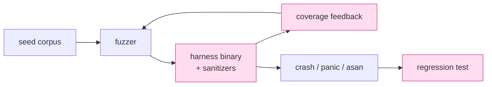

# 課堂 12.8 — Fuzzing：用機械化攻擊找你自己的 bug

## 學前知道
- 前置課：3.14 (crypto eng), 12.2 (crypto impl), 12.3 (handshake parser)
- 預計閱讀時間：**45 分鐘**
- 必讀:
  - **Serebryany, Bruening, Potapenko, Vyukov**. *AddressSanitizer: A Fast Address Sanity Checker*. USENIX ATC 2012 — sanitizer 經典
  - **Stepanov, Serebryany**. *MemorySanitizer: fast detector of uninitialized memory use in C++*. CGO 2015
  - **Aschermann et al.** *REDQUEEN: Fuzzing with Input-to-State Correspondence*. NDSS 2019 — modern fuzzer 之 input shaping
  - **Fioraldi et al.** *AFL++: Combining Incremental Steps of Fuzzing Research*. WOOT 2020 — current SOTA fuzzer
  - **Boehme, Liyanage, Wüstholz**. *Towards Automated Safety Vetting of Smart Contracts in Decentralized Applications*. CCS 2022
  - **Google OSS-Fuzz** writeups（blog.envoyproxy.io、cncf.io、cargo-fuzz examples）
- 必讀原始碼:
  - `rust-fuzz/cargo-fuzz` 範例
  - `google/honggfuzz` flag set
  - `aflplusplus/aflplusplus`
  - `rustls/rustls/fuzz/` 範例
- 自我反省問題:
  - 你跑過 `cargo test` 但跑過 `cargo fuzz` 嗎？兩者保證的 invariant 差別在哪？
  - 你知道 «coverage-guided» fuzzer 為什麼比 random fuzzer 強幾個數量級嗎？

## 動機

Fuzz 是把 parser / state machine / crypto wrapper 暴露給 **adversarial random input** 的 systematic 方法。對 proxy 協議：parser 是 attacker 可直接控制的 surface — fuzz 必跑、不可省。

歷史教訓：
- **Heartbleed (2014)**：OpenSSL parse 漏 bound check — 一個 fuzzer 跑 1 小時就能發現
- **JBIG2/Pegasus (2021)**：iMessage parser bug — Project Zero 跑 fuzzer 找到
- **Wireguard-go (2022)**：goroutine leak — fuzz + stress test 才暴露
- **Hysteria QUIC (2023)**：integer overflow in decode — community report，後 reproduced via fuzz harness

我們的目標：
- 對 `parse_client_hello`、`parse_server_hello`、`parse_record` 等 parser 必須 fuzz
- 對 handshake state machine 也 fuzz（feed 隨機 message sequence）
- 對 KDF / AEAD wrapper 必須 differential fuzz（與 reference 比對）
- 任何 panic / sanitizer 報告 = bug = 必修



---

## 核心概念

### 1. Fuzzer 工作原理

```text
Coverage-guided fuzzer 主迴圈：
  loop:
    input = mutate(corpus)
    cov_before = read_coverage()
    run(target, input)
    cov_after = read_coverage()
    if cov_after > cov_before:
        corpus.add(input)
    if crashed():
        crashes.add(input)
```

關鍵 insight：
- mutation 不是純 random — 偏好 boundary value、bit flip、replace with magic
- coverage 不只 line coverage — edge coverage (BB transitions) 或 PC-trace 更好
- *concolic* fuzz (KLEE) 對 hard branch 用 SMT solve

對 Rust：`cargo-fuzz` 使用 libFuzzer (LLVM-based)，coverage via SanitizerCoverage。

### 2. cargo-fuzz 入門

```bash
$ cargo install cargo-fuzz
$ cd proto-core/
$ cargo fuzz init
$ ls fuzz/
  Cargo.toml  fuzz_targets/
$ cargo fuzz add parse_client_hello
$ vim fuzz/fuzz_targets/parse_client_hello.rs
```

target：

```rust
#![no_main]
use libfuzzer_sys::fuzz_target;
use proto_core::handshake::parse_client_hello;

fuzz_target!(|data: &[u8]| {
    let _ = parse_client_hello(data);
});
```

跑：

```bash
$ cargo fuzz run parse_client_hello -j 8 -- -max_total_time=3600
```

成果：corpus 增長、發現的 crash 存 `fuzz/artifacts/parse_client_hello/`。

### 3. Structured fuzzing：用 `arbitrary` 生型別化輸入

Random bytes 對 deeply structured input（如握手 message sequence）效率低。改用：

```rust
use arbitrary::{Arbitrary, Unstructured};

#[derive(Arbitrary, Debug)]
enum HsAction {
    Send(Vec<u8>),
    Recv(Vec<u8>),
    Rekey,
    Close,
}

fuzz_target!(|actions: Vec<HsAction>| {
    let mut client = ClientHs::new();
    let mut server = ServerHs::new();
    for act in actions {
        match act {
            HsAction::Send(b) => { let _ = client.feed(&b); },
            HsAction::Recv(b) => { let _ = server.feed(&b); },
            HsAction::Rekey => { client.rekey(); },
            HsAction::Close => { client.close(); },
        }
    }
});
```

fuzzer 自動生 valid sequence。發現「state X 收到 message Y 會 panic」之類 bug。

### 4. Differential fuzzing：與 reference 比對

對 crypto wrapper，**唯一可信** test 是與獨立實作對拍：

```rust
fuzz_target!(|input: ([u8; 32], [u8; 12], Vec<u8>, Vec<u8>)| {
    let (key, nonce, aad, pt) = input;
    let ours = our_chacha20poly1305_seal(&key, &nonce, &aad, &pt);
    let theirs = ring_chacha20poly1305_seal(&key, &nonce, &aad, &pt);
    assert_eq!(ours, theirs);
});
```

任何 divergence = bug。對 KDF / sig / KEM 同理。

亦適用 parser：自己 parser vs sing-box parser 比對對 same input 的 result（accept/reject + 解析結果欄位）。

### 5. Sanitizer 組合

Rust nightly 支援多個 sanitizer：

| Sanitizer | flag | 抓 |
|---|---|---|
| ASan | `-Z sanitizer=address` | OOB heap/stack, UAF |
| MSan | `-Z sanitizer=memory` | uninit read |
| TSan | `-Z sanitizer=thread` | data race |
| UBSan | UBSAN | undefined behavior |
| LSan | leak | memory leak |

Cargo:

```bash
$ RUSTFLAGS="-Z sanitizer=address" cargo +nightly fuzz run parse_ch
```

**ASan + 並發**：對協議 state machine 有 raw pointer/unsafe 場合很關鍵。

### 6. OSS-Fuzz 整合（為了 long-running fuzz）

對 mature project，把 fuzz target 推到 Google OSS-Fuzz 跑 24/7 + Cloud reproduction：

- 建 `projects/protoxx/` 在 oss-fuzz repo
- `Dockerfile` + `build.sh` 把 fuzz targets compile 出
- bug 自動報到 monorail，coverage report 自動上 ossfuzz.com

Free tier：免 CPU；要 maintain script。但對 SOTA project，OSS-Fuzz coverage 是 reviewer 期待。

### 7. Go 端 fuzz

Go 1.18+ 內建 fuzz：

```go
func FuzzParseClientHello(f *testing.F) {
    f.Add([]byte{0x01, 0x02})
    f.Fuzz(func(t *testing.T, data []byte) {
        _, _ = ParseClientHello(data)
    })
}
```

跑：

```bash
$ go test -fuzz=FuzzParseClientHello -fuzztime=1h
```

Go fuzz 較弱（基於 random + boundary mutation；無 LLVM coverage instr），但仍有用，特別對 shim 層之 cgo boundary（input 帶入 C 函式時的 boundary）。

### 8. Fuzz target 完整 list（我們協議）

```text
proto-core/fuzz/fuzz_targets/
├── parse_client_hello.rs
├── parse_server_hello.rs
├── parse_encrypted_record.rs
├── parse_padding_frame.rs
├── parse_stream_frame.rs
├── parse_subscription_url.rs
├── handshake_state_machine.rs    -- structured (Vec<HsAction>)
├── differential_kdf.rs
├── differential_aead.rs
├── differential_x25519.rs
├── differential_mlkem.rs
├── shaping_profile.rs            -- 對 profile parser
└── server_accept_byte_stream.rs   -- 對 server accept_loop 之 first byte stream

proto-shim-go/fuzz_test.go
├── FuzzCgoBoundary
├── FuzzConfigUnmarshal
└── FuzzURLParse
```

### 9. CI 整合

`.github/workflows/fuzz.yml`：

```yaml
on:
  push:
  schedule: [{cron: "0 0 * * *"}]
jobs:
  fuzz-quick:
    runs-on: ubuntu-22.04
    strategy:
      matrix:
        target: [parse_client_hello, parse_server_hello, parse_record, ...]
    steps:
      - uses: actions/checkout@v4
      - run: cargo +nightly fuzz run ${{ matrix.target }} -- -max_total_time=180
        # 3-min quick smoke on every push

  fuzz-long:
    if: github.event_name == 'schedule'
    runs-on: ubuntu-22.04
    timeout-minutes: 360
    steps:
      - uses: actions/checkout@v4
      - run: cargo +nightly fuzz run handshake_state_machine -- -max_total_time=18000
```

Long fuzz 每 night 跑 5 小時；crash 自動 PR 上 issue。

### 10. Regression 機制

每個發現的 crash：

```bash
$ cargo fuzz run parse_client_hello fuzz/artifacts/parse_client_hello/crash-deadbeef
# reproducer

$ cp fuzz/artifacts/parse_client_hello/crash-deadbeef tests/regression/parse_ch_crash_0001.bin
```

`tests/regression.rs`：

```rust
#[test]
fn regression_parse_ch_0001() {
    let data = include_bytes!("regression/parse_ch_crash_0001.bin");
    let _ = proto_core::parse_client_hello(data);  // 不 panic 即過
}
```

CI 之 normal test 一定跑 regression directory，避免 bug 復發。

### 11. Coverage tracking

`cargo fuzz coverage <target>`：

```bash
$ cargo fuzz coverage parse_client_hello
$ llvm-cov show -instr-profile=fuzz/coverage/parse_client_hello/coverage.profdata \
    target/x86_64-unknown-linux-gnu/coverage/x86_64-unknown-linux-gnu/release/parse_client_hello \
    --format=html -o coverage_report/
```

目標：**parser 區段 ≥ 95% line coverage**；state machine ≥ 90%。

低 coverage 區段 → 補 seed corpus 或拆 fuzz target。

### 12. Constant-time 與 fuzz 的關係

Fuzz 不直接驗 ct，但能：
- 對 ct critical code 多跑 dudect random input
- 對 ASan output 觀察 memory access pattern；若 pattern depends on secret → 可疑

`cargo-careful` 對 UB 補 sanitizer 之死角；尤其 unsafe block。

---

## 與我們協議設計的關聯

- **Part 12.3 handshake parser**：本堂主要 target
- **Part 12.9 testing**：fuzz corpus 也作為 unit test golden input
- **Part 12.10 互通性**：differential fuzz 對其他實作（如未來別人寫的版本）是 conformance test
- **Part 11 spec security considerations**：parser 之 reject 條件要 spec 明文 → fuzz 是否真照做

---

## 動手

1. 對 `parse_client_hello` 跑 cargo-fuzz 30 分鐘；記錄 crashes（理想 0）
2. 寫 structured `Vec<HsAction>` fuzz target；找出至少 1 個 logic bug（state transition 未處理）
3. 設計 differential fuzz：自己 `chacha20poly1305_seal` vs `ring`
4. 對 `parse_subscription_url` fuzz；驗證對任意 input 不 panic 且 invalid 必 return error
5. 設置 GitHub Action 跑 nightly fuzz；發現 crash 自動建 issue

## 自我檢查

1. Coverage-guided fuzzer 為何比 random fuzzer 強？feedback loop 具體做什麼？
2. `arbitrary` crate 解決什麼問題？對 binary 解析 vs 對 state machine fuzz 用哪個？
3. Differential fuzzing 對加密原語 vs parser 兩者意義差別？
4. 為什麼 ASan + fuzz 對 unsafe Rust code 是黃金組合？對 safe Rust code 也有意義嗎？
5. OSS-Fuzz 要 maintain 哪些檔案？對我們 v0.1 是 essential 還是 nice-to-have？

## 延伸閱讀

- *The Fuzzing Book*（Zeller et al.）— textbook
- *AFL++ documentation*
- *Trail of Bits — "How to fuzz a server"*
- *Google Online Security Blog — OSS-Fuzz writeups*
- *Project Zero blog* — real-world fuzz finding stories

---

## 研究級補遺

### 1. 學界詞彙

| 中文/口語 | 學界詞彙 |
|---|---|
| 隨機測試 | random testing / fuzzing |
| 覆蓋率引導 | coverage-guided fuzzing |
| 符號執行 | symbolic / concolic execution (KLEE, S2E) |
| 差分測試 | differential testing (McKeeman 1998) |
| 性質測試 | property-based testing (QuickCheck, Claessen-Hughes 2000) |
| 變異 | mutation operators (bit flip, dictionary, splice) |
| 種子語料庫 | seed corpus / starting inputs |

### 2. 對手分類學

| 對手 | 攻擊 | fuzz 是否 cover |
|---|---|---|
| Malicious peer (parser RCE) | crafted input crash / RCE | yes，parser fuzz |
| State exploit (resume + replay) | weird state sequence | yes，structured fuzz |
| Crypto downgrade / mismatch | sig wrong type | yes，differential fuzz |
| Side-channel | timing leak | no，fuzz 不抓；用 dudect |
| Spec ambiguity | impl A 與 impl B 互通失敗 | yes，differential w/ reference |

### 3. 形式化定義

**Fuzzing-as-testing**：給定 oracle $O$（panic / crash detector），fuzzer 之目標是 maximize $\Pr_{x \sim D} [O(P(x)) = \text{bug}]$。
**Coverage as proxy oracle**：assume bug 與 coverage 正相關 — *Böhme 2018* 形式化。

### 4. 領域的關鍵論文 / 規格 / 原始碼

1. **Serebryany ASan 2012**
2. **Stepanov MSan 2015**
3. **Böhme et al. AFL++ WOOT 2020**
4. **Aschermann REDQUEEN NDSS 2019**
5. **Cadar KLEE OSDI 2008** — symbolic execution
6. **Manès et al. The Art Science and Engineering of Fuzzing TSE 2019** — survey
7. **Klees et al. Evaluating Fuzz Testing CCS 2018** — empirical study
8. **cargo-fuzz docs**
9. **OSS-Fuzz reports**

### 5. 我們協議的座標 / 設計取捨

- 對 parser surface fuzz 是必跑，不存在 trade-off
- 對 state machine 之 structured fuzz：v0.1 跑；v0.2 引入 differential
- OSS-Fuzz：v0.2 nice-to-have，open source 後做
- 不上 KLEE（投入成本過高，回報不確定）；改 dudect for ct

### 6. 必追資源 / 社群入口

- AFL++ Discord
- rust-fuzz GitHub org
- Google OSS-Fuzz monthly digest
- USENIX Security / NDSS / IEEE S&P 之 fuzzing track

### 7. 開放問題

1. **State-aware fuzzing for handshake**：對 state machine 之 fuzz 在 coverage metric 上仍未飽和
2. **ML-augmented fuzzer**（如 NEUZZ）：對協議 parser 是否能 outperform AFL++？
3. **Provable bug coverage**：對所有 spec-violating input fuzz 是否能 完整 cover？目前無 lower bound
4. **Fuzz harness 自動生成**：從 spec 推 fuzz target — research direction
