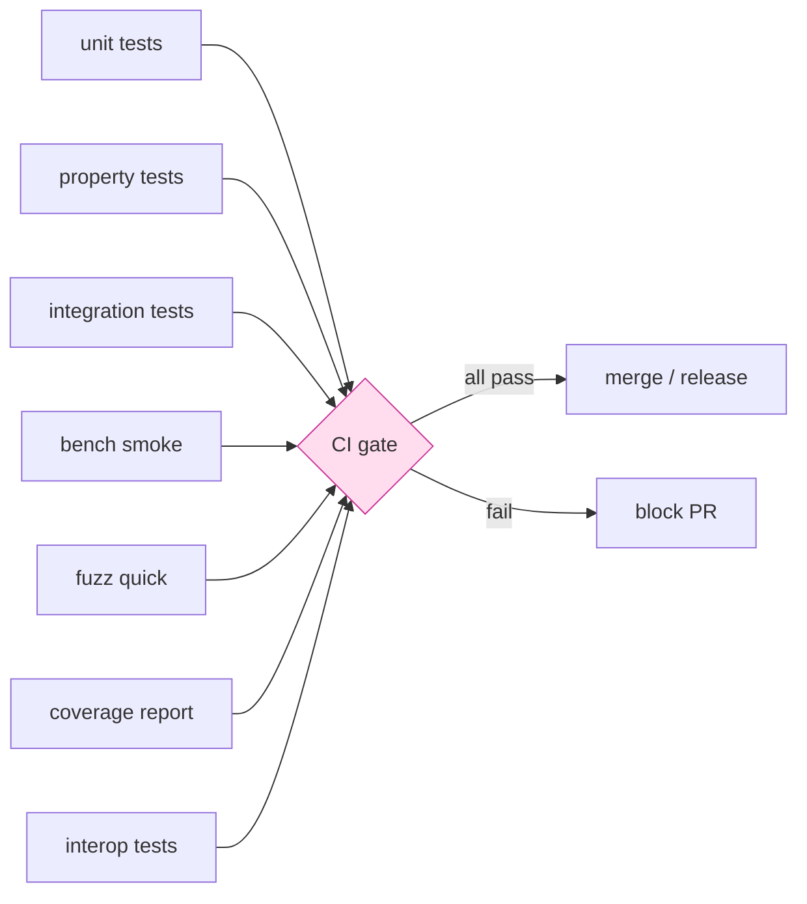

# 課堂 12.9 — 單元測試與整合測試（覆蓋率 ≥ 80%）

## 學前知道
- 前置課：12.1-12.8 全部（被測物件）
- 預計閱讀時間：**45 分鐘**
- 必讀:
  - **Beck**. *Test-Driven Development: By Example*. 2002 — TDD 經典
  - **Myers, Sandler, Badgett**. *The Art of Software Testing*. 第 3 版
  - **Claessen, Hughes**. *QuickCheck: A Lightweight Tool for Random Testing of Haskell Programs*. ICFP 2000 — property-based testing
  - **Bornholt et al.** *Using Lightweight Formal Methods to Validate a Key-Value Storage Node in Amazon S3*. SOSP 2021 — executable models for prop tests
  - **Cohen et al.** *FFI/ABI testing*. OOPSLA 2023 — cross-language test
  - **rustls test corpus** 與 **boring** test setup
- 必讀原始碼:
  - `rustls/rustls/tests/api.rs`
  - `quinn-rs/quinn-proto/tests/`
  - `wireguard-go/device/device_test.go`
- 自我反省問題:
  - 你的 「測試覆蓋率」過去用什麼工具量？對 80% 你信任程度多少？
  - property-based test 你有寫過嗎？跟 example-based 對比，何時用哪個？

## 動機

Fuzz 證明 «不 crash»；test 證明 «行為對 spec 一致»。兩者互補：

| 維度 | 單元測試 | 整合測試 | Fuzz |
|---|---|---|---|
| 範圍 | 一個函數 / 一個 module | 多 component 串接 | 一個 entry function |
| Oracle | hard-coded expected | end-to-end behavior | crash / divergence |
| 速度 | < 1ms / test | 10ms - 5s | 持續跑 |
| Coverage | 計入 | 計入 | 計入 |

Part 12 v0.1 ship 之 quality gate：

```text
[QG-TEST-1]  cargo test 全綠（含 nextest --no-fail-fast）
[QG-TEST-2]  line coverage ≥ 80%（不含 main.rs / build.rs）
[QG-TEST-3]  branch coverage ≥ 70%
[QG-TEST-4]  Spec test vectors 100% pass
[QG-TEST-5]  KAT（known-answer test）100% pass for AEAD / HKDF / X25519 / Ed25519 / ML-KEM
[QG-TEST-6]  Integration tests 100% pass on Linux + macOS + Windows
[QG-TEST-7]  Interop 100% pass between v0.1 binary 與 v0.0 兼容範圍（forward + backward）
[QG-TEST-8]  Fuzz quick-mode 3min × all targets clean
```



---

## 核心概念

### 1. Cargo 測試 layout

```text
crates/proto-core/
├── src/
│   ├── lib.rs
│   ├── handshake.rs    -- 內含 #[cfg(test)] mod tests
│   └── ...
├── tests/              -- integration tests
│   ├── handshake_roundtrip.rs
│   ├── interop_v00.rs
│   └── regression/
│       └── crashes/
├── benches/
│   └── crypto.rs       -- criterion
└── fuzz/               -- (12.8)
```

最佳實踐：
- `#[cfg(test)] mod tests` 每 file 末尾，測 internal impl 細節
- `tests/` integration tests，黑盒 ext API
- `benches/` criterion-based microbench
- `examples/` 對 user 之 documentation example，也是 smoke test

### 2. 單元測試風格

```rust
#[cfg(test)]
mod tests {
    use super::*;

    #[test]
    fn nonce_from_seq_matches_rfc8446() {
        let iv = [0u8; 12];
        let seq = 1u64;
        let n = nonce_from_seq(&iv, seq);
        assert_eq!(n[11], 1);
        for b in &n[..11] { assert_eq!(*b, 0); }
    }

    #[test]
    fn psk_binder_roundtrip() {
        let psk = SessionKey::from_bytes([1u8; 32]);
        let pre = b"transcript-bytes";
        let b1 = compute_binder(&psk, pre);
        let b2 = compute_binder(&psk, pre);
        assert!(bool::from(b1.ct_eq(&b2)));
    }

    #[test]
    #[should_panic(expected = "InvalidLength")]
    fn parse_ch_rejects_too_short() {
        let _ = parse_client_hello(&[0u8; 5]).unwrap();
    }
}
```

注意 conventions：
- 測試函式 named: `<thing>_<expected_behavior>_<condition>`
- 一 test 一 assert 為主；多 assert 也 OK 若邏輯緊密
- `#[should_panic]` 對預期 panic
- 不在測試 setup 內 hide 邏輯 — 測試之 setup 也是 test 一部分

### 3. Property-based tests (proptest)

```rust
use proptest::prelude::*;

proptest! {
    #[test]
    fn aead_decrypts_what_it_encrypts(
        key in proptest::array::uniform32(any::<u8>()),
        nonce_seq in any::<u64>(),
        aad in proptest::collection::vec(any::<u8>(), 0..256),
        pt in proptest::collection::vec(any::<u8>(), 0..4096),
    ) {
        let key = SessionKey::from_bytes(key);
        let nonce = nonce_from_seq(&[0u8; 12], nonce_seq);
        let mut buf = pt.clone();
        let tag = seal_in_place(&key, &nonce, &aad, &mut buf)?;
        let dec_ok = open_in_place(&key, &nonce, &aad, &mut buf, &tag);
        prop_assert!(dec_ok.is_ok());
        prop_assert_eq!(&buf, &pt);
    }
}
```

proptest 自動 shrink：發現 bug 後 minimize input 到最小 reproducer。

### 4. 已知答案測試 (KAT)

對 crypto primitive 必跑：

```rust
#[test]
fn chacha20_poly1305_rfc8439_kat() {
    let kat = include_str!("../tests/kat/chacha20poly1305.json");
    let vectors: Vec<ChaChaKat> = serde_json::from_str(kat).unwrap();
    for v in vectors {
        let ct = seal(&v.key, &v.nonce, &v.aad, &v.plaintext);
        assert_eq!(ct, v.ciphertext_and_tag);
    }
}
```

Source：
- RFC 8439 §2.8.2
- Project Wycheproof（覆蓋 edge cases）
- NIST CAVP

### 5. Spec conformance tests

對應 spec 之 byte-level fixture：

```rust
#[test]
fn spec_v01_test_vector_handshake_minimal() {
    // 來自 spec §A.1 — verbatim hex
    let psk = hex!("00112233...");
    let server_static = hex!("aabbccdd...");
    let expected_ch = hex!("01010000...");

    let mut rng = DeterministicRng::new(0xDEADBEEF);
    let (state, ch) = ClientHs::start(&Cfg { psk, server_static, ..test() }, &mut rng);
    assert_eq!(ch, expected_ch);
}
```

deterministic RNG 是這類 test 的關鍵：所有 ephemeral derived from RNG seed。可重現性 = reviewer 能 byte-by-byte 對拍。

### 6. State machine tests

```rust
#[test]
fn server_rejects_finished_before_sh() {
    let mut s = ServerHs::new(&cfg);
    let dummy_finished = vec![0x05; 64];
    let r = s.feed(&dummy_finished);
    assert!(matches!(r, Err(HsError::UnexpectedMessage)));
}

#[test]
fn typestate_prevents_double_recv_sh() {
    let (c, _ch) = ClientHs::start(&cfg);
    let c = c.recv_server_hello(&sh).unwrap();
    // c is now ClientHs<WaitFin>; no .recv_server_hello method 可呼叫
    // 編譯期擋掉 — 此 test 是 doc test，不是 runtime test
}
```

### 7. Integration tests

E2E test：起 server + client + dummy upstream，確認 echo through proxy 正確：

```rust
#[tokio::test]
async fn echo_through_proxy() {
    let upstream = spawn_echo_tcp_server().await;
    let proxy_server = spawn_proto_server(upstream.local_addr()).await;
    let proxy_client = ProtoClient::connect(proxy_server.local_addr(), test_cfg()).await?;
    let mut stream = proxy_client.dial("upstream.invalid:80").await?;
    stream.write_all(b"hello\n").await?;
    let mut buf = [0u8; 6];
    stream.read_exact(&mut buf).await?;
    assert_eq!(&buf, b"hello\n");
}
```

每 platform 必跑：GitHub Actions matrix `runs-on: [ubuntu, macos, windows]`。

### 8. Cross-language interop test

Rust core + Go shim 必須一致：

```go
func TestShimRoundtrip(t *testing.T) {
    cfg := testConfig()
    serverAddr := startServer(t, cfg)
    sess, err := proto.NewSession(cfg.Client(serverAddr))
    if err != nil { t.Fatal(err) }
    defer sess.Close()

    if _, err := sess.Write([]byte("hello")); err != nil { t.Fatal(err) }
    buf := make([]byte, 5)
    if _, err := sess.Read(buf); err != nil { t.Fatal(err) }
    if string(buf) != "hello" { t.Fatalf("got %q", buf) }
}
```

`go test -race` 必過：data race 報 = bug。

### 9. Coverage 工具

```bash
# Rust
$ cargo install cargo-llvm-cov
$ cargo llvm-cov --workspace --lcov --output-path lcov.info
$ cargo llvm-cov report  # 看 line/branch breakdown

# Go
$ go test -coverprofile=cover.out ./...
$ go tool cover -html=cover.out -o cover.html
```

CI 上傳 `lcov.info` / `cover.out` 到 codecov.io / coveralls；PR diff coverage 必 ≥ 80%。

### 10. Mutation testing（進階）

mutation testing：「故意改你的 code，看 test 是否還 fail」。若不 fail，test suite 沒測到那行邏輯。

Rust 用 `cargo-mutants`：

```bash
$ cargo install cargo-mutants
$ cargo mutants --in-place
```

報告：
```
MISSED: src/handshake.rs:128: replace == with !=
CAUGHT: src/aead.rs:54: replace + with -
```

Missed mutant → test 寫得不夠 strong → 修。

對 critical crypto code 必跑 mutation；coverage 80% 不等於 test 好。

### 11. Benchmark as test：performance regression detection

```rust
use criterion::{criterion_group, criterion_main, Criterion};

fn bench_aead_seal(c: &mut Criterion) {
    let key = SessionKey::from_bytes([0u8; 32]);
    let mut buf = vec![0u8; 1380];
    let nonce = [0u8; 12];
    c.bench_function("aead_seal_1380B", |b| {
        b.iter(|| seal_in_place(&key, &nonce, b"", &mut buf))
    });
}

criterion_group!(benches, bench_aead_seal);
criterion_main!(benches);
```

CI 跑 baseline，每 PR 比 5% regression 警告。`criterion-rs` 內建 statistical analysis。

### 12. Test 質量 checklist

```text
[Q-TEST-1]  每 public function 有至少 1 test
[Q-TEST-2]  Edge case 顯式測：empty, max length, malformed bytes
[Q-TEST-3]  Error path 測（不只 happy path）
[Q-TEST-4]  Property test 對所有 «invariant 描述能寫出來» 的 function
[Q-TEST-5]  Concurrent path 用 loom / shuttle 跑 model check
[Q-TEST-6]  Cross-platform：CI matrix Linux/macOS/Windows
[Q-TEST-7]  Cross-version：每個 minor version 與前一 minor version 互通
[Q-TEST-8]  Spec test vectors 完整 100% pass
[Q-TEST-9]  KAT 對所有 crypto primitive
[Q-TEST-10] Mutation testing 對 critical module（≥ 80% caught）
```

### 13. `loom` / `shuttle`：並發 model checker

Rust 的 `loom` 對 atomic / Mutex 做 exhaustive scheduling exploration：

```rust
#[test]
#[cfg_attr(loom, ignore)]
#[cfg_attr(not(loom), test)]
fn no_loom_test() { ... }

#[cfg(loom)]
mod loom_tests {
    use loom::sync::Arc;
    use loom::thread;

    #[test]
    fn handshake_concurrent_send_no_race() {
        loom::model(|| {
            let session = Arc::new(Session::new());
            let s2 = Arc::clone(&session);
            let h1 = thread::spawn(move || s2.send(b"a"));
            let h2 = thread::spawn(move || session.send(b"b"));
            h1.join().unwrap();
            h2.join().unwrap();
        });
    }
}
```

`cargo test --features loom --release` 跑；對 race 條件找窮舉。
對 share-nothing thread-per-core 設計可大幅減少這類 test 必要性。

### 14. Documentation tests

Rust `cargo test` 跑 docstring code：

```rust
/// Compute binder for a transcript prefix.
///
/// ```
/// use proto_core::handshake::*;
/// let psk = SessionKey::from_bytes([0u8; 32]);
/// let binder = compute_binder(&psk, b"hello");
/// assert_eq!(binder.len(), 32);
/// ```
pub fn compute_binder(psk: &SessionKey, transcript: &[u8]) -> [u8; 32] { ... }
```

double duty：教學 + test，永遠同步。

---

## 與我們協議設計的關聯

- **Part 12.10 interop**：本堂的 cross-impl tests 是 dummy version；12.10 對真實外部 impl
- **Part 12.11-12.14 benchmark**：本堂 microbench 是 macro-bench 的 sanity check
- **Part 11.x spec**：spec test vector 規定 byte-level fixture
- **Part 12.18 真實環境**：integration test 必涵蓋至少 1 «網路條件 emulator» 場景

---

## 動手

1. 在 `proto-core` 開啟 `cargo llvm-cov`，量現有測試覆蓋率
2. 補測試直到 line coverage ≥ 80%；branch coverage ≥ 70%
3. 用 proptest 對 `nonce_from_seq` + `compute_binder` 跑 1 萬 case
4. 寫 spec §A.1 之 byte-level fixture test
5. 跑 `cargo-mutants`，補測直到 「critical files」mutation kill rate ≥ 80%

## 自我檢查

1. 為什麼 «line coverage 80%» 不夠？要加什麼條件才足以稱 test suite "strong"？
2. property-based test 對於 «crypto seal/open 等價回 plaintext» 之 invariant，與 hand-written test vector 比，優缺各是什麼？
3. 為什麼 doctest 對 documentation drift 是好工具？
4. mutation testing 之 false positive （test 不死 but 仍正確）通常源於什麼？
5. loom 對 share-nothing 設計是否仍有價值？

## 延伸閱讀

- *Working Effectively with Legacy Code* (Feathers) — 對既有 codebase 加 test
- *Property-Based Testing with PropEr, Erlang, and Elixir* (Hébert)
- *Designing Data-Intensive Applications* — concurrency 章
- *Rust Performance Book* — bench 部分
- *cargo-llvm-cov* / *cargo-mutants* GitHub README

---

## 研究級補遺

### 1. 學界詞彙

| 中文/口語 | 學界詞彙 |
|---|---|
| 單元測試 | unit test |
| 整合測試 | integration test / end-to-end test |
| 性質測試 | property-based test |
| 已知答案 | known-answer test (KAT) / test vector |
| 變異測試 | mutation testing |
| 並發模型檢查 | concurrent model checking (loom, shuttle, CHESS) |
| 覆蓋率 | code coverage (line, branch, MC/DC) |

### 2. 對手分類學

對 test 而言「對手」是漏網 bug；分類：

| Bug 類別 | 防禦 test 類型 |
|---|---|
| Parse OOB | fuzz + property |
| Auth bypass | spec test vector + integration |
| State transition error | structured fuzz + state machine test |
| Crypto misuse | KAT + differential |
| Race / deadlock | loom / TSan |
| Spec drift | spec conformance fixture |

### 3. 形式化定義

**Soundness of testing**：對 spec $S$，program $P$，test suite $T$，若 $\forall t \in T: P(t) = S(t)$ 但 $\exists x \notin T: P(x) \ne S(x)$ —— test suite 不足。
**Strength** （mutation kill rate）：$\frac{|\{m : T \text{ kills } m\}|}{|M|}$ for mutant set $M$.

### 4. 領域的關鍵論文 / 規格 / 原始碼

1. **Claessen-Hughes QuickCheck ICFP 2000**
2. **Beck TDD 2002**
3. **DeMillo-Lipton-Sayward Mutation 1978** — mutation testing 起源
4. **Just et al. Major Mutation Tool ISSRE 2014**
5. **Bornholt S3 SOSP 2021** — executable model
6. **Cargo-fuzz / cargo-llvm-cov / cargo-mutants** docs
7. **loom** docs

### 5. 我們協議的座標 / 設計取捨

- v0.1：80% line coverage gate；critical modules mutation ≥ 80%
- v1.0：100% spec fixture, ≥ 90% line coverage, ≥ 80% branch
- loom：應用 share-something module (panel) 但 core thread-per-core 不必
- Mutation：對 crypto + parser 必跑；對 GUI/CLI 不跑

### 6. 必追資源 / 社群入口

- ISSTA / ASE 國際會議
- rust-lang/cargo-mutants 維護者 Martin Pool's blog
- Hillel Wayne newsletter（formal + test crossover）

### 7. 開放問題

1. **Test-Spec coupling**：怎麼自動 detect spec 改變後 test obsolete？
2. **AI-generated tests**：LLM 產 test 之 quality 與覆蓋率仍 open
3. **Probabilistic guarantee**：fuzz + property + KAT 三層 combined 給予多少 bug 找出率？實證 vs 理論差距
4. **Cross-language differential test 自動化**：兩個 impl 跑 同 input，發現 disagreement → 自動 minimize → bisect git history；現代工程仍 manual
