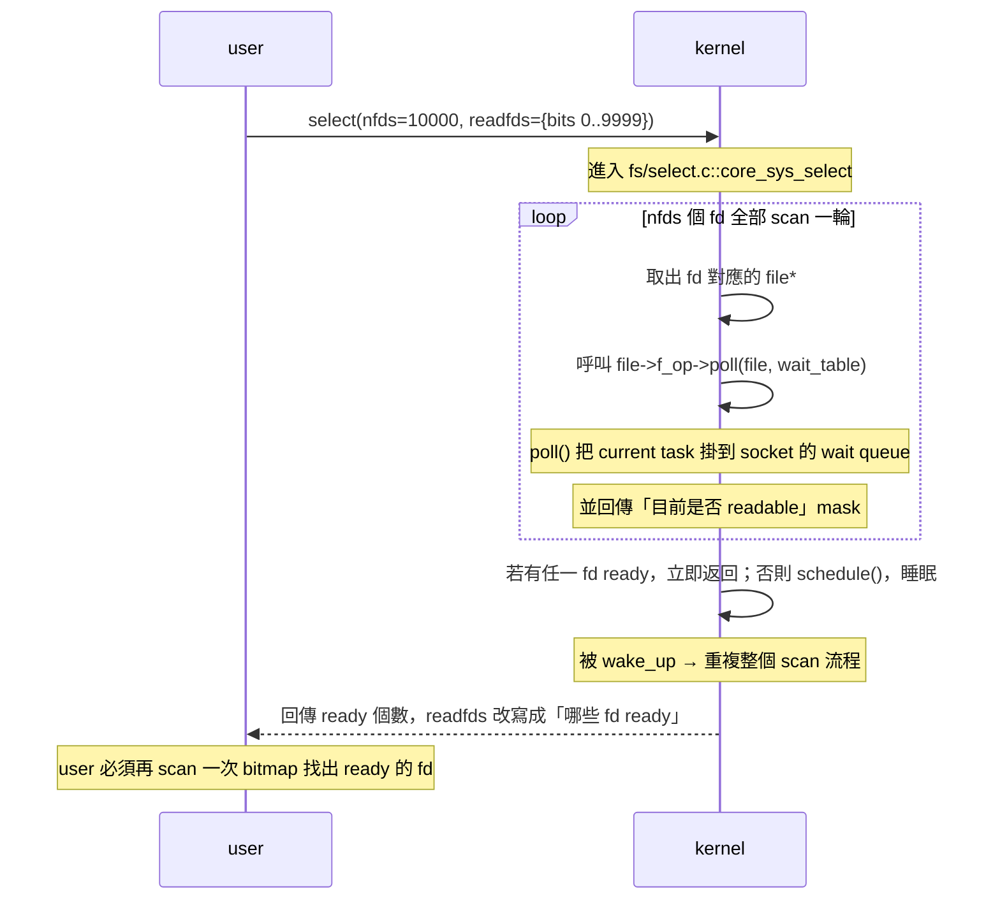
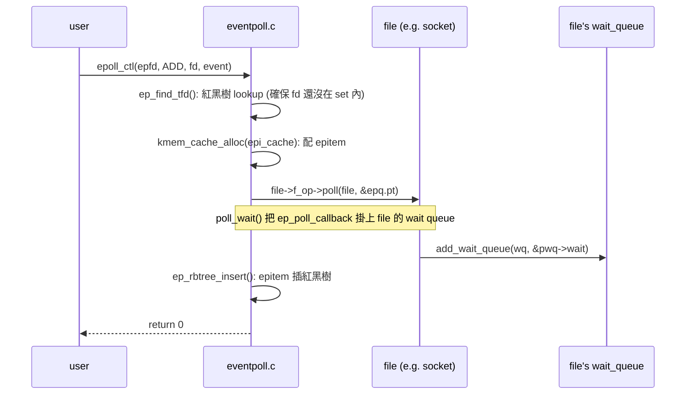

# 課堂 2.1 — 從 select 到 epoll：Linux I/O 多工的三十年演化

## 學前知道

- **前置課**：
  - [1.1 分層的真實意義](../part-1-networking/1.1-layering-truth.md)（socket 是 L4/L7 之間的核心 abstraction）
  - [1.3 乙太網路與 L2](../part-1-networking/1.3-ethernet-l2.md)（NIC interrupt → softirq → socket 是 packet 進入 user space 的最後一段）
- **預計閱讀時間**：60~80 分鐘
- **必讀論文 / 文章**：
  - **Banga, Mogul, Druschel — A Scalable and Explicit Event Delivery Mechanism for UNIX** (USENIX ATC 1999) ⭐ — 史上第一篇明確指出 `select()` O(N) 病灶並提出 explicit event delivery 設計的論文，是 epoll/kqueue 的學術源頭
  - **Lemon — Kqueue: A Generic and Scalable Event Notification Facility** (USENIX ATC 2001) ⭐ — FreeBSD `kqueue` 設計論文。雖然我們學的是 Linux epoll，但 kqueue 在設計上更乾淨（filter + udata），讀完才知道 epoll 的選擇是「實作妥協」
  - **Provos & Lever — Scalable Network I/O in Linux** (USENIX ATC 2000) — `/dev/epoll` 的 Linux 原始提案（後來才改名成 `epoll`），介紹 hint-based collection 與 ET 的最早討論
  - **Libenzi — `epoll_*` patch series** (lkml.kernel.org 2001-2003) — Davide Libenzi 把 `/dev/epoll` 重寫成現在的 `epoll_create / epoll_ctl / epoll_wait` syscall。沒正式論文，但 patch 訊息是必讀
  - **The C10K problem** — Dan Kegel 1999 起持續更新的綜述 — 整個高效能 server 領域的歷史視角
- **必讀原始碼**（Linux 6.x 主線）：
  - `fs/eventpoll.c`：epoll 主體（紅黑樹 + ready list 雙資料結構）
  - `include/linux/eventpoll.h`、`include/uapi/linux/eventpoll.h`：常數與資料結構 layout
  - `fs/select.c`：select / poll 的 kernel 實作（理解「為何 O(N)」必須讀）
  - `net/socket.c::sock_poll` 與 `net/ipv4/tcp.c::tcp_poll`：socket 的 `f_op->poll` callback 怎麼被 epoll 呼叫
  - `kernel/sched/wait.c`：wait queue 機制（epoll 把 callback 掛在這上面）

---

## 動機

> 對 Proteus 設計的具體相關性

我們要設計的協議要在 1Gbps~10Gbps VPS 上跑，並且每個 VPS 同時服務上千條客戶連線。在 Part 11/12 寫 server 時，**怎麼讓一個 thread 處理上萬條 connection** 是死活問題。這是 1999 年 Dan Kegel 提的 **C10K problem**（同時跑一萬條連線），2026 年我們其實在解 **C10M problem**（千萬連線、單機 1M qps echo）。

C10M 的 sub-problem 之一就是「**fd readiness 通知**」：

- Server 有 10000 個 TCP socket fd
- 大部分時刻只有 ~50 個有資料可讀
- 怎麼用最低 CPU 找出這 50 個？

`select()` / `poll()` / `epoll` / `kqueue` / `io_uring` 是過去 30 年對這題的五次回答。本堂講前四個（io_uring 在 2.2 講，因為它解的是更廣的「I/O 提交+完成」問題，不只是 readiness）。

但本堂的真正價值**不是**教你「用 epoll」——那是 Stack Overflow 教的事。本堂教你：

1. **為何 select 是 O(N) 的，O(N) 在哪一行 kernel code**：理解病灶才能評估替代方案
2. **epoll 的紅黑樹 + ready list 雙結構為何是「正確」的資料結構選擇**：這對我們之後設計 Proteus control plane 的 connection table 是直接 reusable 的思路
3. **edge-triggered vs level-triggered 完整語意**：99% 的程式設計教材講錯。我們在 Part 12 寫 proxy 時用錯就會 deadlock，且這種 bug 在 staging 環境不會出現，只在 production 高負載下偶發——是最致命的一類
4. **驚群問題（thundering herd）與 `SO_REUSEPORT` 的關係**：直接決定 Proteus 多 worker 架構的設計
5. **epoll 與 kqueue 的對比**：因為我們要 cross-platform（macOS 開發 + Linux 部署），這個對比是 Day 1 知識

---

## 核心概念

### 1. 問題定義：fd readiness 通知

抽象來看，「I/O 多工」就是這個 function：

```
input:  N 個 fd，每個有「我關心 readable / writable / error」三種事件
output: 在這 N 個 fd 裡，至少 1 個有事件發生時，告訴我是哪些
```

最 naive 的解法：

```
while True:
    for fd in fds:
        if has_data(fd):
            handle(fd)
```

問題：`has_data(fd)` 怎麼問？**沒有 syscall** 直接問。傳統 UNIX 唯一的方法是 `read()`，但 `read()` 在 blocking mode 會睡死、在 non-blocking mode 會 `EAGAIN` 但你仍然需要每個 fd 都試一次——這就是 **busy poll**，CPU 100%。

於是 1983 年 4.2BSD 給了 `select()`，讓「**多個 fd 同時等**」變成一個 syscall。

### 2. `select()` 的解法（4.2BSD, 1983）

```c
int select(int nfds, fd_set *readfds, fd_set *writefds,
           fd_set *exceptfds, struct timeval *timeout);
```

`fd_set` 是 bitmap：

- 大小固定 `FD_SETSIZE`（Linux glibc 預設 1024）
- 第 `i` bit = 1 代表「我關心 fd `i`」

呼叫流程：



#### O(N) 病灶的 kernel 代碼位置

打開 `fs/select.c::do_select`（Linux 6.x）：

```c
// fs/select.c::do_select (節錄，行號約 487-553，6.6 kernel)
for (;;) {
    // 外迴圈：每次喚醒後重跑
    for (i = 0; i < n; ++rinp, ++routp, ++rexp) {
        // ↑ 這就是 O(N) 來源：對所有 nfds scan
        unsigned long in, out, ex, all_bits, bit = 1, j;
        unsigned long res_in = 0, res_out = 0, res_ex = 0;
        __poll_t mask;

        in = *inp++; out = *outp++; ex = *exp++;
        all_bits = in | out | ex;
        if (all_bits == 0) {
            i += BITS_PER_LONG;
            continue;
        }

        for (j = 0; j < BITS_PER_LONG; ++j, ++i, bit <<= 1) {
            if (i >= n)
                break;
            if (!(bit & all_bits))
                continue;
            mask = EPOLLNVAL;
            f = fdget(i);
            if (fd_file(f)) {
                wait_key_set(wait, in, out, bit, busy_flag);
                mask = vfs_poll(fd_file(f), wait);
                //         ↑ 對每個 fd 呼叫 ->poll()
                //         即使該 fd 整年都沒事件，也每次 select() 都呼叫一遍
                fdput(f);
            }
            // ... 收集 mask
        }
    }
    // ... 沒有 ready 就 schedule_hrtimeout_range
}
```

**三重 O(N) 開銷**：

1. **每次 syscall 都要 copy `fd_set` 從 user 到 kernel**：bitmap 大小 = `nfds / 8` bytes。10000 fd → 1250 bytes 每方向 × 3 個 set = ~7.5KB copy，每次 select() 都做一次
2. **kernel 內 O(N) scan**：上面那段 `for j in BITS_PER_LONG` 迴圈
3. **回到 user 後再 O(N) scan**：user code 必須再跑一輪 bitmap 才知道哪些 fd ready

更糟的是 **每次返回，wait queue 必須全部 unregister；下次呼叫，必須全部重新 register**——因為 kernel 不在 select() 之間保持任何狀態。

#### `FD_SETSIZE = 1024` 的歷史創傷

`fd_set` 是 stack-allocated bitmap。glibc 把 `FD_SETSIZE` 寫死 1024。超過 1024 的 fd 在 `FD_SET()` 時會踩出 stack——**silent corruption**。

> ⚠️ **歷史巨坑**：很多 1990s server（Apache prefork、早期 nginx 前身）就是因為 fd > 1024 而 crash。即使 Linux kernel 支援更大 nfds，glibc 的 `select()` wrapper 也會 ABI-break。**所以 select 在 2026 年實質上已不可用**——除非寫 portable code 給 1990s UNIX。

### 3. `poll()` 的微小改進（System V）

```c
struct pollfd {
    int   fd;        // 要監控的 fd
    short events;    // 我關心什麼（POLLIN | POLLOUT | ...）
    short revents;   // kernel 回填：實際發生什麼
};

int poll(struct pollfd *fds, nfds_t nfds, int timeout);
```

`poll()` 改進在於：

- **不用 bitmap 用 array**，所以**沒有 FD_SETSIZE 限制**
- **events / revents 分開**，所以呼叫者不必每次重設關心的事件

但 **O(N) 病灶完全沒解**。打開 `fs/select.c::do_poll`：

```c
// fs/select.c::do_poll (節錄)
for (walk = list; walk != NULL; walk = walk->next) {
    struct pollfd *pfd, *pfd_end;
    pfd = walk->entries;
    pfd_end = pfd + walk->len;
    for (; pfd != pfd_end; pfd++) {
        if (do_pollfd(pfd, pt, &can_busy_loop, busy_flag)) {
            // ↑ 對 array 裡每個 fd 都呼叫 ->poll()
            count++;
            pt->_qproc = NULL;
            busy_flag = 0;
        }
    }
}
```

**還是每次 syscall 都重 scan 所有 fd、重註冊所有 wait queue**。1990s 末 web server 從幾百 fd 跳到幾千 fd 時，poll 也撐不住。

### 4. 學界第一輪正確答案：Banga 1999 與 kqueue

#### Banga 等人 USENIX ATC 1999 的洞察

Banga, Mogul, Druschel 那篇 *A Scalable and Explicit Event Delivery Mechanism* 提出兩個 idea，幾乎所有現代 I/O 多工 API 都繼承：

1. **「Interest set」與「ready set」分離**：
   - select/poll 每次 syscall 都要重傳「我關心哪些 fd」（interest set）
   - 正確設計應該讓 **interest set 是 kernel-side persistent state**，user 只增量修改（add / remove / modify）
   - 然後 **ready set 是「自從上次拿過後新出現的事件」**，O(R) 大小（R = 真實 ready 數）

2. **Edge-triggered notification**：
   - 不重複通知「這個 fd 還是 readable」，只通知「狀態變化的瞬間」
   - 這比 select 的 level-triggered 少 90%+ 的 syscall 回傳量

#### Solaris `/dev/poll` 與 Linux 早期 `/dev/epoll`

兩者用「**寫進 device file 來操作 interest set，讀 device file 拿 ready set**」的設計。雖然後來都被專屬 syscall 取代，但**核心資料結構就是 epoll 的祖先**。

#### FreeBSD kqueue（Lemon 2001）

`kqueue` 比 `/dev/epoll` 設計乾淨：

```c
// 一個 syscall 同時做「修改 interest set」與「取 ready event」
int kevent(int kq,
           const struct kevent *changelist, int nchanges,
           struct kevent      *eventlist, int nevents,
           const struct timespec *timeout);

struct kevent {
    uintptr_t ident;   // fd / pid / signum / ...
    int16_t   filter;  // EVFILT_READ / WRITE / VNODE / PROC / SIGNAL / TIMER / USER ...
    uint16_t  flags;   // EV_ADD / DELETE / ENABLE / DISABLE / ONESHOT / CLEAR / ...
    uint32_t  fflags;  // filter-specific flags
    intptr_t  data;    // filter-specific data
    void      *udata;  // user data，會原樣返回
};
```

kqueue 比 epoll 強的地方：

- **filter 機制統一**：fd、process、signal、timer、user event（手動 wake）都是同一個 API。epoll 為了同樣功能要疊 `eventfd / signalfd / timerfd / inotify`
- **`udata` 直接傳指標**：epoll 的 `epoll_data` 只能塞 `int` 或 `void*` 之一，且 union 設計易誤用
- **一次 syscall 同時 add + wait**：epoll 必須 `epoll_ctl()` × N + `epoll_wait()` × 1

⚠️ macOS 的 kqueue 雖然 API 同 FreeBSD，但實作有 bug 與限制（特別是 `EVFILT_VNODE` 跟某些 socket 邊緣 case）。寫 cross-platform 時要意識到。

### 5. Linux `epoll` 設計詳解

`epoll` 由 Davide Libenzi 在 2002-2003 引入主線 kernel（2.5.44+，2.6 開始穩定）。

#### API

```c
int  epoll_create1(int flags);                                          // 建立 epoll instance
int  epoll_ctl(int epfd, int op, int fd, struct epoll_event *event);   // 修改 interest set
int  epoll_wait(int epfd, struct epoll_event *events,
                int maxevents, int timeout);                            // 取 ready set
int  epoll_pwait2(int epfd, struct epoll_event *events,
                  int maxevents,
                  const struct timespec *timeout,
                  const sigset_t *sigmask);                             // 6.x 新增，nanosecond 精度

struct epoll_event {
    uint32_t     events;   // EPOLLIN | EPOLLOUT | EPOLLET | EPOLLONESHOT | ...
    epoll_data_t data;     // user data（fd / ptr / u32 / u64 union）
};
```

#### 內部資料結構：紅黑樹 + 雙向 ready list

打開 `fs/eventpoll.c`，找 `struct eventpoll`（行號約 192-260，6.6 kernel）：

```c
struct eventpoll {
    // 鎖：保護下面所有東西
    struct mutex mtx;

    // 等 epoll_wait 的 task 們掛在這
    wait_queue_head_t wq;

    // 等 poll(epfd) 自己的 task（epoll 可以 nested）
    wait_queue_head_t poll_wait;

    // ★ 紅黑樹：interest set
    //   key = (file*, fd) tuple
    //   value = struct epitem
    //   操作：epoll_ctl(ADD/MOD/DEL) → rb_insert / rb_erase
    //   作用：用 (file,fd) 找到對應的 epitem，O(log N)
    struct rb_root_cached rbr;

    // ★ 雙向鏈表：ready list
    //   ready 的 epitem 被掛到這條 list
    //   epoll_wait 從 list head 取出
    //   操作：list_add_tail (在 callback 裡)、list_del_init (在 epoll_wait 裡)
    //   作用：O(1) push、O(R) collect R 個 ready 事件
    struct list_head rdllist;

    // ovflist：當 epoll_wait 正在把 rdllist 往 user copy 時，
    // 新進來的 ready event 暫時掛這裡，避免破壞 rdllist iteration
    struct epitem *ovflist;

    // 對應的 user file（epoll instance 本身是個 file）
    struct file *file;
    struct user_struct *user;

    // 統計
    unsigned int napi_id;          // SO_INCOMING_NAPI_ID 用
    u32 busy_poll_usecs;           // busy poll 配置
    // ...
};
```

每個被監控的 fd 對應一個 `struct epitem`（行號約 137-175）：

```c
struct epitem {
    union {
        struct rb_node rbn;          // 串在 eventpoll.rbr 紅黑樹上
        struct rcu_head rcu;
    };

    struct list_head rdllink;        // 串在 eventpoll.rdllist 雙向鏈表上

    struct epitem *next;             // ovflist 用

    struct epoll_filefd ffd;         // (file*, fd) — 紅黑樹 key

    // wait queue entry：當 fd 對應的 file 變 ready 時，
    // file 的 wait queue 會 invoke 這條 entry 的 callback (= ep_poll_callback)
    struct eppoll_entry *pwqlist;
    int nwait;

    struct eventpoll *ep;            // 反向指標
    struct list_head fllink;         // file 上 of epitems list

    struct wakeup_source __rcu *ws;  // EPOLLWAKEUP 用

    struct epoll_event event;        // user 設定的 events + data
};
```

#### 註冊流程：`epoll_ctl(EPOLL_CTL_ADD)`



關鍵在那個 `f_op->poll`。Socket 的 `f_op->poll` 是 `sock_poll`，它呼叫 `tcp_poll`：

```c
// net/ipv4/tcp.c::tcp_poll (節錄, 6.6 kernel 行號約 565-650)
__poll_t tcp_poll(struct file *file, struct socket *sock, poll_table *wait)
{
    __poll_t mask;
    struct sock *sk = sock->sk;

    sock_poll_wait(file, sock, wait);
    //  ↑ 這一行：把 caller (epoll 的 ep_poll_callback) 掛上 sk_sleep(sk) wait queue

    state = inet_sk_state_load(sk);
    if (state == TCP_LISTEN)
        return inet_csk_listen_poll(sk);

    mask = 0;
    if (READ_ONCE(sk->sk_shutdown) == SHUTDOWN_MASK ...) mask |= EPOLLHUP;
    // ... 一堆 status check ...
    if (... 有資料可讀 ...)
        mask |= EPOLLIN | EPOLLRDNORM;
    if (... 可寫 ...)
        mask |= EPOLLOUT | EPOLLWRNORM;
    return mask;
}
```

**重點**：`poll()` callback 做了**兩件事**——
1. 把 caller 掛上 socket 的 wait queue（之後 socket 有事就會被 callback）
2. **同時**回傳當前狀態 mask（如果現在就 ready，不必等 callback）

#### 事件觸發流程：`ep_poll_callback`

當 packet 到達、`tcp_rcv_established()` 處理完、`sk->sk_data_ready()` 被呼叫，最終會 `wake_up_interruptible(sk_sleep(sk))`，這會 invoke 所有掛在 wait queue 的 callback——包含我們的 `ep_poll_callback`：

```c
// fs/eventpoll.c::ep_poll_callback (節錄)
static int ep_poll_callback(wait_queue_entry_t *wait, unsigned mode,
                             int sync, void *key)
{
    struct epitem *epi = ep_item_from_wait(wait);
    struct eventpoll *ep = epi->ep;
    __poll_t pollflags = key_to_poll(key);

    // 鎖 ep->lock (spinlock)
    spin_lock_irqsave(&ep->lock, flags);

    // 過濾：只關心 user 註冊的 events
    if (pollflags && !(pollflags & epi->event.events))
        goto out_unlock;

    // ★ 把 epitem 加到 rdllist 末尾
    if (!ep_is_linked(epi)) {
        list_add_tail(&epi->rdllink, &ep->rdllist);
    }

    // wake up 等 epoll_wait 的 task
    if (waitqueue_active(&ep->wq))
        wake_up(&ep->wq);
    if (waitqueue_active(&ep->poll_wait))
        pwake++;

out_unlock:
    spin_unlock_irqrestore(&ep->lock, flags);
    if (pwake) ep_poll_safewake(ep, epi, pollflags);
    return 1;
}
```

**整個關鍵在這條 fast path：packet → softirq → tcp_data_ready → wake_up → ep_poll_callback → list_add_tail(rdllist) → wake epoll_wait**。**沒有任何 O(N) 操作**。

#### 收集流程：`epoll_wait`

```c
// fs/eventpoll.c::ep_send_events (節錄)
// 把 rdllist 上的東西複製到 user space
static int ep_send_events(struct eventpoll *ep,
                          struct epoll_event __user *events,
                          int maxevents)
{
    LIST_HEAD(txlist);

    mutex_lock(&ep->mtx);

    // ★ 把整條 rdllist 搬到本地 txlist，並把 ovflist 啟用
    // 這之後，ep_poll_callback 進來的新事件會掛到 ovflist 而非 rdllist
    ep_start_scan(ep, &txlist);

    list_for_each_entry_safe(epi, tmp, &txlist, rdllink) {
        // 對每個 ready epitem，重新呼叫 file->poll()
        // ↑ 這是 LT/ET 邏輯的關鍵：再 poll 一次取「當前實際狀態」
        revents = ep_item_poll(epi, &pt, 1);
        if (!revents) continue;   // 例如 socket 中間又變 not-ready

        events = epoll_put_uevent(revents, epi->event.data, events);
        // ↑ copy_to_user

        if (epi->event.events & EPOLLONESHOT)
            epi->event.events &= EP_PRIVATE_BITS;   // disable
        else if (!(epi->event.events & EPOLLET)) {
            // ★ LT 模式：因為這個 fd 還可能繼續 ready，
            //   把它留在某個地方下次還會通知
            list_add_tail(&epi->rdllink, &ep->rdllist);
        }
        // ET 模式：什麼都不做，從 rdllist 移除（已經由 list_for_each_entry_safe 處理）
    }

    ep_done_scan(ep, &txlist);  // 把 ovflist 的合併回 rdllist
    mutex_unlock(&ep->mtx);
    return res;
}
```

⭐ **這就是 LT vs ET 的 kernel 真相**：差別**只是上面那句 `list_add_tail` 加不加**。

### 6. Edge-Triggered vs Level-Triggered 完整語意

99% 的教材講錯。這節是本堂的核心。

#### Level-Triggered (LT, 預設)

**語意**：「**只要 fd 還處於 ready 狀態**，每次 `epoll_wait()` 都會回報它」

```
時間軸（一個 socket 收到 100 bytes 但 user 只 read 50 bytes）：

t=0:   socket recv 100 bytes (callback 把 epi 加到 rdllist)
t=1:   user epoll_wait() → 返回 EPOLLIN
t=2:   user read(50)  ← 只讀一半！
t=3:   user epoll_wait() → 仍返回 EPOLLIN ✓
       因為 ep_send_events 重新 ep_item_poll，socket 仍 readable，
       會把 epi 再次 list_add_tail 進 rdllist
t=4:   user read(50)  ← 讀完
t=5:   user epoll_wait() → 阻塞 ✓
       這次 ep_item_poll 回 0，不放回 rdllist
```

#### Edge-Triggered (ET)

**語意**：「**只在 fd 從 not-ready 變 ready 的瞬間**回報一次。如果你沒處理乾淨，下次不會再通知，除非又經歷一次 not-ready→ready」

```
時間軸：

t=0:   socket recv 100 bytes (callback 把 epi 加到 rdllist)
t=1:   user epoll_wait() → 返回 EPOLLIN
t=2:   user read(50)  ← 只讀一半！
t=3:   user epoll_wait() → ★ 阻塞 ★
       因為 ET 模式下，ep_send_events 不把 epi 放回 rdllist
       即使 socket 仍 readable，沒有「新事件」就不通知
t=4:   socket 再 recv 50 bytes
       sk_data_ready → ep_poll_callback → list_add_tail
t=5:   user epoll_wait() → 返回 EPOLLIN
```

#### ET 的正確用法：**必須 drain 到 EAGAIN**

```c
// 正確的 ET handler
while (1) {
    ssize_t n = read(fd, buf, sizeof(buf));
    if (n > 0) continue;        // 還有資料，繼續
    if (n == 0) { /* peer closed */; break; }
    if (errno == EAGAIN) break; // 真的沒資料了，回去 epoll_wait
    if (errno == EINTR) continue;
    perror("read"); break;
}
```

如果你**沒 drain 到 EAGAIN**，又**沒有新資料進來**，這個 fd 就**永久消失在你的事件迴圈裡**。Production server 出現「某個 connection 莫名其妙就掛了，沒 timeout 沒 close 也沒 error」幾乎都是這個 bug。

#### LT vs ET 的真正取捨

| 面向 | LT | ET |
|---|---|---|
| Spurious wake | 多（每次 epoll_wait 都檢查所有 ready） | 少 |
| 程式設計難度 | 低（隨便讀都對） | 高（必須 drain 到 EAGAIN） |
| 一個事件多 thread 處理 | 容易 race（每個都會看到） | 配 `EPOLLONESHOT` 才安全 |
| Buffer 管理 | 可用 small buffer + 多次 LT 通知 | 必須一次讀大 buffer |
| Performance（高並發） | 略差（更多 syscall） | 略好（每事件 1 次） |
| Debug 友善度 | 高 | 低（漏 drain 不會立刻爆） |

**Proteus 設計選擇預告**：我們在 Part 12 大概率用 ET，因為 1M qps 級別的 syscall amortization 重要；但每個 worker 的 connection handler 必須有「每次 epoll 事件後強制 drain」的 invariant，並且配 fuzz test 驗證。

#### Edge-case：`EPOLLET | EPOLLONESHOT` 與 `EPOLL_CTL_MOD` re-arm

ET 還有一個微妙處：如果一個 fd 在註冊時是 `EPOLLIN | EPOLLET`，後來你用 `EPOLL_CTL_MOD` 把它改成 `EPOLLIN | EPOLLOUT | EPOLLET`——**此時即使 socket 已經 writable，你不會立刻收到 EPOLLOUT 通知**，因為 ET 只在「狀態變化邊緣」觸發，而你 MOD 不算狀態變化。

**Linux 6.x 行為其實會**在 `EPOLL_CTL_MOD` 後重新 evaluate 一次並 list_add（如果當下 ready）——但這是相對近期的行為，舊 kernel 不一定。可移植寫法：MOD 後若你關心當下狀態，自己呼叫一次 `recv(MSG_DONTWAIT)` 試試。

### 7. 驚群問題（Thundering Herd）

**場景**：一個 listening socket 被多個 process / thread 同時 epoll_wait。當連線進來，**多少個 process 被喚醒**？

#### 古典驚群：`accept()` 共用

1990s 設計：父 process listen，fork N 個 child，全部對同一個 listen fd 做 `accept()`。當新連線進來，**全部 N 個 child 被喚醒**，但只有 1 個能拿到連線——其他 N-1 都 `EAGAIN` 浪費 CPU。這就是 **thundering herd**。

Linux 自 2.6 起對 `accept()` 加了「**exclusive wait**」flag：`accept()` 內部用 `WQ_FLAG_EXCLUSIVE`，wake_up 時只喚醒 1 個。問題基本解決。

#### epoll 的驚群：`EPOLLEXCLUSIVE`

但如果你**多個 process 都 epoll_wait 同一個 listen fd**？預設 epoll 是 broadcast wake——**全部都醒**。

2016 年 Linux 4.5 引入 `EPOLLEXCLUSIVE` flag：

```c
struct epoll_event ev = {
    .events = EPOLLIN | EPOLLEXCLUSIVE,  // ← 只喚醒一個 waiter
    .data.fd = listen_fd,
};
epoll_ctl(epfd, EPOLL_CTL_ADD, listen_fd, &ev);
```

`ep_poll_callback` 在處理時會檢查 epi 是否 `EXCLUSIVE`，如果是，wake_up 用 `WQ_FLAG_EXCLUSIVE`，只喚醒一個。

#### `SO_REUSEPORT`：更乾淨的解法

Linux 3.9 (2013) 引入 `SO_REUSEPORT`：**多個 socket 可以 bind 同一個 (addr, port)**，kernel 在 inbound packet 時用 hash 分配到其中一個 socket。

```c
// 每個 worker process 各自 socket + bind + listen
int s = socket(AF_INET, SOCK_STREAM, 0);
setsockopt(s, SOL_SOCKET, SO_REUSEPORT, &one, sizeof(one));
bind(s, ...); listen(s, ...);
// 用自己的 epoll fd 監控自己的 s
```

優點：

- **零驚群**：每個 listen socket 是獨立的，packet 在 kernel L3/L4 階段就分流
- **per-CPU affinity 友善**：搭 `SO_INCOMING_CPU` / `SO_ATTACH_REUSEPORT_EBPF` 可以決定哪個 CPU 收什麼流量
- **scale linear**：worker N 倍，accept 吞吐基本 N 倍

**Proteus 設計取捨**：我們在 server 端會用 SO_REUSEPORT + per-worker epoll，這是 2026 高效能 server 的標準骨架（nginx、HAProxy、envoy 都這樣）。

#### `SO_REUSEPORT` 的暗坑

⚠️ 加入新 worker 時，**正在被 hash 到舊 worker 的 connection 會被 reset**（kernel 在 hash table 重建瞬間，新連線可能 hash 到還沒 ready 的 worker socket）。Linux 4.6 加了 `SO_ATTACH_REUSEPORT_CBPF` / `_EBPF` 讓你掛 BPF program 自訂分配策略，可以做 graceful add/remove。

### 8. epoll vs kqueue vs IOCP vs io_uring：橫向對比

| 維度 | select / poll | epoll (Linux) | kqueue (BSD/macOS) | IOCP (Windows) | io_uring (Linux) |
|---|---|---|---|---|---|
| 模型 | readiness | readiness | readiness | completion | completion |
| Interest set | 每次傳 | 持久（kernel-side） | 持久 | 持久 | 持久 |
| 通知粒度 | LT | LT / ET | LT / EV_CLEAR=ET / oneshot | completion | completion |
| 統一 fd 與 timer/signal | 不可 | 需 eventfd/timerfd/signalfd | 原生（EVFILT_TIMER/SIGNAL/...） | 部分 | submit-side 統一 |
| 改 interest set | select 重傳 | epoll_ctl + syscall | kevent changelist + waitlist 同步 | CreateIoCompletionPort | io_uring_register |
| Syscall 次數（穩態） | 1 次/輪 | 多次 ctl + 1 次 wait | 1 次（kevent） | 1 次 GetQueuedCompletionStatus | 0 次（SQPOLL） |
| Mem alloc model | bitmap | rb-tree + linked list | 內部 hash | I/O port | ring buffer (mmap) |

⭐ **大圖**：epoll **是 readiness 模型的代表**，io_uring 是 completion 模型的代表。Readiness 模型「告訴你可以做了，你自己 syscall 做」；completion 模型「你提交意圖，kernel 做完通知你」。**這兩種模型的根本差異是 2.2 的主題**。

### 9. epoll 跟 NAPI busy polling 的整合

Linux kernel 在 NIC 高吞吐情況下，**NAPI 是 packet 進 socket 的最後一段**。對於 epoll 來說，預設行為是「等 socket 有資料 → callback → wake epoll_wait」。但 wake 是要過 scheduler 的，有 us 級延遲。

對 ultra-low-latency（HFT / 高頻交易，或我們未來想做 1μs 級代理）有個 trick：**busy poll**。

```c
int val = 50;  // 50 microseconds
setsockopt(s, SOL_SOCKET, SO_BUSY_POLL, &val, sizeof(val));
// epoll_wait() 進 kernel 後，會直接「主動 poll NIC napi queue」up to 50us
// 而非等 IRQ 喚醒
```

代價：CPU 100% busy（trade latency for CPU）。  
2026 trend：搭 `EPOLLEXCLUSIVE` + `SO_BUSY_POLL` + `SO_PREFER_BUSY_POLL`（5.x 引入）能做到 microsecond 級事件延遲。但通常我們 Proteus 不需要這麼極限——這 trick 留給特定 deployment scenario。

### 10. macOS / FreeBSD kqueue 速查（cross-platform 開發必備）

```c
int kq = kqueue();

// 註冊 read 事件
struct kevent ev;
EV_SET(&ev, fd, EVFILT_READ, EV_ADD | EV_CLEAR /* ET */, 0, 0, my_ctx);
kevent(kq, &ev, 1, NULL, 0, NULL);

// 等事件
struct kevent events[64];
int n = kevent(kq, NULL, 0, events, 64, &timeout);
for (int i = 0; i < n; i++) {
    void *ctx = events[i].udata;
    int filter = events[i].filter;   // EVFILT_READ / WRITE / ...
    int flags  = events[i].flags;    // EV_EOF / EV_ERROR / ...
    intptr_t data = events[i].data;  // bytes available 等
    // handle...
}
```

關鍵差異：

- macOS kqueue 不能用於 `/dev/tun` 之類 character device 上的特殊 case，要用 `dispatch_source_t`（GCD）或 Network.framework
- `EV_CLEAR` ≈ Linux `EPOLLET`
- `EV_ONESHOT` ≈ `EPOLLONESHOT`
- `EVFILT_VNODE` 可以監控檔案變動，Linux 要用 inotify

---

## 與我們協議設計的關聯

1. **Server 骨架**：Proteus server 是 `SO_REUSEPORT × N worker × per-worker epoll(ET) × accept-loop`。這幾乎是 2026 高吞吐 server 的唯一答案
2. **macOS 客戶端**：用 kqueue 抽象出 trait/interface，server 在 Linux 上實作為 epoll、客戶端在 macOS 上實作為 kqueue。Rust 的 `mio` / `polling` crate、Go 的 `runtime/netpoll` 都已經抽象好
3. **跨 worker connection migration**：如果 worker A 想把一條 connection 移到 worker B（例如 load balancing），要 unregister A 的 epoll、轉 fd（sendmsg + SCM_RIGHTS）、register B 的 epoll。這在 Part 12.x 我們會具體做
4. **busy poll 留作可選**：對「最低延遲」mode，可以給 Proteus 加 `--busy-poll-us=50` 選項，但預設關閉
5. **驚群測試**：寫一個 stress test，每秒建立 10K 連線，量 connection-accept latency 的 P99。沒做 SO_REUSEPORT 與 EPOLLEXCLUSIVE 的版本應該肉眼可見地差，這是建立直覺的必備實驗

---

## 動手

> 三個實驗，從易到難。建議 Linux VM 跑（macOS 上 kqueue 結構類似但本實驗用 epoll）。

### 實驗 A：select() 在 nfds 增加時 syscall 時間的爆炸

寫個程式：建 N 個 pipe（N = 100, 1000, 10000），全部加入 select() 但什麼資料都不送。用 `perf stat -e context-switches,cpu-clock` 量 `select()` 平均花多久。

預期：時間隨 N 線性成長（O(N)）。畫圖。

### 實驗 B：epoll LT vs ET 行為差異

寫一個 server：accept 1 個 client，client 送 100 bytes，server 只 `read(50)` 一次。

- 版本 A：LT 模式
- 版本 B：ET 模式

用 `strace -e epoll_wait` 看 epoll_wait 是阻塞還是返回。理解上面講的「ET 不會二次通知」。

然後改 ET 版本為「`while(read) != EAGAIN`」drain loop，驗證行為正確。

### 實驗 C：SO_REUSEPORT × N worker 的水平 scaling

`wrk` benchmark：

- 配置 A：single epoll listening
- 配置 B：SO_REUSEPORT + 4 worker
- 配置 C：SO_REUSEPORT + 8 worker

量 req/s、p50/p99 latency、CPU usage 分布。

預期：B/C 接近線性 scaling，A 在高 connection rate 時 CPU 不均（一個 core busy 其他閒）。

### 實驗 D（進階）：用 bpftrace 看 epoll 的 ready list 長度分布

```bash
sudo bpftrace -e '
kprobe:ep_send_events {
    @list_size = hist(arg2);   // arg2 是 maxevents
}
'
```

跑 production server 一段時間，看 ready list 真實大小分布。直覺：很多時候只有 1-2 個 ready，這也是為什麼 ET 比 LT 在低負載並沒明顯快——syscall amortization 沒被觸發。

---

## 自我檢查

1. select() 的 O(N) 確切是「user-side scan 一次 + kernel-side scan 一次 + wake 後 kernel-side 再 scan 一次」三層。寫出每一層在 `fs/select.c` 對應的函數名與大致行數
2. 為什麼 epoll 的 interest set 用紅黑樹而不用 hash？（提示：需要 O(log N) 的 lookup-by-(file,fd) **且** 支援快速重新 enumerate；hash 不支援 ordered iteration，且 hash collision 在 fd 是順序分配的情況下有 cluster 問題）
3. ET 模式下，一個 socket 被 `EPOLLIN | EPOLLET` 註冊，read 到 EAGAIN，然後**對端 close**——你會收到什麼事件？（答：`EPOLLIN | EPOLLRDHUP` 或 `EPOLLHUP`，因為 close 是新狀態變化）
4. `EPOLLEXCLUSIVE` 跟 `SO_REUSEPORT` 解決的問題有何不同？什麼情境只能用前者、什麼情境兩者搭配？
5. 為什麼 io_uring 的 completion 模型相對 epoll 的 readiness 模型「更接近 zero-copy 與 zero-syscall 的目標」？（提示：readiness 模型仍需 user 主動 syscall recv/send，每次 packet 至少 1 syscall）
6. epoll_wait 的 `maxevents` 參數設多少合理？太小有什麼問題？太大呢？（提示：太小 → 必須多次 syscall；太大 → user buffer 浪費，且 latency 不公平）
7. 寫出一個 Proteus server 主迴圈的 pseudocode（accept worker × N + epoll ET + drain 到 EAGAIN + EPOLLEXCLUSIVE 或 SO_REUSEPORT）

---

## 延伸閱讀

- **The C10K problem** — Dan Kegel — http://www.kegel.com/c10k.html — 1999 啟動全領域的問題定義文
- **Marek’s blog 系列** — https://idea.popcount.org/ — Cloudflare 工程師深入 epoll / SO_REUSEPORT / SO_INCOMING_CPU 的最好實證 blog
- **The Method to epoll's madness** — https://copyconstruct.medium.com/the-method-to-epolls-madness-d9d2d6378642 — 推導 epoll 設計的 first principle 思維
- **`man 7 epoll`** — Linux man page，必讀。特別是 "Q&A" 那段對 ET 邊緣 case 講得比論文細
- **`tokio` 的 `driver/io/mod.rs`、`mio` crate**：Rust 生態系把 epoll/kqueue/IOCP 統一成 `Poll` trait 的工程藝術，看 mio 比看 libuv 學東西

---

## 研究級補遺

### 1. 學界詞彙

| 中文/口語 | 學界正名 | 出處 |
|---|---|---|
| I/O 多工 | I/O multiplexing / event demultiplexing | UNIX 古典文獻 |
| 事件迴圈 | event loop / reactor pattern | *Pattern-Oriented Software Architecture* Vol.2, Schmidt et al. 2000 |
| 「主動 I/O」 | proactor pattern / completion-based I/O | 同上 |
| epoll/kqueue 模型 | **readiness notification model** | Banga et al. ATC 1999 |
| io_uring 模型 | **completion notification model** | 同上分類 |
| 驚群 | thundering herd | Mogul 1995, BSD 4.4 SMP work |
| LT/ET | level-triggered / edge-triggered（術語借自數位電路 flip-flop trigger） | Provos & Lever ATC 2000 |
| busy poll | busy-wait polling / poll-mode | 整個 NAPI / DPDK 文獻 |
| spurious wake | spurious wakeup | POSIX condition variable spec |

寫論文 / 看論文時用對詞，避免 google 半天找不到對應概念。

### 2. 對手分類學（這節對 Proteus server 設計直接相關）

C10K → C10M 演化中，每個歷史節點的「對手」其實是 hardware/workload assumption：

| 階段 | 主要瓶頸 | 解法 |
|---|---|---|
| C1K (1995) | per-process memory | thread pool |
| C10K (1999) | O(N) syscall | epoll/kqueue (本堂) |
| C100K (2005) | TCP stack lock contention | per-CPU stack、RPS/RFS |
| C1M (2010) | context switch、syscall overhead | event-driven、coroutine、user-stack |
| C10M (2015) | kernel-syscall 本身 | kernel bypass (DPDK)、io_uring |
| C100M (2026) | NIC queue 數量、scheduler | XDP/AF_XDP、SmartNIC offload |

⭐ **Proteus 設計的歷史座標**：我們的 server 至少要打到 C1M，理想是 C10M。本堂的 epoll 配 `SO_REUSEPORT` 是 C1M 的標配；要進 C10M 必須引入 2.2 io_uring 或 2.7 XDP。

### 3. 形式化定義：fairness in epoll

`epoll_wait` 對「**多個 ready fd 之間的 fairness**」沒任何承諾。實際上 `ep_send_events` 按 `rdllist` 插入順序返回（FIFO），但 ET mode 下「先 ready 但未 drain」的 fd 可能無限被新事件覆蓋——產生 **starvation**。

形式化：定義 fd $i$ 的 **service rate** $r_i = $ events delivered to user for $i$ per second。在對抗工作負載下，能否保證 $\min_i r_i / \max_i r_i \ge \alpha$ 對某個常數 $\alpha > 0$？答案是 **不能** —— epoll 不是 fair scheduler。

⇒ **Proteus 必須在 user space 加 per-connection priority + token bucket** 才能避免「一條惡意 client 把 worker 餓死其他 connection」。

### 4. 領域的關鍵論文 / 規格

- **Banga et al. ATC 1999** ⭐⭐ — 必精讀，整個 readiness-model 的源頭
- **Lemon ATC 2001** ⭐⭐ — kqueue，對比 epoll 看設計取捨
- **Provos & Lever ATC 2000** — `/dev/epoll`
- **Pariag et al. EuroSys 2007** — *Comparing the Performance of Web Server Architectures*。實證對比 thread/event/AMPED/SEDA 在當時硬體上的差異
- **Welsh, Culler, Brewer — SEDA: An Architecture for Well-Conditioned, Scalable Internet Services** (SOSP 2001) — 提出 staged event-driven，影響後來 nginx 的多階段 worker
- **`man 7 epoll`** — 不是論文但**就是規格本身**，所有 LT/ET corner case 在 BUGS section
- **Linux git log on `fs/eventpoll.c`**：去 https://git.kernel.org/ 看每次重要 commit 的 message，是一手歷史

### 5. 我們協議的座標 / 設計取捨

| 設計問題 | 本堂收窄了什麼 | 仍 open |
|---|---|---|
| Server 並發模型 | 收窄：thread-per-connection 已死，必走 event-driven | SO_REUSEPORT × N worker 的 N 值（CPU 數 / 物理 core / SMT）取捨 |
| 事件 API 選型 | 收窄：Linux server 走 epoll(ET)+EPOLLEXCLUSIVE 或進化到 io_uring；macOS client 走 kqueue | 是否在 server 直接跳 io_uring（2.2 決定） |
| Connection table | 啟發：紅黑樹 + ready list 雙結構在 user-space connection-tracking 也適用 | Proteus 是否需要 per-CPU connection table、是否用 lock-free hash（5.x 議題） |
| Fairness | 暴露：epoll 不 fair；user space 必須補 | 用哪個 fairness algorithm（DRR / WFQ / token bucket） |
| Latency 模式 | 暴露：busy_poll / SO_PREFER_BUSY_POLL 是 µs 級 latency 唯一路徑 | Proteus 是否暴露成 user-tunable |

### 6. 必追資源 / 社群入口

- **Linux Networking subsystem maintainer mailing list** (netdev@vger.kernel.org) — epoll/io_uring 設計討論主場
- **LWN.net** — kernel feature articles，每次 epoll 改動都有深度報導
- **`io_uring` mailing list** (io-uring@vger.kernel.org) — Axboe 主持
- **Cloudflare blog**、**Tigerbeetle blog** — 工程實踐的最高水平
- **Sergey Senozhatsky / Davide Libenzi / Eric Dumazet 的 patch**：去 https://lore.kernel.org/all/ 搜這幾位人名看他們的歷史 commit

### 7. 開放問題（research-level）

1. **epoll 的 fairness 問題**：學界至今沒有「kernel-level fair epoll」的乾淨方案。如果我們論文裡能 propose「epoll variant with weighted fair queueing on rdllist」並 prove 對 adversarial workload 安全，可能值得寫
2. **epoll + io_uring 混合**：io_uring 5.x 起有 `IORING_OP_POLL_ADD`，但跟 epoll 的併用語意還在演化。實證上哪個情境用 io_uring 完全取代 epoll 更快？這是好的 measurement paper 題目
3. **eBPF 程式化 ready list 處理**：能否讓 user 註冊一個 BPF program 在 `ep_send_events` 階段執行（例如 filter/aggregate）？目前不行，但這對 1M qps 應用會大幅減 syscall 成本
4. **跨 NUMA scaling**：SO_REUSEPORT 在 2-socket、4-socket NUMA 機器上的 hash 並不 NUMA-aware。SO_INCOMING_CPU / SO_ATTACH_REUSEPORT_EBPF 可以幫，但要 user 配置。能否設計「NUMA-aware default reuseport hash」？

> ⭐ Proteus 論文如果要 push 系統頂會，**第 1 條和第 2 條** 是 reasonable 的副產出。

---

## 對下一堂的鋪墊

下一堂 [2.2 io_uring](./2.2-io-uring.md) 講的 io_uring 是 **completion 模型**——你會看到它在哲學上「比 epoll 更激進」：不止解決「fd readiness 通知」，而是把**所有 I/O syscall**（read/write/accept/connect/openat/recv/send/...）都收編到一個 ring buffer 裡，並且**zero-syscall hot path** 可達成。

讀完 2.2 你會明白 epoll 是 **「事件通知最佳化」**，io_uring 是 **「syscall 模型重寫」**——兩者其實正交，io_uring 不是 epoll 的替代品。
