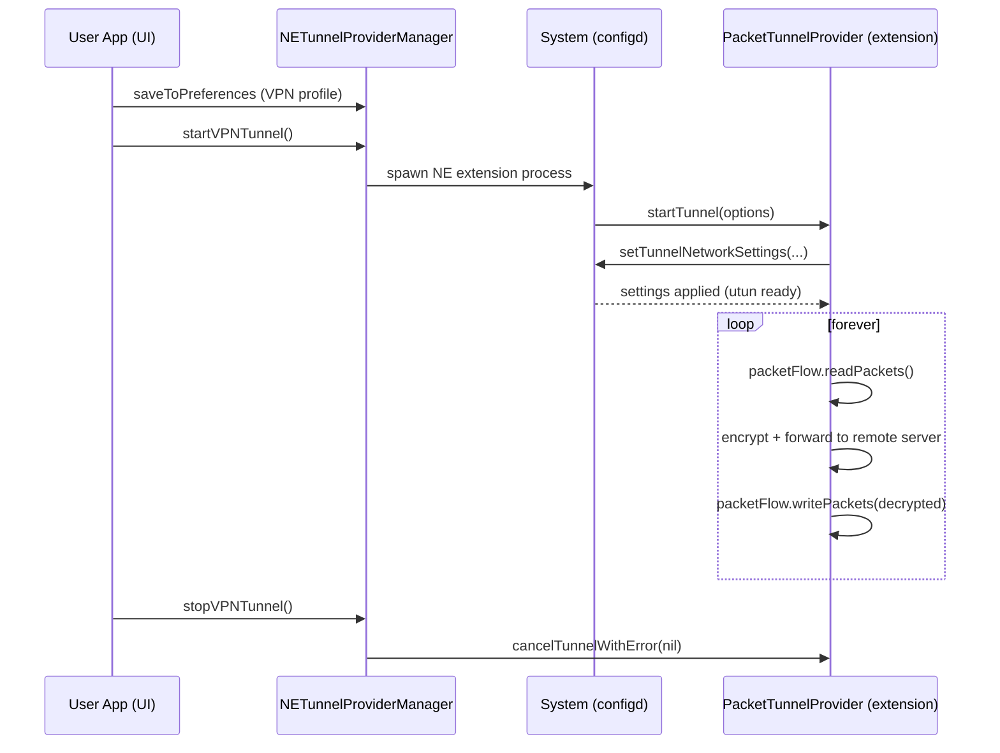
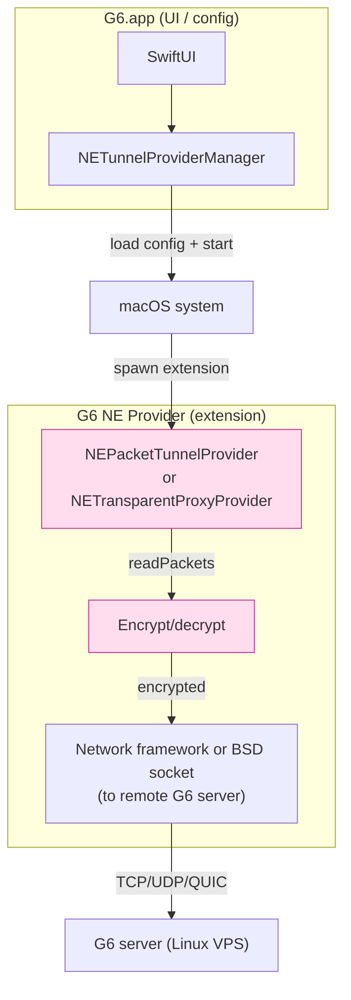

# 課堂 2.10 — macOS 上能做什麼

## 學前知道

- **前置課**：[2.1 epoll](./2.1-select-poll-epoll.md)（kqueue 對等物）、[2.5 eBPF 入門](./2.5-ebpf-intro.md)（為對比 macOS 沒有什麼）
- **預計閱讀時間**：50~60 分鐘
- **必讀文獻 / 規格**：
  - **Lemon — Kqueue: A Generic and Scalable Event Notification Facility** (USENIX ATC 2001) ⭐ — 已抓 `assets/papers/atc-2001-kqueue.pdf`。Lemon 是 FreeBSD kqueue 作者，macOS 直接繼承
  - **Apple — Network Extension Framework Reference**：https://developer.apple.com/documentation/networkextension
  - **Apple — System Extensions and DriverKit**：https://developer.apple.com/system-extensions/
  - **Apple — Network Privacy in macOS Sonoma+**：Private Cloud Compute 與 NEPathMonitor 文件
  - **WWDC 各年 Networking sessions**：搜「Network Framework」、「Network Extension」、「Endpoint Security」
  - **Apple Platform Security Guide** (annual PDF)：macOS 安全模型
- **必讀原始碼**（部分是 Apple 開源 XNU）：
  - XNU `bsd/kern/kern_event.c`：kqueue 主實作
  - XNU `bsd/net/`：BSD-style 網路 stack（macOS 是 XNU = Mach 微核心 + BSD 子系統）
  - XNU `bsd/net/pktap.h`：packet tap 介面（macOS 對 tcpdump）
  - 注意：XNU 開源但**部分網路安全 / Network Extension 內部不開源**

---

## 動機

> macOS 是 G6 client 的主要 dev / target 平台，必須清楚它的能力邊界

[Part 0 工具篇](../part-0-orientation/0.5-tooling.md) 已確認：開發在 macOS（Apple Silicon），部署在 Linux VPS。所以**G6 必然有兩條路徑**：

- **Server**：Linux，享受 io_uring / XDP / eBPF / kTLS 全套
- **Client**：macOS 為主，Linux 為輔；可能還要 Windows / iOS / Android

本堂專注 **macOS client 能做什麼**。具體要回答：

1. **kqueue 跟 epoll 的真實差異**（程式設計面 + 性能面）
2. **macOS 的 TUN/TAP 機制**（utun，不是 Linux 那種 `/dev/net/tun`）
3. **Network Extension framework**：Apple 後 2015 起逼所有 VPN 用 NE，舊式 `kext` 已死。**這直接決定 G6 client 怎麼接 macOS 系統**
4. **PacketTunnelProvider vs FilterControlProvider vs DNSProxyProvider**：三種 NE 模式
5. **為何 macOS 沒有 eBPF / XDP**：dtrace 是 macOS 的替代（半個）
6. **App Sandbox / Entitlements / Notarization**：發行給 Mac 用戶必經之關
7. **iOS / iPadOS 衍生**：基本同 NE framework，但更嚴格

對 G6 設計的 implication：

- **macOS client 大概率必須是 macOS native app + NE Provider**（不能像 Linux 那樣 systemd daemon）
- 必須有 Apple Developer ID（年費 $99）+ Notarization 流程
- 不能用 eBPF / cgroup-bpf / iptables redirect——只能用 NE Provider 抓 packet
- **kqueue 性能足夠**：macOS 不需要 io_uring 級別性能（client 流量小）

---

## 核心概念

### 1. kqueue 完整語意

[2.1 §10](./2.1-select-poll-epoll.md#10-macos--freebsd-kqueue-速查cross-platform-開發必備) 已給速查。本節展開。

#### 1.1 API

```c
int kq = kqueue();   // 建立 kqueue instance

// 一個 syscall 同時做「修改」與「等待」
int kevent(int kq,
           const struct kevent *changelist, int nchanges,
           struct kevent       *eventlist,  int nevents,
           const struct timespec *timeout);
```

`struct kevent`：

```c
struct kevent {
    uintptr_t ident;   // identifier (fd / pid / sig / ...)
    int16_t   filter;  // EVFILT_* (見下)
    uint16_t  flags;   // EV_ADD / EV_DELETE / EV_ENABLE / EV_DISABLE / 
                       // EV_ONESHOT / EV_CLEAR / EV_RECEIPT / EV_DISPATCH ...
    uint32_t  fflags;  // filter-specific flags
    intptr_t  data;    // filter-specific data
    void      *udata;  // 用戶自由欄位，原樣返回
};
```

#### 1.2 Filter 大全（macOS 14+）

| Filter | ident 意義 | 用途 |
|---|---|---|
| `EVFILT_READ` | fd | readable |
| `EVFILT_WRITE` | fd | writable |
| `EVFILT_AIO` | aiocb* | POSIX AIO 完成 |
| `EVFILT_VNODE` | fd | 檔案系統事件（修改、刪除、rename） |
| `EVFILT_PROC` | pid | process 事件（exit、fork、exec、signal） |
| `EVFILT_SIGNAL` | signum | signal delivery |
| `EVFILT_TIMER` | unique id | timer 到期 |
| `EVFILT_MACHPORT` | mach port | Mach port 訊息（XNU 內部，少用） |
| `EVFILT_FS` | 0 | filesystem 事件 |
| `EVFILT_USER` | unique id | user-triggered event（手動 wake） |
| `EVFILT_EXCEPT` | fd | out-of-band data |

**kqueue 比 epoll 強的地方**：所有 event sources（fd / signal / process / timer / vnode）統一 API。Linux 要疊 `signalfd / timerfd / inotify / pidfd_open + epoll` 才能達到。

#### 1.3 ET vs LT in kqueue

預設 LT（level-triggered）。加 `EV_CLEAR` flag = ET（edge-triggered）。

```c
EV_SET(&ev, fd, EVFILT_READ, EV_ADD | EV_CLEAR, 0, 0, my_ctx);
```

ET 語意跟 epoll ET 一樣：必須 drain 到 `EAGAIN`，否則漏事件。

#### 1.4 `EV_ONESHOT`、`EV_DISPATCH`、`EV_RECEIPT`

- `EV_ONESHOT`：事件觸發一次後自動 EV_DELETE
- `EV_DISPATCH`：觸發後自動 EV_DISABLE，但留在 kqueue 內，必須手動 re-enable
- `EV_RECEIPT`：用於 changelist，要求 kernel 在 changelist 處理時 immediately 返回該 change 的 ack（而非等到 wait 階段）

`EV_DISPATCH` 對多 thread worker 模型有用：一個 thread 拿事件後 atomically 變 disabled，避免另一 thread 同時拿。

#### 1.5 macOS kqueue 的 bug / 限制

⚠️ 已知 issue（截至 macOS 14）：

- `EVFILT_VNODE` 對某些 file system（網路硬碟、APFS snapshot）行為不一致
- `EVFILT_PROC` 跟 `posix_spawn` 互動有 race（早期事件可能漏）
- 某些 socket type（`AF_SYSTEM`）上的 kqueue 行為跟 doc 不一致
- 跟 Grand Central Dispatch (GCD) `dispatch_source` 互用要小心（內部 GCD 自己 wrap kqueue）

實務建議：**用 GCD `dispatch_source_t` 抽象**（macOS 高層 API），底層仍是 kqueue 但 Apple 包裝好邊角。

#### 1.6 kqueue 效能 vs Linux epoll

社群多次 benchmark：

| 場景 | macOS kqueue | Linux epoll |
|---|---|---|
| 10K fd, 1K active, ET | ~150K events/s | ~250K events/s |
| 1M fd 規模 | 內部受限（fd table、wait queue 設計） | 達標 |
| Single-CPU per ms latency | 略低 | 中 |
| Multi-CPU scaling | 一般 | 配 SO_REUSEPORT 線性 |

macOS kqueue 對「**client 級流量 (1Gbps、~1K connection)**」綽綽有餘。**G6 client 用 kqueue 不會撞瓶頸**。

### 2. macOS TUN：utun

#### 2.1 跟 Linux 的差異

| | Linux `/dev/net/tun` | macOS `utun` |
|---|---|---|
| 開啟方式 | `open("/dev/net/tun") + ioctl(TUNSETIFF)` | `socket(AF_SYSTEM, SOCK_DGRAM, SYSPROTO_CONTROL) + ioctl(CTLIOCGINFO) + connect()` |
| Interface 名 | 自選 (`tun0`) | 系統指派 (`utun0`、`utun1` …) |
| Header | optional `PI` (Packet Information) | 強制 4-byte AF prefix |
| TAP mode (Ethernet frame) | `IFF_TAP` 可用 | **不支援**（macOS 沒有對等物） |
| Multi-queue | `IFF_MULTI_QUEUE` 可用 | 不支援 |
| Permission | 需 root or CAP_NET_ADMIN | **需 Entitlement**（不能只靠 root） |

#### 2.2 macOS utun 開啟流程（POSIX-style）

```c
#include <sys/sys_domain.h>
#include <sys/kern_control.h>
#include <net/if_utun.h>

int s = socket(AF_SYSTEM, SOCK_DGRAM, SYSPROTO_CONTROL);

struct ctl_info ci = {0};
strncpy(ci.ctl_name, UTUN_CONTROL_NAME, sizeof(ci.ctl_name));
ioctl(s, CTLIOCGINFO, &ci);

struct sockaddr_ctl sc = {
    .sc_len = sizeof(sc), .sc_family = AF_SYSTEM, .ss_sysaddr = AF_SYS_CONTROL,
    .sc_id = ci.ctl_id, .sc_unit = 0   // 0 = let system pick
};
connect(s, (struct sockaddr *)&sc, sizeof(sc));
// 現在 s 是 utun fd，read/write 是 packet 進出
```

每個 packet 前 4 byte 是 AF prefix（`AF_INET` = 2 / `AF_INET6` = 30，network byte order）。L3 path only（沒有 L2 ethernet header）。

#### 2.3 從 NE Provider 拿 utun fd（更現代的方式）

從 macOS 10.11 起，普通 user-space 直接 open utun 受限——必須透過 **Network Extension** PacketTunnelProvider。NE 內部建好 utun fd 後由 `NEPacketTunnelFlow` 暴露給 application。

```swift
// Inside PacketTunnelProvider subclass
class TunnelProvider: NEPacketTunnelProvider {
    override func startTunnel(...) {
        let settings = NEPacketTunnelNetworkSettings(...)
        settings.ipv4Settings = ...
        setTunnelNetworkSettings(settings) {
            self.readPackets()
        }
    }
    func readPackets() {
        packetFlow.readPackets { packets, protocols in
            for (data, proto) in zip(packets, protocols) {
                // 處理 packet (這裡是 plain IP packet, NE 已 strip AF prefix)
            }
            self.readPackets()
        }
    }
}
```

[`NEPacketTunnelFlow` API](https://developer.apple.com/documentation/networkextension/nepackettunnelflow) 比 raw utun fd 高層、但效能略差（每 packet 過 IPC）。

### 3. Network Extension framework 全景

macOS 從 10.10 起逐步 deprecate kext（kernel extension），10.15+ 強制 NE/NEKit。VPN / firewall / DNS 都必須走 NE。

#### 3.1 NE 子類型

| Provider | 用途 | App scope |
|---|---|---|
| `NEPacketTunnelProvider` | full-tunnel VPN（packet 級代理） | per-app / system-wide |
| `NEAppProxyProvider` (TCP/UDP) | app-level proxy | per-app |
| `NETransparentProxyProvider` (macOS 11+) | transparent intercept | per-app / system-wide |
| `NEFilterControlProvider` / `NEFilterDataProvider` | content filter（如 parental control） | system-wide |
| `NEDNSProxyProvider` | DNS hijack | system-wide |
| `NEHotspotHelper` | Wi-Fi 自動登入 | system-wide |

⭐ **G6 適合 NEPacketTunnelProvider**（packet 級）或 NETransparentProxyProvider（連線級，可選只代理特定 app）。

#### 3.2 NEPacketTunnelProvider 完整 lifecycle



NE process 跟 UI app 是**分開的 process**，由系統管理。NE 死了系統會自動重啟（也可選 fail-closed）。

#### 3.3 跟 NEPacketTunnelFlow 的 packet I/O

```swift
// 讀
packetFlow.readPackets { packets, protocols in
    // packets: [Data] (each 是 IP packet)
    // protocols: [NSNumber] (AF_INET / AF_INET6)
    for (data, proto) in zip(packets, protocols) {
        encryptAndSend(data, family: proto.int32Value)
    }
    self.readPackets()  // recursive 連續讀
}

// 寫
packetFlow.writePackets(decryptedPackets, withProtocols: protocols)
```

特性：

- batched API（一次返回多個 packet）
- 從 system utun 抓 packet、丟到 packet flow 回 utun
- 無 zero-copy（Swift Data 是 copy）——這是 G6 client 性能限制之一

#### 3.4 NETransparentProxyProvider（macOS 11+，更靈活）

跟 PacketTunnelProvider 差別：

- 不接管整個系統流量，只攔截**滿足條件的 flow**
- 條件可以是 per-app / per-host / per-destination
- 工作在 **socket flow level**（不是 packet level）—— 比 packet 模式高層、debug 簡單
- 直接拿到 `NEAppProxyFlow`，是「socket-like」抽象

```swift
override func handleNewFlow(_ flow: NEAppProxyFlow) -> Bool {
    if let tcp = flow as? NEAppProxyTCPFlow {
        // 處理 TCP flow
        Task { await proxyTCP(tcp) }
        return true   // 接管
    }
    return false   // 讓系統默認處理
}
```

⭐ **G6 推薦走 NETransparentProxyProvider**（macOS 11+）：

- 不接管系統 DNS、不接管 P2P、不接管 background process
- 可選只代理特定 app（瀏覽器、Telegram）
- 對 user 體驗友善（其他 app 不被打擾）

但缺點：iOS 不支援 NETransparentProxyProvider，**iOS 必須走 NEPacketTunnelProvider**——意味著跨平台 share code 要兼顧。

### 4. Entitlements 與 Notarization

#### 4.1 Entitlements

Apple-issued capability descriptors，build 時嵌入 app + extension。NE Provider 必要 entitlement：

```xml
<key>com.apple.developer.networking.networkextension</key>
<array>
    <string>packet-tunnel-provider</string>
    <!-- or: app-proxy-provider, content-filter-provider, dns-proxy -->
</array>
```

申請流程：

1. Apple Developer Program 帳號（$99/year）
2. 在 Apple Developer Portal 申請 NE entitlement（要 review，通常數週）
3. iOS 需要更多：「Network Extensions Capability」要單獨 request

**G6 商用 deployment**：必須過這一關。沒有 Apple Developer ID 寫不出可發行的 NE provider。

#### 4.2 Notarization（macOS Sequoia 強制）

```bash
# 簽署
codesign --sign "Developer ID Application: ..." --options runtime \
         --entitlements G6.entitlements --deep YourApp.app

# 公證
xcrun notarytool submit YourApp.zip --keychain-profile "AC_PASS" --wait
xcrun stapler staple YourApp.app
```

未公證的 app 在 Sequoia+ 必須 user 手動「允許」（且越來越難）。**G6 必須 notarize**。

### 5. macOS 沒有 eBPF / XDP

#### 5.1 為什麼沒有

eBPF 是 Linux-specific：
- 緊密依賴 Linux verifier、Linux struct layout（BTF）、Linux kernel hook points
- macOS XNU 完全不同架構（Mach 微核心 + BSD subsystem）
- Apple 商業優先級不在這

Microsoft 在做 [eBPF for Windows](https://github.com/microsoft/ebpf-for-windows)，**Apple 沒有對應**。

#### 5.2 macOS 的替代

| Linux | macOS 對等 |
|---|---|
| eBPF tracing | DTrace、Endpoint Security framework |
| eBPF networking (TC/XDP) | Network Extension Filter Provider / NEAppProxyProvider |
| eBPF security (LSM) | Endpoint Security framework |
| seccomp filter | macOS sandbox profile + Hardened Runtime |
| iptables / nftables | pf (packet filter, 從 OpenBSD 移植過來) |

#### 5.3 DTrace：macOS 的「半個 eBPF」

DTrace 是 Solaris 起源、被 Apple 移植到 macOS。能力上跟 BPF tracing 有重疊但更老：

```bash
sudo dtrace -n 'syscall::recvfrom:entry /pid == $target/ { @[probefunc] = count(); }' -p $(pgrep G6Client)
```

特性：
- 動態 instrumentation（kprobe-like + uprobe-like）
- D 語言寫腳本（小子集）
- 完整 systemtap-like 能力但效能不如 eBPF
- Apple Silicon (M1+) 受 SIP / Hypervisor 限制，**某些 dtrace probe 必須關 SIP 才能用**

⚠️ macOS 14+ Sequoia 對 DTrace 進一步限制（系統完整性保護更嚴）。

#### 5.4 macOS pf：firewall

```bash
sudo pfctl -e   # enable
sudo pfctl -f /etc/pf.conf   # load rules
```

`pf` 跟 iptables 是兩套不同語法。對 G6 client 不直接 relevant（client 不做 firewall），但**理解 pf 才能 debug 流量**。

### 6. Apple 的 Network framework（Swift / Obj-C）

[Network framework](https://developer.apple.com/documentation/network)（macOS 10.14+）是 Apple 推的「現代 socket API」：

```swift
let conn = NWConnection(host: "example.com", port: 443, using: .tls)
conn.start(queue: .global())
conn.send(content: data, completion: .contentProcessed { _ in })
conn.receive(minimumIncompleteLength: 1, maximumLength: 8192) { data, _, _, _ in
    // ...
}
```

比 BSD socket 友善很多，內建：
- TLS 1.3
- 0-RTT
- TCP Fast Open
- Happy Eyeballs (v6/v4 race)
- 移動網路適應
- Network Path Monitor（網路切換通知）

⭐ G6 macOS client 應該基於 `Network` framework + NE Provider，**不要直接用 BSD socket**。

### 7. G6 macOS client 架構



部件清單：

- `G6.app`：Swift app，UI + config，從 keychain 拿 credentials
- `G6.NetworkExtension`：NE Provider extension（同 app bundle 但獨立 process）
- 共享 framework：crypto / protocol parsing / config schema
- IPC：app ↔ extension 透過 NETunnelProviderProtocol 配置或 XPC

### 8. iOS / iPadOS 差異

| 維度 | macOS | iOS |
|---|---|---|
| NE Provider | 支援多種 | 主要 PacketTunnelProvider |
| NETransparentProxyProvider | 是 | **否** |
| 安裝 NE | drag-drop OK | 必須 App Store |
| Background mode | 寬鬆 | 嚴格（NE 跑久了系統可能 suspend） |
| Entitlement review | 需 | **更嚴**（Apple 對 VPN app 審查嚴） |
| 跨 process IPC | XPC | shared keychain only |

對 G6：iOS app 要走 App Store 審查。歷史上 GFW 對抗類 VPN app 在 China App Store 全被下架，但在其他 region 仍可。

---

## 與我們協議設計的關聯

1. **macOS client 架構**：NE Provider + Swift app + Network framework
2. **跨平台 share code**：protocol parsing / crypto 用 Rust core lib（C ABI bindings），同份 code 在 macOS / iOS / Linux / Windows / Android 都跑
3. **不用 eBPF / cgroup-bpf**：macOS 沒有對等。客戶端透明代理走 NE
4. **效能目標降低**：macOS client 流量小（單用戶 100Mbps-1Gbps），不需要 io_uring 級性能
5. **Apple Developer Program 預算**：$99/year。商用 deployment 必備
6. **iOS 區分 deploy**：若 G6 推 iOS，必須準備 App Store 審查 strategy（可能僅限 region）
7. **macOS PacketTunnelProvider 效能**：每 packet 過 IPC，CPU bound 在 ~500Mbps-1Gbps；要更高用 NETransparentProxyProvider（socket flow level）

---

## 動手

### 實驗 A：手動建一個 utun interface（需 root）

⚠️ macOS Sonoma+ 對 raw utun 限制嚴格，可能需要 SIP 關閉。先用 Sequoia VM 試。

```c
// utun_open.c (compile + run with sudo)
int s = socket(AF_SYSTEM, SOCK_DGRAM, SYSPROTO_CONTROL);
struct ctl_info ci = {0};
strncpy(ci.ctl_name, UTUN_CONTROL_NAME, sizeof(ci.ctl_name));
ioctl(s, CTLIOCGINFO, &ci);
struct sockaddr_ctl sc = { /* fill */ };
connect(s, ...);
printf("utun fd = %d\n", s);
// 開另一 terminal: ifconfig 看 utunN 是否出現
```

### 實驗 B：寫一個 minimal NEPacketTunnelProvider

Xcode 新建 macOS app，加 NetworkExtension target，Subclass NEPacketTunnelProvider：

```swift
class MyTunnel: NEPacketTunnelProvider {
    override func startTunnel(options: [String : NSObject]?,
                               completionHandler: @escaping (Error?) -> Void) {
        let settings = NEPacketTunnelNetworkSettings(tunnelRemoteAddress: "192.0.2.1")
        settings.ipv4Settings = NEIPv4Settings(addresses: ["10.0.0.2"], subnetMasks: ["255.255.255.0"])
        settings.ipv4Settings?.includedRoutes = [.default()]
        setTunnelNetworkSettings(settings) { error in
            completionHandler(error)
            self.readPackets()
        }
    }
    func readPackets() {
        packetFlow.readPackets { packets, protocols in
            // echo: 直接寫回（loopback test）
            self.packetFlow.writePackets(packets, withProtocols: protocols)
            self.readPackets()
        }
    }
}
```

需要 NE entitlement——個人 developer ID 可申請。

### 實驗 C：用 dtrace 量 connect() 統計

```bash
sudo dtrace -n 'syscall::connect:entry { @[execname] = count(); }' -p $(pgrep Safari)
```

對比 Linux bpftrace 體驗。

### 實驗 D：kqueue minimal echo server (C)

```c
// minimal_kqueue_echo.c
int kq = kqueue();
int s = socket(AF_INET, SOCK_STREAM, 0);
// bind/listen 略
struct kevent ev;
EV_SET(&ev, s, EVFILT_READ, EV_ADD | EV_CLEAR, 0, 0, NULL);
kevent(kq, &ev, 1, NULL, 0, NULL);
while (1) {
    struct kevent eventlist[64];
    int n = kevent(kq, NULL, 0, eventlist, 64, NULL);
    for (int i = 0; i < n; i++) {
        // accept or recv/send
    }
}
```

對比 epoll 版本。

---

## 自我檢查

1. kqueue 跟 epoll 在 API 設計上的 3 個關鍵差異？哪個更乾淨？
2. macOS utun 跟 Linux tun 在 packet header 上的差異是什麼？對 G6 client 跨平台 code 影響？
3. 為什麼 macOS 強制 NE Provider 而非允許 user-space daemon 自行接管網路？（提示：sandbox + 安全 model）
4. NEPacketTunnelProvider 跟 NETransparentProxyProvider 各自適合什麼場景？G6 應該用哪個？
5. macOS 為什麼沒有 eBPF？Apple 的替代方案能達到 eBPF 多少能力？
6. Entitlement 跟 Notarization 各自是什麼角色？G6 商用 deployment 必過哪幾關？
7. iOS 對 NE 的限制比 macOS 嚴在哪？G6 iOS 版本可能面臨什麼 App Store 審查問題？
8. 寫一個 G6 macOS client 的最小架構圖，標清 app process / NE extension process / 跟 system 互動 / 跟 remote server 通訊

---

## 延伸閱讀

- **Apple Network Extension docs** — 已連結
- **Apple Developer 各年 WWDC Networking sessions**
- **objc.io issue 19: networking** — Network framework 深度文
- **PacketTunnelProvider sample**：Apple SimpleTunnel project (objc 版老但仍 valid)
- **WireGuardKit 開源 macOS / iOS app**：https://git.zx2c4.com/wireguard-apple/
- **OpenVPN macOS client (Tunnelblick) 原始碼**
- **Outline VPN open source**：Google 開源 Mac/iOS client，用 NE
- **macOS Internals book** (Levin, *NOT 2 EZ to write* / `*OS Internals` series) — XNU 內部最深資料

---

## 研究級補遺

### 1. 學界詞彙

| 中文/口語 | 學界正名 | 出處 |
|---|---|---|
| kqueue | event notification facility | Lemon ATC 2001 |
| Filter | event filter | kqueue spec |
| Network Extension | NE / NetworkKit framework | Apple |
| Packet Tunnel Provider | full-tunnel VPN provider | NE docs |
| Transparent Proxy Provider | flow-level transparent proxy | NE docs (10.15+) |
| Sandbox profile | sandbox manifest / scprofile | Apple Sandbox Guide |
| Entitlement | code-signed capability | Apple security |
| Notarization | post-build malware screening | Apple Developer |
| DTrace | dynamic tracing | Sun Microsystems 2003 |

### 2. 對手分類學：macOS 平台特有威脅

對 G6 macOS client：

| 威脅 | macOS 防護 |
|---|---|
| User 安裝惡意 NE 取代 G6 | NE 簽名驗證 + user prompt |
| Malicious app 偷 NE 跑流量 | Entitlement 嚴格控管 |
| Side-channel from peer apps | App Sandbox + Hardened Runtime |
| iOS App Store censorship | regional release |
| Cloud Provider Pressure | App Store 政治可被施壓 |

⭐ macOS 安全模型很強，但 **Apple App Store 是政治點**：歷史上 Apple 應中國要求下架某些 VPN app。G6 部署策略要考慮：可能無法在 China region 上 App Store（**但 macOS 可繞 App Store 直接 sideload**，iOS 不行）。

### 3. 形式化定義：macOS NE Provider 的執行語意

每個 NE Provider 是**獨立 process**，由 `nesessionmanager` 啟動，跟 host app 透過 XPC + shared keychain 通訊。

執行 model：

- NE process 有 **特定 entitlement**（host app 沒有）
- 系統 monitor NE 健康度，crash 自動 restart
- NE 不能直接呼叫某些 sandboxed API
- NE 跟 host app 共用 keychain access group，但**不共用 file system view**

這個 **strict process isolation** 是 macOS 安全模型的根本。G6 設計時不能假設兩 process 共享 state。

### 4. 領域的關鍵論文 / 規格

- **Lemon ATC 2001 kqueue** ⭐ — 已抓
- **WWDC sessions** （Apple 自己的 talks）
- **Apple Platform Security Guide** 每年更新
- **`*OS Internals` book series** (Levin) — XNU 深度
- **macOS Sandbox Guide** — 內部規格

### 5. 我們協議的座標 / 設計取捨

| 設計問題 | 本堂收窄了什麼 | 仍 open |
|---|---|---|
| Client 平台 | macOS native NE Provider | iOS 是否上 App Store |
| Provider 類型 | NETransparentProxy (macOS) + PacketTunnel (iOS) | per-app vs system-wide default |
| Packet I/O 介面 | NEPacketTunnelFlow (packet) / NEAppProxyFlow (socket) | 取決 provider 類型 |
| 跨平台核心 | Rust core via C ABI | 用哪個 crypto crate |
| 部署管道 | Notarized + Developer ID + optional App Store | 國別策略 |

### 6. 必追資源 / 社群入口

- **Apple Developer Forums — Networking**
- **WireGuardKit GitHub** — Apple Silicon VPN 工程實踐
- **Cilium Tetragon equivalent on macOS = Endpoint Security 文件**
- **mac-network mailing list**（社群）

### 7. 開放問題（research-level）

1. **NE Provider 的效能上限**：packet 每次過 IPC，CPU bound 在 ~1Gbps。能否設計 zero-copy NE API？Apple 不公開但是 future request
2. **iOS App Store 對抗 deploy 路線**：sideload / TestFlight / enterprise certificate 各自的 trade-off
3. **macOS Network framework 對 G6 QUIC 整合**：Apple Network framework 已 ship QUIC，能否拿來省下自己 QUIC implementation？trade-off 是 framework 隱藏細節
4. **跨平台 client 統一抽象**：Rust core lib + 各平台 thin shell。最佳實踐怎麼設計（檔案佈局、build system、CI）
5. **macOS 上能否做 sniffing 自我量測**：傳統 tcpdump 仍可用但要 entitlement，是否有 NE-friendly 量測方法

---

## 對下一堂的鋪墊

到 2.10，我們已分別講了 Linux + macOS 的高效能 I/O 能力。但 G6 客戶端要把流量「**從 system 偷出來送進我們協議**」，這需要 **TUN/TAP** 機制——既深又跨平台。下一堂 [2.11 TUN/TAP 完整深度](./2.11-tun-tap.md) 把 Linux `tun.c` 跟 macOS utun 一次講透，含 `ioctl` 介面、multi-queue、`IFF_NO_PI` 細節，以及為什麼 wireguard-go 用 macOS utun 時對性能造成具體影響。
