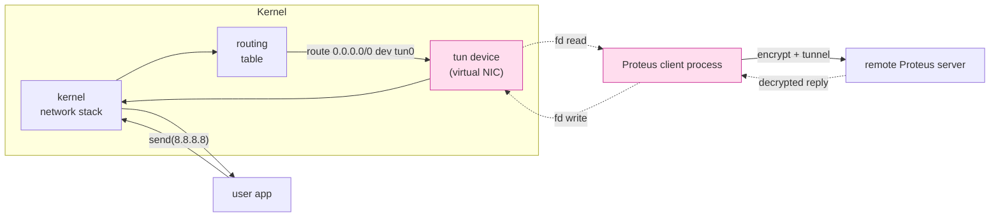
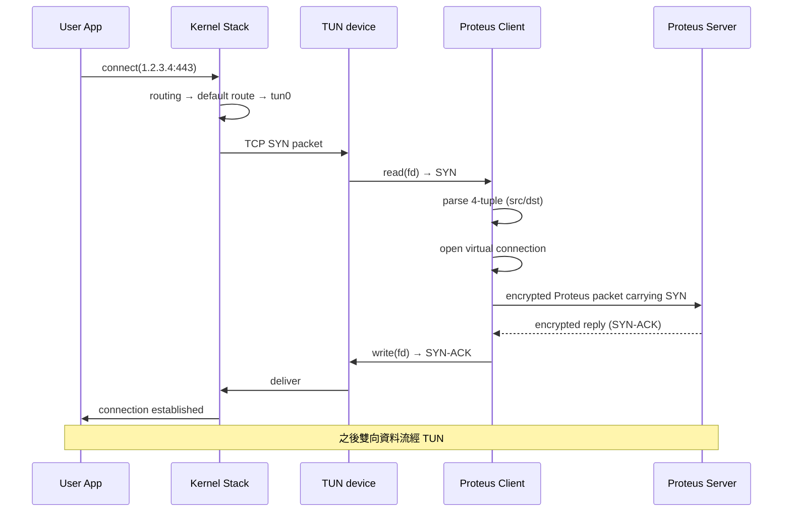

# 課堂 2.11 — TUN/TAP 完整深度

## 學前知道

- **前置課**：
  - [1.3 乙太網路與 L2](../part-1-networking/1.3-ethernet-l2.md)（理解 TAP 為何是 L2、TUN 為何是 L3）
  - [1.4 IP routing](../part-1-networking/1.4-ip-routing-graph.md)（理解 routing table 怎麼把 packet 導進 TUN）
  - [2.10 macOS](./2.10-macos.md)（utun 跟 Linux tun 的差異）
- **預計閱讀時間**：60~80 分鐘
- **必讀文獻 / 規格**：
  - **Linux Documentation/networking/tuntap.rst** — 官方規格
  - **Krasnyansky — Universal TUN/TAP device driver** (Linux net subsystem source, 1999) — 原始作者 commit message + RFC-like
  - **Apple — `if_utun.h` header doc + `bsd/net/if_utun.c`** 注釋（XNU 開源部分）
  - **wireguard-go vs wireguard-rust vs kernel WireGuard 對比 paper / blogs**
- **必讀原始碼**：
  - Linux `drivers/net/tun.c` ⭐⭐：~3500 行，完整的 TUN/TAP driver 實作
  - Linux `include/uapi/linux/if_tun.h`：ioctl + flags 定義
  - macOS XNU `bsd/net/if_utun.c`：對等
  - wireguard-go `tun/` 目錄：跨平台 TUN abstraction，最好的工程 reference
  - sing-tun (Go): https://github.com/sagernet/sing-tun — sing-box 的 TUN abstraction
  - Rust `tun` crate：https://github.com/meh/rust-tun

---

## 動機

> TUN 是「**把流量從 kernel network stack 偷出來給我們協議**」的核心機制

對 Proteus client：

```
[user app] → connect()/send() → kernel stack → routing → ★ TUN device ★ → ★ Proteus client process read() ★
                                                                              ↓ encrypt
                                                                              ↓
[user app] ← recv() ← stack ← ★ TUN write() ★ ← ★ Proteus ★ ← decrypt ← network ← Proteus server
```

TUN（Network TUNnel）是 **virtual network device**：

- L3 mode (`IFF_TUN`)：interface 收 IP packet，沒 L2 header
- L2 mode (`IFF_TAP`)：interface 收 Ethernet frame，含 L2 header

操作 model：

- user-space `open("/dev/net/tun")` + `ioctl(TUNSETIFF)` 拿一個 fd
- `read(fd)` = 從 kernel stack 拿要出去的 packet
- `write(fd)` = 把 packet 餵回 kernel stack（從 application 角度看像 incoming）

TUN 的「**雙向 packet 介面**」是所有 VPN / tunnel client 的核心建構塊：

- OpenVPN、WireGuard、Tailscale、Cloudflare WARP、sing-box TUN mode
- Clash Verge Rev 的 TUN mode（[Part 0 user 體驗的關鍵 feature](../part-0-orientation/)）
- 我們 Proteus client 的 transparent-proxy 模式

本堂三個重點：

1. **TUN ioctl 介面 + IFF flag 完全**（為何 IFF_NO_PI / IFF_MULTI_QUEUE 直接影響性能）
2. **Linux `drivers/net/tun.c` 結構與性能特性**（為什麼 wireguard-go 比 kernel WireGuard 慢 3-5×）
3. **macOS utun vs Linux tun 真實差異**（跨平台 TUN client 怎麼設計）

---

## 核心概念

### 1. TUN / TAP 概念與語意



「TUN device 在 kernel 是個 NIC，在 user-space 是個 fd」——這個雙重身份是它能當「stack-to-userspace tunnel」的核心。

### 2. Linux `drivers/net/tun.c` 結構

#### 2.1 開啟流程

```c
int fd = open("/dev/net/tun", O_RDWR);

struct ifreq ifr = {0};
ifr.ifr_flags = IFF_TUN | IFF_NO_PI;
strncpy(ifr.ifr_name, "tun0", IFNAMSIZ);
ioctl(fd, TUNSETIFF, &ifr);
// 現在 fd 對應 tun0 interface

// 配 routing
system("ip addr add 10.10.0.1/24 dev tun0");
system("ip link set tun0 up");
system("ip route add default via 10.10.0.1 dev tun0");
```

#### 2.2 IFF flag 列表

| Flag | 意義 |
|---|---|
| `IFF_TUN` | L3 mode：read/write 是 IP packet |
| `IFF_TAP` | L2 mode：read/write 是 Ethernet frame |
| `IFF_NO_PI` | **不要加 4-byte packet info prefix**（packet 直接是 IP / Eth） |
| `IFF_MULTI_QUEUE` | 多 queue 模式（per-CPU fd） |
| `IFF_PERSIST` | persistent device（process 退也不消失） |
| `IFF_NAPI` | 啟用 NAPI 收包模式（提升 throughput） |
| `IFF_NAPI_FRAGS` | NAPI + scatter-gather |
| `IFF_VNET_HDR` | 在 packet 前加 virtio_net_hdr（offload metadata） |

#### 2.3 為何 `IFF_NO_PI` 直接影響性能

預設情況下，每個 read 拿到的 packet 前有 4 byte「packet info」：

```
struct tun_pi {
    __u16 flags;     // network byte order
    __be16 proto;    // L3 protocol (ETH_P_IP / ETH_P_IPV6)
};
```

這 4 byte 對 IP-only 應用無用（你已經知道 protocol 從 IP header version field）。**每個 packet 多 4 byte memcpy + branch**——對 1M pps 是測得到的開銷。

**Proteus client 必開 `IFF_NO_PI`**。

#### 2.4 `IFF_MULTI_QUEUE` 多 queue

預設 1 個 tun fd 對應 1 個 RX/TX queue，**單 thread 處理**。流量大時 single-core bottleneck。

```c
int fd = open("/dev/net/tun", O_RDWR);
struct ifreq ifr = { .ifr_flags = IFF_TUN | IFF_NO_PI | IFF_MULTI_QUEUE };
ioctl(fd, TUNSETIFF, &ifr);
// 開多次 open + ioctl，得到多個 fd，全部對應同一 tun0
```

每個 fd 由獨立 worker thread 處理。packet 進 tun 用 hash(5-tuple) 分配到 queue。**對 Proteus server 也適用**（但 server 用更高層的 io_uring 多 worker，不必依賴 tun multi-queue）。

#### 2.5 NAPI mode (`IFF_NAPI`)

預設 tun 用 per-packet wake：每個 write 進來，wake 一個 reader thread。NAPI mode 改成 batch + polling：

```c
ifr.ifr_flags |= IFF_NAPI;
ioctl(fd, TUNSETIFF, &ifr);
```

效益：

- batch 處理（多 packet 一次喚醒）
- prefetch 友善
- 對 high-throughput (~10 Gbps tun) 提升 30-50%

但只在 Linux 5.5+ 可用。

#### 2.6 `IFF_VNET_HDR`：offload hint

跟 KVM virtio_net 對齊，packet 前加 hint header：

```c
struct virtio_net_hdr {
    __u8 flags;           // VIRTIO_NET_HDR_F_NEEDS_CSUM 等
    __u8 gso_type;        // GSO type
    __u16 hdr_len;
    __u16 gso_size;
    __u16 csum_start;
    __u16 csum_offset;
};
```

允許 user-space 告訴 kernel「**這個 packet 是 TSO segment**」或「**這個 packet 的 csum 未計算**」。kernel 處理時可 split / 計算 csum。

對 Proteus 用：write 大 segment 一次（64KB），讓 kernel 自己 segment 成 MTU-size packet。**throughput 顯著提升**（少 syscall + 多 batch）。

### 3. `drivers/net/tun.c` 內部資料結構

打開 `drivers/net/tun.c`（Linux 6.x，~3500 行），重點 struct：

```c
struct tun_struct {
    struct tun_file __rcu *tfiles[MAX_TAP_QUEUES];  // ← multi-queue 的 file 陣列
    unsigned int numqueues;
    unsigned int flags;
    kuid_t owner;
    kgid_t group;

    struct net_device *dev;
    netdev_features_t set_features;
    int align;
    int vnet_hdr_sz;
    int sndbuf;
    struct tap_filter txflt;
    struct sock_fprog fprog;

    // ...
    void *security;
    u32 flow_count;
    u32 rx_batched;
    atomic_long_t rx_frame_errors;
    struct bpf_prog __rcu *xdp_prog;       // ★ tun 支援 XDP！
    struct tun_prog __rcu *steering_prog;
    struct tun_prog __rcu *filter_prog;
    struct ethtool_link_ksettings link_ksettings;
};

struct tun_file {
    struct sock sk;        // 把 file 包成 socket，讓 stack 看它是 sock
    struct socket socket;
    struct tun_struct __rcu *tun;
    struct fasync_struct *fasync;
    unsigned int flags;
    union {
        u16 queue_index;
        unsigned int ifindex;
    };
    struct napi_struct napi;
    bool napi_enabled;
    bool napi_frags_enabled;
    struct mutex napi_mutex;
    struct list_head next;
    struct tun_struct *detached;
    struct ptr_ring tx_ring;       // ★ 跟 stack 之間的 ring buffer
    struct xdp_rxq_info xdp_rxq;
};
```

#### 重點觀察

1. **每個 fd (tun_file) 包成 socket**：讓 tun 在 stack 內看起來像個 socket，這樣 stack 可以送 packet 給它（透過 sock send queue）
2. **`ptr_ring tx_ring`**：stack → tun fd 的 ring buffer。stack 把 packet 放這裡，user-space `read(fd)` 從這裡拿
3. **`napi_struct`**：用於 NAPI mode 的 batch 處理
4. **`xdp_prog`**：⭐ TUN device 支援 XDP！可以對「進 tun 的 packet」做 XDP filter——對 Proteus 來說，能在 tun 入口直接 drop 不感興趣的 packet

#### 主要 function

| 函數 | 行號 (6.6) | 作用 |
|---|---|---|
| `tun_chr_open` | ~3270 | `open("/dev/net/tun")` 進入點 |
| `tun_chr_ioctl` | ~3100 | 所有 ioctl 處理（TUNSETIFF 等） |
| `tun_attach` | ~700 | 把 tun_file 接上 tun_struct |
| `tun_net_xmit` | ~1100 | 從 stack 來的 packet 放 tx_ring |
| `tun_do_read` | ~2200 | user `read(fd)` 從 tx_ring 拿 packet |
| `tun_get_user` | ~1700 | user `write(fd)` 把 packet 進 stack |

### 4. 性能特性與 wireguard-go vs kernel WireGuard 分析

#### 4.1 wireguard-go 的性能

wireguard-go 是 Go 寫的 user-space WireGuard，跨平台。但比 kernel WireGuard 慢 3-5×。原因：

1. **TUN ↔ user-space 過 2 次 copy + 2 次 syscall**：
   - `read(tun_fd)` → memcpy → user buffer
   - `write(socket)` → memcpy → kernel
2. **Go runtime 切換**：goroutine ↔ OS thread 跨界
3. **Go GC**：每 packet 分配 buffer，GC 壓力
4. **TUN tx_ring 有鎖**：multi-queue 仍要 lock

對比 kernel WireGuard：

- packet 在 kernel 直接從 tun stack → encrypt (kernel module) → udp socket → out，**全 kernel zero-copy**
- 沒 user-space 介入

**Proteus client 也會踩同樣問題**：若用 TUN mode，必然有 user-space 介入。每 packet ~200ns 的 syscall + copy overhead。

#### 4.2 緩解策略

| 策略 | 效益 | 複雜度 |
|---|---|---|
| `IFF_NO_PI` | 5-10% | 低 |
| `IFF_MULTI_QUEUE` | 線性 scaling | 中 |
| `IFF_NAPI` | 30-50%（high pps） | 中 |
| `IFF_VNET_HDR` + GSO | 50-100%（large transfer） | 中 |
| io_uring + register_files | 20% | 中 |
| `splice()` from tun fd to socket fd | 50% (plaintext only) | 高 |
| **完全 in-kernel (BPF / kmod)** | 最大 | 極高 |

對 Proteus：開全 4 個 flag + io_uring 是 sweet spot。

#### 4.3 splice 從 tun 到 socket（不適用 Proteus 但要知道）

```c
// 假設 plaintext pass-through
splice(tun_fd, NULL, pipe_in, NULL, 65536, SPLICE_F_MOVE);
splice(pipe_out, NULL, sock_fd, NULL, 65536, SPLICE_F_MOVE);
```

tun fd 支援 `splice_read`。對 plaintext 路徑可以**完全不過 user-space**。但 Proteus 要加密，splice 不適用。

### 5. macOS utun 完全展開

#### 5.1 開啟流程（再講一次）

```c
int s = socket(AF_SYSTEM, SOCK_DGRAM, SYSPROTO_CONTROL);
struct ctl_info ci = {0};
strncpy(ci.ctl_name, UTUN_CONTROL_NAME, sizeof(ci.ctl_name));  // "com.apple.net.utun_control"
ioctl(s, CTLIOCGINFO, &ci);

struct sockaddr_ctl sc = {
    .sc_len = sizeof(sc),
    .sc_family = AF_SYSTEM,
    .ss_sysaddr = AF_SYS_CONTROL,
    .sc_id = ci.ctl_id,
    .sc_unit = 0,
};
connect(s, (struct sockaddr *)&sc, sizeof(sc));
// s 現在是 utun fd

// 拿 interface 名
char ifname[IFNAMSIZ];
socklen_t len = sizeof(ifname);
getsockopt(s, SYSPROTO_CONTROL, UTUN_OPT_IFNAME, ifname, &len);
// e.g. "utun0"
```

#### 5.2 macOS-specific 限制

1. **必 4-byte AF prefix**：每個 packet 前 4 byte 是 `htonl(AF_INET)` 或 `htonl(AF_INET6)`。**不能關**（沒有 IFF_NO_PI 對等物）
2. **無 multi-queue**：只能 1 個 fd 對應 1 個 utun
3. **無 NAPI**：每 packet wake，high pps 受限
4. **無 VNET_HDR / GSO**：每個 write 必須是 MTU-size packet
5. **無 XDP**：macOS 沒 eBPF
6. **權限**：需要 Network Extension entitlement（root 也不夠）

#### 5.3 從 NEPacketTunnelProvider 拿到的 packet flow

`NEPacketTunnelFlow` 自動處理 AF prefix（傳給你的 `data` 已經是純 IP packet，`protocol` 參數告訴你 AF_INET / AF_INET6）。

```swift
packetFlow.readPackets { (packets: [Data], protocols: [NSNumber]) in
    // packets[i] 是純 IP packet
    // protocols[i].int32Value == AF_INET (2) or AF_INET6 (30)
}
```

但**每 packet 過 IPC（NE process ↔ system）**。實測 macOS NE packet I/O CPU bound ~500Mbps-1Gbps 單 thread。

### 6. Windows 的對等：wintun / WireGuard NT

Windows 沒有 `/dev/net/tun`。歷史方案：

| 方案 | 機制 | 評價 |
|---|---|---|
| **OpenVPN-TAP** | TAP-Windows driver | 老舊，性能差 |
| **WireGuard NT** | Microsoft + WireGuard 合作的 kernel driver | 2021 起，最快 |
| **wintun** | wireguard-go 配套 user-space TUN | 跨 Windows 版本，中等性能 |
| **Windows Filtering Platform (WFP)** | 系統內 callout driver | 商業 VPN 多用 |

**Proteus 若做 Windows 版**：wintun 是 sane default。安裝 driver 即可。

### 7. 跨平台 TUN abstraction：sing-tun / wireguard-go 設計

#### 7.1 wireguard-go `tun/` 結構

| `tun/` 內檔案 | 角色 |
|---|---|
| `tun.go` | Device interface |
| `tun_linux.go` | Linux 實作（直接 ioctl） |
| `tun_darwin.go` | macOS 實作（utun socket） |
| `tun_windows.go` | Windows wintun |
| `tun_freebsd.go` | FreeBSD |
| `tun_openbsd.go` | OpenBSD |
| `netstack/` | 完全 in-process userspace stack (gVisor netstack) |

`Device` interface：

```go
type Device interface {
    File() *os.File   // (Linux) 或 nil (Windows)
    Read([]byte, int) (int, error)
    Write([]byte, int) (int, error)
    Flush() error
    MTU() (int, error)
    Name() (string, error)
    Events() chan Event
    Close() error
    BatchSize() int
}
```

**Proteus client TUN abstraction 應該抄這個 interface 設計**。

#### 7.2 sing-tun

sing-box 的 TUN module，比 wireguard-go 更新（支援 GSO、NIC offload metadata），也跨平台。Go 寫，但有 Rust port 在做。

#### 7.3 Rust 的 `tun` crate

```rust
use tun;
let mut config = tun::Configuration::default();
config.address((10, 0, 0, 1)).netmask((255, 255, 255, 0)).up();
let mut dev = tun::create(&config).unwrap();
let mut buf = [0u8; 1500];
let n = dev.read(&mut buf).unwrap();
```

跨 Linux / macOS / Windows / iOS。性能不如手寫，但對 prototype OK。

### 8. TUN 用於 transparent proxy 完整流程

Proteus client TUN mode 工作流：



關鍵：**Proteus client 必須在 user-space 跑一個簡化的 TCP/UDP stack**——因為它從 TUN 拿到的是 raw IP packet。可用：

- **gVisor netstack**（Go）：完整 user-space TCP/IP stack，sing-tun 也用
- **smoltcp**（Rust）：no_std 輕量
- **lwIP**（C）：嵌入式經典
- **自寫**：簡化版（不支援 TCP option / segmentation）

**Proteus v1 推薦用既有 stack**（gVisor 或 smoltcp），不自寫——TCP corner case 多到爆。

### 9. 跟 SO_ORIGINAL_DST 對比

另一條客戶端 transparent proxy 路線：**iptables REDIRECT + SO_ORIGINAL_DST**：

```
[user app] → kernel stack → iptables OUTPUT REDIRECT → 127.0.0.1:8080 (Proteus client listening) → user-space proxy
```

- **不用 TUN**
- 走 socket 而非 packet
- 性能比 TUN 好（少一層 user-space stack）
- 但**只能代理 TCP/UDP，無法代理 ICMP/raw IP**

對比：

| 維度 | TUN-based | iptables REDIRECT |
|---|---|---|
| Layer | L3 (packet) | L4 (socket) |
| 流量範圍 | 所有 IP (含 ICMP、自訂 protocol) | TCP/UDP |
| User-space stack | 需要 | 不需要 |
| 性能 | 較差 | 較好 |
| Linux 限制 | 任何 | iptables/nftables 配置 |
| macOS / Windows | utun / wintun | NEAppProxyProvider / WFP |
| Clash 用 | TUN mode | redir mode |

**Proteus 提供兩種模式**：

- **TUN mode**：full coverage，包含 ICMP / non-TCP/UDP
- **proxy mode**：only TCP/UDP，輕量

### 10. TUN 用於 server-side（少見但可能）

server 端通常 listen socket 直接收 client packet，不用 TUN。但若 Proteus server 想 **「把 client 流量 NAT 出去」**（client → Proteus server → internet），可能配置：

```
client packet → Proteus server socket recv → Proteus server decrypt → ★ write to server-side TUN ★ → kernel stack → routing → out NIC
```

server-side TUN 配合 `iptables -t nat -A POSTROUTING -o eth0 -j MASQUERADE`，把 Proteus 來的流量 SNAT。**這是大多數 VPN server 的標準模式**。

Proteus 設計：v1 簡化，**只做 proxy（4-tuple level）而非 VPN（packet level）**，server 不裝 TUN。如未來做 site-to-site VPN，server 端才裝。

---

## 與我們協議設計的關聯

1. **client 必有 TUN mode**：transparent proxy 是 Proteus client 的核心 UX
2. **TUN abstraction**：抄 wireguard-go `tun/` 介面設計，Rust 實作
3. **user-space TCP/IP stack**：用 `smoltcp` 或 wrap `gvisor/netstack`，不自寫
4. **macOS 走 NE Provider**：[2.10 詳述](./2.10-macos.md)，packet flow 跟 Linux TUN 抽象一致
5. **client 同時提供「TUN」與「socks5/http proxy」雙模式**：UX 友善
6. **效能不是 client 端瓶頸**：500Mbps-1Gbps 級別客戶端流量，TUN overhead 可接受
7. **不在 v1 做 server-side TUN**：v1 走 socket-level proxy，未來 VPN-mode 再加
8. **IFF_NO_PI / IFF_MULTI_QUEUE / IFF_NAPI / IFF_VNET_HDR 全開**：Linux 上必開

---

## 動手

### 實驗 A：手動建 TUN + ping

```bash
sudo ip tuntap add mode tun dev tun0 user $USER
sudo ip addr add 10.10.0.1/24 dev tun0
sudo ip link set tun0 up

# 在 user-space 跑一個 echo 程式：read tun0 fd, write back 同 packet
# 然後 ping 10.10.0.5（任何同 subnet 但不存在的 IP）
# 觀察 echo 程式拿到 ICMP packet
```

```c
// minimal_tun_echo.c
int fd = open("/dev/net/tun", O_RDWR);
struct ifreq ifr = { .ifr_flags = IFF_TUN | IFF_NO_PI };
strncpy(ifr.ifr_name, "tun0", IFNAMSIZ);
ioctl(fd, TUNSETIFF, &ifr);

char buf[2048];
while (1) {
    int n = read(fd, buf, sizeof(buf));
    if (n <= 0) break;
    // swap src/dst IP
    struct iphdr *ip = (struct iphdr *)buf;
    uint32_t tmp = ip->saddr;
    ip->saddr = ip->daddr;
    ip->daddr = tmp;
    // ICMP echo reply: swap type
    if (ip->protocol == IPPROTO_ICMP) {
        struct icmphdr *icmp = (void *)(ip + 1);
        icmp->type = ICMP_ECHOREPLY;
        // 重算 checksum 略
    }
    write(fd, buf, n);
}
```

### 實驗 B：對比 IFF_NO_PI / 無

寫兩版同 echo，一版 with IFF_NO_PI，一版 without。`hexdump -C` 看 read 出來的 packet——一版前 4 byte 是 PI、一版是純 IP header。

### 實驗 C：macOS 上做同實驗

需要關 SIP 或用 root。或寫個簡單 NEPacketTunnelProvider 試 packet flow API。

### 實驗 D：閱讀 wireguard-go `tun/tun_linux.go`

Go 寫，~600 行。看：

- 怎麼 ioctl
- 怎麼用 `splice` (有 hooks)
- 怎麼 batch read/write
- 怎麼處理 GSO

對 Proteus 設計 reference 直接可用。

---

## 自我檢查

1. TUN 跟 TAP 的差別具體是什麼？Proteus 應該用哪個？理由
2. `IFF_NO_PI` 解了什麼問題？不開的話 packet 前 4 byte 是什麼結構？
3. `drivers/net/tun.c` 內 `tun_file` 為什麼包成 `struct sock`？這個設計讓 tun 能享受什麼 stack feature？
4. wireguard-go 比 kernel WireGuard 慢 3-5× 的具體原因列 5 個
5. macOS utun 比 Linux tun 缺哪些 feature？對 Proteus client 跨平台一致性有什麼影響？
6. TUN-based transparent proxy 跟 iptables REDIRECT 各自優缺點？Proteus 應該都支援嗎？
7. user-space TCP/IP stack（gVisor netstack / smoltcp）在 Proteus client TUN mode 是必要的嗎？為什麼？
8. 為什麼 Proteus v1 server 不裝 TUN？什麼情況下會考慮加？

---

## 延伸閱讀

- **Linux Documentation/networking/tuntap.rst** — 已連結
- **`drivers/net/tun.c` 全篇** — 必跑一遍
- **wireguard-go `tun/`** — 跨平台最佳 reference
- **sing-tun source** — 中文社群最積極維護
- **gVisor netstack docs**：https://gvisor.dev/docs/architecture_guide/networking/
- **smoltcp book**
- **WireGuard NT design doc**：https://www.wireguard.com/repositories/

---

## 研究級補遺

### 1. 學界詞彙

| 中文/口語 | 學界正名 | 出處 |
|---|---|---|
| TUN device | virtual network interface (L3) | Linux 文獻 |
| TAP device | virtual network interface (L2) | 同 |
| Packet info prefix | tun_pi header | tun.c |
| Multi-queue tun | per-CPU virtual NIC queue | tun.c |
| GSO / TSO | generic / TCP segmentation offload | Linux net subsystem |
| User-space TCP stack | user-level transport (over tun) | mTCP / gVisor 等 |
| Transparent proxy | inline-redirected proxy | Squid / shadowsocks 文獻 |

### 2. 對手分類學：TUN 的攻擊面

TUN 是 system-level capability，被誤用會繞過防火牆。對 Proteus client：

- 必須 root / Network Extension entitlement 才能 open TUN
- TUN 跑起來後，**所有流量都暴露給 Proteus process**——隱私敏感
- 對企業環境：IT 可能不允許用戶建 TUN
- macOS sandbox 嚴格控管 TUN（NE entitlement only）

設計 implication：Proteus client 部署文件須清楚說明「**我們有 root / NE 權限**」，並 sign / notarize 讓 user 信任。

### 3. 形式化定義：TUN 路徑延遲

定義 TUN-mode packet 在 Proteus client 內的延遲：

$$
L_{\text{tun}} = L_{\text{stack→tun}} + L_{\text{tun→user}} + L_{\text{user-stack}} + L_{\text{encrypt}} + L_{\text{user→socket}} + L_{\text{socket→NIC}}
$$

每段：

- `stack→tun`: ~1μs（in-kernel queue insert）
- `tun→user`: read syscall + copy_to_user，~2-5μs
- `user-stack`: gVisor 處理 ~5-10μs
- `encrypt`: AEAD ChaCha20-Poly1305 ~1μs/KB
- `user→socket`: send syscall + copy_from_user，~2-5μs
- `socket→NIC`: ~1μs

per-packet 總 ~15-25μs。對 1Gbps 客戶端 OK，對 10Gbps 不夠。

⇒ **Proteus client TUN mode 性能上限 ~1Gbps**。多數消費場景夠。

### 4. 領域的關鍵論文 / 規格

- **Krasnyansky — Universal TUN/TAP driver** (kernel doc + commit history)
- **WireGuard whitepaper** (Donenfeld 2017 NDSS) — 雖然主題 WireGuard 但對 TUN performance 有量化
- **gVisor: A High-performance Container Runtime** (Lacy & others) — netstack 設計
- **Linux Documentation/networking/tuntap.rst**

### 5. 我們協議的座標 / 設計取捨

| 設計問題 | 本堂收窄了什麼 | 仍 open |
|---|---|---|
| Client 接管模式 | TUN + socks5/http 雙模式 | UX：默認哪個 |
| TUN abstraction | 抄 wireguard-go `Device` interface | Rust crate 選擇 |
| User-space stack | smoltcp 或 wrap gvisor | TCP corner case 處理範圍 |
| Performance target | 1Gbps client 級 | macOS NE 1Gbps 上限是否需突破 |
| Server-side TUN | **不裝（v1）** | 未來 VPN-mode 開啟 |

### 6. 必追資源 / 社群入口

- **WireGuard mailing list**
- **wireguard-go GitHub issues**
- **sing-box discord / Telegram**
- **gVisor netstack 文件**
- **smoltcp Discord**

### 7. 開放問題（research-level）

1. **TUN zero-copy ↔ user-space**：能否設計 mmap-based shared ring between TUN and user-space（類似 AF_XDP）？技術可行，未進主線
2. **TUN + XDP 整合**：`tun.c` 已支援 XDP，但 user-space process 怎麼用？API 設計開放
3. **跨平台 TUN abstraction 標準化**：每個 VPN 自己抽象 wireguard-go style，能否標準化？IETF 沒人推
4. **TUN-based protocol fingerprinting**：對手能否從「**user 用了 TUN**」這個 system signal 推斷有 VPN？macOS / Windows 是公開 system event
5. **per-app TUN routing**：能否做「只 app X 走 TUN，其他走原 default route」？Linux 走 cgroup + ip rule，macOS 走 NETransparentProxy

> ⭐ 第 4 條對 Proteus 抗對抗 deployment 有意義——若對手能 detect「**user 啟用了 TUN**」，這就是 OS-level fingerprint，必須評估

---

## 對下一堂的鋪墊

本堂講 TUN 是「**把流量從 kernel stack 抽出來給 user-space**」。下一堂 [2.12 網路命名空間 (netns)](./2.12-netns.md) 講「**怎麼建立隔離的網路環境**」——這對 Proteus protocol testing 是必備工具：你能在同一台機器跑 client+server+模擬中間 GFW，全部在 netns 內。讀完 2.12 你能建任意網路拓樸做對抗測試，不必租兩台 VPS。
