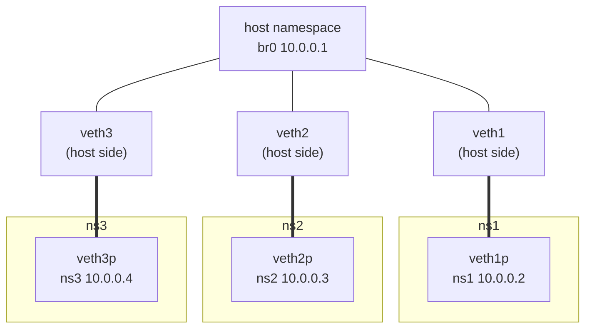
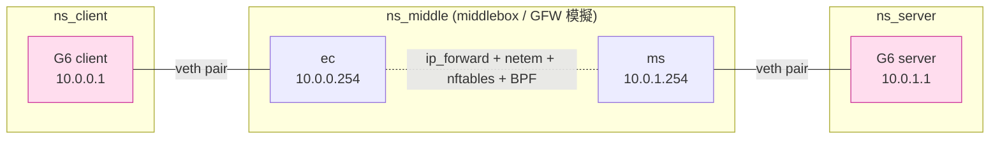

# 課堂 2.12 — 網路命名空間 (netns)

## 學前知道

- **前置課**：[2.11 TUN/TAP](./2.11-tun-tap.md)、[1.3 L2](../part-1-networking/1.3-ethernet-l2.md)、[1.4 IP routing](../part-1-networking/1.4-ip-routing-graph.md)
- **預計閱讀時間**：50~60 分鐘
- **必讀文獻 / 規格**：
  - **Biederman — Network namespaces** (linux-kernel 2007 patch series) — Eric Biederman 引入 namespaces 的原始提案
  - **`man 7 network_namespaces`**、**`man 8 ip-netns`**
  - **Linux Documentation/networking/netdev-FAQ.rst** — 含 netns 演化史
  - **LWN — Container namespaces** 系列：https://lwn.net/Articles/531114/、https://lwn.net/Articles/531381/
- **必讀原始碼**：
  - Linux `net/core/net_namespace.c`：netns 生命週期、subsystem 註冊
  - `kernel/nsproxy.c`：`nsproxy` 結構，process 的 namespace 集合
  - `include/net/net_namespace.h`：`struct net` 定義
  - `drivers/net/veth.c`：veth pair driver
  - `kernel/fork.c::copy_process` 中 `CLONE_NEWNET` 處理
- **必讀工具**：
  - `ip netns`：標準操作工具
  - `nsenter`：以指定 namespace 跑 command
  - `unshare`：新建 namespace
  - `network-namespaces` systemd 整合
  - `containerlab` / `mininet`：拓樸建立工具

---

## 動機

> netns 是「**在同一台機器上建任意網路拓樸**」的 superpower

對 G6 設計，netns 解決三個現實問題：

1. **協議測試**：要驗證「**G6 client → G6 server**」流程，傳統做法是租兩台 VPS。netns 讓你在筆電上就能跑 client + server + 模擬中間網路（含 GFW-like middlebox）
2. **對抗測試**：在 netns 內加 `tc netem` 模擬「中美 100ms RTT + 5% packet loss」，做 reproducible benchmark（[2.13](./2.13-tc-netem.md) 詳講）
3. **CI/CD pipeline**：GitHub Actions / GitLab CI 內跑 G6 整合測試，全部用 netns 拉拓樸，秒級啟動，零雲端成本

二級用途：

- 容器：Docker / Podman / Kubernetes 底層全靠 netns（+ cgroup + mount ns + ...）
- 私人 VPN：可在 netns 內跑 VPN client，**只把該 ns 內 process 走 VPN**，host 主流量正常
- 多 routing table：每個 netns 一張獨立 routing table，**不受 host 限制**

對 G6 開發來說，netns 是「**reproducible network experiment 的基礎工具**」。Part 9 / Part 10 / Part 12 的對抗實驗會大量用 netns。

---

## 核心概念

### 1. Namespace 是什麼

Linux namespaces 是一組 isolation primitives，把 kernel resource 分成隔離的 view。完整列表（Linux 6.x）：

| Namespace | 隔離什麼 | CLONE flag |
|---|---|---|
| **net** | NIC、routing table、netfilter、sockets | `CLONE_NEWNET` |
| mnt | mount points | `CLONE_NEWNS` |
| pid | process ID space | `CLONE_NEWPID` |
| uts | hostname / domainname | `CLONE_NEWUTS` |
| ipc | SysV IPC / POSIX msgq | `CLONE_NEWIPC` |
| user | UID/GID mapping | `CLONE_NEWUSER` |
| cgroup | cgroup root view | `CLONE_NEWCGROUP` |
| time | system clock | `CLONE_NEWTIME` (5.6+) |

我們只關心 **net** namespace。

### 2. `struct net`：netns 在 kernel 的對應

打開 `include/net/net_namespace.h`：

```c
struct net {
    refcount_t          passive;
    refcount_t          count;
    spinlock_t          rules_mod_lock;

    unsigned int        dev_base_seq;
    int                 ifindex;

    // 各 subsystem 的 per-netns state
    struct net_device   __rcu *loopback_dev;
    struct list_head    dev_base_head;          // 此 ns 內所有 netdev
    struct hlist_head   *dev_name_head;
    struct hlist_head   *dev_index_head;
    
    struct list_head    rules_ops;
    struct list_head    list;                   // 全 ns 鏈表
    struct list_head    exit_list;
    
    // routing tables
    struct netns_ipv4   ipv4;                   // ★ per-ns IPv4 state
    struct netns_ipv6   ipv6;
    struct netns_ieee802154_lowpan ieee802154_lowpan;
    struct netns_sctp   sctp;
    struct netns_nf     nf;                     // netfilter
    struct netns_ct     ct;                     // conntrack
    struct netns_nftables nft;                  // nftables
    struct netns_bpf    bpf;                    // BPF state
    struct netns_xfrm   xfrm;                   // IPsec
    struct netns_xdp    xdp;
    struct netns_mctp   mctp;
    struct netns_smc    smc;
    
    // sysctl tables
    struct sock         *rtnl;
    struct sock         *genl_sock;
    struct uevent_sock  *uevent_sock;
    
    // proc / sysfs
    struct proc_dir_entry *proc_net;
    struct proc_dir_entry *proc_net_stat;
    
    // user namespace owner
    struct user_namespace *user_ns;
    struct ucounts      *ucounts;
    
    // ...
};
```

每個 netns 完全獨立的：
- netdev 列表
- routing table（v4 + v6）
- ARP cache / neighbour table
- netfilter / nftables 規則
- conntrack table
- BPF program 附加
- sysctl 值（包含 `net.core.somaxconn` 等）
- socket lookup hash

⭐ **重點：netns 是「整套 stack」的隔離**，不只是 NIC list。

### 3. 建立 / 進入 netns

#### 3.1 用 `ip netns`

```bash
sudo ip netns add ns1                  # 建立
sudo ip netns list                     # 列出
sudo ip netns exec ns1 ip link list    # 在 ns1 內執行命令
sudo ip netns exec ns1 bash            # 進 ns1 跑 shell
sudo ip netns delete ns1               # 刪除
```

底層機制：

- `ip netns add ns1` → `mkdir /var/run/netns/` + `mount --bind /proc/PID/ns/net /var/run/netns/ns1`
- `ip netns exec ns1 X` → `setns(open(/var/run/netns/ns1), CLONE_NEWNET)` + `exec X`

#### 3.2 用 `unshare`

```bash
sudo unshare --net bash       # 進一個全新 netns 跑 shell
# 此 shell 內 ip link 只看到 lo (down)
```

#### 3.3 用 `clone()` syscall

```c
char stack[8192];
int flags = CLONE_NEWNET | SIGCHLD;
pid_t pid = clone(child_fn, stack + sizeof(stack), flags, NULL);
// child 進新 netns
```

#### 3.4 永久 netns

預設 process 退出，netns refcount 歸 0，netns 消失。`ip netns add` 用 **bind mount 到 /var/run/netns/** 把它 pin 住——`mount` reference 保持 netns 不被回收。

### 4. veth pair：netns 之間的「網線」

```bash
# 建一對 veth: veth0 在 host, peer 在 ns1
sudo ip link add veth0 type veth peer name veth1 netns ns1

# host 端
sudo ip addr add 10.0.0.1/24 dev veth0
sudo ip link set veth0 up

# ns1 端
sudo ip netns exec ns1 ip addr add 10.0.0.2/24 dev veth1
sudo ip netns exec ns1 ip link set veth1 up
sudo ip netns exec ns1 ip link set lo up   # 別忘 loopback

# 測通
sudo ip netns exec ns1 ping 10.0.0.1
```

`veth` 是 **point-to-point virtual ethernet**：一邊送 → 另一邊收。peer relationship 在 kernel 內維護。

#### 4.1 veth driver 細節

`drivers/net/veth.c` 是極乾淨的 driver，~1500 行。重點：

- `veth_xmit`：把 skb 從 dev A 直接 push 到 peer dev B 的 RX queue
- 預設經 napi（5.5+）達到 batched processing
- 支援 XDP！可以在 veth ingress hook XDP，這對 container networking + L7 mesh 是核心

#### 4.2 veth + bridge 多 ns 拓樸

要連 N 個 ns，用 bridge：

```bash
sudo ip link add br0 type bridge
sudo ip link set br0 up
sudo ip addr add 10.0.0.1/24 dev br0

for i in 1 2 3; do
    sudo ip netns add ns$i
    sudo ip link add veth$i type veth peer name veth${i}p netns ns$i
    sudo ip link set veth$i master br0
    sudo ip link set veth$i up
    sudo ip netns exec ns$i ip addr add 10.0.0.$((i+1))/24 dev veth${i}p
    sudo ip netns exec ns$i ip link set veth${i}p up
    sudo ip netns exec ns$i ip link set lo up
done

# 現在 3 個 ns 互通，都能 reach host (br0)
```

這就是 Docker bridge network 的底層原理。視覺化：



### 5. 完整 G6 測試拓樸

要驗證「**client → 中間網路 → G6 server**」：



```bash
# 三個 ns
for n in c m s; do sudo ip netns add ns_$n; done

# 兩條 veth
sudo ip link add ce type veth peer name ec netns ns_c
sudo ip link add ms type veth peer name sm netns ns_s
sudo ip link set ce netns ns_m
sudo ip link set ms netns ns_m

# 中間 ns_m 開 forwarding
sudo ip netns exec ns_m sysctl -w net.ipv4.ip_forward=1

# 配 IP
sudo ip netns exec ns_c ip addr add 10.0.0.1/24 dev ec
sudo ip netns exec ns_m ip addr add 10.0.0.254/24 dev ce
sudo ip netns exec ns_m ip addr add 10.0.1.254/24 dev ms
sudo ip netns exec ns_s ip addr add 10.0.1.1/24 dev sm

# 配 routing
sudo ip netns exec ns_c ip route add default via 10.0.0.254
sudo ip netns exec ns_s ip route add default via 10.0.1.254

# 各自啟 lo
for n in c m s; do sudo ip netns exec ns_$n ip link set lo up; done

# 測通
sudo ip netns exec ns_c ping 10.0.1.1
```

現在你能：

- 在 ns_c 跑 G6 client
- 在 ns_s 跑 G6 server
- 在 ns_m 跑「GFW」模擬器（用 `tc netem` 加丟包 / 延遲、用 nftables 加阻擋規則、用 BPF 抽特徵）

**完全 reproducible**，3 秒拉起來，3 秒拆掉。

### 6. netns + tc netem 模擬中美鏈路

```bash
# 在 ns_m 的兩個 interface 上加 latency + loss
sudo ip netns exec ns_m tc qdisc add dev ce root netem delay 100ms 10ms loss 5%
sudo ip netns exec ns_m tc qdisc add dev ms root netem delay 100ms 10ms loss 5%
```

效果：client → server 雙向 100ms RTT (±10ms jitter) + 5% loss。**模擬 GFW 級鏈路**。

之後 G6 baseline benchmark 在這拓樸下跑——比租 VPS 量 1 次穩定 100 倍。

[2.13](./2.13-tc-netem.md) 完整講 tc / netem。

### 7. netns + nftables / iptables 模擬 middlebox

中間 ns_m 可加 firewall 規則模擬 GFW 行為：

```bash
# 模擬 GFW 阻擋 TLS SNI 含 "blocked.com"
sudo ip netns exec ns_m nft 'add table inet filter'
sudo ip netns exec ns_m nft 'add chain inet filter forward { type filter hook forward priority 0 ; }'
sudo ip netns exec ns_m nft 'add rule inet filter forward tcp dport 443 ct content "blocked.com" drop'
# (需要 connlimit 或 string match 模組，nftables 不完全支援 string，可用 BPF/snort 模擬)
```

或用 `tc` + BPF 在中間 ns 抽特徵：

```bash
sudo ip netns exec ns_m tc qdisc add dev ce clsact
sudo ip netns exec ns_m tc filter add dev ce ingress bpf da obj sniffer.bpf.o sec ingress
```

這就是 G6 對抗測試的 **基本實驗骨架**。

### 8. netns 內 root vs unprivileged

預設 `ip netns add` 需 root（CAP_SYS_ADMIN）。

**user namespace + net namespace** 可以讓 unprivileged user 建 netns：

```bash
unshare --user --net --map-root-user bash
# 進入後是 fake-root 在新 user+net ns
ip link list   # 只看到 lo (down)
ip link set lo up
ping 127.0.0.1
```

對 CI / unprivileged container 工作流有用。但 user-ns 安全模型有過幾個 CVE，**production deploy 仍預設 disable**。

### 9. systemd-nspawn 與 systemd-networkd

systemd 整合：

```bash
# 建一個 systemd-nspawn container
sudo systemd-nspawn -D /var/lib/machines/test --network-veth
# 自動建 veth pair + netns
```

systemd-networkd 提供 declarative 配置：

```ini
# /etc/systemd/network/10-veth.netdev
[NetDev]
Name=ve-test
Kind=veth
```

對 G6 自動化 testing 環境**比手寫 ip netns 命令更穩定**。

### 10. 容器網路就是 netns + veth + bridge

Docker / Kubernetes container networking：

```
Pod 1 [netns A]                Pod 2 [netns B]
   |                                |
  veth                            veth
   |                                |
   +---------- bridge cni0 ---------+
                  |
               eth0 (host)
                  |
               internet
```

Kubernetes CNI plugin（Cilium、Calico、Flannel）就是「**配 netns + veth + 對應 routing**」的自動化。

**Cilium 進一步**：不用 veth，改用 **XDP-based redirect** 在 host 跟 pod 之間 zero-copy 傳 packet。性能巨大提升。

[Part 6 講 VPN](../part-6-vpn-internals/)、[Part 11 設計](../part-11-design/) 會回頭關聯這些 deployment 議題。

### 11. macOS 沒有 netns

macOS 完全沒有對等物。

替代方案：

- **OrbStack / Lima**：起 Linux VM，VM 內用 netns（推薦）
- **Network Link Conditioner**：macOS 自帶 latency / loss 模擬（裝 Xcode Additional Tools 拿）
- **macOS PF**：可做 firewall 但無 ns isolation

**G6 開發**：在 macOS 寫 code，但**所有 netns-based 整合測試在 OrbStack 內跑 Linux VM**。

### 12. mininet / containerlab：netns 拓樸自動化

寫測試 yaml：

```yaml
# containerlab topology
name: g6-test
topology:
  nodes:
    client:
      kind: linux
      image: alpine
    middle:
      kind: linux
      image: alpine
    server:
      kind: linux
      image: alpine
  links:
    - endpoints: ["client:eth1", "middle:eth1"]
    - endpoints: ["middle:eth2", "server:eth1"]
```

```bash
containerlab deploy
```

底層全是 netns + veth。**G6 整合測試直接用這套**——比手寫 ip netns 命令穩定。

---

## 與我們協議設計的關聯

1. **整合測試骨架**：3-ns 拓樸（client / middle / server）+ tc netem 模擬鏈路
2. **CI 跑 G6 整合測試**：GitHub Actions runner 內建 netns + tc，秒級拉拓樸
3. **對抗測試**：在 middle ns 用 BPF 抽 G6 出口流量特徵，驗證抗指紋
4. **performance baseline reproducible**：netns 內測 benchmark 比租 VPS 穩 100 倍
5. **macOS 開發**：透過 OrbStack 內 Linux VM 用 netns
6. **不在 v1 利用 user-ns**：unprivileged netns 不穩，root-required CI OK
7. **整合 containerlab**：G6 整合 test 直接寫 yaml，標準化

---

## 動手

### 實驗 A：建 3-ns 拓樸測 ping

複製 §5 的命令，建 client / middle / server 3 個 ns。在 client 內 ping server，確認 forwarding 工作。**這是後續所有實驗的基底**。

### 實驗 B：在 middle ns 加 tc netem，量 ping RTT 變化

```bash
sudo ip netns exec ns_m tc qdisc add dev ce root netem delay 100ms 10ms
# 然後 client 內 ping，看 RTT 從 <1ms 變到 ~200ms (雙向各 100ms)
sudo ip netns exec ns_c ping -c 10 10.0.1.1
```

### 實驗 C：在 middle ns 用 BPF tracking flow

寫個 TC eBPF program，attach 到 middle ns 的 ce ingress，量 packet size 分布：

```bash
sudo ip netns exec ns_m tc qdisc add dev ce clsact
sudo ip netns exec ns_m tc filter add dev ce ingress bpf da obj size_hist.bpf.o sec ingress
```

跑你的 G6 prototype，看 BPF map output。**驗證 G6 出口流量是否真的隨機**。

### 實驗 D：用 containerlab 跑同實驗

寫 yaml、`containerlab deploy`、`containerlab destroy`。對比手寫 ip netns 命令的 friction——containerlab 一秒到位。

### 實驗 E（進階）：跑 mTLS 對抗測試

中間 ns_m 內裝 mitmproxy 或 sniproxy，把 G6 流量導進去，看能不能在 TLS handshake 階段識別 G6。**直接面對 GFW 級對手的 baseline**。

---

## 自我檢查

1. netns 隔離的是哪幾類資源？routing table 是 per-ns 還是全 host 共享？
2. veth pair 是什麼？跟 ethernet 真的「網線」差別在哪？
3. `ip netns add` 用 bind mount 把 netns pin 在 /var/run/netns/ — 為什麼必須這樣？沒這個 mount 會發生什麼？
4. user-ns + net-ns 讓 unprivileged user 能建 netns，這對 G6 testing 是 win 還是 risk？
5. 為什麼 Cilium 用 XDP 替代 veth 在 host-pod 路徑上能巨大提升性能？
6. macOS 上完全沒有 netns。G6 在 macOS 上開發時，整合測試應該在哪裡跑？
7. containerlab vs 手寫 ip netns 命令的 trade-off？G6 v1 應該用哪個？
8. 寫一個 G6 「對抗測試」netns 拓樸 yaml，含 client / middle (GFW) / server 三節點 + tc netem + BPF flow inspector

---

## 延伸閱讀

- **`man 7 network_namespaces`** — 簡明
- **`man 8 ip-netns`** — 主要工具用法
- **LWN namespace 系列** — Biederman 早期 introduction
- **Cilium docs — Pod networking**：https://docs.cilium.io/en/latest/network/concepts/
- **containerlab docs**：https://containerlab.dev/
- **mininet docs**：https://mininet.org/
- **Linux kernel `Documentation/admin-guide/namespaces/`**

---

## 研究級補遺

### 1. 學界詞彙

| 中文/口語 | 學界正名 | 出處 |
|---|---|---|
| Network namespace | network namespace | Biederman 2007 |
| veth pair | virtual Ethernet pair | Linux source |
| Bridge | software bridge / virtual switch | Linux bridging |
| Container network interface | CNI | Kubernetes CNI spec |
| Service mesh datapath | mesh datapath / sidecar bypass | Cilium, Istio |
| Network virtualization | NV / overlay networking | VL2, VXLAN |

### 2. 對手分類學：netns 模擬 GFW 的能力範圍

| GFW 真實能力 | netns 模擬難度 |
|---|---|
| 路由級 BGP blackhole | 易（routing rule） |
| TCP RST injection | 中（用 BPF + iptables） |
| DNS hijack | 易（dnsmasq + route） |
| TLS SNI 阻擋 | 中（nftables / Snort） |
| Active probing | 中（自寫 prober） |
| Statistical traffic classification | 高（要訓練 ML model） |
| Packet timing inspection at line rate | 高（要 XDP-level） |

⭐ **netns 模擬適合「機械式行為」（rule-based GFW）；難模擬「ML-based GFW」**。後者要 Part 10 traffic-analysis 級的工作。

### 3. 形式化定義：拓樸 reproducibility

定義「整合測試 reproducibility」為：

$$
R(\text{Test}) = \Pr[\text{Test outcome} | \text{environment}] / \Pr[\text{Test outcome}]
$$

理想 $R = 1$（環境完全決定結果）。

- VPS-based testing: $R \approx 0.5-0.7$（雲端網路條件變化）
- netns + tc netem: $R \approx 0.95-0.99$
- netns + tc netem + 固定 kernel build: $R \approx 0.99+$

⇒ **G6 baseline benchmark 必須在 netns 跑，VPS 只用於 final validation**。

### 4. 領域的關鍵論文 / 規格

- **Biederman patch series** (2007-2009)
- **Linux Documentation/admin-guide/namespaces/**
- **Kubernetes CNI specification**：https://github.com/containernetworking/cni/blob/master/SPEC.md
- **Cilium architecture papers**
- **Mininet — A platform for rapid network experimentation** (Lantz et al. HotNets 2010)

### 5. 我們協議的座標 / 設計取捨

| 設計問題 | 本堂收窄了什麼 | 仍 open |
|---|---|---|
| 整合測試環境 | **netns + containerlab** | 是否需更大 scale (10+ node) |
| 對抗 simulator | **netns + tc netem + nftables / BPF** | ML-based adversary 模擬 |
| CI 環境 | netns 在 GitHub Actions runner | runner 性能限制 |
| 跨平台 dev | **OrbStack Linux VM 為 macOS 端執行 netns** | 流暢度 |

### 6. 必追資源 / 社群入口

- **Kubernetes SIG-Network**
- **CNI plugin maintainers**
- **netdev mailing list**
- **LWN namespace tag**
- **Cilium Slack 與 blog**

### 7. 開放問題（research-level）

1. **netns + io_uring 整合**：io_uring SQE 跨 netns 行為？目前無保證
2. **netns scaling 上限**：單 host 千級 netns 是常規，10K+ 級會有 sysctl table / hash 衝突。研究議題
3. **memory-safe ns implementation**：Rust 重寫 netns subsystem？netstack3 走這方向
4. **adversarial netns simulation**：能否用 RL 訓練 GFW-like adversary 在 netns 內？
5. **G6 整合測試 framework**：能否標準化「**對抗測試 baseline scenarios**」？對 academic G6 paper 重要

---

## 對下一堂的鋪墊

本堂建好了「**拓樸**」。下一堂 [2.13 tc / netem](./2.13-tc-netem.md) 講「**怎麼模擬具體鏈路條件**」：HTB、fq、fq_codel、cake、netem 完整參數。重點是「**怎麼用 netem 模擬中美鏈路 5% 丟包 200ms RTT**」——這是 G6 對抗測試的核心工具。
