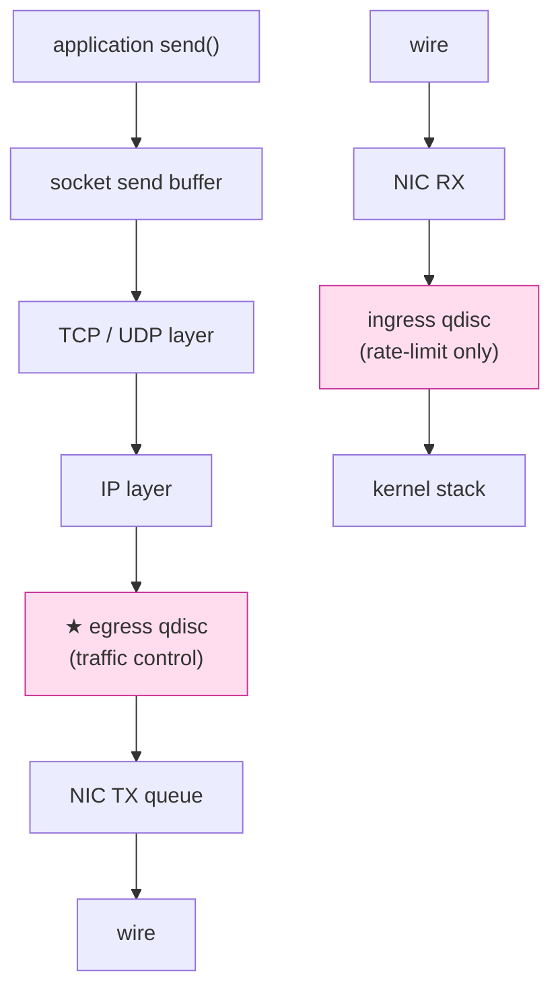
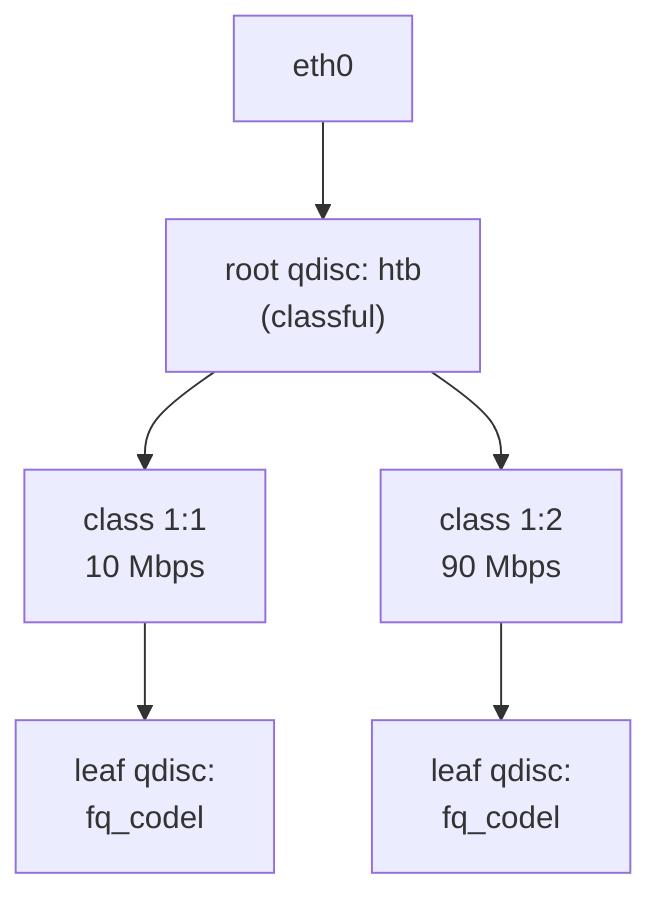

# 課堂 2.13 — 流量整形：tc / netem

## 學前知道

- **前置課**：[2.12 netns](./2.12-netns.md)（拓樸基礎）、[1.4 IP routing](../part-1-networking/1.4-ip-routing-graph.md)
- **預計閱讀時間**：60~80 分鐘
- **必讀文獻**：
  - **Cardwell, Cheng, Gunn, Yeganeh, Jacobson — BBR: Congestion-Based Congestion Control** (ACM Queue 2016 / CACM 2017) ⭐⭐ — 已抓 `assets/papers/cacm-2017-bbr.pdf` + `bbr-acmqueue-2016.pdf`。Google 設計 BBR 的主論文，**現代 TCP congestion control 必懂**
  - **Høiland-Jørgensen et al. — The FlowQueue-CoDel Packet Scheduler and Active Queue Management Algorithm** (RFC 8290, 2018) ⭐ — 已抓 `assets/papers/rfc-8290-fq-codel.pdf`
  - **Høiland-Jørgensen et al. — Piece of CAKE: A Comprehensive Queue Management Solution for Home Gateways** (arXiv 2018) ⭐ — 已抓 `assets/papers/ton-2018-cake.pdf`。CAKE 是 fq_codel 的後繼者
  - **Nichols & Jacobson — Controlling Queue Delay** (CACM 2012) — CoDel 原始論文
  - **Bufferbloat.net 系列** — https://www.bufferbloat.net/projects/ — Jim Gettys 對 bufferbloat 問題的長期戰鬥
  - **Hemminger — netem patch series**（kernel-netem 創始者）
  - **Linux Documentation/networking/tc/**、**`man 8 tc-netem`、`tc-htb`、`tc-fq`、`tc-cake`**
- **必讀原始碼**：
  - `net/sched/`：所有 qdisc 實作
  - `net/sched/sch_netem.c`：netem 主檔
  - `net/sched/sch_fq.c`、`sch_fq_codel.c`、`sch_cake.c`：fair queue 家族
  - `net/sched/sch_htb.c`：HTB
  - `net/ipv4/tcp_bbr.c`：BBR congestion control
  - `net/ipv4/tcp_cubic.c`：CUBIC

---

## 動機

> tc / netem 是 G6 對抗測試的核心工具，BBR / fq_codel / cake 決定 G6 真實 throughput

對 G6 的具體用途：

1. **模擬 GFW 級鏈路**：「中美 100ms RTT + 5% 丟包」是業界標配 baseline，必須能 reproducible 跑
2. **驗證 G6 在 lossy 鏈路的性能**：傳統 TCP 在 5% 丟包下 throughput 跌 10×；G6 用什麼 congestion control 必須直接驗證
3. **fq_codel / cake 是現代 qdisc**：理解它們對 G6 server 默認 qdisc 設定有指導意義
4. **HTB / tbf 流量整形**：若 G6 提供「**per-user bandwidth limit**」feature，要用 HTB
5. **BBR 選型**：G6 在 lossy 鏈路必開 BBR 不開 CUBIC

本堂三個層次：

- **§1-§3 概念**：qdisc 樹、classful vs classless、netfilter 跟 tc 的差異
- **§4-§7 工具**：netem、HTB、fq_codel、cake、各自參數深入
- **§8-§10 演算法**：BBR、CoDel、PIE 的原理，congestion control 對 G6 的選擇

---

## 核心概念

### 1. tc / qdisc 全景



`tc` (traffic control) 在 packet 進 NIC TX 前對 packet 排隊、shape、分類。

#### 1.1 qdisc 樹結構

每張 NIC 有一個 root qdisc，可以有 child qdisc 形成樹：



- **classful qdisc**: HTB、CBQ、HFSC、PRIO — 可加 class 與 filter 做分類
- **classless qdisc**: pfifo、fq、fq_codel、cake、netem、tbf — 只是個 queue 演算法

#### 1.2 看當前 qdisc

```bash
tc qdisc show dev eth0
# qdisc fq_codel 0: root refcnt 2 limit 10240p flows 1024 quantum 1514 ...
```

Linux 5.x+ 預設用 **fq_codel** 作 root qdisc（從 `net.core.default_qdisc` 設）。

### 2. 預設 qdisc 演化史

| 年份 | 預設 | 問題 |
|---|---|---|
| ~2000 | `pfifo_fast` | tail drop，bufferbloat |
| 2012 | CoDel 論文發表（Nichols & Jacobson） | — |
| 2013 | fq_codel 進主線 | bufferbloat 大幅減輕 |
| 2018+ | sch_fq（Dumazet）成為 server-side fave | TCP pacing 配合 BBR |
| 2018+ | CAKE 進 Linux（家用 router 主） | 對 ISP buffer 友善 |
| 2023+ | 各 distro 預設 fq_codel | — |

⭐ **G6 server 設定**：預設 fq_codel（沒大幅 ISP buffer 問題）；若 server 在 100Mbps 級家用線路後，可考慮 cake。

### 3. 經典 qdisc 一覽

#### 3.1 `pfifo`、`pfifo_fast`、`bfifo`

最古老。pfifo 是 priority FIFO（依 ToS bit 分 3 queue），tail drop。完全沒 fairness。**已退役**。

#### 3.2 `tbf` (Token Bucket Filter)

```bash
tc qdisc add dev eth0 root tbf rate 1mbit burst 32kbit latency 400ms
```

`tbf` 是 leaky bucket：固定 rate 出 token，每 byte 出去消耗 1 token，token 不夠就 buffer。

對 G6：**做簡單 bandwidth limit** 適用。但不 fair 也不 AQM。

#### 3.3 `htb` (Hierarchical Token Bucket)

最常用 classful qdisc，可建樹：

```bash
tc qdisc add dev eth0 root handle 1: htb default 30
tc class add dev eth0 parent 1: classid 1:1 htb rate 100mbit
tc class add dev eth0 parent 1:1 classid 1:10 htb rate 10mbit ceil 100mbit
tc class add dev eth0 parent 1:1 classid 1:20 htb rate 20mbit ceil 100mbit
tc class add dev eth0 parent 1:1 classid 1:30 htb rate 70mbit ceil 100mbit

# 加 filter 把特定流量 classify 到 1:10
tc filter add dev eth0 parent 1: protocol ip prio 1 u32 match ip dport 443 0xffff flowid 1:10
```

可達成 ISP / 多用戶 bandwidth limit。**G6 multi-user per-user shaping 用 HTB**。

#### 3.4 `fq` (Fair Queue, Dumazet)

```bash
tc qdisc add dev eth0 root fq pacing
```

特性：

- per-flow（5-tuple）queue，round-robin
- 支援 **pacing**: 配合 TCP 自己 advertise 的 pacing rate 出 packet（BBR 要這個）
- 對 high-throughput TCP 友善
- 沒有 AQM（fq 是 scheduler，不 drop）

**G6 server 配 BBR 必開 fq**（kernel >=4.19 預設 fq 在 BBR enable 時自動切）。

#### 3.5 `fq_codel` (Fair Queueing + CoDel)

```bash
tc qdisc add dev eth0 root fq_codel
```

特性：

- per-flow queue（同 fq）
- 每 flow queue 內跑 **CoDel** AQM（active queue management）：根據 packet 在 queue 內滯留時間決定 drop
- **解決 bufferbloat 的工業標準**
- Linux 預設

**對 G6 用**：所有 G6 server 預設 fq_codel。**家用 user 也應該開**——他們的家庭 router 多半 bufferbloat 嚴重，影響 G6 體驗。

#### 3.6 `cake` (Common Applications Kept Enhanced)

```bash
tc qdisc add dev eth0 root cake bandwidth 100mbit
```

特性（CAKE 論文 ⭐）：

- fq_codel 改進版
- 內建 bandwidth shaping（不用配 HTB）
- 多 tier fairness：per-flow + per-host + per-class
- 處理 ISP buffer（modem 內部 buffer）
- 配套 GRE / WireGuard / pppoe header overhead 補償

**家用 router (OpenWrt) 默認 cake**。G6 server 不一定需要——cake 對 ISP-level bufferbloat 有用，server 一般是 DC，buffer 不大。

### 4. netem 完整參數

`netem`（Network Emulator）讓你**人為加 latency / loss / jitter / corruption**。

#### 4.1 basic usage

```bash
# 加 100ms 延遲，±20ms 抖動
tc qdisc add dev eth0 root netem delay 100ms 20ms

# 加 5% packet loss
tc qdisc add dev eth0 root netem loss 5%

# 組合
tc qdisc add dev eth0 root netem delay 100ms 20ms loss 5% reorder 10% 50%
```

#### 4.2 完整參數

| 參數 | 意義 |
|---|---|
| `delay 100ms 20ms` | mean 100ms ± 20ms jitter |
| `delay 100ms 20ms distribution normal` | jitter 服從常態分布（其他: pareto / paretonormal / experimental） |
| `loss 5%` | 隨機 5% 丟包 |
| `loss 5% 25%` | 5% 丟包 + correlation 25%（連續丟包機率高） |
| `loss state ...` | 4-state Gilbert model（更真實 burst loss） |
| `loss gemodel ...` | Gilbert-Elliott model |
| `duplicate 1%` | 1% packet 複製 |
| `corrupt 0.1%` | 0.1% packet 隨機翻 bit |
| `reorder 25% 50%` | 25% 機率 reorder 一個 packet，50% correlation |
| `rate 100mbit` | 出口速率限制（類似 tbf） |
| `limit 1000` | queue 大小 1000 packet |
| `slot ...` | inter-packet 間隔模型（5.x 新增） |

#### 4.3 模擬中美鏈路

```bash
# ns_m 中間 ns 加典型「中美鏈路」condition
tc qdisc add dev ce root netem \
   delay 100ms 10ms distribution normal \
   loss state 0.1 5 0.4 5 0.4 \
   rate 50mbit limit 1000
```

- 100ms ± 10ms 常態抖動 RTT 各方向
- 4-state Gilbert loss model（5% peak burst）
- 50Mbps 上限

這是 G6 baseline benchmark 的 **canonical scenario**。

#### 4.4 netem 跟 tbf / htb 合用

netem 沒 fairness。要 fair-share + emulation 用組合：

```bash
tc qdisc add dev eth0 root handle 1: netem delay 100ms loss 5%
tc qdisc add dev eth0 parent 1:1 handle 10: fq_codel
```

或：

```bash
tc qdisc add dev eth0 root handle 1: htb default 10
tc class add dev eth0 parent 1: classid 1:10 htb rate 50mbit
tc qdisc add dev eth0 parent 1:10 handle 10: netem delay 100ms loss 5%
tc qdisc add dev eth0 parent 10: handle 100: fq_codel
```

### 5. tc filter：流量分類

把 packet 分到不同 class：

```bash
# u32: 直接從 packet 比 byte 抽特徵
tc filter add dev eth0 parent 1: protocol ip prio 1 \
   u32 match ip dport 443 0xffff flowid 1:10

# fwmark: 用 iptables 標記，tc 看 mark
iptables -t mangle -A POSTROUTING -p tcp --dport 443 -j MARK --set-mark 10
tc filter add dev eth0 parent 1: handle 10 fw flowid 1:10

# BPF: 用 eBPF program 分類
tc filter add dev eth0 parent 1: bpf da obj classifier.bpf.o sec classifier
```

**BPF 是現代首選**——靈活度最高，性能比 u32 好。

### 6. 對 G6 server 的 qdisc 設定建議

#### 6.1 預設

```bash
# 多數情境下，fq + BBR 即可
sudo sysctl -w net.core.default_qdisc=fq
sudo sysctl -w net.ipv4.tcp_congestion_control=bbr
```

#### 6.2 multi-user / shaping 場景

```bash
tc qdisc add dev eth0 root handle 1: htb default 30
tc class add dev eth0 parent 1: classid 1:1 htb rate 1000mbit ceil 1000mbit
# 用 BPF 把每個 user 分到 class
tc filter add dev eth0 parent 1: bpf da obj user_classify.bpf.o sec classifier
# 每個 leaf class 內跑 fq
tc qdisc add dev eth0 parent 1:10 handle 10: fq pacing
tc qdisc add dev eth0 parent 1:20 handle 20: fq pacing
```

#### 6.3 G6 自己內部 transport 也應 pacing

若 G6 走自訂 transport（UDP-based），**也要 pacing**——否則 bursty send 對 G6 自己跟 router 都是壓力。實作上：每個 send 算 inter-packet delay 由 user-space sleep 或 sock 上設 `SO_MAX_PACING_RATE`。

### 7. BBR (Cardwell et al. 2016/2017) ⭐

#### 7.1 為什麼 BBR

傳統 TCP（CUBIC、Reno）是 **loss-based**：

- 拼命發直到丟包 → 降速 → 慢慢爬回
- 在 5% 丟包鏈路 throughput 跌 10×
- 在大 buffer 鏈路 → bufferbloat（fill buffer）

BBR 是 **model-based**：

- 持續 estimate bottleneck bandwidth (BtlBw) + min RTT (RTprop)
- 出 packet rate = BtlBw
- 沒到 bottleneck buffer 就停（**不 fill buffer**）
- **對 loss 不過度反應**（loss != congestion in BBR's view）

#### 7.2 BBR 在 lossy 鏈路的優勢

Google 公開資料：

| 鏈路條件 | CUBIC | BBR | 提升 |
|---|---|---|---|
| 100ms RTT, 1% loss | 4 Mbps | 100 Mbps | 25× |
| 200ms RTT, 5% loss | 0.5 Mbps | 40 Mbps | 80× |
| 50ms RTT, 0% loss | 600 Mbps | 600 Mbps | 持平 |

⭐ **這就是 G6 server 必開 BBR 的理由**——對抗 GFW 鏈路（高 RTT + lossy）的 baseline 是 BBR。

#### 7.3 BBR 啟用

```bash
echo "bbr" | sudo tee /proc/sys/net/ipv4/tcp_congestion_control
# 或 persistent
sudo sysctl -w net.ipv4.tcp_congestion_control=bbr
sudo sysctl -w net.core.default_qdisc=fq    # BBR 需要 fq pacing
```

#### 7.4 BBRv2 / BBRv3

BBR v1 對 fairness 不友善（會欺負 CUBIC，搶帶寬）。BBRv2 (2019+) 加強 fairness、ECN 響應，BBRv3 (2023+) 改善低 RTT 行為。Linux 6.x 主線仍是 BBRv1。

**G6 用 BBRv1 即可**——v2/v3 主要解決公平性問題，G6 用戶單方向 deploy 不在意。

### 8. CoDel (Nichols & Jacobson 2012) ⭐

#### 8.1 問題：bufferbloat

過去 router buffer 設超大（為了「never drop」），結果：

- queue 滿時 latency 巨增
- VoIP / 遊戲 / 互動體驗崩
- TCP 拼命發直到丟包，buffer 越填越滿

#### 8.2 CoDel 解法

每個 queued packet 紀錄 sojourn time（在 queue 內滯留時間）。
若 sojourn time > 5ms 持續 100ms，**主動 drop**（不等 queue 滿）。

特性：

- **No knob to tune**：兩個常數（5ms、100ms）對所有 link rate 通用
- self-clocking：drop 後 TCP 自然降速
- 配 fq 變 fq_codel：每 flow 獨立 queue，per-flow CoDel

#### 8.3 fq_codel 在 G6 server

G6 server 用 fq_codel root：
- 每條 G6 client connection 獨立 queue
- 互不 starvation
- 對 bufferbloat 有抵抗

**配 BBR + fq + fq_codel 是 G6 server 標配**。實際上 BBR + fq 已內含 codel-like 機制，部分情境簡化用 fq 就夠。

### 9. CAKE (Høiland-Jørgensen et al. 2018) ⭐

CAKE = Common Applications Kept Enhanced。fq_codel 後繼。

#### 9.1 改進點

1. **內建 shaping**：不用外 wrap HTB，bandwidth limit 直接設
2. **多 tier fairness**：per-flow within host, per-host fair
3. **ISP overhead 補償**：對 PPPoE / DOCSIS 等鏈路的 framing overhead 算進去
4. **DiffServ marking**：用 DSCP 分 priority tier

#### 9.2 用法（家用 router）

```bash
tc qdisc add dev eth0 root cake bandwidth 100mbit pppoe-vdsl2 dual-srchost
```

- `bandwidth 100mbit`：ISP 提供帶寬
- `pppoe-vdsl2`：framing model
- `dual-srchost`：per-host + per-flow fairness

#### 9.3 G6 client 場景

G6 client 在家用 router 後面（user 家），若 router 預設沒開 cake，G6 體驗會受 bufferbloat 衝擊。**G6 文件應建議用戶在自家 router 開 cake**（OpenWrt SQM-scripts）。

### 10. PIE (RFC 8033)

另一條 AQM：用 ECN mark 而非 drop（如果 endpoint 支援）。Cisco / DOCSIS 偏好。Linux 有 sch_pie 實作但較少用。對 G6 不直接 relevant。

### 11. 完整 G6 對抗測試 setup

回到 [2.12](./2.12-netns.md) §5 的 3-ns 拓樸，加上 netem：

```bash
#!/bin/bash
# g6-test-link.sh
# 在 ns_m 模擬中美鏈路：100ms RTT, 5% loss, 50Mbps cap

NETNS_M=ns_m

# 兩個 interface 都要加（雙向）
for IFACE in ce ms; do
    sudo ip netns exec $NETNS_M tc qdisc del dev $IFACE root 2>/dev/null || true
    sudo ip netns exec $NETNS_M tc qdisc add dev $IFACE root handle 1: htb default 10
    sudo ip netns exec $NETNS_M tc class add dev $IFACE parent 1: classid 1:10 htb rate 50mbit ceil 50mbit
    sudo ip netns exec $NETNS_M tc qdisc add dev $IFACE parent 1:10 handle 10: netem \
        delay 50ms 5ms distribution normal \
        loss state 0.1 5 0.4 5 0.4
    sudo ip netns exec $NETNS_M tc qdisc add dev $IFACE parent 10: handle 100: fq_codel
done
```

跑 G6 client / server，量 throughput / latency / connection establishment time。

**這就是 G6 SOTA-comparison 的 canonical scenario**。

### 12. 量測工具

- **`iperf3`**：throughput 量測經典
- **`tcpkali`**：long-connection benchmark
- **`flent`** (FLExible Network Tester)：bufferbloat / RTT/throughput 同時 - 跑 RRUL test
- **`netperf`**：經典
- **`mtr`**：traceroute + ping 結合
- **`pchar` / `pathload`**：available bandwidth estimation

**G6 對抗實驗**：用 flent RRUL test 量「**G6 在 lossy 鏈路下 throughput vs latency under load**」。

---

## 與我們協議設計的關聯

1. **Congestion control**：G6 在 TCP-based transport 模式用 BBR。若走 UDP/QUIC，自寫 BBR-like 或用 quiche 自帶
2. **Server qdisc**：fq + fq_codel + BBR 三件套
3. **G6 自家 pacing**：UDP 模式必須 user-space pacing，避免 bursty send 觸發 ISP loss
4. **對抗測試 baseline**：netns + netem「中美鏈路」是必跑 scenario
5. **Client 側建議**：文件建議家用 router 開 cake（OpenWrt user）
6. **Multi-user shaping**：HTB + BPF classifier 支援 per-user bandwidth limit
7. **Bufferbloat 自我檢查**：每次 G6 release 用 flent 跑 RRUL test，確保 P99 latency under load 不退化

---

## 動手

### 實驗 A：basic netem 觀察

在你的開發機（或 netns）加 100ms 延遲：

```bash
sudo tc qdisc add dev lo root netem delay 100ms
ping 127.0.0.1
# 應該看到 RTT ~200ms (雙向各 100ms)
sudo tc qdisc del dev lo root
```

### 實驗 B：BBR vs CUBIC 在 lossy 鏈路

用 netns 拉拓樸，中間加 5% loss。  
server 端跑 iperf3。client 連線。  
切換 server congestion control：

```bash
sudo sysctl -w net.ipv4.tcp_congestion_control=cubic
# 跑 iperf3，記錄 throughput
sudo sysctl -w net.ipv4.tcp_congestion_control=bbr
# 再跑
```

對比 throughput。預期 BBR 是 CUBIC 的 5-10×。

### 實驗 C：bufferbloat 顯示

加超大 buffer + 慢 link 模擬 bufferbloat：

```bash
sudo tc qdisc add dev eth0 root tbf rate 1mbit burst 32kb limit 500000  # huge buffer
# 跑 iperf 同時 ping
iperf3 -c server &
ping server
# 看 ping RTT 飆到秒級
```

之後切到 fq_codel：

```bash
sudo tc qdisc replace dev eth0 root fq_codel
# 重跑，ping 維持低
```

### 實驗 D：完整 G6 對抗 setup

複製 §11 script，跑你的 G6 prototype。量：

- throughput
- P50 / P99 latency
- connection establishment time

對比 baseline TCP + CUBIC、TCP + BBR、G6 自家 transport。

---

## 自我檢查

1. fq_codel 跟 cake 的核心差異？G6 server 該用哪個？
2. BBR 為何在 lossy 鏈路比 CUBIC 強這麼多？背後的 model-based vs loss-based 哲學差異
3. CoDel 的 5ms / 100ms 兩個常數是怎麼來的？為什麼能 universal applicable？
4. netem 模擬「中美鏈路」，loss model 應該用 `loss 5%` 還是 `loss state ...`？理由？
5. G6 client 跑在家用 router 後面，要建議 user 改什麼設定？
6. tc filter 三種分類方式 (u32 / fwmark / BPF) 各自場景？
7. pacing 是什麼？對 BBR 為何 critical？G6 自家 transport 需要 pacing 嗎？
8. 寫一個 G6 server 預設 qdisc 設定腳本，含 fq + BBR + multi-user HTB shaping

---

## 延伸閱讀

- **BBR CACM 2017** — 已抓
- **BBR ACM Queue 2016 longer version** — 已抓
- **CAKE arXiv 2018** — 已抓
- **fq_codel RFC 8290** — 已抓
- **Bufferbloat.net 全部文章**：https://www.bufferbloat.net/
- **Jim Gettys talks**：YouTube 找
- **Linux Documentation/networking/tc/**
- **`man 8 tc-*`** 所有 qdisc 的 manpage

---

## 研究級補遺

### 1. 學界詞彙

| 中文/口語 | 學界正名 | 出處 |
|---|---|---|
| 流量整形 | traffic shaping | 古典 |
| 主動 queue 管理 | Active Queue Management (AQM) | Floyd & Jacobson 1993 RED |
| Bufferbloat | bufferbloat | Gettys 2010 |
| Pacing | TCP pacing | Aggarwal et al. 2000 |
| Model-based congestion control | BBR-style CC | Cardwell 2016 |
| Loss-based congestion control | CUBIC-style CC | Ha et al. 2008 |
| Fair queue | weighted fair queuing (WFQ) / DRR | Parekh & Gallager 1993 / Shreedhar & Varghese 1995 |

### 2. 對手分類學：對手能 shape 我們流量嗎

GFW / ISP 可在中間設備：

- **bandwidth throttle**：對 G6 流量 rate limit（觀察到 G6 連線就降速）
- **packet drop**：對 G6 連線提高丟包率（懲罰）
- **RTT injection**：故意加延遲降 G6 UX
- **完全 block**：drop 所有 packet

對 G6 反應：

| 對手手段 | G6 對策 |
|---|---|
| Bandwidth throttle | 多 connection 並用、UDP 切 TCP fallback |
| Selective drop | 改 IP / port，BBR 對 loss 抗性 |
| RTT injection | 客戶端 latency monitor，跨 server 切換 |
| Block | 不可解，換協議形態 |

### 3. 形式化定義：congestion control 對抗 metric

定義 throughput-loss 函數 $T(p)$ = throughput as function of packet loss rate $p$。

- CUBIC: $T(p) \propto \frac{\text{MSS}}{\text{RTT} \sqrt{p}}$（Mathis formula）
- BBR: $T(p)$ 對 small $p$ 幾乎不變（BBR 不過度反應 loss）

對 G6 implication：在對手有意 drop 一定比例 packet 時，CUBIC throughput 跌幅快，BBR slow。**G6 必開 BBR**。

### 4. 領域的關鍵論文 / 規格

- **Cardwell BBR CACM 2017** ⭐⭐ — 已抓
- **Cardwell BBR ACM Queue 2016 (longer)** — 已抓
- **CAKE arXiv 2018** — 已抓
- **fq_codel RFC 8290** — 已抓
- **Nichols & Jacobson CoDel CACM 2012**
- **Floyd & Jacobson — RED** (IEEE/ACM TON 1993) — AQM 鼻祖
- **Mathis TCP throughput formula** (ACM CCR 1997)
- **Ha et al. CUBIC paper** (ACM OSR 2008)

### 5. 我們協議的座標 / 設計取捨

| 設計問題 | 本堂收窄了什麼 | 仍 open |
|---|---|---|
| TCP CC | **BBR (v1)** | 何時切 BBRv2/v3 |
| 自家 transport CC | **BBR-like** | 抄 quiche / 自寫 |
| Server qdisc | fq + fq_codel | per-user HTB 條件 |
| Client 對 bufferbloat | 文件建議 cake | 是否內建 SQM |
| 對抗 testing | netem「中美鏈路」是 canonical | 是否需 ML-driven adversary |

### 6. 必追資源 / 社群入口

- **bloat mailing list**：bufferbloat.net 維護
- **IETF AQM working group**（已關，歷史檔案值得讀）
- **netdev mailing list — TCP/CC discussions**
- **Linux Plumbers Networking microconf**
- **Eric Dumazet、Yuchung Cheng、Soheil Hassas Yeganeh patch history**

### 7. 開放問題（research-level）

1. **BBR 跟 G6 自家 transport 對接**：QUIC 自帶 CC framework 可自寫；UDP-based 自訂 transport 要從頭。BBR/COPA/PCC 各自 tradeoff
2. **對抗 adversarial loss**：理論上對手可挑 specific packet drop（如只丟 RST），CC 演算法對這種 attack model 怎麼設計？少 paper
3. **形式化 fair share under adversary**：當 adversary 控 middlebox，flow fairness 定義會崩。新 formalism 是研究方向
4. **G6 內部 pacing 演算法**：傳統 fq pacing 是 kernel 提供；UDP-based transport 自己做。設計開放
5. **netem 真實性 validation**：netem state model 對真實 GFW loss pattern 多近似？實證研究稀缺，可做 measurement paper

---

## 對下一堂的鋪墊

本堂講完所有「**單一機制**」（epoll / io_uring / 零拷貝 / kTLS / eBPF / XDP / DPDK / user-space stack / macOS NE / TUN / netns / tc-netem）。下一堂 [2.14 高效能網路的最終 picture](./2.14-final-picture.md) 把這 13 堂整合：一個 packet 從 NIC（DMA + AF_XDP）到 user-space（io_uring + zero-copy）到應用程式（協議邏輯）的**完整最佳化路徑圖**，並對應 G6 server / client 各自的設計選擇定稿。讀完 2.14 你會擁有完整的「**G6 系統 layer 全圖**」。
