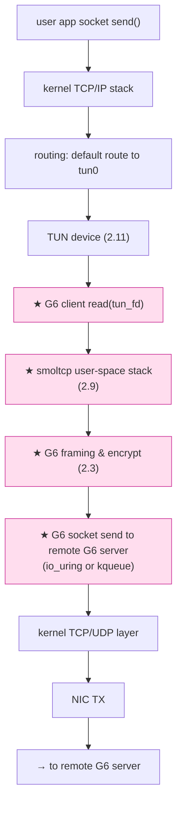
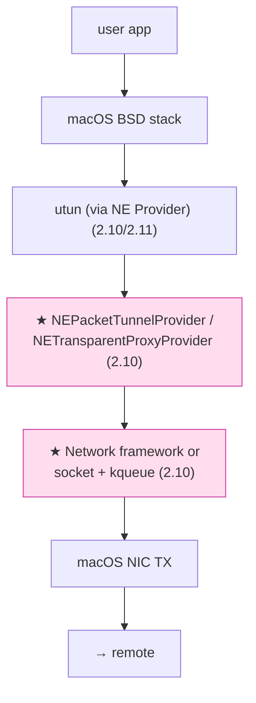
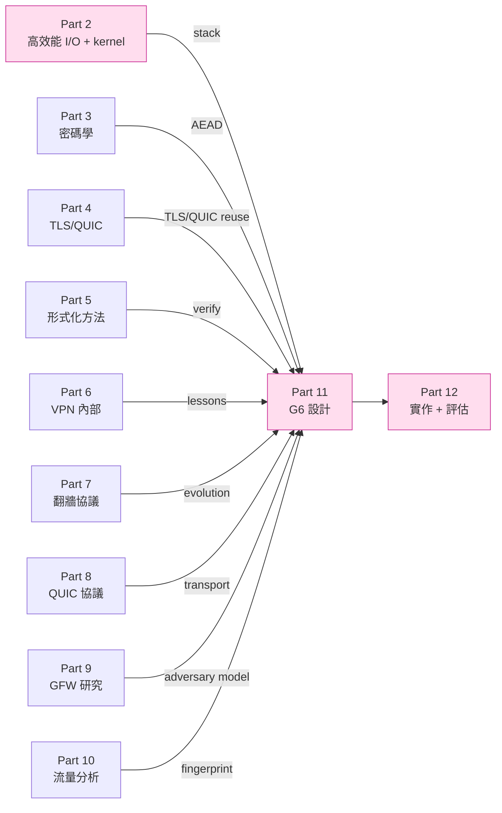

# 課堂 2.14 — 高效能網路的最終 picture

## 學前知道

- **前置課**：2.1~2.13 全部 13 堂。本堂是整合，不講新概念
- **預計閱讀時間**：40~60 分鐘（純整合，但要回頭翻前面的 link）
- **延伸文獻**（彙整 + 補幾本「**從整體角度看高效能網路**」的經典）：
  - **Mogul & Ramakrishnan — Eliminating Receive Livelock in an Interrupt-Driven Kernel** (TOCS 1997) ⭐ — 已抓 `assets/papers/tocs-1997-mogul-livelock.pdf`。NAPI 模型誕生的源頭論文
  - **Neugebauer et al. — Understanding PCIe Performance for End Host Networking** (SIGCOMM 2018) ⭐ — 已抓 `assets/papers/sigcomm-2018-neugebauer-pcie.pdf`。PCIe link 端的性能限制——network performance 的隱形天花板
  - **Han et al. MegaPipe** (OSDI 2012) — 已抓
  - **Rizzo netmap** (USENIX ATC 2012) — 已抓
  - **Kohler et al. — The Click Modular Router** (TOCS 2000) ⭐ — 已抓 `assets/papers/tocs-2000-kohler-click.pdf`。「**模組化 packet processing graph**」的學術典範
- **必讀生態系彙整**：本堂只列「**完整 stack 設計典範**」工具：
  - **Cilium**：production eBPF + XDP 集大成
  - **Cloudflare unimog / unimog-xdp**：commercial production 範例
  - **VPP / Seastar / mTCP / F-Stack**：user-space datapath 範例
  - **TigerBeetle**：純 io_uring 應用 reference

---

## 動機

> 把 13 堂的點連成 G6 系統的「**完整 stack layer 全圖**」

過去 13 堂我們一個 mechanism 講一堂，獨立看每個都是「**性能 trick**」。本堂要回答：

1. **一個 packet 從 NIC 到 G6 application 的完整路徑經過多少 layer？每 layer 做什麼？**
2. **G6 server / G6 client 各自的 stack 設計選擇是什麼？跨平台怎麼一致？**
3. **整個 Part 2 為 G6 設計鎖死了哪些事？還留了哪些開放問題給 Part 11/12？**
4. **2026 trends + 2030 predictions：DPU、SmartNIC、kernel-bypass / kernel-extension 的下一波**

讀完本堂你會擁有一張「**Part 2 → Part 11 → Part 12 的串接圖**」，是 G6 設計階段的 reference。

---

## 核心內容

### 1. 一個 packet 在 G6 server 完整路徑

```mermaid
flowchart TD
    WIRE["wire (~10G fiber)"]
    NIC["NIC RX FIFO"]
    DMA["DMA into kernel/user buffer<br/>(skb or AF_XDP UMEM)"]
    XDP_HOOK["★ XDP hook<br/>(2.7) DDoS filter, fingerprint sample"]
    SKB_ALLOC["alloc skb (if PASS)"]
    NETFILTER["netfilter ingress<br/>(2.6) connect tracking, NAT"]
    TC_INGRESS["★ TC ingress eBPF<br/>(2.6) flow metering"]
    L4["TCP/UDP demux"]
    SOCKQ["socket recv queue"]
    
    IOURING_RX["★ io_uring multishot RECV<br/>(2.2) registered buf_ring"]
    USR_DECRYPT["★ user-space AEAD decrypt<br/>in-place ChaCha20-Poly1305 (2.3)"]
    USR_PROTOCOL["★ G6 protocol parser<br/>(Part 11 / Part 12)"]
    USR_LOGIC["application logic<br/>(forward to upstream)"]
    
    USR_ENCRYPT["★ user-space AEAD encrypt<br/>in-place (2.3)"]
    IOURING_TX["★ io_uring SEND_ZC<br/>(2.2) zero-copy send"]
    TCP_OUT["TCP/UDP layer"]
    QDISC["★ qdisc: fq + fq_codel<br/>(2.13) BBR pacing"]
    TC_EGRESS["★ TC egress eBPF<br/>(2.6) self-fingerprint sample"]
    NIC_TX["NIC TX queue"]
    WIRE_OUT["wire (out)"]

    WIRE --> NIC
    NIC --> DMA
    DMA --> XDP_HOOK
    XDP_HOOK -- "PASS" --> SKB_ALLOC
    XDP_HOOK -- "DROP" --> DROP[("× dropped")]
    SKB_ALLOC --> NETFILTER
    NETFILTER --> TC_INGRESS
    TC_INGRESS --> L4
    L4 --> SOCKQ
    SOCKQ --> IOURING_RX
    IOURING_RX --> USR_DECRYPT
    USR_DECRYPT --> USR_PROTOCOL
    USR_PROTOCOL --> USR_LOGIC
    USR_LOGIC --> USR_ENCRYPT
    USR_ENCRYPT --> IOURING_TX
    IOURING_TX --> TCP_OUT
    TCP_OUT --> QDISC
    QDISC --> TC_EGRESS
    TC_EGRESS --> NIC_TX
    NIC_TX --> WIRE_OUT

    classDef ours fill:#fde,stroke:#c39
    class XDP_HOOK,TC_INGRESS,IOURING_RX,USR_DECRYPT,USR_PROTOCOL,USR_LOGIC,USR_ENCRYPT,IOURING_TX,QDISC,TC_EGRESS ours
```



**13 個 step**。粉色節點 = G6 直接控制 / 配置 / 寫 code 的部分。

#### Per-stage latency budget (1500B packet)

| Stage | 預估 latency | 控制權 |
|---|---|---|
| Wire | RTT-dependent | 外部 |
| NIC RX FIFO + DMA | ~500ns | NIC firmware |
| XDP filter (drop path) | ~50ns | G6 code |
| skb alloc + netfilter + tc ingress | ~1-2μs | kernel + G6 BPF |
| L4 demux | ~500ns | kernel |
| socket recv queue → io_uring | ~500ns | io_uring runtime |
| user-space decrypt | ~1-2μs (1500B ChaCha20) | G6 code |
| G6 protocol parser | ~500ns | G6 code |
| user-space encrypt | ~1-2μs | G6 code |
| io_uring SEND_ZC | ~500ns | io_uring |
| qdisc + tc egress | ~1-2μs | kernel + G6 BPF |
| NIC TX + DMA + wire | ~500ns + RTT | NIC firmware |

⭐ **整體 user-space-only overhead < 10μs**。對 1Gbps line rate 完全無瓶頸。對 10Gbps line rate (~1500B @ 14.88Mpps) 仍 OK 但需 multi-core。

### 2. 一個 packet 在 G6 client (Linux) 完整路徑



#### G6 client (macOS) 對等路徑



### 3. G6 系統 stack 全景 (整個 G6 deploy)

```mermaid
flowchart LR
    subgraph User["End User"]
        APP["browser / app"]
    end
    subgraph Client["G6 Client (macOS/Linux/Windows)"]
        UI["G6 UI<br/>(SwiftUI / Tauri)"]
        CORE["G6 core<br/>(Rust)"]
        TUNC["TUN / NE provider"]
        SOCK["socket out"]
    end
    subgraph Network["Network (含 GFW)"]
        ISP["ISP"]
        GFW["GFW middlebox"]
    end
    subgraph Server["G6 Server (Linux VPS)"]
        XDP["XDP filter"]
        IOURING["io_uring runtime"]
        SERVER_CORE["G6 server core (Rust)"]
        OUT["upstream socket"]
    end
    subgraph Upstream["Destination"]
        REMOTE["真實目標站點"]
    end

    APP --> UI
    UI --> CORE
    CORE --> TUNC
    TUNC --> SOCK
    SOCK --> ISP
    ISP --> GFW
    GFW --> Server
    Server --> XDP
    XDP --> IOURING
    IOURING --> SERVER_CORE
    SERVER_CORE --> OUT
    OUT --> REMOTE

    classDef ours fill:#fde,stroke:#c39
    class CORE,TUNC,XDP,IOURING,SERVER_CORE ours
```



### 4. G6 Stack 設計選擇 final lock-in（Part 2 收尾）

| 維度 | 決定 | 理由 |
|---|---|---|
| **Server async runtime** | Rust + monoio (or compio) | thread-per-core + io_uring, [2.2](./2.2-io-uring.md) |
| **Server I/O API** | io_uring (predominantly), epoll fallback | [2.2](./2.2-io-uring.md) |
| **Server DDoS 防線** | XDP-based SYN flood + rate limit filter | [2.7](./2.7-xdp.md) |
| **Server self-fingerprint check** | TC egress eBPF + ring buffer | [2.6](./2.6-ebpf-network.md) |
| **Server qdisc** | fq + fq_codel | [2.13](./2.13-tc-netem.md) |
| **Server TCP CC** | BBR | [2.13](./2.13-tc-netem.md) |
| **Server crypto** | user-space ChaCha20-Poly1305 (in-place), 1 byte-touch | [2.3](./2.3-zero-copy.md) [2.4](./2.4-ktls.md) |
| **Server SEND path** | io_uring SEND_ZC for large msg, normal for small | [2.2](./2.2-io-uring.md) |
| **Server RECV path** | io_uring multishot RECV + register_buf_ring (huge page) | [2.2](./2.2-io-uring.md) [2.3](./2.3-zero-copy.md) |
| **Worker dispatch** | SO_REUSEPORT + SO_ATTACH_REUSEPORT_EBPF (per-client-IP affinity) | [2.6](./2.6-ebpf-network.md) |
| **Multi-port serving** | SK_LOOKUP (option for REALITY-style port sharing) | [2.6](./2.6-ebpf-network.md) |
| **Server observability** | bpftrace ad-hoc + libbpf-CO-RE production probes | [2.5](./2.5-ebpf-intro.md) |
| **Server kTLS** | NO（G6 framing 非 TLS record） | [2.4](./2.4-ktls.md) |
| **Server DPDK** | NO（太重，沒必要） | [2.8](./2.8-dpdk.md) |
| **Server user-space TCP stack** | NO（用 Linux kernel TCP） | [2.9](./2.9-userspace-tcp.md) |
| **Server netns 在 production** | NO（直接 VPS） | — |
| **Client TUN abstraction** | wireguard-go-style `Device` trait | [2.11](./2.11-tun-tap.md) |
| **Client user-space stack** | smoltcp (Rust) for TUN path | [2.9](./2.9-userspace-tcp.md) [2.11](./2.11-tun-tap.md) |
| **Client (Linux) transparent proxy** | cgroup connect4 redirect OR TUN | [2.6](./2.6-ebpf-network.md) [2.11](./2.11-tun-tap.md) |
| **Client (macOS)** | NETransparentProxyProvider + NEPacketTunnelProvider fallback | [2.10](./2.10-macos.md) |
| **Client (iOS)** | NEPacketTunnelProvider only (App Store + entitlement) | [2.10](./2.10-macos.md) |
| **Client (Windows)** | wintun + Native socket | [2.11](./2.11-tun-tap.md) |
| **Cross-platform core** | Rust core lib via C ABI bindings | [2.10](./2.10-macos.md) |
| **Testing 環境** | netns + containerlab + tc netem | [2.12](./2.12-netns.md) [2.13](./2.13-tc-netem.md) |
| **Testing baseline scenario** | 中美鏈路：50Mbps + 100ms RTT + 5% loss (Gilbert) | [2.13](./2.13-tc-netem.md) |

### 5. 整個 Part 2 鎖死了什麼

回過頭，Part 2 對 G6 設計**已收窄**：

1. **Stack 選擇**：Linux kernel + io_uring + XDP / TC eBPF。不走 DPDK、不寫 user-space TCP stack
2. **Crypto 性能 ceiling**：user-space AEAD 1 byte-touch。再降到 0 需要 kernel-side custom AEAD（future research）
3. **Server concurrency**：thread-per-core + per-CPU connection table + SO_REUSEPORT
4. **Client 跨平台 architecture**：Rust core + 各 OS thin shell + 共享 TUN abstraction
5. **Testing methodology**：netns + tc netem 標準化，可 CI/CD

**仍 open 給 Part 11/12**：

- **Framing 設計**：是否兼容 TLS record（影響 kTLS future）、是否兼容 QUIC packet 結構
- **Transport 選擇**：TCP / UDP / QUIC / 自訂
- **加密選型**：ChaCha20-Poly1305 default but 是否加 PQC fallback
- **協議邏輯**：handshake、key exchange、connection migration
- **抗指紋具體機制**：packet timing 隨機化、size padding、SNI 處理
- **使用者體驗**：UI、config schema、client autodetect server

### 6. 2026 trends + 2030 predictions

#### 6.1 2026 現況

- **io_uring 進主流**：Postgres 17、systemd、各種高效能應用都在轉
- **eBPF 在 production 廣泛採用**：Cilium / Pixie / Tetragon / Tracee 等
- **XDP 在 DDoS 防禦標配**：所有大廠 frontend
- **QUIC 30%+ HTTP/3 流量**：超越 HTTP/2 趨勢明確
- **DPU 起飛**：BlueField-3、Pensando、Marvell OCTEON 進 cloud
- **kernel TLS / NIC TLS offload 增加 deploy**：Netflix / nginx 標配

#### 6.2 2030 predictions

1. **DPU 取代多數 datacenter NIC**：host CPU 只跑 application，NIC ARM core 跑 TCP / TLS / VPN
2. **eBPF 跨 OS portable**：Microsoft eBPF for Windows 成熟，IETF 標準化
3. **io_uring 在 macOS / Windows 有對應**：Apple / Microsoft 抄
4. **QUIC 完全取代 TCP for new protocols**：包含我們的 G6
5. **Confidential Computing + 加密 offload**：SGX-like TEE 內跑加密 in NIC
6. **AI-driven traffic classification at line rate**：GFW 級對手用 ML + XDP
7. **post-quantum encryption 進 NIC offload**：硬體加 Kyber / Dilithium

對 G6 forward-looking 設計：

- 預留 QUIC migration path
- 預留 PQC cipher slot
- 預留 DPU offload 介面（透過 io_uring URING_CMD）
- 預留 ML-resistant fingerprint padding 機制

### 7. 整合複習：Mogul livelock + PCIe + Click

#### 7.1 Mogul TOCS 1997 — Receive Livelock

NAPI 模型誕生：早期 Linux 每 packet 一個 IRQ，flood 時 100% IRQ handle 不到 process。Mogul 證明應該「**high load 時 disable IRQ + poll**」（NAPI 雛形）。

對 G6：所有「**busy poll + IRQ moderation**」設計都從這條來。理解此 paper 才能 reason about「**為什麼 io_uring + XDP + DPDK 都用 poll-mode**」。

#### 7.2 Neugebauer SIGCOMM 2018 — PCIe Performance

證明：**PCIe link 是 network performance 的隱形天花板**。對 100Gbps NIC + 4KB packet：

- PCIe 4.0 x16 = 31.5 GB/s theoretical
- 但 PCIe header / TLP overhead / NUMA / cache coherence cost 把實際吃掉 30-50%
- 結果：100Gbps NIC 在某些 workload 跑不到 70Gbps

對 G6 implication：**100Gbps+ deployment 必須意識到 PCIe 是瓶頸**。但 G6 v1 不接觸這層級。

#### 7.3 Kohler Click TOCS 2000 — 模組化 packet processing graph

Click 提出「**用 directed graph 描述 packet path**」的程式設計範式。每節點是個 element（FromDevice、Classifier、IPLookup、Queue、ToDevice 等），edge 是 packet flow。

對 G6：**G6 server 的 packet processing 內部用 Click-style graph 抽象**——容易測試、可視化、單元測。VPP / Cilium 都受 Click 影響。

### 8. Part 2 → Part 3 → Part 4 → ... 串接



Part 2 **不是孤立的工具篇**——它是 G6 設計的「**系統層基礎**」，跟密碼學 / 協議 / 對手分析 / 形式化驗證並列構成 G6 設計的 5 條 leg。

### 9. 自我評估：你在哪個能力等級

讀完 Part 2，回答以下問題自我評估：

- [ ] 能寫一個 1M qps echo server（用 io_uring + SO_REUSEPORT + multishot accept）
- [ ] 能用 XDP drop 10M pps SYN flood
- [ ] 能用 bpftrace one-liner 量 TCP retransmit 分布
- [ ] 能用 cgroup-bpf 寫一個 transparent proxy
- [ ] 能在 netns 內建 3-node 拓樸並加 tc netem 模擬 GFW 鏈路
- [ ] 能 explain 「**為何加密必然 1 byte touch、kTLS 怎麼降到 0**」
- [ ] 能 explain 「**為何 G6 不用 DPDK / 不寫 user-space TCP / 不走 kTLS**」
- [ ] 能寫一個 NEPacketTunnelProvider 的 minimal macOS NE
- [ ] 能 explain BBR 為何在 lossy 鏈路比 CUBIC 強 10×
- [ ] 能讀懂 Linux `drivers/net/tun.c` 跟 `fs/eventpoll.c` 主要 function

**8/10 以上**：你具備寫 production-grade G6 server / client 的系統 layer 能力。可以進 Part 3 學密碼學。  
**5-7/10**：補強對應 lesson 的「**動手實驗**」。  
**<5/10**：把整個 Part 2 重做一遍，特別是動手實驗部分。

---

## 與我們協議設計的關聯

整個 Part 2 都是為了 G6 設計。本堂 §4 已給完整 lock-in 表。Part 11 在做 G6 design specification 時，**直接引這張表**。

---

## 動手

### 實驗 A：把 §1 的 server packet path mermaid 重畫一次，每個粉色節點補上你會用的 Rust crate / 函式名

例：

- `XDP_HOOK` → 用 `aya` crate + `XdpContext` API
- `IOURING_RX` → 用 `monoio` runtime + `BufRing`
- `USR_DECRYPT` → 用 `chacha20poly1305` crate + `aead::InPlace`

完成後你會有一張「**G6 server 程式骨架 component map**」。

### 實驗 B：寫一個整合腳本

```bash
#!/bin/bash
# g6-server-stack-up.sh
set -e

# 1. BBR + fq
sudo sysctl -w net.ipv4.tcp_congestion_control=bbr
sudo sysctl -w net.core.default_qdisc=fq

# 2. hugepage for io_uring register_buf_ring
echo 1024 | sudo tee /sys/kernel/mm/hugepages/hugepages-2048kB/nr_hugepages

# 3. XDP DDoS filter
sudo bpftool prog loadall ddos_filter.bpf.o /sys/fs/bpf/ddos
sudo bpftool net attach xdpdrv pinned /sys/fs/bpf/ddos dev eth0

# 4. TC egress fingerprint sampler
sudo tc qdisc add dev eth0 clsact
sudo tc filter add dev eth0 egress bpf da obj fingerprint.bpf.o sec egress

# 5. ufw / firewall
# ...

echo "G6 server stack ready"
```

**這就是 G6 server 部署的 day-0 setup**。

### 實驗 C：建一個 end-to-end test scenario

用 [2.12 §11](./2.12-netns.md) 的腳本拉拓樸，加 [2.13 §11](./2.13-tc-netem.md) 的 netem，跑你自己的 G6 prototype（即使只是 echo）。量：

- baseline TCP throughput
- G6 prototype throughput
- 切 BBR / CUBIC 比較
- 開 / 關 SO_REUSEPORT 比較

**這是 G6 自我量測 framework 的第一個實驗**。

### 實驗 D：閱讀 §0 列的所有 Part 2 paper

依優先序：

1. Banga 1999、Lemon 2001（epoll/kqueue 源頭）— [2.1](./2.1-select-poll-epoll.md)
2. Axboe 2019、Han 2012（io_uring + MegaPipe）— [2.2](./2.2-io-uring.md)
3. McCanne 1993（BPF 源頭）— [2.5](./2.5-ebpf-intro.md)
4. Høiland-Jørgensen 2018（XDP）— [2.7](./2.7-xdp.md)
5. Jeong 2014 mTCP — [2.9](./2.9-userspace-tcp.md)
6. Cardwell 2017 BBR — [2.13](./2.13-tc-netem.md)
7. Rizzo netmap、Mogul livelock、Neugebauer PCIe、Kohler Click（系統觀整合）— 本堂

**每篇 Keshav 三遍法**。讀完 Part 2 你會跟學界的 high-performance networking 群體建立完整 vocabulary 對齊。

---

## 自我檢查

1. 寫出 §1 的 server packet path 13 個 stage，每個 stage 標清是 kernel 還是 user-space、會不會 touch byte
2. 為什麼 G6 server 不走 DPDK？不走 user-space TCP stack？不走 kTLS？三個獨立但相關的決策
3. G6 client 在 macOS 上的 path 是什麼？跟 Linux client 差幾個 stage？
4. user-space crypto 必然 1 byte touch；唯一能降到 0 的路徑是什麼？對 G6 是 future direction 還是當下要做？
5. Part 2 已鎖死什麼？仍 open 給 Part 11 的設計問題是什麼？列 5 項
6. Mogul livelock / Neugebauer PCIe / Kohler Click 三篇 paper 對 G6 各帶來什麼啟示？
7. 2030 prediction 哪幾條對 G6 設計直接 relevant？我們留了什麼 future-proof 介面？
8. 如果有人問你「G6 server 跟 Hysteria2 server / TUIC server 比起來在 I/O stack 上有什麼**本質**差別」，你能說出什麼？(提示：Go runtime vs Rust + io_uring 的根本差)

---

## 延伸閱讀

回頭翻 2.1~2.13 的「**延伸閱讀**」section + 本堂提到的 4 篇「**系統觀整合**」paper。

---

## 研究級補遺

### 1. 學界詞彙

| 中文/口語 | 學界正名 | 出處 |
|---|---|---|
| 完整 packet path | end-to-end packet processing pipeline | 系統論文常用 |
| Stack layering | network stack layering | RFC 1122 / Saltzer-Reed-Clark 1984 |
| Datapath | dataplane / fast path | DPDK / Cilium 文獻 |
| Control plane | control plane / management plane | SDN |
| Vertical integration | vertical co-design | systems community |
| End-to-end design | end-to-end argument | Saltzer-Reed-Clark TOCS 1984 |

### 2. 對手分類學：對手的 stack capability

對 G6，**對手（GFW、ISP）也可以做 stack-level 升級**。Threat model 必須包含：

| 對手能力 | 工具 |
|---|---|
| line-rate packet inspection | XDP / DPDK |
| stateful flow analysis | nftables / eBPF + connlimit |
| timing attack | bpftrace-like at scale |
| TLS fingerprint (JA3/JA4) | DPI box |
| ML-based traffic classifier | TensorFlow + XDP |
| Active probing | hping3 + custom |

⭐ G6 設計 assumption：**對手有跟我們同級的 stack 工具**。**抗指紋必須對抗 line-rate adversary**。

### 3. 形式化定義：G6 stack design as a constraint satisfaction problem

定義 design space：

- Variables: stack layer choices (kernel / user-space, in-process crypto, transport, ...)
- Constraints:
  - throughput ≥ 1 Gbps per server per core
  - P99 latency ≤ 100ms over GFW link
  - byte-touch ≤ 1 per packet
  - cross-platform: Linux + macOS + iOS + Windows
  - deployability: VPS 級 hardware
  - security: no known CVE in dependent kernel features
- Objective: maximize anti-fingerprint robustness

Part 2 lock-in 是「**satisfying constraint subset under 2026 Linux landscape**」。仍待 Part 3+ 完成完整 constraint coverage。

### 4. 領域的關鍵論文 / 規格（彙總）

整個 Part 2 已涵蓋。本堂補了 4 篇「**系統整合視角**」：

- **Mogul & Ramakrishnan TOCS 1997 — Livelock** ⭐ — 已抓
- **Neugebauer SIGCOMM 2018 — PCIe** ⭐ — 已抓
- **Kohler TOCS 2000 — Click** ⭐ — 已抓
- **Rizzo ATC 2012 — netmap** — 已抓

⭐ 這四篇 + Part 2 之前抓的 (Banga 1999、Lemon 2001、Axboe 2019、McCanne 1993、Høiland-Jørgensen 2018、Jeong 2014、Cardwell 2017、CAKE 2018、RFC 8290) 共 **13 篇 paper / spec**，就是 G6 系統層設計的 **canonical reading list**。

### 5. 我們協議的座標 / 設計取捨（彙總表）

回 §4。

### 6. 必追資源 / 社群入口（彙總）

- **Linux netdev mailing list**
- **io-uring mailing list**
- **bpf mailing list**
- **bufferbloat mailing list**
- **LWN.net**（每日必看）
- **NSDI / SIGCOMM / OSDI / EuroSys 年會**
- **Linux Plumbers Conference**（networking & BPF microconf）
- **Netdev conferences**
- **eBPF Summit**
- **DPU Summit**（NVIDIA / Intel）
- **Cloudflare blog**、**Cilium blog**、**TigerBeetle blog**、**Netflix tech blog**

### 7. 開放問題（彙總，給 G6 push 系統頂會）

1. **eBPF in-kernel custom AEAD**：G6 自定 cipher 在 BPF 內跑 — [2.4](./2.4-ktls.md) §7、[2.5](./2.5-ebpf-intro.md) §7、[2.7](./2.7-xdp.md) §7
2. **XDP-stage AEAD with line rate**：driver 階段加密 + zero-copy — [2.7](./2.7-xdp.md) §7
3. **Formal lower-bound for byte-touch in encrypted protocol**：證明 = 1 — [2.3](./2.3-zero-copy.md) §7
4. **io_uring + kTLS clean integration** — [2.2](./2.2-io-uring.md) §7、[2.4](./2.4-ktls.md) §7
5. **Encrypted sockmap**：sk_msg + AEAD — [2.6](./2.6-ebpf-network.md) §7
6. **Stack specialization for proxy**：G6 framing 是 specialization 哲學的應用 — [2.9](./2.9-userspace-tcp.md) §7
7. **Adversarial fairness in epoll**：epoll variant with WFQ — [2.1](./2.1-select-poll-epoll.md) §7
8. **netns adversarial simulator**：reproducible GFW test scenarios — [2.12](./2.12-netns.md) §7

> ⭐ G6 PhD thesis 至少可以涵蓋 **3-4 個** 這些 open problem 作為 contribution。Part 11 design specification 直接 reference 這份清單。

---

## 對下一個 Part 的鋪墊

Part 2 整個系統 layer 講完了。但 G6 真正的「**對抗論述**」要從 **密碼學** 開始——這是 G6 安全保證的核心。

**下一個 Part：Part 3 — 密碼學：從數論到後量子（16 堂）**

Part 3 從 number theory（modular arithmetic、finite field、elliptic curve）開始，講 AEAD（ChaCha20-Poly1305、AES-GCM）、key exchange（X25519、Kyber768）、digital signature（Ed25519、Dilithium）、authentication（HMAC、Poly1305）、handshake protocol（Noise framework、TLS 1.3 record）。

讀完 Part 3 你會擁有「**G6 密碼學 layer**」的完整設計權。Part 2（系統）+ Part 3（密碼）合起來是 G6 design 的 **70% 技術基礎**。剩下 30%（TLS/QUIC、形式化、GFW 對抗、設計收尾）在 Part 4-10 完成。
