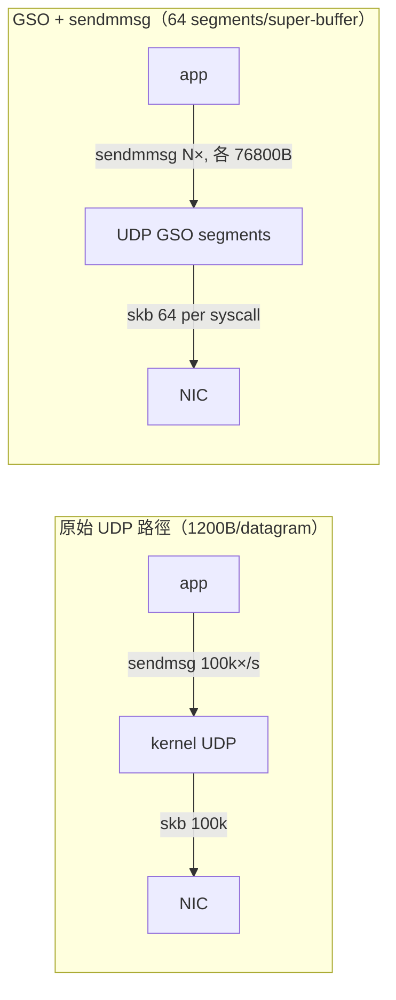

# 課堂 2.15 — UDP 高效能路徑：GSO/GRO + sendmmsg batching

## 學前知道

- **前置課**：[2.2 io_uring](./2.2-io-uring.md)、[2.3 零拷貝](./2.3-zero-copy.md)、[2.7 XDP](./2.7-xdp.md)、[2.11 TUN/TAP](./2.11-tun-tap.md)、[2.14 最終 picture](./2.14-final-picture.md)
- **預計閱讀時間**：35–45 分鐘
- **必讀規格 / commit**：
  - Linux kernel commit `bec1f6f697` "udp: generate gso with UDP_SEGMENT" (Willem de Bruijn, 2018, kernel 4.18)
  - Linux kernel commit `e20cf8d3f1f7` "udp: implement GRO for plain UDP sockets" (Paolo Abeni, 2018, kernel 5.0)
  - Linux kernel commit `4bd0d4ca8` "net: extend napi_threaded_poll" (kernel 6.x, NAPI in kthread)
  - RFC 8085 §3 — UDP usage guidelines（congestion control & pacing 對 UDP-based 協議的硬性要求）
- **必讀原始碼**：
  - `quic-go/sys/conn_linux.go`（`SetGSOSize` / `appendUDPSegmentSizeMsg`、`enableUDPGRO`）
  - `quinn-udp/src/imp_linux.rs`（`set_socket_option` 路徑、batched recvmmsg）
  - Linux `net/ipv4/udp_offload.c`（`udp_gro_receive` / `udp_gro_complete`、`udp4_ufo_fragment`）
  - Cloudflare quiche `quiche/src/recovery/mod.rs` 的 pacing rate→GSO size 換算

> **為什麼這堂單獨開**：前 14 堂把通用 I/O / packet path 走完了，但有個**對「Hysteria2 / TUIC-v5-grade speed」目標致命的盲點**——UDP 在 Linux 上要跑滿 10Gbps 必須過 UDP GSO/GRO 與 sendmmsg/recvmmsg 這道窄門。這道窄門和 TCP 的 TSO/GRO 在 API、kernel 路徑、語意上**完全不同**，網路上幾乎沒有中文資源解釋為什麼 Hysteria2 比 V2Ray 的 mKCP「快」一個數量級。本堂把這個技術窄門徹底打通。

---

## 動機

我們的研究目標是「**VLESS+REALITY 級抗審查 × Hysteria2/TUIC-v5 級速度**」。後者的速度從哪裡來？三種來源，順序很重要：

1. **協議層面**：BBR-style congestion control、0-RTT、stream multiplexing
2. **kernel I/O 層面**：UDP GSO（送）+ UDP GRO（收）+ sendmmsg/recvmmsg（批次 syscall）
3. **應用層面**：lock-free scheduler、buffer pool、NUMA-aware worker

外行人以為 #1 是主因，內行人都知道 **#2 才是分水嶺**。沒有 GSO/GRO，再好的 congestion control 也會被 syscall overhead 餵不飽。Cloudflare 在 2024 年的 quiche perf 報告裡寫得很白：「**UDP GSO 把 QUIC 從 80 MB/s 推到 2.4 GB/s（30× 提升）**」<sup>[CF-quiche-2024]</sup>。

但這件事在 macOS / Windows 上**完全沒對應物**。Linux UDP GSO 是 Linux 獨家紅利。這對「我們協議」的設計取捨有直接影響：

- **server-only 優化**：UDP GSO/GRO 在 server (Linux) 上開，client 跨平台不能假設。
- **MTU 規劃**：GSO 的 max segments 是 64、單個 super-buffer 最大 64KB，這直接決定我們 packet size 的設計空間（為什麼不能用 1500B 純 MTU、為什麼 Hysteria2 推薦 1200B）。
- **pacing**：GSO 一發 64 個 packet 出去，若應用層 pacing 沒做好會 burst 崩 buffer，這就是為什麼 Linux 從 4.20 起把 **EDT (Earliest Departure Time) model** 推進 sch_fq——應用層帶 SO_TXTIME 給 packet 標時戳，由 kernel pacing 按時戳發送。

---

## 核心概念

### 1. 為什麼 UDP 比 TCP 在 syscall 路徑上更痛

TCP 路徑上 kernel 早就有 TSO / GRO 把 syscall 攤平：應用層 `write(fd, buf, 64KB)` 一次 syscall，kernel 切成 ~43 個 1448B segment 交給 NIC。每個 packet 的 syscall cost 攤到接近零。

UDP 沒有「stream」概念，原本一個 syscall 對應一個 datagram。一個 1 Gbps UDP 串流（1200B payload）每秒約 100k packets——意味著 **每秒 100k syscalls**。一個 syscall 進出 kernel ~1μs（含 spectre mitigation 後更慘），單核就被 syscall 吃掉 10% 純 overhead。10 Gbps 就死了。

這就是為什麼 RFC 8085 提到 「UDP-based transport must take great care of efficient batched I/O」——這話在 2017 年寫的時候 Linux 還沒 UDP GSO，是個 wishful thinking；2018 之後才真正能做到。



### 2. UDP GSO：UDP_SEGMENT socket option

Linux 4.18 引入 `UDP_SEGMENT`（Willem de Bruijn）。語意：應用層 send 一塊**大** buffer（最多 64KB-1），告訴 kernel「請每 `gso_size` 字節切一個 UDP datagram，header 由你補」。

兩種開法：

```c
/* 方法 A: 永久設給 socket */
uint16_t gso_size = 1200;
setsockopt(fd, SOL_UDP, UDP_SEGMENT, &gso_size, sizeof(gso_size));
sendmsg(fd, &msg, 0);   /* msg 裡可以是 64KB，會被切成 ~54 個 1200B */

/* 方法 B: 每次 send 用 cmsg 覆蓋 */
struct cmsghdr *cm;
cm->cmsg_level = SOL_UDP;
cm->cmsg_type  = UDP_SEGMENT;
*((uint16_t *)CMSG_DATA(cm)) = gso_size;
```

**關鍵限制（一定要背）**：

| 項目 | 限制 | 出處 |
|---|---|---|
| 單個 super-buffer 上限 | 64 KB - 1（IP datagram 總長限制） | `IP_MAX_MTU` |
| 切完的 segment 數上限 | 64 | `UDP_MAX_SEGMENTS` (`include/linux/udp.h`) |
| 是否需要 checksum offload | 是，沒有 hw csum 會走慢路徑 | de Bruijn 2018 patchset |
| 最後一個 segment | 可以小於 `gso_size`（不需 pad） | `udp4_ufo_fragment` |
| 跨 NIC offload | 若 NIC 支援 USO（UDP Segmentation Offload）會直接交 NIC，否則 kernel 切後送 | `dev->features & NETIF_F_GSO_UDP_L4` |

> **常被誤解的點**：UDP GSO **不是** UFO（UDP Fragmentation Offload，已被 deprecated）。UFO 是把一個大 UDP datagram 切成 IP fragments，每個 fragment 是 IP 層的碎片，跨 NAT/firewall 災難。GSO 是切成多個**獨立完整的 UDP datagram**，每個有自己的 UDP header，**對中間設備透明**。這個差異對抗審查語境也重要：fragmented packet 過 DPI 一定異常，segmented UDP datagrams 完全正常。

### 3. UDP GRO：UDP_GRO socket option

Linux 5.0（Paolo Abeni，commit `e20cf8d3f1f7`）引入 plain UDP socket 的 GRO。語意對稱於 GSO：NIC / kernel 收到一串同 5-tuple 的 UDP datagram，**合併**成單個 skb 給 socket，應用層用一次 `recvmsg` 拿到「N 個 logical datagram 黏在一起」的 buffer，外加一個 cmsg 告訴你切點。

```c
int val = 1;
setsockopt(fd, SOL_UDP, UDP_GRO, &val, sizeof(val));   /* 一些 codebase 寫成 ENABLE_UDP_GRO */

struct msghdr msg = { ... };
ssize_t n = recvmsg(fd, &msg, 0);
/* msg.msg_control 裡會有 UDP_GRO cmsg，CMSG_DATA 是 segment size */
/* msg.msg_iov 是 N×gso_size 的大 buffer，自己切 */
```

**關鍵限制**：

- 需要 packets 同 5-tuple、同 IP options、ttl 一致、相鄰到達（NIC RX queue 上連續）。一旦中間插入別的封包，GRO 就斷開、flush 之前累積的 skb 給上層。
- GRO 合併的單位也是 64 datagrams（同 `UDP_MAX_SEGMENTS`），但實際因 timer flush 通常拿到 4~16 個。
- NIC 若支援 hw GRO（GRO_HW）效果更好；否則走 `napi_gro_receive` 的軟體路徑（仍比 per-packet 進 socket 快很多倍）。
- 從 kernel 5.10 起 IPv6 也對等支援。

### 4. sendmmsg / recvmmsg：批次 syscall

GSO 解決「一次 sendmsg 送 64 個 datagram」的問題。sendmmsg 解決的是更外層的問題：「我有 N 個 不同目的地 / 不同 5-tuple 的 datagram，能不能一次進 kernel？」

```c
struct mmsghdr msgs[BATCH];          /* BATCH 通常 16~64 */
for (i = 0; i < BATCH; i++) {
    msgs[i].msg_hdr.msg_name = &peer[i];
    msgs[i].msg_hdr.msg_iov  = &iov[i];
    msgs[i].msg_hdr.msg_iovlen = 1;
    /* 可以再帶 UDP_SEGMENT cmsg —— 兩層批次疊加 */
}
int sent = sendmmsg(fd, msgs, BATCH, 0);
```

`sendmmsg` + `UDP_SEGMENT` **兩層批次疊加**就是 Cloudflare 那篇 blog 的核心配方：

- BATCH = 16
- 每個 mmsg 帶 64 segments × 1200B = 76.8 KB
- 一次 sendmmsg syscall 送出 **16 × 64 = 1024 個 UDP packets ≈ 1.2 MB**

1 Gbps 流量原本 ~83k syscalls/sec，現在 ~100 syscalls/sec。**syscall overhead 從 10% 變 0.01%**。

Cloudflare 的測試數字（quiche 2024）：

| 配置 | 吞吐 | syscall/sec |
|---|---|---|
| sendmsg per packet | 80–90 MB/s | 904,539 |
| sendmmsg only | ~1 GB/s | 15,676 |
| sendmsg + GSO | ~1 GB/s | 18,824 |
| sendmmsg + GSO | **~2.4 GB/s** | ~1,500 |

注意：30× 提升不是「快了 30 倍」這麼簡單。它意味著**單 core 從跑不滿 100Mbps 變成跑滿 10Gbps**，整個 deployment 規模（CPU、cost、scaling）變化巨大。

### 5. EDT (Earliest Departure Time) pacing model

UDP GSO 一次吐 64 個 packet 出去會 burst。如果 NIC drop、中間路由器 drop，congestion control 馬上炸。需要 pacing。

傳統 pacing 是 `sch_fq`（fair queueing with pacing）按 sk_pacing_rate 算發送間隔。應用層完全不知情。問題：應用層（QUIC stack）有自己的 pacing model（BBR），它已經算好「下一個 packet 該何時離開」，但 syscall 進 kernel 後又被 sch_fq 二次 pacing，兩個 pacing 對齊不上。

**EDT model**（Eric Dumazet & Van Jacobson, 2018，LWN-752184<sup>[LWN-EDT-2018]</sup>）的破局思路：**packet 自帶時戳**。應用層用 `SO_TXTIME` socket option + `SCM_TXTIME` cmsg 給每個 packet 標一個未來時戳，sch_fq 按時戳排隊出隊，kernel 不做計算。

```c
/* setup */
struct sock_txtime so_txtime_val = {
    .clockid = CLOCK_TAI,
    .flags   = SOF_TXTIME_REPORT_ERRORS,
};
setsockopt(fd, SOL_SOCKET, SO_TXTIME, &so_txtime_val, sizeof(so_txtime_val));

/* per-send */
__u64 tx_time = next_pacing_deadline_ns();   /* QUIC pacer 算出來 */
cm->cmsg_level = SOL_SOCKET;
cm->cmsg_type  = SCM_TXTIME;
*((__u64 *)CMSG_DATA(cm)) = tx_time;
```

EDT + UDP GSO + sendmmsg 是 2026 年所有頂級 QUIC 實作（quiche、msquic、quinn 6.x）的標配。我們協議要打 SOTA，這條鏈不能省。

### 6. SO_REUSEPORT + RSS + BPF dispatch：多核擴展

單 socket + 單 thread 把上面這套全用了，10 Gbps 也撐不住一個 core。需要橫向 scale：N 個 worker thread 各持一個 socket，bind 到同一 UDP port，由 kernel 或 BPF 程式決定來包進哪個 socket。

**三層分發**：

1. **RSS (Receive Side Scaling)**：NIC 在硬體把封包 hash 到不同 RX queue
2. **RPS (Receive Packet Steering) / RFS (Receive Flow Steering)**：軟體版 RSS，無 RSS NIC 用
3. **SO_REUSEPORT + BPF (SO_ATTACH_REUSEPORT_EBPF)**：在 socket layer 對 incoming packet 再 hash 一次，挑選 worker

QUIC 在這裡有個**獨特問題**：連接 ID（CID）由協議決定，**不是 5-tuple**。如果 NAT 換 port，5-tuple hash 把同一個 QUIC 連線分發到不同 worker，state 就斷了。解法：用 BPF reuseport program 解析 QUIC header 的 CID，做 CID-aware 分發。

```c
/* pseudo: BPF reuseport program */
SEC("sk_reuseport")
int select_worker(struct sk_reuseport_md *reuse) {
    /* 解析 UDP payload 的 QUIC short header, 取 CID */
    u8 cid_hash = hash_cid(reuse->data + UDP_HDR_OFF, reuse->data_end);
    bpf_sk_select_reuseport(reuse, &worker_map, &cid_hash, 0);
    return SK_PASS;
}
```

> **我們協議的座標**：CID-aware reuseport BPF program 是 Proteus（我們協議）server 高並發必備。Part 11.X 設計握手時 CID 結構要對齊這個分發需求，**不能把 CID 設計成連線中變動**——這會在 worker 切換時引爆。

### 7. AF_PACKET / TPACKET_V3：DPI 對抗的測試武器

這節雖然是「對抗測試」用，但必須在這裡點，因為 Part 9 GFW research、Part 10 traffic analysis 都會用到。

`AF_PACKET` + `PACKET_MMAP` + `TPACKET_V3` 是 Linux 上最快的 user-space packet capture / inject 介面（比 libpcap default backend 快 ~10×）。Wireshark 高效模式、suricata IDS、moonsniff 都用。

我們做 evaluation（Part 12.15–17）時要用 AF_PACKET 寫 DPI mock，看 Proteus 流量在 GFW-like classifier 面前的「真實裸樣」（沒被應用層 buffer 模糊化的時序）。

```c
int fd = socket(AF_PACKET, SOCK_RAW, htons(ETH_P_ALL));
struct tpacket_req3 req = { .tp_block_size = 1<<22, .tp_block_nr = 64, ... };
setsockopt(fd, SOL_PACKET, PACKET_RX_RING, &req, sizeof(req));
void *ring = mmap(NULL, total, PROT_READ|PROT_WRITE, MAP_SHARED, fd, 0);
/* poll on fd, walk ring blocks lock-free */
```

### 8. BQL (Byte Queue Limits)：別讓 NIC TX ring 變 bufferbloat 源頭

`tc + fq_codel` 解決 qdisc 層 bufferbloat；BQL 解決**驅動 TX ring** 層 bufferbloat。NIC TX ring 通常 4096 個 descriptor，1500B MTU 下就是 6MB buffer——一個 10Gbps 鏈路上是 5ms 的隊列延遲。BQL 動態限制 driver 向 TX ring push 的 byte 數，把這個延遲拉回 ~200μs。

對我們協議：BBR 等 model-based congestion control 高度依賴 RTT 量測精度，BQL 沒開（或 driver 不支援）會讓 RTT measure 受到驅動層 buffer 污染，BBR 估算的 bottleneck bandwidth 失真。

```bash
# 看驅動是否支援 BQL
ls /sys/class/net/eth0/queues/tx-0/byte_queue_limits/
# limit  limit_max  limit_min  inflight  hold_time
```

### 9. io_uring × UDP × NAPI：2026 年最前沿

kernel 6.x 加入 `io_uring` 對 sendmmsg / recvmmsg 的原生支援（`IORING_OP_SENDMSG_ZC`、`IORING_OP_RECVMSG_MULTISHOT`），再加上 NAPI 的 busy-polling 整合（`io_uring_register_napi`），可以做到「**user-space ring 直連 NIC NAPI，零 syscall 在 hot path**」。Linux 6.9+ 已 GA，6.11 引入 `IORING_RECV_MULTISHOT` for UDP，2025–2026 是這條路徑成熟期。

但截至 2026-05，主流 QUIC 實作（quic-go、quinn、msquic）都還沒整合。為什麼？因為這需要：

1. 應用層 runtime 整合 io_uring（Go runtime 沒、Rust tokio 部分支援）
2. 放棄 cross-platform 假設（io_uring Linux only，且要 6.9+）
3. 重寫 connection state machine 適應 multishot 模型

> **我們協議的座標**：Part 11 設計階段我們**已經決定走 Rust**（見 memory）。Rust + tokio-uring + quinn fork 是可行路徑。但這是 **stretch goal**，主路徑（Part 12 first impl）仍走 sendmmsg + GSO + GRO 的「成熟組合」，io_uring NAPI 留給 Part 12.12+ 的 perf evaluation 章做對照。

---

## 與我們協議設計的關聯

對 Part 11–12 的設計影響，逐項列出：

1. **MTU 與 packet size 上限**：UDP GSO max 64 segments × max 1450B（IPv4 over typical Ethernet）= **92.8 KB super-buffer**。我們 framing 設計時，application-layer record 不能跨 super-buffer 邊界，否則 GSO batching 效益打折。建議 record size cap = 16 × MTU。

2. **pacing API contract**：congestion controller（無論用 BBR、CUBIC 還是我們自己設計的）必須輸出「下個 packet departure time（CLOCK_TAI ns）」而非「current pacing rate」。這對齊 EDT model，且能直接餵 SO_TXTIME。

3. **CID 設計**：CID 必須在連接生命週期內**對 reuseport BPF 程式可解析**且**前 N bytes 穩定**。建議 CID = `[8B routing_hash] [N B opaque_state]`，BPF 只看前 8B。

4. **server worker model**：N workers × N sockets × `SO_REUSEPORT` + CID-aware BPF dispatch。每 worker 跑自己的 event loop（io_uring 或 epoll+sendmmsg）。worker 數 ≈ NIC RX queue 數 ≈ NUMA-local CPU 數。

5. **client 跨平台不能假設 GSO**：macOS / Windows 沒有 UDP GSO 對等物。client 走「per-packet sendto」也能跑（client 流量小），但 server 必須是 Linux。這收窄了我們的 deployment model（VPS Linux 為主），與目前主流 proxy 部署實踐一致，不算限制。

6. **kernel version 假設**：server 最低要 5.0（UDP GRO）、推薦 5.10+（IPv6 對等）、進階 perf 6.9+（io_uring NAPI）。文件要寫清楚 minimum kernel。

7. **可測試性**：我們在 Part 12.11 baseline、12.12 吞吐評測 用 netem + AF_PACKET 抓的時序，**必須開 BQL 才有意義**——否則 RTT measure 失真，所有 BBR 對比都不可信。

---

## 動手（強烈建議做）

### 練習 1：量 syscall overhead

寫一個最小 UDP echo，分別用 `sendto`、`sendmmsg`、`sendmmsg + UDP_SEGMENT` 三個版本。用 `perf stat -e syscalls:sys_enter_sendto,syscalls:sys_enter_sendmmsg` 看 syscall 數，用 `iperf3 -u -b 0` 或 `oha` 灌流量，記吞吐。

預期看到（在 Linux 5.10+，10Gbps NIC）：

- `sendto`：~80–150 MB/s，syscall ~100k/s
- `sendmmsg(16)`：~600 MB/s–1 GB/s，syscall ~6k/s
- `sendmmsg(16) + UDP_SEGMENT(64×1200)`：~2–8 GB/s，syscall ~100/s

### 練習 2：開 / 關 BQL 看 RTT

在兩台 VM 用 netem 加 1ms 固定延遲，灌 iperf3 TCP，分別關閉 BQL（`echo 1 > /sys/class/net/eth0/queues/tx-0/byte_queue_limits/limit_max`）和打開（`echo max > ...`），用 `ss -ti`（tcp_info）看 srtt / minrtt 變化。

預期：關 BQL 時 srtt 漂到 5–20ms，minrtt 仍 1ms；BBR pacing rate 估算偏離 ~30%。

### 練習 3：寫一個 CID-aware reuseport BPF

用 `libbpf` 寫一個 `sk_reuseport` 程式，解析 QUIC short header（first byte high bit = 0），取後 8 byte 作 CID，hash 後 `bpf_sk_select_reuseport`。掛到 4 個 socket 的 reuseport group 上，用 `wrk2-quic` 灌流量看分發是否 sticky。

---

## 自我檢查

1. UDP GSO 和 UFO 有什麼**本質**差別？為什麼 UFO 被 deprecated？這個差別對 NAT 穿透意味著什麼？
2. 如果一個 QUIC server 在 kernel 4.15 上跑 quic-go，理論最高單核吞吐約是多少？瓶頸是哪個 syscall？
3. EDT model 把 pacing 計算從 kernel 推回 user space，這對「應用層 BBR 實作」與「kernel sch_fq 實作」之間的責任邊界產生什麼改變？
4. 為什麼 BBR 估算 bottleneck bandwidth 在沒 BQL 的 NIC 上會錯？把 BQL 看成 control system，它在閉迴路中的角色是什麼？
5. CID-aware reuseport BPF 是 QUIC 多核擴展的標準解。如果我們協議想用「stateless connection migration」，CID 結構需要對這個 BPF 程式提供什麼**穩定保證**？
6. macOS client 無 UDP GSO，是否會成為「客戶端→伺服器」上行的瓶頸？做個粗略估算（典型 client 上行 50 Mbps）。

---

## 延伸閱讀

- **Linux Kernel Networking Documentation, “Segmentation Offloads”** — <https://www.kernel.org/doc/html/latest/networking/segmentation-offloads.html>
- **Cloudflare blog, "Accelerating UDP packet transmission for QUIC"** — <https://blog.cloudflare.com/accelerating-udp-packet-transmission-for-quic/>
- **LWN, "TCP and the lower bounds of web performance"** (EDT 介紹) — <https://lwn.net/Articles/752184/>
- **Marek Majkowski, "How to receive a million packets per second"** (Cloudflare blog 2015，雖老但 SO_REUSEPORT 教科書級講解)
- **Linux commit `e20cf8d3f1f7`** — UDP GRO 實作 (Paolo Abeni)
- **Linux commit `bec1f6f697`** — UDP_SEGMENT 實作 (Willem de Bruijn)
- **Eric Dumazet, "BPF, NAPI threaded, and modern UDP"** — Netdev 0x16 talk
- **quic-go wiki: UDP Buffer Sizes** — <https://github.com/quic-go/quic-go/wiki/UDP-Buffer-Sizes>

---

## 研究級補遺

### 1. 學界詞彙

| 中文口語 | 學界標準術語 | 慣用縮寫 | 出處 |
|---|---|---|---|
| UDP 分段卸載 | UDP Segmentation Offload | USO / UDP-GSO | Linux source `NETIF_F_GSO_UDP_L4` |
| UDP 接收合併 | UDP Generic Receive Offload | UDP-GRO | LWN-789508, Abeni 2018 |
| 批次發送 | scatter-gather batched sendmsg | sendmmsg | RFC 引用 `sendmmsg(2)` man page |
| 提前出發時戳 | Earliest Departure Time | EDT | Dumazet & Jacobson, Netdev 2018 |
| 字節隊列限制 | Byte Queue Limits | BQL | Tom Herbert, 2011, `Documentation/networking/byteorder.txt` |
| 接收側擴展 | Receive Side Scaling | RSS | Microsoft RSS scalable networking |
| 軟體 RSS | Receive Packet Steering | RPS | Google patchset 2010 |
| 流向式接收 | Receive Flow Steering | RFS | Google patchset 2010 |
| 連線標識感知分發 | Connection-ID-aware load balancing | CID-aware reuseport | RFC 9308 §3.4，msquic / quiche 實踐 |

### 2. 對手分類學 / 威脅模型精化

這堂主題是 perf 不是 security，**但 perf 影響 security**——具體：

- **timing side channel**：UDP GSO 一發 64 packets，連續到達 receiver。passive on-path 攻擊者（GFW passive probe）可從 inter-packet-arrival distribution **指紋識別 GSO-batched 流量**。FlowPrint 類 ML classifier 可能利用這個。**威脅等級：medium**。對策：加入 jitter（EDT 給每個 packet 不同時戳）、隨機化 batch size。
- **active probing**：對手 inject 一個跟 5-tuple 一樣的探包進 GRO 流，可能 trigger flush。**威脅等級：low**（也影響 active probe 本身，對手不會白白製造噪音）。

> 詳細的 traffic-feature 對抗在 Part 10.X、Part 11.7 處理；本堂只埋伏筆。

### 3. 形式化定義

`SO_TXTIME` 對應的 pacing model 是：

```
∀ packet pᵢ: actual_tx_time(pᵢ) ≥ scheduled_tx_time(pᵢ)
∀ packet pᵢ, pᵢ₊₁: actual_tx_time(pᵢ₊₁) - actual_tx_time(pᵢ) ≈ scheduled_tx_time(pᵢ₊₁) - scheduled_tx_time(pᵢ)
```

在 kernel sch_fq 提供的 SLA 下，"≈" 的誤差界是 ~10μs（高負載下）/ ~1μs（低負載）。BBR-like CC 設計時這個誤差要納入控制律。

### 4. 領域的關鍵論文 / 規格 / 原始碼

| 來源 | 為什麼追 | 之後在哪精讀 |
|---|---|---|
| [LWN-EDT-2018] EDT model intro | pacing 範式轉移的關鍵文件 | Part 8.6 QUIC pacing |
| [CF-quiche-2024] Cloudflare blog "accelerating UDP for QUIC" | 唯一公開的量化證據 | Part 12.11 baseline |
| Linux commit `bec1f6f697` Willem de Bruijn | UDP GSO 第一手 | Part 12.3 dataplane impl |
| Linux commit `e20cf8d3f1f7` Paolo Abeni | UDP GRO 第一手 | Part 12.3 dataplane impl |
| RFC 9308 "applicability of QUIC" §3.4 | CID-aware LB 規範 | Part 11.5 CID design |
| msquic `src/platform/datapath_epoll.c` | 微軟做的 production-grade UDP GSO/GRO 使用範例 | Part 8.X msquic 解剖 |
| quic-go `sys/conn_linux.go` | Go 生態的同類事 | Part 8.X quic-go 解剖 |
| quinn `quinn-udp/src/imp_linux.rs` | Rust 生態的同類事，且最接近我們會 fork 的 base | Part 12.3 |
| io_uring NAPI doc (`Documentation/networking/io_uring.rst`) | 下一代路徑 | Part 12.12 stretch perf |

### 5. 我們協議的座標 / 設計取捨

在 Proteus 設計空間（Part 11 將完整繪製）中，本堂收窄了以下選擇：

| 維度 | 本堂前的設計空間 | 本堂後 |
|---|---|---|
| transport | TCP/UDP/raw IP | **UDP only**（要繼承 GSO/GRO 紅利） |
| MTU 策略 | 1500 / 1400 / 1200 / dynamic PMTUD | **靜態 1200 推薦、可配** |
| pacing 責任 | kernel / app / 雙 | **app（EDT）** |
| CID 結構 | 完全 opaque / 部分 routing-aware | **前 8B routing-aware，後段 opaque** |
| server worker model | thread-per-conn / event-loop / async | **N event-loops + CID-aware reuseport BPF** |
| server OS 假設 | cross-platform | **Linux 5.10+ required** |
| io_uring 路徑 | 必須 / 可選 / 不用 | **可選，stretch goal in Part 12.12** |

### 6. 必追資源 / 社群入口

- **netdev mailing list**：`netdev@vger.kernel.org`，UDP/QUIC offload 補丁第一手
- **Linux Plumbers Conf "Networking Track"**：每年一次，pacing/offload 重要進展首發
- **Eric Dumazet 個人 patchset**：他是 Google 派駐 kernel networking 的主力，幾乎所有 sch_fq/pacing/EDT 都他寫的
- **Willem de Bruijn 個人 talks**：UDP GSO/GRO 主要 author
- **quic-go #1531 / quinn #1454 / msquic discussions**：每次有 UDP offload 新 commit 都會引爆 PR 討論，是看「為什麼要這樣 design」的最佳場所

### 7. 開放問題（research-level）

1. **GSO + EDT 在 burst-loss link 上的表現**：當 64 個 packet 一發出去碰到 link burst loss（典型 5G mmWave），ack 收回來 jittery，BBR 估算嚴重失真。能否在應用層加 in-band ack pacing 補償？這可能是個 USENIX-able point。
2. **CID-aware BPF dispatch 的隱蔽性**：當 server 開 reuseport BPF 程式，對外部 adversary 通過某些觸發手段（例如 invalid CID flood）可能可以**指紋這個 server 在跑某種 BPF 程式**。形式化證明 BPF dispatch 不外洩 server-side state 是個有趣方向。
3. **io_uring NAPI for proxy**：QUIC + io_uring multishot recv 在「同時跑數萬條連線」場景的 fairness 仍未充分研究。proxy server 是天然測試床。
4. **可信時間源 vs SO_TXTIME**：EDT 用 CLOCK_TAI 給未來時戳，但 VPS 上 CLOCK_TAI 漂移可能達到 ms 級。能否設計一個 "relative EDT"（基於 packet 接收 RTT 算）來避免依賴系統時鐘？

---

### 引用記號

- **[CF-quiche-2024]** Cloudflare Engineering, "Accelerating UDP packet transmission for QUIC", 2024.
- **[LWN-EDT-2018]** Jonathan Corbet, "TCP and the lower bounds of web performance", LWN.net Article 752184, 2018-04. (Eric Dumazet & Van Jacobson 的 EDT 模型介紹)
- **[Abeni-UDP-GRO-2018]** Linux kernel commit `e20cf8d3f1f7` "udp: implement GRO for plain UDP sockets", Paolo Abeni, 2018 (merged in 5.0).
- **[deBruijn-UDP-GSO-2018]** Linux kernel commit `bec1f6f697` "udp: generate gso with UDP_SEGMENT", Willem de Bruijn, 2018 (merged in 4.18).
- **RFC 8085** — Eggert, Fairhurst, Shepherd, "UDP Usage Guidelines", March 2017.
- **RFC 9308** — Kühlewind, Trammell, "Applicability of the QUIC Transport Protocol", September 2022.
