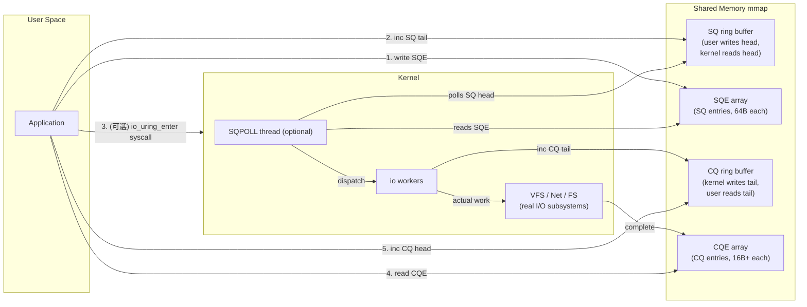

# 課堂 2.2 — io_uring：把 syscall 模型整個重寫

## 學前知道

- **前置課**：
  - [2.1 select→epoll 演化](./2.1-select-poll-epoll.md)（理解 readiness 模型的極限）
  - [1.1 分層的真實意義](../part-1-networking/1.1-layering-truth.md)
- **預計閱讀時間**：80~100 分鐘
- **必讀文獻**：
  - **Axboe — Efficient IO with io_uring** (kernel.dk white paper, 2019) ⭐⭐ — io_uring 設計者 Jens Axboe 親寫的官方介紹。已抓到 `assets/papers/kernel-2019-io-uring.pdf`，精讀見 `notes/papers/axboe-io-uring-2019.md`
  - **Didona, Pucher, Schintke — The State of the Art and the Limitations of io_uring** (arXiv 2024) — 2024 對 io_uring 效能、安全、API 演化的綜述。系統頂會風格
  - **LWN 系列文** — Jonathan Corbet 自 2019 起每次 io_uring 重要改動的深度報導，連結見「延伸閱讀」
  - **Han et al. — MegaPipe: A New Programming Interface for Scalable Network I/O** (OSDI 2012) — io_uring 的精神前身，已抓到 `assets/papers/osdi-2012-han-megapipe.pdf`
- **必讀原始碼**：
  - Linux `io_uring/io_uring.c`（主檔，6.6+ 已從 `fs/io_uring.c` 拆出獨立子目錄 `io_uring/`）
  - `io_uring/sqpoll.c`：SQPOLL kernel thread
  - `io_uring/rw.c`、`io_uring/net.c`、`io_uring/poll.c`：各 opcode 實作
  - `include/linux/io_uring_types.h`：核心 struct（`io_ring_ctx`、`io_kiocb` 等）
  - `include/uapi/linux/io_uring.h`：user/kernel ABI
  - liburing：https://github.com/axboe/liburing — user-space wrapper 函式庫

---

## 動機

> 為什麼學會 epoll 不夠

回到 [2.1 §1 的問題定義](./2.1-select-poll-epoll.md#1-問題定義fd-readiness-通知)：epoll 解的是「**fd readiness 通知**」。但 server 真正要做的工作流程是：

```
epoll_wait() → 知道 socket fd N 可讀
read(N, ...) → 真正讀資料
process(...)
write(M, ...) → 真正寫回給 client
epoll_wait() → 等下一輪
```

**注意每一個 read / write 都是一個 syscall。** 一個 RTT 至少 2 個 syscall（read + write）。在 1Gbps 線速、平均 packet 1500B 的負載下：

- 約 80K pps（packet per second）
- 對應 ~80K syscall/s 進 kernel
- 每次 syscall 進/出 ~250ns（Meltdown/Spectre KPTI 後更慘）
- ⇒ **20% CPU 純粹花在 syscall 邊界**，還沒做任何實質工作

到 10Gbps、1.5M pps 時這個比例變成 200%——**syscall 本身就是瓶頸**。

過去解這問題的方法有兩條路：

1. **批次 syscall**：`sendmmsg() / recvmmsg()`（複數包一次發），`splice()`（pipe 內 zero-copy 搬運）。各種 helper 函式，但是**每個都是一個 syscall**，沒有統一的批次抽象
2. **bypass kernel**：DPDK、XDP（後面 2.7/2.8 講）。但這要犧牲 kernel 的所有便利（路由、防火牆、protocol stack）

io_uring 走的是**第三條路**：**重新設計 user/kernel I/O ABI**，讓 user 提交意圖、kernel 完成、結果回傳，全程 **0 個 syscall 是可能的**。

對 G6 的具體相關性：

- 我們要 1M qps echo / 10K+ 並發 connection / sub-100μs P99 latency。在 2026，這個級別 server **不用 io_uring 就達不到**——除非走 DPDK，但 DPDK 對小公司 deploy 太重
- io_uring 不是「epoll 的 incremental 改進」，是**模型替換**。讀完本堂你要能說出「為什麼 io_uring 跟 epoll 在哲學上正交」
- io_uring 仍然新且 **CVE 多**（2020-2024 已有 ~20 個 CVE，多家雲商 disable io_uring 是 default policy）。我們要評估 G6 是否「值得」用 io_uring，這個 trade-off 是真實的

---

## 核心概念

### 1. 兩個模型：readiness vs completion

| 維度 | readiness（epoll） | completion（io_uring / IOCP） |
|---|---|---|
| 提交方式 | 註冊「我關心 fd X 的事件」 | 提交「給我做 X 這件事」 |
| 通知內容 | 「X 現在 ready」 | 「X 你要的事做完了，結果 Y」 |
| 資料路徑 | user 自己 syscall recv/send | kernel 已經把資料放好/拿走 |
| 每事件 syscall 數 | ≥1（讀本身就要 syscall） | 0~1（提交 + 收完成都用 ring） |
| API 數量 | 少（4-5 個 syscall） | 多（每種 op 都要支援） |
| 適合場景 | 通用、debug 友善 | 高吞吐、低延遲、批次 |

io_uring 的 IOCP 親戚 (Windows) 在 1997 年就出現，但 IOCP 設計上有不少缺陷（per-fd ↔ per-port 綁定僵硬、無法批次 submit 等）。io_uring 是 **2019 年 completion model 的乾淨重做**。

### 2. io_uring 三個 ring：SQ / CQ / SQPOLL



關鍵設計：

- **兩塊 ring buffer**（SQ、CQ）都是 `mmap` 到 user / kernel **共享記憶體**，**不經 syscall** 就能讀寫。Producer 寫 tail，consumer 讀 head；用 `WRITE_ONCE / READ_ONCE` + memory barrier 同步
- **SQE / CQE 是 fixed-size struct**，64 byte / 16 byte（後者可擴展為 32 byte CQE32）。array index 用 ring buffer 裡的 sequence number
- **submit 流程**：
  1. user 寫 SQE 到 `sqes[tail]`
  2. user `WRITE_ONCE(sq_ring.tail, new_tail)`
  3. user 視情況決定要不要 `io_uring_enter()` syscall 喚醒 kernel
- **completion 流程**：
  1. kernel 寫 CQE 到 `cqes[tail]`
  2. kernel `WRITE_ONCE(cq_ring.tail, new_tail)`
  3. user `READ_ONCE(cq_ring.tail)` 看有沒有新 completion；有就消耗

#### `IORING_SETUP_SQPOLL`：完全免 syscall 的提交

```c
struct io_uring_params p = { .flags = IORING_SETUP_SQPOLL, .sq_thread_idle = 1000 /*ms*/ };
int ring_fd = io_uring_setup(256, &p);
```

kernel 會建一個 **核心執行緒**（`sqpoll`）不停 poll SQ tail。**user 提交時只需更新 tail，連 syscall 都不用**。idle 時間到了 kernel thread 進 sleep，user 必須 `io_uring_enter()` 喚醒——但這是 burst 邊緣的事，hot path 仍 0 syscall。

代價：**1 個 CPU core 100% 給 sqpoll thread**。在低負載 server 上是浪費，在 1M qps server 上是 trade。常用 trick：把 sqpoll 跟 NIC IRQ pin 在同一 NUMA node 同一個 core。

#### CQ ring 的 spinning 等模式

對應地，user 拿 completion 也可以 spin：

```c
while (1) {
    if (io_uring_peek_cqe(ring, &cqe) == 0) {
        // 有完成
        consume(cqe);
        io_uring_cqe_seen(ring, cqe);
    }
    // 沒有就 busy poll 或讓 task 退讓
}
```

或阻塞模式：`io_uring_wait_cqe()` 內部 `io_uring_enter(... GETEVENTS ...)`，會在 CQ 為空時 schedule()。

### 3. SQE 結構：通用 opcode 容器

```c
// include/uapi/linux/io_uring.h（節錄、簡化）
struct io_uring_sqe {
    __u8  opcode;     // IORING_OP_READ / WRITE / RECVMSG / SENDMSG / ACCEPT / CONNECT / TIMEOUT / ...
    __u8  flags;      // IOSQE_*: FIXED_FILE / IO_LINK / IO_HARDLINK / ASYNC / BUFFER_SELECT / ...
    __u16 ioprio;
    __s32 fd;         // 哪個 fd（IOSQE_FIXED_FILE 時是 registered table index）
    union {
        __u64 off;        // file offset
        __u64 addr2;      // 某些 op 第二位址
    };
    union {
        __u64 addr;       // user buffer 位址
        __u64 splice_off_in;
    };
    __u32 len;        // buffer 長度
    union {
        __u32 msg_flags;       // recvmsg/sendmsg flags
        __u32 timeout_flags;
        __u32 accept_flags;
        __u32 poll_events;
        // ... 每個 op 自己的 flags
    };
    __u64 user_data;  // user 自由使用：completion 時原樣返回（通常塞 ptr / req id）
    union {
        struct { __u16 buf_index; /* IOSQE_BUFFER_SELECT 用 */ ... };
        __u64 __pad2[3];
    };
};
```

注意 64 byte：**故意對齊 cache line**。`user_data` 是 user / kernel 唯一不解讀的欄位，習慣塞「指向 user-side state 的 pointer」或「整數 request ID」。

CQE 反向：

```c
struct io_uring_cqe {
    __u64 user_data;   // 原樣回傳 SQE 的 user_data
    __s32 res;         // 操作返回值（正數=成功，負數=-errno）
    __u32 flags;       // IORING_CQE_F_*: BUFFER / MORE / SOCK_NONEMPTY / ...
    // CQE32 額外 16 byte
};
```

`res` 對 `recv` 是「讀到幾 byte」、對 `accept` 是新 fd、對 `connect` 是 0 / -errno、對 `timeout` 是 0 / -ETIME，依 opcode 而異。

### 4. opcodes 全景（截至 Linux 6.6+）

按用途分組（不完整列表，~50 個）：

**File I/O**：
`OPENAT`、`OPENAT2`、`CLOSE`、`READ`、`WRITE`、`READV`、`WRITEV`、`FSYNC`、`FALLOCATE`、`STATX`、`RENAMEAT`、`UNLINKAT`、`MKDIRAT`、`SYMLINKAT`、`LINKAT`

**Networking**：
`ACCEPT`、`CONNECT`、`SEND`、`SENDMSG`、`RECV`、`RECVMSG`、`SHUTDOWN`、`SOCKET`（6.7+ 直接 ring 內 socket()）、`SENDMSG_ZC`、`SEND_ZC`（zero-copy 系列）

**Synchronization / Control**：
`NOP`、`TIMEOUT`、`TIMEOUT_REMOVE`、`LINK_TIMEOUT`、`POLL_ADD`、`POLL_REMOVE`、`POLL_UPDATE`、`ASYNC_CANCEL`、`FILES_UPDATE`、`PROVIDE_BUFFERS`、`REMOVE_BUFFERS`

**Buffer / xattr / 進階**：
`SPLICE`、`TEE`、`MADVISE`、`FADVISE`、`EPOLL_CTL`（在 ring 內呼叫 epoll_ctl！）、`URING_CMD`（passthrough，特定 driver 自訂 op）

⭐ **觀念**：io_uring **不是替代 epoll**，它是替代「**所有阻塞 / 非阻塞 syscall**」。連 `epoll_ctl` 都能塞進 ring。理想 server hot path 完全在 ring 上跑。

#### IO_LINK：序列化的 op chain

```c
sqe1 = io_uring_get_sqe(ring);
io_uring_prep_recv(sqe1, sock, buf, len, 0);
sqe1->flags |= IOSQE_IO_LINK;       // 下一個 SQE 必須等這個完成才執行

sqe2 = io_uring_get_sqe(ring);
io_uring_prep_send(sqe2, sock, buf, len, 0);
// 如果 sqe1 失敗，sqe2 自動取消，CQE 帶 -ECANCELED
```

**用途**：proxy 的「recv from peer A → send to peer B」可以用 IO_LINK 串成 1 個提交、0 syscall。**整條轉發 chain 在 kernel 完成**。但 chain 內某環失敗會整鏈取消，要 design accordingly。

#### MULTISHOT：一次 submit 持續產生 CQE

普通 op：一個 SQE → 一個 CQE → 結束。  
多發模式（multishot）：一個 SQE → kernel 持續產生 CQE，直到取消或錯誤。

```c
sqe = io_uring_get_sqe(ring);
io_uring_prep_multishot_accept(sqe, listen_fd, NULL, NULL, 0);
// 之後每次有新連線就會有一個 CQE，flags 帶 IORING_CQE_F_MORE
```

支援 multishot 的 op：`ACCEPT`（5.19+）、`RECV`（6.0+）、`RECVMSG`（6.0+）、`POLL_ADD`（5.13+）、`READ`（6.7+）。

⭐ **對 G6**：listen socket 的 accept loop 一條 multishot SQE 解決，server hot path 上 SQE 提交頻率大幅下降。

### 5. registered files / buffers：移除 fd lookup 與 page pinning 成本

每個 syscall 進 kernel 後第一件事是 `fdget(fd)`：拿 `current->files` table，atomic_inc refcount，回 `file*`。這在 hot path 是 cache miss + atomic 開銷。

`IORING_REGISTER_FILES`：

```c
int fds[1024] = { sock0, sock1, ... };
io_uring_register_files(ring, fds, 1024);
// 之後 SQE 用 IOSQE_FIXED_FILE flag，sqe->fd 是 registered table index
```

Kernel 把 file* 預先拿好放 ring 自己的 table。每個 op 用 index lookup，**無 fdget atomic**。

`IORING_REGISTER_BUFFERS`：

```c
struct iovec iov[N] = { { buf0, len0 }, ... };
io_uring_register_buffers(ring, iov, N);
// SQE 用 IOSQE_FIXED_BUFFER + buf_index
```

Kernel 把 user buffer **預先 pin 進 kernel address space**（`get_user_pages_fast` 一次），之後 I/O 不必每次 map。**對 small buffer + 高頻 I/O 提升 10-20%**。

代價：user 必須保證 buffer 生命週期長於 ring，且 buffer 數量有上限（預設 32K，可調）。

#### Ring 內的 buffer ring (IORING_OP_PROVIDE_BUFFERS / RING_BUFFER)

**問題**：對 `recv()`，user 必須在提交時就指定 buffer。如果連線多但每條都 idle，預先給每條提交一個 buffer 是浪費。

**解法 (5.7+)**：`PROVIDE_BUFFERS` op 把一批 buffer 註冊成 pool。`recv` 提交時用 `IOSQE_BUFFER_SELECT`，**kernel 在實際有資料時才從 pool 拿一個**。

**進化 (5.19+)**：`io_uring_register_buf_ring()` 直接 mmap 一個 ring buffer 給 buffer 供應，user / kernel **無 syscall** 補充 buffer。Cloudflare、TigerBeetle、AWS s2n-quic 都重度用這個。

⭐ **這基本上把「user-space buffer pool」搬到 kernel-user 共享，是 io_uring 6.x 系列最重要的 zero-copy 工具**。

### 6. 零拷貝送：`SEND_ZC` / `SENDMSG_ZC`

```c
sqe = io_uring_get_sqe(ring);
io_uring_prep_send_zc(sqe, sock, buf, len, flags, 0);
```

跟普通 `SEND` 不同點：

- kernel **不 copy** user buffer 到 socket send buffer，而是直接把 user page 加 ref 後 attach 給 skb
- user 拿到的 **CQE 有兩個**：
  - 第一個（`IORING_CQE_F_MORE`）：表示「kernel 已收到」
  - 第二個：表示「資料已實際送出 + page ref 釋放」
- user **不能在拿到第二個 CQE 前重用該 buffer**

Trade-off：

- Setup 成本高（page ref + 兩次 CQE），**小 buffer (<10KB) 通常比普通 copy 更慢**
- 大 buffer (>16KB) 才賺，且依賴 NIC 支援 SG (scatter-gather) DMA
- 跟 `MSG_ZEROCOPY` 等價但走 ring path（普通 `MSG_ZEROCOPY` 的 completion 由 `recvmsg(MSG_ERRQUEUE)` 拿，超不直覺）

對 G6：**主要送大 buffer 才開 SEND_ZC**。一般 control message 用普通 SEND。

### 7. 安全性：io_uring 的 CVE 史與雲廠商禁用

io_uring 是 **2026 主機安全攻防的熱點**。截至 2024Q4：

- 2020-2024 共 ~20 個公開 CVE，多數是 UAF / OOB write
- 2023 起 io_uring 成為 [Linux container escape](https://github.com/google/security-research/security/advisories) 常見載體
- **Google ChromeOS**：seccomp 強制 disable io_uring
- **Cloud Hypervisor / Firecracker**：guest kernel 預設 disable
- **Ubuntu 23.10+ / Debian 12+**：對未授信進程 `io_uring_disabled=2` 預設值
- **Kubernetes**：許多 prod cluster 透過 PSP / seccomp profile 禁用

原因：io_uring 引入了**大量新 attack surface**，每個 opcode 都是潛在 bug 源。`io-wq` worker thread 的 credential 處理、async work 的 lifetime 都是 LSM hook 不易覆蓋的點。

**G6 部署考量**：

- 我們 server 端可以開（但要 audit kernel 版本、追 CVE）
- 但**不能假設所有客戶機都能開**——客戶端要有 epoll fallback 路徑
- 文件要明確列出「需要 kernel ≥ 5.19 且未被 sysadmin 鎖死」，這對某些受管 VPS 是真實限制

#### `IORING_SETUP_DEFER_TASKRUN` + `SINGLE_ISSUER`（6.1+）

io_uring 5.x 預設用 `io-wq` thread pool 跑 async work。每個 worker thread 有獨立 credential 繼承，**這是 sandbox escape 主要載體**。

6.1+ 引入 `DEFER_TASKRUN`：所有 async work 在 **issuer 自己的 task context** 跑，不用 io-wq。配 `SINGLE_ISSUER`（保證只有一個 thread 用這個 ring）就能完全避開 io-wq。

對效能也好：少 context switch、credential cache 命中、CPU affinity 自然。**G6 server hot ring 應該都開這兩個 flag**。

### 8. 跟 epoll 整合：`IORING_OP_POLL_ADD` 與 `EPOLL_CTL`

新代碼大可全 io_uring，但很多 library / 第三方仍在 epoll 模型上。橋接方法：

#### 方法 A：epoll 進 io_uring

`IORING_OP_EPOLL_CTL`：把 `epoll_ctl()` 塞進 SQE。但 `epoll_wait` 沒有對應 op——所以仍需 epoll fd 本身被 poll。

#### 方法 B：用 IORING_OP_POLL_ADD 替代 epoll

```c
sqe = io_uring_get_sqe(ring);
io_uring_prep_poll_multishot(sqe, fd, POLLIN);
// 之後 fd 每次 readable 都有一個 CQE
```

效果跟 epoll(ET) 類似，但 fd 統一在 ring 上消費。

#### 方法 C：epoll wait 跟 io_uring wait 都 wait 一個 eventfd

讓兩種 API 用一個 wakeup channel。Tokio、libuv 都用過類似 trick 過渡。

**G6 設計選擇**：在 Rust 生態用 [`tokio-uring`](https://github.com/tokio-rs/tokio-uring) 或 [`compio`](https://github.com/compio-rs/compio) crate，把 io_uring 抽象在 runtime 層。client 退 mio (epoll/kqueue)，**transport 層走 trait `AsyncRead/AsyncWrite`** 統一 API。

### 9. 性能：io_uring vs epoll 真實數字

引用 Axboe 2019 white paper + 2023-2024 LWN 多次實測：

| 工作負載 | epoll + syscall | io_uring | 提升 |
|---|---|---|---|
| 4KB random read (storage) | ~370K IOPS / core | ~1.7M IOPS / core | ~4.5× |
| Echo server, 1KB msg, 100 conn | ~280K msg/s/core | ~520K msg/s/core | ~1.8× |
| Echo server, 1KB msg, 10K conn | ~120K msg/s/core | ~400K msg/s/core | ~3.3× |
| HTTP 1K req/s tail latency P99 | 600μs | 180μs | -70% |

具體數字依 kernel 版本、CPU、NIC 變動很大，但**趨勢一致**：

- 低並發、小 buffer：io_uring 略好或持平
- 高並發、大 buffer、storage IO：io_uring **顯著好**
- 高 syscall density (大量 small op)：io_uring **巨幅好**

「**4.5× IOPS**」這個數字是 Axboe 在 Optane SSD 上 benchmark 的，網路情境通常 2-3× 為 typical。

### 10. liburing：唯一推薦的 user-space wrapper

直接呼 `io_uring_setup / enter / register` 太底層。Jens Axboe 維護 **liburing**：

```c
#include <liburing.h>

struct io_uring ring;
io_uring_queue_init(256, &ring, IORING_SETUP_SQPOLL);

struct io_uring_sqe *sqe = io_uring_get_sqe(&ring);
io_uring_prep_recv(sqe, sock, buf, sizeof(buf), 0);
sqe->user_data = (u64)my_ctx;
io_uring_submit(&ring);

struct io_uring_cqe *cqe;
io_uring_wait_cqe(&ring, &cqe);
my_ctx_t *ctx = (my_ctx_t *)cqe->user_data;
process(ctx, cqe->res);
io_uring_cqe_seen(&ring, cqe);
```

`io_uring_submit()` 內部判斷是否需要 `io_uring_enter()` syscall（SQPOLL 模式下不必）。

**Rust 生態**：[`io-uring`](https://crates.io/crates/io-uring) crate (低階)、[`tokio-uring`](https://crates.io/crates/tokio-uring)、[`compio`](https://crates.io/crates/compio)、[`monoio`](https://github.com/bytedance/monoio)（字節跳動的 thread-per-core runtime，**設計專為 io_uring**）。**G6 候選 runtime 評估**會在 Part 12 做。

### 11. 真實案例：誰在用 io_uring

| 系統 | 用途 | 公開資料 |
|---|---|---|
| **TigerBeetle** | 金融 ledger 資料庫，全 io_uring | https://tigerbeetle.com |
| **AWS s2n-quic** | QUIC 實作的 Linux 高效能 path | https://github.com/aws/s2n-quic |
| **Cloudflare quiche** | QUIC，部分模組用 io_uring | https://github.com/cloudflare/quiche |
| **RocksDB / Ceph BlueStore** | 磁碟 IO 加速 | RocksDB 自 6.13 起 |
| **PostgreSQL 17+** | WAL / async IO | 2024 patch series |
| **systemd-resolved**、**fwupd** | 各種 daemon 漸進採用 | LWN 2023-2024 |

**proxy / VPN 領域**：Hysteria2 沒用、TUIC 沒用、sing-box 沒用、Xray 沒用——**因為大家用 Go，Go runtime 沒整合 io_uring**。  
這對 G6 是個機會點：如果用 Rust + monoio，比 Go 寫的 V2Ray/Xray 系列在純 IO throughput 上**理論上能 2-3 倍**。

---

## 與我們協議設計的關聯

1. **Server runtime 選型**：基於 io_uring 的 Rust runtime（monoio / compio / tokio-uring）。**這是把 G6 push 到 1M qps 的關鍵單一決策**
2. **proxy 轉發 chain**：`recv(client) → process → send(upstream)` 用 `IO_LINK` 串成 1 個 SQE。但 process 階段如果要解密/加密（會發生在 user-space），鏈會斷——design 必須權衡「user-space crypto」vs「kTLS 整合進 ring」(2.4 講)
3. **listen socket multishot accept**：1 個 SQE 處理所有新連線
4. **buffer ring**：per-CPU buffer pool 用 `io_uring_register_buf_ring`，client 連線數彈性
5. **fallback path**：所有用 io_uring 的地方必須有 mio (epoll/kqueue) 對應 fallback，因為 macOS / 受限 Linux 不能用 io_uring
6. **安全 / 部署文件**：明確列「需 kernel ≥ 5.19、`/proc/sys/kernel/io_uring_disabled` ≠ 2」，並提供「conservative mode = 不用 io_uring」設定
7. **不在 client 默認用 io_uring**：client 邊延遲收益小、安全 surface 不值得。client 走 mio (epoll/kqueue)

---

## 動手

### 實驗 A：5 行 liburing 寫一個 echo server，量吞吐

```bash
brew install liburing-dev   # Linux only，macOS 沒有
# 或 ubuntu: apt-get install liburing-dev
```

```c
// echo_uring.c
#include <liburing.h>
#include <sys/socket.h>
#include <netinet/in.h>
#include <string.h>
#include <stdio.h>

#define BACKLOG 1024
#define BUF_SZ  4096

int main() {
    int sfd = socket(AF_INET, SOCK_STREAM, 0);
    int one = 1; setsockopt(sfd, SOL_SOCKET, SO_REUSEPORT, &one, sizeof(one));
    struct sockaddr_in sa = { .sin_family = AF_INET, .sin_port = htons(8080) };
    bind(sfd, (struct sockaddr *)&sa, sizeof(sa));
    listen(sfd, BACKLOG);

    struct io_uring ring;
    io_uring_queue_init(4096, &ring, 0);   // 先別開 SQPOLL，方便 debug

    struct io_uring_sqe *sqe = io_uring_get_sqe(&ring);
    io_uring_prep_multishot_accept(sqe, sfd, NULL, NULL, 0);
    sqe->user_data = 0;   // 0 = accept event
    io_uring_submit(&ring);

    char bufs[BACKLOG][BUF_SZ];
    while (1) {
        struct io_uring_cqe *cqe;
        io_uring_wait_cqe(&ring, &cqe);
        if (cqe->user_data == 0) {
            // 新 connection: cqe->res 是新 fd
            int cfd = cqe->res;
            struct io_uring_sqe *r = io_uring_get_sqe(&ring);
            io_uring_prep_recv(r, cfd, bufs[cfd % BACKLOG], BUF_SZ, 0);
            r->user_data = (uint64_t)cfd | (1ULL<<63);   // tag = recv
            io_uring_submit(&ring);
        } else if (cqe->user_data & (1ULL<<63)) {
            int cfd = cqe->user_data & ~(1ULL<<63);
            int n = cqe->res;
            if (n <= 0) { close(cfd); }
            else {
                struct io_uring_sqe *s = io_uring_get_sqe(&ring);
                io_uring_prep_send(s, cfd, bufs[cfd % BACKLOG], n, 0);
                s->user_data = cfd;   // tag = send
                io_uring_submit(&ring);
            }
        } else {
            // send 完成
            int cfd = cqe->user_data;
            struct io_uring_sqe *r = io_uring_get_sqe(&ring);
            io_uring_prep_recv(r, cfd, bufs[cfd % BACKLOG], BUF_SZ, 0);
            r->user_data = (uint64_t)cfd | (1ULL<<63);
            io_uring_submit(&ring);
        }
        io_uring_cqe_seen(&ring, cqe);
    }
}
```

編譯：`gcc echo_uring.c -luring -o echo_uring`  
用 `wrk -t 4 -c 1000 -d 30s http://localhost:8080` 或 `tcpkali` 測。對比一個用 epoll 寫的版本。

### 實驗 B：strace 看是否有 syscall

```bash
strace -p $(pgrep echo_uring) -c -e trace=all
```

預期：**幾乎沒有 syscall**（只看到偶爾的 `io_uring_enter`，sqpoll 模式下連這個都沒）。對比 epoll 版本：每事件都看到 `recv` / `send` / `epoll_wait`。

### 實驗 C：對比 IO_LINK 與分開 submit

寫兩個版本的 echo：

- A：recv CQE → submit send → send CQE → submit recv
- B：用 IO_LINK 把 recv + send 串成一個 chain（pipeline pre-emptive）

量 P50 / P99 latency 差異。預期 B 在 small msg 上 P99 顯著低。

### 實驗 D：開啟/關閉 `IORING_SETUP_DEFER_TASKRUN`，量 CPU 利用率

`perf top -p $(pgrep echo_uring)` 看 kernel 函式分布。預期：

- 沒 DEFER_TASKRUN：能看到 `io_wq_*` 系列函式
- 有 DEFER_TASKRUN + SINGLE_ISSUER：`io_wq_*` 幾乎消失

---

## 自我檢查

1. SQ ring tail 是誰更新、CQ ring tail 是誰更新？head 呢？為什麼這個方向選擇能讓 user/kernel **不用鎖**就同步？
2. `IOSQE_IO_LINK` 鏈中一環失敗時，後面所有環的 CQE 帶什麼錯誤碼？這對 proxy 轉發迴圈意味著什麼錯誤處理 pattern？
3. 為什麼 `SEND_ZC` 會產生兩個 CQE？對 user-space buffer pool 管理有什麼直接影響？
4. `IORING_SETUP_SQPOLL` 燒 1 個 core，什麼情境下這個 trade-off 不值？什麼情境必須開？
5. `IORING_OP_POLL_ADD` 跟 epoll(ET) 在語意上有差異嗎？什麼情境下兩者不可互換？
6. 為什麼 io_uring 有那麼多 CVE，而 epoll 30 年只有零星幾個？（提示：state machine 複雜度、async work credential lifetime、ring 跟 fd table 的 racing）
7. `IORING_REGISTER_BUFFERS` 對 small buffer (256B) 高頻 send 為何反而可能更慢？（提示：pinned page setup cost、TLB shootdown on unmap）
8. 寫一個 G6 server 主迴圈的 pseudo code：multishot accept、per-conn recv→encrypt→send chain、shared buffer ring、SQPOLL + DEFER_TASKRUN + SINGLE_ISSUER

---

## 延伸閱讀

- **Lord of the io_uring 入門書**：https://unixism.net/loti/ — 最系統的 liburing 教學
- **LWN 系列**：
  - https://lwn.net/Articles/776703/（2019 io_uring 首發）
  - https://lwn.net/Articles/810414/（registered fds）
  - https://lwn.net/Articles/887684/（buffer rings）
  - https://lwn.net/Articles/879724/（multishot accept）
  - https://lwn.net/Articles/892311/（io_uring 安全議題綜述）
- **Axboe 的 lkml patch series**：在 https://lore.kernel.org/io-uring/ 看一手討論
- **`man io_uring(7)`、`man io_uring_setup(2)`、`man io_uring_enter(2)`** — 是 manpages 但 Axboe 自己維護，極準
- **monoio thread-per-core architecture**：https://github.com/bytedance/monoio/blob/master/docs/zh/thread-per-core.md — Rust + io_uring 設計範例
- **TigerBeetle 講 io_uring 為何救了他們的演講**：https://www.youtube.com/watch?v=ennuFNKzNNI

---

## 研究級補遺

### 1. 學界詞彙

| 中文/口語 | 學界正名 | 出處 |
|---|---|---|
| io_uring 模型 | **completion-based async I/O** | Axboe 2019 |
| SQ/CQ 雙環 | dual-ring submission/completion queues | 同上 |
| 共享記憶體 ring | lockless single-producer single-consumer ring buffer | Lamport 1983 *Specifying Concurrent Modules* |
| 鏈式提交 | submission chaining / linked operations | io_uring docs |
| 多發 | multishot operations | LWN 2022 |
| sqpoll | kernel-side polling thread | Axboe 2019 |
| Zero-copy send | sendpage / MSG_ZEROCOPY (older) → IORING_OP_SEND_ZC | Dumazet patches 2017-2022 |
| `io-wq` | offload worker thread pool | io_uring 內部 |
| Registered fixed files | persistent file table | Axboe 2019 |

### 2. 對手分類學：syscall overhead 攻擊面

更精確說，io_uring 緩解的「syscall overhead」可分解：

| 階段 | 開銷 | 替代成本 |
|---|---|---|
| User→Kernel mode switch | ~80ns (no KPTI) / ~200ns (KPTI) | mmap ring 0 |
| Argument copy | scales with size | SQE 64B fixed |
| Capability/LSM/seccomp check | ~100ns | 仍對 op 做（不變），但分攤到 batch |
| fdget atomic | ~30ns | REGISTER_FILES 0 |
| Buffer copy（kernel ↔ user） | ~ size/copy rate | REGISTER_BUFFERS + 必要時 SEND_ZC |
| Wake / schedule | ~1μs | SQPOLL 永不睡眠 |

⭐ **G6 設計**：先用 io_uring 默認 mode 量 baseline，再逐項打開 REGISTER_FILES / SQPOLL / DEFER_TASKRUN，看哪個對 G6 流量 pattern 賺最多——**不要一次全開**，會 debug 不能。

### 3. 形式化定義：completion 的 in-order 與 reordering

io_uring 不保證 SQE 提交順序 = CQE 完成順序。預設**亂序**，因為不同 op 進不同 subsystem，async 完成時間不一。

例外：

- `IOSQE_IO_LINK` 鏈內保證**前一個完成才執行下一個**
- 同一個 fd 上的 `IORING_OP_WRITE` 預設**亂序**——但配 `IOSQE_IO_DRAIN` 或 `IORING_SETUP_IOPOLL` 可以單序

形式化：定義 `submit_order(s)` 與 `complete_order(c)` 兩個全序。一般 io_uring **不滿足** `submit_order ⊑ complete_order`。對需要 in-order semantics 的協議（例如 TCP byte stream over io_uring write），必須 user-side serialize 或用 LINK。

⇒ **G6 加密層的 nonce 序列**設計時，**不能假設兩個 SEND 提交順序 = 線上順序**，必須 sequence number 自己維護。

### 4. 領域的關鍵論文 / 規格

- **Axboe — Efficient IO with io_uring** (kernel.dk 2019) ⭐⭐ — 主文獻，已抓
- **Didona, Pucher, Schintke — The State of the Art and the Limitations of io_uring** (arXiv:2407.13294, 2024) ⭐ — 必追、待抓
- **Han, Marshall, Chun, Ratnasamy — MegaPipe: A New Programming Interface for Scalable Network I/O** (OSDI 2012) — 精神先驅，已抓
- **Belay et al. — IX: A Protected Dataplane Operating System for High Throughput and Low Latency** (OSDI 2014) — 同期不同路徑（dataplane + kernel bypass），對比閱讀
- **Krude et al. — io_uring Is Slower Than epoll** (HotOS 2023? — 待查) — 唱反調的實證 paper，對某些 workload io_uring 反而更慢
- **`Documentation/io_uring/` in Linux source** — 隨 kernel 更新，是 spec

### 5. 我們協議的座標 / 設計取捨

| 設計問題 | 本堂收窄了什麼 | 仍 open |
|---|---|---|
| Server async runtime | **要選 io_uring native runtime**（monoio / tokio-uring / compio） | 具體 runtime 取決於我們選 Rust / Go (Part 5 / 11 決定) |
| Buffer pool 設計 | **register_buf_ring 是必開** | pool size / per-CPU 切分策略 |
| Send 路徑 | small msg 用 SEND，large 用 SEND_ZC | threshold 經實測決定 |
| Op chaining | recv→encrypt→send 因 encrypt 在 user-space 不可 LINK；recv→send (pass-through 模式) 可 | encrypt offload (kTLS in ring) 是否值得 |
| 安全模式 | 部署文件須提供 `--no-uring` flag | 默認 on/off 取決於目標用戶（家用 vs 受管 VPS） |

### 6. 必追資源 / 社群入口

- **`io-uring@vger.kernel.org`** — Axboe 維護的 mailing list
- **GitHub `axboe/liburing` 的 issues** — 一手 bug 與 API 演化
- **CVE Mitre `io_uring`** — 安全研究入口
- **Sysadmin 用 `sysctl kernel.io_uring_disabled` 看自家狀態**：0=permitted, 1=disabled-for-unprivileged, 2=fully disabled
- **`liburing/test/` 子目錄** — Axboe 自己寫的 ~200 個測試，是學語意最快的方法
- **`unixism.net/loti/`** — 唯一寫得好的入門書

### 7. 開放問題（research-level）

1. **io_uring + kTLS 整合**：目前 kTLS 跟 io_uring 沒乾淨的整合路徑。`SEND_ZC + kTLS-offload` 是 active 開發中的議題。能否設計一個「ring 內 TLS record encrypt」對 G6 是巨大效能 win
2. **多 ring 跨 thread 工作分配**：thread-per-core 模型下，inbound 流量怎麼跨 ring 分配？目前靠 SO_REUSEPORT + per-thread ring，但 cross-ring connection migration 沒乾淨方案
3. **io_uring + GPU offload**：QUIC ChaCha20 加密用 GPU 已有 paper。能否在 SQE 直接 dispatch GPU kernel？(Nvidia GPUDirect Async + io_uring 是研究熱點)
4. **io_uring 安全模型可形式化嗎**：用 separation logic 或 RustBelt 證明 io_uring credential 在 async work 切換時的正確性。系統頂會主題
5. **eBPF + io_uring 結合**：能否註冊一個 BPF program 在 CQE 產生前 transform？這對 G6 packet-level filtering 大有用

> ⭐ G6 若 push 系統頂會，**第 1 條 io_uring + kTLS 整合** 是直接可組合進 protocol design 的子貢獻。

---

## 對下一堂的鋪墊

2.2 我們已經看到 io_uring 的 `SEND_ZC` 涉及「**零拷貝**」——這只是冰山一角。下一堂 [2.3 零拷貝技術全解](./2.3-zero-copy.md) 把 splice / sendfile / MSG_ZEROCOPY / mmap+HUGETLB / kTLS 整套 zero-copy 工具棧講透，並回答「**為什麼 TLS 加密內容本質上難以零拷貝**」這個對我們協議影響極大的問題。
