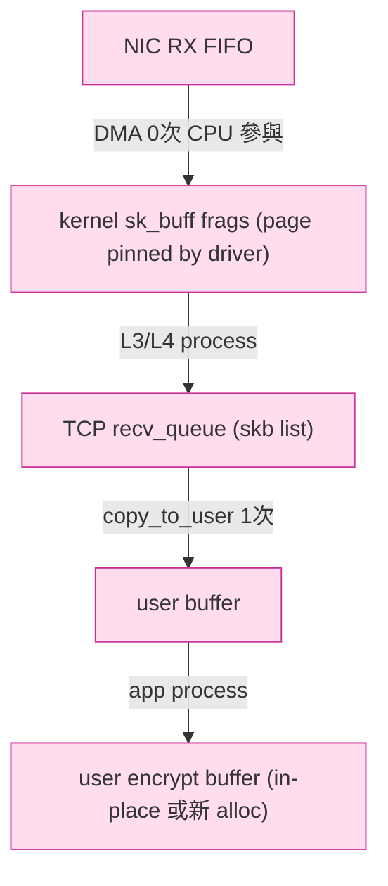
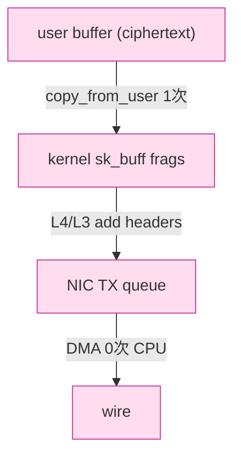
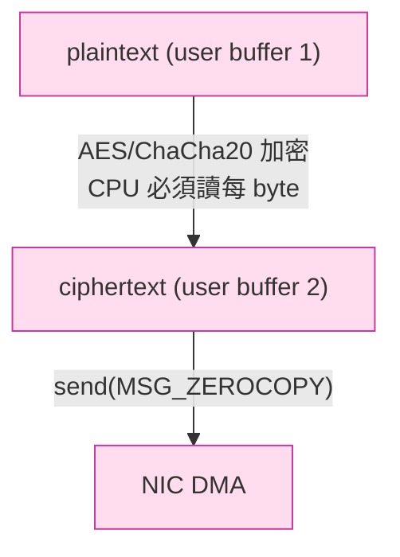

# 課堂 2.3 — 零拷貝（Zero-Copy）技術全解

## 學前知道

- **前置課**：[2.1 epoll](./2.1-select-poll-epoll.md)、[2.2 io_uring](./2.2-io-uring.md)
- **預計閱讀時間**：60~80 分鐘
- **必讀文獻**：
  - **Pai, Druschel, Zwaenepoel — IO-Lite: A Unified I/O Buffering and Caching System** (OSDI 1999) ⭐ — 零拷貝統一 buffer 抽象的學術源頭。1999 年提出，深刻影響 sendfile / splice 後續設計
  - **Dumazet et al. — `MSG_ZEROCOPY` patch series** (lkml 2017-2018) — 沒有正式論文，Eric Dumazet 在 Linux 4.14 引入 socket-level zero-copy 的 patch + LWN 解讀
  - **LWN — Zero-copy networking** https://lwn.net/Articles/726917/ — Corbet 2017 的綜述
  - **Stevens & Rago — *Advanced Programming in the UNIX Environment* §3.9** — `sendfile()` 與 zero-copy I/O 的經典教科書描述
  - **Linux kernel `Documentation/networking/msg_zerocopy.rst`**
- **必讀原始碼**：
  - `fs/splice.c`：`splice()` / `tee()` / `vmsplice()` / `sendfile()` 共用實作
  - `net/core/skbuff.c`：`skb_zerocopy_iter_dgram` / `skb_orphan_frags_rx` 等
  - `net/ipv4/tcp.c::tcp_sendmsg_locked` + `tcp_sendmsg_zc_zerocopy`
  - `mm/memory.c::get_user_pages_fast`：pin user page，是 zero-copy 的關鍵原語

---

## 動機

> 為什麼「零拷貝」在 2.2 io_uring 之後還要單獨開一堂

io_uring 解的是「**syscall overhead**」，零拷貝解的是「**memory bandwidth overhead**」。兩者正交、可乘。

來算一下 memory bandwidth：

- 一個 packet 1500 byte
- 走 traditional path：NIC DMA → kernel skb → kernel TCP recv buffer → user buffer (`recv()` copy_to_user) → user 處理後 → user buffer → kernel TCP send buffer (`send()` copy_from_user) → kernel skb → NIC DMA
- 對 1 個 packet 做 **2 次完整 memory copy**（recv copy_to_user + send copy_from_user）
- 1Gbps line rate = 125 MB/s。每 byte 2 copy = 250 MB/s memory bandwidth burned
- 10Gbps = 2.5 GB/s。**DDR4 single channel ~25 GB/s，等於 10% 純粹給 memcpy**
- 加上 cache thrash、TLB miss，實際更慘

**Proteus 的核心抓手**：

1. **proxy 是 byte forwarding 為主**：client → server → upstream，我們其實**不解內容**（除了 TLS handshake metadata）。如果能直接把 packet 從一條 socket pipe 到另一條，**完全不經 user-space copy**，是巨大 win
2. **但 Proteus 一定要加解密**：每個 byte 都要 ChaCha20 / AES-GCM 加密。**加密本身要 touch 每個 byte**。所以零拷貝對 Proteus 的能力**只能應用在 transport 框架，加密這層是 hard barrier**
3. **kTLS 是逃逸方案**：如果把加密 offload 進 kernel（甚至 NIC），user-space 就只看 ciphertext byte 流——加密這層也能 zero-copy。這是 2.4 的主題

本堂要回答的核心問題：

- **memory copy 在 kernel 哪一行發生？**（看完 source 你會記一輩子）
- **splice / sendfile / MSG_ZEROCOPY 三條路各自怎麼避免 copy？**
- **為何 TLS 在 user space 加密時 zero-copy 注定失敗？**
- **HUGETLB 跟 zero-copy 是什麼關係？**（很多教材跳過這層，但對 1M qps 是 critical）

---

## 核心概念

### 1. 「拷貝」在 kernel 路徑上哪幾次

定義精確：**「kernel 把 byte X 從位址 A copy 到位址 B（不同 physical page）」就算一次 copy**。Page table mapping 變更不算 copy。

#### Receive path 全展開（傳統 read/recv）



**1 次 copy**：`skb` 到 user buffer，發生在 `tcp_recvmsg_locked` → `skb_copy_datagram_iter` → `copy_to_iter` → `__copy_to_user`。

#### Send path（傳統 write/send）



**1 次 copy**：user buffer 到 skb，發生在 `tcp_sendmsg_locked` → `skb_copy_to_page_nocache` → `copy_from_iter`。

#### 完整 proxy 場景

```
client → [DMA → skb → copy_to_user] → user proxy → [copy_from_user → skb → DMA] → upstream
                       ★ 1                                  ★ 2
```

**2 次 copy/packet**。Memory bandwidth 是線速的 2 倍。

#### 為什麼這 2 次 copy 看起來不可避免

- copy_to_user：kernel 不信 user-space 位址（race、unmapped、different process），必須過 fault handler
- copy_from_user：對稱反向

要避開兩種思路：
- **改變 ownership 而非 copy**：把 kernel page「借」給 user / 把 user page「借」給 kernel
- **完全避開 user space**：在 kernel 內把 byte 從 fd A 搬到 fd B（splice / sendfile）

### 2. `sendfile()`：第一代 zero-copy（1999）

```c
ssize_t sendfile(int out_fd, int in_fd, off_t *offset, size_t count);
```

語意：把 `in_fd`（必須是 file）的 byte 直接送到 `out_fd`（可以是 socket）。**完全在 kernel 完成、不過 user space**。

歷史背景：1990s 末 web server 主要瓶頸是「靜態檔案讀盤 + 送 socket」。Apache、IIS 各自實作了類似 API。Linux 在 2.2 引入 `sendfile`、後來逐步擴展。

Kernel path：

```
in_fd (file) → page cache → ★ 直接 splice 到 ★ → out_fd (socket) skb → NIC DMA
```

**0 user-space copy**。但限制嚴格：

- **`in_fd` 必須是 file 或可 mmap 物件**，**不能是 socket**（在 Linux < 2.6.33 完全不行；新 kernel 部分支援但效率不佳）
- 不能在送 socket 前修改內容（純粹 forward）

對我們協議：**幾乎不能用**。proxy 兩端都是 socket，sendfile 沒辦法做 socket-to-socket。

⚠️ **但 sendfile + kTLS 是個關鍵組合**：nginx 用 kTLS 後可以 `sendfile()` 直接把磁碟檔案加密送 socket。這個組合在 [2.4 kTLS](./2.4-ktls.md) 詳講。

### 3. `splice()`：socket-to-socket 零拷貝（2005）

```c
ssize_t splice(int fd_in, off64_t *off_in,
               int fd_out, off64_t *off_out,
               size_t len, unsigned int flags);
```

語意：把 byte 從一個 fd 搬到另一個 fd，**中間透過 pipe**。任一端必須是 pipe。

關鍵 trick：**pipe 是 kernel 內的 buffer，不過 user space**。所以：

```
fd_in (socket) → ★ splice ★ → pipe (kernel buffer) → ★ splice ★ → fd_out (socket)
```

兩次 splice、0 user-space copy。但**中間經過 pipe 是 page-level move**，不是真的 byte copy——`pipe_buffer` 物件指向同樣的 page，refcount + 1。

#### 完整 proxy 寫法

```c
int p[2]; pipe(p);
while (1) {
    ssize_t n = splice(client_fd, NULL, p[1], NULL, 65536, SPLICE_F_MOVE | SPLICE_F_MORE);
    if (n <= 0) break;
    while (n > 0) {
        ssize_t m = splice(p[0], NULL, upstream_fd, NULL, n, SPLICE_F_MOVE | SPLICE_F_MORE);
        if (m <= 0) goto end;
        n -= m;
    }
}
```

`SPLICE_F_MOVE` 是「能用 page move 就 move」hint，但 kernel 不一定真的能做到 page move——某些情況仍 fallback 到 copy。

#### `splice()` 的硬限制

1. **不可修改內容**：byte stream pass-through only。我們協議要加密，**不能用 splice**
2. **必須有 pipe**：每條 connection 一個 pipe pair 是 fd 浪費（10K connection × 2 fd = 20K fd 給 pipe）。實務上要 pipe pool
3. **內容可見性弱化**：我們無法在 user space 看到 byte 內容做 inspection（除了 `tee()`，但 tee 又增加 copy）

對 Proteus：**只在「TLS handshake 完成後、純 byte forwarding 段」可能用**。如果 Proteus 設計成 TLS 內含明文流量（無內層加密），則 splice 可用。但通常我們會雙層加密，splice 不可行。

#### `tee()` / `vmsplice()` 兄弟

`tee()`：把 pipe 內容**複製**到另一個 pipe（refcount + 1，不是真 byte copy）。用於 monitoring / mirror。

`vmsplice()`：把 user-space buffer「移」進 pipe（不 copy，page level move）。**危險**：user-space 不能再動該 buffer，否則 race。

```c
struct iovec iov = { .iov_base = buf, .iov_len = len };
vmsplice(p[1], &iov, 1, SPLICE_F_GIFT);   // "gift" user page to kernel, must not touch buf afterwards
splice(p[0], NULL, sock_fd, NULL, len, SPLICE_F_MOVE);
```

效果：**user buffer 直接走進 socket，0 copy**。但 lifetime 管理超難——hot trick，謹慎使用。

### 4. `MSG_ZEROCOPY`（Linux 4.14, 2017）：socket send zero-copy

```c
int one = 1;
setsockopt(sock, SOL_SOCKET, SO_ZEROCOPY, &one, sizeof(one));

ssize_t n = send(sock, buf, len, MSG_ZEROCOPY);
// 注意：send 立刻返回，但 buf 不能立刻重用！
```

語意：kernel **不 copy** user buffer 到 skb，而是把 user page **pin** 進 skb frags。傳輸完成（NIC DMA done）後，kernel 透過 `recvmsg(MSG_ERRQUEUE)` 通知 user 該段 buffer 可重用了。

```c
// 從 error queue 拿完成通知
char ctrl[100];
struct msghdr msg = { ... .msg_control = ctrl, .msg_controllen = sizeof(ctrl) };
recvmsg(sock, &msg, MSG_ERRQUEUE);
// parse cmsg 找 SO_EE_ORIGIN_ZEROCOPY，cmsg 帶完成的 seq range
```

對比 io_uring 的 `SEND_ZC`：兩者底層機制相同（都用 `MSG_ZEROCOPY` page pinning 路徑），差別只是 completion 通知通道（一個是 recvmsg ERRQUEUE，一個是 CQE）。

#### MSG_ZEROCOPY 的 break-even point

```
小於 ~10KB：MSG_ZEROCOPY 比 traditional 慢（page pinning overhead）
10KB ~ 64KB：差不多
>64KB：MSG_ZEROCOPY 顯著快
```

**我們的協議 packet 是多大？**：

- TCP MSS 1460 → 一個 application send() 通常 1.4KB 或集中發 16~64KB（取決於 application buffer）
- 對 1.4KB tiny packet，MSG_ZEROCOPY **更慢**
- 對 64KB bulk transfer（檔案下載），有意義

⇒ **Proteus send threshold**：小 msg 走普通 send，大 msg (>16KB？) 才走 ZEROCOPY。Threshold 要 benchmark 決定。

### 5. 接收端 zero-copy：`MSG_ZEROCOPY_RECV` / `TCP_ZEROCOPY_RECEIVE`

```c
struct tcp_zerocopy_receive zc = { .address = (uintptr_t)mmap_buf, .length = len };
getsockopt(sock, IPPROTO_TCP, TCP_ZEROCOPY_RECEIVE, &zc, &sz);
```

語意：把 NIC 收到的 page **直接 mmap 進 user 位址空間**，0 copy。

限制爆炸多：
- 需要 4KB-aligned buffer（page 邊界）
- **packet payload 必須恰好對齊 page 邊界**——只有當 NIC 用 page-aligned DMA、TCP packet 不分片、且 MTU 配合得剛好時才能用
- 多數情況 fallback 到 `copy_to_user`
- 實務上只有 Google 在他們 frontend 用，社群採用率極低

⇒ **Proteus 不用**。Send-side zero-copy 收益更大、更穩定。

### 6. mmap-based zero-copy 與 HUGETLB

Receive 不能 zero-copy？另一條路：**把 user buffer 預先 mmap，並用 huge page**。

```c
char *buf = mmap(NULL, 2*1024*1024, PROT_READ|PROT_WRITE,
                 MAP_ANONYMOUS|MAP_PRIVATE|MAP_HUGETLB|MAP_HUGE_2MB, -1, 0);
```

`MAP_HUGETLB` 用 2MB 或 1GB 的 huge page：
- **TLB pressure 大減**：4KB page table 一條 entry covers 4KB；2MB huge page 一條 entry covers 2MB
- 對 high throughput recv 場景，TLB miss 減 50%+
- 但 huge page 必須預先 reserve（sysctl `vm.nr_hugepages`）

對 Proteus 的意義：

- 我們 send/recv buffer pool 在 server 端用 huge page，**提升 throughput**
- 配 `io_uring_register_buffers`：buffer 一次 register 進 kernel，pin 在 huge page 上，**整個 server lifetime 不再 page fault**

### 7. 為什麼 TLS 不能 zero-copy（user-space 加密的本質限制）

**核心矛盾**：zero-copy 假設 **byte 不需要被 user CPU 觸碰**。但加密**必須觸碰每個 byte**（讀 plaintext、寫 ciphertext）。



**user-space 加密的最佳情境**：

- plaintext → CPU 加密 → ciphertext → **MSG_ZEROCOPY send**

依然有：
- **1 次完整 byte 觸碰**（加密本身）
- 加密通常**原地（in-place）**，所以 plaintext 跟 ciphertext 在同個 buffer，省掉 1 次 copy

對比 plaintext 流量（不加密）：

- plaintext → **splice** 一路到 socket
- **0 次 user-space byte 觸碰**

兩者差異：**加密那次 byte 觸碰是無法避免的**。所以 Proteus 的「user-space 加密 zero-copy」最佳化只能做到「**touch 1 次**」（傳統是 3 次：copy_from_user + encrypt + ... 等）。

#### 逃逸方案：kTLS / NIC inline-TLS

如果 **加密 offload 到 kernel 或 NIC**，user-space 整個不 touch byte：

```
NIC: receive ciphertext → NIC TLS decrypt → DMA plaintext → kernel
    or
kernel: assemble plaintext → kernel TLS encrypt → ciphertext → DMA → NIC
```

整條 path **user 0 byte 觸碰**。這就是 kTLS / NIC TLS offload，**2.4 主題**。

⭐ **對 Proteus 設計**：我們協議是「自訂加密 + 自訂 framing」，**kTLS 不直接適用**（kTLS 只懂標準 TLS 1.2/1.3 record format）。

兩條設計路：
1. **接受「加密那次 touch 是 unavoidable」**：作 in-place 加密 + io_uring SEND_ZC + register_buf_ring。能做到「**每 byte user 觸碰 1 次**」，比 traditional 的 3 次少 2/3
2. **設計可被 NIC offload 的協議格式**：若我們的 record format 跟 TLS 1.3 結構相容，可能某天 NIC 能 offload。但 NIC TLS offload 廠商鎖定（Mellanox / Chelsio / Intel），且對 GFW abuse 不利

**結論**：Proteus 走 path 1。承認 user-space 加密的硬限制，**用 in-place ChaCha20-Poly1305 + io_uring SEND_ZC** 把其他 copy 全壓掉。

### 8. 完整 zero-copy 工具棧對比表

| 工具 | Send/Recv | User touch | 適用 fd | 加密相容 | 何時用 |
|---|---|---|---|---|---|
| `sendfile()` | send | 0 | in=file, out=socket | 需 kTLS | 檔案下載 server |
| `splice()` | 雙向 | 0 | 任一端是 pipe | 不可 | 純 pass-through proxy |
| `tee()` | 複製 | 0 | pipe→pipe | 不可 | mirror / logging |
| `vmsplice()` | send | 0 | user→pipe | 需自己加密 | 配 splice 做整 chain |
| `MSG_ZEROCOPY` | send | 1（加密） | socket | 是 | 大 msg send |
| `TCP_ZEROCOPY_RECEIVE` | recv | 0 | socket | 不可 (recv plaintext only) | Google scale |
| `io_uring SEND_ZC` | send | 1（加密） | socket / file | 是 | io_uring runtime |
| `mmap + MAP_HUGETLB` | buffer | n/a (buffer 層) | n/a | n/a | 配上面任一 |
| `kTLS` | 雙向 | 0 | socket | **是（kernel 加密）** | TLS 1.2/1.3 server |

#### Proteus 候選組合

```
[recv path]
NIC → DMA → skb → ★ register_buf_ring (kernel-user shared, huge page) ★
                  → ★ in-place ChaCha20-Poly1305 decrypt (user, 1 touch) ★
                  → forward to upstream socket

[send path]
upstream socket recv → in-place encrypt → io_uring SEND_ZC → skb (ref user page) → NIC DMA
                       ★ 1 touch ★         ★ 0 user copy ★
```

**全路徑 user touch 1 次**（加密本身）。理論上限。

### 9. 量測 zero-copy 收益的方法

#### A. memcpy bandwidth baseline

```bash
mbw 1024   # measure memory copy bandwidth
# expect: DDR4 ~10-20 GB/s, DDR5 ~30-40 GB/s
```

如果你的 server memcpy 是 10 GB/s，而要送 10 Gbps = 1.25 GB/s 流量，2 copy = 2.5 GB/s ≈ 25% memcpy 預算。對小 packet 場景更糟（per-packet overhead 主導）。

#### B. perf 看哪些 copy_to_user / copy_from_user 在 hot path

```bash
perf record -g -F 999 -p $(pgrep your_server) -- sleep 30
perf report --stdio | head -50
```

看到 `__copy_user_nocache` / `copy_user_enhanced_fast_string` 高 = copy bound。

#### C. bpftrace 量每次 send copy 多少 byte

```bash
sudo bpftrace -e '
tracepoint:syscalls:sys_enter_sendto /comm == "your_server"/ {
    @sz = hist(args->len);
}
'
```

#### D. 對比實驗：splice 版本 vs 普通 read/write proxy

寫兩個 echo proxy，分別量 throughput 與 CPU。Splice 版本應該 **單 core 多 1.5-2x throughput**（前提是不加密）。

---

## 與我們協議設計的關聯

1. **加密 in-place**：Proteus record 必須設計成「**plaintext / ciphertext 同 buffer**」（ChaCha20-Poly1305 支援 in-place、AES-GCM 也支援）。**省掉一次 copy**
2. **buffer pool with HUGETLB**：server 端用 huge page + io_uring register_buf_ring。是 1M qps server 的標配
3. **send path**：小 msg (<16KB) 走普通 send；大 msg 走 io_uring SEND_ZC。Threshold benchmark 決定，預計 ~16KB
4. **recv path**：用 io_uring multishot RECV + register_buf_ring。不嘗試 TCP_ZEROCOPY_RECEIVE（限制太多）
5. **避開 splice**：因為加密讓 splice 不適用。但 Proteus 若有「**plaintext fallback mode**」（測試用），可以用 splice 做 pass-through baseline 對比
6. **kTLS 暫不採用**：我們協議格式跟 TLS record 不相容。但若 Proteus 設計階段選擇「TLS-1.3-record-compatible framing」，未來能切到 kTLS。這是一個**未來打開的設計門**
7. **記憶體用量預算**：1M concurrent connection × 2 × 64KB buffer = 128 GB。**不可能**。我們必須用 buffer pool + on-demand 配置，且 buffer ring 大小限制單機並發連線總和

---

## 動手

### 實驗 A：用 strace 觀察 sendfile vs read/write

寫一個小 HTTP server，serve 1MB 檔案：
- 版本 A：`read(file) + write(socket)`
- 版本 B：`sendfile(socket, file)`

```bash
strace -c -e read,write,sendfile ./serv_A   # 計次數
strace -c -e read,write,sendfile ./serv_B
```

預期：B 只看到 1 個 sendfile syscall，A 看到 ~1024 個 read + 1024 個 write（4KB read buffer）。

### 實驗 B：splice 做 plaintext proxy

```c
// minimal splice proxy
int pipefd[2]; pipe(pipefd);
fcntl(pipefd[0], F_SETPIPE_SZ, 1024*1024);  // 1MB pipe buffer

while (1) {
    ssize_t n = splice(client_fd, NULL, pipefd[1], NULL, 65536,
                       SPLICE_F_MOVE | SPLICE_F_MORE | SPLICE_F_NONBLOCK);
    if (n <= 0) break;
    while (n > 0) {
        ssize_t m = splice(pipefd[0], NULL, upstream_fd, NULL, n,
                           SPLICE_F_MOVE | SPLICE_F_MORE | SPLICE_F_NONBLOCK);
        if (m <= 0) goto end;
        n -= m;
    }
}
```

對比一個用 `read()+write()` 的版本。用 `iperf3 -c localhost` 量吞吐。Splice 版本應顯著快（單 core 可達 line rate，read/write 版本 CPU bound）。

### 實驗 C：MSG_ZEROCOPY break-even

寫一個 client：分別用 1KB / 16KB / 64KB / 256KB buffer 持續 send 給 server。
量：CPU usage、throughput。打開與關閉 MSG_ZEROCOPY 各跑一次。

預期：1KB MSG_ZEROCOPY 略慢，64KB 開始持平，256KB 顯著快。畫圖。

### 實驗 D：huge page 對 register_buf_ring 的影響

```bash
echo 1024 | sudo tee /proc/sys/vm/nr_hugepages
# 配 2GB huge page
```

跑一個 io_uring server。bpftrace 量 TLB miss 數：

```bash
sudo perf stat -e dTLB-load-misses,dTLB-loads -p $(pgrep server) sleep 10
```

對比有無 huge page 的版本。預期 huge page 版本 TLB miss 少 50%+。

---

## 自我檢查

1. 一個典型 `recv() + 加密 + send()` 在普通 user-space 路徑上做幾次 byte 完整拷貝？分別在哪一行？
2. `splice()` 跟 `vmsplice()` 的「page move」實際上是 kernel 怎麼做的？refcount 哪裡 inc？lifetime 怎麼保證？
3. 為什麼 `MSG_ZEROCOPY` 對 small buffer 反而更慢？「break-even point」是哪些常數的函數？（提示：`get_user_pages_fast`、TLB flush cost、completion notification overhead）
4. 我們協議走 in-place ChaCha20-Poly1305 加密 + io_uring SEND_ZC，**每 byte user touch 幾次**？這個數字能再降嗎？（提示：除非 offload to NIC，否則不能）
5. `TCP_ZEROCOPY_RECEIVE` 為何業界採用率低？除了 alignment 限制外，還有什麼軟體生態問題？
6. `MAP_HUGETLB` 跟 `transparent huge pages (THP)` 差在哪？Proteus 應該用哪個？
7. 如果 Proteus 未來決定 framing 跟 TLS 1.3 相容，能切換到 kTLS 帶來的最大收益是什麼？最大代價是什麼？
8. 寫一個 Proteus server 的 recv-encrypt-send pipeline pseudocode，標示每步是否觸碰 byte、是否進 kernel、是否 syscall

---

## 延伸閱讀

- **LWN — Zero-copy networking** https://lwn.net/Articles/726917/ — Corbet 2017
- **LWN — TCP receive zero copy** https://lwn.net/Articles/752188/
- **LWN — More zero-copy networking** https://lwn.net/Articles/710533/
- **Linux Documentation/networking/msg_zerocopy.rst** — Dumazet 親寫的官方 doc
- **`man 2 splice`、`man 2 sendfile`、`man 2 vmsplice`、`man 7 socket` 的 `SO_ZEROCOPY` 段** — 最權威
- **Google scaling TCP**：https://research.google/pubs/pub45935/（CarrierGrade 級別的 zero-copy 細節）
- **Cloudflare blog — Sending data via splice()** — 工程實踐
- **Netflix BSD TLS sendfile**：https://people.freebsd.org/~rmacklem/Netflix-TLS.pdf — Netflix 用 BSD kTLS + sendfile 跑 100Gbps 單機

---

## 研究級補遺

### 1. 學界詞彙

| 中文/口語 | 學界正名 | 出處 |
|---|---|---|
| 零拷貝 | zero-copy I/O | Druschel & Peterson 1993 *Fbufs*；Pai et al. OSDI 1999 |
| 統一 buffer 抽象 | unified buffering | Pai 1999 |
| 共享 buffer | shared buffer / I/O buffer | 同上 |
| page-level move | page remapping / page flipping | mm 文獻 |
| Page pinning | `get_user_pages` family | Linux mm |
| huge page | huge page / superpage | mm 文獻 |
| in-place 加密 | in-place authenticated encryption | RFC 7539 ChaCha20-Poly1305 |
| copy-on-write | COW | UNIX 古典 |

### 2. 對手分類學：memory copy 是哪種「攻擊面」

對 Proteus 而言，memory copy 不是安全攻擊面，是**性能攻擊面**——但對對手（GFW）來說，「**監測到一條連線特別快/慢**」是 traffic 特徵。

零拷貝最佳化能讓 Proteus server 表現「跟一般 nginx / haproxy 一樣快」，**反混淆失敗（看起來太快）也是 risk**。具體：

- 普通 HTTPS 服務 1Gbps + ChaCha20 user-space encrypt = ~3-4 core CPU bound
- Proteus with full zero-copy = 1Gbps + 1.2 core CPU
- 如果 GFW 對「**單條 connection 每秒 byte / CPU 用量**」做 fingerprinting，Proteus 太省 CPU 反而暴露

⇒ 設計考量：**性能上限要留，但默認 mode 不要 max performance**。Part 11 看這條 design constraint。

### 3. 形式化定義：byte touch count

定義：一個 byte 在從 entry (NIC RX) 到 exit (NIC TX) 路徑上被 CPU load/store 的次數。

| 路徑 | byte touch count |
|---|---|
| Plain read/write proxy | 2 |
| sendfile proxy（不適用我們） | 0 |
| splice proxy（不適用，加密斷鏈） | 0 |
| user-space ChaCha20 + MSG_ZEROCOPY | 1（in-place encrypt） |
| user-space ChaCha20 + 普通 send | 2（encrypt + copy_from_user） |
| kTLS + sendfile（理論） | 1（kernel encrypt） |
| NIC inline TLS（如有） | 0 |

Proteus 目標：穩定達到 **1**。

### 4. 領域的關鍵論文 / 規格

- **Pai, Druschel, Zwaenepoel — IO-Lite** (OSDI 1999) ⭐ — 統一 buffer 抽象的學術源頭
- **Brustoloni & Steenkiste — Effects of Buffering Semantics on I/O Performance** (OSDI 1996) — copy semantics 分析
- **Mogul & Ramakrishnan — Eliminating Receive Livelock in an Interrupt-Driven Kernel** (TOCS 1997) — 已抓 `assets/papers/tocs-1997-mogul-livelock.pdf`，跟 NAPI 與 zero-copy 接收端設計有關
- **Rizzo — netmap: a novel framework for fast packet I/O** (USENIX ATC 2012) — 已抓 `usenix-atc-2012-rizzo-netmap.pdf`，user-space packet I/O 框架；它的 page-flipping 是 zero-copy 的 user-stack 版本
- **Dumazet MSG_ZEROCOPY series** — lkml 2017，無正式論文
- **Han et al. — MegaPipe** (OSDI 2012) ⭐ — 已抓，是 zero-copy + batched syscall 的 systems paper 前身
- **Netflix BSD TLS deck** — 100Gbps + kTLS + sendfile，已連結

### 5. 我們協議的座標 / 設計取捨

| 設計問題 | 本堂收窄了什麼 | 仍 open |
|---|---|---|
| 加密放哪裡 | user space（kTLS 不適用因 framing 不同） | 是否將來重新設計 framing 以兼容 kTLS（Part 11） |
| Send 路徑 | 大 msg io_uring SEND_ZC，小 msg 普通 | threshold 經實測決定 |
| Recv 路徑 | io_uring multishot RECV + register_buf_ring | TCP_ZEROCOPY_RECEIVE 不採用 |
| Buffer pool | huge page (MAP_HUGETLB) + register_buf_ring | per-CPU 切分策略 |
| Plaintext fallback | splice() 可用做 benchmark baseline | Proteus 是否提供 `--no-encrypt` debug mode |

### 6. 必追資源 / 社群入口

- **`linux-mm@kvack.org`** — mm subsystem mailing list（huge page / get_user_pages）
- **`netdev@vger.kernel.org`** — networking subsystem
- **LWN** — 每篇 zero-copy 重要 patch 都有深度文章
- **Eric Dumazet 的 commit history** — Linux network performance 主要推手
- **Netflix engineering blog**、**Cloudflare blog** — 工業界最高水平

### 7. 開放問題（research-level）

1. **加密 + zero-copy 的本質下界**：能否證明「對抗加密協議，user-space byte touch 下界 = 1」？這對 Proteus 是 design lower bound
2. **NIC TLS offload 的安全模型**：NIC 看明文是 trust boundary 改動。Adversarial NIC firmware？formal model 尚缺
3. **GPU-accelerated 加密 + zero-copy**：把 ChaCha20 跑在 GPU、user CPU 0 touch。實證已有 (Cao et al. PETS 2024 等)，但跟 io_uring 整合方案還不乾淨
4. **eBPF in-kernel 加密**：能否寫一個 eBPF program 做 ChaCha20 加密？目前 BPF verifier 不允許 loop 多 byte，所以技術上極難——但 BPF iter / kfunc 演化可能解開
5. **SmartNIC + DPU 上的 Proteus**：把 Proteus 整條 path 跑進 NIC 的 ARM core，user-space 完全不參與。BlueField-3 / Pensando 已支援，是「終極 zero-copy」

> ⭐ Proteus 若 push 系統頂會，**第 1 條形式化下界證明** + **實證做到下界** 是強 contribution。

---

## 對下一堂的鋪墊

2.3 留了一個重要伏筆：**kTLS 是 zero-copy + 加密的唯一乾淨解**，但它要求協議是標準 TLS record 格式。下一堂 [2.4 kTLS](./2.4-ktls.md) 完整講 kTLS 的設計（state machine、socket option、與 sendfile 的關係），並評估 Proteus 是否要走「TLS-compatible framing 換取 kTLS offload」這條設計路線。

對 Proteus 來說，2.4 是**真正的 design fork**。
