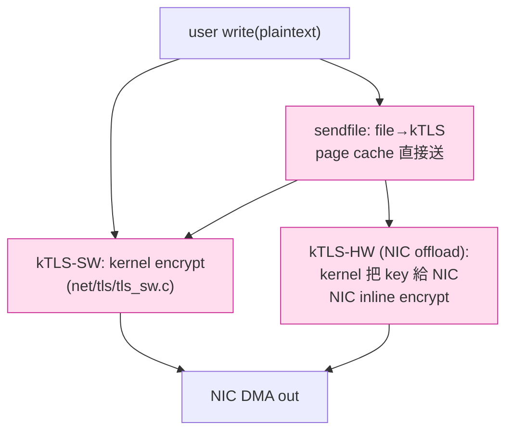

# 課堂 2.4 — kTLS：把 TLS 塞進 kernel

## 學前知道

- **前置課**：[2.3 零拷貝](./2.3-zero-copy.md)（最後一節留下的伏筆：「kTLS 是 zero-copy + 加密唯一乾淨解」）
- **預計閱讀時間**：60 分鐘
- **必讀文獻 / 規格**：
  - **RFC 8446 — TLS 1.3** (Rescorla, 2018) — TLS 1.3 record protocol，理解 kTLS 必看 §5「record protocol」
  - **Linux Documentation/networking/tls.rst** — kTLS 的官方規格（user API、socket option、限制）
  - **Watson, Stewart et al. — TLS Offload to NIC** (Linux Plumbers 2019)、**Netflix BSD TLS** deck — kTLS + NIC offload 工程實踐
  - **LWN — Kernel TLS** https://lwn.net/Articles/666509/ (2015 引入) 與 https://lwn.net/Articles/776541/ (TLS 1.3 支援)
  - **Krawetz — TLS 1.2/1.3 record-layer 詳解** — record framing 細節
- **必讀原始碼**：
  - `net/tls/tls_main.c`：socket option `TCP_ULP="tls"` 處理
  - `net/tls/tls_sw.c`：軟體 kTLS path（kernel 自己加解密）
  - `net/tls/tls_device.c`：硬體 NIC offload path
  - `net/tls/tls_strp.c`：record 切割（reassembly）
  - `include/uapi/linux/tls.h`：user/kernel 介面
- **必讀 user-space libraries**：OpenSSL 3.x 的 kTLS 支援（`SSL_OP_ENABLE_KTLS`）；gnutls / wolfSSL kTLS

---

## 動機

> G6 要不要為了 kTLS 改自己的 framing？這是本堂要回答的設計 fork

[2.3 §7](./2.3-zero-copy.md) 留了結論：

> **user-space 加密的本質下界：byte touch 1 次**（加密本身無法避免）。
> 唯一能再降到 0 的辦法是**把加密 offload 出 user space**——kernel TLS 或 NIC TLS。

kTLS 在 Linux 4.13 (2017) 引入，到 2026 已是成熟功能：

- **Netflix**：100Gbps 單機 video streaming 全靠 BSD kTLS（FreeBSD 是發源地，Linux 跟進）
- **nginx**：1.21+ 原生支援 `ssl_conf_command Options KTLS`
- **HAProxy**、**Cloudflare**、**Facebook (Meta)**：大規模生產用

但 kTLS 對 G6 有個**根本問題**：它只懂**標準 TLS 1.2 / 1.3 record format**。我們設計新協議時：

- 走 path A：自訂 framing → user-space 加密（永遠 1 touch）
- 走 path B：framing 兼容 TLS 1.3 record → 可開 kTLS → 加密 0 touch

選 B 似乎太誘人，但代價是：

1. **TLS record format 對 GFW 來說太「TLS-like」**：要嘛就**用真 TLS（REALITY 系列），藏在 nginx 後面**；要嘛**完全不像 TLS**（Shadowsocks AEAD）。「**長得像但不是真 TLS**」是死路（VMess / 早期 Trojan 教訓）
2. **TLS record 5-byte header (type + version + length) 是 fingerprint 來源**：record 切割 pattern、cipher suite negotiation 是 GFW 的成熟分析目標
3. **TLS handshake 加 ApplicationData record 切換 + key schedule**：要兼容 kTLS 必須走完整 TLS 1.3 handshake，這跟 G6 設計目標的 0-RTT / 自訂 key exchange 衝突

本堂三個目標：

1. 講清楚 kTLS 怎麼運作（state machine、socket option、限制）
2. 評估 G6 是否走 path B
3. 不走 path B 也要懂 kTLS——因為 G6 server 可能要混部 nginx (kTLS) 做 fronting

---

## 核心概念

### 1. TLS record protocol（kTLS 必懂前提）

TLS 1.3 record（RFC 8446 §5）：

```
+--------+---------+--------+--------+-------------------+--------+
| type   | legacy  | legacy | length | encrypted payload | auth   |
| (1 B)  | version | version|  (2 B) |   (length bytes)  | tag    |
|        |  (2 B)  |        |        |                   | (in    |
|        |         |        |        |                   |  enc.  |
|        |         |        |        |                   |  payload)|
+--------+---------+--------+--------+-------------------+--------+
type: 0x17 = ApplicationData (TLS 1.3 always 0x17 after handshake)
legacy version: 0x0303 (TLS 1.2 sentinel)
length: max 2^14 + 256 (record size limit)
```

- 5 byte plaintext header
- payload 內含 AEAD ciphertext + auth tag
- AEAD scheme 由 cipher suite 決定（AES-128-GCM / AES-256-GCM / ChaCha20-Poly1305）
- nonce 由 (handshake-derived IV) XOR (sequence number) 構成，**不在 wire 上明傳**
- sequence number user / kernel 各自維護（從 0 開始，每 record + 1）

**kTLS 的 job**：給定 user-space 把 plaintext 寫進 socket，kernel 自動切 record、加密、寫 socket buffer。反向同理。

### 2. kTLS 啟用流程

```c
// 假設 SSL_handshake 已完成 (e.g., 透過 OpenSSL/gnutls)，
// 拿到 traffic key + IV + initial sequence number

// 1. 把 TLS ULP 掛上 socket
setsockopt(sock, SOL_TCP, TCP_ULP, "tls", sizeof("tls"));

// 2. 設定 TX 加密參數
struct tls12_crypto_info_aes_gcm_128 tx = {
    .info.version = TLS_1_3_VERSION,
    .info.cipher_type = TLS_CIPHER_AES_GCM_128,
    /* iv / key / salt / rec_seq 填入 handshake 衍生值 */
};
setsockopt(sock, SOL_TLS, TLS_TX, &tx, sizeof(tx));

// 3. 設定 RX 解密參數
struct tls12_crypto_info_aes_gcm_128 rx = { ... };
setsockopt(sock, SOL_TLS, TLS_RX, &rx, sizeof(rx));

// 之後 write(sock, plaintext, n) 跟 read(sock, plaintext_buf, n) 自動加解密
// 也支援 sendfile()！
```

**重點**：handshake 仍在 user space 跑（OpenSSL / gnutls），**只有 record 加解密 offload 進 kernel**。

### 3. 三種 kTLS path



- **kTLS-SW (software)**：kernel 用 CPU AES-NI / VAES / AVX 加密。比 user-space OpenSSL 略快（少 syscall），但 byte 還是 touch
- **kTLS-HW (hardware offload)**：把 key 註冊到 NIC（Mellanox ConnectX-5+、Chelsio T6+），NIC 用其 ASIC 加密。**user 跟 kernel 都 0 touch**
- **sendfile + kTLS**：page cache → kTLS encrypt → NIC。**整路 user 0 touch**（這是 Netflix 100Gbps 的 secret sauce）

### 4. kTLS 對 application 的透明度

kTLS 的妙處：**`write()` / `read()` API 不變**。應用程式不需要懂 kTLS。OpenSSL 3.x 把 socket option 自動設好後，user code 完全不變。

```c
SSL *ssl = SSL_new(ctx);
SSL_set_options(ssl, SSL_OP_ENABLE_KTLS);   // 開啟即可
SSL_set_fd(ssl, sock);
SSL_accept(ssl);   // handshake done

SSL_write(ssl, plaintext, n);   // OpenSSL 內部 detect kTLS active → 直接 write(sock,...)
```

**所以 nginx 1.21+ 開 kTLS 是一行 conf**：

```nginx
ssl_conf_command Options KTLS;
```

### 5. sendfile + kTLS：Netflix 的 100Gbps secret

Netflix 的 OCA (Open Connect Appliance) edge server：

- 上 PB 級影片庫存 SSD
- 每個 client request：`sendfile(socket, file)` 直接從 page cache 送 socket
- TLS 加密在 kernel 內完成（或 offload 到 NIC）
- **整個 byte path：SSD → page cache → kTLS encrypt → NIC**，user space 完全不參與

Linux 上 sendfile + kTLS：

```c
// open file
int fd = open("video.ts", O_RDONLY);
// sendfile 自動經過 kTLS encrypt path
sendfile(sock, fd, NULL, st.st_size);
```

kernel 內部：

1. `do_sendfile` 進 `splice_direct_to_actor`
2. socket 的 `tls_sw.c::tls_sw_sendpage` 處理
3. 對每個 page，組成 TLS record，AES-GCM encrypt 進 skb
4. `tcp_write_xmit` 送出

**G6 不直接適用**（我們不 serve static file），但機制要懂——因為**理解 kernel 怎麼串 sendfile/splice/kTLS 是設計協議的 reference 心智模型**。

### 6. kTLS 的限制（為什麼不是萬靈丹）

#### 6.1 只支援 TLS 1.2 / TLS 1.3 ApplicationData

- handshake 階段（ClientHello、Finished 等）**不能 offload**，OpenSSL/gnutls 必須先在 user space 跑完 handshake，再轉交 kTLS
- TLS 1.0 / 1.1 不支援（也不該支援，已 deprecated）
- 自訂 record format 完全不行——這就是 G6 的硬限制

#### 6.2 Cipher suite 受限

支援列表（Linux 6.x）：

```
TLS_AES_128_GCM_SHA256
TLS_AES_256_GCM_SHA384
TLS_CHACHA20_POLY1305_SHA256
TLS_AES_128_CCM_SHA256
```

我們協議若想用更新或非標 AEAD（例如 Ascon-128a），kTLS 不支援。

#### 6.3 Re-keying（key update）支援不完整

TLS 1.3 KeyUpdate 訊息每 N record 更新一次 key（防 attack on long-lived connection）。kTLS 對此支援需 user space 接住 KeyUpdate 然後重 `setsockopt(TLS_TX)`。這在高頻 rekey 場景增加 overhead。

#### 6.4 NIC offload 廠商鎖定

支援 inline TLS offload 的 NIC：
- Mellanox ConnectX-5 / 6 / 7 (NVIDIA)
- Chelsio T6 / T7
- Intel 100Gbe（部分型號）

非 enterprise 級 NIC（消費卡、virtio-net）**完全不支援**。G6 部署在 budget VPS（KVM virtio）幾乎沒機會用到 hw offload。

#### 6.5 Bugs 歷史

kTLS 早期（4.13~5.0）有不少 corner case bug：
- 與 SO_REUSEPORT 互動異常
- send buffer full 時 record 切割錯誤
- TCP retransmission + KeyUpdate race

到 6.x 大致穩定，但仍是個年輕子系統。CVE 數 < io_uring 但 > epoll。

### 7. kTLS 效能實測

引用 Linux kernel 公開資料 + Netflix BSD TLS deck：

| 場景 | user TLS (OpenSSL) | kTLS-SW | kTLS-HW (NIC) |
|---|---|---|---|
| nginx 1MB file serve, AES-GCM-256 | 12 Gbps/core | 18 Gbps/core | 50 Gbps/core (limited by NIC) |
| Memory bandwidth used | ~3 × line rate | ~2 × line rate | ~1 × line rate |
| CPU per Gbps | ~50% | ~30% | ~5% |

**kTLS-HW 對 large transfer 是壓倒性勝利**。對 small msg / 高 connection 數，差距縮小（handshake 成本主導）。

### 8. kTLS vs G6 的關鍵 trade-off 分析

#### Option 1: G6 走自訂 framing（不用 kTLS）

- ✅ Framing 抗指紋自由度高（可 TLS-mimic、可完全隨機）
- ✅ Cipher suite 可選非標
- ✅ Handshake 自訂（0-RTT 簡單實作）
- ✅ Re-key、PFS 控制權全在自己手上
- ❌ user-space 加密，byte touch 1 次（無法降到 0）
- ❌ 不能 sendfile + offload（不 relevant，我們不 serve file）

#### Option 2: G6 framing 兼容 TLS 1.3 record

- ✅ 可開 kTLS-SW，加密在 kernel 內，user 0 touch
- ✅ 可未來開 kTLS-HW（特定 enterprise 部署）
- ✅ 跟 nginx fronting 整合無縫（直接傳 socket）
- ❌ TLS record header 5-byte fingerprint 暴露
- ❌ 受 TLS 1.3 cipher suite 限制
- ❌ Re-key 邏輯複雜（要跟 kTLS API 對接）
- ❌ **跟 REALITY 的「藏在真 TLS 後面」設計衝突**——REALITY 是「TLS handshake 跟真 nginx 走、然後切換成自訂 traffic」，G6 走純 TLS 1.3 record 反而**沒有 REALITY 的 TLS-in-TLS 隱藏優勢**

#### 結論：**G6 預期走 Option 1**

理由：
1. **抗指紋**比 throughput 更重要（per [Part 0.5 SOTA tooling](../part-0-orientation/0.5-tooling.md) 與整個 Part 9 GFW research 的方向）
2. **G6 是 proxy，不是 file server**：sendfile 場景沒有，kTLS-HW 的 file-cache pipeline 不 relevant
3. **byte touch 1 次跟 0 次差距**在我們的目標 throughput (1-10Gbps) 不是 deal breaker

但保留**未來門**：G6 若有「企業內網模式」（受信任環境、無對抗、追求極致 throughput），可加 kTLS sub-mode。

### 9. 替代路徑：CCM、SoftAES 與 G6 user-space 加密的最佳化

不走 kTLS 不代表加密性能就放棄。User-space 加密的最佳化空間：

1. **AES-NI**：Intel x86 自 2010 有專用指令，1 cycle/byte 級
2. **VAES (Vectorized AES)**：AVX-512 + VAES 把 AES-NI 向量化，~0.3 cycle/byte
3. **ARM v8 crypto extensions**：ARM AES 指令
4. **AES-GCM 並行化**：多個 16-byte block 並行加密（[Gueron 2010 — Intel AES-GCM whitepaper]）
5. **ChaCha20**：SIMD-friendly，VEX/AVX2 ~1.5 cycle/byte
6. **Poly1305**：MAC 部分也 SIMD-friendly

具體 reference 實作：
- BoringSSL `crypto/fipsmodule/modes/asm/aesni-gcm-x86_64.pl`
- libsodium `crypto_aead/chacha20poly1305/sse41/`
- Rust `aes-gcm` + `chacha20poly1305` crate（用 `cpufeatures` 自動 dispatch）

**G6 達標 1 cycle/byte ChaCha20 + Poly1305**：1Gbps = 125 MB/s = 125M byte/s ≈ 0.4 GHz CPU = **單 core ~15% 用量**。完全可接受。

10Gbps = 1.25 GB/s ≈ 4 GHz = **單 core 100% bound**，必須多 core 並行。設計上 per-CPU connection assignment 解決。

### 10. QUIC TLS 與 kTLS 的非同步

QUIC（RFC 9000-9002）內含 TLS 1.3 handshake，但 record 格式是 QUIC packet（不是 TLS record）。**kTLS 對 QUIC 不適用**。

但 Linux 6.x 起有 **QUIC kernel offload** 在規劃中（[net-next discussions 2024](https://lore.kernel.org/netdev/)）——把 QUIC 整個 packet protection 進 kernel。這對未來 G6 若走 QUIC 底層是 relevant。

我們會在 Part 8 (QUIC protocols) 深入這條。

---

## 與我們協議設計的關聯

1. **G6 主協議走 Option 1**：user-space 加密 + io_uring SEND_ZC + register_buf_ring。byte touch 1 次
2. **保留「TLS-compatible mode」作為未來門**：未來若做企業版 / 受管路徑，可加開 kTLS。但這條路要 framing 改動，預估 Part 11.10+ 才會討論
3. **kTLS 仍是必懂技術**：因為 G6 可能 deploy 在 nginx 後面（混部 fronting），nginx 自己用 kTLS 不影響 G6
4. **加密性能不再是設計限制**：本堂分析顯示 user-space ChaCha20 在現代 CPU 上 1 cycle/byte，1Gbps 用 15% core。G6 不需為了 kTLS 犧牲抗指紋
5. **NIC offload 不在路線圖**：消費級 / VPS 級硬體不支援，不投資
6. **QUIC kernel offload 持續追蹤**：若 Part 8 決定 G6 走 QUIC，這條 future work 直接 relevant

---

## 動手

### 實驗 A：nginx + kTLS 量 throughput

```nginx
# /etc/nginx/conf.d/tls.conf
server {
    listen 443 ssl;
    ssl_protocols TLSv1.3;
    ssl_certificate /etc/letsencrypt/live/example.com/fullchain.pem;
    ssl_certificate_key /etc/letsencrypt/live/example.com/privkey.pem;
    ssl_conf_command Options KTLS;       # ← 開 kTLS
    root /var/www;
}
```

預先放一個 1GB 檔案在 /var/www/big.bin。  
用 `curl` 從另一台機 download，量 throughput。  
關 KTLS 後再測一次。

預期：開 KTLS 後單 core throughput ~50% 上升（因 sendfile 直接送）。

`perf top -p $(pgrep -f nginx)` 看 `__copy_user` 等 copy 函式 vs `aesni_*` 加密函式比例變化。

### 實驗 B：strace 看 SSL_write 變 write

```bash
strace -p $(pgrep -f nginx) 2>&1 | grep -E 'sendfile|write|ssl'
```

開 KTLS：看到 `sendfile()` 系統呼叫。  
關 KTLS：看到 `writev()` 帶 encrypted buffer。

### 實驗 C：手動配置 kTLS socket（不透過 OpenSSL）

```c
// 預先做完 TLS 1.3 handshake（手動或 OpenSSL）
// 假設 traffic_key、traffic_iv 已備好

setsockopt(sock, SOL_TCP, TCP_ULP, "tls", sizeof("tls"));

struct tls12_crypto_info_aes_gcm_128 info = {
    .info = { .version = TLS_1_3_VERSION, .cipher_type = TLS_CIPHER_AES_GCM_128 },
};
memcpy(info.iv, traffic_iv, 8);
memcpy(info.key, traffic_key, 16);
memcpy(info.salt, traffic_salt, 4);
memset(info.rec_seq, 0, 8);
setsockopt(sock, SOL_TLS, TLS_TX, &info, sizeof(info));

// 現在 write(sock, ...) 自動加密
write(sock, "GET / HTTP/1.1\r\nHost: x\r\n\r\n", 28);
```

這個練習能讓你完全理解 user/kernel kTLS interface。

### 實驗 D：對比 user TLS 與 kTLS 的 CPU profile

寫一個 server：用 OpenSSL 3.x，分別 `SSL_OP_ENABLE_KTLS` 開/關，跑 wrk 高並發 + 大檔案。

`perf record -F 999 -g`、`perf report`。

預期：開 kTLS → `aesni_*` 仍在 kernel 路徑（kTLS-SW）；user code 中 `EVP_EncryptUpdate` 不見了。

---

## 自我檢查

1. kTLS 啟用後，TLS handshake 還在 user space 跑，為什麼？哪些東西不能 offload？
2. kTLS-SW 跟 kTLS-HW 的根本差異是什麼？哪些 NIC 支援 HW offload？我們 G6 預期 deploy 場景能用 HW 嗎？
3. sendfile + kTLS 為何能達到「user 0 byte touch」？對 G6 是不是直接 applicable？為什麼不（或為什麼是）？
4. G6 走 Option 1（自訂 framing、user-space 加密）後，每 byte touch 幾次？為什麼這個數字是 user-space encrypt 路徑的下界？
5. TLS 1.3 record 5-byte header 是哪些欄位？GFW 能從這 5 byte fingerprint 什麼？
6. nginx 1.21+ 開 KTLS 一行 conf，application code 不用改——這對你理解「kTLS 是 transparent ULP」有什麼啟示？
7. QUIC 為何不能用 kTLS？kernel 對 QUIC 的 offload 規劃在哪一條 mailing list？
8. 寫一個比較矩陣：傳統 user TLS / kTLS-SW / kTLS-HW / NIC inline TLS。維度：byte touch、CPU/Gbps、廠商鎖、cipher 限制、re-key 複雜度

---

## 延伸閱讀

- **LWN — Kernel TLS** https://lwn.net/Articles/666509/ — Boyd 2015 引入
- **LWN — TLS in the kernel** https://lwn.net/Articles/676104/
- **LWN — TLS 1.3 in the kernel** https://lwn.net/Articles/776541/
- **Linux Documentation/networking/tls.rst** — 規格
- **Netflix BSD TLS 100Gbps deck** https://people.freebsd.org/~rmacklem/Netflix-TLS.pdf
- **Mellanox TLS offload doc** — NVIDIA 官網
- **OpenSSL kTLS support** — https://www.openssl.org/docs/man3.0/man3/SSL_OP_ENABLE_KTLS.html
- **F-Stack TLS 整合** — F-Stack 文件
- **nginx ssl_conf_command 文件**

---

## 研究級補遺

### 1. 學界詞彙

| 中文/口語 | 學界正名 | 出處 |
|---|---|---|
| kTLS | kernel TLS / in-kernel TLS | Linux 4.13 文件 |
| ULP | Upper Layer Protocol (socket layer abstraction) | Linux net/ulp.c |
| record protection | TLS record-layer protection | RFC 8446 §5 |
| AEAD | Authenticated Encryption with Associated Data | RFC 5116 |
| inline TLS offload | NIC-resident TLS encryption | Mellanox/Chelsio papers |
| ssl_keylog | TLS key extraction for monitoring | NSS SSLKEYLOGFILE |
| Sendfile-TLS path | kernel page cache → TLS encrypt → NIC | Netflix deck |

### 2. 對手分類學：kTLS 改變威脅模型嗎

**不改**。kTLS 是性能 trick，**密碼學保證跟 user-space TLS 一樣**：

- Confidentiality / integrity 來自 AEAD 構造（與實作位置無關）
- 唯一改變的是「side channel」surface：kernel 加密的 timing 跟 user-space 加密可能不同——但這個差異對遠端攻擊者不可探測
- 對本機其他 process：kernel 加密更難 side-channel attack（不在 user 位址空間）

對 GFW 角度：kTLS / 非 kTLS 在 wire 上看完全一樣。所以 kTLS 是純 throughput 收益，**不影響抗封鎖**。

### 3. 形式化定義：byte touch 在加密協議中的下界

定義：
- $T_{\text{user}}$ = user-space CPU 對該 byte 的 load + store 次數
- $T_{\text{kernel}}$ = kernel CPU 對該 byte 的 load + store 次數
- $T_{\text{nic}}$ = NIC ASIC 對該 byte 的 load + store 次數

對加密協議：

| 部署 | $T_{\text{user}}$ | $T_{\text{kernel}}$ | $T_{\text{nic}}$ |
|---|---|---|---|
| User TLS, no MSG_ZEROCOPY | 2（encrypt + 還沒 send copy） | 1（copy_from_user） | 0 |
| User TLS + MSG_ZEROCOPY | 1（encrypt in-place） | 0 | 0 |
| kTLS-SW + plain send | 0 | 1（encrypt） | 0 |
| kTLS-SW + sendfile | 0 | 1（encrypt + 從 page cache） | 0 |
| kTLS-HW (NIC offload) | 0 | 0 | 1（NIC encrypt） |
| Hypothetical: 對 byte 0 touch 的加密協議 | 0 | 0 | 0 |

最後一格在物理上不可能（加密本質要讀 byte）。**所以加密協議的 byte touch 總和下界 = 1**。

**對 G6 的 implication**：選擇「touch 發生在哪」是設計變數。User-space 給你最大靈活度但 thermal/cache 不利；kernel 中間；NIC 最低但供應商鎖定。

### 4. 領域的關鍵論文 / 規格

- **RFC 8446 — TLS 1.3** ⭐ — record protocol 章節必讀
- **RFC 9000-9002 — QUIC** — 對比 record protection 設計
- **Watson — TLS Offload in NICs** (Linux Plumbers 2019)
- **Netflix BSD TLS deck** — 已連結
- **Cloudflare blog — TLS in the Linux kernel** (2017 series)
- **Linux Documentation/networking/tls.rst** — 規格本身
- **LWN — Kernel offload of TLS** — 系列文章

### 5. 我們協議的座標 / 設計取捨

| 設計問題 | 本堂收窄了什麼 | 仍 open |
|---|---|---|
| 是否走 kTLS | **否**，G6 走自訂 framing + user-space 加密 | 未來「企業/受信版」可能反向 |
| Framing 設計 | 不受 TLS record 限制 | Part 11.x 具體 framing design |
| Cipher suite | 自由選（ChaCha20-Poly1305 / AES-GCM / 可換 PQ-AEAD） | Part 3 密碼學決定 |
| 加密實作 | user-space + SIMD optimal | 用 ring / RustCrypto / aws-lc-rs / boringssl 哪個 |
| 部署多樣 | 必須支援不開 kTLS 的環境 | nginx fronting 仍可開 kTLS（前段） |

### 6. 必追資源 / 社群入口

- **netdev mailing list** — kTLS 主討論場
- **LWN net 系列文章**
- **Mellanox/NVIDIA networking blog** — HW offload 一手
- **Netflix tech blog** — production 經驗最豐富
- **OpenSSL changelog** — kTLS 支援演化
- **golang/go issue tracker** — Go 何時支援 kTLS 是好問題（目前還沒）

### 7. 開放問題（research-level）

1. **kTLS 對 0-RTT 的支援**：TLS 1.3 0-RTT data 跟 kTLS interaction 仍有 edge case（early data 重放）。設計研究方向
2. **NIC TLS offload 的形式驗證**：NIC firmware 是 trust extension。能否用 formal method 驗證 NIC 加密 implementation 不會 leak key？
3. **跨多 connection key sharing**：同一 cert / SNI 多 session，能否 kTLS 共用 cipher context？performance 收益巨大但安全有風險
4. **QUIC kernel offload 設計**：netdev 2024 討論熱點。設計 trade-off 跟 kTLS 比有什麼新挑戰（packet boundary 跟 TLS record boundary 不對應）
5. **G6 自訂 framing 也能 in-kernel 嗎？**：能否寫一個 eBPF program 在 kernel 內做我們的 AEAD？目前 BPF verifier 不支援 loop heavy operation，但 BPF 演化中可能解開——這對 G6 是 future win

> ⭐ 第 5 條（**eBPF in-kernel custom AEAD**）若可行，是 G6 push 系統頂會的乾淨 contribution——「**自訂 cipher 也能享受 kTLS 級 zero-touch**」。

---

## 對下一堂的鋪墊

2.4 介紹了「kernel 內可程式化加密」的想法（NIC offload、kTLS）。但 kernel 內**真正可程式化**的機制叫 **eBPF**——一個比 kTLS 廣泛得多的 framework：你可以在 kernel 任意 hook point 跑你自己的小程式（packet filter、tracing、socket lookup、傳輸層 fine-tune）。

下一堂 [2.5 eBPF 入門](./2.5-ebpf-intro.md) 講 eBPF 的全貌：verifier、JIT、helper、map、CO-RE。讀完你會明白為何 eBPF 是 2026 Linux 性能 / 安全 / observability 的核心 framework，以及它對 G6 有什麼具體用法。
