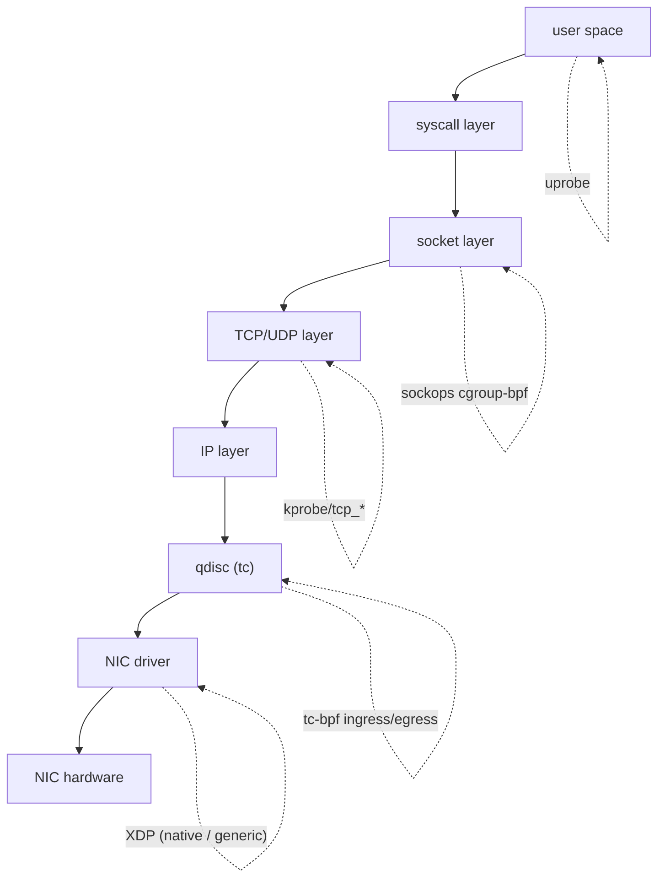

# 課堂 2.5 — eBPF 入門：Linux 的可程式化革命

## 學前知道

- **前置課**：[2.1 epoll](./2.1-select-poll-epoll.md)、[2.2 io_uring](./2.2-io-uring.md)、[2.4 kTLS](./2.4-ktls.md)（理解 kernel-side programmable hook 為何 transformative）
- **預計閱讀時間**：60~80 分鐘
- **必讀文獻**：
  - **McCanne & Jacobson — The BSD Packet Filter: A New Architecture for User-level Packet Capture** (USENIX Winter 1993) ⭐⭐ — BPF 創始論文。已抓 `assets/papers/usenix-1993-mccanne-bpf.pdf`。**今天 eBPF 用的 register VM 直系源頭**
  - **Starovoitov — eBPF / extended BPF patch series** (lkml 2013-2014) — 沒有正式論文。Alexei Starovoitov 把 BPF 從 packet filter 演化成 general-purpose in-kernel VM 的 patch 訊息
  - **Borkmann et al. — Cilium and Beyond** (LPC 各年) — Cilium 主導 eBPF 在 networking 的工程化推廣
  - **Vieira et al. — Fast Packet Processing with eBPF and XDP: Concepts, Code, Challenges, and Applications** (ACM CSUR 2020) — 系統 survey
  - **Brendan Gregg — *BPF Performance Tools*** (Addison-Wesley 2019) — observability 經典教科書
- **必讀原始碼**：
  - `kernel/bpf/`：verifier、JIT 入口、core helper
  - `kernel/bpf/verifier.c`：超複雜，6.x ~25000 行——eBPF 安全保證的核心
  - `kernel/bpf/core.c`：interpreter + verifier 入口
  - `arch/x86/net/bpf_jit_comp.c`：x86 JIT
  - `tools/lib/bpf/`：libbpf（user-space loader）
  - `tools/bpf/bpftool/`：CLI tool
- **必讀生態系**：
  - **libbpf**：https://github.com/libbpf/libbpf — 標準 user-space loader
  - **bpftool**：kernel source tree 內
  - **bpftrace**：https://github.com/bpftrace/bpftrace — DTrace-like ad-hoc tracing
  - **BCC (BPF Compiler Collection)**：https://github.com/iovisor/bcc — 較舊，已被 libbpf-CO-RE 取代但仍流行
  - **Cilium**：https://cilium.io — 大型 eBPF networking project

---

## 動機

> 為什麼學 eBPF 是 2026 系統工程師的「basic literacy」

eBPF (extended Berkeley Packet Filter) 已從 1993 的 packet filter 演化成 **Linux kernel 的 universal programmability 機制**。你能在以下位置塞自己的小程式：

- **Networking**：TC ingress/egress、XDP（driver hook，2.7 講）、socket lookup、cgroup/sockops、kTLS 路徑
- **Tracing**：kprobe（任意 kernel 函式）、uprobe（user-space 函式）、tracepoint、perf event
- **Security**：LSM hook（替代 SELinux/AppArmor）、seccomp filter
- **Storage**：fuse-bpf、IO scheduler

對 Proteus 的具體相關性：

1. **packet-level monitoring 與 debug**：proxy 在 production 出問題，傳統 strace / tcpdump 太慢或漏掉。eBPF 能在 hot path 0 overhead 跑 instrumentation
2. **協議混淆驗證**：寫一個 eBPF program 在 server NIC 上掃出口 packet 的 entropy / size distribution，**檢驗我們協議是否真的隨機化**
3. **客戶端側可能用 eBPF 做透明代理**：替代 iptables redirect，**zero copy**
4. **SO_ATTACH_REUSEPORT_EBPF**：把 Proteus server worker load balancing 邏輯用 eBPF 客製化（[2.1 §7 提到](./2.1-select-poll-epoll.md#7-驚群問題thundering-herd)）
5. **GFW 對手陣營也用 eBPF**：[2.6](./2.6-ebpf-network.md) 會講 GFW 早期 ipset / iptables、現在傾向 BPF-based filtering。**你要懂他們的工具**

本堂講 eBPF **作為一個 framework** 的內部：VM、verifier、JIT、map、CO-RE。下一堂專講 networking-specific hook。

---

## 核心概念

### 1. 從 BPF 到 eBPF：30 年演化

#### 1993 cBPF (Classic BPF, McCanne-Jacobson)

McCanne 1993 USENIX paper 提出的 BPF：

- **64-bit register VM**：原版 32-bit，後來擴成 64-bit
- 用途**單一**：packet filter，給 `tcpdump` 用
- 程式由 user 編譯成 BPF bytecode、`setsockopt(SO_ATTACH_FILTER)` 給 socket
- kernel 用 **解釋器** 跑 bytecode
- 安全性靠「instruction 數量 < 4096」+ 「絕對 jump 才能 backward」幾條簡單規則

關鍵 idea（仍適用今天 eBPF）：

1. **register-based VM**（不是 stack-based 如 JVM）——快、易 JIT
2. **packet 在記憶體裡固定位址，BPF program 拿 offset load**
3. **靜態驗證確保 termination + safety**

#### 2014 eBPF (Alexei Starovoitov)

Starovoitov 把 BPF 重做：

| 維度 | cBPF | eBPF |
|---|---|---|
| 暫存器 | 2 個 | 10 個（R0-R9）+ R10 frame pointer |
| 暫存器寬度 | 32-bit | 64-bit |
| 指令集 | ~30 個 op | ~150 個 op（含 atomic / call / 32/64-bit mix） |
| Hook 點 | 只 socket filter | 30+ 種 |
| Maps | 無 | key-value, hash/array/lru/percpu/... |
| Helper functions | 無 | 200+ 個 kernel-exposed function |
| Calling other BPF programs | 無 | tail call、function call |
| 安全保證 | 簡單規則 | 整套 verifier（abstract interpretation） |
| JIT | 部分平台 | 全平台主流 |
| User loader | libpcap | libbpf + CO-RE |

**設計哲學**：把 BPF 變成「**安全的 kernel module**」——你能寫 kernel 內運行的程式，**但 kernel 必須先靜態證明它不會 panic、不會 leak memory、不會 infinite loop**。

### 2. eBPF 指令集架構（ISA）

eBPF ISA 文件：[`Documentation/networking/filter.rst`](https://www.kernel.org/doc/Documentation/networking/filter.txt)、現代版 [IETF draft for eBPF ISA](https://datatracker.ietf.org/doc/draft-ietf-bpf-isa/)（標準化進行中）。

#### 10 個 64-bit 暫存器

```
R0      : function return value, exit code
R1-R5   : function arguments (per ABI)
R6-R9   : callee-saved
R10     : read-only frame pointer (stack)
```

對應 x86_64 / ARM64 calling convention。Stack 大小 512 byte 上限。

#### 指令格式（64-bit fixed-width）

```
+-------+------+------+--------+---------+
| 8 bit | 4 b. | 4 b. | 16 bit | 32 bit  |
| opcode|  dst |  src | offset | imm     |
+-------+------+------+--------+---------+
```

opcode 編碼：

- 0x07: `BPF_ALU64 | BPF_ADD | BPF_K` → `dst += imm`
- 0x0f: `BPF_ALU64 | BPF_ADD | BPF_X` → `dst += src`
- 0x18: `BPF_LD | BPF_DW | BPF_IMM` → 64-bit imm load (2-instruction wide)
- 0x85: `BPF_JMP | BPF_CALL | 0` → call helper
- 0x95: `BPF_JMP | BPF_EXIT | 0` → return R0

完整列表見 `include/uapi/linux/bpf.h`。

#### 範例：load 一個 word 從 skb offset 14

```
0x71 0x12 0x00 0x0e 0x00000000   # ldxb r1 = *(u8 *)(r2 + 14)
```

對應 packet filter 抓 Ethernet header 之後第 1 byte（通常是 IP version+IHL）。

### 3. Verifier：eBPF 的安全保證來源

整個 eBPF 設計能允許「user 寫 code 跑進 kernel」是因為 **verifier**。

#### 工作原理

1. **CFG 建構**：把 bytecode parse 成 control flow graph，分 basic block
2. **靜態確保**：
   - 程式有界（最多 100 萬指令、4096 stack frame，6.x 已大幅放寬）
   - 沒有 back-edge（無 loop，6.x 已有 bounded loop / iter 例外）
   - 沒有 unreachable code
   - 所有 jump target 在程式內
3. **Abstract interpretation**：
   - 對每個程式點，追蹤每個暫存器/堆疊位置可能的值 **range / type**
   - Type 包含：`SCALAR_VALUE`、`PTR_TO_MAP_VALUE`、`PTR_TO_CTX`（packet ptr）、`PTR_TO_STACK`、`PTR_TO_PACKET`、`PTR_TO_PACKET_END`、`CONST_PTR_TO_MAP`、`PTR_TO_SOCKET`、`PTR_TO_TCP_SOCK` 等 ~30 種
4. **記憶體存取規則**：
   - 對 `PTR_TO_PACKET` 必須先比較 `pkt_end` 確認 in-bound
   - 對 `PTR_TO_MAP_VALUE` 必須 null-check（map lookup 可能回 null）
   - 對 stack 必須在 0-512 byte 範圍

#### 經典例子：packet bound check

```c
SEC("xdp")
int prog(struct xdp_md *ctx) {
    void *data = (void *)(long)ctx->data;
    void *end  = (void *)(long)ctx->data_end;

    struct ethhdr *eth = data;
    if ((void *)(eth + 1) > end)   // ← verifier 強制這行
        return XDP_DROP;
    // 現在 verifier 知道 eth+sizeof(ethhdr) 都在 packet 內，可安全 load

    if (eth->h_proto != htons(ETH_P_IP))
        return XDP_PASS;
    // ...
}
```

**忘了 bound check** → verifier reject，loader 失敗。

#### Verifier 的「pruning」與「精度」

verifier 是 path-sensitive：每條路徑都 simulate。對 50 條 if-else 的程式有 $2^{50}$ 條路徑，會炸。

**Pruning**：如果兩個程式狀態「等價」（暫存器 type + range 全部相容），verifier 只走一條。這把 path explosion 控制住。

**精度損失**：某些情況 verifier 比實際弱，會 reject 你寫得「明顯沒問題」的 code。eBPF 圈子的笑話：「**我跟 verifier 之間是一場永恆的鬥智**」。

Linux 6.x verifier 加了 [bounded loops](https://lwn.net/Articles/794934/)、[bpf_loop helper](https://lwn.net/Articles/877062/)、[iterator pattern (bpf_iter)](https://lwn.net/Articles/810998/)——逐步把 expressive power 拉滿。

### 4. JIT：bytecode → native code

verifier pass 後，kernel 把 bytecode JIT 成 native（x86_64 / ARM64 / RISC-V / s390 等）。

```
// 看當前 kernel JIT 行為
sysctl net.core.bpf_jit_enable      # 1 = enable, 2 = enable + log
cat /proc/sys/net/core/bpf_jit_harden  # 0/1/2 = JIT spectre mitigation
```

JIT 後 BPF program 是「**真正的 native 函式**」，沒有 interpreter overhead。Helper call 是 indirect call 到 kernel function。

效能對比：解釋器版本約 10-20 ns/instruction，JIT 後 ~1-2 ns/instruction。XDP 場景 line rate (>10M pps) 必須 JIT。

#### Spectre / side-channel 緩解

eBPF 一度被當 spectre v1 attack vector（user 可寫 bound-check-pass 但 speculative 越界的程式）。`bpf_jit_harden=2` 模式會 mask 暫存器索引、隨機化 immediate value，付一點 perf 換 security。

### 5. Maps：user-space ↔ kernel 共享資料結構

eBPF program 是 stateless 的——但你要 state？用 **map**：kernel data structure，**user space 跟 BPF program 都能讀寫**。

#### Map 類型（精選，總共 ~30 種）

| Type | 適用 |
|---|---|
| `BPF_MAP_TYPE_HASH` | 任意 key/value hash table |
| `BPF_MAP_TYPE_ARRAY` | 固定大小 array，index 0..N-1 |
| `BPF_MAP_TYPE_PERCPU_HASH` | 每 CPU 一份，避免 lock |
| `BPF_MAP_TYPE_PERCPU_ARRAY` | 同 |
| `BPF_MAP_TYPE_LRU_HASH` | 帶 LRU eviction 的 hash |
| `BPF_MAP_TYPE_PROG_ARRAY` | 存 BPF program fd，用於 tail call |
| `BPF_MAP_TYPE_PERF_EVENT_ARRAY` | 把 event push 給 user-space ring buffer |
| `BPF_MAP_TYPE_RINGBUF` | 5.8+ 新一代 ring buffer（取代 perf event array） |
| `BPF_MAP_TYPE_SOCKHASH` / `SOCKMAP` | 存 socket pointer，給 sockmap redirect |
| `BPF_MAP_TYPE_DEVMAP` | XDP redirect 用，存 netdev pointer |
| `BPF_MAP_TYPE_CPUMAP` | XDP redirect 到指定 CPU |
| `BPF_MAP_TYPE_XSKMAP` | AF_XDP socket map |

#### Map API（kernel-side）

```c
struct {
    __uint(type, BPF_MAP_TYPE_HASH);
    __uint(max_entries, 1024);
    __type(key, u32);
    __type(value, u64);
} stats SEC(".maps");

SEC("xdp")
int prog(struct xdp_md *ctx) {
    u32 key = 0;
    u64 *cnt = bpf_map_lookup_elem(&stats, &key);
    if (cnt) __sync_fetch_and_add(cnt, 1);
    return XDP_PASS;
}
```

User space 同樣用 `bpf()` syscall 讀寫 map。**user/kernel state sharing 的標準介面**。

#### Ring buffer（5.8+，現代首選）

```c
// kernel side
struct {
    __uint(type, BPF_MAP_TYPE_RINGBUF);
    __uint(max_entries, 1 << 24);   // 16MB
} events SEC(".maps");

SEC("kprobe/tcp_sendmsg")
int trace(struct pt_regs *ctx) {
    struct event *e = bpf_ringbuf_reserve(&events, sizeof(*e), 0);
    if (!e) return 0;
    e->pid = bpf_get_current_pid_tgid() >> 32;
    bpf_ringbuf_submit(e, 0);
    return 0;
}
```

User space 用 `ring_buffer__poll` 取 event。比 `BPF_MAP_TYPE_PERF_EVENT_ARRAY` 更快、更乾淨。

### 6. Helper functions：BPF 程式能呼叫的 kernel API

verifier 強制 BPF 程式不能直接呼叫任意 kernel function，但 kernel 提供了一組 white-listed helper：

完整列表（200+）見 `include/uapi/linux/bpf.h::BPF_FUNC_*` 與 `man 7 bpf-helpers`。

精選：

| Helper | 作用 |
|---|---|
| `bpf_map_lookup_elem / update / delete` | map 操作 |
| `bpf_ktime_get_ns` | 取 monotonic time |
| `bpf_get_current_pid_tgid` | 當前 PID/TID |
| `bpf_get_current_comm` | 當前 process name |
| `bpf_perf_event_output` | 送 event 給 user |
| `bpf_ringbuf_*` | ring buffer 操作 |
| `bpf_redirect` | XDP/TC packet redirect |
| `bpf_clone_redirect` | clone + redirect |
| `bpf_skb_load_bytes / store_bytes` | skb 讀寫 |
| `bpf_l3_csum_replace / l4_csum_replace` | checksum 增量更新 |
| `bpf_setsockopt / getsockopt` | sockops hook 內調整 socket option |
| `bpf_tcp_check_syncookie / gen_syncookie` | SYN cookie DDoS 防禦 |
| `bpf_sk_lookup_tcp / udp` | 由 4-tuple 查 socket |

⭐ **Proteus 用得到的 helper**：`bpf_sk_lookup_*`、`bpf_setsockopt`（動態調 TCP option）、`bpf_redirect`（XDP DDoS filter）、`bpf_ringbuf_*`（low-overhead telemetry）。

### 7. kfuncs：modern helper 替代（6.x trend）

舊式 helper 透過 number 呼叫（`BPF_FUNC_xxx`），擴展要改 UAPI。新趨勢 **kfunc**：

```c
// kernel registers a function as BPF-callable
extern __u64 bpf_tcp_iter_skip(...) __ksym;
```

BPF program 用 `__ksym` 宣告外部符號，loader 解析 → kernel function 直接 call。**比 helper 靈活**，不要 UAPI 改動。

對 BPF program 作者：6.x 起寫的新 BPF 大量用 kfunc，比 helper 直觀。

### 8. Hook 點全景



按 program type 分（30+ 種）：

- **Tracing**：`KPROBE` / `KRETPROBE` / `UPROBE` / `TRACEPOINT` / `RAW_TRACEPOINT` / `FENTRY` / `FEXIT` / `LSM`
- **Networking**：`SOCKET_FILTER` / `SCHED_CLS (tc)` / `SCHED_ACT` / `XDP` / `SK_LOOKUP` / `SK_SKB` / `SK_MSG` / `CGROUP_SOCK` / `CGROUP_SOCKOPT` / `SOCK_OPS` / `LWT_*` / `FLOW_DISSECTOR`
- **Security**：`LSM` / `CGROUP_DEVICE` / `LIRC_MODE2`
- **Other**：`PERF_EVENT` / `STRUCT_OPS` / `EXT` / `SYSCALL`

[2.6 eBPF 進階](./2.6-ebpf-network.md) 專講 networking-relevant hooks。

### 9. CO-RE：跨 kernel 版本的可攜性

eBPF program 讀 kernel struct 欄位（例如 `tcp_sock->snd_cwnd`），但 **struct 跨版本可能變化**。傳統做法是 BCC：把 kernel header include 進 BPF source、編譯時連動 host kernel。**部署煩**——每台機器版本不同。

**CO-RE (Compile Once, Run Everywhere)**（2019 起）：

1. clang 編譯 BPF 時用 BTF (BPF Type Format)，記錄「我想存取 struct X 的 field Y」
2. kernel 有自己的 BTF（記錄 self struct layout）
3. libbpf load BPF 時 **relocate**：根據 host kernel BTF，修正欄位 offset

實際寫法：

```c
#include "vmlinux.h"   // 自動產生的 kernel BTF dump

SEC("kprobe/tcp_sendmsg")
int trace(struct pt_regs *ctx) {
    struct sock *sk = (struct sock *)PT_REGS_PARM1(ctx);
    u16 sport = BPF_CORE_READ(sk, __sk_common.skc_num);
    // ↑ BPF_CORE_READ 做 CO-RE relocation
    return 0;
}
```

`vmlinux.h` 用 `bpftool btf dump file /sys/kernel/btf/vmlinux format c > vmlinux.h` 產生。

**結果**：BPF object 編一次，部署到不同 kernel 版本都跑——這是 production eBPF 的關鍵。

#### kernel BTF 啟用

```bash
cat /sys/kernel/btf/vmlinux | head -c 64 | xxd   # 看是否存在
# 預設啟用：CONFIG_DEBUG_INFO_BTF=y
```

主流 distro（Ubuntu 20.04+、Debian 11+、RHEL 8.6+）已預設帶 BTF。某些 minimal kernel（OpenWrt、嵌入式）沒有，eBPF + CO-RE 在那邊不能用。

### 10. 工具鏈：bpftrace / BCC / libbpf

| 工具 | 用途 | 學習曲線 |
|---|---|---|
| **bpftrace** | one-liner、ad-hoc tracing | 低 |
| **BCC (Python)** | 中型 tracer，附帶 ~100 個範例 | 中 |
| **libbpf + CO-RE (C)** | production-grade，部署友善 | 高 |
| **Rust libbpf-rs / Aya** | Rust 寫 BPF + user loader | 中（如熟悉 Rust） |
| **Go ebpf-go** | Cilium 維護的 Go binding | 中 |

#### bpftrace 範例

```bash
# 量 tcp_sendmsg 每次發送 size 分布
sudo bpftrace -e 'kprobe:tcp_sendmsg { @ = hist(arg2); }'

# 看誰在執行 ls
sudo bpftrace -e 'tracepoint:syscalls:sys_enter_execve /str(args->filename) == "/usr/bin/ls"/ { printf("%s pid %d\n", comm, pid); }'

# Proteus specific: 看 SO_REUSEPORT eBPF program 被觸發
sudo bpftrace -e 'kprobe:reuseport_select_sock { @ = count(); }'
```

#### libbpf-CO-RE 範例（生產用）

```bash
# 編譯 BPF
clang -target bpf -O2 -c trace.bpf.c -o trace.bpf.o
# Skeleton 自動生成
bpftool gen skeleton trace.bpf.o > trace.skel.h
# user-space loader 連到 skeleton
gcc loader.c -lbpf -o loader
```

```c
// loader.c
#include "trace.skel.h"
int main() {
    struct trace_bpf *skel = trace_bpf__open();
    trace_bpf__load(skel);
    trace_bpf__attach(skel);

    // 設定 ring buffer poller
    struct ring_buffer *rb = ring_buffer__new(
        bpf_map__fd(skel->maps.events), handle_event, NULL, NULL);
    while (1) ring_buffer__poll(rb, 100);
}
```

### 11. eBPF 開發環境（macOS 上的 cross-development）

macOS **不能跑 eBPF**（kernel 不支援），但可以**寫 + cross-compile**：

```bash
# 用 Lima / OrbStack 開 Linux VM
orbctl create --machine my-bpf

# host (macOS) 上裝 clang
brew install llvm   # clang 帶 BPF target

# 編譯
clang -target bpf -O2 -c trace.bpf.c

# scp 到 VM 跑
```

我們的 dev workflow 在 [Part 0.5 tooling](../part-0-orientation/0.5-tooling.md) 已備好，OrbStack + mise 的組合直接可用。

---

## 與我們協議設計的關聯

1. **Observability**：Proteus server 內建一組 eBPF telemetry probe（tcp_sendmsg 量、retransmit 計數、connection age 分布）。Production debug 必備
2. **抗指紋檢驗**：寫 eBPF 抓出口 packet，量 entropy / size 分布、紀錄 inter-packet gap。**驗證 Proteus 真的隨機**。比 tcpdump + 後處理快 1000 倍
3. **SO_ATTACH_REUSEPORT_EBPF**：自訂 connection 分配策略（per-client-IP 親和 / 動態 worker weighting）
4. **Sockmap 加速 proxy**：對 plaintext fallback mode，用 sockmap + sk_msg redirect 把 socket-to-socket forward 移進 kernel。**0 user-space**——但加密讓這條對 Proteus 不適用，留作 baseline 對比
5. **DDoS 防禦**：XDP-based SYN flood filter（[2.7 講](./2.7-xdp.md)），保護 Proteus server
6. **客戶端 transparent proxy**：用 cgroup-bpf + sock_redirect 做 macOS / Linux 透明代理。比 iptables redirect 高性能
7. **GFW 對手分析**：理解 eBPF 也是理解「GFW 怎麼可能更智能」的前提

---

## 動手

### 實驗 A：bpftrace 量 TCP 重傳

```bash
sudo bpftrace -e '
tracepoint:tcp:tcp_retransmit_skb {
    @retx[comm] = count();
}
interval:s:5 {
    print(@retx);
    clear(@retx);
}
'
```

跑 5 秒一次，看哪個 process 在 retransmit。**1 行就能寫 production-grade tracer**。

### 實驗 B：寫一個 minimal XDP 程式（hello world）

```c
// drop.bpf.c
#include <linux/bpf.h>
#include <bpf/bpf_helpers.h>

SEC("xdp")
int drop_all(struct xdp_md *ctx) {
    return XDP_DROP;
}

char LICENSE[] SEC("license") = "GPL";
```

編譯 + attach：

```bash
clang -target bpf -O2 -c drop.bpf.c -o drop.bpf.o
sudo bpftool prog loadall drop.bpf.o /sys/fs/bpf/drop
sudo bpftool net attach xdp pinned /sys/fs/bpf/drop dev eth0
```

注意：**會掛網路**！在 VM / netns 內測。  
解開：`sudo bpftool net detach xdp dev eth0`。

### 實驗 C：libbpf-CO-RE 寫一個 tcp_sendmsg tracer

跟著 [libbpf-bootstrap](https://github.com/libbpf/libbpf-bootstrap) examples 走一遍。能讓你完全理解 BPF skeleton + CO-RE + ring buffer 整套工程。

### 實驗 D：用 BPF 觀察自己 Proteus prototype 的封包大小分布

到 Part 12 寫 prototype 時，每次 commit 用：

```bash
sudo bpftrace -e '
kfunc:tcp_sendmsg /pid == ARG_PID/ {
    @send_size = hist(args->size);
}
END { printf("Send size distribution:\n"); print(@send_size); }
'
```

驗證隨機化是否有效——這是 Proteus 抗指紋的關鍵 self-test loop。

---

## 自我檢查

1. 為什麼 eBPF 必須有 verifier 而不是直接信任 user code？舉一個若無 verifier 會發生的災難
2. cBPF 跟 eBPF 在 VM 設計上的關鍵差異？暫存器數量、寬度、map、helper 各自加在哪一代？
3. verifier 的「pruning」 vs 「精度」trade-off 是什麼？為什麼 6.x 加 bounded loop 是 expressive power 的大進展？
4. CO-RE 解決什麼問題？為什麼舊 BCC 在 production 部署痛苦？
5. `bpf_map` 跟 `bpf_ringbuf` 都是 BPF map type，後者比 perf event array 好在哪？
6. BPF 為什麼是「**安全的 kernel module**」？跟傳統 `.ko` 載入的安全模型有什麼根本不同？
7. helper 跟 kfunc 的差別？為什麼 6.x trend 偏向 kfunc？
8. Proteus server 若想 measure「每條 connection 收/發 byte 數」，用 BPF 的哪一個 hook + map type 最合適？寫 pseudocode

---

## 延伸閱讀

- **eBPF 官方學習路徑**：https://ebpf.io/what-is-ebpf/
- **libbpf-bootstrap**：https://github.com/libbpf/libbpf-bootstrap — 必跑
- **Brendan Gregg — eBPF 文章群**：https://www.brendangregg.com/ebpf.html
- **Cilium docs**：https://docs.cilium.io/ — 大型 production eBPF
- **LWN BPF 系列**：太多了，搜 "bpf" 你會看到 200+ 篇
- **eBPF foundation**：https://ebpf.foundation/
- **Aya book (Rust BPF)**：https://aya-rs.dev/book/
- **`man 2 bpf`、`man 7 bpf-helpers`**

---

## 研究級補遺

### 1. 學界詞彙

| 中文/口語 | 學界正名 | 出處 |
|---|---|---|
| BPF 虛擬機 | register-based abstract machine | McCanne 1993 |
| eBPF verifier | sound static analyzer (abstract interpretation) | Gershuni et al. PLDI 2019 |
| program type | BPF program family | Linux UAPI |
| Map | key-value associative state | eBPF docs |
| CO-RE | Compile Once Run Everywhere | Nakryiko (Facebook) 2019 |
| kfunc | BTF-typed kernel function callable from BPF | 6.x Linux |
| BTF | BPF Type Format (debug info subset) | Linux 5.x |
| Tail call | indirect BPF program call | Linux 4.2 |
| Trampoline | dynamic dispatch wrapper for fentry/fexit | Linux 5.5 |

### 2. 對手分類學：BPF 在攻防雙方的角色

| 角色 | 防方用途 | 攻方用途 |
|---|---|---|
| Kernel-level monitoring | DDoS detection、IDS | rootkit hiding (`tracee` 級 detector vs reverse) |
| Packet manipulation | XDP firewall | XDP-based MITM、packet injection |
| Tracing | observability | process credential modification |
| Filtering | seccomp profile | bypass via map manipulation |

eBPF 是 **dual-use** 技術。security research 必看：

- **Pawan Gupta — eBPF rootkit techniques**
- **Aqua Security `tracee`** — eBPF-based runtime security
- **Falco** — CNCF runtime security，部分 BPF

**對 GFW 的 implication**：GFW 早期靠 `iptables -m string` 之類 user-space pattern match。eBPF 帶來新可能——`SKB_PROGRAM_TYPE_FLOW_DISSECTOR` 能在 packet 進 stack 前 inline 抽取特徵。**雖然中國 ISP 設備未公開用 eBPF，但學界已有 GFW 級 packet classification with eBPF 的論文**——這對我們設計抗封鎖協議是 forward-looking concern。

### 3. 形式化定義：verifier 的 soundness 與 incompleteness

定義：對 BPF program $P$，verifier 接受集合 $\mathcal{V}(P)$，安全程式集合 $\mathcal{S}(P)$（不會 panic / leak / hang）。

- **Soundness**: $\mathcal{V}(P) \subseteq \mathcal{S}(P)$（所有 verifier accept 的程式都安全）
- **Completeness**: $\mathcal{S}(P) \subseteq \mathcal{V}(P)$（所有安全程式都被 accept）

eBPF verifier **sound but incomplete**：會 reject 一些實際安全的程式（比如某些複雜 loop）。每次 kernel release 都在「**增加 completeness 同時保持 soundness**」。

關鍵 reference：**Gershuni et al. — Simple and Precise Static Analysis of Untrusted Linux Kernel Extensions** (PLDI 2019) — 第一篇形式化 eBPF verifier 的 paper。

### 4. 領域的關鍵論文 / 規格

- **McCanne & Jacobson 1993** ⭐⭐ — BPF 創始，已抓
- **Gershuni et al. PLDI 2019** ⭐ — verifier 形式化
- **Vieira et al. CSUR 2020** — eBPF + XDP survey
- **Borkmann et al.** — Cilium / kernel network performance 一系列
- **Nakryiko blogs** — CO-RE / BTF 一手作者
- **Linux Documentation/bpf/** — kernel 內 spec
- **IETF eBPF ISA draft** — 標準化中

### 5. 我們協議的座標 / 設計取捨

| 設計問題 | 本堂收窄了什麼 | 仍 open |
|---|---|---|
| Observability stack | **eBPF-first**（不靠 strace / tcpdump） | bpftrace ad-hoc vs libbpf-CO-RE production 比例 |
| Connection 分配 | SO_ATTACH_REUSEPORT_EBPF 可開 | 分配策略（per-client-IP、per-CPU-load） |
| Plaintext proxy fast-path | sockmap redirect 可考慮（但 Proteus 加密，不適用） | benchmark mode 開放 |
| DDoS 防禦 | XDP filter 在 server | rate limit / SYN cookie 策略 |
| Cross-platform 一致性 | macOS 不能跑 eBPF —— observability 雙軌（Linux: BPF, macOS: dtrace/instruments） | macOS 觀測能多深 |

### 6. 必追資源 / 社群入口

- **eBPF Summit** 每年（virtual + onsite）
- **Linux Plumbers Conference** BPF microconference
- **netdev conferences**
- **Cloudflare blog** BPF tag
- **Cilium / Isovalent blog**
- **LWN BPF series**
- **`bpf@vger.kernel.org`** mailing list
- **kernel.org BPF docs**

### 7. 開放問題（research-level）

1. **Verifier completeness 的硬上限**：能否設計一個「completeness 更高」的 verifier 同時保持 sound？這是 PL/formal-method 真正研究主題
2. **eBPF in-kernel custom AEAD**：能否寫 ChaCha20 in BPF？需要 verifier 支援高 instruction 數 + SIMD-like ops。對 Proteus 是 future win（kernel 內加密但自訂 cipher）
3. **eBPF 跨 OS port**：Microsoft eBPF for Windows 已開源。能否定義一個 portable eBPF spec 讓 Proteus 共用一份 BPF 程式跨 Linux/Windows？IETF 在做
4. **eBPF + io_uring 結合**：CQE post-process by BPF？目前不支援，是 future direction
5. **Verifier 對 Proteus 設計的 implication**：若 Proteus 用 eBPF observability，verifier reject 我們的 program 就 deploy 失敗。需要 verifier-friendly coding pattern 體系——這對工業 eBPF 普及是真實 friction

> ⭐ 第 2 條 **eBPF in-kernel custom AEAD** 是 Proteus push 頂會的乾淨副產出方向。

---

## 對下一堂的鋪墊

本堂講了 eBPF 的「**作為 framework**」一面（VM / verifier / JIT / map / CO-RE）。下一堂 [2.6 eBPF 進階：對網路的意義](./2.6-ebpf-network.md) 鎖定 **networking-specific hook**：TC、socket filter、sockops、sockmap、cgroup-bpf、SO_ATTACH_REUSEPORT_EBPF。重點：**這些 hook 對 Proteus 有什麼真實用法**。

2.7 講 XDP（更激進的 driver-level hook），2.6 是中間鋪墊。
