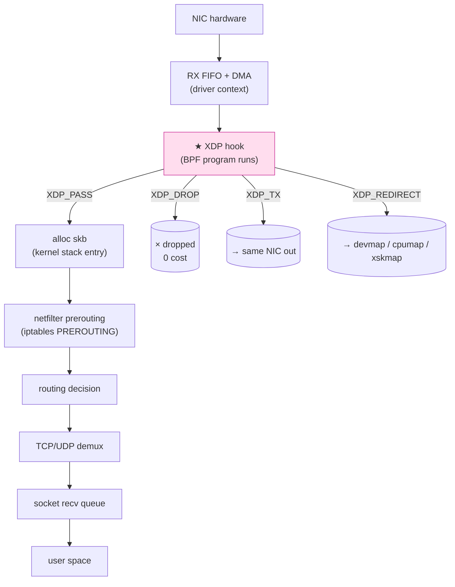
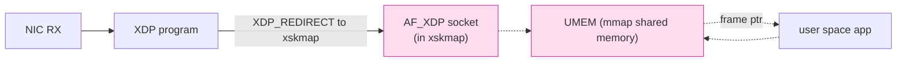

# 課堂 2.7 — XDP：在驅動層處理封包

## 學前知道

- **前置課**：[2.5 eBPF 入門](./2.5-ebpf-intro.md)、[2.6 eBPF 進階：對網路的意義](./2.6-ebpf-network.md)
- **預計閱讀時間**：60~80 分鐘
- **必讀論文**：
  - **Høiland-Jørgensen, Brouer, Borkmann, Fastabend, Herbert, Ahern, Miller — The eXpress Data Path: Fast Programmable Packet Processing in the Operating System Kernel** (CoNEXT 2018) ⭐⭐⭐ — 已抓 `assets/papers/conext-2018-xdp.pdf` + 簡報版 `conext-2018-xdp-slides.pdf`。**XDP 設計的官方論文**，每個 Proteus 系統工程師必精讀（Keshav 三遍法）
  - **Brouer & Høiland-Jørgensen — XDP — Challenges and Future Work** (Linux Plumbers 2018) — 補充未來工作
  - **Cilium docs — XDP datapath**：https://docs.cilium.io/en/latest/network/ebpf/intro/
  - **Cloudflare — How to drop 10M packets per second** (2018 blog) — 對比 iptables / nftables / XDP 防 DDoS
  - **Karlsson & Töpel — The Path to DPDK Speeds for AF_XDP** (Linux Plumbers 2018) — AF_XDP 設計
- **必讀原始碼**：
  - `net/core/dev.c::netif_receive_skb_core` 與 `bpf_prog_run_xdp`：XDP 在 packet path 的呼叫點
  - `kernel/bpf/cpumap.c`、`kernel/bpf/devmap.c`：XDP redirect 機制
  - `net/xdp/xsk.c`：AF_XDP socket
  - `drivers/net/ethernet/intel/ixgbe/ixgbe_main.c::ixgbe_clean_rx_irq`：典型 driver XDP hook
- **必讀生態系**：
  - **xdp-tools**：https://github.com/xdp-project/xdp-tools — official utilities
  - **xdp-tutorial**：https://github.com/xdp-project/xdp-tutorial — 必跑
  - **Cilium**、**Cloudflare unimog**、**Facebook Katran** — 大型 XDP production

---

## 動機

> XDP 是 Linux 在「不放棄 stack 完整性」的前提下，達到「**DPDK 級線速**」的官方答案

[2.6](./2.6-ebpf-network.md) 講的 TC eBPF 性能上限 ~5-10 Mpps（百萬封包/秒）。但對 10 GbE / 100 GbE NIC，**小封包 line rate 是 14.88 Mpps / 148.8 Mpps**。光是「**為了 drop 一個壞封包進到 stack 一遍**」就會 CPU 爆掉。

DPDK ([2.8](./2.8-dpdk.md) 講) 解這個問題的方式是「**bypass kernel**」——整條 stack 不用。但 trade-off 重：

- 失去 kernel 路由 / 防火牆 / TCP stack
- 必須獨佔 NIC（其他 process 不能用）
- 必須整個 application rewrite 用 DPDK API

**XDP 找了第三條路**：

- packet 在 driver 還沒進 kernel stack 時，**先跑 eBPF program**
- BPF 決定 verdict：`DROP` / `PASS` / `TX (返送)` / `REDIRECT`
- `PASS` 走完整 kernel stack（沒影響）
- `DROP` 在最早階段丟，**完全不進 stack**
- `REDIRECT` 送到另一張 NIC 或另一個 CPU 或 AF_XDP socket

⭐ XDP **設計目標**：「不放棄 kernel 的兼容性，又達到 DPDK 級的 drop / forward 性能」。

Høiland-Jørgensen 2018 CoNEXT 論文證明：**單 core 24 Mpps**——這已經超越 iptables 10x，並且 DPDK 也只有 ~30 Mpps，差距很小。

對 Proteus 的具體用法：

1. **server DDoS 防禦第一線**：SYN flood、UDP amplification、botnet abuse 的封包在 XDP 階段直接 drop
2. **packet inspection without overhead**：在 driver 階段抽 fingerprint，**0 stack overhead**
3. **AF_XDP**（zero-copy user-space recv）：把所有 inbound packet 用 mmap ring 餵 user-space，可用於 Proteus 自訂協議處理（替代 io_uring recv）
4. **客戶端 transparent proxy 的「inbound redirect」對應物**：[2.6](./2.6-ebpf-network.md) 講的 cgroup connect4 是 outbound side。XDP 是 inbound side
5. **GFW 也用 XDP**：學界已證實可行——理解 XDP 才能評估 GFW 升級空間

---

## 核心概念

### 1. XDP 在 packet path 的位置



⭐ **關鍵**：XDP 在 **skb 還沒 alloc** 之前跑。skb 一旦 alloc，per-packet metadata（時間戳、conntrack、netfilter state）就要算——這是 stack 大頭 overhead。XDP `DROP` 直接 free 那個 page，**完全不 alloc skb**。

### 2. XDP program 結構

```c
#include <linux/bpf.h>
#include <bpf/bpf_helpers.h>

SEC("xdp")
int my_prog(struct xdp_md *ctx) {
    void *data     = (void *)(long)ctx->data;
    void *data_end = (void *)(long)ctx->data_end;

    // verifier 強制 bound check
    struct ethhdr *eth = data;
    if ((void *)(eth + 1) > data_end)
        return XDP_DROP;

    if (eth->h_proto == bpf_htons(ETH_P_IP)) {
        struct iphdr *ip = (void *)(eth + 1);
        if ((void *)(ip + 1) > data_end)
            return XDP_DROP;

        // 範例：drop 任何 protocol = ICMP 的封包
        if (ip->protocol == IPPROTO_ICMP)
            return XDP_DROP;
    }

    return XDP_PASS;
}

char LICENSE[] SEC("license") = "GPL";
```

#### Verdict 完整列表

| Verdict | 意義 |
|---|---|
| `XDP_PASS` | 繼續走 stack（變成 skb） |
| `XDP_DROP` | 丟棄，page 回 driver pool |
| `XDP_TX` | 從**同一張** NIC 送出（用於 echo / NAT reflection） |
| `XDP_REDIRECT` | 透過 helper redirect 到別處（另一張 NIC、CPU、AF_XDP socket） |
| `XDP_ABORTED` | exception path（程式有 bug，會記 trace） |

`XDP_REDIRECT` 之前必須先呼叫對應 helper：

```c
bpf_redirect(ifindex, 0);   // 重 direct 到指定 interface
// 或
bpf_redirect_map(&devmap, idx, 0);   // map-based redirect (faster)
```

### 3. XDP 三種 mode

| Mode | 何處跑 | 性能 | 需求 |
|---|---|---|---|
| **native** | NIC driver 的 RX poll loop | 最快（24M+ pps） | driver 必須支援（Intel、Mellanox、Broadcom 主流卡） |
| **offload** | NIC 自己（Netronome SmartNIC） | 終極（CPU 0 用） | 廠商 SmartNIC |
| **generic / SKB** | netif_receive_skb 之後（fallback） | 比 TC 略好 | 任何 NIC 都能跑 |

```bash
# 看 NIC 是否支援 native XDP
ip link show dev eth0
ethtool -i eth0 | grep driver

# attach mode 選擇
ip link set dev eth0 xdpgeneric obj prog.o sec xdp   # generic
ip link set dev eth0 xdpdrv obj prog.o sec xdp       # native (driver)
ip link set dev eth0 xdpoffload obj prog.o sec xdp   # SmartNIC
```

⭐ **Proteus server**：盡量 native mode。VPS 上 virtio-net 從 Linux 5.5+ 支援 native XDP，**但效能不如裸機 native**。

### 4. XDP redirect：map-based

`XDP_REDIRECT` + map 是最強 mechanism。三種 map：

#### 4.1 devmap：redirect 到另一個 netdev

```c
struct {
    __uint(type, BPF_MAP_TYPE_DEVMAP);
    __uint(max_entries, 16);
    __type(key, u32);
    __type(value, u32);   // ifindex
} dev_map SEC(".maps");

SEC("xdp")
int forward(struct xdp_md *ctx) {
    u32 key = 0;
    return bpf_redirect_map(&dev_map, key, 0);
}
```

用途：在 driver 階段把 packet 從 eth0 forward 到 eth1，**完全不進 stack**。這是 router / L3 forwarder 的最快 path。Cilium 用這個做 service mesh 加速。

#### 4.2 cpumap：redirect 到指定 CPU

```c
struct {
    __uint(type, BPF_MAP_TYPE_CPUMAP);
    __uint(max_entries, 32);
    __type(key, u32);
    __type(value, u32);
} cpu_map SEC(".maps");
```

把 packet 從接收 CPU redirect 到另一個 CPU 處理。**load balance 用**。配合 RSS hash 不均勻時手動補救。

#### 4.3 xskmap：redirect 到 AF_XDP socket

⭐ **這是 user-space zero-copy packet I/O 的關鍵**——見 §6。

### 5. XDP 的設計取捨

#### 5.1 為什麼 packet 在 XDP 是「raw frame」而不是 skb

skb (`sk_buff`) ~600+ byte 的 metadata struct。alloc 它要：
- kmem_cache_alloc
- 初始化 ~50 個 field
- 連結 netdev、protocol family、conntrack 等

對 short-lived `XDP_DROP` packet，這是純浪費。所以 XDP 拿到的是 **raw frame**（DMA buffer pointer + length），用 `struct xdp_md` 暴露 minimal context：

```c
struct xdp_md {
    __u32 data;
    __u32 data_end;
    __u32 data_meta;     // metadata 區，TC 可讀
    __u32 ingress_ifindex;
    __u32 rx_queue_index;
    __u32 egress_ifindex; // for redirect
};
```

#### 5.2 為什麼 XDP 必須在 RX poll loop 內

NIC driver 收到 packet 後，傳統 path：

1. driver DMA buffer → alloc skb → wrap data → `netif_receive_skb` → stack

XDP 改成：

1. driver DMA buffer → **跑 XDP program** → 若 PASS：alloc skb 進 stack；若 DROP：page 回 pool；若 REDIRECT：執行 redirect

關鍵：**XDP 跑在 driver NAPI poll 內**，跟普通 packet handling 同 context、**無 context switch**。

#### 5.3 packet 可改寫 / 增 header / 改 size

XDP program 可：

```c
bpf_xdp_adjust_head(ctx, -10);   // 在前面預留 10 byte 空間（加 header）
bpf_xdp_adjust_tail(ctx, 20);    // 後面延展 20 byte
```

用於：encap/decap（VXLAN、IP-in-IP）、checksum 重算、修改 src/dst。

但限制：**改寫前後仍要 verifier-friendly 的 bound check**。複雜重寫的 BPF code 很容易踩 verifier。

### 6. AF_XDP：user-space zero-copy packet I/O

AF_XDP 是個 socket family，但跟普通 SOCK_STREAM/DGRAM 完全不同：



#### 6.1 機制

1. user mmap 一塊大 buffer (UMEM)，分成固定大小 frame（通常 2048 / 4096 byte）
2. user 註冊 UMEM 到 kernel，建立 4 個 ring：FILL、COMPLETION（user → kernel）、RX、TX（kernel → user）
3. user 把空 frame index push 進 FILL ring
4. NIC 收 packet → XDP_REDIRECT 到 xskmap → packet 寫進該 frame
5. kernel push frame index + len 進 RX ring
6. user poll RX ring，處理 frame，處理完 push 回 COMPLETION ring（回到 free pool）
7. TX 同理反向

**完全 zero-copy**：NIC DMA 寫 page → user 直接 mmap 讀。**0 system call** for data path（控制平面用 syscall）。

#### 6.2 AF_XDP vs DPDK

| 維度 | AF_XDP | DPDK |
|---|---|---|
| Kernel 介入 | 仍透過 driver（被 XDP hook） | 完全 bypass |
| NIC 使用 | 可跟 stack 共用 | 必須獨佔 |
| Driver 支援 | 大部分主流 driver | 自己的 PMD |
| 性能（小封包） | ~28 Mpps/core | ~33 Mpps/core |
| API 複雜度 | 中（liburing-like） | 高（DPDK 自己一套） |
| 部署友善度 | 中（需 root + native XDP） | 低（需 hugepage + UIO/VFIO + 重啟） |

⭐ **Proteus 在 server 端**：候選用 AF_XDP 拿 raw packet → 自訂處理 → io_uring 回送。比 io_uring RECV 多了「protocol stack bypass」。

但**生產實務上，io_uring RECV 已經夠快**（1-2 Gbps / core），Proteus 不一定要 AF_XDP。AF_XDP 留作「**極致 mode**」可選。

#### 6.3 AF_XDP code skeleton

```c
struct xsk_socket_config cfg = { ... };
struct xsk_umem *umem;
struct xsk_socket *xsk;

xsk_umem__create(&umem, mem_area, mem_size, &fill_q, &comp_q, &umem_cfg);
xsk_socket__create(&xsk, ifname, queue_id, umem, &rx_q, &tx_q, &cfg);

// 主迴圈
while (1) {
    int rx_n = xsk_ring_cons__peek(&rx_q, BATCH, &idx_rx);
    for (int i = 0; i < rx_n; i++) {
        const struct xdp_desc *d = xsk_ring_cons__rx_desc(&rx_q, idx_rx + i);
        void *pkt = xsk_umem__get_data(umem_area, d->addr);
        process_packet(pkt, d->len);
        // 處理完歸還
        *xsk_ring_prod__fill_addr(&fill_q, idx_fill++) = d->addr;
    }
    xsk_ring_cons__release(&rx_q, rx_n);
    xsk_ring_prod__submit(&fill_q, rx_n);
}
```

用 [libxdp / libbpf](https://github.com/xdp-project/xdp-tools/tree/main/lib/libxdp) 而不是手寫 raw。

### 7. 經典 use case

#### 7.1 DDoS 防禦：Facebook Katran / Cloudflare unimog

[Cloudflare 2018 blog](https://blog.cloudflare.com/how-to-drop-10-million-packets/) 經典數據：

| 工具 | drop rate |
|---|---|
| iptables drop rule | ~1 Mpps |
| nftables | ~1.5 Mpps |
| ipset | ~3 Mpps |
| **XDP drop** | **~10 Mpps（單 core）** |

10× 提升。對抗 botnet flood 是必備。

實際 XDP DDoS filter 邏輯：
- 取 IP src，hash 進 LRU map
- 看該 src 最近 N 秒 packet rate
- 超過閾值 → XDP_DROP

#### 7.2 L4 load balancer：Katran / Cilium

Facebook **Katran**（開源 https://github.com/facebookincubator/katran）用 XDP 做 service 級 L4 load balancer。每個 packet：

1. XDP parse 5-tuple
2. consistent hash 選 backend
3. encap with IPIP / GUE
4. `XDP_TX` 從同 NIC 送出

單 core 處理 1.5M cps（connections per second）。

對 Proteus：**未來若做大規模 deployment 自己的 LB，katran-style 直接可用**。

#### 7.3 L3 router：xdp-cpumap-tc 高速路由

xdp-tools 內附 [xdp_fwd 範例](https://github.com/xdp-project/xdp-tutorial/tree/main/packet03-redirecting)。在 driver 階段 longest-prefix-match → redirect 到對應 NIC。對 backbone 路由器 line rate。

對 Proteus：不直接 relevant。

### 8. XDP 限制 / pitfall

#### 8.1 必須是 RX path

XDP **沒有 egress 對應**——只能 ingress hook。要 egress filter / shaping 還是要走 TC egress。

#### 8.2 driver 支援不均

主流 NIC 支援 native XDP：

| NIC | native XDP |
|---|---|
| Intel ixgbe / i40e / ice / ixgbevf | 是 |
| Mellanox mlx4 / mlx5 | 是 |
| Broadcom bnxt | 是 |
| virtio-net (KVM guest) | 5.5+ 是 |
| veth (containers) | 5.5+ 是 |
| Realtek r8169（消費卡） | 否 |
| 各種雜牌 USB-Ethernet | 否 |

**VPS 環境**：通常是 virtio-net，**支援但不如裸機**。AWS Nitro / GCP gVNIC 各自有 driver-specific 支援。

#### 8.3 packet fragmentation

XDP 預設拿到的是「**完整 frame**」（最大 jumbo frame 9KB）。但對於 segmentation offload / fragmentation 的情況，XDP 處理是 raw fragment（per-fragment trigger）。

#### 8.4 NAPI batching 與 latency 取捨

XDP 跑在 NAPI poll loop 內，batch 處理。對 throughput 友善，但**單包 latency 略增**（要等 batch fill）。對 Proteus latency-critical 場景（µs 級）要意識到。

#### 8.5 BPF program 寫起來難

XDP BPF 程式要 bound-check 每個 packet field、處理各種 corner case（IP option、TCP option、jumbo frame、vlan tag）。**寫產品級 XDP 程式比 user-space 痛苦得多**。

### 9. 開發實踐：xdp-tutorial 跟 xdp-tools

[xdp-tutorial](https://github.com/xdp-project/xdp-tutorial) 是最權威的 hands-on 學習資源。涵蓋：

1. Basic XDP: drop / pass / TX
2. Packet rewriting: VLAN tag、header changes
3. Redirect: cpumap、devmap、xskmap
4. AF_XDP user-space
5. Performance measurement

**Proteus 開發前必跑一遍**。

xdp-tools 內附：

- `xdp-loader`：load / attach / detach
- `xdp-trafficgen`：產生流量做 benchmark
- `xdp-dump`：類 tcpdump for XDP packet
- `xdpdump`：抓 XDP program 中的封包

### 10. XDP vs TC vs userspace 完整對比

| 維度 | XDP | TC ingress eBPF | userspace (io_uring) |
|---|---|---|---|
| 觸發位置 | driver poll | netif_receive_skb 後 | recv() return |
| 看到的 packet | raw frame | skb | byte stream |
| 可丟包 | ✓（0 cost） | ✓ | ✓（read 後丟） |
| 可改 packet | ✓ | ✓ | ✓ |
| 可送出（egress） | ✗ | ✓ | ✓ |
| 性能上限 (drop) | 24M pps | 5-10M pps | <1M pps |
| 性能上限 (forward) | 18M pps | 5M pps | ~1M pps |
| 加密 / decrypt | ✗（verifier 不支援） | ✗ | ✓ |
| TCP state aware | ✗ | 半（有 skb metadata） | ✓ |
| 適合 Proteus | DDoS / inbound filter | 自我測量 + egress shaping | 主流程協議邏輯 |

⭐ **Proteus 完整 server 設計**：XDP（最前）→ TC egress（量測 + shaping）→ io_uring + user-space（加密 + 協議邏輯）→ NIC egress。

---

## 與我們協議設計的關聯

1. **DDoS 防線**：Proteus server 必須有 XDP-based DDoS filter（rate-limit per source IP、SYN flood detection）
2. **Packet fingerprint self-check**：XDP 抓出口 packet（透過 redirect 給 user-space 程式，或 ring buffer 紀錄）量 size/timing 分布，**Production 中持續驗證抗指紋**
3. **AF_XDP 不在 Proteus v1 計畫**：io_uring 已夠用，AF_XDP 留作 future（極致 mode）
4. **Client 不用 XDP**：客戶端通常無權 attach XDP（需 root + NET_ADMIN）。客戶端走 cgroup-bpf
5. **XDP 與 kTLS 不能相容**：[2.4 講過](./2.4-ktls.md) kTLS 加密在 stack 內；XDP 在 stack 前，看到的還是 ciphertext。但這對 Proteus 不是問題（我們不用 kTLS）
6. **VPS 部署需檢查 NIC driver**：deployment guide 須明確列出「支援 native XDP 的 VPS 提供商」（AWS Nitro、Linode、Hetzner、Vultr 多數可；某些便宜 OpenVZ 不行）

---

## 動手

### 實驗 A：跟著 xdp-tutorial 跑 packet01～packet03

```bash
git clone https://github.com/xdp-project/xdp-tutorial.git
cd xdp-tutorial
# 從 README 開始，環境 setup（含 netns 拓撲）
make
cd packet01-parsing
# 完成 assignment
```

最小投資、最高回報的 XDP 教學。

### 實驗 B：寫一個 simple SYN flood drop

邏輯：

- 維護一個 LRU map (key = src IP, value = SYN count per 100ms)
- packet 是 TCP SYN → bump counter，如果 > threshold → DROP

```c
struct {
    __uint(type, BPF_MAP_TYPE_LRU_HASH);
    __uint(max_entries, 100000);
    __type(key, u32);
    __type(value, struct { u64 last_reset_ns; u32 count; });
} syn_rate SEC(".maps");

SEC("xdp")
int syn_filter(struct xdp_md *ctx) {
    // parse eth + ip + tcp
    // if tcp->syn && !tcp->ack
    //    lookup map[src_ip]
    //    if (now - last_reset > 100ms) reset count
    //    if (count > THRESH) return XDP_DROP
    //    else count++, return XDP_PASS
    return XDP_PASS;
}
```

attach 到 eth0，用 hping3 試打 SYN flood，看 server CPU 是不是穩。

### 實驗 C：AF_XDP minimal echo

跑 xdp-tutorial 的 `advanced03-AF_XDP/`。
量比較：傳統 socket UDP echo vs AF_XDP echo throughput。
預期 AF_XDP 線速 + CPU 利用低。

### 實驗 D：XDP redirect 把 iperf 流量 mirror 到第二張 NIC

設定 veth pair 在 netns 內：

```
veth0 (host) <-> veth1 (netns ns1)
```

attach XDP program 到 veth0，REDIRECT 給 veth1 而非進 stack。對比 user-space tcpdump mirror 與 XDP mirror 的 CPU 用量。

---

## 自我檢查

1. XDP 在 packet path 上**比 TC ingress 還早**——具體早在哪？skb 是何時 alloc 的？
2. native XDP / generic XDP / offload XDP 三者性能差距大致是什麼比例？Proteus server 應該選哪個？
3. AF_XDP 跟 io_uring RECV 在「user-space zero-copy packet I/O」這個目標上分別解決什麼層次的問題？兩者能組合嗎？
4. 為什麼 XDP 沒有 egress 對應？這對「Proteus 想在 driver 階段做 egress packet shaping」是否是 blocker？
5. XDP BPF program 為什麼不能做加密 / 解密？是 verifier 限制還是 helper 限制？
6. XDP_REDIRECT 配 devmap / cpumap / xskmap 三者用途各異——用 ASCII art 或 markdown 寫一個對比表
7. Cloudflare 用 XDP 在單 core 做到 10 Mpps drop，這個數字是 1 cycle per packet 級的——具體什麼讓 XDP 這麼快？(提示：no skb, batch in NAPI, JIT, page-flipping)
8. Proteus server 完整 packet path：XDP → TC → io_uring → user-space encrypt → io_uring SEND_ZC → TC egress → NIC。每一段做什麼，標清楚

---

## 延伸閱讀

- **Høiland-Jørgensen CoNEXT 2018** — 主論文，已抓
- **xdp-tutorial** — 已連結
- **Cilium docs / blog** — production XDP
- **Cloudflare blog: XDP**：https://blog.cloudflare.com/tag/xdp/
- **Facebook Katran** — https://github.com/facebookincubator/katran
- **xdp-project**：https://github.com/xdp-project
- **Netdev conference 各年 XDP talks**
- **Brendan Gregg — XDP 系列文**

---

## 研究級補遺

### 1. 學界詞彙

| 中文/口語 | 學界正名 | 出處 |
|---|---|---|
| XDP | eXpress Data Path | Høiland-Jørgensen 2018 |
| driver-level packet processing | early packet processing | XDP paper |
| AF_XDP | XDP-fed socket / xskmap-bound socket | LWN 4.18 |
| UMEM | User Memory (shared mmap area) | AF_XDP docs |
| zero-copy packet I/O | zero-copy datapath | DPDK / AF_XDP 文獻 |
| line rate | wire-speed packet processing | networking 古典 |
| Katran-style L4 LB | XDP-based stateless L4 | Facebook 2018 |
| Kernel bypass | dataplane bypass | DPDK 文獻 |

### 2. 對手分類學：XDP 在 GFW 對手手中

公開資料未確認，但**技術上完全可行**：

- GFW 可在 mirror 設備上跑 XDP program 抽 flow features
- XDP 抽 SNI / fingerprint 比 user-space DPI 快 10×
- 對 Proteus implication：對手算力 budget 不再是「攔截多少 connection」而是「**對每個 packet 抽多少特徵**」——後者上限被 XDP 推到 line rate

學界證據：USENIX Security / IMC 多篇 paper 用 XDP 做大規模流量分析。詳見 [Part 10 traffic-analysis](../part-10-traffic-analysis/)。

### 3. 形式化定義：XDP 性能模型

定義 XDP program execution cost per packet：

$$
C_{\text{xdp}}(p) = T_{\text{parse}}(p) + T_{\text{lookup}}(p) + T_{\text{verdict}}(p) + T_{\text{redirect}}(p)
$$

- $T_{\text{parse}}$: parse Eth / IP / TCP header，~10 cycles
- $T_{\text{lookup}}$: map lookup (LRU/hash)，~30 cycles + cache miss
- $T_{\text{verdict}}$: 計算 + return，~5 cycles
- $T_{\text{redirect}}$: helper call (devmap / xskmap)，~50 cycles

per-packet 總計 ~100-200 cycles ≈ ~40-80 ns @ 2.5 GHz CPU = **15-25 Mpps per core upper bound**。

論文公布 24 Mpps，跟此估算一致。⇒ **XDP 性能受 cache + helper call 限制**，不再是 stack overhead。

### 4. 領域的關鍵論文 / 規格

- **Høiland-Jørgensen CoNEXT 2018** ⭐⭐ — 已抓
- **Pfaff et al. — The Design and Implementation of Open vSwitch** (NSDI 2015) — XDP 前驅，flow caching 思想
- **Belay et al. IX OSDI 2014** — dataplane OS 思想
- **Karlsson et al. — AF_XDP design** (Linux Plumbers 2018, 2019)
- **Cilium architecture papers** — production XDP

### 5. 我們協議的座標 / 設計取捨

| 設計問題 | 本堂收窄了什麼 | 仍 open |
|---|---|---|
| Inbound DDoS 防線 | **XDP-based SYN flood + rate limit** | 閾值策略、LRU 大小 |
| Packet 自我量測 | **XDP + ring buffer telemetry** | sampling rate、metric schema |
| Server 收 packet 路徑 | io_uring (預設) / AF_XDP (極致) | 切換 threshold |
| Client 端 | **不用 XDP**（root 限制） | cgroup-bpf 替代 |
| VPS 兼容性 | **需 driver 支援 native XDP** | 部署文件須列 supported list |

### 6. 必追資源 / 社群入口

- **xdp-project 全 GitHub**
- **Netdev 各年 XDP track**
- **Cilium、Isovalent、Cloudflare、Facebook XDP-related blog**
- **bpf @ vger.kernel.org mailing list**
- **Linux Plumbers BPF microconf**

### 7. 開放問題（research-level）

1. **XDP egress hook**：netdev 多年提議，未進主線。設計挑戰：egress packet 已 alloc skb、且 qdisc 處理已開始
2. **XDP + encryption**：能否在 XDP 階段做 AEAD？verifier + helper 都不允許。Future ext 是 Proteus 大幅收益方向
3. **AF_XDP + io_uring 整合**：兩者都是 zero-copy I/O，整合 API 是 LWN 討論議題
4. **XDP fault model**：BPF program bug 導致整個 NIC 卡住？failure containment 不明確
5. **GFW-level XDP adversary**：對手用 XDP 抽特徵，我們的協議要怎樣才能對 line-rate adversary robust？這是 Proteus 的根本對抗 framing

> ⭐ 第 2 條 **XDP-stage AEAD** 是 Proteus push 頂會的最強候選 contribution——「**driver 階段加密 + zero copy 完整端到端**」是技術上極激進但有路徑可走的方向。

---

## 對下一堂的鋪墊

XDP 在 driver 階段加 hook 但**仍走 kernel driver**。下一堂 [2.8 DPDK](./2.8-dpdk.md) 看 **完全 bypass kernel** 的解法——poll-mode driver、UIO/VFIO、hugepages、NUMA-aware。比較 AF_XDP / DPDK 各自的 deployment 取捨。讀完 2.8 你會明白「**kernel bypass 是怎麼設計的、為什麼大公司還在用 DPDK 而不是 AF_XDP**」。
