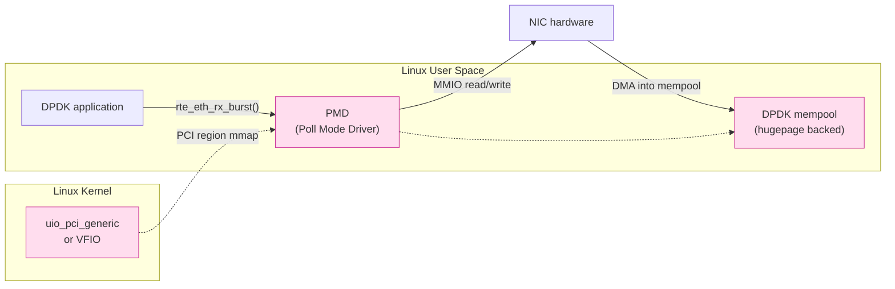

# 課堂 2.8 — DPDK：完全 bypass kernel

## 學前知道

- **前置課**：[2.7 XDP](./2.7-xdp.md)（理解 in-kernel zero-copy 的天花板）
- **預計閱讀時間**：60~80 分鐘
- **必讀文獻**：
  - **Intel — Data Plane Development Kit Programmer’s Guide** (2024 latest) — DPDK 官方規格。讀「Mempool」、「Rings」、「Poll Mode Driver」三章
  - **Rizzo — netmap: a novel framework for fast packet I/O** (USENIX ATC 2012) — 已抓 `assets/papers/usenix-atc-2012-rizzo-netmap.pdf`。**user-space packet I/O 學術源頭**，DPDK 借用大量設計
  - **Han et al. — MegaPipe** (OSDI 2012) — 已抓
  - **Marinos et al. — Network Stack Specialization for Performance** (SIGCOMM 2014) — Sandstorm/Namestorm，user-space stack 級
  - **Cloudflare blog — DPDK vs XDP** (2019 系列) — 工業對比
  - **Intel Tech Brief — Performance Comparison: DPDK vs Native Linux Stack** — Intel 自家數據
- **必讀原始碼**：
  - DPDK 主 source `lib/`：`librte_eal`、`librte_mempool`、`librte_ring`、`librte_mbuf`、`librte_ethdev`
  - DPDK examples：`l2fwd`、`l3fwd`、`testpmd`
  - PMD source：`drivers/net/ixgbe/`、`drivers/net/mlx5/`、`drivers/net/i40e/`、`drivers/net/virtio/`

---

## 動機

> DPDK 是 2010s 「kernel-bypass」運動的代表，2026 仍是電信 / NFV / 高頻交易的事實標準

[2.7](./2.7-xdp.md) 講 XDP 達到 24 Mpps/core，已逼近 line rate。**那為什麼 telecom / NFV / 5G UPF / HFT 仍堅持用 DPDK？**

原因：

1. **更早立足點**：DPDK 2010 起，比 XDP (2017) 早 7 年成熟。NFV 產業（諾基亞、愛立信、華為、思科）的 production 全是 DPDK
2. **完整 user-space stack 生態**：F-Stack、VPP、Seastar、mTCP 都基於 DPDK
3. **可預測延遲**：完全跑在 user-space busy poll，**無 kernel context switch、無 IRQ**，最低 latency variance
4. **跨 OS portable**：DPDK 在 Linux、FreeBSD、Windows 都跑。XDP 只 Linux
5. **NIC 廠商支援**：Mellanox、Intel、Broadcom 把高級 feature（SR-IOV、RoCE、DCB）優先給 DPDK PMD 而非 kernel driver

**對 G6 的相關性**：

- **大概率不用 DPDK**：太重。VPS 部署、消費 NIC、共用伺服器都不適合
- 但**必須懂**：因為 5G UPF / 商用 VPN 都用 DPDK。我們協議若要 push 進 telecom-grade deployment，必須有 DPDK port
- DPDK **設計哲學**（thread-per-core、PMD、mempool、burst processing）是現代高效能網路系統的通用心智模型，learning value 高

---

## 核心概念

### 1. DPDK 核心哲學：完全 bypass kernel



關鍵：

- **NIC 被 detach 出 kernel driver**：`dpdk-devbind.py --bind=vfio-pci eth0` 之後 kernel 完全不管這張卡
- **PCI BAR region 被 mmap 進 user space**：DPDK PMD 直接讀寫 NIC 暫存器
- **DMA buffer 是 user-space hugepage**：NIC 直接 DMA 到 user space 記憶體
- **Busy poll，無 IRQ**：CPU 100% 跑 `while (1) { rx_burst(); process(); tx_burst(); }`

### 2. 關鍵子系統

#### 2.1 EAL (Environment Abstraction Layer)

DPDK 啟動時的 bootstrap：

```c
int main(int argc, char **argv) {
    rte_eal_init(argc, argv);   // 解析 -l (logical cores) -n (mem channels) etc.
    // ...
    rte_eal_cleanup();
}
```

啟動參數：

```bash
./l2fwd -l 0-3 -n 4 --huge-dir /mnt/huge -- -p 0x3 -q 1
#       ^^^^^^^^^^^^ EAL args                  ^^^^^^^^ app args
# -l 0-3   : pin 到 logical core 0-3
# -n 4     : 4 個 memory channel
# --huge-dir : hugepage mount point
# -p 0x3   : 用 port mask 0x3 (port 0 and 1)
```

EAL 負責：mempool 初始化、PCI scan、hugepage mapping、per-thread storage、ring 設定。

#### 2.2 Mempool: hugepage-backed lock-free memory pool

```c
struct rte_mempool *mp = rte_pktmbuf_pool_create(
    "MBUF_POOL", 8192 /* num */, 256 /* cache */, 0, 
    RTE_MBUF_DEFAULT_BUF_SIZE, rte_socket_id());
```

特性：

- backed by hugepage（2MB / 1GB），無 TLB miss
- per-CPU cache（lock-free fast path）
- 跨 lcore 借用走 ring buffer（無鎖環）

每個 NIC RX queue 從 mempool 拿 `mbuf` 寫入；應用處理完歸還。

#### 2.3 mbuf: DPDK 的 packet buffer

```c
struct rte_mbuf {
    void *buf_addr;            // 指向實際 data buffer (in mempool)
    rte_iova_t buf_iova;       // DMA 位址
    uint16_t data_off;
    uint16_t refcnt;
    uint16_t nb_segs;          // multi-seg packet (jumbo / scatter)
    uint16_t port;
    uint64_t ol_flags;         // offload flags (checksum, VLAN, ...)
    // ...
    uint32_t pkt_len;
    uint16_t data_len;
    // ...
};
```

對比 Linux skb (~600+ byte)，mbuf 約 128 byte。**更輕、更 cache-friendly**。

#### 2.4 Rings: lock-free SPSC / MPMC

DPDK ring 用 Lamport-style lock-free ring：

```c
struct rte_ring *r = rte_ring_create("R1", 1024,
                       rte_socket_id(), RING_F_SP_ENQ | RING_F_SC_DEQ);

rte_ring_enqueue(r, ptr);
rte_ring_dequeue(r, &ptr);
```

支援：
- Single-producer single-consumer (SP/SC): 最快，per-thread queue
- Multi-producer single-consumer (MP/SC)
- Multi-producer multi-consumer (MP/MC)

可作 inter-thread communication、worker queue。

#### 2.5 PMD: Poll Mode Driver

每張 NIC 有對應 PMD。例子 `drivers/net/ixgbe/`：

```c
uint16_t ixgbe_recv_pkts(void *rx_queue, struct rte_mbuf **rx_pkts,
                          uint16_t nb_pkts) {
    // 直接讀 NIC RX descriptor，從 ring 取 mbuf
}
```

PMD 暴露 `rte_eth_*` API：

```c
nb_rx = rte_eth_rx_burst(port_id, queue_id, rx_pkts, MAX_PKT_BURST);
for (i = 0; i < nb_rx; i++) {
    process(rx_pkts[i]);
}
rte_eth_tx_burst(port_id, queue_id, tx_pkts, nb_tx);
```

**no IRQ, no syscall**，就是 user-space busy poll NIC。

#### 2.6 hugepage setup

```bash
echo 2048 | sudo tee /sys/kernel/mm/hugepages/hugepages-2048kB/nr_hugepages
# 配 2048 × 2MB = 4GB hugepage
sudo mkdir -p /mnt/huge
sudo mount -t hugetlbfs nodev /mnt/huge
```

DPDK 從 hugepage 配 mempool，**避免 4KB page table TLB pressure**。10GbE 線速 14.88 Mpps，每秒幾百萬次 mbuf access，TLB miss 一個就毀了 cycle budget。

### 3. NUMA-aware 設計

```c
// 取當前 lcore 的 NUMA node
int socket = rte_socket_id();
// 對應 NUMA node 分配 mempool
mp = rte_pktmbuf_pool_create("P0", 8192, 256, 0, BUFSZ, socket);
```

**對 multi-socket 機器至關重要**：跨 socket memory access ~150 ns vs local 70 ns。DPDK 要求所有 thread / mempool / RX queue 在同個 NUMA node 才能 line rate。

`rte_eth_dev_socket_id()` 告訴你 NIC 屬於哪個 NUMA node。

### 4. Burst processing

DPDK 不像傳統 syscall 是 「per-packet API」，全部是 **burst API**：

```c
nb_rx = rte_eth_rx_burst(port_id, queue_id, rx_pkts, 32);  // 一次取 32 包
```

效益：

- 分攤 function call overhead（per-call 變 per-burst）
- prefetch 友善：先 prefetch 後幾個 mbuf 的 data
- branch prediction 友善：固定 32 iteration 的 loop
- SIMD：可向量化處理多包

典型 main loop：

```c
while (running) {
    nb_rx = rte_eth_rx_burst(0, 0, bufs, MAX_BURST);
    for (i = 0; i < nb_rx; i++) {
        prefetch_next(bufs, i);   // L1 cache 預熱
        process(bufs[i]);
    }
    nb_tx = rte_eth_tx_burst(0, 0, bufs, nb_rx);
}
```

⭐ **burst processing 是「**現代高效能網路系統**」的核心 design pattern**。即使不用 DPDK，io_uring multishot 也是 burst（一次返回多 CQE）。

### 5. Lcore / thread model

DPDK 的 thread 叫 **lcore (logical core)**。每個 lcore pin 在固定 CPU。

```c
RTE_LCORE_FOREACH_WORKER(lcore_id) {
    rte_eal_remote_launch(my_worker, NULL, lcore_id);
}
```

每個 lcore 跑自己的 main loop。lcore 間不共享狀態（除非透過 ring）。**share-nothing thread-per-core** 是 DPDK 哲學。

### 6. UIO vs VFIO

DPDK 需要把 NIC 從 kernel 「拔」過來給 user-space。兩種機制：

| | UIO (`uio_pci_generic`) | VFIO (`vfio-pci`) |
|---|---|---|
| Kernel 版本 | 古老 | 3.6+ |
| Security | 弱（無 IOMMU） | 強（用 IOMMU 隔離 DMA） |
| 跨 VM 用 | 否 | 是（SR-IOV、vIOMMU） |
| 推薦 | legacy | 現代必選 |

啟用 VFIO：

```bash
sudo modprobe vfio-pci
echo "vfio-pci" | sudo tee /sys/bus/pci/devices/0000:01:00.0/driver_override
echo "0000:01:00.0" | sudo tee /sys/bus/pci/drivers_probe
```

或用 `dpdk-devbind.py`：

```bash
sudo dpdk-devbind.py --bind=vfio-pci 0000:01:00.0
```

### 7. DPDK 應用範例：l2fwd (Layer 2 forwarding)

```c
#include <rte_eal.h>
#include <rte_ethdev.h>
#include <rte_mbuf.h>

#define MAX_PKT_BURST 32
struct rte_mempool *mbuf_pool;

static int lcore_main(void *arg) {
    uint16_t port;
    RTE_ETH_FOREACH_DEV(port) {
        rte_eth_dev_socket_id(port);   // affinity check
    }

    for (;;) {
        struct rte_mbuf *bufs[MAX_PKT_BURST];
        RTE_ETH_FOREACH_DEV(port) {
            const uint16_t nb_rx = rte_eth_rx_burst(port, 0, bufs, MAX_PKT_BURST);
            if (nb_rx == 0) continue;
            const uint16_t nb_tx = rte_eth_tx_burst(port ^ 1, 0, bufs, nb_rx);
            if (nb_tx < nb_rx) {
                // 未送出去的 mbuf 要 free
                for (uint16_t i = nb_tx; i < nb_rx; i++)
                    rte_pktmbuf_free(bufs[i]);
            }
        }
    }
    return 0;
}

int main(int argc, char **argv) {
    rte_eal_init(argc, argv);

    mbuf_pool = rte_pktmbuf_pool_create("MBUF_POOL", 8192, 256, 0,
                                         RTE_MBUF_DEFAULT_BUF_SIZE,
                                         rte_socket_id());
    uint16_t port;
    RTE_ETH_FOREACH_DEV(port) {
        struct rte_eth_conf cfg = { 0 };
        rte_eth_dev_configure(port, 1, 1, &cfg);
        rte_eth_rx_queue_setup(port, 0, 1024, rte_eth_dev_socket_id(port), NULL, mbuf_pool);
        rte_eth_tx_queue_setup(port, 0, 1024, rte_eth_dev_socket_id(port), NULL);
        rte_eth_dev_start(port);
        rte_eth_promiscuous_enable(port);
    }

    rte_eal_remote_launch(lcore_main, NULL, rte_lcore_id());
    rte_eal_mp_wait_lcore();
    return 0;
}
```

100 行內一個 line-rate L2 forwarder。**沒有 syscall、沒有 kernel stack**。

### 8. DPDK vs AF_XDP vs io_uring 終極對比

| 維度 | io_uring | AF_XDP | DPDK |
|---|---|---|---|
| Kernel 角色 | 仍跑 stack | 跑 driver + XDP，bypass stack | 完全 bypass，連 driver 都是 user-space |
| NIC 獨佔 | 否 | 否（共用） | 是 |
| Syscall 量 | 0~1 per ring | 0 per packet（control 仍有） | 0 per packet |
| Driver 支援 | 任何 | 主流 native XDP | DPDK PMD 支援列表 |
| Stack 服務 | 全 | XDP 後仍走 stack 或 user | 全靠 user-space stack |
| TCP / IP / routing | kernel 提供 | kernel 提供（PASS path） | 自寫或 F-Stack / mTCP |
| Latency variance | 中 | 低 | 最低 |
| 部署複雜度 | 低 | 中 | 高（hugepage / VFIO / pin） |
| 適用場景 | 一般 server | 高速 packet 處理 | NFV / telecom / HFT |
| G6 適配 | **主路徑** | 極致 mode | 暫不採用 |

### 9. DPDK + user-space TCP/IP stack

DPDK 只給你 raw packet。要做 socket-like API 需要 user-space stack：

- **F-Stack**：移植 FreeBSD TCP stack 到 DPDK，提供 socket API
- **VPP (Vector Packet Processing)**：Cisco 的 production-grade
- **mTCP** (NSDI 2014)：學術級，[2.9 講](./2.9-userspace-tcp.md)
- **Seastar**：ScyllaDB / 它的 future-promise 模型

**G6 暫不走這路**：用 user-space stack 等於放棄 Linux kernel 25 年的 TCP 演算法精煉（CUBIC、BBR、PRR、PRR 等）。

### 10. 真實 deployment 與性能數據

| 場景 | 工具 | 性能 |
|---|---|---|
| 5G UPF (user plane function) | DPDK + VPP | 100+ Gbps per node |
| Cloudflare DDoS 防禦前端 | XDP + iptables | 10 Mpps drop |
| Facebook Katran | XDP | 1.5M cps |
| 高頻交易 ticker plant | DPDK + custom | <1μs latency |
| NFV (virtual EPC, vBNG) | DPDK + VPP | 40-100 Gbps |
| 商用 VPN 邊界 | 多數仍 kernel stack | 1-10 Gbps |

**G6 落點**：商用 VPN 邊界級，**用 kernel + io_uring + XDP，1-10 Gbps 完全夠用**。

### 11. DPDK 的缺點

1. **獨佔 NIC**：VPS 一張 NIC 全給 DPDK，sysadmin SSH 連 ICMP 都不通——必須額外 NIC 給 management
2. **debug 痛苦**：tcpdump 看不到（NIC 不在 kernel）；要用 DPDK 自帶 capture
3. **port 不能跟 Linux 共用**：跟 nginx 等正常 service 共部署衝突
4. **記憶體用量大**：hugepage 至少 1-2GB
5. **CPU 100% busy poll**：power consumption + thermal 問題
6. **開發複雜**：raw packet，要自寫 L2/L3/L4 處理
7. **跨 distro 兼容性差**：hugepage / VFIO 配置因 distro 不同

對 G6 的判斷：**全部都是 deal breaker**。我們服務的不是 telecom 而是個人 / 小組用戶。

---

## 與我們協議設計的關聯

1. **G6 v1 不用 DPDK**：太重、太貴。io_uring + XDP 已涵蓋我們的性能需求
2. **保留 DPDK port 可能性**：若 G6 進入 telecom-grade deployment（不太可能但保留可能），可寫 DPDK 版的 server
3. **DPDK 設計哲學要吸收**：thread-per-core、burst processing、share-nothing、NUMA-aware、busy-poll latency 控制——這些 pattern 在 io_uring runtime 都通用
4. **不評估 user-space TCP stack 取代**：放棄 Linux kernel TCP 是巨大 trade-off
5. **NIC bypass 是另一個世界**：理解 DPDK 後你會明白「**為什麼 SmartNIC（BlueField、Pensando）正在吃 DPDK 的午餐**」——下個 10 年是 DPU 時代

---

## 動手

### 實驗 A：跑 DPDK testpmd

需要 Linux VM（OrbStack ok）。

```bash
# 安裝
sudo apt-get install dpdk dpdk-dev

# hugepage
echo 1024 | sudo tee /proc/sys/vm/nr_hugepages
sudo mkdir -p /mnt/huge && sudo mount -t hugetlbfs nodev /mnt/huge

# bind NIC（VM 內可用 virtio）
sudo dpdk-devbind.py --status
# 假設 eth1 是測試 NIC
sudo dpdk-devbind.py --bind=vfio-pci eth1

# 跑 testpmd
sudo testpmd -l 0-1 -n 4 -- -i
# 在 testpmd shell:
testpmd> start
testpmd> show port stats all
```

### 實驗 B：l2fwd 與 iperf 對比

跑 DPDK 內附的 l2fwd 範例（兩 port 互相 forward），用另一個 VM 起 iperf。對比一個用 Linux bridge 的 forwarding 設定。

預期：DPDK l2fwd CPU usage 一個 core 100%（busy poll）但 packet drop 0；Linux bridge CPU 分散但 packet 丟。

### 實驗 C：mempool / ring API 速覽

寫一個小 program：

- 建 mempool 1024 個 mbuf
- 建一個 SPSC ring
- producer thread enqueue mbuf
- consumer thread dequeue

量 enqueue/dequeue rate。預期 ~100M ops/s/core（lock-free SPSC ring 在 modern CPU）。

### 實驗 D：DPDK 對 hugepage 的依賴

跑 testpmd 但**不**設定 hugepage。看會發生什麼。預期：報錯「Cannot get hugepage information」並退出。

說明：DPDK 不能用普通 4KB page，因為 IOVA mapping 必須 contiguous。

---

## 自我檢查

1. DPDK 是怎麼把 NIC 從 kernel「拔」過來？UIO / VFIO 各自的安全模型差在哪？
2. mempool 為什麼必須 hugepage backed？對 10GbE 線速 14.88 Mpps 來說，TLB miss 一次成本多少（cycle）？
3. burst processing（一次處理 32 個 packet）相對 per-packet API 的核心優勢是什麼？舉 3 個
4. DPDK 跟 AF_XDP 在「user-space zero-copy packet I/O」這個目標上重疊。AF_XDP 比 DPDK 強的部分是什麼？DPDK 比 AF_XDP 強的部分？
5. share-nothing thread-per-core 是 DPDK 的核心 thread model。對 G6 server (io_uring + 加密) 是否值得借鏡？理由
6. NUMA-aware 在 single-socket 機器上意義有多大？G6 部署的 VPS 通常是 single-socket 還是 multi-socket？
7. 為什麼 G6 不走 DPDK？列 5 個具體理由
8. DPDK 設計哲學給「**SmartNIC / DPU 時代**」留了什麼遺產？（提示：thread-per-core、零拷貝、busy poll 都跟 DPU programming model 一脈相承）

---

## 延伸閱讀

- **DPDK official docs**：https://doc.dpdk.org/
- **F-Stack**：https://github.com/F-Stack/f-stack
- **VPP**：https://wiki.fd.io/view/VPP
- **Cisco Live VPP talks**
- **Seastar**：https://seastar.io/
- **Cloudflare blog**：https://blog.cloudflare.com/tag/dpdk/
- **Intel DPDK 工程師 blog 多篇**

---

## 研究級補遺

### 1. 學界詞彙

| 中文/口語 | 學界正名 | 出處 |
|---|---|---|
| Kernel bypass | dataplane bypass | netmap / DPDK |
| Poll-mode driver | poll-mode device driver (PMD) | DPDK |
| User-space stack | user-level network stack | mTCP / Sandstorm |
| Burst processing | batched packet processing | DPDK |
| Share-nothing thread model | thread-per-core (TPC) | Seastar |
| NUMA-aware allocation | NUMA-local memory | OS textbook |
| Hugepage | superpage / large page | mm 文獻 |
| Lock-free ring | SPSC/MPMC ring buffer | Lamport 1983 |
| SmartNIC | data processing unit (DPU) | NVIDIA BlueField docs |

### 2. 對手分類學：DPDK vs 對手的 DPI/IDS 演化

GFW / 大型 ISP IDS 商業設備（Sandvine、Allot）大量用 DPDK 做 line-rate 流量分類。對 G6 implication：**對手 inspection 能力可以 line rate**。

學界研究例：

- **Allot — Smart Service Plans** 商業設備規格指明 DPDK 內核
- **Snort 3 + DPDK**：開源 IDS 可達 ~10 Gbps line rate
- 中國公開：未確認但邏輯上 GFW 升級必走 DPDK 或 XDP

### 3. 形式化定義：busy-poll 與 latency variance

busy-poll thread cost：

$$
C_{\text{poll}} = T_{\text{rx}} + T_{\text{proc}} + T_{\text{tx}}, \quad \text{CPU usage} = 100\%
$$

latency:

$$
L_{\text{packet}} = T_{\text{wait}} + T_{\text{proc}}
$$

對 busy poll：$T_{\text{wait}}$ ≈ 1/2 polling interval（next poll cycle），通常 < 1μs。  
對 IRQ-driven：$T_{\text{wait}}$ 含 IRQ delivery + scheduler latency，~10-100μs，高 jitter。

DPDK 的 **latency variance** 顯著小於 kernel stack——這對 HFT、5G URLLC 是核心優勢。對 G6（網路 latency 主導），意義有限。

### 4. 領域的關鍵論文 / 規格

- **Rizzo netmap ATC 2012** ⭐ — 已抓，netmap 是 DPDK 學術源頭
- **Han et al. MegaPipe OSDI 2012** — 已抓
- **Marinos et al. SIGCOMM 2014** — user-space stack 經典
- **Jeong et al. mTCP NSDI 2014** — 已抓 `assets/papers/nsdi-2014-mtcp.pdf`，[2.9 講](./2.9-userspace-tcp.md)
- **Belay et al. IX OSDI 2014** — dataplane OS
- **DPDK Programmer’s Guide** — 規格本身

### 5. 我們協議的座標 / 設計取捨

| 設計問題 | 本堂收窄了什麼 | 仍 open |
|---|---|---|
| 是否走 DPDK | **否**，G6 用 kernel + io_uring + XDP | telecom-grade deploy 路線 |
| Thread model | **採用 thread-per-core 哲學** | tokio multi-thread vs monoio thread-per-core 取捨 |
| Memory model | **hugepage + register_buf_ring** | 具體 buffer size 與 pool |
| NUMA-awareness | **設計時保留 socket affinity option** | 預設關，多 socket 部署再開 |
| 對手 inspection 能力 | **必須假設對手是 line rate DPDK 級** | 抗指紋設計閾值 |

### 6. 必追資源 / 社群入口

- **DPDK Project mailing list**：dpdk-dev@dpdk.org
- **DPDK Summit** 每年
- **FD.io conferences (VPP)**
- **NetDev 上 DPDK comparisons**
- **Intel networking blog**
- **NVIDIA Networking (Mellanox) DOCA**

### 7. 開放問題（research-level）

1. **DPDK + DPU offload integration**：BlueField-3 上跑 DPDK 跟在 host 跑性質不同，programming model 設計開放
2. **io_uring 是否能取代 DPDK**：理論上 zero-syscall + zero-copy + register_buf_ring 已逼近 DPDK；實證對某些 workload 還差 20-30%。能否完全取代是 OS 研究焦點
3. **user-space stack security**：跳過 kernel netfilter / conntrack，自己的 stack 怎麼防 DoS / scan？formal model 缺
4. **DPDK + eBPF combinations**：XDP 在 driver，DPDK 取代 driver——能否「driver 同時暴露 DPDK + XDP hook」？dpdk-test-eventdev 在做
5. **對 G6 是否值得做 DPDK port**：純工程問題但研究意義有限。除非 G6 進 NFV 領域

---

## 對下一堂的鋪墊

DPDK 給你 raw packet 但**沒有 TCP/IP stack**。下一堂 [2.9 user-space TCP stack](./2.9-userspace-tcp.md) 講 mTCP / F-Stack / Seastar / lwIP / smoltcp——這些 user-space 實作怎麼補足那塊空白。重點：**G6 是否需要 user-space stack？答案多半是「不」，但理解選項對最終設計重要。**
