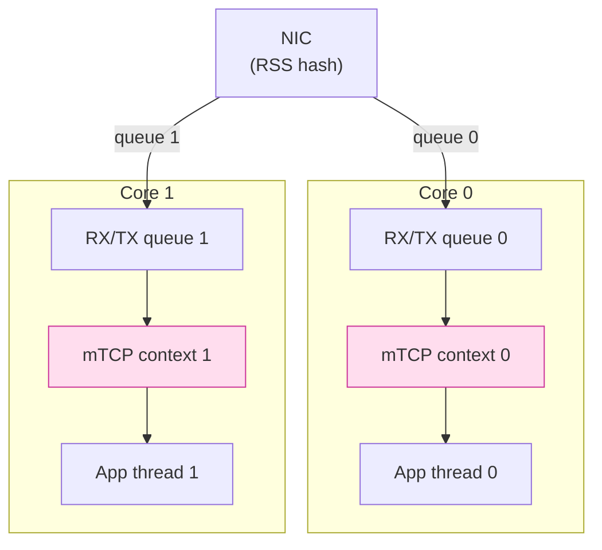

# 課堂 2.9 — 用戶態 TCP stack

## 學前知道

- **前置課**：[2.8 DPDK](./2.8-dpdk.md)（理解 kernel-bypass 之後仍缺 TCP/IP）
- **預計閱讀時間**：60~80 分鐘
- **必讀論文**：
  - **Jeong et al. — mTCP: A Highly Scalable User-level TCP Stack for Multicore Systems** (NSDI 2014) ⭐⭐ — 已抓 `assets/papers/nsdi-2014-mtcp.pdf`。**user-space TCP stack 的標竿學術系統**
  - **Marinos, Watson, Handley — Network Stack Specialization for Performance** (SIGCOMM 2014) — Sandstorm / Namestorm，更激進的 specialization
  - **Belay et al. — IX: A Protected Dataplane OS** (OSDI 2014) — dataplane OS 概念，含 user-space TCP
  - **Han et al. — MegaPipe** (OSDI 2012) — 已抓，user-space batched API 前驅
  - **Hruby et al. — F-Stack architecture** (Tencent 2017+) — FreeBSD TCP stack ported to DPDK，工業實踐
- **必讀原始碼**：
  - **mTCP**：https://github.com/mtcp-stack/mtcp
  - **F-Stack**：https://github.com/F-Stack/f-stack
  - **Seastar**：https://github.com/scylladb/seastar
  - **lwIP**：https://savannah.nongnu.org/projects/lwip/
  - **smoltcp** (Rust)：https://github.com/smoltcp-rs/smoltcp
  - **netstack3** (Fuchsia)：https://fuchsia.googlesource.com/fuchsia/+/HEAD/src/connectivity/network/netstack3/

---

## 動機

> 跳過 Linux kernel TCP 是極大決策，但 G6 應該理解何時值得

[2.8](./2.8-dpdk.md) 顯示 DPDK 給你 raw packet 但**沒有 TCP/IP/socket API**。要做應用，要嘛自己手寫 stack，要嘛用既有 user-space stack。

歷史上幾波努力：

| 系統 | 年份 | 路線 | 影響 |
|---|---|---|---|
| **lwIP** | 2001 | 嵌入式輕量級 TCP/IP | 仍是嵌入式 / IoT 標準（FreeRTOS、ESP32） |
| **mTCP** | 2014 NSDI | 學術 multi-core 設計 | 證明 user-space TCP 可達 line rate |
| **Sandstorm/Namestorm** | 2014 SIGCOMM | specialization 哲學 | static page / DNS 專屬 stack |
| **IX** | 2014 OSDI | dataplane OS | Intel 收編，影響 RDMA / DPU |
| **F-Stack** | 2017 | FreeBSD stack ported to DPDK | Tencent 商用，最廣 production |
| **Seastar** | 2014+ | 完整 async runtime + DPDK + TCP | ScyllaDB 核心 |
| **smoltcp** | 2017 | Rust no-std TCP | Redox OS / 嵌入式 Rust |
| **netstack3** | 2020+ | Fuchsia 的 Rust TCP | Google 下一代 OS |

**G6 為什麼大概率不用 user-space stack**：

1. **放棄 Linux TCP 25 年算法精煉**（CUBIC、BBR、PRR、F-RTO、TCP Small Queue、autosizing buffer 等）成本巨大
2. **debug 困難**：tcpdump / ss / ip 都不能用
3. **跨 kernel 版本兼容性反而更難**（user-space stack 跟 DPDK 版本耦合）
4. **G6 的瓶頸不在 TCP stack**：而在 user-space 加密 + 抗指紋邏輯
5. **協議自由度高**：G6 設計時可基於 UDP / QUIC（自己控 transport），不必依賴 TCP——若用 TCP 就放 kernel 跑

**但為什麼仍要學**：

1. **理解 mTCP 的 multi-core 設計**：讓你看清 Linux TCP 的 lock contention 病灶——對 G6 server side multi-worker 設計直接 inform
2. **理解 specialization 哲學**：Marinos 2014 提的「**為 application 量身打造 stack**」思想—— G6 自己其實就是「為 proxy 量身打造的 transport」
3. **smoltcp / netstack3 的 Rust 模型**：若 G6 將來嵌入 router OS / embedded 場景，smoltcp 是現實選項
4. **QUIC 是「user-space UDP-based transport」**：可以視為「user-space TCP」的精神後繼者。Part 8 講

---

## 核心概念

### 1. 為什麼 Linux kernel TCP 在 multi-core scaling 不好（mTCP 的問題定義）

Jeong et al. NSDI 2014 用嚴密實驗指出 Linux TCP 三個 scaling 障礙：

#### 1.1 大量 lock contention

`sock` struct 內鎖、`tcp_hashinfo` 全局鎖、`listen_sock` 接受佇列鎖：multi-core 同時 accept / send / recv 大量爭鎖。

#### 1.2 file descriptor table 全 process 共享

`fd_table` 在多 thread 加新 fd 時需要 expansion lock，accept rate > 1M cps 時瓶頸。

#### 1.3 NUMA 不友善

skb 在 CPU A 收進來，可能被 CPU B 處理——跨 NUMA 訪 cache line。

mTCP 用 **share-nothing thread-per-core + 自己的 TCP** 解決：

- 每個 lcore 自己的 TCP control block table
- 每個 lcore 自己的 file descriptor namespace
- Packet 進 NIC RX queue 直接 bind 到對應 lcore（RSS hash）

結果：8-core 機器 1.7M short connections/sec（Linux 同硬體 ~270K cps），**6 倍**。

⭐ **對 G6 的啟示**：即使我們不抄 mTCP 的 stack，**share-nothing thread-per-core + 每 worker 獨立 connection table** 是 lesson 一致的。

### 2. mTCP 架構



每 thread 完全獨立：

- 自己的 connection hash table
- 自己的 timer wheel
- 自己的 socket API（mTCP 提供 BSD-like）
- 連 `accept()` 也是 per-thread（無 listen queue 競爭）

**Cross-thread 通訊**：透過 lock-free SPSC ring（DPDK rte_ring）。

#### 2.1 API 範例

```c
mctx_t ctx = mtcp_create_context(cpu_id);

int sfd = mtcp_socket(ctx, AF_INET, SOCK_STREAM, 0);
struct sockaddr_in sa = { ... };
mtcp_bind(ctx, sfd, ...);
mtcp_listen(ctx, sfd, BACKLOG);

mctx_t epfd = mtcp_epoll_create(ctx, 1024);
mtcp_epoll_ctl(ctx, epfd, MTCP_EPOLL_CTL_ADD, sfd, &ev);

while (1) {
    int n = mtcp_epoll_wait(ctx, epfd, evs, MAX_EVENTS, -1);
    // ...
}
```

API 故意做得 BSD-compatible 讓 porting 容易。

### 3. F-Stack：FreeBSD stack + DPDK 工業組合

Tencent 開源 F-Stack：

- 把 FreeBSD 12.x kernel TCP/IP source code 直接搬進 user-space
- DPDK 收 packet → 餵 FreeBSD stack（在 user space 跑）→ socket API 給應用

優點：**繼承 FreeBSD TCP 完整實作**，比 mTCP / Seastar 自己重寫的更穩。

production 用戶：Tencent、QQ 部分前端、京東部分服務。

對 G6：**F-Stack 是「相對 lower risk 的 user-space stack 選項」**——如果決定走這路，F-Stack 不要重新發明。

### 4. Seastar：完整 future-promise + DPDK + 自製 TCP

Seastar 是 ScyllaDB 用的 C++ async runtime：

- 完整 thread-per-core + future / promise / continuation
- 內附 user-space TCP stack（也可用 kernel stack mode）
- 高度向量化、cache-friendly
- 設計用於資料庫，但通用

```cpp
seastar::future<> handle_request(connection conn) {
    return conn.read().then([&conn](sstring data) {
        return conn.write(process(data));
    });
}
```

**Seastar 啟發了現代 Rust async runtime**（特別是 monoio / glommio）。

### 5. smoltcp：no-std Rust TCP

```rust
let mut iface = Interface::new(config, &mut device, Instant::now());
let mut sockets = SocketSet::new(vec![]);
let tcp_socket = socket::tcp::Socket::new(...);
let handle = sockets.add(tcp_socket);

loop {
    iface.poll(Instant::now(), &mut device, &mut sockets);
    let socket = sockets.get_mut::<socket::tcp::Socket>(handle);
    if socket.can_send() {
        socket.send_slice(b"hello").unwrap();
    }
}
```

特點：

- 完全 `no_std`，可在 microcontroller / WASM 跑
- TCP / UDP / ICMP / DNS / DHCP 全自己實作
- 不支援所有 RFC（簡化），但對嵌入式夠用
- 是 Redox OS 的 TCP

**對 G6 implication**：客戶端若移植到 WASM / browser / embedded device，smoltcp 是現實 transport stack。對 server 不適用。

### 6. mTCP vs Linux 性能對比

| 工作負載 | Linux | mTCP | 提升 |
|---|---|---|---|
| 1KB short connection | 270K cps | 1.7M cps | 6.3× |
| HTTP req/s (Apache benchmark) | 350K | 1.5M | 4.3× |
| Multi-core scaling (1→8 core) | 不線性 | 線性 | — |

**注意**：mTCP 數據是 2014 Linux kernel。**到 2026，Linux TCP scaling 改進巨大**（特別是 SO_REUSEPORT、per-CPU SLAB、TCP listen backlog 改進、io_uring）。**重做 benchmark 預期 Linux 仍可達 ~1M cps**（8 core），差距已縮到 2-3× 而非 6×。

⇒ **mTCP 在 2026 已非「必要」**，而是「**極致場景才值得**」。

### 7. user-space stack 的根本 trade-off

| 維度 | Linux kernel stack | User-space stack |
|---|---|---|
| TCP 演算法成熟度 | 25 年精煉 | 自己重寫風險 |
| Congestion control | CUBIC / BBR / PRR / 多選 | 多數只 CUBIC |
| 處理 corner case (TCP retransmit edge) | 完備 | 不一定 |
| 對 NIC 相依 | 任何 | DPDK PMD list |
| Debug 工具 | tcpdump / ss / nstat / bpftrace | 自己印 log |
| Production 風險 | 低 | 高（曾出名 bug） |
| 跨 Linux 版本 | 兼容 | 跟 DPDK 版本鎖 |
| Throughput per core | ~300K cps | ~1M+ cps |
| Latency variance | 中 | 低 |

⭐ **G6 的決策**：**用 Linux kernel TCP**。理由：

1. 我們協議若用 TCP，吃 Linux TCP 的所有性能改進是免費的
2. Production debug 工具齊全
3. 1-10 Gbps 級需求，Linux + io_uring 完全夠
4. 學術頂會 push 也應 focus 在「協議設計」而非「重寫 TCP 與 Linux 比較」

**但若 G6 走 UDP-based / QUIC-based transport**（Part 8 決定），這節討論就不相關——QUIC 本身就是 user-space transport。

### 8. specialization 哲學（Marinos 2014）

Marinos *Network Stack Specialization for Performance* (SIGCOMM 2014) 提出：

> 「**General-purpose TCP stack 必然是 overhead 的**。為特定 application 量身打造 stack，可砍掉 80% 沒用的 code。」

實證：
- **Sandstorm**：給 static HTTP server 量身做的 stack。砍掉所有 dynamic feature（cookies、redirects、chunked）。Page serve 提速 5×
- **Namestorm**：給 DNS server 量身做的 stack。DNS 是 stateless UDP request/reply，stack 砍到極限。query rate 提速 10×

**對 G6 的啟發**：G6 自己其實就是「**為 proxy 量身打造的 transport**」——我們不需要 TCP 所有 feature（流量控制 / 重組 / window scale 是必要的，但很多 corner case 可以簡化）。如果我們走 UDP-based transport（QUIC 或自定），這就是 specialization 哲學的直接應用。

### 9. 跟 QUIC 的關係

QUIC（RFC 9000）本質是「**user-space UDP-based reliable transport**」——把 TCP-like 功能（congestion、retransmit、flow control）搬進 application layer。

QUIC vs 傳統 user-space TCP：

| | mTCP / F-Stack | QUIC (e.g. quic-go, quiche) |
|---|---|---|
| 底層 | DPDK + raw packet | UDP socket（kernel 提供） |
| Connection 概念 | TCP 4-tuple | connection ID（4-tuple 無關） |
| Multi-stream | 否 | 是（內建 multiplexing） |
| 加密 | TCP + 上層 TLS | TLS 1.3 整合 |
| Migration | 否 | 是（IP 切換不斷連） |
| 廣泛部署 | 受限 | 全網 30%+ HTTP/3 |

**QUIC 是 specialization 哲學的勝出實例**：不重寫 TCP 而是設計 better transport。G6 大概率走這條路。Part 8 全部議題。

### 10. 對 G6 的最終判斷

```
G6 transport selection decision tree:

1. 用 TCP？
   ↓ 是
   走 Linux kernel TCP + io_uring + XDP。完成。不考慮 mTCP/F-Stack 等。

2. 走 UDP-based custom transport？
   ↓ 是
   自寫 reliability + congestion + crypto layer in user space。
   底層 socket 用 kernel UDP，io_uring + register_buf_ring 加速。

3. 走 QUIC?
   ↓ 是
   用既有 QUIC implementation (quiche / quinn / s2n-quic)，
   套自己的 transport parameter / cipher。

無論哪條，**都不需要 mTCP/F-Stack 級的 user-space TCP stack**。
```

---

## 與我們協議設計的關聯

1. **不採用 mTCP / F-Stack / Seastar**：G6 server 不重寫 TCP
2. **吸收 share-nothing thread-per-core 哲學**：用於 G6 server worker 設計（io_uring runtime 層面）
3. **吸收 specialization 哲學**：G6 是「為 proxy 量身打造的 transport」——若走 UDP/QUIC，這直接相關
4. **smoltcp 留給 future embedded**：G6 client 移植到 OpenWrt / 路由器嵌入式裝置時的選項
5. **QUIC 是真正的「2026 user-space stack」**：Part 8 主題
6. **netstack3 (Rust) 是 industry trend**：Google Fuchsia 把整個 stack 用 Rust 重寫，是 G6 將來若考慮「memory-safe Rust transport」的 reference

---

## 動手

### 實驗 A：跑 mTCP 範例

```bash
git clone https://github.com/mtcp-stack/mtcp.git
cd mtcp
# 跟 README 設定 DPDK 環境（hugepage / VFIO）
make
cd apps/example
./epserver -p 8080
```

需要 DPDK 環境（[2.8 動手 A](./2.8-dpdk.md#實驗-a跑-dpdk-testpmd)）。

### 實驗 B：smoltcp Rust 嵌入式 HTTP echo

```bash
cargo new smoltcp-echo --bin
cd smoltcp-echo
cargo add smoltcp tap-tun
# 跟 smoltcp examples/server.rs 寫一個 echo
cargo run
```

跑在 Linux 上，用 TAP interface 作為 NIC abstraction。

### 實驗 C：benchmark Linux io_uring vs F-Stack

用一台機器 server（io_uring echo），另一台 server（F-Stack 編譯的 echo）。同 client 跑 wrk 或 tcpkali。比較 cps 與 P99 latency。

預期：F-Stack ~30-50% 領先（small msg）但 Linux + io_uring 已逼近。

### 實驗 D：閱讀 mTCP 論文 Figure 4 / 5 / 6

論文 PDF 已抓 `assets/papers/nsdi-2014-mtcp.pdf`。對 Figure 4（scalability）、Figure 5（latency）、Figure 6（context switch breakdown）寫 1-2 句總結。**訓練「讀系統頂會 paper 抓重點」的能力**。

---

## 自我檢查

1. mTCP 解決的 Linux multi-core scaling 三個障礙是什麼？分別在 Linux 6.x 是否已被緩解？
2. share-nothing thread-per-core 對 G6 server 是否該照抄？答 yes 跟 no 的具體理由
3. F-Stack 跟 mTCP 在「重用既有 stack」上的取捨差什麼？工業界更傾向哪個？
4. specialization 哲學（Marinos 2014）對 G6 來說最具體的應用是什麼？舉一個 G6 transport 可以「砍掉的 TCP feature」
5. smoltcp 跟 mTCP 都是 user-space TCP 但「目標市場完全不同」——具體差什麼？
6. QUIC 為什麼可以視為「specialization 哲學的勝出實例」？跟 mTCP 路線的本質區別在哪？
7. G6 大概率走 Linux kernel TCP 而非 user-space stack——本堂提供的 5 個理由是什麼？
8. 若 G6 將來想嵌入 OpenWrt 路由器（資源受限），會考慮哪些 user-space stack？

---

## 延伸閱讀

- **mTCP NSDI 2014 paper** — 已抓
- **Marinos SIGCOMM 2014 paper** — Sandstorm / Namestorm
- **F-Stack docs**
- **Seastar tutorial**：https://seastar.io/tutorial/
- **smoltcp book**：https://smoltcp.readthedocs.io/
- **netstack3 design docs** — Fuchsia 內部設計
- **Cloudflare blog — TCP performance**

---

## 研究級補遺

### 1. 學界詞彙

| 中文/口語 | 學界正名 | 出處 |
|---|---|---|
| User-space TCP stack | user-level TCP / dataplane TCP | mTCP / IX 文獻 |
| Stack specialization | network stack specialization | Marinos 2014 |
| Share-nothing thread model | thread-per-core (TPC) | Seastar |
| Multi-queue NIC RSS | Receive Side Scaling | Microsoft RSS spec |
| Connection table | TCP control block (TCB) table | TCP RFC |
| Lock-free hash | concurrent hash table | Java ConcurrentHashMap 等 |
| no_std Rust | bare-metal Rust | Rust embedded book |

### 2. 對手分類學：user-space stack 的安全攻擊面

user-space stack 引入額外攻擊面：

| 攻擊 | kernel stack | user-space stack |
|---|---|---|
| 緩衝區溢出 | netfilter 補丁覆蓋 | 必須自寫 + audit |
| TCP state machine 邏輯漏洞 | 25 年實戰修復 | 重寫易出 bug |
| Side channel (cache timing) | kernel 隔離 | 跟 application code 同位址空間 |
| 自我 DoS（algorithm complexity） | RFC 5961 / TCP slow paths 護欄 | 須自實作 |

⇒ 對 G6 不採用 user-space stack 是合理的安全保守選擇。

### 3. 形式化定義：TCP scalability 模型

定義 N-core 機器 TCP throughput $T(N)$，理想 linear scaling $T(N) = N \cdot T(1)$。實際：

$$
T(N) = N \cdot T(1) / (1 + \alpha \cdot N)
$$

$\alpha$ = contention coefficient。

- $\alpha = 0$: perfectly scalable
- Linux 6.x with SO_REUSEPORT: $\alpha \approx 0.05$
- mTCP: $\alpha \approx 0.01$
- Pre-2014 Linux: $\alpha \approx 0.3$（強烈非線性）

G6 server target：$N=8$ core 達 $T \ge 6 \cdot T(1)$，即 $\alpha \le 0.04$。Linux 6.x + io_uring 達標。

### 4. 領域的關鍵論文 / 規格

- **Jeong et al. mTCP NSDI 2014** ⭐⭐ — 已抓
- **Marinos SIGCOMM 2014** — Sandstorm / Namestorm
- **Belay et al. IX OSDI 2014** — dataplane OS
- **Han et al. MegaPipe OSDI 2012** — 已抓
- **Lin et al. — Scalable Kernel TCP** (multiple 2010s) — Linux 改進史
- **Yasukata et al. — StackMap** (USENIX ATC 2016) — kernel + user-space hybrid

### 5. 我們協議的座標 / 設計取捨

| 設計問題 | 本堂收窄了什麼 | 仍 open |
|---|---|---|
| Transport stack | **Linux kernel TCP（若用 TCP）** | 是否走 UDP/QUIC（Part 8） |
| Thread model | **share-nothing thread-per-core** | runtime 選型 |
| Performance target | 1M cps per 8-core server | I/O bound 還是 CPU bound |
| Embedded path | **smoltcp** 作 future fallback | 何時 trigger |

### 6. 必追資源 / 社群入口

- **NSDI / SIGCOMM 每年 TCP 相關 paper**
- **netdev mailing list — Linux TCP 改進**
- **F-Stack GitHub issues**
- **smoltcp / netstack3 RFCs**
- **Seastar Slack / mailing list**

### 7. 開放問題（research-level）

1. **TCP / QUIC 在 multi-core scaling 的本質差異**：QUIC connection 跨 4-tuple migration，scaling 模型跟 TCP 不同。formal study 罕見
2. **DPU-resident TCP stack**：BlueField-3 跑 TCP stack on ARM cores，比 user-space x86 更省 host CPU。是 DPU 時代 user-space stack 的進化
3. **eBPF-based TCP customization**：sockops + bpf_setsockopt 已能改一些參數，但 congestion control 不能完全替換。kfunc 演化可能解開
4. **Stack specialization for proxy**：給 proxy 量身打造的 transport，是 G6 的核心 framing。Part 11 design 直接相關
5. **memory-safe Rust transport in production**：netstack3 production 表現如何？是否能取代 Linux kernel TCP？

> ⭐ 第 4 條 **stack specialization for proxy** 直接對應 G6 設計，是論文核心 framing。

---

## 對下一堂的鋪墊

到 2.9，Linux 高效能 I/O 全景（epoll / io_uring / zero-copy / kTLS / eBPF / XDP / DPDK / user-space stack）已講完。但 G6 客戶端**會在 macOS 上跑**——macOS 完全沒有上述任何 Linux-specific 機制。下一堂 [2.10 macOS](./2.10-macos.md) 講 macOS 對等技術：kqueue、Network Extension、PacketTunnelProvider、為何 macOS **沒有** eBPF / XDP。讀完 2.10 你會清楚知道「**G6 客戶端在 macOS 能做到什麼、做不到什麼**」。
