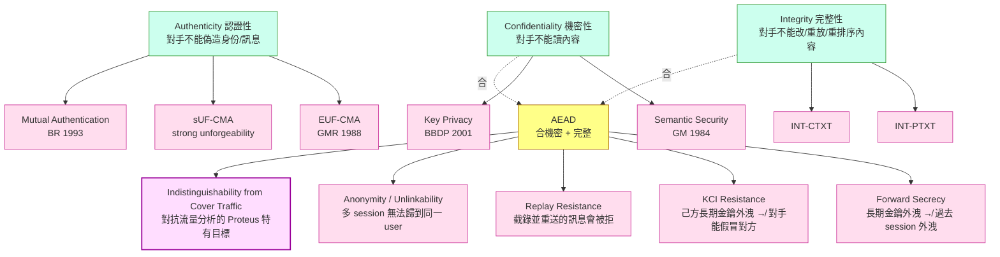
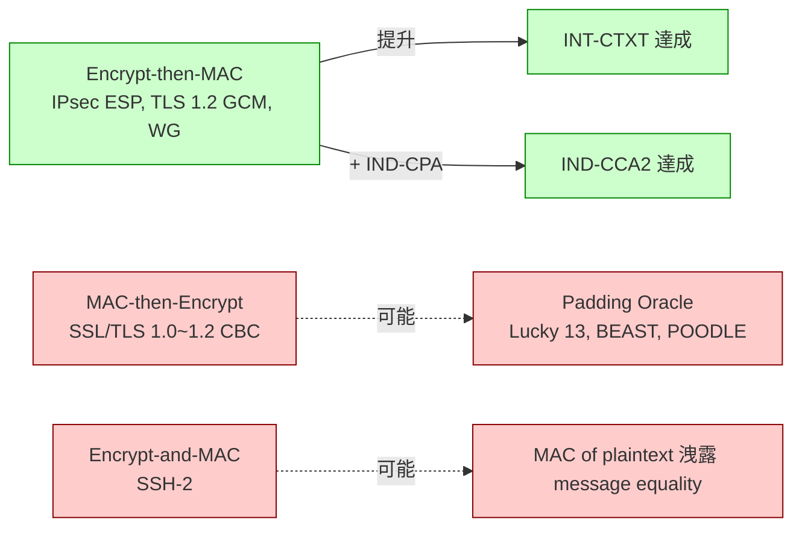
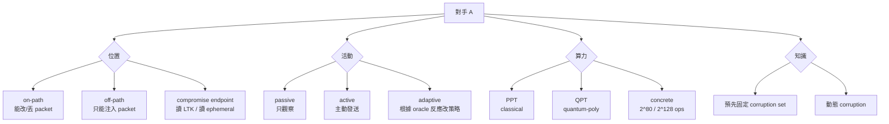
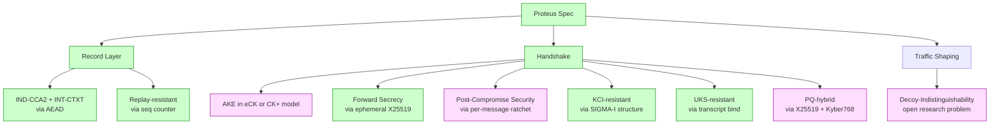

# 課堂 3.1 — 密碼學的目標分類學：你到底在保護什麼？

## 學前知道

- **前置課**：[0.3 研究級學習方法論](../part-0-orientation/0.3-research-method.md)、[1.1 分層的真實意義](../part-1-networking/1.1-layering-truth.md)
- **預計閱讀時間**：90 分鐘（含遊戲式定義細讀）
- **必讀論文**：
  - Goldwasser & Micali, *Probabilistic Encryption*, JCSS 1984 — semantic security 的源頭
  - Bellare, Desai, Jokipii, Rogaway, *A Concrete Security Treatment of Symmetric Encryption*, FOCS 1997 — IND-CPA / IND-CCA 的現代寫法
  - Bellare & Namprempre, *Authenticated Encryption: Relations among Notions and Analysis of the Generic Composition Paradigm*, ASIACRYPT 2000 — IND-CCA × INT-CTXT 的關係圖
  - Goldwasser, Micali, Rivest, *A Digital Signature Scheme Secure Against Adaptive Chosen-Message Attacks*, SIAM J. Comp. 1988 — EUF-CMA 定義
  - Krawczyk, *The Order of Encryption and Authentication for Protecting Communications (or: How Secure Is SSL?)*, CRYPTO 2001 — 為什麼 SSL/IPsec/SSH 三家三套寫法只有一家對
- **必讀原始碼**：本堂尚無，第 3.2 起陸續引入

> 這堂是整個 Part 3 的「座標系」。你不需要會算任何東西；但走出這一堂後你應該能用「IND-CCA2 + INT-CTXT + KCI-resistance + PFS」這種研究級詞彙描述你想要保護什麼，而不是模糊地說「希望它是安全的」。

---

## 動機：「安全」是一個技術上沒意義的詞

當 Icarus 你打開 Clash Verge Rev、看到 VLESS 配置裡有 `encryption: none`、Trojan 卻一定要 TLS、WireGuard 用 ChaCha20-Poly1305、Hysteria2 用 TLS 1.3—— 這些都不是巧合。每個選擇背後都對應一個**精確**的安全目標。

新手常見混淆：

> 「VMess 加密我的流量，所以 GFW 看不見。」

這句話有四個錯誤：
1. **加密不等於不可識別**（流量分析不需要解密 — Part 9 / Part 10 整 Phase 在打這個假設）。
2. **加密強度有不同維度**（防偷看 ≠ 防篡改 ≠ 防身份冒充 ≠ 防對手主動測試）。
3. **加密的對象不一樣**（payload？metadata？timing？length？）。
4. **「加密」沒有時間維度**（今天的密文五年後被破，仍叫「加密過」嗎？）。

研究級的第一步是**把「安全」這個模糊詞拆成可證明的 game**。每個 game 是一場形式化的賭局：對手有什麼能力 → 對手要達成什麼目標 → 我們宣稱「他贏的機率不可忽略大於 1/2」。整個現代密碼學從 Goldwasser-Micali (1984) 之後就是這樣寫的。

對 Proteus（我們要設計的協議）來說，這堂建立的分類學會反覆出現：

- 11.1 寫威脅模型：必須用本堂的對手能力分類（CPA / CCA / CMA / KCI / replay）。
- 11.7 寫 Security Considerations：必須對每個聲稱的安全屬性指出對應的 game 與 reduction。
- 11.10 ProVerif 驗證：要驗證的「secrecy / authenticity / forward secrecy」全部都是本堂的概念。
- 12.15-17 評測：對手能力不在本堂列表裡的，不算被打破；但反過來，列表內任一條被打破，協議就完了。

---

## 核心概念

### 1. 三個原始目標 + 五個衍生目標（不是 CIA 三角）

教科書會告訴你「資訊安全有三個目標：機密性、完整性、可用性 (CIA)」。這是 IT 經理的詞彙，**不是密碼學家的詞彙**。密碼學家分得更細，因為「相同的英文字翻譯成形式化定義時，game 截然不同」。



說明：
- 三個**原始目標**（Confidentiality / Authenticity / Integrity）來自 Shannon (1949) 的 *Communication Theory of Secrecy Systems*；「可用性」(Availability) 則屬於 systems security，不在密碼學的 scope 內（密碼學能做的事是「即使被 DoS，金鑰也不外洩」，不是「一定能通」）。
- **Authenticity vs Integrity 的細微差別**：authenticity = 「這個訊息是某個合法身份產生的」，integrity = 「這個訊息沒被改」。密碼學上這兩者用 MAC / 簽章可以同時達成，但在 protocol 層面要分開談（一個訊息可以是合法身份產生但被中間人重送 → integrity 過、replay-resistance 沒過）。

**Decoy-indistinguishability** 那個粉色節點是 Proteus 在標準分類學上**新增**的目標，不是傳統密碼學會列的項目。Phase III 我們會把它形式化成可證明的 game（這是潛在的 research contribution）。

### 2. 對手能力的階梯：CPA → CCA1 → CCA2 → CCA3

「機密性」這個詞要有意義，必須先定義對手能做什麼。歷史上對手能力是逐步加強的，每加強一級就揭穿一批舊協議：

| 縮寫 | 全稱 | 對手能力 | 第一個被它打掉的協議 |
|---|---|---|---|
| **KOA** | Known-plaintext Only | 看到一些 (m, c) 對 | 二戰前的 cipher (Caesar、Vigenère 全死) |
| **CPA** | Chosen-Plaintext Attack | 任意挑 m，得到 c | Textbook RSA、ECB-AES (deterministic ⇒ CPA-broken) |
| **CCA1** | Lunchtime / Non-adaptive CCA | 挑戰開始**前**任意挑 c，得到 m | Naor-Yung 才能擋 |
| **CCA2** | Adaptive CCA | 挑戰開始**後**仍能挑 c (但不能挑 challenge ctxt 自己) | Bleichenbacher 1998 打 RSA-PKCS#1 v1.5；TLS 1.0 一系列 padding oracle |
| **CCA3 / IND-CCA3** | + 完整性查詢 | 在 CCA2 之外，對任意 (n, c) 詢問 dec 是否成功 | 不少 AEAD-as-encrypt-then-mac 的錯接法 |

對 Proteus 設計層級的影響：
- **Proteus 必須達到 IND-CCA2**。任何低於 CCA2 的協議在現代是「設計失敗」，包括 1990 年代的 OpenVPN 早期模式（CBC + HMAC-MD5）、Shadowsocks 流加密版（2017 前 CFB/RC4/Salsa20 純流）— 這些都 CCA-broken 過。

### 3. 形式化定義（你必須能背的那種）

把 IND-CPA 寫成 game，你應該能逐字復現出來：

```text
Game IND-CPA(adversary A, scheme E = (KGen, Enc, Dec)):
    1.  k ← KGen(1^n)
    2.  (m_0, m_1, st) ← A.find()         // |m_0| = |m_1|
    3.  b ← {0, 1}                         // uniform random
    4.  c* ← Enc(k, m_b)
    5.  b' ← A.guess(c*, st)
    6.  return [b' == b]

Adv^IND-CPA_E(A) := |Pr[Game returns 1] - 1/2|

Definition: E is IND-CPA-secure iff for all PPT adversary A,
            Adv^IND-CPA_E(A) is negligible in n.
```

**為什麼這樣寫不是裝模作樣**：
- 「兩個等長明文挑一個」(`|m_0| = |m_1|`) — 因為 length leakage 不可能完全避免（密文長度通常等於明文長度 + IV + tag），所以從定義上**承認** length 會洩露，把它排除在外。Part 10 / Part 12 padding 設計就是要對抗 length leakage —— 這在 IND-CPA 之外，所以叫 traffic-analysis resistance，不叫 IND-CPA。
- 「PPT 對手」(probabilistic polynomial-time) — 排除暴力枚舉，但**不**排除任何已知演算法攻擊。後量子時代「PPT」要重新定義為「PPT 量子對手」（Part 3.11）。
- 「negligible in n」— 比任何 polynomial 倒數都小的 function；i.e. 安全參數 n 加倍，攻擊優勢趨近 0。

延伸到 IND-CCA2：在 step 1 之後 + step 5 之前，A 多了一個 `Dec(·)` oracle，**但**禁止對 `c*` 本身查詢（否則 trivial）。

對應到 authenticity，game 是 EUF-CMA：

```text
Game EUF-CMA(adversary A, scheme S = (KGen, Sign, Vrfy)):
    1.  (sk, pk) ← KGen(1^n)
    2.  Q ← {}                             // queried message set
    3.  (m*, σ*) ← A^{Sign(sk, ·)}(pk)
        // each query m goes into Q before returning Sign(sk, m)
    4.  return [Vrfy(pk, m*, σ*) == 1  AND  m* ∉ Q]

Adv^EUF-CMA_S(A) := Pr[Game returns 1]
```

`sUF-CMA`（strong unforgeability）將 step 4 改成 `(m*, σ*) ∉ Q`（即使是已經簽過的訊息但**新的 σ\***，也算偽造）。對 Proteus 我們要 sUF-CMA，因為一個 session 的 ciphertext 必須是**唯一**綁定那個 session 的，不能有「換一個 valid signature 但同一個 message」的縫隙（這種縫隙在 transaction layer protocol 是真實 bug — 例如比特幣早期 ECDSA 的 malleability）。

### 4. INT-PTXT vs INT-CTXT：為什麼 ASIACRYPT 2000 是分水嶺

Bellare & Namprempre (2000) 是現代 AEAD 設計的**理論基礎**。文章的核心結果是：



**主定理（直觀版）**：
- Encrypt-then-MAC：若底層 Enc 是 IND-CPA-secure 且 MAC 是 sUF-CMA-secure，則合成體**自動**達到 IND-CCA2 + INT-CTXT。**generically secure**。
- 其他兩種：可能安全也可能不安全，**取決於底層演算法的具體性質**。歷史上幾乎所有 padding oracle 攻擊都來自 MAC-then-Encrypt（因為 decrypt 先做、verify 後做，攻擊者拿 padding error / MAC error 的時間差或錯誤訊息差就能撬出 plaintext）。

**對 Proteus 的硬性結論**：協議的 record layer 必須是 **Encrypt-then-MAC** 結構（或等價的 AEAD 如 GCM / ChaCha20-Poly1305 / Deoxys-II），絕對不可以用 MAC-then-Encrypt。這條規則在 11.5 spec 撰寫時直接寫死。

INT-PTXT vs INT-CTXT 的差別：
- **INT-PTXT**：對手不能讓 Vrfy/Dec 接受一個**對應到新明文**的密文。
- **INT-CTXT**：對手不能讓 Vrfy/Dec 接受任何**新密文**（即使對應到舊明文）。

INT-CTXT 嚴格強於 INT-PTXT。後者允許「ciphertext malleability without changing semantic」— 這在 protocol 層會產生奇怪的 oracle（對手能微改 ciphertext 看 server 反應）。**現代 AEAD 都要求 INT-CTXT**。

### 5. 前向保密 (PFS) 與後相容性 / 後折損 (PCS)

這兩個是**時間維度**的安全屬性。Diffie-Hellman 1976 的天才之處不是公鑰交換本身，而是「ephemeral keys」概念 —— 每次 session 用即拋金鑰。

**Forward Secrecy (FS / PFS)** 的定義（Diffie-Oorschot-Wiener 1992 給的精確版本）：

> 在某個時間點 t，敵人取得長期金鑰 (long-term secret key, LTK) 的全部 material。對於所有早於 t 完成的 session，敵人**不能**從錄下來的密文恢復 plaintext。

注意「早於 t」這個量詞 —— FS 是**過去保護**屬性。寫成 game：

```text
Game FS(A, protocol Π):
    1.  Honest parties run many sessions of Π.
    2.  A records ciphertexts of session i*.
    3.  After session i* completes (and ephemeral keys are deleted),
        A is given LTK of all parties.
    4.  A guesses plaintext of session i*.
    5.  Adv := |Pr[A wins] - 1/2|.
```

**Post-Compromise Security (PCS)** 是另一個維度（Cohn-Gordon, Cremers, Garratt, *On Post-Compromise Security*, CSF 2016）：

> 對手 t 時刻取得 LTK，但**之後**沒持續監控／我方做了 key update。從 t' > t 開始的 session 對對手而言**重新**安全。

PCS 是 **未來保護** 屬性。Signal Protocol 的 Double Ratchet (Marlinspike & Perrin 2016) 是現代 PCS 的代表作。

```mermaid
sequenceDiagram
    participant Past as 過去 session
    participant Now as t = LTK 外洩
    participant Future as 未來 session

    Note over Past,Future: 時間軸
    Past->>Now: FS 保護的範圍 (Diffie 1976; DOW 1992)
    Now->>Future: PCS 保護的範圍 (Cohn-Gordon 2016; Signal Double Ratchet)
    Note over Now: t 時刻：對手拿到所有 LTK
```

**對 Proteus 的決策**：
- FS 是**必須**：用 ephemeral DH（X25519 或 ML-KEM 的 hybrid）每 session 換金鑰。
- PCS 是**可選但建議**：每 N 個 packet 或每 T 秒做 key ratchet。WireGuard 的 rekey-after-time / rekey-after-messages 機制是粗粒度版本；Proteus 應該至少達到 WireGuard 級別，理想做到 Signal-like 的 fine-grained ratchet。

### 6. KCI / UKS / Replay：身份綁定的三個破洞

當你的協議涉及兩方互相認證 + 建立 session key（i.e. 任何 VPN/proxy/messaging），有三種針對「**身份綁定錯**」的攻擊：

#### 6.1 Key Compromise Impersonation (KCI)

> A 的長期金鑰被盜。對手能不能用這個金鑰**假裝是 B**對 A 講話？

直覺上「我的金鑰外洩 → 對手能假裝我」是顯然的；但**對手能不能假裝別人對我講話**就不顯然了。Just-DH 沒有 KCI resistance（拿到 A 的 X25519 私鑰就能直接 ECDH 出 A 跟任何 B 之間的 session key）。HMQV、SIGMA 系（Krawczyk 2003 *SIGMA: the SIGn-and-MAc Approach to Authenticated Diffie-Hellman*）有 KCI resistance。

**對 Proteus 的決策**：必須有 KCI resistance。即使 server 端被 root 拿走 server 私鑰，攻擊者用該私鑰也不能假冒「使用者連到某個第三方 server」。

#### 6.2 Unknown Key Share (UKS)

Diffie-Oorschot-Wiener 1992 / Blake-Wilson, Menezes 1999 描述：

> A 和 B 完成 handshake，雙方都認為跟對方建立了 session key K。但實際上 A 認為 K 是跟 B 共享的，B 認為 K 是跟 A 共享的，**而對手 C 巧妙地讓兩邊註冊的「對方身份」不一樣**。

聽起來很玄，但這在簽章式握手裡如果不把雙方身份綁進 transcript hash 就會發生。STS（Diffie-Oorschot-Wiener 1992 原稿）就有 UKS bug。

**對 Proteus 的決策**：transcript hash 必須包含 **雙方身份** + **金鑰交換訊息** + **AEAD 設定 list**（後者防 downgrade，Logjam 2015 的教訓）。

#### 6.3 Replay

> 對手錄下 A → B 的訊息，事後重放給 B，B 接受。

握手層的 anti-replay 通常用 nonce / counter / timestamp + window；record 層用 sequence number embedded into AEAD nonce（QUIC 1-RTT、TLS 1.3 record 都這樣）。但 0-RTT 是著名例外，Part 4.5 會詳講。

**對 Proteus 的決策**：
- 1-RTT data 必須 anti-replay（counter in AEAD nonce + reject duplicate seq）。
- 0-RTT data：要嘛不允許，要嘛只允許 idempotent payload（Part 4.5 / Part 11 會 spec 出來）。

### 7. 安全屬性的「顏色」：computational vs information-theoretic vs unconditional

這是 PhD 級的座標：

| 類別 | 假設 | 例子 | 缺點 |
|---|---|---|---|
| **Information-theoretic / unconditional** | 無；對手算力無上限也打不破 | One-Time Pad、Shamir Secret Sharing、QKD | 金鑰必須跟訊息一樣長；不可重用 |
| **Computational** | 對手是 PPT；某個問題（DLP / FACT / LWE）難 | RSA、ECDH、AES（廣義）、Kyber | 需要假設 P ≠ NP 或某個更強假設；某天可能崩 |
| **Heuristic / Random Oracle Model** | 把 hash 當 random function 用來證明 | SHA-3 用 sponge；Schnorr 簽章在 ROM 證明 | ROM 不嚴格存在於現實；Canetti-Goldreich-Halevi 1998 構造了 ROM 安全但實作必崩的協議 |

**Proteus 的座標**：computational + selective-ROM。我們不可能用 OTP（金鑰太大）；我們必須假設 X25519 的 DLP 難 + ChaCha20 是 PRF + SHA-3 / BLAKE2 充當 RO。**這些假設要在 11.7 Security Considerations 條列**。

---

## 與我們協議設計的關聯

把這堂的工具直接映射到 Proteus 的 design decisions：

| 安全目標 | Proteus 必須達成？ | 用什麼 primitive？ | 哪一堂深入？ |
|---|---|---|---|
| IND-CCA2 (record layer) | ✅ 必須 | AEAD (ChaCha20-Poly1305 / AES-GCM) | 3.2 |
| INT-CTXT (record layer) | ✅ 必須（含在 AEAD） | 同上 | 3.2 |
| EUF-CMA (handshake auth) | ✅ 必須 | Ed25519 簽章 或 HMAC-based KDF binding | 3.7 |
| sUF-CMA | ✅ 必須 | Ed25519（天生 sUF）；ECDSA 須加 anti-malleability | 3.7 |
| Forward Secrecy | ✅ 必須 | Ephemeral X25519 + hybrid Kyber | 3.6, 3.11 |
| PCS | ✅ 強烈建議 | Per-message ratchet（Signal-style 簡化） | 3.8 |
| KCI Resistance | ✅ 必須 | SIGMA-I 結構 + 雙向簽章 transcript bind | 3.6, 11.6 |
| UKS Resistance | ✅ 必須 | Transcript hash 含雙方 ID + ciphersuite | 11.6 |
| Replay Resistance | ✅ 必須 | Seq-counter in AEAD nonce + receive window | 3.2, 11.6 |
| Anonymity / Unlinkability | ⚠️ 部分 | 對 GFW 看不到 client identity；對 server 看得到 | 3.9, 3.10 |
| Decoy-Indistinguishability | ✅ 是 Proteus 的特色 | 流量整形 + cover traffic（Part 10） | 10.7~10.9 |
| PQ-Resistance (long-term) | ✅ Hybrid | X25519 + Kyber768 KEM（NIST FIPS 203） | 3.11 |
| Side-channel Resistance | ✅ 必須 | Constant-time impl；無 secret-dependent branch | 3.13 |

「✅ 必須」是 11.1 威脅模型的條目來源；「哪一堂深入」是後續 lesson 的 forward reference 鎖定。

---

## 動手：把一個現實協議拆成 game 集合

選一個你熟悉的 SS-2022（Shadowsocks-2022, SIP022）。對著官方 spec 抓出每個 sub-protocol 對應到本堂哪個 game：

| SS-2022 機制 | 對應 game | 為什麼 |
|---|---|---|
| AES-128-GCM 加密 record | IND-CCA2 + INT-CTXT | GCM 是 AEAD，自動兼具 |
| BLAKE3 derive subkey | KDF security (Krawczyk 2010) | 從 master secret 推 sub-key 不洩 master |
| Salt 防重放 (per-connection) | Replay resistance | 但只防 across-connection；同 connection 內靠 nonce counter |
| User-key vs identity-key 分離 | EUF-CMA wraps PSK | 有了 identity 才能撤銷單一 user 而不換 master |
| 沒有 PFS | ❌ 缺 | SS-2022 是 PSK 模式，無 ephemeral DH，**故無 FS** |

這個練習的價值：你會立刻看到 SS-2022 雖然 IND-CCA2 / INT-CTXT 都做到了，但**沒有 FS**。對手只要持有今天的 PSK，就能解開 5 年前錄的所有 session（因為 sub-key 只是 PSK 的 deterministic derivation）。這是 Proteus 不會選 PSK-only 設計的硬性理由。

---

## 自我檢查（答得出來才算過關）

1. 你的協議 record layer 用 ChaCha20 + Poly1305 拼成的 Encrypt-then-MAC。一個審稿人問：「你只證明了 IND-CPA，沒證 IND-CCA2，怎麼辦？」用 Bellare-Namprempre 2000 的主定理回答（不超過 3 句）。
2. 解釋為什麼 ECDSA 不是 sUF-CMA-secure，而 EdDSA (Ed25519) 是。提示：signature malleability。
3. 一個朋友說「我用 AES-256，量子電腦來了也不怕」。對也錯？解釋對在哪、錯在哪（Grover vs Shor、key length doubling 規則）。
4. 你能不能證明：若 scheme 是 IND-CCA2 但**不**是 INT-CTXT，找一個對手在 IND-CCA1 model 都贏不了它，但在 IND-CCA2 model 能贏？（Hint：用 malleability 構造一個 trivial decryption oracle query）。
5. 為什麼 Diffie-Hellman 1976 原版沒有達成 KCI resistance？怎麼補（提示：SIGMA-I 結構）？
6. 假設你設計協議時 PSK 有，DH 也有，你怎麼合成 session key 才能同時達成 PFS + KCI resistance + post-compromise PSK leak resistance？（提示：HKDF-Extract 三輸入）

---

## 延伸閱讀

- **教科書**：Katz & Lindell, *Introduction to Modern Cryptography* 第 3 版（2020）—— Chapter 3 (CPA/CCA)、Chapter 4 (MAC)、Chapter 13 (DH/KE) 是本堂的長版。
- **遊戲式定義 reference**：Shoup, *Sequences of Games: A Tool for Taming Complexity in Security Proofs*, IACR ePrint 2004/332。教你怎麼**寫**一個 reduction proof。
- **形式化 protocol composition**：Brzuska et al., *Composability of Bellare-Rogaway Key Exchange Protocols*, CCS 2011。為什麼 KE protocol 的合成法在 BR 模型下安全，是 TLS 1.3 證明的基石。
- **PFS 的精確化**：Cohn-Gordon, Cremers, Garratt, *On Post-Compromise Security*, IEEE CSF 2016。
- **Cryptographic Right Answers**：Latacora 2018 blog（會在 3.14 詳論）—— 讀過後會更感謝本堂為何把分類學弄這麼細。

---

## 研究級補遺

> 主體把分類學弄成「設計 Proteus 用得到的工具」級。本節升級成「能投 IACR / CRYPTO 的座標系」。

### 1. 學界詞彙

- **Game / Experiment / Oracle / Adversary / Negligible function**：所有遊戲式定義都用這套詞彙。Goldwasser-Micali (1984) 開創；Bellare-Rogaway (1993, 1995) 系統化。
- **Reduction-based proof**：「若 A 能打破 scheme，則存在 B 用 A 解決某個 hard problem」。所有 computational security 的標準寫法。
- **Concrete security**：不再是 asymptotic「negligible」，而是寫出明確 bound（例如 `Adv ≤ q²/2^n`）。Bellare-Desai-Jokipii-Rogaway 1997 為 symmetric encryption 開創這種寫法。**現代 spec 必須給 concrete bound** —— TLS 1.3 spec 的 RFC 8446 Appendix E 就是。
- **Multi-key / multi-user security**：傳統 game 只證明「一個 user / 一個 key」對手贏的機率小；但實務上對手面對 millions of users。Bellare-Tackmann 2016 是 modern 的處理。**Proteus 必須證明 multi-user**。
- **Tightness**：reduction 是 `Adv_A ≤ ε · Adv_B` 還是 `Adv_A ≤ q · ε · Adv_B`？非 tight 的 reduction 在 multi-user 下會大幅惡化 bound。Bellare-Rogaway 的 OAEP 1994 那種 non-tight reduction 在 modern 標準下不夠用。
- **AKE (Authenticated Key Exchange)**：包含 KE + 雙向認證的協議；TLS 1.3、Noise IK、SIGMA 都是 AKE 範疇。
- **CK / eCK / CK-HMQV model**：AKE 的安全模型族。Canetti-Krawczyk 2001、LaMacchia-Lauter-Mityagin 2007。每個 model 對「對手能查 ephemeral key 嗎、能查 session key 嗎」有不同設定。**Proteus spec 必須明確 declare 用哪個 AKE model**。

### 2. 對手分類學 / 威脅模型精化

我們會在 Part 11.1 寫完整威脅模型。本堂先建分類軸：



**Dolev-Yao model**（Dolev & Yao, *On the Security of Public Key Protocols*, IEEE Trans. Inf. Theory 1983）— 這是 protocol-level 對手最常用的抽象：對手控制整個網路（讀、寫、刪、重排、注入），但不能破密碼學原語（i.e. 把 primitive 當 perfect black box）。所有 ProVerif / Tamarin 的 symbolic model 都是 Dolev-Yao 的延伸。

**對 Proteus**：威脅模型寫作時要 declare：
- 對手位置：on-path（GFW 是 on-path）。
- 活動：active + adaptive。
- 算力：PPT（傳統）+ QPT（後量子）。
- corruption：static（一旦 corrupt 就持續，不假設「之後又洗白」）。
- model：CK^+（KCI + Wpfs）或 eCK（更強）。

### 3. 形式化定義（深入版）

#### 3.1 Negligible function 的正式定義

```text
A function ν : ℕ → ℝ⁺ is negligible iff
    ∀ c > 0, ∃ N ∈ ℕ, ∀ n > N: ν(n) < n^(-c)
```

直觀：比任何 polynomial 倒數都小。例子：`2^(-n)` 是 negligible，`n^(-100)` **不是** negligible。

#### 3.2 多項式時間的精確定義

PPT (Probabilistic Polynomial Time)：對手是 Turing machine，輸入 `1^n`（n 個 1，作為 unary 表示的 security parameter），執行步驟 ≤ p(n) 對某個 polynomial p。隨機帶 (random tape) 自由訪問。

QPT：把 Turing machine 換成 BQP machine（多項式時間量子電路）。Shor 的 attack on RSA / DH 是 QPT 但不是 PPT；故 RSA 在 PPT model 安全但 QPT model 不安全。

#### 3.3 Random Oracle Model 的精確定義

ROM 是 model 而非 assumption。在 ROM 中，所有 hash 計算 `H(x)` 透過向「oracle」查詢實作；oracle 對每個新 input 回傳一個 truly random 值，對重複 input 回傳同樣值。Reduction proof 中 reducer 可以**截聽**對 oracle 的 query 並動態回答。

**ROM 的爭議**：Canetti, Goldreich, Halevi, *The Random Oracle Methodology, Revisited* (STOC 1998 / JACM 2004) 構造了一個 scheme：在 ROM 證明安全，但對任何具體 hash 實作都不安全。意義：ROM 證明不是「真實安全的證明」，而是「heuristic 證據」。

**對 Proteus**：盡量證明 standard-model security；不行才退到 ROM。

#### 3.4 Selective vs Adaptive security

Selective：對手在 game 一開始就 commit「我要攻擊 message m\* / user i\*」。
Adaptive：對手可以邊看 oracle 反應邊決定攻擊目標。

Adaptive 嚴格強於 selective。Adaptive ↔ Selective 之間若有 polynomial-time reduction，叫 "complexity leveraging"，但要付出 `2^(security parameter)` 的 advantage 損失，不夠 tight。

### 4. 領域的關鍵論文 / 規格 / 原始碼

按優先級排序，每個一行說「為什麼追」+「之後在哪一堂精讀」：

1. **Diffie & Hellman, *New Directions in Cryptography*, IEEE Trans. Inf. Theory 1976** — 公鑰密碼學的 manifesto；ephemeral key 概念；FS 萌芽。3.6 精讀。
2. **Goldwasser & Micali, *Probabilistic Encryption*, JCSS 1984** — semantic security；現代密碼學定義範式。3.4 精讀。
3. **Goldwasser, Micali, Rivest, *A Digital Signature Scheme Secure Against Adaptive Chosen-Message Attacks*, SIAM J. Comp. 1988** — EUF-CMA 定義原文；現代簽章標準。3.7 精讀。
4. **Bellare & Rogaway, *Random Oracles are Practical*, CCS 1993** — ROM methodology；至今爭議但仍是事實上的標準。3.14 / 3.15 精讀。
5. **Bellare, Desai, Jokipii, Rogaway, *A Concrete Security Treatment of Symmetric Encryption*, FOCS 1997** — 將 IND-CPA / IND-CCA 從 asymptotic 帶到 concrete。3.2 精讀。
6. **Krawczyk, *The Order of Encryption and Authentication for Protecting Communications (or: How Secure is SSL?)*, CRYPTO 2001** — MAC-then-Encrypt vs Encrypt-then-MAC 的歷史錯誤。3.2 精讀。
7. **Bellare & Namprempre, *Authenticated Encryption: Relations among Notions...*, ASIACRYPT 2000** — generic composition theorem。3.2 精讀。
8. **Cohn-Gordon, Cremers, Garratt, *On Post-Compromise Security*, IEEE CSF 2016** — PCS 的 modern formal treatment。3.8 精讀。
9. **Krawczyk, *SIGMA: the SIGn-and-MAc Approach to Authenticated Diffie-Hellman*, CRYPTO 2003** — TLS 1.3 / IKEv2 結構的學術源頭；KCI / UKS resistance 的設計依據。3.6 精讀。
10. **Dolev & Yao, *On the Security of Public Key Protocols*, IEEE Trans. Inf. Theory 1983** — 經典 protocol adversary model；ProVerif / Tamarin 的根基。3.15 / 5.4 精讀。

### 5. 我們協議的座標 / 設計取捨

把本堂結論寫進 Proteus design doc 的對應位置：



綠色 = 設計上已收斂；粉色 = 仍 open，需要 11/12 期細化。

### 6. 必追資源 / 社群入口

- **IACR ePrint** (`eprint.iacr.org`)：所有現代密碼學論文的優先 preprint server。建議訂 RSS。
- **CRYPTO / EUROCRYPT / ASIACRYPT / TCC**：四大密碼學會議。
- **CCS / NDSS / USENIX Security / IEEE S&P (Oakland)**：security 四大；密碼工程文章 + protocol formal verification 在這出。
- **Real World Crypto (RWC)**：每年一月，工程取向；Signal、TLS 1.3、QUIC、Noise、PQ migration 都在 RWC 公開。
- **Cryptography Stack Exchange**：實務問題的高質量解答。
- **dangerous.cryptography blog (Matt Green)** / **cryptography-engineering** / **Latacora blog**：modern 密碼工程的觀點。
- **WireGuard mailing list / Noise discussion list**：協議設計討論的活樣本。

### 7. 開放問題（research-level open problems）

- **Decoy-Indistinguishability 的形式化**：到目前沒有公認的 game-based definition 來精確刻畫「協議流量 vs 某個 cover protocol（HTTPS / QUIC）流量在 PPT distinguisher 看來不可區分」。Bocovich-Goldberg *Slitheen* (CCS 2016) 用 decoy routing 的方式做了實作但沒給 game definition。Wang-Goldberg *Walkie-Talkie* (USENIX Security 2017) 對 website fingerprinting 給了 formal lower bound。**Proteus 的 research contribution 候選**：給出第一個 game-based definition 並證明 Proteus 達成。
- **Multi-user tight reduction for AEAD over millions of nonces**：ChaCha20-Poly1305 在 multi-user 下的 tight bound 仍是 active research（Bellare, Bernstein, Tessaro CRYPTO 2016 是當前最強）。如 Proteus 預期單 server 處理 1M+ concurrent users，這個 bound 影響 nonce 重用策略。
- **PCS in stateless protocols**：Signal-style ratchet 假設兩端有 state。對 Proteus 的 0-RTT data 場景，要設計 stateless-friendly PCS（open problem）。
- **Post-Quantum AKE with FS + PCS**：當前 NIST PQ KEM (Kyber) 提供 FS 但 PCS 設計仍粗糙。Bos-Bruinderink-Hülsing 2024 等在 active research。

---

> **下一堂預告**：3.2 對稱加密 — 我們會把本堂提到的 AES-NI、ChaCha20、Encrypt-then-MAC、AEAD、INT-CTXT 全部展開到「能逐 round 解釋 AES、能用 SIMD 寫 ChaCha20」級。
