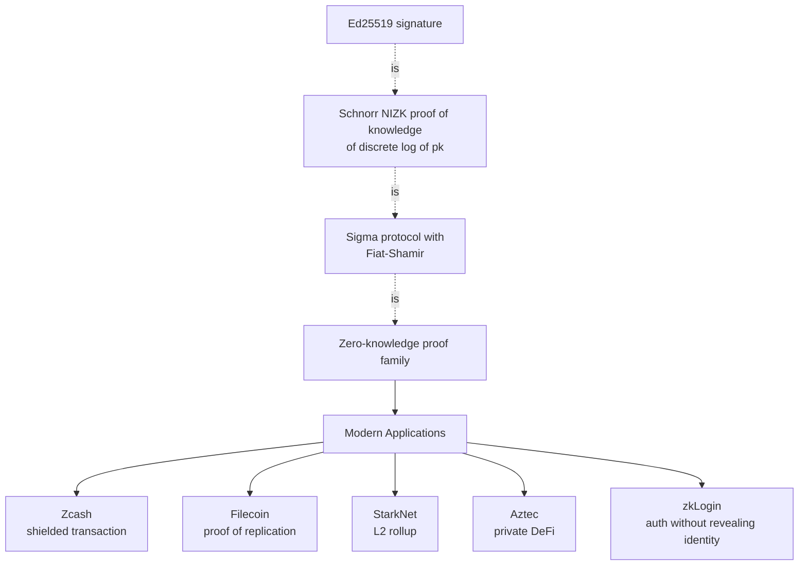
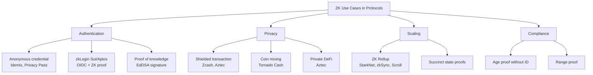
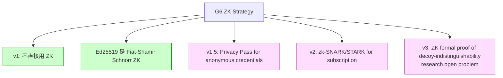

# 課堂 3.10 — 零知識證明入門：Sigma → zk-SNARK → zk-STARK

## 學前知道

- **前置課**：[3.1](./3.1-crypto-goals-taxonomy.md), [3.5](./3.5-elliptic-curves.md), [3.7](./3.7-digital-signatures.md)
- **預計閱讀時間**：100 分鐘
- **必讀論文 / 規格**：
  - Goldwasser, Micali, Rackoff, *The Knowledge Complexity of Interactive Proof Systems*, STOC 1985 / SICOMP 1989（ZK 鼻祖）
  - Goldreich, Micali, Wigderson, *Proofs that Yield Nothing But Their Validity*, FOCS 1986 / JACM 1991（ZK for NP）
  - Schnorr identification (3.7 已 cover)
  - Fiat, Shamir, *How To Prove Yourself: Practical Solutions to Identification and Signature Problems*, CRYPTO 1986
  - Groth, *On the Size of Pairing-Based Non-interactive Arguments*, EUROCRYPT 2016（Groth16 zk-SNARK）
  - Ben-Sasson, Bentov, Horesh, Riabzev, *Scalable, transparent, and post-quantum secure computational integrity*, IACR 2018（zk-STARK）
  - Bünz, Bootle, Boneh, Poelstra, Wuille, Maxwell, *Bulletproofs: Short Proofs for Confidential Transactions and More*, IEEE S&P 2018
  - Gabizon, Williamson, Ciobotaru, *PLONK*, IACR 2019
  - Nakamoto, *Bitcoin: A Peer-to-Peer Electronic Cash System*, 2008（context for ZK in privacy coins）

> ZK 是 cryptography 的「未來工具」。當前 G6 不直接用 ZK，但 Phase III 設計 anonymous authentication / decoy traffic indistinguishability formalization 都可能用到。本堂建立 baseline：sigma protocol、Fiat-Shamir、zk-SNARK / zk-STARK 概念、Schnorr signature 本身就是 NIZK 的特例。

---

## 動機：你已經用過 ZK 了



Ed25519 簽章你已經寫過——技術上是 Fiat-Shamir 化的 Schnorr ZK proof of「我知道對應於 pk 的 sk」。本堂把這個你**已經在用**的東西 generalize 到任意 NP statement。

---

## 核心概念

### 1. ZK 的 GMR 定義

**互動式證明系統 (Interactive Proof System) for language L**：
- Prover P (polynomial 算力 + secret w), Verifier V (polynomial 算力)。
- 輸入 x，目標：P 想說服 V that x ∈ L。
- **Completeness**: x ∈ L ⇒ Pr[V accepts after honest interaction] ≥ 2/3。
- **Soundness**: x ∉ L ⇒ Pr[any malicious P* convinces V] ≤ 1/3。

**Zero-Knowledge** (GMR 1985)：對任何 malicious V*，存在 PPT simulator S 使 simulated transcript 與 real transcript **distributionally indistinguishable**。意義：V 從互動學到的 information **可以自己 simulate**——沒從 P 學到任何 extra knowledge。

**三變體**:
- **Perfect ZK**: transcripts 完全相同 distribution。最強。
- **Statistical ZK**: statistically close (negligible difference)。
- **Computational ZK**: only PPT distinguishers 無法區分。最弱但實務最常用。

### 2. Sigma Protocol (3-move)

Σ-protocol = (commit, challenge, response) three-move structure:

```text
P → V: a (commitment)
V → P: e (random challenge)
P → V: z (response)
V: check predicate Φ(x, a, e, z)
```

**Schnorr identification** 是 sigma protocol:
```text
Statement: P knows w s.t. y = g^w (y is public)
P: r ← random; a = g^r; send a
V: e ← random in {0,1}^t; send e
P: z = r + e·w mod q; send z
V: check g^z == a · y^e
```

**Sigma protocol 性質**:
- **Completeness**: honest P knows w → V accepts always.
- **Special soundness**: 從兩個不同 challenge 對同 a 的 response (e_1, z_1), (e_2, z_2)，可 extract w = (z_1 - z_2) / (e_1 - e_2) mod q.
- **Honest-Verifier ZK (HVZK)**: simulator 可生成 (a, e, z) accepted transcript without knowing w (給定 random e: 選 z random; computed a = g^z / y^e)。

### 3. Fiat-Shamir 轉換：interactive → NIZK

把 Sigma protocol 變 non-interactive：用 hash function 替代 verifier's random challenge。

```text
Original Sigma:
    P → V: a
    V → P: e  (random)
    P → V: z

Fiat-Shamir variant (NIZK):
    P computes:
        a = first move
        e = H(x ‖ a)         // hash replaces random challenge
        z = response
    Send (a, z) as proof.
    V verifies: e = H(x ‖ a); Φ(x, a, e, z) == valid.
```

**Schnorr → Schnorr signature**:
- Schnorr ZK proof of knowledge of sk:
  - P: r ← random; R = g^r; e = H(R ‖ pk); z = r + e·sk; send (R, z)
  - V: check g^z == R · pk^e

這正是 Schnorr signature (with message M instead of just pk)!

**EdDSA = Schnorr-with-hash-message NIZK**:
- 簽章 M：proof of "I know sk such that pk = sk·G, in context M"。

### 4. zk-SNARK (Succinct Non-interactive Argument of Knowledge)

**zkSNARK 的關鍵性質**：
- **Succinct**: proof size 與 statement size **大致 independent**（典型 ~200 byte for any NP statement）。
- **Non-interactive**: 一次 P → V 通訊。
- **Argument of knowledge**: extractor 可從 P 提取 witness。
- **Zero-knowledge**: V 學不到 witness 任何 information。

**Groth16 zk-SNARK** (Groth 2016) — 當前最廣部署：
- **Setup**: trusted setup ceremony 生成 (Common Reference String, CRS) — 必須安全銷毀 toxic waste。
- **Prove**: proof size 3 group elements ~192 byte。
- **Verify**: 3 pairing operations + small arithmetic ~10 ms。

**Trusted setup 問題**: CRS 生成過程的 randomness 若被持有 → attacker 可偽 proof。Zcash 用 ceremony with multiple participants — only need ONE honest participant for security ("powers of tau"). 6+ rounds, ~1000+ participants。

**部署**:
- **Zcash** 2016+ 用 Groth16 for shielded transactions。
- **Tornado Cash** 用 Groth16 for transaction mixing。
- **Filecoin** 用 SNARK for proof of replication。

### 5. zk-STARK (Ben-Sasson 等 2018)

**STARK** = Scalable, Transparent ARgument of Knowledge。改善 SNARK 三大缺陷：
- **Transparent**: 無 trusted setup（只用 public randomness）。
- **PQ-safe**: 基於 hash function + Reed-Solomon code，不依賴 elliptic curve / pairing → Shor 不破。
- **Scalable**: prover 時間 quasi-linear in statement size。

代價：
- **Proof size larger**: ~100 KB vs SNARK ~200 byte。
- **Verify time longer**: ~10 ms but dependent on log²(N)。

**部署**:
- **StarkNet (StarkWare)** L2 rollup on Ethereum 用 STARKs。
- **StarkEx** Layer-2 scaling solution。

### 6. Bulletproofs (Bünz 等 2018)

**Bulletproofs** = inner-product argument based ZK。優勢：
- **No trusted setup**.
- **Short proofs**: ~700 byte for range proof of 64-bit value（vs Bulletproofs+ ~400 byte）。
- **Aggregatable**: combine multiple proofs cost-effectively。

代價：
- **Verify time linear in statement size**: 不如 SNARK 的 O(1)。
- **Specific applications**: 主要對 range proof / arithmetic circuit 高效；general NP 較慢。

**Monero** 從 2018 起用 Bulletproofs replace 之前 confidential transaction proof，size 從 ~13 KB 減到 ~2 KB。

### 7. ZK in protocols: 用例分類



### 8. ZK for G6: 候選用例

G6 目前 spec 不依賴 ZK，但 Phase III 設計 may use ZK 在：

1. **Anonymous authentication**: client 證明「我有 valid subscription credential」without revealing 哪個。Privacy Pass framework。Use case: 機場 (proxy provider) 不想知道 user identity 但要 verify 有付費。
2. **Decoy-indistinguishability formalization**: 證明 protocol traffic distribution indistinguishable from cover protocol distribution. open research problem.
3. **Reputation system**: 證明「我的 IP 過去無 abuse history」without revealing IP. zkLogin-like。

**現實主義**: ZK overhead 對 high-throughput proxy 重；G6 v1 不採用，v2/v3 視需求。

### 9. Post-quantum ZK

- **Hash-based**: zk-STARK 是 PQ-safe (依賴 hash + Reed-Solomon)。
- **Lattice-based**: Bulletproof-like on lattice (Esgin 等 2019 等) — PQ-safe variants。
- **Code-based**: Stern's protocol 等 PQ-safe alternatives。

當前 SNARK (Groth16) 是 PQ-vulnerable (pairing-based)。

### 10. G6 對 ZK 的策略

| Phase | ZK 採用 |
|---|---|
| v1 (2026) | 不採用 |
| v1.5 (2027) | 評估 Privacy Pass for anonymous credentials |
| v2 (2028) | 可能加 zk-credential for subscription management |
| v3 (2029+) | Decoy-indistinguishability formal proof via ZK (long-shot research) |

---

## 與我們協議設計的關聯

| 設計問題 | 答案 |
|---|---|
| 當前 G6 用 ZK 嗎 | 不直接用；EdDSA 是 ZK 的 special case 但 implicit |
| 未來 anonymous auth | Privacy Pass (Schnorr-based ZK credential) |
| 未來 subscription privacy | zk-SNARK / zk-STARK for credential validity |
| Decoy-indistinguishability proof | ZK statement formalization (research open problem) |
| PQ migration | zk-STARK / lattice-based (avoid pairing-SNARK) |

---

## 動手：實作 Schnorr ZK proof of knowledge

```python
from hashlib import sha256
from secrets import randbelow

# Group: Curve25519 (simplified using big int mod p for illustration)
p = 2**255 - 19
q = 2**252 + 27742317777372353535851937790883648493  # base point order
g = ...  # base point in Edwards form

# Statement: prover knows w s.t. y = g^w
w = randbelow(q)           # secret witness
y = pow(g, w, p)            # public statement

# Prove (Fiat-Shamir non-interactive)
r = randbelow(q)
a = pow(g, r, p)
e = int.from_bytes(sha256(str(y).encode() + str(a).encode()).digest(), 'big') % q
z = (r + e * w) % q

proof = (a, z)

# Verify
e_check = int.from_bytes(sha256(str(y).encode() + str(a).encode()).digest(), 'big') % q
left = pow(g, z, p)
right = (a * pow(y, e_check, p)) % p
assert left == right
print("Proof verified.")
```

---

## 自我檢查

1. 寫出 Schnorr ZK proof of knowledge of sk for pk = sk·G。為什麼 V 學不到 sk？
2. Fiat-Shamir 轉換把 interactive 變 non-interactive 的代價是什麼？(hint: ROM 假設)
3. zk-SNARK 為什麼 succinct (proof O(1) regardless of statement size)? 簡述 Groth16 結構 idea。
4. zk-STARK vs zk-SNARK 三個主要差別？
5. Trusted setup 為什麼是 SNARK 的爭議？Zcash 怎麼處理？
6. Bulletproofs 比 SNARK 在 range proof 上的優劣？
7. G6 引入 ZK 的 cost (throughput / latency / complexity)? 哪個 application 值得？

---

## 延伸閱讀

- Boneh-Shoup *Graduate Course in Applied Cryptography* Chapter 19 — ZK rigorous treatment。
- Berentsen-Bramen-Kohbrok 2024 *Survey of Zero-Knowledge Proof Systems* — comprehensive review。
- Vitalik Buterin *Quadratic Arithmetic Programs* blog series — accessible SNARK intro。
- 0xParc lectures on ZK — modern engineering view。
- ZK proofs Stanford CS 357 — academic course。

---

## 研究級補遺

### 1. 學界詞彙

- **Witness Extractor**: PPT algorithm that, given prover's transcript, extracts witness w. Required for "proof of knowledge"。
- **Soundness Error**: probability that cheating prover convinces V。
- **Knowledge Soundness**: stronger than soundness; witness extractable。
- **Witness Indistinguishability**: weaker than ZK; V 可知 statement 真但不知用哪個 witness。
- **Polynomial Commitment (KZG)**：modern SNARK 內部 building block。
- **CRS (Common Reference String) / SRS (Structured Reference String)**: trusted setup 產物。
- **NIZK in CRS model / NIZK in ROM**: 兩種 non-interactive 模型。
- **Plonkish / Halo / Plonky2**：modern SNARK 變體 family。
- **Recursive SNARK**: proof of proof, 用於 rollup state aggregation。
- **Folding schemes (Nova, ProtoStar)**：efficient recursive ZK。

### 2. 形式化定義

**Interactive Proof System (IP)**:
```text
(P, V) = pair of probabilistic interactive Turing machines.
On input x:
    (P, V)(x) → V's output bit (accept/reject)
    
Completeness: x ∈ L ⇒ Pr[(P, V)(x) = 1] ≥ 2/3
Soundness:    x ∉ L ⇒ ∀ P*, Pr[(P*, V)(x) = 1] ≤ 1/3
```

**Zero-Knowledge (computational)**:
```text
∀ PPT verifier V*, ∃ PPT simulator S such that
∀ x ∈ L:
    {View_{V*}^{P, V*}(x)} ≈_c {S(x)}
where ≈_c means computationally indistinguishable.
```

**Proof of Knowledge** (Bellare-Goldreich 1992):
```text
∃ PPT extractor E such that
∀ PPT prover P*:
    if P* convinces V with probability ε,
    then E^{P*}(x) outputs witness w in expected time poly(|x|) / ε.
```

### 3. 關鍵論文

1. **GMR 1985/1989** — ZK 鼻祖。
2. **GMW 1986/1991** — ZK for all NP。
3. **Fiat-Shamir 1986** — NI transformation。
4. **Bellare-Goldreich 1992** — proof of knowledge formal。
5. **Groth 2016 Groth16** — efficient pairing-based SNARK。
6. **Ben-Sasson 等 2018 STARKs** — transparent + PQ。
7. **Bünz 等 2018 Bulletproofs**。
8. **Gabizon-Williamson-Ciobotaru 2019 PLONK**。
9. **Goldreich-Krawczyk 1996** *On the Composition of Zero-Knowledge Proof Systems* — composition theorems。
10. **Canetti 等 *Black-Box Concurrent Zero-Knowledge*** — concurrent setting。

### 4. G6 座標



### 5. 必追資源

- **ZKProof.org** — community standardization。
- **a16z crypto / 0xParc** — academic + engineering blog。
- **eprint.iacr.org/search?q=zk-SNARK** — 持續論文。
- **Ethereum ZK ecosystem** (zkSync, StarkNet, Scroll, Polygon zkEVM)。

### 6. 開放問題

- **ZK in protocol-level threat model**：把 protocol indistinguishability 形式化為 ZK statement。具體在 G6 cover-traffic 場景 open。
- **Post-quantum SNARK**: lattice-based PLONK 等 active research。
- **Recursive proof composition efficiency**: Nova, ProtoStar 等 folding schemes 仍 evolving。
- **ZK for streaming / online statement**: 多數 SNARK 假設 offline statement; online streaming 開放。

---

> **下一堂預告**：3.11 後量子密碼 (PQC) — Kyber, Dilithium, SPHINCS+, NIST 標準化 timeline。
