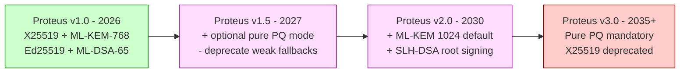
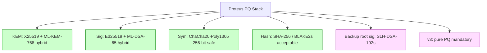

# 課堂 3.11 — 後量子密碼 (PQC)：ML-KEM / ML-DSA / SLH-DSA / Falcon

## 學前知道

- **前置課**：[3.4](./3.4-rsa.md), [3.5](./3.5-elliptic-curves.md), [3.6](./3.6-key-exchange.md)
- **預計閱讀時間**：120 分鐘
- **必讀論文 / 規格**：
  - Shor, *Polynomial-Time Algorithms for Prime Factorization and Discrete Logarithms on a Quantum Computer*, SIAM J. Comp. 1997（quant-ph/9508027）
  - Grover, *A Fast Quantum Mechanical Algorithm for Database Search*, STOC 1996
  - NIST FIPS 203 (2024) — *Module-Lattice-Based Key-Encapsulation Mechanism Standard* (ML-KEM, formerly Kyber)
  - NIST FIPS 204 (2024) — *Module-Lattice-Based Digital Signature Standard* (ML-DSA, formerly Dilithium)
  - NIST FIPS 205 (2024) — *Stateless Hash-Based Digital Signature Standard* (SLH-DSA, formerly SPHINCS+)
  - Bos 等, *CRYSTALS-Kyber: a CCA-secure module-lattice-based KEM*, EuroS&P 2018
  - Ducas 等, *CRYSTALS-Dilithium: a Lattice-Based Digital Signature Scheme*, IACR 2018
  - Castryck, Decru, *An Efficient Key Recovery Attack on SIDH*, EUROCRYPT 2023
  - Gidney, Ekerå, *How to factor 2048 bit RSA integers in 8 hours using 20 million noisy qubits*, Quantum 2021
  - Cloudflare hybrid PQ deployment whitepaper (2022)
  - draft-ietf-tls-hybrid-design (X25519+Kyber768 in TLS 1.3)
- **必讀原始碼**：
  - `pq-crystals/kyber` reference impl
  - `pqclean/crypto_kem/kyber768`
  - boringssl `crypto/kyber/`

> Shor 1994 證明量子電腦多項式時間破 RSA / DH / ECC。NIST PQ standardization 2016-2024 結束，產出 ML-KEM / ML-DSA / SLH-DSA / FN-DSA (Falcon) 標準。**Proteus 必須 PQ-hybrid** — 不為了 today's adversary，是為了「Harvest Now, Decrypt Later」對手。本堂處理 PQC primitive、attack timeline、deployment strategy、Proteus PQ migration plan。

---

## 動機：「Harvest Now, Decrypt Later」是真實威脅

當前 GFW / 國家級 SIGINT 可錄下所有 TLS / VPN 流量保存。10-30 年後 fault-tolerant quantum computer 上線 → 解開所有錄存。對長壽價值的 information (商業機密、個人 PII、政府文件) 仍 critical。

**對 Proteus 計算**：
- 如果 Proteus v1 (2026) 只用 X25519，使用者 2026 流量在 2040 年可能被解。
- 解法：今天就用 hybrid X25519 + Kyber768 → 即使 X25519 被 Shor 破，Kyber 仍 secure → session key uncompromised。

**Cloudflare 2022 statement**: 「post-quantum migration 應該在 2030 年前完成」。NIST 2024 published FIPS 203/204/205 後，整個產業 starting migration。

---

## 核心概念

### 1. Quantum threat 概覽

```mermaid
flowchart TD
    Quantum[Quantum Algorithm Threats]
    Quantum --> Shor[Shor 1994<br/>polynomial-time]
    Shor --> RSA_break[RSA factor]
    Shor --> DLP_break[DLP solve]
    Shor --> ECDLP_break[ECDLP solve]
    RSA_break -.kills.-> RSA_dead[RSA, RSA-OAEP, RSA-PSS]
    DLP_break -.kills.-> DH_dead[DH, ElGamal, DSA, MODP-IPsec]
    ECDLP_break -.kills.-> ECC_dead[ECDH, ECDSA, EdDSA, BLS]

    Quantum --> Grover[Grover 1996<br/>quadratic speedup]
    Grover --> SymKey[Symmetric key search<br/>O(2^n) → O(2^n/2)]
    SymKey -.weakens.-> AES128[AES-128 → 64-bit quantum]
    SymKey -.unaffected.-> AES256[AES-256 → 128-bit quantum still safe]
    Grover --> HashColl[Hash collision<br/>BHT: O(2^n/3)]
    HashColl -.weakens.-> SHA256[SHA-256 → 85-bit quantum collision]
```

**結論**:
- 公鑰系統全死。需要 PQ 替代。
- 對稱系統 (AES, ChaCha20) 用 256-bit key 仍 OK。
- Hash 用 384-bit output 才 safe；256-bit still acceptable for most use cases。

### 2. NIST PQ Competition 2016-2024 timeline

```text
2016-12: NIST 開始 PQ Standardization Project
2017-11: Round 1 — 69 candidates submitted
2019-01: Round 2 — 26 candidates
2020-07: Round 3 — 7 finalists + 8 alternates
2022-07: Selected for standardization:
         KEM: CRYSTALS-Kyber → ML-KEM
         Sig: CRYSTALS-Dilithium → ML-DSA, FALCON → FN-DSA, SPHINCS+ → SLH-DSA
2024-08: FIPS 203/204/205 published
2024-10: Round 4 (KEM diversity): BIKE, Classic McEliece, HQC ongoing
2025-?:  FIPS for FN-DSA (Falcon) expected
```

### 3. Lattice-based 主流：Module-LWE / Module-LWR

PQ 主要 mathematical foundations:
- **Lattice-based** (LWE, Ring-LWE, Module-LWE, NTRU): Kyber, Dilithium, Falcon。
- **Hash-based**: SLH-DSA (Sphincs+, only signature)。
- **Code-based**: Classic McEliece, BIKE, HQC (KEM)。
- **Multivariate**: Rainbow (broken 2022); HFE-based。
- **Isogeny-based**: SIDH/SIKE (broken 2022 Castryck-Decru); CSIDH still alive。

**Module-LWE problem** (Kyber 基礎):
```text
Given: matrix A ∈ R_q^{k × k}, vector b = A·s + e ∈ R_q^k
Where: s, e are small (low-norm) vectors in R_q^k = (Z_q[X]/(X^n+1))^k

Find: s (the secret).

Hardness: best known classical attack is lattice reduction (LLL/BKZ) — exponential.
Quantum attacks improve constants but not asymptotic; still secure.
```

R_q = Z_q[X]/(X^n+1) is polynomial ring; Kyber 用 n=256, q=3329.

### 4. ML-KEM (Kyber, FIPS 203 2024)

**KEM (Key Encapsulation Mechanism)** ≠ encryption。流程：
- KGen → (pk, sk)
- Encap(pk) → (c, K)：c is ciphertext, K is shared secret。
- Decap(sk, c) → K。

對應 ECDH 的「DH-style key agreement」抽象升級。

**ML-KEM 變體**:
| Variant | Security | pk size | ct size | sk size | Encap cycles | Decap cycles |
|---|---|---|---|---|---|---|
| ML-KEM-512 | NIST level 1 (~AES-128) | 800 byte | 768 byte | 1632 byte | ~80k | ~110k |
| ML-KEM-768 | NIST level 3 (~AES-192) | **1184 byte** | **1088 byte** | 2400 byte | ~110k | ~140k |
| ML-KEM-1024 | NIST level 5 (~AES-256) | 1568 byte | 1568 byte | 3168 byte | ~150k | ~180k |

**Proteus 選 ML-KEM-768** (NIST level 3, 與 Cloudflare / IETF TLS hybrid spec 對齊)。

**Hybrid 部署 (X25519 + ML-KEM-768)**:
```text
TLS 1.3 KeyShare extension carries:
    X25519 share (32 byte) + ML-KEM-768 share (1184 byte for client / 1088 byte ct for server)

shared_secret = X25519(client_priv, server_pub) ‖ ML-KEM-Decap(sk, c)
master_secret = HKDF(shared_secret, ...)
```

即使 X25519 被 Shor 破，ML-KEM 部分仍 secure ⇒ session key OK。

### 5. ML-DSA (Dilithium, FIPS 204 2024)

**Module-LWE-based signature**, Schnorr-like Fiat-Shamir construction on lattice。

**Variants**:
| Variant | Security | pk size | sig size | sk size |
|---|---|---|---|---|
| ML-DSA-44 | NIST level 2 | 1312 byte | 2420 byte | 2528 byte |
| ML-DSA-65 | NIST level 3 | **1952 byte** | **3293 byte** | 4032 byte |
| ML-DSA-87 | NIST level 5 | 2592 byte | 4595 byte | 4896 byte |

**Proteus 選 ML-DSA-65** (level 3，與 ML-KEM-768 對齊)。

**Algorithm sketch (ML-DSA-Sign)**:
```text
1. Sample y ← random small in R_q^l
2. w = A·y mod q
3. c = H(M, w_high)   // c is "challenge polynomial"
4. z = y + c·s
5. If z, w-c·s 不滿足 norm bound: retry (rejection sampling)
6. Output (z, c, h_hint)
```

Verify checks specific norm bounds + recomputes challenge from z, c。

效能 (Skylake): sign ~700k cycles, verify ~250k cycles。比 Ed25519 (50k/140k) 慢 10×；但仍 sub-millisecond。

### 6. SLH-DSA (SPHINCS+, FIPS 205 2024) — Hash-based 後備

**Stateless hash-based signature**: 安全性只依賴 hash function (SHA-256/SHAKE256)。**不依賴 lattice / pairing / number theory**。

**最大 advantage**: 對未知 cryptanalysis 最 robust（hash function 是 cryptographic primitive 中最 well-studied）。

**最大 drawback**:
- Signature size huge: ~7-50 KB depending on variant。
- Sign 慢 (~milliseconds)。
- Verify 較快 (microseconds)。

| Variant | Security | sig size |
|---|---|---|
| SLH-DSA-128f | level 1 (fast) | ~17 KB |
| SLH-DSA-128s | level 1 (small) | ~8 KB |
| SLH-DSA-192s | level 3 | ~16 KB |
| SLH-DSA-256s | level 5 | ~30 KB |

**對 Proteus**: 不選 SLH-DSA 為 primary signature (太大)；但**作為 backup signature** 在 long-term identity binding 場景 (e.g., software update root CA) 是 candidate — hash-based 對未來 cryptanalysis 最 conservative。

### 7. FN-DSA (Falcon)

**NTRU-lattice + tree-based hash**: signature 比 ML-DSA 小，但 implementation 複雜（用 floating-point arithmetic 引入 side-channel concern）。

| Variant | Security | pk size | sig size |
|---|---|---|---|
| Falcon-512 | level 1 | 897 byte | 666 byte |
| Falcon-1024 | level 5 | 1793 byte | 1280 byte |

**Proteus 不選 Falcon** for v1: floating-point implementation 增加 attack surface; ML-DSA 更 robust to side-channel。Future v2 若 size critical 可重 evaluate。

### 8. SIKE / SIDH 災難 (Castryck-Decru 2022)

SIDH/SIKE 是 Round 4 KEM finalist，**isogeny-based** — math 結構不同 (elliptic curves 之間的 isogeny graph)。2022-07-30 Castryck-Decru 用 ~1 hour on laptop 完整 break SIKE。

教訓：**新 math 假設**（pioneering 一種 hard problem）有 inherent risk。SIKE 25+ 年 research, still broken。**Proteus 不嘗試 cutting-edge non-NIST PQ scheme**；只用 NIST-standardized (ML-KEM/DSA + SLH-DSA)。

### 9. Hybrid Mode 設計

**為什麼 hybrid 而非 pure PQ**:
1. PQ schemes 較新 — cryptanalysis 仍 evolving。
2. Hybrid 給 「best of both worlds」：classical 破則 PQ 救；PQ 破則 classical 救。
3. NIST 推 hybrid for 過渡期。

**Hybrid KEM (X25519 + ML-KEM-768)**:
```text
shared_secret = HKDF-Concatenate(X25519_shared, MLKEM_shared)
                 = HKDF(X25519_shared ‖ MLKEM_shared, salt=transcript_hash)
```

**Hybrid Signature (Ed25519 ‖ ML-DSA-65)**:
```text
σ = Ed25519_Sign(sk_ed, M) ‖ MLDSA_Sign(sk_dsa, M)
verify: Ed25519_Verify(pk_ed, M, σ_ed) AND MLDSA_Verify(pk_dsa, M, σ_dsa)
```

Both must verify → forge requires breaking both。

**Cloudflare 2022 deployment**: TLS 1.3 with X25519+Kyber768 hybrid; 部署 ~10% Cloudflare traffic 由此 cipher。

### 10. Quantum hardware timeline

**Gidney-Ekerå 2021** estimate:
- Factor RSA-2048: ~20 million physical qubits + ~8 hours.
- Current state-of-art (2025): IBM Heron R2 ~1000 logical qubits; Google Willow ~100 logical qubits with error correction.
- Estimated timeline for cryptographically relevant quantum: 2035-2045 (most surveys).

**對 Proteus implication**:
- 2026 年部署 hybrid X25519+Kyber 給 ~20 年 buffer。
- 2040 年代 should fully migrate to pure PQ if X25519 deemed crackable。

### 11. Proteus PQ Migration Plan



---

## 與我們協議設計的關聯

| 設計問題 | 答案 |
|---|---|
| KEM | X25519 + ML-KEM-768 hybrid |
| Signature | Ed25519 + ML-DSA-65 hybrid |
| 對稱層 | ChaCha20-Poly1305 (256-bit key, post-Grover OK) |
| Hash | SHA-256 / BLAKE2s (post-Grover collision OK for our use) |
| Hybrid combine | HKDF concatenation |
| Future migration | versioned spec; v2/v3 progressively pure PQ |

---

## 動手：用 pqclean ML-KEM-768 跑 hybrid handshake

```c
// Kyber768 KEM
#include "PQClean/crypto_kem/ml-kem-768/clean/api.h"

uint8_t pk[1184], sk[2400], ct[1088], ss_alice[32], ss_bob[32];

// Alice keygen
PQCLEAN_MLKEM768_CLEAN_crypto_kem_keypair(pk, sk);

// Bob encapsulate (knowing alice pk)
PQCLEAN_MLKEM768_CLEAN_crypto_kem_enc(ct, ss_bob, pk);

// Alice decapsulate
PQCLEAN_MLKEM768_CLEAN_crypto_kem_dec(ss_alice, ct, sk);

// Verify
assert(memcmp(ss_alice, ss_bob, 32) == 0);

// Hybrid combine with X25519
uint8_t x25519_shared[32];
// ... compute X25519 ...
uint8_t hybrid_input[64];
memcpy(hybrid_input, x25519_shared, 32);
memcpy(hybrid_input + 32, ss_alice, 32);
uint8_t master_secret[32];
HKDF_Extract(transcript_hash_salt, hybrid_input, 64, master_secret);
```

---

## 自我檢查

1. Shor 演算法為什麼 polynomial-time 解 ECDLP？quantum register 怎麼 encode period finding？
2. Grover 對 AES-256 key search 給多少 speedup？最終 effective security？
3. 為什麼 hybrid X25519+Kyber 而非 pure Kyber？兩個 risk 各自?
4. ML-KEM-768 vs ML-KEM-1024：效能 vs security trade-off。為什麼 Proteus 選 768？
5. SLH-DSA 為什麼 sig 那麼大 (~17 KB)？trade-off 是什麼？Proteus 為什麼 backup 而非主用？
6. SIKE 災難 (Castryck-Decru 2022) 給 Proteus 什麼教訓？
7. Quantum hardware timeline (~2035-2045) 與 Proteus v1 deployment plan 如何對齊？

---

## 延伸閱讀

- Bernstein-Lange *Post-Quantum Cryptography* (Nature 2017) — overview。
- Bernstein 等 *eBACS PQ benchmarks* — performance comparison。
- Cloudflare research blog series on PQ deployment。
- Mosca *Cybersecurity in an era with quantum computers: will we be ready?* (IEEE S&P Magazine 2018) — risk timeline。
- ETSI / NIST PQ migration guides。

---

## 研究級補遺

### 1. 學界詞彙

- **NIST Security Levels (1-5)**: PQ scheme 對應 classical brute-force AES-128/192/256 + collision SHA。
- **LWE / Ring-LWE / Module-LWE / Plain LWE**：lattice problem 變體階梯。
- **Key Encapsulation Mechanism (KEM)** vs **Public Key Encryption (PKE)**：KEM 輸出 random K, 不送 chosen plaintext.
- **Fiat-Shamir + Aborts**: ML-DSA / Dilithium 簽章 reject sampling 技術。
- **Trapdoor sampler**: Falcon 用 NTRU lattice trapdoor。
- **Hash-and-Sign**: SLH-DSA 用 multi-tree Merkle structure。
- **Quantum random oracle model (QROM)**: PQ scheme 安全 proof 在 QROM 下證。
- **Hybrid combiner**: how to safely combine PQ + classical (concatenation, XOR, etc.)。

### 2. 形式化定義

**KEM IND-CCA2 game**:
```text
Game IND-CCA2-KEM(A, KEM = (KGen, Encap, Decap)):
    (pk, sk) ← KGen
    b ← {0, 1}
    
    A queries Decap oracle on any c (except c*)。
    
    challenge:
        (c*, K_0) ← Encap(pk)
        K_1 ← random
        send (c*, K_b)
    
    A guesses b'.
    Adv = |Pr[b'=b] - 1/2|
```

**Quantum adversary**: 在 QROM 中 hash 可被 quantum query (superposition input)。

### 3. 關鍵論文

1. **Shor 1994** — quantum poly-time factor / DLP。
2. **Grover 1996** — quantum search。
3. **Regev 2005 *On lattices, learning with errors...*** (STOC) — LWE definition。
4. **NIST FIPS 203/204/205 (2024)** — ML-KEM / ML-DSA / SLH-DSA。
5. **Bos 等 CRYSTALS-Kyber** (EuroS&P 2018)。
6. **Ducas 等 CRYSTALS-Dilithium** (IACR 2018)。
7. **Bernstein 等 SPHINCS+** (CCS 2019)。
8. **Castryck-Decru SIDH attack** (EUROCRYPT 2023) — break SIKE。
9. **Gidney-Ekerå 2021** — quantum factor cost estimate。
10. **Bos 等 PQNoise** (preprint 2020+) — Noise framework PQ extension。

### 4. Proteus 座標



### 5. 必追資源

- **NIST PQC project page**: csrc.nist.gov/projects/post-quantum-cryptography。
- **IETF CFRG hybrid drafts**: draft-ietf-tls-hybrid-design 等。
- **Open Quantum Safe (OQS) project** — liboqs library 含所有 PQ candidates。
- **Cloudflare research** — practical hybrid PQ deployment data。
- **eprint.iacr.org/search?q=lattice** — 持續 cryptanalysis。

### 6. 開放問題

- **PQ-AKE 全套 hybrid + PCS**: PQ KE 給 FS 但 PCS 設計仍 evolving。
- **PQ-PAKE**: OPAQUE post-quantum migration 仍 IETF draft 階段。
- **PQ ZK**: lattice-based SNARK / STARK 仍 active research。
- **PQ side-channel resistance**: lattice operations 易 timing-leak (rejection sampling 等)。
- **Implementation maturity**: liboqs / pqclean 仍 evolving；production-grade impl (BoringSSL, ring) 仍在 add PQ support。

---

> **下一堂預告**：3.12 隨機性 — getrandom/dev urandom 之爭、PRNG 出包史 (Debian, Sony PS3)、Heninger Mining your Ps and Qs。
