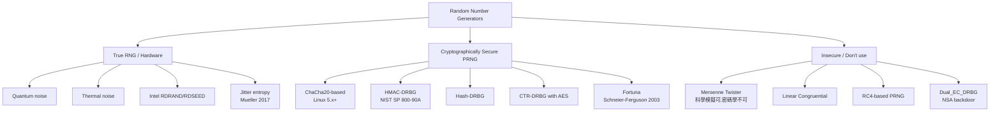

# 課堂 3.12 — 隨機性：getrandom、/dev/urandom 之爭與所有 PRNG 災難

## 學前知道

- **前置課**：[3.1](./3.1-crypto-goals-taxonomy.md), [3.4](./3.4-rsa.md), [3.5](./3.5-elliptic-curves.md)
- **預計閱讀時間**：90 分鐘
- **必讀論文 / 規格**：
  - Heninger, Durumeric, Wustrow, Halderman, *Mining your Ps and Qs: Detection of Widespread Weak Keys in Network Devices*, USENIX Security 2012
  - Goldberg, Wagner, *Randomness in the Netscape Browser*, Dr. Dobb's Journal 1996
  - Lenstra, Hughes, Augier, Bos, Kleinjung, Wachter, *Public Keys*, CRYPTO 2012
  - Checkoway 等, *On the Practical Exploitability of Dual EC in TLS Implementations*, USENIX Security 2014
  - Bernstein, *Entropy Attacks!* (blog 2014)
  - NIST SP 800-90A Rev. 1 (2015) — *Recommendation for Random Number Generation Using Deterministic Random Bit Generators*
  - NIST SP 800-90B (2018) — *Recommendation for the Entropy Sources Used for Random Bit Generation*
  - NIST SP 800-90C (draft) — *Recommendation for Random Bit Generator (RBG) Constructions*
  - Linux kernel `/dev/random` history (Mueller 2017+) — getrandom() spec
- **必讀原始碼**：
  - Linux kernel `drivers/char/random.c`
  - boringssl `crypto/fipsmodule/rand/`
  - macOS `getentropy()` man page

> RNG 是整個 cryptographic stack 的單點故障——RNG 弱化 → 所有 keys/nonces/IVs 全死。歷史災難一籮筐：Debian OpenSSL 2008 (Bug #363516)、Sony PS3 2010、Android Bitcoin wallet 2013、Heninger 2012 IoT shared primes、Dual_EC_DRBG backdoor (Snowden 2013)。本堂處理：entropy source、CSPRNG 設計、實作 pitfalls、G6 的 RNG strategy。

---

## 動機：「我用 SHA-256(time + pid)」

```python
import hashlib, time, os
seed = hashlib.sha256(str(time.time()).encode() + str(os.getpid()).encode()).digest()
```

❌ **錯誤**。
- `time.time()` 精度 ~1 ms，attacker 可猜到 ~10 bits randomness。
- `os.getpid()` 有 ~16 bits but attacker 可枚舉。
- 結果：seed entropy ~26 bits → brute-forceable in seconds。

**正確做法**：
```python
import secrets
key = secrets.token_bytes(32)   # 內部 = os.urandom = getrandom() = /dev/urandom
```

### 1. RNG 分類



**G6 用**: Linux `getrandom(2)` → kernel ChaCha20-based CSPRNG with multiple entropy sources。

### 2. Entropy sources

**True entropy** 來自物理 unpredictable phenomena:
- **Thermal noise / shot noise**: hardware RNG。
- **CPU jitter**: Mueller 2017 jitter entropy daemon — 用 CPU 執行時間 unpredictability。
- **Disk seek timing**: 旋轉硬碟時代主要 source；SSD 後幾乎無。
- **Interrupt timing**: network packet / keyboard / mouse interrupt jitters。
- **RDRAND / RDSEED**: Intel 硬體 RNG (2012+)。

**爭議**:
- **RDRAND trust**: Snowden 2013 暗示 NSA 可能 backdoor。Linux 不純用 RDRAND，與其他 source XOR。
- **Hardware RNG bias**: 物理 source 可能 biased；需要 von Neumann extractor 或 hash 擴大 entropy。

### 3. CSPRNG 設計：modern Linux

**Linux 5.18+ (2022) random.c rewrite**:
```text
Architecture:
    primary_pool: ChaCha20 state (32 byte)
    entropy_count: integer tracking total entropy bits
    add_input_randomness(): mix hardware events, RDRAND, jitter into pool

Output:
    getrandom(buf, len, flags):
        block until pool initialized (≥ 256 bits entropy)
        ChaCha20 stream cipher output, periodic rekey from pool
        return len bytes

    /dev/urandom: same as getrandom() (post 5.18)
    /dev/random:  blocking variant; for kernel-internal use mainly
```

**Pre-5.18 history**:
- Blocking `/dev/random` vs non-blocking `/dev/urandom`：
  - `/dev/random` blocks if entropy estimate < threshold → cryptographic primitive 慢甚至 hang。
  - `/dev/urandom` always non-blocking → 但 systemd boot phase 可能 entropy 不足。
- Dichotomy 引發 myth: 「`/dev/random` for keys, `/dev/urandom` for other」**這是錯的**。Bernstein 2014 *Entropy Attacks!* 講清楚：CSPRNG 一旦 seeded with 256-bit entropy 即可 produce 任意長 secure output，不需「補充 entropy」。

**修補**: getrandom(2) (Linux 3.17, 2014)：
- 等候 boot-time entropy 滿足。
- 之後永不 block。
- 替代 `/dev/random` 的 cryptographic use case。

### 4. 災難史 (你必須知道)

#### 4.1 Debian OpenSSL 2008 (Bug #363516)

2006 年 Debian 修補 OpenSSL 一個 Valgrind warning，**意外移除** seed entropy mixing：
```c
// Removed line (incorrectly):
// MD_Update(&m, buf, j);
```
結果：OpenSSL on Debian / Ubuntu 從 2006-2008 期間生成的 SSH / SSL / OpenVPN keys **entropy 只有 PID (~32k 個 possible keys)**。

修補 (2008-05): 重新加上 mixing。但 affected 期間生成的 keys 全部 weak — 必須換掉 millions of cert + ssh keys。

#### 4.2 Sony PS3 2010

PS3 firmware update signing 用 ECDSA。Sony 開發者用 **constant nonce k** for all signs (應該每次 random)。
災難：兩個 different update 用同 k → 用 ECDSA nonce reuse attack 公式立刻解 sk。Hackers 拿 root key, PS3 chain of trust 完全崩塌。

#### 4.3 Android Bitcoin wallet 2013

Android `SecureRandom` 有 RNG seeding bug：app 直接調用時 PRNG state 可能未 init → biased nonce。多個 Bitcoin wallet app 用 ECDSA sign transaction 時 nonce 重複/偏 → 對手從鏈上 ECDSA signature 推 sk → 偷走 wallet。Total loss ~$50k 當時。

#### 4.4 Heninger 2012 *Mining your Ps and Qs*

掃描全 IPv4 HTTPS / SSH server。發現：
- 5.57% TLS hosts share keys (相同 cert public)。
- 0.5% TLS hosts share **RSA primes** — GCD(N_1, N_2) = shared prime → factor both N_1, N_2。
- 主要受害者: 嵌入式 routers, printers, VoIP 設備。原因: 設備首次啟動 entropy pool empty + 立即 generate key。

修補: kernel 不准 KGen until entropy pool seeded。

#### 4.5 Lenstra 2012 *Public Keys*

更大規模 scan: 11M+ public RSA keys collected from PGP / X.509 / SSH。發現 ~27,000 keys share factors → 立刻 factor。同樣原因: weak entropy in 嵌入式 KGen。

#### 4.6 Dual_EC_DRBG (2007-2013)

NIST SP 800-90A 標準化 Dual_EC_DRBG (基於 ECC 的 DRBG)。Shumow-Ferguson 2007 指出 design 可能有 backdoor: 兩個 hard-coded constants P, Q 是 ECC points; 若 Q = c · P with known c (NSA-known), holder of c can predict DRBG output from few output bytes.

Snowden 2013 文件 confirmed: NSA pushed Dual_EC_DRBG into NIST + paid RSA Inc $10M to make it default in BSAFE library.

修補:
- 2013-09 NIST 撤回 Dual_EC_DRBG。
- 2014 Checkoway 等 USENIX Security: 完整 documentation Dual_EC 在 TLS 部署中的 practical exploitability。
- RSA Inc Bsafe / Juniper ScreenOS 等都受影響。

**教訓**: 任何「magic constant」without rigid origin 都該警惕。Curve25519 等 modern primitive 強調 nothing-up-my-sleeve constants。

### 5. CSPRNG 構造：DRBG 三種範式

NIST SP 800-90A 標準化三個 DRBG:

1. **Hash-DRBG**: 用 hash function 迭代。簡單但 internal state 較大。
2. **HMAC-DRBG**: 用 HMAC chain。SP 800-90A 推薦；廣泛部署 (BoringSSL, OpenSSL FIPS module)。
3. **CTR-DRBG**: 用 block cipher CTR mode。AES-based; 硬體加速友善。
4. **~~Dual_EC_DRBG~~**: 撤回。

**ChaCha20-DRBG (Linux 5.18+)**: 雖非 NIST 標準但 cryptographically equivalent。

### 6. RNG 在 protocol design 的角色

**G6 用 RNG 的地方**:
1. **Ephemeral key generation**: X25519 / ML-KEM 用 32-byte random。
2. **Nonce / counter**: AEAD nonce 結構含 random component。
3. **PSK generation**: 32-byte random。
4. **Cover-traffic timing jitter**: anti-fingerprinting padding 時序。
5. **Salt for KDF**: HKDF salt 32-byte random。

**G6 RNG requirements**:
- 必用 `getrandom(2)` syscall (Linux) / `getentropy()` (macOS/BSD) / `BCryptGenRandom()` (Windows)。
- 禁用 `/dev/random` (blocking) 與 `rand()` (predictable)。
- 不直接用 `RDRAND`；mix 進 OS pool。
- Spec 內 explicit 要求 implementation use OS CSPRNG。

### 7. RNG 工程 best practices

```mermaid
flowchart TD
    Source[Entropy Source]
    Source --> Pool[OS Entropy Pool]
    Pool --> CSPRNG_K[Kernel CSPRNG<br/>ChaCha20-based]
    CSPRNG_K --> Syscall[getrandom syscall]
    Syscall --> App[Application]

    App --> Use1[Direct use<br/>key gen, nonce]
    App --> Reseed[Periodic reseed<br/>userspace CSPRNG]

    Reseed --> UserCSPRNG[Userspace CSPRNG<br/>e.g., ChaCha20-DRBG]
    UserCSPRNG --> FastPath[Fast path<br/>millions of nonces/sec]

    classDef good fill:#cfc,stroke:#080
    classDef bad fill:#fcc,stroke:#800

    Source --> Hardware[RDRAND/RDSEED]:::good
    Source --> JitterE[Jitter entropy]:::good
    Source --> Old[/dev/random blocking]:::bad
    Source --> Worse[Direct RDRAND only]:::bad
```

**Best practices**:
- 用 OS `getrandom()`，不要 reinvent。
- 啟動時 verify entropy pool seeded (Linux `getrandom(buf, len, 0)` blocks until seeded)。
- 避免在 fork() 後使用未 reseed 的 userspace PRNG (fork bomb 問題)。
- 必須 constant-time hash entropy data (防 side-channel)。

### 8. Embedded / IoT 場景特別 challenges

嵌入式 device 啟動時 entropy 不足:
- 沒有 keyboard/mouse input。
- 旋轉硬碟少 → 缺 disk seek entropy。
- 無 hardware RNG (低成本 IoT chip)。
- 引發 Heninger 2012 shared prime 災難。

**解法**:
- Mfg-time pre-seed: 工廠 burn fixed seed per device (但 seed 必須 unique + secret)。
- Trusted Platform Module (TPM) 提供 entropy。
- Use jitter entropy daemon as soft hardware RNG。
- Defer KGen until entropy sufficient。

**G6 IoT-target deployment**: spec 要求 device 在 ≥ 256-bit entropy seeded **after** KGen.

---

## 與我們協議設計的關聯

| 設計問題 | 答案 |
|---|---|
| RNG source | OS getrandom() / getentropy() / BCryptGenRandom() |
| Block until seeded? | 是；first KGen 等候 OS entropy。 |
| Userspace CSPRNG? | 可選 ChaCha20-DRBG for high-rate nonce generation |
| RDRAND trust | mix only, never use alone |
| Entropy pool reset (fork) | 必 reseed |
| Spec mandate | spec 內 explicit RNG requirement section |

---

## 動手：檢測 RNG quality

```bash
# 1. Drainage test: getrandom() should never block on properly seeded system
time dd if=/dev/random of=/dev/null bs=1024 count=1024

# 2. NIST SP 800-22 statistical tests
# https://csrc.nist.gov/projects/random-bit-generation/documentation-and-software
./sts ./test_data.bin

# 3. ent statistical tool
ent /dev/urandom | head     # entropy per byte should be near 8.000

# 4. dieharder battery
dieharder -a -f /dev/urandom

# 5. Application-level: ensure proper seeding
strace -e trace=openat,read,getrandom your_app 2>&1 | grep -E 'random|urandom'
# Should see getrandom() syscall, not openat("/dev/urandom").
```

---

## 自我檢查

1. 解釋 「/dev/urandom is fine for keys」myth 與 reality。為什麼 pre-2014 Linux 之爭存在？
2. ECDSA nonce reuse 與 nonce bias 各自如何全洩 sk？EdDSA 為何免疫？
3. Heninger 2012 shared-prime attack 的 root cause 是什麼？G6 IoT 部署如何防？
4. Dual_EC_DRBG backdoor mechanism 是什麼？對 G6 「avoid magic constants」原則的具體啟示？
5. fork() 後 userspace PRNG state 為何 dangerous？如何 mitigate？
6. RDRAND 對 modern crypto 應該 sole source 還是 mixed source？理由？
7. G6 cover-traffic timing jitter 用 RNG output；entropy 不足會 leak 什麼？

---

## 延伸閱讀

- Bernstein *Entropy Attacks!* blog 2014 — `/dev/random` 之爭。
- Mueller *CPU Time Jitter Random Number Generator* (2017+) — modern hardware-independent entropy。
- Schneier-Ferguson *Practical Cryptography* / *Cryptography Engineering* — Fortuna PRNG design。
- Snowden documents on NSA Bullrun (2013) — Dual_EC_DRBG backdoor context。
- Linux kernel `random.c` (Theodore Ts'o + Jason Donenfeld 2022 rewrite)。

---

## 研究級補遺

### 1. 學界詞彙

- **Min-entropy / Shannon entropy / Renyi entropy**：不同 entropy 度量。Cryptographic uses min-entropy。
- **Randomness Extractor** (Nisan-Zuckerman 1996): function that takes biased source + uniform short seed → uniform long output. Theoretical foundation for entropy extraction.
- **Universal hash extractor** (Carter-Wegman): UHF extractors are simple, fast.
- **Leftover Hash Lemma** (Impagliazzo-Levin-Luby 1989): if H is universal hash family with output length < min-entropy of X, then H(X) is statistically close to uniform.
- **DRBG (Deterministic Random Bit Generator)**: NIST term for CSPRNG。
- **Reseed interval**: time/output amount between fresh entropy injection。
- **Forward secrecy of RNG**: state compromise reveals future output but not past。
- **Backtracking resistance**: state compromise reveals future but not past output.

### 2. 形式化定義

**Min-entropy**:
```text
H_∞(X) := -log_2 max_x Pr[X = x]
```

意義: 最 likely outcome 的 unpredictability。對 cryptographic key derivation 是 relevant measure。

**Statistical distance**:
```text
SD(X, Y) := (1/2) Σ_z |Pr[X=z] - Pr[Y=z]|
```

CSPRNG 必須 output 與 uniform distribution 的 SD negligible。

**Leftover Hash Lemma**:
```text
If H: K × X → Y is universal hash family, and X has min-entropy m ≥ log|Y| + 2 log(1/ε),
then (k, H(k, x)) for random k, x is ε-close (in SD) to (k, uniform Y).
```

### 3. 關鍵論文

1. **Blum-Micali 1984** — first formal CSPRNG。
2. **Yao 1982 *Theory and Applications of Trapdoor Functions*** — pseudo-randomness theory。
3. **Nisan-Zuckerman 1996** — randomness extractor。
4. **Impagliazzo-Levin-Luby 1989** — Leftover Hash Lemma。
5. **Goldberg-Wagner 1996** — Netscape browser RNG bug。
6. **Lenstra 等 2012** — Public Keys at scale。
7. **Heninger 等 2012** — Mining your Ps and Qs。
8. **Shumow-Ferguson 2007 (blog)** — Dual_EC_DRBG backdoor。
9. **Checkoway 等 2014** — Dual_EC TLS exploit。
10. **Mueller 2017** — Jitter Entropy。
11. **Donenfeld 2022 Linux random.c rewrite** (LWN article series)。

### 4. G6 座標

```mermaid
flowchart TD
    classDef chosen fill:#cfc,stroke:#080
    classDef avoid fill:#fcc,stroke:#800

    G6RNG[G6 RNG Stack]
    G6RNG --> OS[OS getrandom syscall<br/>Linux/macOS/Windows]:::chosen
    G6RNG --> NoDevRand[/dev/random no longer use/]:::avoid
    G6RNG --> NoRand[rand() / pseudo prohibited]:::avoid
    G6RNG --> Reseed[Reseed userspace CSPRNG every N ops]:::chosen
    G6RNG --> ForkSafe[fork() handler reseeds]:::chosen
    G6RNG --> MagicAudit[No magic constants without rigid origin]:::chosen
```

### 5. 必追資源

- **factorable.net** — Heninger 等 2012 持續維護 weak key dataset。
- **NIST SP 800-90 series** — DRBG / entropy source 標準。
- **Linux kernel mailing list random discussion**。
- **CRYPTREC RNG evaluation** — Japanese government RNG analysis。

### 6. 開放問題

- **Hardware RNG side-channel**: timing/power leakage of hardware entropy source。
- **Quantum RNG verifiability**: 如何 prove output 真的來自 quantum noise 不是 backdoor？
- **Post-Snowden trust**: cryptographic constants 應 derivation public + nothing-up-my-sleeve；現有 RDRAND / older NIST curves 仍 controversial。
- **IoT entropy bootstrap**: fundamental challenge for zero-state devices。

---

> **下一堂預告**：3.13 側信道攻擊概論 — Timing / Cache / Power / Acoustic；Lucky Thirteen, Spectre/Meltdown, constant-time programming。
