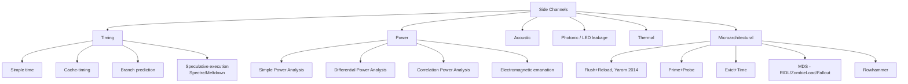
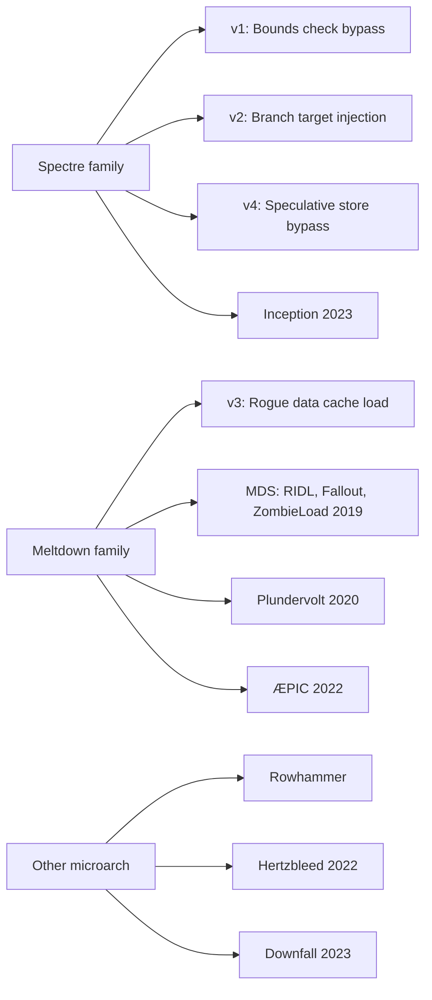
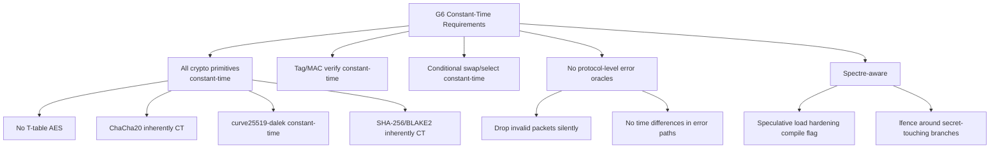
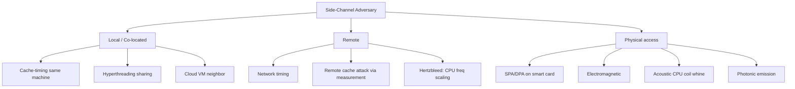
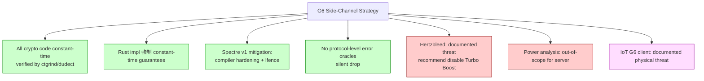

# 課堂 3.13 — 側信道攻擊概論：Timing / Cache / Power / Spectre / Constant-Time

## 學前知道

- **前置課**：[3.2](./3.2-symmetric-aead.md), [3.4](./3.4-rsa.md), [3.5](./3.5-elliptic-curves.md)
- **預計閱讀時間**：100 分鐘
- **必讀論文**：
  - Kocher, *Timing Attacks on Implementations of Diffie-Hellman, RSA, DSS, and Other Systems*, CRYPTO 1996
  - Kocher, Jaffe, Jun, *Differential Power Analysis*, CRYPTO 1999
  - Bernstein, *Cache-timing attacks on AES*, 2005 tech report
  - Osvik, Shamir, Tromer, *Cache Attacks and Countermeasures: The Case of AES*, CT-RSA 2006
  - AlFardan, Paterson, *Lucky Thirteen: Breaking the TLS and DTLS Record Protocols*, IEEE S&P 2013
  - Kocher 等, *Spectre Attacks: Exploiting Speculative Execution*, IEEE S&P 2019
  - Lipp 等, *Meltdown: Reading Kernel Memory from User Space*, USENIX Security 2018
  - Yarom, Falkner, *FLUSH+RELOAD: A High Resolution, Low Noise, L3 Cache Side-Channel Attack*, USENIX Security 2014
  - van Schaik 等, *RIDL: Rogue In-Flight Data Load*, IEEE S&P 2019
  - Bernstein-Heninger-Lange-Lou-Valenta, *Sliding right into disaster*, CHES 2017
- **必讀原始碼**：
  - libsodium `crypto_verify_*` constant-time compare
  - boringssl `BN_consttime_*` functions
  - golang `crypto/subtle` package

> 你的協議數學上完美 secure，實作仍可能被 trivially 破。本堂處理：side-channel 分類學、constant-time programming 不變量、Spectre/Meltdown 的 modern relevance、G6 implementation 必須遵守的工程紀律。

---

## 動機：「我用 if (memcmp(tag1, tag2) == 0)」

```c
int verify_tag(const uint8_t *expected, const uint8_t *received, size_t len) {
    return memcmp(expected, received, len) == 0;
}
```

**致命錯誤**。`memcmp` 在第一個 byte 不同時 early return。對手 measure verify time:
- 第 0 byte 對 → 比較走到第 1 byte (慢一點)。
- 第 0 byte 錯 → early return (快)。

**Timing attack**: 對手 try byte 0 = 0..255，找最慢的；那是 expected[0]。重複 → recover full tag。

**正確版**:
```c
int constant_time_eq(const uint8_t *a, const uint8_t *b, size_t len) {
    uint8_t r = 0;
    for (size_t i = 0; i < len; i++) {
        r |= a[i] ^ b[i];
    }
    return r == 0;  // 仍然 1 bit boolean leak; OK 因為 same time always
}
```

每 iteration 一次 XOR + OR，無 secret-dependent branch。

---

## 核心概念

### 1. Side-channel 分類學



### 2. Timing attack 的數學基礎

對 modular exponentiation `m = c^d mod n` (RSA decrypt):

```text
Square-and-multiply:
    m = 1
    for i from MSB to LSB of d:
        m = (m * m) mod n
        if d_i == 1:
            m = (m * c) mod n
```

**Time depends on Hamming weight of d**: 1 bits 多 → 多 multiplication → 慢。

Kocher 1996 attack:
- Measure many decrypt times for various ciphertexts。
- Statistical correlation → recover bits of d。

**修補**:
1. **Constant-time exponentiation**: always do multiply (use mask to discard if d_i == 0)。
2. **Montgomery ladder**: every iteration same operations。
3. **RSA blinding**: multiply ciphertext by random r^e before decrypt → time pattern uncorrelated with d。

### 3. Cache-timing on AES (Bernstein 2005)

```text
T-table-based AES (常見 software impl):
    state[i] = T_0[plaintext[i] XOR k[i]] XOR T_1[plaintext[i+4] XOR k[i+4]] ...
    
T-tables: 4 tables of 256 32-bit entries each = 4 KB total.
Spans multiple cache lines.
```

**Attack**: 對手在 same machine 跑 cache-monitoring program。
- Prime cache 滿 attacker data。
- Trigger AES encrypt by victim。
- Probe cache: 哪些 lines 被 evict → 那些 T-table entries 被 access。
- T-table access pattern depends on plaintext XOR key → narrows key bits。

Bernstein 2005 demo: remote AES key recovery in ~65 ms over network (high-speed measurement)。

**修補**:
1. **AES-NI**: hardware AES instructions inherently constant-time。
2. **Bitsliced AES** (Käsper-Schwabe 2009): no T-tables, all bitwise ops。
3. **Pre-load tables**: ensure all tables in cache before crypto (但仍可被 evict)。

**G6 規定**: 禁用 T-table-based AES; only AES-NI 或 bitsliced。

### 4. Lucky 13 (AlFardan-Paterson 2013)

TLS 1.0-1.2 用 MAC-then-Encrypt CBC mode。Server-side decrypt:
```text
1. AES-CBC decrypt → plaintext_with_padding_and_MAC
2. Verify padding (e.g. last byte = 0x05 means 5 bytes of 0x05)
3. Extract MAC (length depends on padding)
4. Verify MAC over plaintext
5. Return success or send error
```

**Lucky 13 timing leak**:
- Padding error → step 4 略快 (compute MAC over different length range)。
- MAC error → step 4 normal time。
- Difference: ~13 cycles (hence "Lucky 13")。
- Statistical: ~10^7 measurements → recover one byte of plaintext。

**修補**:
- TLS 1.3 全廢 CBC + MAC-then-Encrypt → AEAD only。
- Pre-1.3 servers patch 用 constant-time MAC verification (always compute MAC over fixed length even if padding looks invalid)。

**G6 教訓**: 同 3.2 / 3.6 教訓，AEAD only。任何 protocol-level「驗證 → 不同 error response」都是 oracle。

### 5. Spectre / Meltdown (2018) — Microarchitectural era

**背景**: modern CPU 用 speculative execution 加速 — 預測 branch direction，speculatively execute 之後若預測錯誤就 rollback。但 cache state changes are NOT rolled back → side-channel。

**Spectre Variant 1 (Bounds Check Bypass)**:
```c
if (x < array1_size) {
    y = array2[array1[x] * 4096];
}
```
即使 `x` 越界, CPU may speculatively execute 內部 load 並 affect cache。Attacker:
- Train branch predictor to predict (x < size) true。
- Pass attacker-chosen x out of bounds。
- CPU speculatively reads array1[x] (kernel/process memory) → uses as index into array2 → cache line load。
- Probe array2 cache → recover array1[x] byte。

**Meltdown** similar but exploits **out-of-order execution** to read kernel memory from user space。

**Impact**: 影響 ~all modern CPU (Intel, AMD, ARM)。Required microcode patches + OS kernel changes (KAISER / KPTI)。Performance impact 5-30%。

**對 cryptographic code 的 implication**:
- 任何 secret-dependent control flow 在 speculative execution 下 may leak。
- Even constant-time impl 在 speculative path 仍可能 leak (Spectre v1 specifically)。

**修補 (cryptographic side)**:
- Compiler-level: speculative load hardening。
- Architecture: serializing instructions (`lfence`, `csdb`) before secret-dependent branches。
- Crypto code: avoid secret-dependent branches even if "non-speculative" code 似乎 OK。

### 6. Power analysis (DPA, Kocher 1999)

對 smart card / IoT / embedded device:
- 測量 instantaneous power consumption during cryptographic operation。
- Single trace → SPA (見 individual operations like SQUARE vs MULTIPLY)。
- Many traces → DPA (statistical correlation between power & data being processed)。

**對 G6 impact**:
- G6 主要 deploy on server / desktop with physical isolation → power analysis 不是 primary threat。
- 但 IoT G6 client (smart router, smart TV with VPN built-in) 仍 vulnerable to physical adversary with oscilloscope。
- 修補: power smoothing, dummy operations, DPA-resistant implementations。

### 7. Constant-time programming 不變量

```mermaid
flowchart TD
    CT[Constant-time invariants]
    CT --> NoSDBranch[No secret-dependent branches]
    CT --> NoSDMem[No secret-dependent memory access]
    CT --> NoSDDiv[No secret-dependent division/modulo]
    CT --> NoSDInstr[No instructions with data-dependent timing<br/>e.g., MUL on some ARM]

    NoSDBranch -.violates.-> If_secret[if (secret == 0) ...]
    NoSDMem -.violates.-> Lookup_secret[table[secret]]
    NoSDDiv -.violates.-> Div_secret[a / secret]
```

**Constant-time alternatives**:
```c
// BAD: secret-dependent branch
if (secret == 0) { x = a; } else { x = b; }

// GOOD: arithmetic mask
mask = (uint32_t)((int32_t)secret >> 31);  // 0xFFFFFFFF if negative else 0
x = (a & mask) | (b & ~mask);
// 或 simpler:
x = b ^ (mask & (a ^ b));
```

**Constant-time比較**:
```c
int ct_eq(uint8_t *a, uint8_t *b, size_t len) {
    uint8_t r = 0;
    for (size_t i = 0; i < len; i++) r |= a[i] ^ b[i];
    return (1 & ((r - 1) >> 8));  // 1 if r==0 else 0
}
```

**Constant-time conditional swap (cswap)**:
```c
void ct_cswap(uint8_t bit, uint8_t *a, uint8_t *b, size_t len) {
    uint8_t mask = -bit;  // 0xFF if bit==1 else 0x00
    for (size_t i = 0; i < len; i++) {
        uint8_t t = mask & (a[i] ^ b[i]);
        a[i] ^= t;
        b[i] ^= t;
    }
}
```

### 8. 工具：detect timing leaks

```bash
# 1. ctgrind: Valgrind plugin to detect secret-dependent branches/memory
# (treat secret as "uninitialized" → Valgrind catches branches on it)
ctgrind ./your_crypto_binary

# 2. dudect: statistical timing leak detection
# https://github.com/oreparaz/dudect

# 3. binsec/Rel: relational analysis
# Verifies constant-time at LLVM IR level.

# 4. Vale / Cryptol / HACL*: formally verified constant-time crypto code.
```

### 9. Modern Spectre-class threats



**Hertzbleed (Wang 等 USENIX Security 2022)**: CPU power management causes frequency scaling that depends on data being processed → remote timing attack on constant-time code on modern Intel/AMD CPU. **Even constant-time impl 不夠**！需 disable Turbo Boost or use 200 MHz fixed frequency。

**對 G6**: spec 要求 server deployment use frequency-scaling-off mode for crypto operations (impractical for high-throughput server, but document as known threat)。

### 10. G6 implementation 的 constant-time 要求



---

## 與我們協議設計的關聯

| 設計問題 | 答案 |
|---|---|
| Crypto primitive 選擇 | ChaCha20 / Curve25519 / Ed25519 — 設計上易達 constant-time |
| AES 軟體 fallback | bitsliced 或 disable;不准 T-table |
| Tag verify | constant-time compare (libsodium / `crypto/subtle`) |
| Protocol error response | silent drop, no time difference |
| Implementation language | Rust (memory-safe + easier to audit constant-time) |
| Spectre defense | compiler flags + lfence in critical sections |
| Audit tool | ctgrind / dudect on crypto primitives |
| Hertzbleed mitigation | document as known threat; production deployment recommendation |

---

## 動手：用 dudect 檢查 your AEAD

```bash
git clone https://github.com/oreparaz/dudect
cd dudect

# Replace src/dut.c with your AEAD wrapper
# example dut: 
cat > src/dut.c <<'EOF'
#include "your_aead.h"
#include "dudect.h"
uint8_t do_one_computation(uint8_t *data) {
    uint8_t key[32], nonce[12], ct[16+16], tag[16];
    memcpy(key, data, 32);
    memcpy(nonce, data + 32, 12);
    aead_encrypt(key, nonce, NULL, 0, ct, 16, tag);
    return ct[0];
}
EOF

make
./dudect_aead
# Output: t-test statistics; significant difference => leak detected.
```

---

## 自我檢查

1. 為什麼 `memcmp` 不能用於 cryptographic comparison？提供 constant-time 替代。
2. Square-and-multiply RSA 為何 timing-leak？Kocher 1996 attack 流程？
3. Bernstein cache-timing on AES 的 attack vector？G6 防禦策略？
4. Lucky 13 attack 對 TLS 1.0-1.2 CBC 的具體 leak source？TLS 1.3 為什麼免疫？
5. Spectre v1 為何即使 bounds check 仍 leak？硬體 mitigation 與 software mitigation 各是什麼？
6. Hertzbleed 對 「constant-time impl is enough」假設的衝擊？G6 實際部署如何 mitigate？
7. G6 Rust impl vs C impl 在 constant-time 保證上的差別？

---

## 延伸閱讀

- Bernstein-Heninger-Lange-Lou-Valenta *Sliding right into disaster* (CHES 2017) — RSA cache-timing。
- Yarom-Genkin-Heninger 等 *CacheBleed: a timing attack on OpenSSL constant-time RSA* (CHES 2016)。
- Aciiçmez 等 *On the power of simple branch prediction analysis* (AsiaCCS 2007)。
- Mangard, Oswald, Popp *Power Analysis Attacks: Revealing the Secrets of Smart Cards* (Springer 2007) — power analysis textbook。
- Genkin 等 *RSA Key Extraction via Low-Bandwidth Acoustic Cryptanalysis* (CRYPTO 2014) — acoustic emanation。

---

## 研究級補遺

### 1. 學界詞彙

- **SCA (Side-Channel Attack)** vs **FA (Fault Attack)**：被動觀察 vs 主動 inject error。
- **Profiled vs Non-profiled SCA**：是否 attacker 能在 same hardware pre-train。
- **Template attack** (Chari-Rao-Rohatgi 2002)：profiled, very powerful。
- **Differential Computational Analysis**：對 SBox-based ciphers 的 DPA。
- **Constant-time polynomial multiplication**: PQ KEM (Kyber) 內部 polynomial ops 須 constant-time wrt secret coefficients。
- **Masking** (DPA defense)：把 secret split into shares, 操作 share by share, combine 後 unmask。
- **Hiding** (DPA defense)：blinding, dummy ops, shuffling。
- **Verified compilation** (CompCert, Vale, Jasmin)：compile guarantee constant-time invariant 不被 compiler optimization 破壞。

### 2. 對手分類學



### 3. 形式化定義

**Constant-time program** (Almeida 等 2016 *Verifying constant-time*):
```text
A program P is constant-time iff for all inputs (public, secret), the
trace of (control flow + memory address access pattern) depends only on public.

Formally: ∀ public input p, ∀ secrets s, s':
    Trace(P, p, s) = Trace(P, p, s')
```

### 4. 關鍵論文

1. **Kocher 1996** — timing attack origin。
2. **Kocher-Jaffe-Jun 1999** — DPA。
3. **Bernstein 2005** — cache-timing AES。
4. **Osvik-Shamir-Tromer 2006** — formalized cache attack on AES。
5. **AlFardan-Paterson 2013 Lucky 13**。
6. **Yarom-Falkner 2014 FLUSH+RELOAD**。
7. **Kocher 等 2018 Spectre**。
8. **Lipp 等 2018 Meltdown**。
9. **van Schaik 等 2019 RIDL/Fallout/ZombieLoad**。
10. **Wang 等 2022 Hertzbleed**。
11. **Almeida 等 2016 Verifying constant-time** (USENIX Security)。
12. **Bernstein-Heninger-Lange-Lou-Valenta 2017 *Sliding right into disaster*** (CHES)。

### 5. G6 座標



### 6. 必追資源

- **CHES (Cryptographic Hardware and Embedded Systems)** — 主要 SCA 會議。
- **USENIX Security / IEEE S&P** — microarchitectural attacks 主要 venues。
- **Hardwear.io conference** — hardware security 焦點。
- **eprint.iacr.org/search?q=side-channel** — 持續論文。

### 7. 開放問題

- **Universal constant-time guarantee for PQ schemes**：lattice-based crypto 內部 rejection sampling 等步驟 inherently variable-time；如何系統性 constant-time? Open。
- **Hardware-software co-design for SCA**：trusted execution environments (Intel SGX, ARM TrustZone) 仍 vulnerable to multiple SCAs (e.g., ÆPIC 2022)。
- **Speculative execution 的 fundamental tradeoff**：performance vs side-channel-safety。CPU 設計需 ground-up rethinking？
- **Formally verified protocol-implementation correspondence**：spec-level constant-time 屬性如何 carry to compiled binary? Vale, Jasmin 等 active work。

---

> **下一堂預告**：3.14 現代密碼工程實踐 — libsodium / ring / BoringSSL API 哲學、Cryptographic Right Answers、「不要自己寫密碼學」vs「設計新協議」的張力。
