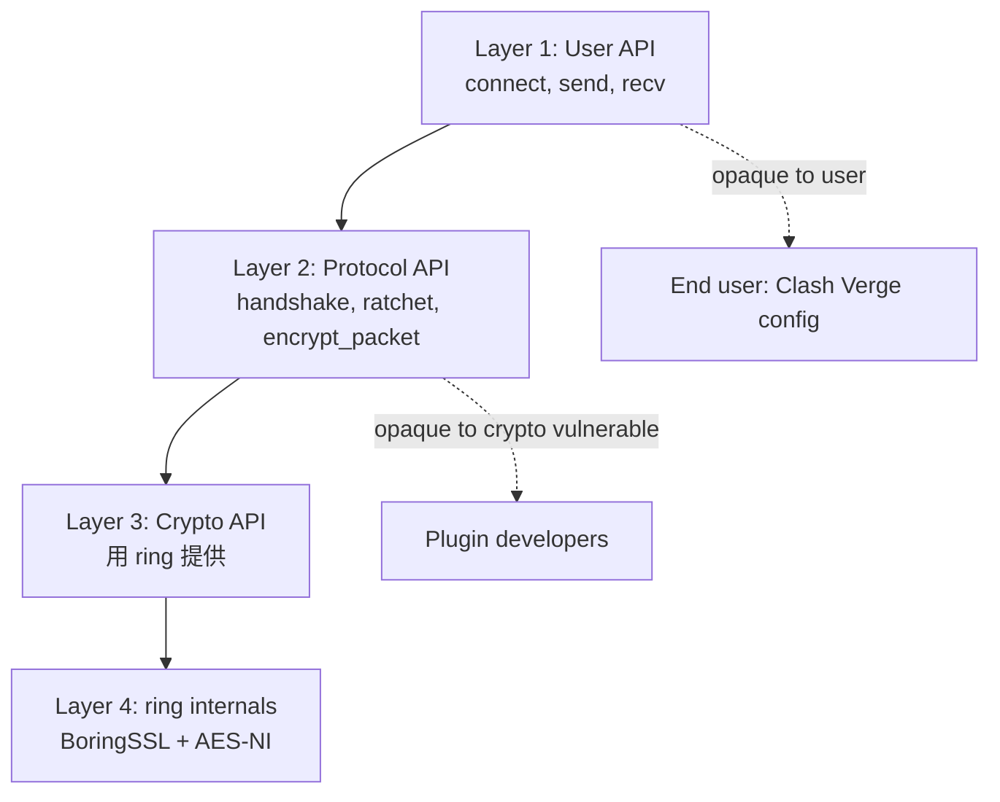
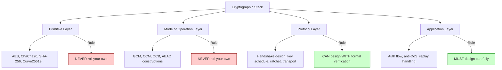

# 課堂 3.14 — 現代密碼工程實踐：libsodium / ring / BoringSSL 哲學

## 學前知道

- **前置課**：[3.1](./3.1-crypto-goals-taxonomy.md) 至 [3.13](./3.13-side-channels.md)（本堂整合前 13 堂工程實踐）
- **預計閱讀時間**：90 分鐘
- **必讀資源**：
  - Latacora, *Cryptographic Right Answers* (blog 2018, updated 2024)
  - Bernstein, Lange, Schwabe, *The security impact of a new cryptographic library* (NaCl design philosophy, 2012)
  - Zinzindohoué 等, *HACL\*: A Verified Modern Cryptographic Library*, CCS 2017
  - Bhargavan 等, *EverCrypt: A Fast, Verified, Cross-Platform Cryptographic Provider*, IEEE S&P 2020
  - Aumasson, *Serious Cryptography* 第 14 章 (2018, 2nd ed. 2024)
  - Bernstein, *Reasons why crypto is hard* (lecture notes, ongoing)
  - libsodium documentation principles
  - ring (Rust BoringSSL fork) design notes
  - boringssl/CRYPTO/internal.h comments — Google 的 API design choices
- **必讀原始碼**：
  - libsodium `include/sodium/crypto_*.h`（API surface）
  - ring `src/lib.rs`（Rust safe wrapper philosophy）
  - boringssl `include/openssl/*.h`（vs OpenSSL diff）

> 前 13 堂建工具；本堂教你「**正確地用工具**」。Latacora "Cryptographic Right Answers" 是 modern crypto engineering 的 manifesto；libsodium 是「正確 API」的範本；HACL\* 是「正確實作」的範本。G6 的 crypto layer 必須選 high-level safe API，不能自製 primitive。

---

## 動機：「不要自己寫密碼學」vs「我們要設計新協議」

最常見的 crypto advice: **「Don't roll your own crypto」**。意思：
1. 不要實作 cryptographic primitive (AES, SHA, ECC scalar mul)。
2. 不要設計新 primitive。
3. 用 well-vetted library。

但 G6 的目標是「設計新協議」——這違反 #2 嗎？

答：**不違反**。Protocol design 與 primitive design 是不同 layer。我們設計 **handshake protocol** + **record layer composition**，但 **不**設計新 AES / 新 hash / 新 ECC。Primitive 用 well-vetted (Curve25519, ChaCha20, BLAKE2)。

**G6 的工程紀律**：
- Primitive: libsodium / ring (well-vetted)。
- Protocol composition: 自己設計 (Noise IK variant + cover-traffic + PQ hybrid)。
- 形式化驗證: ProVerif / Tamarin (3.15)。
- Implementation: Rust + constant-time + side-channel audit。

---

## 核心概念

### 1. Cryptographic Right Answers (Latacora 2018)

```
| Need                  | Right answer                                  |
|-----------------------|-----------------------------------------------|
| Symmetric encryption  | ChaCha20-Poly1305 (RFC 8439) or AES-GCM      |
| Symmetric KDF         | HKDF-SHA-256 (RFC 5869)                       |
| Password hashing      | Argon2id (m≥64MB, t≥3) or scrypt fallback     |
| Hash function         | SHA-256 (or BLAKE2/3)                         |
| Asymmetric encryption | Hybrid (X25519 + AEAD); RSA-OAEP only legacy  |
| Key exchange          | X25519 (or hybrid with Kyber768)              |
| Digital signature     | Ed25519 (or hybrid with ML-DSA-65)            |
| MAC                   | HMAC-SHA-256 or Poly1305 (in AEAD)            |
| Random                | OS getrandom() / getentropy()                 |
| Library               | libsodium (C/C++) or ring (Rust)              |
```

**Latacora 哲學**: 對每個 use case 給「**單一正確答案**」，避免讓開發者面對 cipher suite 選擇 paralysis (TLS 1.2 的 ~300 ciphersuite 災難)。

**G6 直接採用全表**:
- 對稱：ChaCha20-Poly1305 主，AES-256-GCM HW fallback。
- KDF：HKDF-SHA-256。
- Password (PSK from passphrase): Argon2id。
- Hash: SHA-256 + BLAKE2s (Noise compat)。
- KE: X25519 + ML-KEM-768 hybrid。
- Sig: Ed25519 + ML-DSA-65 hybrid。

### 2. API 哲學：「Hard to misuse」是核心

```mermaid
flowchart TD
    APIDesign[Cryptographic API Design]
    APIDesign --> NaCl[NaCl Philosophy<br/>Bernstein 2009]
    NaCl --> HighLevel[High-level operations<br/>crypto_secretbox, crypto_box]
    NaCl --> Opinionated[Opinionated defaults<br/>no algorithm choice]
    NaCl --> NoNonceMgmt[No nonce management exposed<br/>內部處理]
    NaCl --> ZeroCopy[Zero-copy where possible]

    APIDesign --> Sodium[libsodium]
    Sodium --> NaCl_clone[NaCl-compatible]
    Sodium --> Modern[Modern additions<br/>XChaCha, ChaCha20-Poly1305]
    Sodium --> Portable[Cross-platform]
    Sodium --> Random[Random helpers]

    APIDesign --> RingRust[ring (Rust)]
    RingRust --> Safe[Memory-safe Rust API]
    RingRust --> Minimal[Minimal API surface]
    RingRust --> Vetted[BoringSSL-derived]

    APIDesign --> BoringSSL[BoringSSL (Google)]
    BoringSSL --> ForkOpenSSL[Fork of OpenSSL]
    BoringSSL --> RemoveCruft[Remove legacy cruft]
    BoringSSL --> Internal[Internal API, not for general use]

    APIDesign --> AvoidOpenSSL[Avoid OpenSSL<br/>for new projects]
    AvoidOpenSSL --> Heartbleed[Heartbleed history]
    AvoidOpenSSL --> Complex[Complex API surface]
    AvoidOpenSSL --> InsecureDefaults[Insecure defaults]
```

**NaCl design rules** (Bernstein 2009):
1. **Operations, not algorithms**: `crypto_secretbox` 不問 user 用 AES 還是 ChaCha20; 內部固定。
2. **High-level**: encrypt/decrypt/sign/verify, 不 expose lower-level (cipher state, key schedule)。
3. **Hard to misuse**: API design 不允許 nonce reuse、不 expose unauthenticated decrypt。
4. **Secure by default**: 沒有「configurable insecure」mode。
5. **Constant-time**: 全部 primitive 內部 constant-time。

### 3. OpenSSL 的問題（為什麼不推 OpenSSL for new projects）

OpenSSL 的歷史問題:
1. **Heartbleed (2014)**: TLS heartbeat extension implementation bug → memory disclosure。Affected ~17% web servers 全球。
2. **Goto fail (2014, Apple SecureTransport)**: certificate verify duplicated goto 跳過驗證。
3. **DROWN (2016)**: 用 SSLv2 server 作 oracle 打 TLS 1.2。
4. **API surface 巨大**: thousands of functions, many deprecated, easy to misuse。
5. **Documentation 不一致**: man page 與 actual behavior 對不上。
6. **缺 high-level operations**: 沒有 `encrypt_authenticated`, 開發者必須手動 chain EVP_EncryptInit / Update / Final + HMAC。

**現代替代**:
- **libsodium**: C, NaCl-compatible, ergonomic。
- **ring**: Rust, BoringSSL-derived, memory-safe wrapper。
- **BoringSSL**: Google internal, deprecated old code, but API still complex。
- **monocypher**: Mike Hamburg single-file C crypto library。
- **rustcrypto**: Pure Rust, all primitives。

**G6 選 ring (Rust)**: type-safe + memory-safe + BoringSSL-derived + audited。

### 4. HACL\* / EverCrypt: Formally Verified Crypto Library

```text
HACL* / Project Everest (Microsoft Research + INRIA, ongoing):
- Verified in F* (functional language with proofs)
- Extracted to C (HACL*) or assembly (Vale)
- Properties proven:
    - Functional correctness (matches spec)
    - Memory safety
    - Side-channel resistance (constant-time)
    - Secret independence (no leakage)
- Primitives covered:
    - ChaCha20-Poly1305
    - Curve25519, Ed25519
    - HKDF, SHA-256
    - AES-GCM (via Vale assembly)
- 部分整合進 Firefox NSS, Linux kernel WireGuard, Windows Hyper-V。
```

**EverCrypt** = HACL\* + Vale 統一 API。Performance 與 hand-tuned (BoringSSL) 接近 (within 10-30%)，但 verified。

**G6 對 verified crypto 立場**:
- 短期: ring (well-audited 但非 formally verified)。
- 中期: 評估 HACL\* / EverCrypt Rust binding (e.g., `evercrypt` crate)。
- 長期: 對 G6 implementation 做 verified compilation。

### 5. API design 對 G6 implementation 的 impact

**G6 API hierarchy**:


**G6 design principle**:
- User 端只 expose minimal config (server, PSK, port)。
- Plugin developer (e.g., obfuscation extensions) 只 expose protocol-level API。
- Crypto primitive 完全 hidden — 不可能 misconfigure。

**反例 (don't do)**:
- 允許 user 選 「`cipher: aes-128-cbc`」(legacy CBC, padding oracle)。
- 允許 user 設定 nonce manually。
- 暴露 raw key generation entropy source。

### 6. 「Don't roll your own crypto」精確版



**G6 對應**:
- Primitive: 用 ring (X25519, Ed25519, ChaCha20-Poly1305 implementations from BoringSSL)。
- Mode: 用 ring AEAD。
- Protocol: **自己設計** (Noise IK variant + PQ + cover traffic) + ProVerif/Tamarin formal verification。
- Application: 自己設計 + Tamarin 涵蓋。

### 7. Crypto agility design

**Agility = ciphersuite negotiation 能力**。問題：
- 太 much agility (TLS 1.2 ~300 suites) → Logjam-style downgrade。
- 太少 agility (硬編碼) → 無法升級。

**現代設計**: **version-based agility**，**不**是 per-handshake negotiation。
- TLS 1.3 用 named groups，limited cipher choices。
- WireGuard 完全 hard-coded; v2 是 new spec。
- Noise Framework 完整 protocol name 包含 cipher suite。

**G6 採 hybrid**:
- 主要 ciphers: hard-coded per version (X25519 + ChaCha20-Poly1305 + SHA-256)。
- PQ KEM optional: pre-negotiated via version flag, not per-handshake。
- v2 spec 是 separate, no auto-downgrade。

### 8. Library 選擇 decision matrix

| Library | Lang | License | Verified | API Style | G6 適用 |
|---|---|---|---|---|---|
| **ring** | Rust | ISC + BSD | No (audited) | safe, opinionated | ✅ Primary |
| **rustls** (uses ring) | Rust | ISC/Apache | No (auditing ongoing) | high-level TLS | ✅ for TLS-mimic mode |
| **libsodium** | C | ISC | No (well-audited) | NaCl-style | ✅ for FFI bindings |
| **HACL\*** | F\* → C | Apache | **Yes** | low-level | ⚠️ evaluate (perf/integration) |
| **EverCrypt** | F\* → C+asm | Apache | **Yes** | unified | ⚠️ evaluate |
| **boringssl** | C/C++ | OpenSSL-like | No | low-level, large | ❌ too low-level |
| **OpenSSL** | C | Apache 2 (3.0+) | No | huge, complex | ❌ avoid |
| **NSS** (Firefox) | C | MPL | Partial | TLS-focused | ❌ avoid for new |
| **rustcrypto** | Rust | MIT/Apache | No (audit varies) | per-crate | ⚠️ for specific primitives |

**G6 primary**: ring + rustls (Rust ecosystem)。Future evaluate HACL\* bindings。

---

## 與我們協議設計的關聯

| 設計問題 | 答案 |
|---|---|
| Primitive library | ring (Rust BoringSSL fork) |
| Implementation language | Rust (memory-safe + ecosystem) |
| 是否自己實作 primitive | 不 |
| 是否自己設計 protocol | 是 (Noise IK + PQ + cover traffic) |
| 形式化驗證 | ProVerif + Tamarin (Part 3.15) |
| API surface | 三層 (user / protocol / crypto)，crypto layer opaque |
| Agility | version-based, no negotiation |
| Cipher choices | Latacora "Cryptographic Right Answers" 全採 |
| Future PQ | hybrid via dedicated extension, not negotiation |

---

## 動手：用 ring 寫一個 minimal G6 prototype

```rust
use ring::{aead, agreement, signature, rand};

fn handshake() -> Result<(), ring::error::Unspecified> {
    let rng = rand::SystemRandom::new();
    
    // X25519 ephemeral
    let priv_key = agreement::EphemeralPrivateKey::generate(&agreement::X25519, &rng)?;
    let pub_key = priv_key.compute_public_key()?;
    
    // Receive peer pk, compute shared
    let peer_pub: [u8; 32] = todo!(); // from network
    let shared = agreement::agree_ephemeral(
        priv_key,
        &agreement::UnparsedPublicKey::new(&agreement::X25519, &peer_pub),
        |key_material| {
            // KDF: HKDF-SHA-256
            let salt = ring::hkdf::Salt::new(ring::hkdf::HKDF_SHA256, b"transcript_hash");
            let prk = salt.extract(key_material);
            let mut session_key = [0u8; 32];
            prk.expand(&[b"g6 session key"], ring::hkdf::HKDF_SHA256).unwrap().fill(&mut session_key).unwrap();
            Ok(session_key)
        }
    )?;
    
    // ChaCha20-Poly1305 record
    let sealing_key = aead::LessSafeKey::new(
        aead::UnboundKey::new(&aead::CHACHA20_POLY1305, &shared)?
    );
    
    let mut data = b"hello G6".to_vec();
    let nonce = aead::Nonce::assume_unique_for_key([0u8; 12]);
    sealing_key.seal_in_place_append_tag(nonce, aead::Aad::empty(), &mut data)?;
    // ... transmit data ...
    
    Ok(())
}
```

關鍵: 沒有手寫 ChaCha20 round, 沒有手寫 Curve25519 scalar mul; 完全 trust ring impl。

---

## 自我檢查

1. Latacora 2018 right answers 表中，G6 對每項選擇與 default 一致嗎？哪裡偏離？為什麼？
2. NaCl 「Operations not algorithms」設計哲學在 G6 怎麼體現？user/plugin/crypto 三層 API 邊界？
3. OpenSSL Heartbleed 的 root cause？G6 用 ring + Rust 為何 architecturally 免疫此類 bug？
4. HACL\* / EverCrypt 「verified crypto」對 G6 v1 是否 mandatory？trade-off 是什麼？
5. Crypto agility 在 G6 怎麼處理？version-based vs per-handshake negotiation 的選擇？
6. 為什麼 G6 用 ring 而非 OpenSSL (即使 OpenSSL 3.0 在 ML-KEM 支援更完整)？
7. 設計新 protocol 與「don't roll your own crypto」原則的精確邊界？

---

## 延伸閱讀

- Latacora *Cryptographic Right Answers* (blog) — modern recommendations。
- Bernstein 等 *NaCl Family of Crypto Libraries* — design philosophy。
- Aumasson *Serious Cryptography* 第 14 章 — engineering practice。
- Project Everest publications (HACL\*, Vale, EverCrypt)。
- BoringSSL design rationale: chromium.googlesource.com/chromium/src/+/HEAD/net/third_party/boringssl/。

---

## 研究級補遺

### 1. 學界詞彙

- **Algorithm agility vs hard-coded**: protocol design trade-off。
- **Misuse-resistant API**: API 設計目標——能讓 wrong usage 變 compile error 或 runtime panic。
- **Formal verification scope**: functional correctness vs constant-time vs memory safety vs protocol-level。
- **Side-channel-secure compilation**: Vale / Jasmin / CompCert 等保證 source-level constant-time 不被 compiler 破壞。
- **Sealed APIs**: 不 expose internal state (e.g., AEAD library 不 expose cipher / MAC 分開) — 強制 atomic operation。
- **Zero-knowledge primitives in production**: bulletproofs / SNARK 部分 library production-ready (libzkp, ark-rs)。

### 2. 形式化定義

**API misuse-resistance** (Bernstein 2009 NaCl):
```text
An API is misuse-resistant iff:
    For all programs P using the API,
    P cannot achieve insecure behavior unless P explicitly violates
    the API contract documented in <50 words.
```

Compare:
- ChaCha20-Poly1305 via libsodium: misuse-resistant (no nonce reuse possible via API)。
- AES-GCM via OpenSSL EVP: not misuse-resistant (user 必須 manage nonce)。

### 3. 關鍵論文 / 資源

1. **Bernstein 2009 NaCl design** — NaCl manifesto。
2. **Latacora 2018 Cryptographic Right Answers** — modern survey。
3. **Aumasson *Serious Cryptography*** (2nd ed. 2024)。
4. **Zinzindohoué 等 HACL\* CCS 2017**。
5. **Bhargavan 等 EverCrypt IEEE S&P 2020**。
6. **Almeida 等 *Verifying constant-time implementations*** USENIX Security 2016。
7. **Polubelova 等 *HACL×N: Verified Generic SIMD Crypto*** S&P 2020。
8. **Beurdouche 等 *State of TLS 1.3* (HACS workshop 2019)**。

### 4. G6 座標

```mermaid
flowchart TD
    classDef now fill:#cfc,stroke:#080
    classDef future fill:#fdf,stroke:#909

    G6Eng[G6 Crypto Engineering]
    G6Eng --> Lib[ring + rustls (Rust)]:::now
    G6Eng --> Verify[ctgrind + dudect constant-time audit]:::now
    G6Eng --> RustSafety[Rust memory safety + no unsafe in crypto path]:::now
    G6Eng --> SpecSimple[Hard-coded ciphers per version]:::now
    G6Eng --> APILayer[3-layer API: user / protocol / crypto]:::now
    G6Eng --> Hacl[Future: HACL* verified primitives evaluation]:::future
    G6Eng --> EverCrypt[Future: EverCrypt evaluation]:::future
    G6Eng --> FullVerify[Future: full G6 protocol verified]:::future
```

### 5. 必追資源

- **Latacora blog** — modern crypto eng recommendations。
- **Bernstein's cr.yp.to** — primitive design references。
- **Real World Crypto (RWC) talks** — yearly deployment lessons。
- **Project Everest publications** — formal verified crypto。
- **rust-crypto / RustCrypto GitHub org**。

### 6. 開放問題

- **Formal verification of full protocol stack**: HACL\* 證 primitive；ProVerif 證 protocol；如何 statically link 兩個 proofs？Open。
- **Performance vs verification trade-off**: EverCrypt within 10-30% of hand-tuned but gap closing — full equivalence 目標。
- **PQ primitive verified implementation**: Kyber / Dilithium HACL\*-style verification 仍 evolving。
- **Constant-time guarantees in Rust**: Rust 沒有 built-in constant-time annotations；社群 attempt (`subtle` crate) 但 compiler optimization 仍 may break。

---

> **下一堂預告**：3.15 形式化驗證入門 — ProVerif (applied pi-calculus) / Tamarin (multiset rewriting) / CryptoVerif (computational)；第一次親手驗證 Diffie-Hellman。
