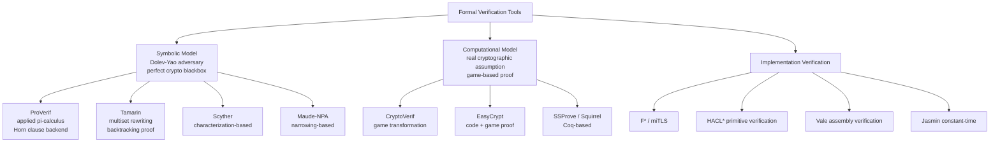
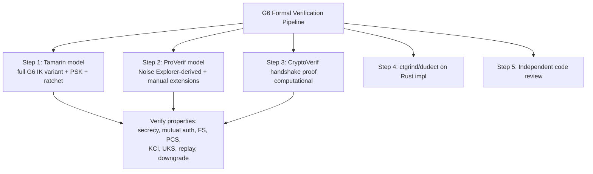

# 課堂 3.15 — 形式化驗證入門：ProVerif / Tamarin / CryptoVerif

## 學前知道

- **前置課**：[3.1](./3.1-crypto-goals-taxonomy.md), [3.6](./3.6-key-exchange.md), [3.8](./3.8-noise-protocol-framework.md)
- **預計閱讀時間**：120 分鐘
- **必讀論文 / 工具**：
  - Blanchet, *An Efficient Cryptographic Protocol Verifier Based on Prolog Rules*, CSFW 2001（ProVerif）
  - Meier, Schmidt, Cremers, Basin, *The TAMARIN Prover for the Symbolic Analysis of Security Protocols*, CAV 2013
  - Blanchet, *CryptoVerif: A Computationally Sound Mechanized Prover*, IEEE S&P 2008
  - Bhargavan, Fournet, Kohlweiss, *miTLS: Verifying Protocol Implementations against Real-World Attacks*, IEEE S&P 2016
  - Cremers, Horvat, Hoyland, Scott, van der Merwe, *A Comprehensive Symbolic Analysis of TLS 1.3*, CCS 2017
  - Lipp, Blanchet, Bhargavan, *A Mechanised Cryptographic Proof of WireGuard*, EuroS&P 2019
  - Kobeissi, Bhargavan, Beurdouche, *Automated Verification for Secure Messaging Protocols*, EuroS&P 2019（Noise Explorer）
  - Bhargavan 等, *Implementing and Proving the TLS 1.3 Record Layer*, IEEE S&P 2017
  - Dowling, Fischlin, Günther, Stebila, *A Cryptographic Analysis of the TLS 1.3 Handshake Protocol*, J. Cryptology 2021
  - Lowe, *An Attack on the Needham-Schroeder Public-Key Authentication Protocol*, IPL 1995（FDR find Needham-Schroeder bug）
- **工具**：
  - **ProVerif**: https://bblanche.gitlabpages.inria.fr/proverif/
  - **Tamarin**: https://tamarin-prover.github.io/
  - **CryptoVerif**: https://bblanche.gitlabpages.inria.fr/CryptoVerif/
  - **Noise Explorer**: https://noiseexplorer.com/

> 「Formal verification 是 protocol-level 安全的最高 standard」。Needham-Schroeder protocol 1978 設計後 17 年才被 Lowe 1995 用 FDR (model checker) 找到 bug。TLS 1.3 設計過程與 Tamarin/ProVerif 共同進化。G6 必須跟此 standard——Phase III 11.10 要產 ProVerif model 與 Tamarin proof。

---

## 動機：「我自己 review 過了沒問題」這句話的後果

```text
1978: Needham-Schroeder Public-Key Protocol 發布 — 經典 mutual auth design.
1995: Lowe 用 FDR model checker 在 5 行 spec 內找到 MitM attack — 17 年後！
       Attack: Mallory 中間 relay messages, 讓 Alice 認為跟 Bob 對話, Bob 認為跟 Mallory 對話。
2002: Bhargavan 等用 ProVerif 自動找到 WS-Security XML 簽章替換 attack。
2008: AlFardan-Paterson 等手工發現 TLS CBC padding oracle (Lucky 13).
2015: Bhargavan-Leurent 用 transcript collision 攻擊發現 TLS 1.0 關鍵 spec bug.
2017: Bhargavan 等用 ProVerif/Coq/F* 對 TLS 1.3 final spec 做完整 mechanised proof.
2018: Donenfeld WireGuard 設計時故意對齊 Tamarin/CryptoVerif 可驗證結構.
```

**教訓**:
- 人手 review 不可靠 — 17 年都可能漏 bug。
- Modern protocol design 必須與 formal verifier co-evolve。
- 「verified」不只是宣傳——是 architectural choice。

**G6 計畫**: Phase III 11.10 用 ProVerif/Tamarin 驗證 G6 IK variant 的 secrecy + authentication + KCI/UKS resistance + FS + PCS。

---

## 核心概念

### 1. 三個工具：Symbolic vs Computational



**選擇指南**:
- 想證 「protocol-level secrecy / auth / FS」：ProVerif 或 Tamarin。
- 想證 「underlying primitives 用 reduction」：CryptoVerif。
- 想證 「specific implementation 對應 spec」：F\* / HACL\*。

### 2. ProVerif：applied pi-calculus + Horn clauses

**Setup**:
```text
Applied pi-calculus: process algebra modeling concurrent communicating agents.
Each party = process; channels = network; cryptographic operations = function symbols.

Horn clause backend: ProVerif translates pi-calculus to Horn clauses,
runs resolution to check if attacker can derive secret.
```

**簡單範例：Diffie-Hellman with secrecy goal**:

```ocaml
(* g, exp, K type *)
type G.
type Z.
fun g(): G.
fun exp(G, Z): G.
equation forall x:Z, y:Z; exp(exp(g(), x), y) = exp(exp(g(), y), x).

free c: channel.
free secret_key: bitstring [private].

let Alice =
    new x: Z;
    out(c, exp(g(), x));        (* send g^x *)
    in(c, gy: G);
    let K = exp(gy, x) in         (* K = g^xy *)
    out(c, senc(secret_key, K)).  (* encrypt secret with K *)

let Bob =
    in(c, gx: G);
    new y: Z;
    out(c, exp(g(), y));
    let K = exp(gx, y) in
    in(c, c2: bitstring);
    let m = sdec(c2, K) in
    if m = secret_key then ...

query attacker(secret_key).      (* can attacker learn secret_key? *)

process (Alice | Bob)
```

ProVerif 跑此 spec → output：「query attacker(secret_key) is true」(MitM 可攻)。意義：純 DH 沒 auth。

加 signature 後 (SIGMA-style)：
```ocaml
let Alice = ...;
    sign_a = sign(<gx, gy>, sk_a);
    out(c, sign_a);
    ...
```

ProVerif → output：「query attacker(secret_key) is false」 → secrecy 證明！

**G6 ProVerif 計畫**:
- Model G6 IK variant + cover-traffic disguise + PSK extension。
- Verify queries:
  - Secrecy of session keys。
  - Mutual authentication。
  - KCI resistance (corrupt one LTK, attack other?)。
  - UKS resistance。
  - FS (corrupt LTK 之後 past sessions secret)。

### 3. Tamarin：multiset rewriting + backtracking

**Setup**:
- 用 multiset rewriting rules 描述 protocol step。
- 每 rule: premises (facts in current state) → conclusions (new facts)。
- Backtracking proof search; supports inductive lemmas。
- 比 ProVerif 表達力強 — 可處理 stateful protocols (Signal Double Ratchet, 5G AKA)。

**簡單範例 (Tamarin syntax)**:
```text
rule Generate_DH_key:
    [ Fr(~x) ]
    --[ ]->
    [ DH_priv($A, ~x), DH_pub($A, 'g'^~x) ]

rule Send_DH:
    [ DH_pub($A, gx) ]
    --[ Send($A, gx) ]->
    [ Out(gx) ]

rule Recv_DH:
    [ In(gy), DH_priv($A, x) ]
    --[ Compute($A, gy^x) ]->
    [ Shared($A, gy^x) ]

lemma secrecy:
    "All A k #i. Compute(A, k) @ i ==> not (Ex #j. K(k) @ j)"

# K(k) = adversary knows k (Dolev-Yao)
```

**Tamarin 證明 5G AKA (Cremers-Dehnel-Wedl 2018)** — 找到 spec bug。3GPP 採納修正進 5G spec final version。

**Tamarin G6 計畫**：
- 對 G6 IK + ratchet variant 證 PCS。
- 對 G6 multi-device scenario 證 no Selfie attack。
- 對 G6 PQ-hybrid 證 hybrid security (each share independent)。

### 4. CryptoVerif：computational soundness

**Setup**:
- 在 computational model 而非 symbolic。
- 假設 cryptographic primitives 滿足 specific game (IND-CCA2, EUF-CMA)，自動 transformation chain proof。
- 比 symbolic 更接近 reality；證明也更難。

**範例：Schnorr signature 在 ROM 下 EUF-CMA**:
```text
proof {
    insert occ_n "find ... using forking lemma";
    crypto rom(H);     (* model H as random oracle *)
    crypto dlog(g);    (* assume DLP hard *)
    success    (* QED *)
}
```

實際 syntax 複雜，要 game transformation hint。

**WireGuard CryptoVerif proof (Lipp-Blanchet-Bhargavan 2019)**:
- 證 WireGuard handshake 在 X25519 + ChaCha20-Poly1305 + BLAKE2s 假設下 secret + authentic + FS。
- 與 ProVerif symbolic proof 雙軌 → 互相 confirm。

### 5. miTLS / EverCrypt：verified TLS 1.3 implementation

**miTLS** (Bhargavan-Fournet-Kohlweiss-Pironti-Strub 等 2014+):
- TLS 1.3 implementation in F\*。
- Functional correctness + protocol security 都 mechanised proof。
- 部分整合進 NSS / OpenSSL test suite。

**EverCrypt + Project Everest**:
- HACL\* primitive verification + miTLS protocol verification 整合。
- 目標：end-to-end verified secure channel。

**G6 implementation 是否 follow Project Everest?** —
- 短期: G6 v1 用 ring (well-audited, not formally verified primitive)。
- 中期: 評估 EverCrypt Rust binding for primitive layer。
- 長期: G6 implementation 自身 F* / Coq 驗證 (research direction)。

### 6. Noise Explorer：自動化 Noise 驗證

**Kobeissi-Bhargavan-Beurdouche 2019** EuroS&P:
- 對所有 Noise patterns 自動 generate ProVerif models。
- 驗證 18 security properties per pattern。
- Web interface (noiseexplorer.com) 互動式探索。

**G6 用 Noise Explorer**:
- 把 G6 spec encode 為 Noise pattern variant + custom tokens (PQ KEM, cover-traffic)。
- 用 Noise Explorer 自動 generate ProVerif model。
- 手動 extend ProVerif model 以涵蓋 Noise spec 之外的部分 (PSK schedule, ratchet)。

### 7. 形式化驗證 vs reality gap

**Symbolic model 的 limitations**:
- 把 cryptographic primitive 當 perfect black box。
- 不 model side-channel、padding oracle、implementation bugs。
- 不 model timing attack、Spectre。

**Computational model 的 limitations**:
- 假設 underlying assumption (DLP, CDH, IND-CCA AEAD 等) hold。
- ROM 仍是 heuristic (Canetti-Goldreich-Halevi 1998)。
- 不涵蓋 adversary 物理能力 (power analysis, fault injection)。

**Implementation verification (HACL\*)**:
- 證 source-level constant-time + functional correctness。
- 不證 compiled binary side-channel-safe (但 Vale assembly 接近)。
- 不證 CPU microarchitectural side-channel (Spectre)。

**綜合**: formal verification 是 baseline + necessary, 不是 sufficient. G6 需要：
1. ProVerif/Tamarin (protocol secrecy/auth)。
2. CryptoVerif or hand-written game proof (computational reduction)。
3. Constant-time implementation audit (ctgrind/dudect)。
4. Spectre / side-channel awareness。
5. Audited library (ring)。
6. 真實 deployment testing + security audit。

### 8. G6 Phase III 形式化驗證 plan



---

## 與我們協議設計的關聯

| 設計問題 | 答案 |
|---|---|
| Symbolic verification | ProVerif (Noise Explorer-derived + manual ext) + Tamarin |
| Computational verification | CryptoVerif game transformation chain |
| Implementation verification | ctgrind / dudect; future EverCrypt eval |
| Spec → model translation | follow Noise Explorer pipeline + manual for G6 extensions |
| Verification scope | secrecy, auth, FS, PCS, KCI, UKS, replay, downgrade |
| Output artifacts | .pv files (ProVerif), .spthy files (Tamarin), proof transcripts |

---

## 動手：跑 ProVerif 驗證 SIGMA-I

```bash
# Install ProVerif (homebrew on macOS)
brew install proverif

# Create sigma-i.pv
cat > sigma-i.pv <<'EOF'
type G. type Z. type bs.
fun g(): G.
fun exp(G, Z): G.
equation forall x:Z, y:Z; exp(exp(g(), x), y) = exp(exp(g(), y), x).
fun sign(bs, Z): bs.
fun verify(bs, bs, G): bool.
equation forall m:bs, k:Z; verify(sign(m, k), m, exp(g(), k)) = true.
fun mac(bs, bs): bs.
fun aenc(bs, bs): bs.
fun adec(bs, bs): bs.
equation forall m:bs, k:bs; adec(aenc(m, k), k) = m.

free c: channel.
free secret: bs [private].
free A, B: bs.

let Initiator(sk_a: Z, pk_b: G) =
    new x: Z;
    let gx = exp(g(), x) in
    out(c, gx);
    in(c, m_b: bs);
    let (gy: G, sig_b: bs, mac_b: bs, idb: bs) = (some_decode(adec(m_b, ke))) in
    if verify(sig_b, encode(gx, gy), pk_b) = true then
    let K = exp(gy, x) in
    let ke = kdf(K, "enc") in
    let km = kdf(K, "mac") in
    let sig_a = sign(encode(gy, gx), sk_a) in
    let mac_a = mac(A, km) in
    out(c, aenc((A, sig_a, mac_a), ke));
    out(c, aenc(secret, K)).

let Responder(sk_b: Z, pk_a: G) = (* similar *) ...

query attacker(secret).

process (
    !new sk_a:Z; let pk_a = exp(g(), sk_a) in
    !new sk_b:Z; let pk_b = exp(g(), sk_b) in
    out(c, pk_a); out(c, pk_b);
    (Initiator(sk_a, pk_b) | Responder(sk_b, pk_a))
)
EOF

proverif sigma-i.pv
# Output:
# RESULT not attacker(secret) is true.
```

---

## 自我檢查

1. ProVerif 與 Tamarin 表達力差別？哪個能 model stateful protocols (e.g., Signal ratchet)？
2. Symbolic vs Computational model 各自的 limitations？哪些 attack 兩者都抓不到？
3. Lowe 1995 對 Needham-Schroeder 的 attack 是什麼？ProVerif/Tamarin 怎麼 mechanically 找到？
4. CryptoVerif 的 game transformation 怎麼工作？以 Schnorr signature 為例。
5. Noise Explorer 自動化哪些步驟？G6 用它能 cover 多少？需要 manual 補哪些？
6. WireGuard 怎麼與 formal verification co-evolve？對 G6 的 design lesson 是什麼？
7. 對 G6 來說，formal verification 是 sufficient 還是 necessary？另需哪些 verification?

---

## 延伸閱讀

- Blanchet *Modeling and Verifying Security Protocols with the Applied Pi Calculus and ProVerif* (FnTPL 2016) — comprehensive ProVerif tutorial。
- Basin-Cremers-Meier *Provably Repairing the ISO/IEC 9798 Standard for Entity Authentication* (POST 2012) — Tamarin example。
- Bhargavan 等 *miTLS* series of papers — F\* TLS verification。
- Project Everest publications — full stack verified secure channels。

---

## 研究級補遺

### 1. 學界詞彙

- **Applied Pi-Calculus** (Abadi-Fournet 2001): pi-calculus + equational theory。
- **Multiset Rewriting** (Cervesato 等): Tamarin's underlying formalism。
- **Horn clause / SLD resolution**: ProVerif backend logic。
- **Equational Theory**: model how primitives like XOR, exp, hash 互動。
- **Replication (! P)**: parallel multi-session execution。
- **Restriction (new x in P)**: fresh nonce / ephemeral key generation。
- **Trace property vs hyperproperty**: 多執行間關係 (e.g., observational equivalence) vs 單 execution。
- **Observational equivalence**: 兩 process 對 attacker indistinguishable — 強性質 (e.g., anonymity)。
- **Static equivalence / Strong secrecy**: variants of secrecy。
- **Tamarin guarded fragment**: tractable subset for proof search。

### 2. 形式化定義

**Symbolic adversary (Dolev-Yao)**:
```text
Adversary knowledge K initialised with public values.
Inference rules:
    pair: x, y ∈ K ⇒ <x, y> ∈ K
    proj1: <x, y> ∈ K ⇒ x ∈ K
    senc: x ∈ K, k ∈ K ⇒ senc(x, k) ∈ K
    sdec: senc(x, k) ∈ K, k ∈ K ⇒ x ∈ K
    ... (對 each primitive 一條 rule)
```

**Trace properties**:
```text
trace t = sequence of events (Send, Recv, Compute, ...)
property = formula over trace events

例:
    secrecy: ∀ k, ∀ event Compute(A, k) → ¬ (k ∈ adversary_knowledge)
    auth: ∀ A, B, ∀ event Accept(A, B, K) → ∃ event Send(B, A, K_partner) with K = K_partner
```

### 3. 關鍵論文

1. **Lowe 1995** — Needham-Schroeder bug via FDR。
2. **Blanchet 2001** — ProVerif origin。
3. **Meier-Schmidt-Cremers-Basin 2013** — Tamarin。
4. **Blanchet 2008** — CryptoVerif。
5. **Bhargavan 等 *miTLS*** series (2014+).
6. **Cremers 等 *TLS 1.3 Comprehensive Symbolic Analysis*** (CCS 2017)。
7. **Lipp-Blanchet-Bhargavan *WireGuard Mechanised Proof*** (EuroS&P 2019)。
8. **Kobeissi-Bhargavan-Beurdouche *Noise Explorer*** (EuroS&P 2019)。
9. **Cremers 等 *5G AKA Tamarin analysis*** (CCS 2018)。
10. **Dowling-Fischlin-Günther-Stebila *TLS 1.3 Cryptographic Analysis*** (J. Cryptology 2021)。

### 4. G6 座標

```mermaid
flowchart TD
    classDef plan fill:#cfc,stroke:#080
    classDef research fill:#fdf,stroke:#909

    G6FV[G6 Formal Verification]
    G6FV --> Symbolic[ProVerif + Tamarin<br/>Phase III 11.10]:::plan
    G6FV --> Comp[CryptoVerif (handshake)<br/>Phase III 11.11]:::plan
    G6FV --> Impl[ctgrind/dudect for Rust impl]:::plan
    G6FV --> Audit[3rd party security audit]:::plan
    G6FV --> Future_FV[Future: F*/Coq verified G6 impl]:::research
    G6FV --> NoiseExpl[Noise Explorer-derived initial model]:::plan
```

### 5. 必追資源

- **ProVerif manual**: bblanche.gitlabpages.inria.fr/proverif/manual.pdf
- **Tamarin manual**: tamarin-prover.github.io/manual/
- **Noise Explorer**: noiseexplorer.com (interactive)
- **Project Everest**: project-everest.github.io
- **CSF / CCS / IEEE S&P** — 主要 venue for protocol verification papers
- **Cas Cremers blog & lectures** — modern Tamarin practice
- **Bruno Blanchet papers** — ProVerif / CryptoVerif evolution

### 6. 開放問題

- **Symbolic-computational gap closing**: full automation symbolic → computational lifting仍 open。
- **Verifying PCS / ratcheting protocols**: current Tamarin model handle Signal but extension to fine-grained PCS 仍 active。
- **Verifying PQ protocols**: lattice-based primitive 在 symbolic model 中 modeling 不直接；需 new equational theories。
- **End-to-end verified compilation**: spec → ProVerif model → CryptoVerif game → F\* impl → Vale assembly → CPU instruction — full chain still in research phase。

---

> **下一堂預告**：3.16 整合 — Phase I 密碼學的期末考；設計 protocol 時用什麼 primitive 的決策樹；G6 完整 cryptographic stack。
