# 課堂 3.16 — 整合：設計新協議的密碼學工具箱（Phase I 期末考）

## 學前知道

- **前置課**：[3.1](./3.1-crypto-goals-taxonomy.md) ~ [3.15](./3.15-formal-verification.md)（**全部 Part 3 是本堂的 prerequisites**）
- **預計閱讀時間**：90 分鐘 (但請反覆閱讀，這是 Phase I 密碼學的 capstone)
- **必讀資源**：本堂不額外加 paper；綜合前 15 堂的 design choice 為**G6 v1 cryptographic specification**。

> **本堂是 Phase I 密碼學的期末考**。把前 15 堂工具整理成「設計新協議時你會選什麼」的決策樹 + G6 v1 完整 spec snapshot。Phase II 開始拆解現有 SOTA 協議；Phase III 設計 G6——所有 design 決定都源自本堂的 toolkit。

---

## 動機：你已經有所有零件，現在組裝

如果有人問：「我要設計一個新 secure messaging / VPN / proxy protocol，怎麼開始？」前 15 堂給的不是「答案」而是「問題集 + 工具集」。本堂把 questions 答完，把 tools 整理。

```mermaid
flowchart TD
    Start[設計新 protocol]
    Start --> Q1[Q1: 威脅模型?]
    Q1 --> A1[3.1 + 3.13 答案: 對手分類學]
    
    Start --> Q2[Q2: 對稱原語?]
    Q2 --> A2[3.2 答案: ChaCha20-Poly1305 + AES-256-GCM]
    
    Start --> Q3[Q3: 雜湊 / KDF?]
    Q3 --> A3[3.3 答案: SHA-256 + HKDF; Argon2id for password]
    
    Start --> Q4[Q4: 公鑰原語?]
    Q4 --> A4[3.4-3.5 答案: X25519 + Ed25519, no RSA]
    
    Start --> Q5[Q5: KE 結構?]
    Q5 --> A5[3.6 + 3.8 答案: SIGMA-I via Noise IK]
    
    Start --> Q6[Q6: PCS / Ratchet?]
    Q6 --> A6[3.6 + 3.8 答案: per-N-record DH ratchet]
    
    Start --> Q7[Q7: PAKE for password?]
    Q7 --> A7[3.9 答案: OPAQUE if needed]
    
    Start --> Q8[Q8: PQ migration?]
    Q8 --> A8[3.11 答案: hybrid X25519+ML-KEM-768, Ed25519+ML-DSA-65]
    
    Start --> Q9[Q9: ZK / anonymity?]
    Q9 --> A9[3.10 答案: Phase III 評估; Privacy Pass for v1.5+]
    
    Start --> Q10[Q10: RNG?]
    Q10 --> A10[3.12 答案: OS getrandom() only, no magic]
    
    Start --> Q11[Q11: Constant-time / SCA?]
    Q11 --> A11[3.13 答案: Rust + ctgrind/dudect + Spectre flags]
    
    Start --> Q12[Q12: Library?]
    Q12 --> A12[3.14 答案: ring (Rust); 3-layer API]
    
    Start --> Q13[Q13: Verification?]
    Q13 --> A13[3.15 答案: ProVerif + Tamarin + CryptoVerif triple-check]
    
    Start --> SpecDone[G6 v1 Spec]
    A1 -.feeds.-> SpecDone
    A2 -.feeds.-> SpecDone
    A3 -.feeds.-> SpecDone
    A4 -.feeds.-> SpecDone
    A5 -.feeds.-> SpecDone
    A6 -.feeds.-> SpecDone
    A7 -.feeds.-> SpecDone
    A8 -.feeds.-> SpecDone
    A9 -.feeds.-> SpecDone
    A10 -.feeds.-> SpecDone
    A11 -.feeds.-> SpecDone
    A12 -.feeds.-> SpecDone
    A13 -.feeds.-> SpecDone
```

---

## 核心：G6 v1 Cryptographic Specification（Phase I 期末成果）

以下是 Phase I 結束時 G6 spec 的 cryptographic 決定 snapshot。Phase II 會繼續精煉 (handshake message 細節、cover traffic、anti-DoS)；Phase III 完整 spec。

### 1. Threat Model（從 3.1 + 3.13）

**Adversary capabilities**:
- **位置**: on-path (GFW-like)。
- **活動**: active + adaptive。
- **算力**: PPT (classical) + QPT (post-quantum)。
- **Corruption**: static, eCK^+ model。
- **Side-channel**: cache-timing + Spectre-class threats considered (Hertzbleed documented).

**Security Goals (從 3.1 + 3.6)**:
- IND-CCA2 + INT-CTXT (record layer)。
- EUF-CMA + sUF-CMA (handshake auth)。
- Forward secrecy (ephemeral DH)。
- Post-compromise security (per-N-record DH ratchet)。
- KCI / UKS resistance (SIGMA-I structure)。
- Replay resistance (sequence counter in AEAD nonce)。
- Decoy-Indistinguishability (G6 unique; cover traffic shaping)。
- PQ-resistance via hybrid。

### 2. Cryptographic Primitives（綜合 3.2-3.5, 3.8, 3.11）

```text
Symmetric Encryption:
    Default:   ChaCha20-Poly1305 (RFC 8439)
    HW path:   AES-256-GCM (when AES-NI available)
    0-RTT:     AES-256-GCM-SIV (RFC 8452, misuse-resistant)
    
Hash:
    Primary:   SHA-256 (TLS 1.3 互通 + ring native support)
    Secondary: BLAKE2s (Noise framework natively)
    Future:    BLAKE3 (v2 候選)
    
KDF:
    HKDF-SHA-256 (RFC 5869)
    
Password Hash (if PSK from passphrase):
    Argon2id (m=64MB, t=3, p=1)
    Or via OPAQUE PAKE for asymmetric protection
    
MAC:
    HMAC-SHA-256 (handshake)
    Poly1305 (within AEAD record layer)

Key Exchange (KEM):
    Classical:     X25519 (RFC 7748)
    PQ:            ML-KEM-768 (FIPS 203)
    Hybrid:        X25519 ‖ ML-KEM-768 with HKDF combine

Digital Signature:
    Classical:     Ed25519 (RFC 8032)
    PQ:            ML-DSA-65 (FIPS 204)
    Hybrid:        Ed25519 ‖ ML-DSA-65 (both must verify)
    Backup root:   SLH-DSA-192s (FIPS 205, conservative future-proof)

Random:
    OS getrandom(2) / getentropy(3) / BCryptGenRandom
    No userspace seed reuse
    fork() handler reseeds

Group operations (advanced):
    Ristretto255 (for cover-traffic disguise + ZK future)
    Elligator2 (for ephemeral pk → random byte map)
```

### 3. Handshake Protocol（從 3.6 + 3.8）

**Pattern**: Noise IK variant + PQ-hybrid extension + cover-traffic disguise

```text
Pre-message:
    <- s            # Server's static X25519 + ML-KEM pk (out-of-band)

Message 1 (initiator → responder, with anti-DoS MAC1):
    -> e_x, e_k, es_x, es_k, s, ss, [MAC1, MAC2]
    
    where:
        e_x = ephemeral X25519 pk (32 byte)
        e_k = ephemeral ML-KEM-768 pk (1184 byte)
        es_x = DH(eph_us, stat_them) for X25519
        es_k = encapsulate(stat_them) for ML-KEM
        s = encrypted initiator static pk (X25519 + ML-DSA verification key bundled)
        ss = DH(stat_us, stat_them) X25519
        MAC1 = WG-style anti-DoS proof of server pk knowledge
        MAC2 = WG-style cookie reply (when server overloaded)

Message 2 (responder → initiator):
    <- e_x, e_k_ct, ee_x, ee_k_ct, se_x, se_k_ct, [encrypted payload]
    
    (similar structure)

Transport keys:
    Split chaining_key → (k_send, k_recv) via HKDF
    Separate keys per direction.

Initial transcript_hash includes:
    protocol_name, prologue, both static pks, ciphersuite_id
```

**安全屬性 (verified via ProVerif/Tamarin)**:
- 1-RTT。
- Mutual authentication via Ed25519 (+ ML-DSA hybrid sig over transcript_hash)。
- FS via ephemeral X25519 + ML-KEM。
- KCI-resistant。
- UKS-resistant (transcript binds identities + ciphersuite)。
- Replay-resistant via TAI64N timestamp + sequence counters。
- Downgrade-resistant (no negotiation; hard-coded ciphers per version)。

### 4. Record Layer（從 3.2）

```text
Per-record:
    - 12-byte AEAD nonce = (6 byte epoch ‖ 1 byte direction ‖ 5 byte counter)
    - AEAD: ChaCha20-Poly1305 default
    - Tag: 128-bit fixed
    - Counter monotonic; reaching (2^40 - 1024) triggers rekey

Multi-user analysis:
    Reference Bellare-Tackmann 2016 bound:
    For μ ≤ 10M concurrent, q ≤ 2^32 records each, ℓ ≤ 16 KB:
    Adv^MU-IND-CCA ≤ μq²ℓ² / 2^128 ≈ 2^-30
```

### 5. Key Update / PCS Ratchet（從 3.6 + 3.8）

```text
Triggers for ratchet:
    - Every N records (N = 2^20 default; configurable)
    - Every T seconds (T = 120 default; WireGuard parity)
    - Counter approaching overflow (2^40 - 1024)

Ratchet step:
    1. Both sides generate new ephemeral X25519 keys.
    2. Exchange via piggyback in record (small overhead frame type).
    3. Old transport keys destroyed.
    4. New chaining_key = HKDF(old_ck, new_DH).
    5. New transport keys derived.

PCS guarantee:
    Adversary compromise at time t_c, no continuous active presence:
    Sessions started AFTER first ratchet step post-t_c are secret.
```

### 6. PSK / OPAQUE Mode（從 3.9）

```text
Mode A: hex PSK (default)
    Spec: 32 random bytes from server, configured into client.
    Mixed into chaining_key via Noise's MixKeyAndHash.

Mode B: passphrase PSK (optional)
    User provides passphrase.
    Use OPAQUE (RFC 9807) for client-server authenticated PSK derivation.
    Server stores envelope; passphrase never transmitted.
```

### 7. Cover Traffic Disguise（從 3.5 Elligator2）

```text
On-wire ephemeral pk encoding:
    Use Elligator2 (Bernstein-Hamburg-Krasnova-Lange 2013) to map
    Curve25519 ephemeral pk → 32-byte indistinguishable-from-random.

Effect:
    GFW DPI sees "32 random bytes" instead of "Curve25519 pk pattern".
    Difficulty distinguishing G6 handshake from random UDP payload.

Limitation:
    Only ~50% of curve points have valid Elligator2 inverse.
    Workaround: retry KGen if pk has no Elligator2 representation.
```

### 8. Implementation（從 3.13 + 3.14）

```text
Language: Rust (memory-safe + ecosystem maturity).

Crypto library:
    Primary: ring (Rust BoringSSL fork, audited).
    PQ extras: pqcrypto-mlkem, pqcrypto-dilithium (PQClean Rust binding).
    Future: evaluate EverCrypt Rust binding for verified primitives.

Constant-time discipline:
    All crypto primitives constant-time (ring + PQClean satisfy).
    Tag verify uses ring::constant_time::verify_slices_are_equal.
    No secret-dependent branches in critical path.
    Audit via dudect (statistical) + ctgrind (Valgrind plugin).

Spectre mitigation:
    Compile with `-C target-feature=+lvi-load-hardening` for LLVM (where applicable).
    Add lfence / csdb around secret-dependent sections.
    Document Hertzbleed as known threat; recommend Turbo Boost off in production.

API:
    User layer:    connect(server, psk?, optional_passphrase) -> Connection.
    Plugin layer:  protocol-level send_record, recv_record, ratchet_now.
    Crypto layer:  opaque to non-internal code.
```

### 9. Formal Verification Pipeline（從 3.15）

```text
Symbolic (Phase III 11.10):
    1. Use Noise Explorer to generate ProVerif baseline for IK pattern.
    2. Manually extend ProVerif model:
        - PQ-hybrid (ML-KEM + ML-DSA tokens).
        - PSK schedule.
        - Cover-traffic disguise.
        - Per-N-record ratchet.
    3. Verify queries:
        - secrecy of session keys (each phase).
        - mutual authentication.
        - KCI / UKS / replay resistance.
        - Forward secrecy (corrupt LTK after handshake).
        - PCS (corrupt LTK + ratchet step before challenge).

Stateful symbolic (Phase III 11.10b):
    Tamarin model for:
        - Multi-device scenario (Selfie attack avoidance).
        - Long-term ratchet evolution (PCS over many ratchet steps).
        - Anti-DoS interaction (MAC1 / cookie reply).

Computational (Phase III 11.11):
    CryptoVerif game-based proof:
        - Handshake key derivation: indistinguishability under standard primitive assumptions.
        - Hybrid security: prove that breaking session key requires breaking BOTH X25519 (ECDLP) AND ML-KEM-768 (Module-LWE).

Implementation:
    - ctgrind / dudect for crypto code paths (Phase III 12.2).
    - Compile-time speculative-load-hardening (Phase III 12.4).
    - 3rd party security audit (Phase III 12.20).
```

---

## 與我們協議設計的關聯

| 設計問題 | 答案（本 lesson） |
|---|---|
| Cryptographic primitive 選擇 | 全表如 §2 |
| Handshake structure | §3 (Noise IK + PQ + cover) |
| Record layer | §4 (ChaCha20-Poly1305 + nonce structure) |
| Forward secrecy | §3 ephemeral DH |
| Post-compromise security | §5 per-N-record ratchet |
| Authentication | Ed25519 + ML-DSA hybrid signature on transcript |
| Anti-DoS | WireGuard MAC1/MAC2 cookie pattern |
| Cover-traffic disguise | §7 Elligator2 |
| PQ migration | §2 hybrid; §8 future migration plan |
| Implementation language | Rust + ring |
| Formal verification | §9 ProVerif + Tamarin + CryptoVerif |

---

## 動手：寫一份 G6 v1 spec abbreviated table

```markdown
# G6 v1 Cryptographic Specification (snapshot)

## Primitives
- Symmetric AEAD: ChaCha20-Poly1305 (RFC 8439); AES-256-GCM HW path
- Hash: SHA-256 (transcript), BLAKE2s (Noise mixhash)
- KDF: HKDF-SHA-256 (RFC 5869)
- KE: X25519 + ML-KEM-768 hybrid
- Sig: Ed25519 + ML-DSA-65 hybrid
- PAKE (optional): OPAQUE (RFC 9807)
- RNG: OS getrandom() (Linux) / getentropy() (macOS) / BCryptGenRandom (Windows)
- Cover: Elligator2-disguised X25519 ephemeral pk

## Protocol structure
- Handshake: Noise IK variant with PQ + cover-traffic
- Anti-DoS: WireGuard-style MAC1 + Cookie Reply
- Record: AEAD with sequence counter in nonce
- Ratchet: per-N-record DH for PCS
- 0-RTT: PSK-only mode for idempotent payload

## Security model
- Adversary: on-path, active, adaptive, PPT + QPT
- Goals: IND-CCA2 + INT-CTXT, FS, PCS, KCI/UKS resistance, replay,
  downgrade resistance, decoy-indistinguishability

## Verification plan
- ProVerif (symbolic, secrecy + auth)
- Tamarin (stateful, multi-device + ratchet)
- CryptoVerif (computational, hybrid composition)
- ctgrind/dudect on Rust impl
- 3rd-party security audit
```

---

## 自我檢查（Phase I 密碼學的最終 checklist）

對下面每一條，你應該能 5 句話內 explain，且 cite 到 specific lesson:

1. 為什麼 G6 用 X25519 而非 NIST P-256？(→ 3.5 SafeCurves)
2. 為什麼 ChaCha20-Poly1305 是 default 而 AES-GCM 是 HW path？(→ 3.2)
3. Hybrid X25519+Kyber768 的 KDF combine 怎麼設計？為什麼這樣 secure？(→ 3.6 + 3.11)
4. SIGMA-I structure 怎麼避免 STS 的 UKS bug？(→ 3.6)
5. WireGuard MAC1 / MAC2 各防什麼 attack？G6 怎麼借用？(→ 3.8)
6. OPAQUE 與 Argon2-PSK 對 server compromise 場景的差別？(→ 3.9)
7. 為什麼 G6 的 ratchet 給粗粒度 PCS, 不像 Signal 給 fine-grained？trade-off?(→ 3.6 + 3.8)
8. RSA / NIST P-curves / Dual_EC_DRBG 的歷史教訓對 G6 「avoid magic」原則的影響？(→ 3.4 + 3.5 + 3.12)
9. Hertzbleed 為何顛覆「constant-time enough」的假設？G6 如何 mitigate？(→ 3.13)
10. ProVerif + Tamarin + CryptoVerif 的 verification 各覆蓋哪些 property？G6 為何 triple-check?(→ 3.15)
11. 「Don't roll your own crypto」與 「設計新 protocol」的精確邊界在哪？(→ 3.14)
12. Decoy-indistinguishability 如何 formalize？為何 open research problem？(→ 3.10 + Phase III 預告)

如果有任何一條不確定，回去 reread 對應 lesson。

---

## 延伸閱讀

- 重讀 Latacora *Cryptographic Right Answers*。
- Aumasson *Serious Cryptography* 2nd ed. — modern crypto comprehensive。
- Boneh-Shoup *Graduate Course in Applied Cryptography* — graduate textbook。
- Real World Crypto (RWC) 2024-2026 talks — latest deployment lessons。
- Project Everest publications — verified crypto frontier。

---

## 研究級補遺

### 1. 學界詞彙

- **G6 spec terminology**: protocol_name, transcript_hash, chaining_key, MixHash, MixKey, Split, MAC1, MAC2 — 與 Noise / WireGuard 對齊。
- **Hybrid combination**: HKDF(ck, dh1 ‖ dh2) — concatenation 是 IETF CFRG hybrid spec 推薦。
- **Decoy-indistinguishability**: G6-specific term，formalization 待 Phase III research。
- **Verifier graph**: ProVerif / Tamarin internal proof structure。
- **Game hops**: CryptoVerif game transformation chain steps。
- **eCK+ model**: G6 spec target for AKE security proof。

### 2. 對手分類學總覽

```mermaid
flowchart TD
    G6Adv[G6 Adversary Spectrum]
    G6Adv --> Net[Network adversary<br/>Dolev-Yao]
    Net --> Active[Active MitM]
    Net --> Passive[Passive observer]

    G6Adv --> Compromise[Endpoint compromise]
    Compromise --> LTK_C[Long-term key reveal]
    Compromise --> Eph_C[Ephemeral reveal]
    Compromise --> Session_C[Session-key reveal]
    Compromise --> Persist[Persistent malware<br/>不在 PCS scope]

    G6Adv --> Hardware[Hardware-level]
    Hardware --> SCA[Side-channel: timing/cache]
    Hardware --> SpectreA[Spectre/Meltdown-class]
    Hardware --> HertzA[Hertzbleed]

    G6Adv --> Quantum[Post-Quantum]
    Quantum --> NowQ[Now: harvest now decrypt later]
    Quantum --> FutureQ[Future: 2035-2045 quantum hardware]

    G6Adv --> ProtoTraf[Protocol/Traffic]
    ProtoTraf --> DPI[Deep packet inspection]
    ProtoTraf --> ML_class[ML-based traffic classifier]
    ProtoTraf --> Probing[Active probing]
```



### 3. 形式化定義 (Capstone summary)

G6 spec 應包含以下 formal definitions explicit：

- **AEAD security**: IND-CCA2 + INT-CTXT under (ChaCha20 PRF, Poly1305 ε-AXU)。
- **AKE security**: in eCK+ model under (X25519 CDH + ML-KEM Module-LWE) hybrid。
- **Signature security**: EUF-CMA + sUF-CMA under (Ed25519 ROM + ML-DSA Module-SIS) hybrid。
- **PCS security**: Cohn-Gordon-Cremers-Garratt 2016 framework, snatch-and-run adversary。
- **Decoy-indistinguishability**: PPT distinguisher between G6 traffic and cover protocol traffic ≤ ε (formalization pending Phase III)。

### 4. 關鍵論文 (Phase I 密碼學總清單)

對以下 ~30 paper 都應該能說「why I read it + what I took from it」：

**Foundational**:
1. Diffie-Hellman 1976
2. RSA 1978
3. Goldwasser-Micali-Rackoff 1989 (ZK)
4. GMR 1988 (signature)
5. BR 1993 (ROM)
6. Bellare-Namprempre 2000 (AEAD relations)
7. Bellare-Desai-Jokipii-Rogaway 1997 (concrete security)

**Modern primitives**:
8. Bernstein 2006 Curve25519
9. Bernstein 等 2011 Ed25519
10. Bernstein 2008 ChaCha20 + 2005 Poly1305
11. McGrew-Viega 2004 GCM + Joux 2006 Forbidden Attack
12. Krawczyk 2010 HKDF
13. Aumasson 2013 BLAKE2 + 2020 BLAKE3
14. Bertoni 等 2011 Keccak/SHA-3

**Protocol designs**:
15. Krawczyk 2003 SIGMA + 2005 HMQV
16. Krawczyk-Wee 2015 OPTLS
17. Marlinspike-Perrin 2016 X3DH
18. Perrin 2018 Noise + Donenfeld 2017 WireGuard

**PAKE / Advanced**:
19. Jarecki-Krawczyk-Xu 2018 OPAQUE

**Post-quantum**:
20. Shor 1994
21. NIST FIPS 203/204/205 (2024) — ML-KEM/DSA, SLH-DSA

**Cryptanalysis history**:
22. Bleichenbacher 1998
23. Heninger 2012 Mining your Ps and Qs
24. Wang 2005 SHA-1 collision + Stevens 2017 SHAttered
25. Adrian 2015 Logjam
26. Castryck-Decru 2022 SIDH break
27. AlFardan-Paterson 2013 Lucky 13
28. Kocher 1996 Timing + 2018 Spectre

**Engineering / verification**:
29. Bernstein 2009 NaCl
30. Blanchet 2001 ProVerif + Meier-Schmidt-Cremers-Basin 2013 Tamarin

### 5. G6 完整座標 (Phase I 出口)

```mermaid
flowchart TD
    classDef done fill:#cfc,stroke:#080
    classDef phase2 fill:#fdf,stroke:#909
    classDef phase3 fill:#fcc,stroke:#800

    G6 [G6 Cryptographic Spec — Phase I exit]:::done
    G6 --> Adversary[Threat model defined]:::done
    G6 --> Primitives[All primitives chosen]:::done
    G6 --> Protocol[Handshake structure outlined]:::done
    G6 --> Verification[Verification plan defined]:::done

    G6 --> P2[Phase II: SOTA dissection]:::phase2
    P2 --> WireGuard_dissect[WireGuard line-by-line]
    P2 --> Xray[Xray + REALITY internals]
    P2 --> QUIC[Hysteria2 + TUIC]
    P2 --> GFW[GFW.report papers]

    G6 --> P3[Phase III: Design + Build]:::phase3
    P3 --> Spec_full[Complete RFC-style spec]
    P3 --> ProVerif_full[ProVerif/Tamarin proofs]
    P3 --> Impl[Rust implementation]
    P3 --> Eval[Adversarial evaluation]
    P3 --> Paper[USENIX Security / NDSS submission]
```

### 6. 必追資源（持續關注 list）

- **eprint.iacr.org daily** — preprints。
- **CFRG mailing list** — IETF crypto discussion。
- **Real World Crypto (RWC) 每年** — deployment lessons。
- **Mastodon / Twitter cryptographer accounts**: Matt Green, Cas Cremers, Hugo Krawczyk, Trevor Perrin, Jean-Philippe Aumasson, Daniel Bernstein, Tanja Lange。
- **Cryptography Stack Exchange** — practical Q&A。
- **CHES / CRYPTO / EUROCRYPT / ASIACRYPT / TCC** 每年 proceedings。
- **GFW.report** — adversarial threat updates (Part 9 詳論)。

### 7. 開放問題（research-level summary）

從 Part 3 累積，這些 open problem 可能成為 G6 research contribution：

1. **Decoy-indistinguishability formal definition + proof for G6 design**（Part 11.10 / 12.17）。
2. **Hybrid PQ-AKE with full PCS + KCI**：當前 PQ KE 給 FS 但 PCS 設計仍粗糙。
3. **Constant-time PQ primitive impl Spectre-resistant**：lattice rejection sampling vs constant-time tension。
4. **PQ-OPAQUE standardization**：CFRG draft 進行中但未 ratified。
5. **Verified end-to-end implementation of G6**：HACL\* 證 primitive + ProVerif 證 protocol + Vale 證 assembly — full chain still research。

**完成 Phase I 的密碼學部分後**，你已經具備：
- 能讀任一 IACR ePrint paper 的 abstract + intro。
- 能設計一個 protocol 並 ProVerif 驗證 secrecy + auth。
- 能 explain 為什麼某 design 安全 (or 不) 用 game-based formal terms。
- 能跟領域內研究者 (Krawczyk, Cremers, Bhargavan 等) 對話。

**Phase II 開始**: 把現有 SOTA 協議 (WireGuard, Xray-REALITY, Hysteria2) 拆到逐行解釋。我們的工具庫已經完整。

---

> **Phase I 密碼學完結。下一階段 Phase II 從 Part 6 WireGuard 開始 — 用 Phase I 工具拆解 SOTA。Part 4 (TLS/QUIC) + Part 5 (formal methods) 仍在 Phase I 的剩餘部分。**
