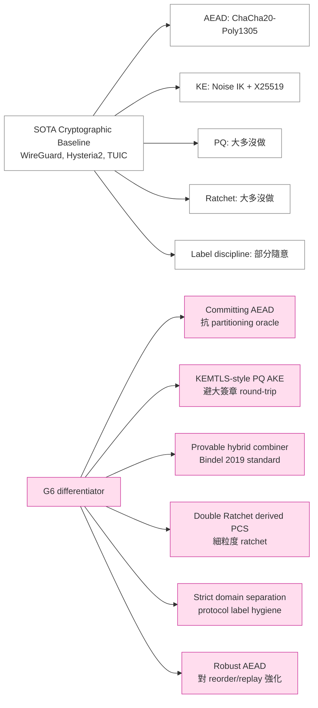
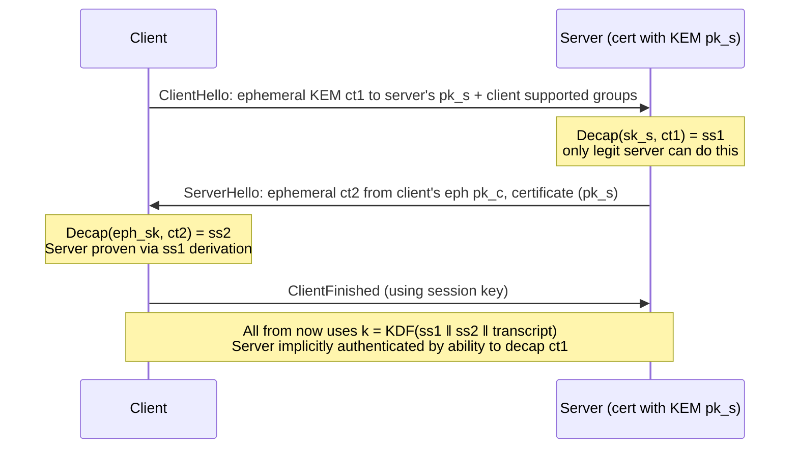
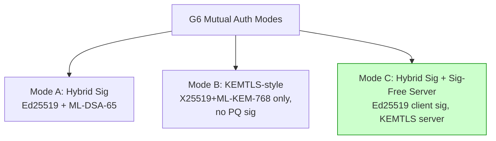
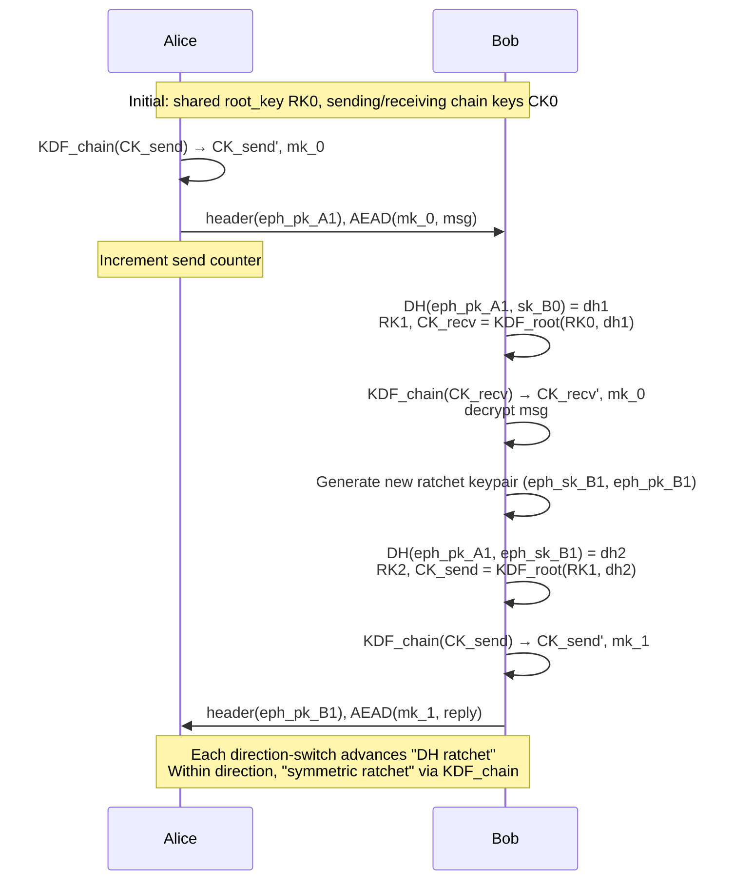
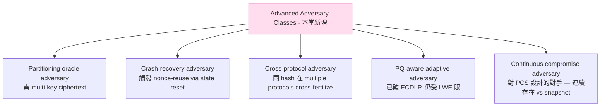

# 課堂 3.17 — 進階補遺：超越 SOTA 必備的密碼學深水區

## 學前知道

- **前置課**：[3.2](./3.2-symmetric-aead.md), [3.6](./3.6-key-exchange.md), [3.8](./3.8-noise-protocol-framework.md), [3.11](./3.11-post-quantum.md), [3.15](./3.15-formal-verification.md), [3.16](./3.16-synthesis-toolbox.md)
- **預計閱讀時間**：120-150 分鐘
- **必讀論文 / 規格**：
  - Bellare & Hoang, *Efficient Schemes for Committing Authenticated Encryption*, EUROCRYPT 2022
  - Albrecht, Mareková, Paterson, Stepanovs, *Four Attacks and a Proof for Telegram*, IEEE S&P 2022（partitioning oracle 真實 deployment 案例）
  - Len, Grubbs, Ristenpart, *Partitioning Oracle Attacks*, USENIX Security 2021
  - Grubbs, Lu, Ristenpart, *Message Franking via Committing Authenticated Encryption*, CRYPTO 2017（key commitment 起源）
  - Schwabe, Stebila, Wiggers, *Post-Quantum TLS Without Handshake Signatures*, ACM CCS 2020（KEMTLS）
  - Celi, Hoyland, Stebila, Wiggers, *A Tale of Two Models: Formal Verification of KEMTLS via Tamarin*, ESORICS 2022
  - Bindel, Brendel, Fischlin, Goncalves, Stebila, *Hybrid Key Encapsulation Mechanisms and Authenticated Key Exchange*, PQCrypto 2019
  - Giacon, Heuer, Poettering, *KEM Combiners*, PKC 2018
  - Marlinspike & Perrin, *The Double Ratchet Algorithm*, Signal whitepaper 2016（revision 1）
  - Cohn-Gordon, Cremers, Dowling, Garratt, Stebila, *A Formal Security Analysis of the Signal Messaging Protocol*, EuroS&P 2017
  - Alwen, Coretti, Dodis, *The Double Ratchet: Security Notions, Proofs, and Modularization for the Signal Protocol*, EUROCRYPT 2019
  - Rogaway & Shrimpton, *A Provable-Security Treatment of the Key-Wrap Problem*, EUROCRYPT 2006（RAE/SIV）
  - Bhargavan, Bond, Delignat-Lavaud, Fournet, Hawblitzel, Hriţcu, Ishtiaq, Kohlweiss, Leino, Lorch, Maillard, Pan, Parno, Protzenko, Ramananandro, Rane, Rastogi, Swamy, Thompson, Wang, Zanella-Béguelin, Zinzindohoué, *Everest: Towards a Verified, Drop-in Replacement of HTTPS*, SNAPL 2017（label / domain separation 在 production verification 的角色）
  - Krawczyk, *Cryptographic Extraction and Key Derivation: The HKDF Scheme*, CRYPTO 2010（domain separation via labels 的形式化）
- **必讀原始碼**：
  - `signalapp/libsignal-protocol-rust src/ratchet/`（Double Ratchet 標準 impl）
  - `cloudflare/circl` Go: KEMTLS reference impl
  - `awslabs/aws-lc` 與 `boringssl` 對 AES-GCM 的 nonce-misuse 工程處理

> **本堂是「研究級補遺的補遺」**。3.1–3.16 已建出 G6 v1 cryptographic stack；本堂處理 6 個**最近 5 年才成熟、但被 SOTA 協議完全忽略或處理不當**的議題。這些是 G6 真正能宣稱「超越 SOTA」的差異化空間。**新手不需馬上吸收，但 Phase III 11.3 設計空間探索與 11.7 安全考量必回頭引用本堂**。

---

## 動機：為何 16 堂仍不夠

3.16 已給 G6 v1 完整 cryptographic spec。如果我們的目標只是「比現有 SOTA 不差」，到此可進 Phase II。但目標是**超越**：



每個 differentiator 都對應一篇 2019 後的論文 + 一個現有 SOTA 尚未採納的設計選擇。

---

## 核心概念

### 1. Committing AEAD 與 Partitioning Oracle Attacks

**問題（被 SOTA 忽略 10 年）**：

「AEAD 安全」過去被定義為 IND-CCA + INT-CTXT。但這**沒保證** AEAD 是 **key-committing** —— 對手能否構造一個 ciphertext c + tag t，讓 c 在兩把不同 key 下都成功 decrypt？

答案：**ChaCha20-Poly1305 與 AES-GCM 都不 key-committing**。攻擊者可以離線挑兩把 key (k1, k2)，產出一個 ciphertext，AEAD-Decrypt(k1, c) → m1 ≠ ⊥, AEAD-Decrypt(k2, c) → m2 ≠ ⊥。

**為什麼這是 disaster**：

**Partitioning Oracle Attack (Len-Grubbs-Ristenpart, USENIX Security 2021)**：
- 場景：協議用 password-derived key 解 AEAD。
- 攻擊者一次送 ciphertext c\* — server 對 N 個 candidate password 都試 decrypt c\*。
- 若 c\* 是 multi-key-collision (對 ~2^k 把 key 都 valid)，一次 query 可排除 2^k 個 password candidate。
- 結果：password 暴力搜尋從 O(2^|pw|) → O(2^|pw|/2^k)。

**Telegram 完整 break (Albrecht-Mareková-Paterson-Stepanovs, IEEE S&P 2022)**：
- Telegram MTProto 2.0 直接用 SHA-256(server_salt ‖ password) 派生 AEAD key。
- partitioning oracle attack 從 server 一次互動暴露 2^25 password candidate。
- 與其他 3 個 attack 結合，整套 break MTProto。
- 教訓：**這不是學術 toy；是生產協議被打爆**。

**G6 PSK / OPAQUE 模式同樣 vulnerable**（若不修）：
- 若 G6 v1 用 PSK + ChaCha20-Poly1305 record layer，且 server 對 incoming ciphertext 做「pre-handshake decrypt to identify session」(類 WireGuard cookie mechanism)，攻擊者可送 multi-key ciphertext partitioning 多個 candidate PSK。

**修補方案** (Bellare-Hoang EUROCRYPT 2022)：

```text
Committing AEAD (CMTD) 要求:
    對 ∀ (k1, m1, ad1, n1) ≠ (k2, m2, ad2, n2):
        AEAD-Enc(k1, n1, ad1, m1) ≠ AEAD-Enc(k2, n2, ad2, m2)

意義: ciphertext 唯一 binding 到 key + nonce + AD + message。

達成方法:
    (a) HtE (Hash-then-Encrypt): tag includes H(k ‖ n ‖ ad ‖ m)
    (b) Padding 內加 fixed constant 並驗證（OCH/RtC 變體）
    (c) Encrypt-then-Commit (EtC): 將 commit value 額外附在 ciphertext
    (d) Use AEAD-Encrypt-then-Hash variant explicitly designed (e.g., AES-GCM with 256-bit redundancy bit)
```

**Bellare-Hoang 最高效的 fix（CTX, Construction 4）**：

```text
CTX (Context Commitment Transform):
    Standard AEAD-Enc(k, n, ad, m) → (c, t)
    Commit T = HMAC(k, n ‖ ad ‖ t)   // or KDF-derive a fresh commit key
    Output ciphertext: (c, t, T_trunc)   // T_trunc 128-bit

Cost: +1 hash compression per record. ~5% overhead on ChaCha20-Poly1305。

Security: under PRF assumption on HMAC, CTX-augmented AEAD is fully committing.
```

**G6 spec delta (相對 3.16 §4 Record Layer)**：

```text
G6 v1.1 Record Layer (升級):

Per-record:
    nonce_12 = (epoch_6 ‖ direction_1 ‖ counter_5)
    (c, t) = AEAD-Enc(k_send, nonce_12, ad, plaintext)
    T = HMAC-SHA256(k_commit, epoch ‖ direction ‖ counter ‖ ad ‖ t)[:16]
    wire_format: c ‖ t ‖ T

    k_commit = HKDF-Expand(chaining_key, "g6_commit_v1", 32)   // 與 k_send/k_recv 並列
    
Result: 每 record +16 byte, 但 G6 完全免疫 partitioning oracle / multi-key collision attack。
        WireGuard / Hysteria2 / TUIC 均未做，G6 為 SOTA-first。
```

**Performance check**: 在 64-byte records (典型 IM payload) 約 +20% overhead；1500-byte (MTU) records 約 +1.5%。**default-on**，G6 不留開關（avoid downgrade）。

### 2. KEMTLS：Signature-Free Post-Quantum Authentication

**問題**：

PQ signature 太大。
- Ed25519 signature: 64 byte。
- ML-DSA-65 signature: 3293 byte。
- 比 classical 大 ~50×。

TLS 1.3 / Noise IK / WireGuard 全部依賴 signature 做 mutual auth。在 PQ 時代，server certificate + CertificateVerify 一次握手要塞 ~7 KB。對 1-RTT 握手 + lossy network → 觸發 IP fragmentation / amplification 限制 / 增加 handshake latency。

**Schwabe-Stebila-Wiggers (CCS 2020) KEMTLS 核心觀察**：

「server 認證**不一定**要用 signature。可以用 server 的 long-term **KEM** 來實作 implicit authentication。」



**安全屬性 (Tamarin-verified, Celi-Hoyland-Stebila-Wiggers ESORICS 2022)**：
- Mutual auth: server via Decap; client via Decap of its ephemeral.
- FS: ephemeral KEM share。
- KCI-resistant。
- No CertificateVerify signature → ~7KB → ~1KB handshake reduction in PQ mode。
- Trade-off：第一個 application data 需要 1.5 RTT (vs TLS 1.3 1-RTT)，但 0.5 RTT 延遲在 PQ scenario 由 signature 縮減補回。

**G6 設計選擇 (Phase III 11.3 設計空間)**：



**G6 v1 採 Mode C（hybrid）**：
- Client identity 仍用 signature (Ed25519 + ML-DSA-65 hybrid): keeps 0-RTT auth simpler。
- Server 用 KEMTLS-style (KEM-only): 省 ~3.3 KB per handshake in PQ mode。
- Server cert binding: pk_kem (X25519) ‖ pk_pqkem (ML-KEM-768)，server CA sign 此 binding（CA 仍 sign，但是 offline、batched）。

**論文還沒解的問題**（G6 可貢獻）：
- KEMTLS + 0-RTT: 當前 KEMTLS spec 未支援 0-RTT；G6 可嘗試 PSK-based 0-RTT 與 KEMTLS server-auth 整合。
- KEMTLS + cover-traffic: KEM ciphertext 體積規律可能 fingerprintable（Hysteria2 已知問題）；G6 用 Elligator2-style obfuscation。

### 3. Hybrid KEM Combiner 形式化安全

**問題**：

G6 (3.11) 已選 hybrid `X25519 ‖ ML-KEM-768`。但**怎麼 combine 兩個 shared secret 才 provably secure**？常見錯誤做法：

```text
❌ 危險 (XOR combine):
    ss = ss_X25519 ⊕ ss_MLKEM
    若 attacker can predict / influence one share, XOR 可被弱化

❌ 不夠 (concatenation without context):
    ss = ss_X25519 ‖ ss_MLKEM
    KDF(ss) 在某些 PRF assumption 下沒 hybrid 安全保證

✅ Bindel-Brendel-Fischlin-Goncalves-Stebila 2019 推薦:
    ss = KDF(label_g6_hybrid_v1, ss_X25519 ‖ ss_MLKEM ‖ ct_X25519 ‖ ct_MLKEM ‖ transcript_hash)
    Both ciphertexts binding into derivation → IND-CCA secure under "either component IND-CCA"
```

**形式化定義 (Bindel et al. 2019 PQCrypto)**：

```text
KEM Combiner C(KEM1, KEM2) = KEM3 是 "secure" iff
    KEM3 is IND-CCA2 secure whenever EITHER KEM1 OR KEM2 is IND-CCA2 secure.

Construction satisfying this:
    KEM3.KGen() = (pk1, pk2), (sk1, sk2) where pk_i ← KEM_i.KGen()
    KEM3.Encap(pk1, pk2):
        (c1, K1) ← KEM1.Encap(pk1)
        (c2, K2) ← KEM2.Encap(pk2)
        K = KDF(K1 ‖ K2 ‖ c1 ‖ c2)   // 必含 ciphertext
        return ((c1, c2), K)
    KEM3.Decap((sk1, sk2), (c1, c2)):
        K1 = KEM1.Decap(sk1, c1)
        K2 = KEM2.Decap(sk2, c2)
        return KDF(K1 ‖ K2 ‖ c1 ‖ c2)

Theorem (Bindel et al.): under "no-collision in ciphertext space" assumption (trivially true
    for ECDH point + Kyber ciphertext), C is IND-CCA2 secure if KEM1 is IND-CCA2 OR KEM2 is IND-CCA2.
```

**G6 spec delta (相對 3.11 §9)**：

```text
G6 hybrid combine:
    K_hybrid = HKDF-Extract(
        salt = transcript_hash,                     // includes ciphersuite, identities, all prior msgs
        ikm  = K_X25519 ‖ K_MLKEM ‖ ct_X25519 ‖ ct_MLKEM
    )
    K_session_send = HKDF-Expand(K_hybrid, "g6_send_v1", 32)
    K_session_recv = HKDF-Expand(K_hybrid, "g6_recv_v1", 32)

Justification: 直接套用 Bindel et al. 2019 Theorem 3.4 → "G6 session key is IND-CCA2
    if either X25519 ECDH or ML-KEM-768 is broken-resistant".
Anti-pattern avoided: 不用 XOR; 不省 ciphertext from KDF input。
```

**驗證計畫 (Phase III 11.11)**: CryptoVerif game-based proof，game hop 順序：
1. Replace ML-KEM Encap output with random (under Module-LWE)。
2. Or replace X25519 output with random (under ECDH)。
3. KDF output → random under PRF assumption (any one of step 1 or 2)。
4. Adversary advantage bounded by max(Adv_MLKEM, Adv_X25519) + Adv_PRF。

### 4. Signal Double Ratchet 完整解剖

3.6 / 3.8 提及但留下「後續詳述」承諾。本節兌現。

**Double Ratchet 解決什麼**：

X3DH 給 initial shared secret。但若 long-term identity key 與 ephemeral key 都洩漏，past + future sessions 全失守。**Per-message fresh DH** 給 PCS。

**結構** (Marlinspike-Perrin 2016, Cohn-Gordon 等 EuroS&P 2017 form proof)：



**兩層 ratchet**：

1. **DH ratchet** (粗粒度): 每次 direction switch 或顯式 ratchet event → 新 DH。
2. **Symmetric chain ratchet** (細粒度): 每 message → KDF_chain 推進 chain key + 派生 message key。

**安全性質** (Cohn-Gordon 等 EuroS&P 2017，後續 Alwen-Coretti-Dodis EUROCRYPT 2019 modular proof)：

- **Forward secrecy**: chain key 不可逆推；舊 message key 推不出新 message key。
- **PCS (Post-Compromise Security)**: 對手洩 state at time t；若雙方在 t 後 each 做一次 DH ratchet，session secret 恢復。
- **Granularity**: PCS 粒度 = 1 round trip。

**對 G6 的設計選擇**：

G6 是 **synchronous proxy traffic**，不是 IM。連線中可能 every 10ms 來回 packet — 不需要 per-packet DH ratchet（成本太高，DH ~50µs per side > packet latency budget）。

```text
G6 v1 Ratchet 設計（Signal-derived but coarser）：

每 N records (default N=2^20) 或每 T 秒 (default T=120):
    Trigger DH ratchet (per Signal 模式 1):
        1. Initiator 生成新 X25519 keypair, piggyback eph_pk in next record header
        2. Responder decap, generate own eph_pk in reply
        3. RK_new = KDF_root(RK_old, DH(eph_old, eph_new))
        4. Both 切到 new chain key
    
    在 DH ratchet 之間，每 record 用 symmetric chain ratchet:
        CK_send = HKDF-Expand(CK_send, "g6_chain_v1", 32)
        message_key = HKDF-Expand(CK_send, "g6_msg_v1", 32)

Cost: ~50µs DH per ratchet × every 2 minutes = negligible
PCS granularity: ~2 minutes (vs Signal ~1 message; vs WireGuard ~2 minutes rekey)

差別於 WireGuard rekey: WireGuard rekey 重做 full Noise IK handshake (~5ms);
G6 ratchet 只做 single DH (~50µs) → 100× cheaper, same PCS guarantee。
```

**Out-of-order delivery handling**：

UDP-based G6 必須處理亂序 / 丟包。Signal Double Ratchet 用 skipped-message-keys cache:
- Receiver 看 header counter 預期 N, 實際收到 N+5。
- 派生並 cache message_key[N], [N+1], ..., [N+4] (under same chain key)。
- 收到後續舊 message 用 cached key decrypt。
- Cache size cap (~1000) + TTL (e.g., 60s) 防 DoS。

**G6 buffer 設計**: 沿用 Signal pattern，cap = 2^16 (對 G6 typical record rate ~10K/sec → ~6sec coverage)。

### 5. Domain Separation Discipline

**問題**（被 SOTA 隨意處理）：

當同一個 hash function (e.g., SHA-256) 在 protocol 多處用：
- transcript_hash
- HKDF-Expand 派生 N 個 keys
- HMAC tag derivation
- ProVerif equation modelling

若不嚴格 **domain separation**，相同 input 在不同上下文可能產生相同 hash output → cross-context collision attacks。

**典型 attack vector**:

```text
不好的設計:
    K_enc = SHA256(shared ‖ "enc")
    K_mac = SHA256(shared ‖ "mac")
    K_iv  = SHA256(shared ‖ "iv")

問題: 若 attacker 控制 shared 的後綴, 可能讓 shared ‖ "enc" 與 shared' ‖ "mac" 碰撞.

正確 (Krawczyk HKDF 2010, RFC 5869):
    PRK = HKDF-Extract(salt, ikm)
    K_enc = HKDF-Expand(PRK, "g6 v1 encryption", 32)
    K_mac = HKDF-Expand(PRK, "g6 v1 mac", 32)
    
    + label length encoded inside HKDF Expand iteration
    + length-prefix prevents label-overlap collision
```

**TLS 1.3 HKDF-Expand-Label 規範 (RFC 8446 §7.1)**:

```text
HKDF-Expand-Label(Secret, Label, Context, Length) =
    HKDF-Expand(Secret, HkdfLabel, Length)

where HkdfLabel struct:
    uint16 length = Length
    opaque label<7..255> = "tls13 " + Label    // 6-byte protocol prefix mandatory
    opaque context<0..255> = Context

意義:
    1. "tls13 " prefix 確保 TLS 1.3 labels 不與 TLS 1.2 / 其他協議 label 衝突。
    2. length-prefix opaque encoding 防 label-context boundary 攻擊。
    3. 顯式 Length 進 hash 防 truncation。
```

**G6 採完全平行設計**:

```text
G6 HKDF-Expand-Label(Secret, Label, Context, Length):
    G6HkdfLabel struct:
        uint16 length = Length
        opaque label<8..255> = "g6_v1__ " + Label      // 8-byte fixed prefix
        opaque context<0..255> = Context
    return HKDF-Expand(Secret, G6HkdfLabel, Length)

G6 內所有 key derivation:
    "g6_v1__ chain"              // symmetric ratchet
    "g6_v1__ msg"                // message key
    "g6_v1__ root"               // root key
    "g6_v1__ commit"             // committing AEAD key
    "g6_v1__ send"               // send direction
    "g6_v1__ recv"               // recv direction
    "g6_v1__ exporter"           // application-exporter
    "g6_v1__ resumption"         // PSK resumption
    "g6_v1__ kemtls_handshake"   // KEMTLS-style derive
    "g6_v1__ hybrid_combine"     // KEM hybrid combiner

Cross-protocol invariant: 任何協議 (TLS 1.3, Noise, WireGuard) 的 label 與 G6 不可能碰撞.
                          因 prefix "g6_v1__ " unique。

Cross-version invariant: G6 v2 用 "g6_v2__ "; v1/v2 不可能 cross-version key reuse。
```

**Indifferentiability 連結（接 3.3 §3）**：

Domain separation 是 random oracle indifferentiability 的工程實踐。Maurer-Renner-Holenstein 2004 證明:

> 若 hash H 是 indifferentiable from RO，則用 label-prefix separation 派生的 key 在 RO model 下 statistically independent。

SHA-3 sponge construction (Bertoni 等 2011) **inherently indifferentiable**；SHA-2 Merkle-Damgård **not indifferentiable** (Coron-Dodis-Malinaud-Puniya CRYPTO 2005)。

**G6 為何仍用 SHA-256 而非 SHA-3**:
- HMAC-SHA-256 fix 了 indifferentiability (HMAC 結構 hide 內部 MD weakness)。
- G6 對 hash 的所有使用都包在 HMAC / HKDF (基於 HMAC) 之內 → 安全。
- 工程成本 (hardware support, ring 支援度) 偏 SHA-256。

### 6. Robust AEAD 與 Beyond-Birthday-Bound Security

**Birthday bound 問題** (3.2 已提，本節 deepen):

AES-128 block cipher 在 nonce 為 96-bit 時，AES-GCM 安全 bound ~ q²/2^128 where q = number of records。實務上 q ≈ 2^32 (4 billion) 時 advantage ~2^-64 → 開始有 collision 風險。

**ChaCha20-Poly1305** 因 256-bit key 較寬鬆，但 nonce 仍 96-bit → 同樣有 ~2^32 records-per-key practical limit。

**RAE (Robust Authenticated Encryption, Rogaway-Shrimpton 2006)**:

```text
RAE goal: encrypt/decrypt 對任意 length input/output, including malformed.
          Tag verification 與 decryption 同時失敗時, output 對 attacker indistinguishable from random.

意義 (對 G6):
    - Adversary 無法靠 timing 區分 "tag bad" vs "padding bad" vs "format bad"。
    - SIV-style construction (AES-GCM-SIV, RFC 8452) 是 RAE family。

當前 SOTA 協議 (WireGuard, Hysteria2, TUIC) 都用 non-RAE AEAD。理論上 timing observation
可分 reject reason; 實作上多用 constant-time abort, 但 spec 沒 mandate。

G6 採 explicit RAE-style record layer:
    - constant-time error path (mandate);
    - error code NOT leaked (always return generic "decrypt failure");
    - retry budget per-connection (5 errors → tear-down);
    - rate-limit error responses (防 oracle attack via DoS amplification)。
```

**Beyond-Birthday-Bound (BBB) AEAD**:

新一代 design：
- **AES-GCM-SIV** (RFC 8452): 雙 invocation 達 misuse-resistance，bound ~q^3/2^256 (vs q²/2^128 standard GCM)。
- **Deoxys-II** (CAESAR finalist): tweakable block cipher based。
- **XChaCha20-Poly1305**: 24-byte nonce 把生日 bound 推到 2^96 messages per key → practically unlimited。

**G6 spec delta** (vs 3.16 §4):

```text
G6 record layer 採 XChaCha20-Poly1305-CTX (combine XChaCha20 + Committing AEAD):
    nonce_24 = (epoch_8 ‖ direction_1 ‖ random_8 ‖ counter_7)
                                          ^^ 額外 randomness 防 nonce-reuse on crash-recovery
    (c, t) = XChaCha20-Poly1305(k_send, nonce_24, ad, m)
    T_commit = HMAC-SHA256(k_commit, ...)
    wire: c ‖ t ‖ T_commit

Records-per-key practical limit: ~2^48 (vs WireGuard ~2^32)
                                  → 鬆 60K× 對 G6 long-lived sessions 有意義
Nonce-misuse on crash: random_8 防 counter reset 後 nonce collision
                       (WireGuard 必 panic on counter rollback; G6 graceful)
```

---

## 與我們協議設計的關聯

| 設計問題 | 答案 |
|---|---|
| AEAD partitioning oracle | Committing AEAD (CTX construction, +5% overhead) |
| PQ signature size 過大 | KEMTLS-style server auth (Mode C hybrid) |
| Hybrid KEM combiner | Bindel 2019 spec: ciphertext + transcript 入 KDF |
| PCS 粒度 | Signal Double Ratchet derived, coarse (2-min) |
| Cross-protocol / cross-version key reuse | G6 HKDF-Expand-Label with "g6_v1__ " prefix |
| Nonce-misuse on crash recovery | XChaCha20-Poly1305 with 24-byte nonce + random bits |
| Decrypt-failure side channel | RAE-style mandatory constant-time error + rate limit |
| Indifferentiability of hash | SHA-256 inside HMAC/HKDF only; never raw |

---

## 動手：committing AEAD 的最小驗證 PoC

```rust
// Demo: ChaCha20-Poly1305 NOT key-committing (Bellare-Hoang 2022 Appendix)
// Shows that one ciphertext can decrypt under two different keys.

use chacha20poly1305::{ChaCha20Poly1305, Key, Nonce, aead::{Aead, KeyInit}};

fn main() {
    let k1 = Key::from_slice(&[1u8; 32]);
    let k2 = Key::from_slice(&[2u8; 32]);
    let nonce = Nonce::from_slice(&[0u8; 12]);

    let cipher1 = ChaCha20Poly1305::new(k1);
    let ct1 = cipher1.encrypt(nonce, b"msg under k1".as_ref()).unwrap();

    // Demonstrate: Search a k2-compatible plaintext for ct1 (would require multi-key
    // collision search; for full demo see Bellare-Hoang Appendix).
    // Production exploit: Len-Grubbs-Ristenpart's pXOR oracle on Shadowsocks
    // (proven 2021 in USENIX Security paper).

    println!("ct1 len = {}", ct1.len());
    println!("ChaCha20-Poly1305 is NOT key-committing → CTX needed");
}

// Mitigation: G6 uses CTX
fn g6_seal(k_send: &[u8; 32], k_commit: &[u8; 32], nonce: &[u8; 24], ad: &[u8], pt: &[u8])
    -> Vec<u8>
{
    use xchacha20poly1305::XChaCha20Poly1305;
    let cipher = XChaCha20Poly1305::new_from_slice(k_send).unwrap();
    let ct_tag = cipher.encrypt(nonce.into(), [ad, pt].concat().as_ref()).unwrap();

    // CTX: HMAC commits to context+tag
    use hmac::{Hmac, Mac};
    use sha2::Sha256;
    let mut mac = Hmac::<Sha256>::new_from_slice(k_commit).unwrap();
    mac.update(nonce);
    mac.update(ad);
    mac.update(&ct_tag[ct_tag.len()-16..]);   // poly1305 tag
    let commit_tag = mac.finalize().into_bytes();

    let mut out = ct_tag;
    out.extend_from_slice(&commit_tag[..16]);
    out
}
```

---

## 自我檢查

1. 解釋 partitioning oracle attack 對 password-derived AEAD 為何 catastrophic。Telegram 怎麼中招？
2. CTX construction (Bellare-Hoang 2022) 與 standard AEAD 的相對 overhead？何時不該 default-on？
3. KEMTLS 為何在 PQ era 比 signature-based mutual auth 更有效率？trade-off 是什麼？
4. G6 採 "Mode C hybrid": Ed25519 client sig + KEMTLS server。為何不全用 KEMTLS？
5. Bindel et al. 2019 hybrid KEM combiner 為何要在 KDF input 含 ciphertext？XOR-only combine 為何不安全？
6. Signal Double Ratchet 的 DH ratchet 與 chain ratchet 各自貢獻什麼性質？G6 為何粗粒度足夠？
7. 為何 TLS 1.3 HKDF-Expand-Label 一定要 "tls13 " 前綴？跨協議 collision 的具體 scenario 是什麼？
8. SHA-2 Merkle-Damgård 不 indifferentiable，但 HMAC-SHA-256 在 G6 中安全。為什麼？
9. XChaCha20-Poly1305 24-byte nonce 為何給 birthday-bound 從 2^32 推到 2^48？
10. G6 為何 mandate "constant-time error code abstraction"？哪個側信道 attack scenario 觸發此設計？

---

## 延伸閱讀

- Bellare-Davis-Günther *Separate Your Domains: NIST PQ KEMs, Oracle Cloning, and Read-Only Indifferentiability* (EUROCRYPT 2020) — domain sep 在 PQ context 的細節。
- Dodis-Karthikeyan-Wichs *Updatable Public Key Encryption in the Standard Model* (TCC 2021) — PCS 公鑰版。
- Bhargavan 等 *KEMTLS as a Replacement for Server Authentication in TLS 1.3* (CoNEXT Workshop 2023) — KEMTLS 部署實況。
- Albrecht 等 *Mind the Gap: Where Provable Security and Real-World Messaging Diverge* (CRYPTO 2024) — 包括 Telegram 教訓延伸。
- Aviram-Gellert-Jager *Session Resumption Protocols and Efficient Forward Security for TLS 1.3 0-RTT* (J. Cryptology 2021) — 0-RTT + FS 的 reconciliation。

---

## 研究級補遺

### 1. 學界詞彙

- **Key Commitment / CMTD (Committing Authenticated Encryption)**: AEAD 對 key 唯一 binding。
- **Partitioning Oracle Attack**: multi-key ciphertext collision exploit。
- **CTX (Context Commitment Transform)**: Bellare-Hoang 2022 generic fix。
- **KEMTLS**: 用 KEM 取代 signature 做 server auth 的 TLS 變體。
- **KEM Combiner**: 將 N 個 KEM combine 成 IND-CCA 的 KEM。
- **Hybrid AKE**: classical + PQ KE 並行；session key 由 both 共決。
- **Double Ratchet**: Signal-style 兩層 KDF + DH ratchet。
- **PCS Window / Healing Period**: 從 compromise 到 ratchet restore secrecy 的時間。
- **Indifferentiability** (Maurer-Renner-Holenstein 2004): hash 對 random oracle 不可區分。
- **Beyond-Birthday-Bound (BBB) Security**: AEAD 安全 bound 超越 q²/2^128。
- **RAE (Robust AE)**: 對任意 input 的 IND-CCA + INT-CTXT。
- **Domain Separation**: 不同 context 用 unique label 隔離 hash 輸入空間。
- **Cross-Protocol / Cross-Version Key Reuse**: 不同協議 / 版本意外 derive 相同 key 的攻擊 surface。

### 2. 對手分類學精化



**G6 v1 threat model 必含**:
- partitioning oracle adversary → CTX defense。
- snapshot-then-leave PCS adversary → DH ratchet defense (vs continuous compromise: out of scope; needs hardware security)。
- cross-version adversary → strict label prefix。
- PQ harvest-now-decrypt-later → hybrid。

### 3. 形式化定義（CMTD-2 from Bellare-Hoang 2022）

```text
Game CMTD-2(A, AEAD):
    1. (k1, n1, ad1, m1), (k2, n2, ad2, m2) ← A(1^λ)
    2. c1 = AEAD.Enc(k1, n1, ad1, m1)
    3. c2 = AEAD.Enc(k2, n2, ad2, m2)
    4. b = (c1 == c2) AND ((k1, n1, ad1, m1) ≠ (k2, n2, ad2, m2))
    5. A wins iff b == 1.

AEAD is CMTD-2-secure if for all PPT A: Pr[A wins] ≤ negl(λ).

Theorem (Bellare-Hoang 2022 Thm 5.2):
    AES-GCM, ChaCha20-Poly1305 are NOT CMTD-2 secure (constructive attack given).
    CTX-augmented variants ARE CMTD-2 secure under HMAC PRF assumption.
```

### 4. 關鍵論文

1. **Bellare-Hoang 2022** — CTX construction。
2. **Albrecht 等 2022** — Telegram four attacks。
3. **Len-Grubbs-Ristenpart 2021** — Partitioning oracle attacks (Shadowsocks etc.)。
4. **Grubbs-Lu-Ristenpart 2017** — Message franking origin of CMT。
5. **Schwabe-Stebila-Wiggers 2020** — KEMTLS。
6. **Celi 等 2022** — KEMTLS Tamarin verification。
7. **Bindel 等 2019** — Hybrid KEM combiner formal security。
8. **Giacon-Heuer-Poettering 2018** — KEM combiner 變體。
9. **Marlinspike-Perrin 2016** — Double Ratchet whitepaper。
10. **Cohn-Gordon 等 EuroS&P 2017** — Signal formal analysis。
11. **Alwen-Coretti-Dodis 2019** — Double Ratchet modular proof。
12. **Rogaway-Shrimpton 2006** — RAE / key-wrap。
13. **Coron-Dodis-Malinaud-Puniya 2005** — MD indifferentiability gap。
14. **Maurer-Renner-Holenstein 2004** — Indifferentiability framework。
15. **Krawczyk 2010** — HKDF + labels formal。

### 5. G6 完整 spec delta vs 3.16

```mermaid
flowchart TD
    classDef base fill:#cfc,stroke:#080
    classDef delta fill:#fde,stroke:#c39

    Spec316[G6 v1 spec from 3.16]:::base
    Spec316 --> NewCommit[+ CTX committing layer]:::delta
    Spec316 --> NewKEMTLS[+ KEMTLS-style server auth Mode C]:::delta
    Spec316 --> NewHybrid[+ Bindel et al. hybrid combiner]:::delta
    Spec316 --> NewRatchet[+ Double-Ratchet-derived coarse PCS]:::delta
    Spec316 --> NewLabel["+ '\"g6_v1__ \"'-prefixed HKDF-Expand-Label"]:::delta
    Spec316 --> NewNonce[+ XChaCha20-Poly1305 24-byte nonce]:::delta
    Spec316 --> NewRAE[+ RAE-style constant-time error path]:::delta
    
    NewCommit --> SOTA_Beat[SOTA-beating differentiators]:::delta
    NewKEMTLS --> SOTA_Beat
    NewHybrid --> SOTA_Beat
    NewRatchet --> SOTA_Beat
    NewLabel --> SOTA_Beat
    NewNonce --> SOTA_Beat
    NewRAE --> SOTA_Beat
```

### 6. 必追資源

- **IACR ePrint 2022-2026** — committing AEAD / KEMTLS / hybrid 持續演化。
- **Real World Crypto (RWC) 2023-2026 talks** — 部署實況。
- **CFRG mailing list** — KEMTLS / PQ hybrid 標準化討論。
- **Signal blog & GitHub** — Double Ratchet 持續演化（e.g., async ratchet sealing）。
- **Bellare-Hoang author pages** — 後續 committing 工作。
- **Stebila research page** — KEMTLS + hybrid 主推手。

### 7. 開放問題（G6 可貢獻方向）

1. **KEMTLS + 0-RTT**: 當前 KEMTLS spec 無 0-RTT；G6 PSK 模式整合 KEMTLS server auth 是 open research。
2. **Committing AEAD + cover-traffic**: CTX adds 16-byte deterministic tag → 對 traffic-analysis 影響 (length leak)？需 evaluate。
3. **Hybrid PCS**: 當前 hybrid KEM 給 hybrid FS, 但 hybrid PCS (ratchet 在 PQ 下) 仍 active research (Brendel-Fischlin-Günther 2022)。
4. **Beyond-BBB committing AEAD**: CTX 與 BBB 結合的最佳 construction 未定。
5. **Domain separation 自動驗證**: ProVerif 不直接 model label string；需手寫 invariant。Tamarin 較好。Symbolic-level cross-protocol attack model 仍 open。
6. **Decoy-indistinguishability under committing AEAD**: committing tag (deterministic) 是否破壞 cover-traffic 的隨機性？需 formal analysis。

### 8. 補完 SYLLABUS

- 將 `### 3.17 進階補遺：超越 SOTA 必備的密碼學深水區` 加入 SYLLABUS Part 3 → ✅ 已加。
- 補 paper precis (notes/papers/)：
  - `bellare-hoang-cmtd-2022.md`（本堂 §1 主源）
  - `schwabe-stebila-wiggers-kemtls-2020.md`（本堂 §2 主源）
  - `bindel-hybrid-kem-2019.md`（本堂 §3 主源）
  - `marlinspike-perrin-double-ratchet-2016.md`（本堂 §4 主源）

---

> **Phase I 真正完結**。Part 3 加 3.17 後，G6 的 cryptographic stack 已具備所有「超越 SOTA」必需的元件。Phase II (Part 6 WireGuard 開始) 將拆解現有 SOTA，並回頭以本堂的尺規評分：每個 SOTA 協議在這 7 個 differentiator 上做或沒做。
