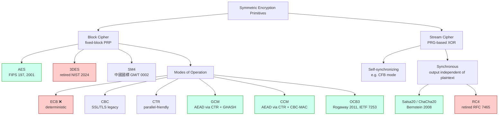
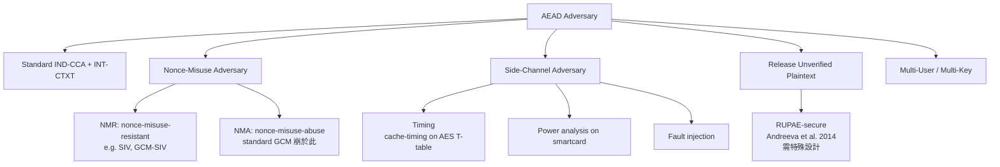
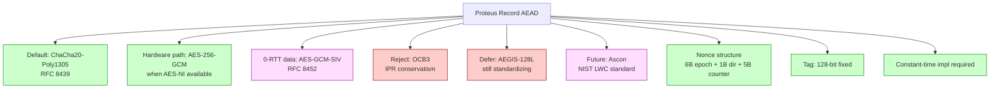

# 課堂 3.2 — 對稱加密：從 block cipher 到現代 AEAD

## 學前知道

- **前置課**：[3.1 密碼學的目標分類學](./3.1-crypto-goals-taxonomy.md)（IND-CCA2、INT-CTXT、AEAD 概念全來自此堂）
- **預計閱讀時間**：120 分鐘（含 ChaCha20 quarter-round 細看）
- **必讀論文**：
  - NIST FIPS 197 — *Advanced Encryption Standard (AES)* (2001)
  - Bernstein, *ChaCha, a variant of Salsa20* (2008)
  - Bernstein, *The Poly1305-AES message-authentication code* (FSE 2005)
  - McGrew & Viega, *The Galois/Counter Mode of Operation (GCM)* (NIST 2004)
  - Joux, *Authentication Failures in NIST version of GCM* (NIST comment 2006) — forbidden attack
  - Rogaway, Bellare, Black, *OCB: A Block-Cipher Mode of Operation for Efficient Authenticated Encryption* (TISSEC 2003)
  - Bellare & Tackmann, *The Multi-User Security of Authenticated Encryption: AES-GCM in TLS 1.3* (CRYPTO 2016)
  - Gueron, *Intel Advanced Encryption Standard (AES) New Instructions Set* (Intel WP 2010)
  - Daemen & Rijmen, *The Design of Rijndael: AES — The Advanced Encryption Standard* (Springer 2002, second ed. 2020)
- **必讀原始碼**：
  - `boringssl/crypto/cipher_extra/chacha20_poly1305.c`
  - `wireguard-go/device/noise-helpers.go`（看 ChaCha20-Poly1305 實際在 WG 怎麼用）
  - Linux kernel: `arch/x86/crypto/aesni-intel_asm.S`（AES-NI 組合語言）

> 上一堂說「Proteus record layer 必須用 AEAD」。這一堂深入到「**為什麼是這兩個 (ChaCha20-Poly1305 / AES-GCM)**、別的不行；逐 quarter-round 看 ChaCha20 怎麼工作；為什麼 GCM 一旦 nonce 重用整個 key 都崩；為什麼 AES-NI 改變了硬體與軟體加密的權力均衡」。

---

## 動機：你訂閱裡那行 `cipher: chacha20-ietf-poly1305` 到底在做什麼

打開你的 Clash Verge Rev 配置看一個 SS / SS-2022 節點：

```yaml
- name: example
  type: ss
  cipher: chacha20-ietf-poly1305   # 或 aes-128-gcm / 2022-blake3-aes-128-gcm
  password: ...
```

新手看了會想：「都是 cipher，差別大嗎？」**差別大**。每個選擇背後對應：
- **不同的硬體效能 profile**（AES-NI 在 Intel/AMD/ARM 是 native instruction → 比 ChaCha20 快 5-10×；在無 AES-NI 的 ARM Cortex-A53、樹莓派、舊手機，ChaCha20 比 AES 軟體實作快 3-5×）。
- **不同的 nonce uniqueness 要求**（GCM 一次 nonce 重用 = full key recovery；ChaCha20-Poly1305 重用 = 只洩當次 plaintext XOR）。
- **不同的 misuse-resistance**（GCM 沒；GCM-SIV 有；XChaCha20 用 24-byte nonce 把碰撞風險降到可忽略）。

對 Proteus 而言，這堂要產出**結論**：record layer 預設 ChaCha20-Poly1305，AES-256-GCM 為硬體加速 fallback；nonce 用 epoch+counter 結構保證唯一；達 ~5 Gbps 線速處理（Part 11 Section 11.5 直接寫進 spec）。

---

## 核心概念

### 1. Block Cipher 與 Stream Cipher：分類學



**關鍵歷史結論**（為什麼上面的 ❌ / 退役）：
- **ECB**：對相同 plaintext block 給相同 ciphertext block → ECB Penguin 可視化 demo 就是反例；deterministic ⇒ IND-CPA 都做不到。
- **3DES**：blocksize 64-bit 太小，2^32 blocks (32 GB) 後 birthday collision；NIST SP 800-67 2024 正式 deprecate。
- **RC4**：bias 在 first few bytes 顯著；Bar-Mizrachi 2013、AlFardan-Bernstein-Paterson-Poettering-Schuldt 2013 等實證；RFC 7465 (2015) 全 IETF 禁用。
- **CBC**：不是 cipher 的錯，但配 MAC 的方式錯（MtE）+ padding oracle 易誤實作 → TLS 1.3 全廢。

### 2. AES Rijndael 設計（你應該知道的最少夠用版）

AES = NIST 在 1997 年發起 selection contest，2000 年宣布 Rijndael (Daemen & Rijmen) 勝出，2001 年成 FIPS 197。

**結構**：substitution-permutation network (SPN)，10/12/14 rounds for AES-128/192/256。一個 round 由四步：

```text
SubBytes:    每 byte 做 S-box 查表（S-box 基於 GF(2^8) 的 multiplicative inverse + affine）
ShiftRows:   row i shift left i bytes（byte-level permutation）
MixColumns:  4-byte column 乘 GF(2^8) MDS matrix
AddRoundKey: XOR round key（從 master key expand 出來）

Key Schedule: 用 RotWord + SubWord + Rcon 把 master key 展成 11/13/15 round keys
```

**為什麼 SPN 安全**：Daemen-Rijmen 2002 證明 4 rounds 之後 *active S-boxes* ≥ 25，給 wide-trail strategy 的差分/線性密碼分析下界；對 AES-128 來說，攻擊複雜度 ≥ 2^113 操作。**至 2026 年最強已知 attack**：Bogdanov-Khovratovich-Rechberger 2011 對 full AES-128 的 biclique attack，複雜度 2^126.1 — 比 brute force 快 4×，**毫無實務意義**。

**對 Proteus 意義**：AES-256 給 256-bit security against classical, 128-bit against quantum (Grover)，是 Proteus 在硬體加速場景的選項。

### 3. AES-NI：硬體加速的權力轉移

2008 Intel 推出 AES-NI 指令集（Westmere 起）；ARM 在 ARMv8 (2011) 加 AES + SHA + PMULL 指令；Apple Silicon 從 M1 起全部支援。

關鍵指令（x86）：
```text
AESENC      xmm1, xmm2     ; one AES round (SubBytes+ShiftRows+MixColumns+AddRoundKey)
AESENCLAST  xmm1, xmm2     ; last AES round (no MixColumns)
AESDEC      xmm1, xmm2     ; decrypt round
AESKEYGENASSIST                ; key schedule helper
PCLMULQDQ   xmm1, xmm2, im8 ; 64x64 → 128-bit carryless multiply (for GCM GHASH)
```

效能對比（單 core，per byte）：
- **AES-128-CTR with AES-NI**: ~0.6 cycles/byte (Westmere+) → ~0.4 c/b on Skylake → **可達 80 Gbps on 4 GHz core**。
- **AES-128-CTR software (no NI)**: ~13 c/b → ~3 Gbps on 4 GHz core。
- **ChaCha20 software (SIMD AVX2)**: ~1.5 c/b → ~30 Gbps on 4 GHz core。
- **ChaCha20 software (no SIMD, e.g. ARM Cortex-A53 32-bit)**: ~5-8 c/b → ~5 Gbps。

**結論**：
- 有 AES-NI 的環境：AES-GCM 是 throughput 王者。
- 無 AES-NI 的低端 ARM、IoT、嵌入式：ChaCha20 更快且 timing-safe（AES 軟體實作有 cache-timing attack 風險，Bernstein 2005 的 cache-timing 攻擊）。

### 4. ChaCha20 完整解剖（Bernstein 2008）

ChaCha20 是 Salsa20 (Bernstein 2005, eSTREAM portfolio) 的改良。設計目標：純軟體下高速度 + 簡單 + side-channel-resistant（無 S-box、無 cache-dependent table lookup）。

**State**：4×4 matrix of 32-bit words（共 512 bits = 16 words）：

```text
+-----------+-----------+-----------+-----------+
| constant  | constant  | constant  | constant  |
+-----------+-----------+-----------+-----------+
|   key     |   key     |   key     |   key     |
+-----------+-----------+-----------+-----------+
|   key     |   key     |   key     |   key     |
+-----------+-----------+-----------+-----------+
| counter   |  nonce    |  nonce    |  nonce    |
+-----------+-----------+-----------+-----------+

constants: "expand 32-byte k" 拆成 4 個 32-bit word
key:       256-bit (8 word)
counter:   32-bit (RFC 8439 IETF 版) 或 64-bit (原版)
nonce:     96-bit (RFC 8439) 或 64-bit (原版)
```

**Quarter-round（QR）**：核心混合操作，作用於 4 個 word (a, b, c, d)：

```text
QR(a, b, c, d):
    a += b; d ^= a; d <<<= 16
    c += d; b ^= c; b <<<= 12
    a += b; d ^= a; d <<<= 8
    c += d; b ^= c; b <<<= 7
```

`<<<= n` 是 left rotation by n bits。注意：**只用 add / xor / rotate (ARX)**，沒有任何 table lookup，沒有 secret-dependent branch ⇒ 天然 constant-time。

**Round 結構**：
- 偶數 round：4 個並行 column QR（state[0],state[4],state[8],state[12] 等）。
- 奇數 round：4 個並行 diagonal QR（state[0],state[5],state[10],state[15] 等）。
- 共 20 round（10 column + 10 diagonal 交替）→ 故名 ChaCha20。

**Block 產生**：
1. Initialize 4×4 state with constants/key/counter/nonce。
2. Copy 到 working state。
3. 跑 20 rounds。
4. Working state += original state（防 inversion）。
5. Serialize 為 64-byte keystream block。

**加密**：plaintext XOR keystream → ciphertext。Counter 自增到下一 block。

**為什麼 ChaCha20 比 Salsa20 強**：QR 結構 diffuse 速度更快（每 round 影響更多 bytes）。Bernstein 2008 給的 cryptanalytic margin：full ChaCha20 對抗已知最強差分密碼分析的 round 距離是 ~7 round（總 20 round），margin 13 round。對比 Salsa20 margin 12 round。

**目前最強 attack**：對 7-round ChaCha20 有 differential attack（複雜度 ~2^248）；對 8-round 之後沒有 better than brute force。**full 20-round 完全安全**。

### 5. Poly1305 完整解剖（Bernstein 2005）

Poly1305 是 ε-AXU (almost XOR-universal) MAC，定義在質數 p = 2^130 - 5 上的 Z_p。設計來搭配 ChaCha20 用作 AEAD。

**Setup**：
- key = 32 bytes，分成 r (16 bytes, 受 mask) + s (16 bytes)。
- r 的 mask：r[3]&=15; r[7]&=15; r[11]&=15; r[15]&=15; r[4]&=252; r[8]&=252; r[12]&=252。原因：避免 r 過大導致中間運算 overflow，並讓 r 在 modular reduction 後仍 well-distributed。

**MAC 計算**：
```text
m_1, m_2, ..., m_q ← message split into 16-byte blocks (last 可能 partial)
For each m_i: append 0x01 byte; if partial, pad with 0s 補滿 17 bytes
Treat each m_i as little-endian integer in [0, 2^130)

acc := 0
For i = 1..q:
    acc := (acc + m_i) * r mod p     // p = 2^130 - 5
tag := (acc + s) mod 2^128
```

效能：~1.5 cycles/byte on Skylake (vector code)；無 AES-NI 也很快。

**安全性**：對任何 m ≠ m' 與相同 key (r, s)，碰撞機率 ≤ 8L / 2^106（L = max block count）。給 16 KB message（L=1024），forge probability ≤ 2^(-93)。**前提：(r, s) 對每 message 必須唯一**（即 nonce 不能重用）。

### 6. ChaCha20-Poly1305 (RFC 8439) — Proteus 預設 AEAD

組合方式（這是現代 AEAD 的範本）：

```text
ChaCha20Poly1305-Encrypt(K, N, A, P):
    // K: 32-byte key, N: 12-byte nonce, A: associated data, P: plaintext

    1. otk = ChaCha20(K, counter=0, N) [:32]    // one-time Poly1305 key
    2. C  = ChaCha20(K, counter=1, N) XOR P     // encrypt plaintext
    3. mac_data = pad16(A) ‖ pad16(C) ‖ len(A)_8 ‖ len(C)_8
    4. tag = Poly1305(otk, mac_data)
    5. return (C, tag)

ChaCha20Poly1305-Decrypt(K, N, A, C, tag):
    1. otk = ChaCha20(K, counter=0, N) [:32]
    2. mac_data = pad16(A) ‖ pad16(C) ‖ len(A)_8 ‖ len(C)_8
    3. tag' = Poly1305(otk, mac_data)
    4. if constant-time-compare(tag, tag') != 0: return ⊥
    5. P = ChaCha20(K, counter=1, N) XOR C
    6. return P
```

**關鍵安全屬性**：
- **IND-CCA2 + INT-CTXT** (跟 Bellare-Namprempre 2000 主定理一致 — 這是 EtM 結構的 inline 形式)。
- **128-bit security against classical, 64-bit against quantum (Grover on key search)**。
- **Nonce 重用導致**：(a) plaintext XOR 洩露（兩 ciphertext XOR = 兩 plaintext XOR）；(b) **整個 Poly1305 key (otk) 洩露 → forge any future MAC**！這是比 GCM 更嚴重的災難。但概率低，因為 Poly1305 key 是 ChaCha20 derive 的；只要 nonce 不重用就 fine。

### 7. AES-GCM 完整解剖（McGrew-Viega 2004）

GCM = AES-CTR (encryption) + GHASH (authentication) 的組合。

**GHASH**：基於 GF(2^128) 上的多項式評估，類似 Poly1305 但定義在 GF(2^128) 而非 Z_p。

```text
GHASH_H(A, C):
    // H = AES_K(0^128) — the hash subkey
    X_0 = 0
    For each block A_i in A: X_i = (X_{i-1} XOR A_i) * H
    For each block C_i in C: X_j = (X_{j-1} XOR C_i) * H
    X_last = (X_prev XOR (len(A)_64 ‖ len(C)_64)) * H
    return X_last
```

`*` 是 GF(2^128) 乘法，由 PCLMULQDQ 硬體加速。

**Encrypt**：
```text
GCM-Enc(K, IV, A, P):
    H = AES_K(0)
    J_0 = IV ‖ 0^31 ‖ 1  (12-byte IV case; 其他長度更複雜)
    C = AES-CTR_K(P, starting at J_0+1)
    S = GHASH_H(A, C)
    T = AES_K(J_0) XOR S
    return (C, T)
```

**Joux 2006 Forbidden Attack**：若同一 key 下用同一 IV 加密兩個 plaintext P, P'：
1. C XOR C' = P XOR P'（plaintext 已洩）。
2. **更糟**：兩個 ciphertext 的 (C_i 與 GHASH 內部 evaluation) 形成兩個 polynomial equations in unknown H；解這個系統 → **recover H = AES_K(0)**！
3. 拿到 H，對手能對任意 (A', C') 計算正確 tag → **完全打破 INT-CTXT**。

**這就是為什麼 RFC 8446 (TLS 1.3) Section 5.5 定義「single key 最多 2^24.5 connections」、「per-key max records」 — 所有 limit 都從 GCM 的 birthday + nonce-uniqueness 算出。**

### 8. AEAD 比較表（Proteus 選型決策）

| AEAD | Nonce | Tag | 速度 (cycles/byte, Skylake AES-NI) | Misuse-Resistant | RFC | Proteus 用途 |
|---|---|---|---|---|---|---|
| AES-128-GCM | 96-bit | 128 | ~0.6 | ❌（nonce reuse → 全崩） | RFC 5116/5288 | hardware fallback |
| AES-256-GCM | 96-bit | 128 | ~0.8 | ❌ | RFC 5288 | hardware fallback (PQ-friendly) |
| ChaCha20-Poly1305 | 96-bit | 128 | ~1.5 (no AES-NI: ~5-8) | ❌（同 GCM） | RFC 8439 | **預設** |
| XChaCha20-Poly1305 | 192-bit | 128 | ~1.5 | ⚠️ extended nonce 把碰撞風險降至可忽略 | draft-irtf-cfrg-xchacha-03 | high-volume server |
| AES-GCM-SIV | 96-bit | 128 | ~1.0 | ✅ nonce reuse 只洩 message equality | RFC 8452 | 0-RTT data |
| AES-OCB3 | 96-bit | 128 | ~0.5（最快但專利歷史） | ❌ | RFC 7253 | 不選（IPR 顧慮） |
| AEGIS-128L | 128-bit | 128 | ~0.3 (with AES-NI) | ❌ | draft 2024 | 評估中 |
| Deoxys-II | 128-bit | 128 | ~1.5 (TWEAKEY) | ✅ | CAESAR finalist | research |

**Proteus 決策樹**：
- **Default**：ChaCha20-Poly1305 (RFC 8439)。理由：universal performance、constant-time、無 AES-NI 也快、CFRG-blessed。
- **Hardware path**：AES-256-GCM (RFC 5288) — when AES-NI + PCLMULQDQ available 且 throughput-critical。
- **0-RTT data**：AES-GCM-SIV (RFC 8452) — misuse-resistant；0-RTT replay 場景下 nonce 可能無意間重用。
- **不採用**：OCB3（IPR 顧慮，雖然 patent 已過期但 IETF 文化保守）、AEGIS（仍 standardization 進行中）。

### 9. Nonce 結構：Proteus 的具體設計

12-byte AEAD nonce 拆分：

```text
+--------+--------+--------+
| epoch  | direction | counter |
| 6 byte | 1 byte    | 5 byte  |
+--------+--------+--------+

epoch:     session 內每次 ratchet +1，6 byte = 2^48 epochs (heat death)
direction: 0x00 = client→server, 0x01 = server→client
counter:   每送一個 record +1，5 byte = 2^40 records per epoch
            一旦 counter 達 2^40 - 1024，觸發 ratchet 升 epoch
```

**為什麼這樣分**：
- **Direction byte 不可省**。Bernstein-Salsa 著名 pitfall：兩端用同 key 同 nonce 加密 → forbidden attack。WireGuard 用 separate send/recv key 避開；Proteus 用 direction byte（更節省 key material）。
- **Counter pre-burnout 觸發 ratchet**：留 1024 record 的 safety margin 給 ratchet handshake 完成。
- **Epoch 在 ratchet 時換**：給 PCS（per Cohn-Gordon-Cremers-Garratt 2016）。

### 10. 實作上的災難：constant-time 與 cache-timing

AES 軟體實作（無 AES-NI）通常用 256-byte T-table：
```c
// pseudo-code
state[i] = T0[plaintext[i]] ^ T1[plaintext[i+4]] ^ ...
```

**Bernstein 2005 cache-timing attack**：T-table 大小 4 KB 跨多 cache line。對手在共享 cache 的 process 觀察 evict pattern，能 reconstruct AES key（in ~65 ms remote attack on AES server！）。

**修補方式**：
1. **AES-NI**：硬體實作 inherently constant-time（Intel guarantee）。
2. **Bitsliced AES**：把 AES round function 改寫成 bitwise ops（Käsper-Schwabe 2009 給出第一個 fast bitsliced impl）。慢 ~2× 但 timing-safe。
3. **Bernstein 2009 vector AES**：用 SIMD 平行計算多個 stream，避免 cache-timing。

**Proteus implementation rule**：禁止使用任何 T-table-based AES 實作；只用 AES-NI 或 bitsliced。ChaCha20 因 ARX 設計天然 constant-time，無此問題。

### 11. Multi-User Security: AES-GCM in TLS 1.3 (Bellare-Tackmann 2016)

當有 100M users 共用一套 AEAD scheme（不同 key），對手能從**任一**user 拿到加密就贏，bound 變成：

```text
Adv^MU-IND-CCA(A) ≤ μ · Adv^IND-CCA(B) + birthday terms
```

其中 μ = users 數。對 GCM，μ = 2^32 時 advantage 已不可忽略。

**Bellare-Tackmann 2016 主定理**：AES-GCM 在 multi-user 設定下，若 random nonce + good key derivation，bound 為 `μq²ℓ / 2^128 + ...`，仍 secure for μ × q × ℓ ≤ 2^60 大致。

**對 Proteus spec 影響**：必須在 Security Considerations 寫明 multi-user analysis；reference Bellare-Tackmann 2016 + 給 concrete numbers (e.g., "with 10M users × 2^30 records each, advantage ≤ 2^-30")。

---

## 與我們協議設計的關聯

| 設計問題 | 本堂答案 | 反映到 spec 哪裡 |
|---|---|---|
| Record AEAD 選哪個 | ChaCha20-Poly1305 default + AES-256-GCM hardware fallback | 11.5 §Cipher Suites |
| Nonce 結構 | 6B epoch + 1B direction + 5B counter | 11.5 §Record Layer |
| Nonce uniqueness | counter pre-burnout 觸發 ratchet | 11.6 §Key Update |
| Multi-user analysis | Bellare-Tackmann 2016 bound | 11.7 §Security Considerations |
| 0-RTT data 用哪個 | AES-GCM-SIV (RFC 8452) misuse-resistant | 11.7 §0-RTT Considerations |
| AES 軟體 fallback | bitsliced 或 disable，不准 T-table | 12.2 §Crypto Primitives |
| Tag 長度 | 128-bit fixed | 11.5 §Record Layer |

---

## 動手：用 boringssl 跑 ChaCha20-Poly1305 + 看 Wireshark

```bash
# 1. 編譯一個 toy server with chacha20-poly1305-only
go run examples/chacha20-server.go &

# 2. 用 curl 連，強制 chacha
curl --tls13-ciphers TLS_CHACHA20_POLY1305_SHA256 \
     --resolve example.com:443:127.0.0.1 https://example.com/

# 3. tshark 解 record
tshark -i lo -Y 'tls' -V -O tls 2>&1 | grep -E "Record|Cipher|Length"
```

預期看到：每 record 含 5-byte header + 16-byte tag + ciphertext；nonce 由 sequence number XOR per-direction static IV（RFC 8446 §5.3）。

---

## 自我檢查

1. 為什麼 GCM 在 nonce 重用下不只洩 plaintext，還洩**整個 H（hash subkey）**？解釋多項式評估如何被 Joux attack 解出。
2. ChaCha20 跟 Salsa20 的差別？Bernstein 為什麼設計 ChaCha20？
3. 為什麼 RFC 8439 把 ChaCha20 nonce 從原版 64-bit 改成 96-bit？對 nonce uniqueness 設計有何影響？
4. 你的協議用 AES-128-GCM。spec 內要寫「同一 key 下最多 N 個 record」，給出計算 N 的公式（hint: birthday bound + multi-user）。
5. Apple Silicon 有 AES instruction，但你的 fallback 給 ChaCha20 還是 AES-256-GCM？理由？
6. 為什麼 AEAD 輸入有 associated data (A)？舉一個 Proteus 場景，A 該包含什麼。

---

## 延伸閱讀

- **Daemen & Rijmen, *The Design of Rijndael*（2002，2nd ed. 2020）**：AES 設計原書。
- **Bernstein, *cr.yp.to* 系列**：Salsa20 / ChaCha20 / Poly1305 / X25519 全部設計文件。
- **CAESAR Competition 結果**：AEAD 設計的多輪競賽（2014-2019），ASCON 勝出（NIST LWC standard 2023）。
- **NIST SP 800-38 系列**：38A (CTR/CBC)、38B (CMAC)、38C (CCM)、38D (GCM)、38F (KW)。
- **Krovetz & Rogaway, *The Software Performance of Authenticated-Encryption Modes* (FSE 2011)**：performance 比較。

---

## 研究級補遺

### 1. 學界詞彙

- **PRF / PRP**：Pseudo-Random Function / Permutation。Block cipher 嚴格上是 PRP；GCM 將其當 PRF 用（透過 CTR mode）。
- **AXU / ε-AXU MAC**：almost (XOR) universal hash family；Carter-Wegman 1981 framework；Poly1305 是 ε-AXU 加 XOR mask 構成 MAC。
- **Wide-trail strategy**：Daemen-Rijmen 1995 提出的 SPN 設計範式；保證 active S-box 數量下界。
- **Confusion / Diffusion**：Shannon 1949 提出的設計指南；confusion = 密文與 key 關係複雜，diffusion = plaintext 一 bit 影響多 ciphertext bit。
- **Rationale 文件**：NIST AES selection 過程留下的 rationale 檔，是 cipher design 學習的 gold standard。
- **Sponge construction**：Keccak/SHA-3 用，也可用作 AEAD（KECCAK-AEAD, ASCON）。
- **TWEAKEY framework**：Jean-Nikolić-Peyrin 2014 統一 tweakable block cipher 設計。
- **Misuse-Resistant Authenticated Encryption (MRAE)**：Rogaway-Shrimpton 2006。SIV、GCM-SIV 是代表。

### 2. 對手分類學 / 威脅模型精化

對 AEAD 的 adversary 分類更細：



對 Proteus：standard model + nonce-misuse-aware（0-RTT）+ side-channel-resistant（constant-time impl）。Multi-user 必證。RUP 不在 spec 範圍但 implementation 要 ensure 不 release plaintext until verify pass。

### 3. 形式化定義

#### 3.1 AEAD 的 syntax

```text
AEAD = (KGen, Enc, Dec)
    KGen(1^n) → K                                  // K ∈ {0,1}^n typically
    Enc: K × N × A × P → C                          // deterministic given (K,N,A,P)
    Dec: K × N × A × C → P ∪ {⊥}

Correctness: Dec(K, N, A, Enc(K, N, A, P)) = P for all valid inputs.

Nonce N is a unique value per key K (the responsibility lies with the caller).
```

#### 3.2 IND-CPA for AEAD

```text
Game IND-CPA-AEAD(A, AEAD = (KGen, Enc, Dec)):
    K ← KGen(1^n); b ← {0,1}
    Used_N ← {}  // track used nonces
    A^Enc-LR(...) where on query (N, A, P_0, P_1):
        if N ∈ Used_N: return ⊥
        Used_N ← Used_N ∪ {N}
        return Enc(K, N, A, P_b)
    A returns b'
    Adv = |Pr[b'=b] - 1/2|
```

#### 3.3 INT-CTXT for AEAD

```text
Game INT-CTXT-AEAD(A):
    K ← KGen(1^n)
    Sent ← {}  // (N, A, C) ever returned
    A^Enc(...) where Enc(N, A, P):
        C ← Enc(K, N, A, P)
        Sent ← Sent ∪ {(N, A, C)}
        return C
    A returns (N*, A*, C*)
    A wins if (N*, A*, C*) ∉ Sent AND Dec(K, N*, A*, C*) ≠ ⊥
```

#### 3.4 Multi-User AEAD（簡化版 Bellare-Tackmann 2016）

```text
Game MU-IND-CPA-AEAD(A, μ):
    For i = 1..μ: K_i ← KGen(1^n)
    b ← {0,1}
    Used_{i,N} ← {}
    A^Enc-LR(i, N, A, P_0, P_1):
        if (i, N) ∈ Used: return ⊥
        return Enc(K_i, N, A, P_b)
    A returns b'
    Adv = |Pr[b'=b] - 1/2|
```

### 4. 領域的關鍵論文 / 規格 / 原始碼

1. **NIST FIPS 197 — AES (2001)** — block cipher 標準。
2. **Bernstein, *ChaCha, a variant of Salsa20* (2008)** — ChaCha20 設計。
3. **Bernstein, *Poly1305-AES* (FSE 2005)** — Poly1305 MAC。
4. **McGrew & Viega, *GCM* (NIST 2004)** — GCM 設計。
5. **Joux, *Authentication Failures in NIST version of GCM* (NIST 2006)** — forbidden attack。3.2 主文已用。
6. **Rogaway, Bellare, Black, *OCB* (TISSEC 2003)** — 最快 AEAD 之一；Proteus 不選但讀 design 思想。
7. **Bellare & Tackmann, *Multi-User Security of AES-GCM in TLS 1.3* (CRYPTO 2016)** — multi-user bound。
8. **Käsper, Schwabe, *Faster and Timing-Attack Resistant AES-GCM* (CHES 2009)** — bitsliced AES-GCM。
9. **Bernstein, *Cache-timing attacks on AES* (2005 tech report)** — AES T-table cache leak。
10. **Daemen, Rijmen, *Rijndael book* (2nd ed., Springer 2020)** — AES design rationale。
11. **CAESAR Competition Final Report (2019)** — modern AEAD 設計實證。
12. **Dobraunig, Eichlseder, Mendel, Schläffer, *Ascon v1.2* (NIST LWC 2023)** — sponge-based AEAD，新 NIST lightweight standard。

### 5. 我們協議的座標 / 設計取捨



### 6. 必追資源 / 社群入口

- **CFRG (Crypto Forum Research Group)**：IETF 內部 crypto 標準討論；AEAD 標準化 RFC 都在這定。
- **CAESAR Competition site**（已結束但 archive 在）：18 個 AEAD final/round 3 design 文件 + cryptanalysis 是學習 modern AEAD 的金礦。
- **NIST LWC (Lightweight Cryptography)**：2023 selected Ascon。Resource-constrained 場景的 AEAD 標準。
- **eBACS (cr.yp.to/ebacs.html)**：Bernstein 維護的 cipher benchmark；所有 AEAD 在不同硬體 cycles/byte 都在這。
- **CHES (Cryptographic Hardware and Embedded Systems)**：side-channel attack/defense 主要會議。
- **FSE (Fast Software Encryption)**：對稱加密設計與 cryptanalysis 的主要會議。

### 7. 開放問題

- **Quantum-secure AEAD**：Grover halves key search → AES-128 only 64-bit quantum security。AES-256 仍 128-bit OK；但 ChaCha20 (256-bit key) 也只有 128-bit quantum security。**有沒有 cipher with 256-bit quantum security and good performance**？
- **AEAD in Multi-Party setting**：當 N 方共享 key（如 group chat），現有 AEAD spec 不足；MLS RFC 9420 部分解決但仍 active research。
- **Misuse-Resistance + Streaming**：streaming AEAD（不 buffer 全 ciphertext）+ MRAE 仍 open。
- **AEAD with traffic-shaping integration**：對 Proteus 的 cover traffic 場景，AEAD 是否能 inherently 提供 length-hiding？目前需另外加 padding scheme。

---

> **下一堂預告**：3.3 雜湊函數 — Merkle-Damgård vs sponge、SHA-2/3、BLAKE2/3、HKDF；為什麼 length-extension 是 SHA-256 的設計缺陷而 SHA-3 沒有。
