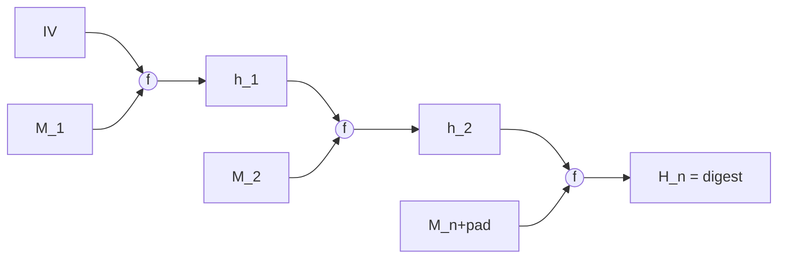
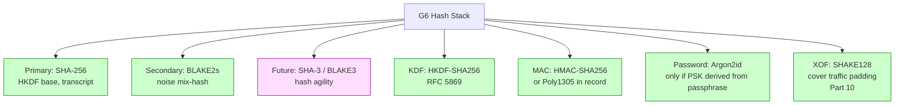

# 課堂 3.3 — 雜湊函數：從 Merkle-Damgård 到 sponge，KDF 與密碼派生

## 學前知道

- **前置課**：[3.1 密碼學的目標分類學](./3.1-crypto-goals-taxonomy.md)、[3.2 對稱加密](./3.2-symmetric-aead.md)（HMAC、Poly1305 都已用到 hash）
- **預計閱讀時間**：100 分鐘
- **必讀論文 / 規格**：
  - NIST FIPS 180-4 — *Secure Hash Standard (SHS)* — SHA-2 family
  - NIST FIPS 202 — *SHA-3 Standard: Permutation-Based Hash and Extendable-Output Functions*
  - Bertoni, Daemen, Peeters, Van Assche — *The Keccak Reference* (v3.0, 2011)
  - Aumasson, Neves, Wilcox-O'Hearn, Winnerlein — *BLAKE2: simpler, smaller, fast as MD5* (ACNS 2013)
  - O'Connor, Aumasson, Neves, Wilcox-O'Hearn — *BLAKE3* (whitepaper 2020)
  - Krawczyk — *Cryptographic Extraction and Key Derivation: The HKDF Scheme* (CRYPTO 2010)
  - Biryukov, Dinu, Khovratovich — *Argon2: New Generation of Memory-Hard Functions for Password Hashing and Other Applications* (EuroS&P 2016)
  - Percival — *Stronger Key Derivation via Sequential Memory-Hard Functions* (BSDCan 2009)
  - Wang, Yin, Yu — *Finding Collisions in the Full SHA-1* (CRYPTO 2005)
  - Stevens 等 — *The First Collision for Full SHA-1* (CRYPTO 2017, "SHAttered")
  - RFC 5869 — *HMAC-based Extract-and-Expand Key Derivation Function (HKDF)*
- **必讀原始碼**：
  - `boringssl/crypto/fipsmodule/sha/sha256.c`、`sha512.c`
  - `boringssl/crypto/hkdf/hkdf.c`
  - `BLAKE3-team/BLAKE3` reference impl
  - WireGuard `noise.go`：MixHash / MixKey 用 BLAKE2s

> 上一堂建立了「對稱加密 + AEAD」工具箱。本堂處理另一個 fundamental primitive：hash function。Hash 不只是 SHA-256；它是 KDF（HKDF）、commitment、Merkle tree、PoW、簽章前的 message digest、HMAC、Poly1305 base、ChaCha20 mixing 的共同基石。SOTA 協議設計沒有它寸步難行。

---

## 動機：「雜湊」是密碼學的螺絲釘

打開 WireGuard `noise.go`：

```go
// 簡化片段：MixKey
func (h *Handshake) MixKey(input []byte) {
    h.chainingKey, _ = hkdf(h.chainingKey, input, 1)
}
```

打開 TLS 1.3 RFC 8446 §7.1：

```text
HKDF-Expand-Label(Secret, Label, Context, Length) =
    HKDF-Expand(Secret, HkdfLabel, Length)
```

打開 Signal Double Ratchet whitepaper：

```
RootKey, ChainKey = KDF_RK(RootKey, DH_output)
ChainKey, MessageKey = KDF_CK(ChainKey)
```

四個現代 SOTA 協議全部依賴 KDF (HKDF)，HKDF 又依賴 HMAC，HMAC 又依賴某個 underlying hash。**選錯 hash 整個 protocol 設計空間就被卡住**：
- 用 SHA-1 → SHAttered 後不可接受。
- 用 SHA-256 → 安全但 length-extension 限制 design space（不能 naive 用 H(K ‖ m)）。
- 用 SHA-3 / BLAKE3 → 沒 length-extension，可省 HMAC 一層複雜度。

這堂處理：**為什麼 length-extension 會殺人、Merkle-Damgård vs sponge 的本質差別、HKDF 為什麼是 Extract + Expand 兩段、密碼 hash 為什麼必須 memory-hard、WireGuard / TLS 1.3 / Signal 為什麼選 BLAKE2s / SHA-256 / SHA-512 各有道理**。

---

## 核心概念

### 1. Hash function 的安全屬性 — 三個你必須背的

```mermaid
flowchart TD
    H[Hash Function H: {0,1}* → {0,1}^n]

    H --> Pre[Preimage Resistance<br/>給 y, 找 x s.t. H(x)=y 難<br/>O(2^n) brute force]
    H --> Sec[Second-Preimage Resistance<br/>給 x, 找 x'≠x s.t. H(x')=H(x) 難<br/>O(2^n)]
    H --> Coll[Collision Resistance<br/>找 (x, x') s.t. x≠x', H(x)=H(x') 難<br/>O(2^(n/2)) by birthday]

    Pre -->|implies?| Sec[Second-preimage]
    Coll -->|implies| Sec
    Coll -.does NOT imply.-> Pre
```

關鍵 reduction 順序：**Collision ⇒ Second-preimage ⇒ Preimage** 通常 hold（多數 hash 是這樣），但**反向不總成立**。

對 G6 的硬性結論：
- 我們需要 collision resistance 給簽章（防 (m, σ) → (m', σ) 換訊息攻擊）→ hash output ≥ 256-bit（128-bit security against birthday）。
- 我們需要 preimage resistance 給 commitment、密碼比對 → hash output ≥ 256-bit。
- 我們需要 PRF security（將 hash 當隨機 oracle）給 KDF → 用 HKDF 結構而非 raw hash。

### 2. Merkle-Damgård 構造（傳統 hash 的骨架）

Merkle 1979 + Damgård 1989 提出：把任意長 input 切 block，用 fixed-size compression function f 迭代壓縮。



**SHA-2 family 都是 Merkle-Damgård**：
- SHA-256: block 512-bit, output 256-bit, compression f 是 64-round Davies-Meyer 變體。
- SHA-512: block 1024-bit, output 512-bit, compression 80-round。

**Merkle-Damgård 的致命缺陷：length-extension**：

```text
若你知道 H(M)，你不需要知道 M 也能算 H(M ‖ pad ‖ X) for arbitrary X。
原因：Merkle-Damgård 把 H(M) 直接當下一輪 compression 的 chaining state；
      你只要從 H(M) 開始繼續迭代加 X 的 blocks 即可。
```

**真實災難**：Flickr 2009 用 `H(secret ‖ params)` 當 API signature。攻擊者沒有 secret，但能對 `params` extend `&admin=1` 並產生 valid signature → admin 權限。後來 Flickr 改用 HMAC 修補。

**修補方式**：
1. **HMAC** (Bellare-Canetti-Krawczyk 1996, RFC 2104)：`HMAC = H(K' ⊕ opad ‖ H(K' ⊕ ipad ‖ m))`。雙 hash + key XOR 防 length-extension。
2. **Truncated hash**：SHA-512/256 = SHA-512 截斷到 256-bit；不洩 internal state。
3. **不同設計**：sponge (SHA-3、BLAKE3) 從根本不 vulnerable。

### 3. SHA-3 / Keccak — Sponge construction（Bertoni-Daemen-Peeters-Van Assche 2011）

NIST 在 SHA-1 SHAttered 危機後重啟 hash competition (2007-2012)，2012 年宣布 Keccak 勝出，2015 年標準化 FIPS 202 SHA-3。

**Sponge construction**：state 大小 b = r (rate) + c (capacity)。輸入分 r-bit block，每次 XOR 進 state 的 r-part 然後 permute；輸出階段每次取 r-bit。

```text
Sponge:
    State S = 0^b   (b = r + c)
    
    Absorb phase:
        For each input block M_i (r-bit):
            S = f(S XOR (M_i ‖ 0^c))
    
    Squeeze phase:
        Output empty
        Repeat:
            output ← output ‖ S[0:r]
            S = f(S)
        Until output ≥ desired length
```

**為什麼 sponge 沒 length-extension**：output 只取 state 的 r-part，**capacity c-part 永遠不外露**。對手即使知道 H(M) 也不知道內部 capacity；無法繼續迭代。

**SHA-3 spec**:
- Keccak-f[1600] permutation: state 1600-bit (5×5×64 lane)
- SHA3-256: r=1088, c=512
- SHA3-512: r=576, c=1024
- SHAKE128/256: extendable output (XOF)

**SHA-3 的優劣**：
- ✅ 無 length-extension。
- ✅ XOF (extendable output function) 內建：SHAKE 可任意長 output，免去 KDF 結構複雜性。
- ✅ provable secure against differential / linear cryptanalysis under the wide-trail strategy。
- ❌ 軟體效能不如 SHA-2 / BLAKE3：SHA3-256 ~12 cycles/byte (Skylake)，SHA-256 ~5 c/b，BLAKE3 ~0.5 c/b。
- ❌ 硬體實作大（state 1600-bit），嵌入式不友善。

### 4. BLAKE2 / BLAKE3 — 現代 hash 王者

**BLAKE2 (Aumasson 等 2013)**：基於 ChaCha20 的 ARX 結構。
- BLAKE2b: 64-bit word, 12 round, output 1-512 bit.
- BLAKE2s: 32-bit word, 10 round, output 1-256 bit.
- 速度：BLAKE2b ~3 cycles/byte (Skylake) — 比 SHA-512 快 30%, 比 SHA3-512 快 4×。
- WireGuard 用 BLAKE2s 為 noise hash + MAC base。

**BLAKE3 (O'Connor 等 2020)**：BLAKE2 的全面改寫，大幅簡化 + 加 Merkle tree 結構。
- 8x SIMD lanes 平行計算 → 非常快（~0.5 cycles/byte AVX-512）。
- Merkle tree mode：對大檔案可平行 hash + 增量驗證。
- KDF / XOF / MAC / hash 四種 mode 統一介面。
- 但**仍 Merkle-Damgård / Merkle-tree 結構**——理論上有 length-extension 但 BLAKE3 spec 用 finalization step + 不同 IV per mode 防止。

### 5. Hash-based MAC: HMAC 結構

HMAC (RFC 2104, Bellare-Canetti-Krawczyk 1996)：

```text
HMAC_K(M) = H( (K' ⊕ opad) ‖ H( (K' ⊕ ipad) ‖ M ) )

其中:
    K' = K (if |K| ≤ block_size) else H(K) (if longer); pad with 0 to block_size
    ipad = 0x36 repeated block_size times
    opad = 0x5C repeated block_size times
```

**為什麼這結構不只是「concat key 再 hash」**：
- `H(K ‖ M)` length-extension vulnerable（Merkle-Damgård）。
- `H(M ‖ K)` 對 collision-prone hash 不安全（找 M, M' collision → MAC collision）。
- HMAC 的 nested 結構在**HMAC 是 PRF iff underlying H 是 PRF on dual-key**（Bellare 2006 證明）下 secure。

**HMAC-SHA256 / HMAC-SHA512 是 G6 的 KDF base**（透過 HKDF）。

### 6. KDF: 從 raw secret 到 working keys (HKDF, Krawczyk 2010)

**問題**：DH output `g^ab` 不是 uniform random — 它是 group element，可能有 bias。直接當 AES key 用安全性不足。需要把 raw secret **extract** + **expand** 成多個獨立 working keys。

**HKDF 結構**（two-step）：

```text
HKDF-Extract(salt, IKM) = HMAC(salt, IKM)        → PRK (pseudo-random key)
HKDF-Expand(PRK, info, L)                          → output of length L
    where output = T(1) ‖ T(2) ‖ ... ‖ T(N)
    T(0) = empty
    T(i) = HMAC(PRK, T(i-1) ‖ info ‖ i)
    truncate output to L bytes
```

**為什麼兩段而非一段**：
- **Extract**：把 high-entropy but possibly biased input (如 DH output) 「拍平」成 uniform PRK。理論上對 PRK 證明 statistical close to uniform。
- **Expand**：從 PRK 生成 arbitrary 長度 keystream；可重複 query 取不同 (info, L)。

**TLS 1.3 用 HKDF 全 derive**：
```text
early_secret = HKDF-Extract(0, PSK_or_0)
handshake_secret = HKDF-Extract(derived_early, DHE)
master_secret = HKDF-Extract(derived_handshake, 0)

client_traffic_secret = HKDF-Expand-Label(handshake_secret, "c hs traffic", ...)
... (8+ different keys derived from handshake_secret + master_secret)
```

**WireGuard 也用** （hand-rolled HKDF on BLAKE2s）。

### 7. Password Hashing: scrypt / Argon2 / bcrypt

**問題**：使用者密碼 entropy 低（一般 < 40 bit）。直接 H(password) → 對手用 GPU/ASIC 平行 brute-force 容易。需要 **memory-hard** function 讓硬體攻擊昂貴。

**scrypt (Percival 2009)**：
- 第一個 sequential memory-hard function。
- 用大量 memory 執行 sequential operation，硬體加速沒優勢。
- 缺點：sequential ⇒ defender 也慢；參數調 tricky。

**Argon2 (Biryukov-Dinu-Khovratovich 2016)** — Password Hashing Competition 2015 winner:
- Argon2d: data-dependent memory access（最強 GPU 抵抗）。
- Argon2i: data-independent（side-channel resistant，server 用）。
- Argon2id: hybrid — **OWASP / NIST SP 800-63B 推薦**。
- 參數：m (memory), t (time), p (parallelism)。建議 m ≥ 64 MB, t ≥ 3, p = 1。

**對 G6**：G6 不是 password-based protocol，但 future PSK 模式若 derive from user-typed passphrase 必走 Argon2id（Part 3.9 PAKE 詳論）。

### 8. SHA-1 死亡時間軸（教訓）

```text
1995: SHA-1 spec 發布。
2005: Wang-Yin-Yu 給 collision attack of complexity 2^69 — broke 80-bit security.
2012: NIST 開始 deprecate SHA-1 (SP 800-131A)。
2017: Stevens 等 SHAttered — 第一個實際 SHA-1 collision (110 GPU-years, $110k cloud cost)。
       兩個不同 PDF 文檔 hash 相同。
2020: NIST 完全 disallow SHA-1。
2024: Web PKI 完全淘汰 SHA-1 X.509 cert。
```

**對 G6 教訓**：
- Hash 一旦被 collision-broken，依賴它的所有 protocol（簽章、HMAC、commit）都受影響。
- 設計時一定要有 hash agility（spec 內預留 hash function 升級路徑）。
- G6 默認 SHA-256 + BLAKE2s（雙軌），未來可升級 SHA-3 / BLAKE3。

### 9. Hash 在 G6 的具體用法

| 用途 | Hash 選擇 | 理由 |
|---|---|---|
| HKDF base | HMAC-SHA-256 | TLS 1.3 同款，library 普及 |
| Transcript hash | SHA-256 | 同 TLS 1.3，便於互通 |
| Identity commitment | SHA-256 | collision resistance 重要 |
| Random oracle in proofs | SHA-256 (treated as RO) | standard practice |
| Nonce derivation | BLAKE2s (in MixHash, optional) | WireGuard inspired，noise framework |
| Cover-traffic 偽造 (Part 10) | SHAKE128 (XOF) | 任意長 output 適合 padding 設計 |

---

## 與我們協議設計的關聯

| 設計問題 | 本堂答案 | 反映 spec |
|---|---|---|
| 哪個 hash 當 KDF base | SHA-256 (TLS 1.3 互通) | 11.5 |
| Length-extension 顧慮 | 全用 HMAC 結構，禁 raw H(K‖m) | 11.5 |
| KDF 結構 | HKDF (Extract + Expand) | 11.6 |
| Hash agility | spec 內定義 hash_id field 預留升級 | 11.5, 11.8 |
| Password-based PSK | Argon2id (m≥64MB, t=3) | 11.6 (optional) |
| Cover traffic padding | SHAKE128 | 10.7 |
| Transcript bind | SHA-256(全握手 messages) | 11.6 |

---

## 動手：實作 length-extension 攻擊

```python
# 用 hashpump (or hash_extender) 對 SHA-256 做 length-extension
# 假設 server 用 H(secret ‖ "user=alice") 當 signature
# attacker 知道 H 與 length(secret)，但不知 secret

import hashpumpy

# (original_hash, original_data, attacker_data, secret_length)
new_hash, new_data = hashpumpy.hashpump(
    "fa1...",                  # 原 H(secret ‖ "user=alice")
    "user=alice",              # known data
    "&admin=1",                # 想 append
    16                         # secret 長度（對手猜 16 bytes）
)

print(new_hash)  # forge 出的新 signature
print(new_data)  # 包含 padding + admin=1
```

跑一次你會看到 `&admin=1` 確實能被 server 接受。然後實作 HMAC fix 並驗證攻擊失敗。

---

## 自我檢查

1. SHA-256 collision 找需要多少 brute-force 操作？second-preimage 呢？preimage 呢？
2. 為什麼 SHA-3 (sponge) 不需要 HMAC 也安全？對 G6 用 SHA-3 直接 KDF 是否合理？trade-off 是什麼？
3. 解釋 HKDF 的 Extract step 為什麼不能省。給一個反例：直接用 DH output 當 AES key 會出什麼問題。
4. BLAKE3 為什麼比 SHA-256 快 10×？是設計上的什麼選擇導致？
5. 為什麼 password hashing 用 SHA-256（即使 salted）不夠？memory-hard 的本質是什麼？
6. 你的協議用 SHA-256 做 transcript hash。一年後 SHA-256 出現 2^200 的 collision attack。spec 內如何 hash-agility 升級到 SHA-3 而不破壞向後相容？

---

## 延伸閱讀

- **Katz-Lindell *Introduction to Modern Cryptography* Chapter 5**：hash function 完整 textbook treatment。
- **Bellare *Random Oracles are Practical*** (CCS 1993)：把 hash 當 RO 的設計範式。
- **Bertoni 等 *Sponge Functions*** (ECRYPT 2007)：sponge 構造原 paper。
- **Boneh-Shoup *A Graduate Course in Applied Cryptography* Chapter 8**：完整 hash 理論。
- **Krawczyk *On Extract-then-Expand Key Derivation Functions and an HMAC-based KDF*** (Crypto 2010)：HKDF 設計理論。

---

## 研究級補遺

### 1. 學界詞彙

- **Compression Function f**：Merkle-Damgård 的 fixed-size building block。f: {0,1}^n × {0,1}^b → {0,1}^n。
- **Davies-Meyer / Matyas-Meyer-Oseas**：用 block cipher 構造 compression function 的範式（SHA-2 用 Davies-Meyer 變體）。
- **Wide-pipe / Narrow-pipe**：state size 是否大於 output。SHA-512/256 是 wide-pipe (state 512, output 256)，免 length-extension。
- **HAIFA framework** (Biham-Dunkelman 2007)：Merkle-Damgård 改進，加入 salt + counter 防止 multi-collision。
- **Sponge / Duplex** (Bertoni 等)：duplex 是 sponge 的雙向版本，可同時 absorb 與 squeeze；ASCON AEAD 用此。
- **Indifferentiability** (Maurer-Renner-Holenstein 2004)：構造 RO-indistinguishable 的 hash 從 PRP 出發；sponge 是 indifferentiable。
- **PRF / PRF-PRP switching lemma**：HMAC PRF 證明的關鍵。
- **KDF / extractor vs expander**：Extract 把 min-entropy source 變 uniform；Expand 把 short uniform 變 long PRG。
- **Memory-hard / Sequential memory-hard / Data-(in)dependent**：Argon2 三變體分類。
- **ROX (RO XOR) Construction**：lifting MD to indifferentiable hash 的早期方法。

### 2. 對手分類學

```mermaid
flowchart TD
    HA[Hash Adversary]
    HA --> Generic[Generic adversary<br/>black-box H]
    HA --> Algebraic[Algebraic adversary<br/>知道 H 結構]
    HA --> Quantum[Quantum adversary]

    Generic --> Coll[Collision finder<br/>O(2^n/2) birthday]
    Generic --> Pre[Preimage finder<br/>O(2^n)]

    Algebraic --> Diff[Differential cryptanalysis]
    Algebraic --> Linear[Linear cryptanalysis]
    Algebraic --> Boomerang[Boomerang attack]
    Algebraic --> Rebound[Rebound attack<br/>Mendel-Rechberger 2009]

    Quantum --> Grover[Grover speedup<br/>preimage to O(2^n/2)]
    Quantum --> BHT[Brassard-Høyer-Tapp<br/>collision to O(2^n/3)]
```

對 G6：必須假設 quantum adversary。Hash output ≥ 384-bit 才能對抗 BHT 給 128-bit collision security。**G6 仍用 SHA-256 (256-bit output)**，因為 BHT 的 quantum collision attack 需要 quantum random access memory，現實 100+ 年內不可行；但要在 spec 內說明此假設。

### 3. 形式化定義

#### 3.1 Collision Resistance 的精確版

```text
Game CR(adversary A, hash H):
    (x, x') ← A
    return [x ≠ x' AND H(x) = H(x')]

Adv^CR_H(A) := Pr[Game returns 1]

Definition: H is (t, ε)-CR iff for all A running in time t,
            Adv^CR_H(A) ≤ ε.
```

**注意**：H 必須是 fixed function，不能是 keyed family（否則對手可以 hardcode collision 在 advice）。Rogaway 2006 指出此「人類 vs adversary 知識不對稱」問題；實務上把 H 當 fixed RO。

#### 3.2 Preimage / Second-Preimage

```text
Game Pre(A, H):
    x ← random in domain
    y := H(x)
    x' ← A(y)
    return [H(x') = y]

Game SecPre(A, H):
    x ← random
    x' ← A(x)
    return [x ≠ x' AND H(x') = H(x)]
```

#### 3.3 PRF Security of Keyed Hash

```text
Game PRF(A, F):
    K ← KGen
    b ← {0,1}
    R ← random function
    return [b == A^{F(K,·) if b=1 else R(·)}]
```

#### 3.4 HKDF Security (Krawczyk 2010 主定理)

若 underlying hash H 是 PRF (HMAC-secure), HKDF-Extract output PRK is statistically close to uniform (in min-entropy sense), and HKDF-Expand is a PRF in info → output. Concrete bound 含 q²/2^n birthday term + HMAC-PRF-bound terms.

### 4. 關鍵論文

1. **Merkle 1979 *Secrecy, Authentication, and Public Key Systems*** — MD construction 原源。
2. **Damgård 1989 *A Design Principle for Hash Functions*** — formal MD 證明。
3. **Bertoni-Daemen-Peeters-Van Assche, *Cryptographic Sponge Functions*** (2011) — sponge 設計專書。
4. **Bertoni 等 *Keccak Reference v3.0*** (2011) — SHA-3 詳細 spec。
5. **Aumasson 等 *BLAKE2*** (ACNS 2013) — 現代 ARX hash。
6. **O'Connor 等 *BLAKE3 paper*** (2020) — Merkle tree hash + SIMD。
7. **Bellare-Canetti-Krawczyk *Keying Hash Functions for Message Authentication*** (CRYPTO 1996) — HMAC。
8. **Krawczyk *HKDF*** (CRYPTO 2010) — 兩段 KDF 設計。
9. **Wang-Yin-Yu *Finding Collisions in the Full SHA-1*** (CRYPTO 2005) — 殺 SHA-1。
10. **Stevens 等 *SHAttered*** (CRYPTO 2017) — 實際 SHA-1 collision。
11. **Biryukov-Dinu-Khovratovich *Argon2*** (EuroS&P 2016) — PHC winner。
12. **Percival *scrypt*** (BSDCan 2009) — sequential memory-hard。
13. **Maurer-Renner-Holenstein *Indifferentiability...*** (TCC 2004) — RO 等價性 framework。
14. **Coron-Dodis-Malinaud-Puniya *Merkle-Damgard Revisited*** (CRYPTO 2005) — MD 的 indifferentiability 缺陷。

### 5. 我們協議的座標



### 6. 必追資源

- **Hash Function Lounge** (Vlastimil Klima 早期維護)：collision attacks 進度追蹤。
- **CRYPTREC / NESSIE / NIST hash competition archives**：所有 hash competition 歷史。
- **Cryptography Stack Exchange**：HKDF / Argon2 實務問題的權威解答。
- **OWASP Password Storage Cheat Sheet**：password hashing recommendation。

### 7. 開放問題

- **Quantum-secure hash margin**：384-bit output (BHT bound) 是否「真的需要」？實務 quantum hardware 對 1B+ qubits with quantum RAM 的可行性仍 disputed。
- **Indifferentiable AEAD-from-hash**：能否從 single hash function 構造 AEAD without separate cipher？BLAKE3 的 KDF mode 部分達成。
- **Post-quantum password hashing**：Argon2 在 quantum adversary 下 memory-hardness 仍 hold？open。
- **Hash agility 的 protocol-level 設計**：如何在 protocol spec 中定義 hash-id 升級機制而不破壞舊 implementation？TLS 1.3 ciphersuite 設計是部分解。

---

> **下一堂預告**：3.4 公鑰密碼學一：RSA — 數論基礎、RSA-OAEP/PSS、為什麼 textbook RSA 不能用、Bleichenbacher 1998 的 padding oracle、為什麼 G6 預設不選 RSA。
