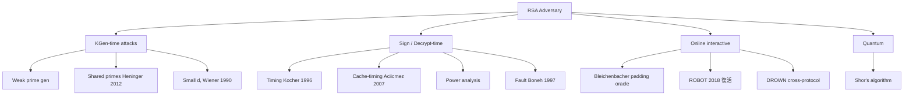
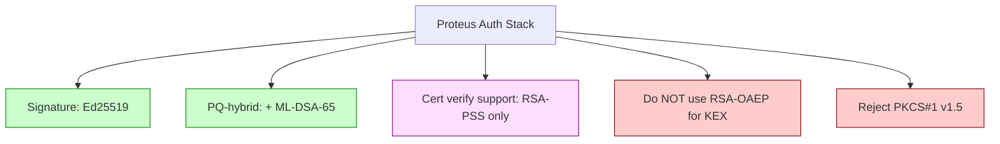

# 課堂 3.4 — 公鑰密碼學一：RSA — 從歐拉定理到 Bleichenbacher

## 學前知道

- **前置課**：[3.1 密碼學的目標分類學](./3.1-crypto-goals-taxonomy.md)、[3.2 對稱加密](./3.2-symmetric-aead.md)
- **預計閱讀時間**：90 分鐘
- **必讀論文**：
  - Rivest, Shamir, Adleman, *A Method for Obtaining Digital Signatures and Public-Key Cryptosystems*, CACM 1978
  - Boneh, *Twenty Years of Attacks on the RSA Cryptosystem*, Notices of the AMS 1999
  - Bleichenbacher, *Chosen Ciphertext Attacks Against Protocols Based on the RSA Encryption Standard PKCS #1*, CRYPTO 1998
  - Bellare, Rogaway, *Optimal Asymmetric Encryption — How to Encrypt with RSA*, EUROCRYPT 1994
  - Bellare, Rogaway, *The Exact Security of Digital Signatures — How to Sign with RSA and Rabin*, EUROCRYPT 1996（PSS）
  - Coppersmith, *Finding a Small Root of a Univariate Modular Equation*, EUROCRYPT 1996
  - Heninger, Durumeric, Wustrow, Halderman, *Mining your Ps and Qs: Detection of Widespread Weak Keys in Network Devices*, USENIX Security 2012
- **必讀原始碼**：
  - `boringssl/crypto/fipsmodule/rsa/rsa_impl.c`
  - `boringssl/crypto/fipsmodule/rsa/padding.c`（OAEP / PSS 實作）

> 上一堂處理對稱加密 + hash；本堂進公鑰世界。RSA 是公鑰加密的祖宗（1978），主導 25 年但在 2000 年代被橢圓曲線取代。**Proteus 預設不選 RSA**——但你要知道為什麼不選；要能解 Bleichenbacher / Boneh / Coppersmith 都打過 RSA 哪些洞；以及 RSA-PSS / RSA-OAEP 在 hybrid PQ 時代仍有的角色。

---

## 動機：為什麼還要學 RSA？

2026 年新協議幾乎都用 X25519 + Ed25519。但你需要了解 RSA，因為：

1. **TLS 1.3 仍允許 RSA cert auth**：90% Web certificates 仍 RSA-2048。client 端要能 verify RSA-PSS signature。
2. **PKCS#11 / HSM / TPM 大量是 RSA-based**：企業環境硬體模組很多只支援 RSA。
3. **RSA 攻擊是 protocol-security 經典案例**：Bleichenbacher 1998 是「padding oracle」原型，後續所有 padding oracle attack 都繼承這思想。
4. **post-quantum hybrid 仍可能用 RSA**：NIST 過渡期建議 ECDSA + ML-DSA hybrid，但部分舊系統用 RSA + ML-DSA hybrid。
5. **數論直覺是後續所有公鑰系統的基礎**：學了 RSA 你才能 appreciate 為什麼 ECC 用 group 結構而非 ring。

---

## 核心概念

### 1. 數論最小必要包

**Euler's Totient Function φ(n)**：n 以下與 n 互質的正整數個數。
- φ(p) = p - 1, p prime.
- φ(pq) = (p-1)(q-1), p, q distinct primes.
- φ 是 multiplicative: gcd(a,b)=1 ⇒ φ(ab) = φ(a)φ(b).

**Euler's Theorem**：gcd(a, n) = 1 ⇒ a^φ(n) ≡ 1 (mod n).
**Fermat's Little Theorem** (special case, n=p prime)：a^(p-1) ≡ 1 (mod p) for gcd(a,p)=1.

**Extended Euclidean Algorithm**：給 a, n，找 x s.t. ax ≡ 1 (mod n)（即 a 的 modular inverse），前提 gcd(a, n) = 1。複雜度 O(log² n)。

**Chinese Remainder Theorem (CRT)**：x ≡ a (mod p), x ≡ b (mod q), gcd(p,q)=1 ⇒ 存在唯一 x mod pq。**這是 RSA 解密 4× speedup 的關鍵**。

### 2. RSA 原始版本（Rivest-Shamir-Adleman 1978）

```text
KGen:
    Choose two large random primes p, q (e.g. 1024-bit each → n = 2048-bit)
    n = p * q
    φ(n) = (p-1)(q-1)
    Choose e s.t. gcd(e, φ(n)) = 1     (e.g. e = 65537 = 2^16 + 1)
    d = e^(-1) mod φ(n)                  (use extended Euclidean)
    Public key:  (n, e)
    Private key: (n, d) or (p, q, d_p, d_q) for CRT speedup

Enc(m): c = m^e mod n
Dec(c): m = c^d mod n
```

**正確性**：m^(ed) ≡ m^(1 + k·φ(n)) ≡ m · (m^φ(n))^k ≡ m · 1 ≡ m (mod n)，by Euler's theorem (gcd(m,n)=1 with overwhelming probability)。

**為什麼 e = 65537**：Fermat prime, 二進位 0b10000000000000001 → fast modular exponentiation (17 squarings + 1 multiplication)。較小 e (如 3) 已被 Coppersmith 1996 證明有 risk under specific padding。

**為什麼 d 不能小**：Wiener 1990 證明若 d < n^(1/4)，可用 continued fraction 從 (n, e) 恢復 d。Boneh-Durfee 1999 改進到 d < n^0.292。**所以 d 是 random ~n-bit 整數**。

**RSA 安全性**：基於 **RSA Problem**——給 (n, e, c)，計算 m = c^d。此 problem ≤ Integer Factorization Problem (FACT)（因為從 (p, q) 可算 d，故 FACT ⇒ RSA-break）。反向 reduction 仍是 open problem (RSA Problem ≤ FACT ⇔ ?)。

### 3. Textbook RSA 為什麼不能用

**問題 1：Deterministic**。同 m 加密兩次給同 c → 對手用 dictionary attack 對 small message space (Yes/No, credit card last 4 digits) 一試一個。**連 IND-CPA 都做不到**。

**問題 2：Multiplicative homomorphism**。Enc(m_1) · Enc(m_2) mod n = (m_1^e · m_2^e) mod n = (m_1 m_2)^e mod n = Enc(m_1 m_2)。**EUF-CMA broken**：對手能對任意 m 找其 signature by computing σ_1 · σ_2 / σ_3 mod n。

**問題 3：Coppersmith small-root attack** (EUROCRYPT 1996)：若 e=3 且 m < n^(1/3)，attacker 從 c = m^3 mod n 能用 lattice reduction (LLL) 找回 m。實務上 message 不會這麼小，但 stereotyped messages 加 padding 後可能仍 vulnerable。

**問題 4：Hastad's broadcast attack**：同 m 用三個不同 RSA public key (e=3) 加密 → 對手用 CRT + cube root 恢復 m。

**結論**：**永遠不能用 textbook RSA**。要 IND-CCA2 + EUF-CMA secure 必須加 padding：
- 加密：RSA-OAEP (PKCS#1 v2.x) 或 hybrid RSA-KEM。
- 簽章：RSA-PSS (PKCS#1 v2.x) 或 RSA-FDH。
- **絕不 PKCS#1 v1.5** — Bleichenbacher 1998 已殺。

### 4. Bleichenbacher 1998 攻擊：padding oracle 的原型

PKCS#1 v1.5 加密 padding：
```text
EM = 0x00 ‖ 0x02 ‖ PS ‖ 0x00 ‖ M
where PS = random non-zero bytes, total length = n_byte_length

對手目標：給 c = EM^e mod n，恢復 M。
```

**Attack 設定**：對手有 c。能向 server 送 c' 然後觀察 server 是否解密後 padding 合法（即 0x00 ‖ 0x02 ‖ ...）。Server 不直接洩 plaintext，但**回應錯誤訊息**「padding error」vs「decryption succeeded but parsing error」差別 → padding oracle.

**核心 trick**：
- 設 m = c^d mod n。對手選 s，送 c' = (c · s^e) mod n。Server 解密 m' = c'^d = m · s mod n。
- 若 m' is properly padded (starts 0x00 0x02)，意味著 m · s mod n ∈ [2B, 3B) where B = 2^(8·(n_byte_len - 2))。
- 即 m · s mod n 是 padded → s · m / n 落在某個 narrow interval → m 落在 narrow interval depending on s。

**Iterative narrowing**：對手 successively 試 s_1, s_2, ... 每次 narrow down m 的 interval。約 ~10^6 queries 收斂 plaintext。

**真實災難 timeline**：
- 1998 Bleichenbacher 提出。原 paper 用 ~2^20 query。
- 2003 Klima-Pokorny-Rosa: 在 TLS context 改進 attack。
- 2014 POODLE (TLS fallback) 是 padding oracle 變體。
- 2018 ROBOT (Böck-Somorovsky-Young, USENIX Security 2018)：Bleichenbacher 在現代 TLS server 仍 work — Cisco ACE、Citrix、F5、IBM Datapower、Erlang OTP 全 vulnerable。**20 年後同攻擊還活著！**
- 2023 GoFetch / 各 cache-timing 變體仍在發現新場景。

**修補方式**：
1. **改用 RSA-OAEP**：本身 IND-CCA2 secure，不需要 server 端 padding oracle 檢查。
2. **TLS 1.3 全廢 RSA key exchange**：只允許 RSA 簽章（用 PSS），key exchange 必走 (EC)DHE。
3. **Constant-time 解密 + 不洩錯誤訊息差異**：但歷史證明這修補極脆。

### 5. RSA-OAEP（Bellare-Rogaway 1994）

```text
OAEP-Encode(M, label):
    seed ← random (k_0 bits)
    dataBlock = MGF(seed, n - k_0) XOR (lHash ‖ PS ‖ 0x01 ‖ M)
    maskedSeed = seed XOR MGF(dataBlock, k_0)
    EM = 0x00 ‖ maskedSeed ‖ dataBlock

RSA-OAEP-Enc:
    c = OAEP-Encode(M)^e mod n
RSA-OAEP-Dec:
    m_encoded = c^d mod n; OAEP-Decode(m_encoded)
```

`MGF` = Mask Generation Function (基於 SHA-256 HKDF-style expansion)；`lHash` = hash of optional label。

**安全性證明**：Bellare-Rogaway 1994 證明 OAEP 在 ROM 下 IND-CCA2-secure，假設 RSA Problem 難。
**Shoup 2001 批評**：原證明有缺陷；Fujisaki-Okamoto 2001、Pointcheval 等 patched。**最終 RSA-OAEP 在 partial-domain one-way RSA assumption 下 IND-CCA2**。

對 Proteus：**不選 RSA-OAEP** for key exchange（用 ECDH/ECDHE 更好）。如果為了 backward compat 需要 RSA encryption，會用 RSA-OAEP-SHA256。

### 6. RSA-PSS（Bellare-Rogaway 1996）

```text
PSS-Encode(M, sLen):
    mHash = H(M)
    salt ← random (sLen bytes)
    M' = (8 zero bytes) ‖ mHash ‖ salt
    H_value = H(M')
    PS = zeros padding
    DB = PS ‖ 0x01 ‖ salt
    maskedDB = DB XOR MGF(H_value, ...)
    EM = maskedDB ‖ H_value ‖ 0xBC

RSA-PSS-Sign(M):
    σ = PSS-Encode(M)^d mod n
RSA-PSS-Verify(M, σ):
    EM' = σ^e mod n
    parse EM', recompute H_value, compare
```

**安全性**：在 ROM + RSA assumption 下 EUF-CMA-secure with tight reduction（Coron 2002）。

**TLS 1.3 強制 RSA 簽章用 PSS**：`rsa_pss_rsae_sha256` / `rsa_pss_rsae_sha384` / `rsa_pss_rsae_sha512`。

對 Proteus：**若需要 RSA cert auth（與舊系統互通）必用 RSA-PSS**。Long-term default 是 Ed25519，RSA 是 fallback。

### 7. 其他經典 RSA 攻擊（Boneh 1999 綜述）

```mermaid
flowchart TD
    RSA[RSA cryptosystem]

    RSA --> Math[數學攻擊]
    Math --> FACT[Factor n: GNFS subexp]
    Math --> Coppersmith[Coppersmith small e/d/m]
    Math --> Wiener[Wiener: d < n^(1/4)]
    Math --> Pollard[Pollard's rho / p-1]

    RSA --> Impl[實作攻擊]
    Impl --> Timing[Timing: Kocher 1996]
    Impl --> Power[Power analysis: Kocher 1999]
    Impl --> Fault[Fault: Boneh-DeMillo-Lipton 1997]
    Impl --> Cache[Cache-timing: Aciiçmez 2007]

    RSA --> Protocol[Protocol 攻擊]
    Protocol --> Bleichen[Bleichenbacher 1998: padding oracle]
    Protocol --> ROBOT[ROBOT 2018: Bleichenbacher 復活]
    Protocol --> Hastad[Hastad broadcast]
    Protocol --> Coron[Coron PSS analysis]

    RSA --> Weak[Weak key generation]
    Weak --> Mining[Heninger 2012: shared primes in IoT]
```

**Heninger 2012 *Mining your Ps and Qs***：scan 全 public IPv4 找 RSA cert。發現：
- 0.5% routers/embedded devices share factors（弱 RNG → 相同 prime p）。
- 找到一個 shared p ⇒ GCD(n_1, n_2) = p ⇒ 立刻 break 兩個 keys。
- 影響 ~50,000 devices in 2012 census。

**對 Proteus 教訓**：RNG 是 protocol 安全的單點故障。Part 3.12 詳論。

### 8. RSA vs ECC 的比較（為什麼 Proteus 選 ECC）

| 維度 | RSA-2048 | ECDSA P-256 | Ed25519 |
|---|---|---|---|
| Public key size | 256 byte | 64 byte | 32 byte |
| Signature size | 256 byte | 64 byte (DER ~72) | 64 byte |
| Sign speed | slow (^d mod n) | fast | fast (deterministic) |
| Verify speed | fast (e small) | slow (n=4 scalar mul) | fast |
| 128-bit classical security | 2048-bit RSA | P-256 | Curve25519 |
| 128-bit quantum security | ~6144-bit RSA (Shor) | broken (Shor) | broken (Shor) |
| Constant-time impl | 容易出錯 | 容易出錯 | 設計上強制 |
| Library coverage | 普及 | 普及 | 普及（modern） |
| Patent freedom | 過期 | 過期 | clean |

**結論**：在 pre-PQ 時代 Ed25519 全方面碾壓。RSA 唯一優勢是「老設備支援」。

### 9. RSA 在 PQ 過渡期的角色

NIST PQ migration timeline:
- 2024-2027: hybrid 過渡期。建議 ECDSA + ML-DSA OR RSA-PSS + ML-DSA。
- 2028+: pure PQ (ML-DSA / SLH-DSA / Falcon)。
- 2030+: deprecate classical signature.

**Proteus 立場**：跳過 RSA，直接 Ed25519 + ML-DSA-65 (Dilithium-3) hybrid。

---

## 與我們協議設計的關聯

| 設計問題 | 本堂答案 | spec 位置 |
|---|---|---|
| Proteus 用 RSA 嗎？ | **不用**。簽章用 Ed25519 + ML-DSA hybrid | 11.5 |
| RSA cert 驗證（與 PKI 互通） | 必須能 verify RSA-PSS（不接 PKCS#1 v1.5） | 11.7 |
| Padding oracle 防禦 | 永不依賴 server-side padding check；用 AEAD record layer | 全 spec |
| RNG 弱化 risk | 強制 use OS getrandom() + 額外 mix entropy | 11.6, 3.12 |
| Hash agility（影響 OAEP/PSS） | spec 預留 hash_id | 11.5 |

---

## 動手：手寫 mini RSA 並驗證 padding oracle

```python
# 1. 自己實作 textbook RSA（不安全，僅學習）
from sympy import isprime, randprime, mod_inverse

def gen_keys(bits=512):  # 512 是教學用，產品 ≥2048
    p, q = randprime(2**(bits-1), 2**bits), randprime(2**(bits-1), 2**bits)
    n, phi = p*q, (p-1)*(q-1)
    e = 65537
    d = mod_inverse(e, phi)
    return (n, e), (n, d, p, q)

def enc(m, pk):
    n, e = pk; return pow(m, e, n)
def dec(c, sk):
    n, d, _, _ = sk; return pow(c, d, n)

pk, sk = gen_keys()
m = 1234567
c = enc(m, pk)
print(dec(c, sk) == m)  # True

# 2. 構造 multiplicative attack
c1, c2 = enc(2, pk), enc(3, pk)
c_combined = (c1 * c2) % pk[0]
print(dec(c_combined, sk) == 6)  # True — textbook RSA 嚴重缺陷
```

接著用 `cryptography` library 對比 RSA-OAEP / RSA-PSS 的正確使用方式。

---

## 自我檢查

1. 證明：給 (n, e, d) 可有效 factor n。提示：用 ed - 1 = k φ(n) 隨機選 g 看 g^((ed-1)/2^t) mod n。
2. 為什麼 RSA-PSS 用 salt 而 RSA-FDH 沒有？salt 對 EUF-CMA 證明的 tightness 有什麼影響？
3. Bleichenbacher attack 的 query 數隨什麼參數變化？2048-bit RSA vs 1024-bit RSA 哪個比較難 attack？
4. 如果你的 server 用 textbook RSA 加密一個 8-byte session ID，對手能用什麼策略 brute force？需要多少 queries？
5. 為什麼 e = 65537 而不是 e = 3？前者效能差但安全 margin 較高的 attack 是什麼？
6. Heninger 2012 的攻擊揭示 IoT RSA key 0.5% share primes。設計 Proteus 時要在哪一層防禦這風險？

---

## 延伸閱讀

- Boneh, Shoup *A Graduate Course in Applied Cryptography* Chapter 10 — RSA modern treatment。
- Bardou 等 *Efficient Padding Oracle Attacks on Cryptographic Hardware* (CRYPTO 2012) — Bleichenbacher 對 HSM。
- Bauer, Coron, Naccache, Tibouchi, Vergnaud *On the Broadcast and Validity-checking Security of pkcs#1 v1.5 Encryption* (ACNS 2010)。
- Halderman 等 *Mining your Ps and Qs* (USENIX Security 2012)。
- RFC 8017 — PKCS#1 v2.2 spec（含 OAEP + PSS 標準）。

---

## 研究級補遺

### 1. 學界詞彙

- **RSA Problem / RSA Assumption**：給 (N, e, c)，計算 m=c^d。
- **Strong RSA Assumption**：對手 challenge (N, c)，可選任意 e ≥ 3 找 m=c^(1/e) mod N。Cramer-Shoup 1999 signature 用此。
- **Φ-Hiding / Hidden Subgroup**：RSA-related assumption used in various PIR / Damgård-Jurik schemes。
- **GMR Strong-Forgery 1988**：sUF-CMA 等價（in RSA setting）。
- **Random Self-Reducibility of RSA**：任何 m 解密問題等價於 worst-case；RSA Problem 一致難。
- **Coppersmith's Method**：lattice-based small root finding；對 RSA small-e / small-d / partial information leak 攻擊的基本工具。
- **Bleichenbacher class** of padding oracle attacks。
- **Cross-Protocol attacks**：DROWN (2016) 用 SSLv2 RSA oracle 打 TLS 1.2。

### 2. 對手分類學

對 RSA implementation 的攻擊面：


對 Proteus implementation 必須：
- KGen 用 strong RNG（getrandom + hardware entropy）。
- Sign / Dec 用 constant-time、blinded multiplication (RSA blinding, Kocher 1996)。
- Online 用 RSA-OAEP / RSA-PSS，永不依賴 padding-error indication 給對手。
- Quantum：assume Shor breaks RSA in 10-20 年，所以 Proteus default 不用 RSA。

### 3. 形式化定義

**RSA Problem game**：
```text
Game RSA-Problem(A):
    (p, q, e) ← KGen
    N = pq
    m ← Z*_N (uniform)
    c = m^e mod N
    m' ← A(N, e, c)
    return [m' == m]
```

**Strong RSA Assumption**：
```text
Game Strong-RSA(A):
    (p, q) ← KGen; N = pq
    c ← Z*_N (uniform)
    (m', e') ← A(N, c)
    return [m'^e' == c mod N AND e' ≥ 2]
```

Strong-RSA 對手選 e'，比 plain RSA 更弱（fewer hard instances），故 strong assumption。

### 4. 關鍵論文

1. **RSA 1978** — 原 paper。
2. **Wiener 1990** — small d attack。
3. **Bleichenbacher 1998** — padding oracle。
4. **Coppersmith 1996** — lattice-based small root。
5. **Bellare-Rogaway 1994 OAEP** — IND-CCA2 RSA encryption。
6. **Bellare-Rogaway 1996 PSS** — tight EUF-CMA signature。
7. **Boneh-Durfee 1999** — improved small d attack to n^0.292。
8. **Boneh-DeMillo-Lipton 1997** — fault attack on RSA CRT。
9. **Boneh *Twenty Years of Attacks on RSA*** — 綜述。
10. **Heninger 2012** — shared primes in IoT。
11. **Böck-Somorovsky-Young 2018 ROBOT** — Bleichenbacher 復活。
12. **Aviram 等 2016 DROWN** — cross-protocol attack。

### 5. Proteus 座標



### 6. 必追資源

- **Boneh 的 RSA attacks 持續更新 page**：https://crypto.stanford.edu/~dabo/
- **PKCS#1 IETF rfc8017 + 後續 draft 演化**
- **USENIX Security / NDSS** 每年都有新 RSA implementation attack
- **Stanford CS 255 / MIT 6.875**：crypto courses，RSA 章節是 graduate-level treatment

### 7. 開放問題

- RSA Problem ↔ FACT 的精確 reduction 仍 open。
- Quantum factor: Shor 1994 polynomial-time but 實際 fault-tolerant 需要 ~10^6 logical qubits + ~10^9 physical qubits with error correction; timeline 仍 disputed。Gidney-Ekerå 2021 估計 RSA-2048 需 20M physical qubits + 8 hours。
- Lattice-based factoring：Schnorr 2021 (撤回) 試圖 sub-exponential factor via lattice + CVP。仍 open。
- ROBOT-class attacks 是否在新 hardware (HSM with timing leakage) 仍 viable？2026 active research。

---

> **下一堂預告**：3.5 公鑰密碼學二：橢圓曲線 — ECC 基礎、Curve25519、Ed25519、Ristretto255；為什麼 ECC 比 RSA 全面勝出。
