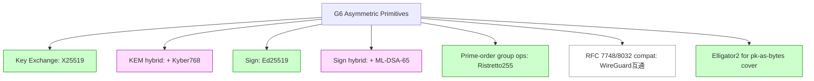

# 課堂 3.5 — 公鑰密碼學二：橢圓曲線 — 從 ECDLP 到 X25519 / Ed25519

## 學前知道

- **前置課**：[3.1 密碼學的目標分類學](./3.1-crypto-goals-taxonomy.md)、[3.4 RSA](./3.4-rsa.md)
- **預計閱讀時間**：120 分鐘
- **必讀論文 / 規格**：
  - Miller, *Use of Elliptic Curves in Cryptography*, CRYPTO 1985
  - Koblitz, *Elliptic Curve Cryptosystems*, Math. Comp. 1987
  - Bernstein, *Curve25519: new Diffie-Hellman speed records*, PKC 2006
  - Bernstein, Duif, Lange, Schwabe, Yang, *High-speed high-security signatures*, CHES 2011 / JCEN 2012 (Ed25519)
  - Bernstein, Lange, *SafeCurves: choosing safe curves for elliptic-curve cryptography*, 2014+ (running document)
  - Hamburg, *Decaf: Eliminating cofactors through point compression*, CRYPTO 2015 (Ristretto 前身)
  - de Valence, Grigg, Hamburg, Hopwood, Lovecruft, Tankersley, *The Ristretto255 and Decaf448 Groups*, draft-irtf-cfrg-ristretto255-decaf448 (2024)
  - RFC 7748 — *Elliptic Curves for Security* (X25519 / X448)
  - RFC 8032 — *Edwards-Curve Digital Signature Algorithm (EdDSA)*
  - NIST FIPS 186-5 (2023) — *Digital Signature Standard (DSS)*
- **必讀原始碼**：
  - `curve25519-dalek/src/edwards.rs`（Rust 純實作參考）
  - `boringssl/crypto/curve25519/curve25519.c`
  - `wireguard-go/curve25519/curve25519.go`
  - libsodium `crypto_scalarmult_curve25519`

> RSA 主導 1978-2005；ECC 是 1985-2005 開發、2005-2015 普及、2015+ 主導。本堂處理：橢圓曲線群結構、Curve25519 為何設計成那樣、Ed25519 簽章的 deterministic + sUF 性質、Ristretto255 解決 cofactor 問題、SafeCurves 評估準則。**G6 的 X25519 + Ed25519 全部從此堂出發**。

---

## 動機：為什麼 ECC 完勝 RSA

| Property | RSA-2048 | ECC P-256 / Curve25519 |
|---|---|---|
| 128-bit classical security 所需 key size | 2048-bit | 256-bit |
| Public key on wire | 256 byte | 32 byte (Curve25519) |
| Signature size | 256 byte | 64 byte (Ed25519) |
| Sign speed | slow (^d mod n) | fast (scalar mul) |
| Verify speed | fast | fast |
| Constant-time impl 難度 | 容易出錯（CRT, RSA blinding） | Curve25519 設計上強制 |
| Patent / IP | clean | Curve25519 clean (Bernstein 個人發布) |
| Quantum resistance | 0 (Shor) | 0 (Shor) — same |

**結論**：在 pre-PQ 時代 ECC 完勝；PQ 時代兩者一起死，需 hybrid。

WireGuard 設計者 Donenfeld 直接寫：「Curve25519 is one of the most beautiful pieces of cryptography I've ever seen. It's fast, simple, and you almost can't misuse it.」這就是 G6 也要走 Curve25519/Ed25519 的核心理由。

---

## 核心概念

### 1. 群論最小必要包

**Abelian group (G, +)** 滿足：
- closure: a + b ∈ G
- associativity: (a + b) + c = a + (b + c)
- identity 0: a + 0 = a
- inverse: ∀ a, ∃ -a s.t. a + (-a) = 0
- commutativity: a + b = b + a

**Scalar multiplication**: n · P = P + P + ... + P (n 次)。

**Discrete Logarithm Problem (DLP) in G**：給 P, Q ∈ G, 找 n s.t. Q = n · P。

**Subgroup**：G 的子集封閉於 +。**Lagrange's theorem**: |subgroup| 整除 |G|。

**Cyclic group**：存在 generator g s.t. G = {0, g, 2g, ..., (|G|-1)g}。

**Order of element**：smallest n > 0 s.t. n · P = 0。整除 group order。

### 2. 橢圓曲線基礎

**Weierstrass form** (over field F_p, p > 3 prime)：
```text
E: y² = x³ + a·x + b   (mod p),   with 4a³ + 27b² ≠ 0 (non-singular)
```

**Group law** (geometric)：
- 點 P, Q 在曲線上。
- 過 P, Q 畫直線；與曲線第三個交點 R'。
- P + Q 定義為 R = R' 對 x 軸 reflection。
- Identity = "point at infinity" O。
- -P = P 對 x 軸 reflection。

**代數公式 (P + Q for P ≠ ±Q)**：
```text
λ = (y_2 - y_1) / (x_2 - x_1)
x_3 = λ² - x_1 - x_2
y_3 = λ(x_1 - x_3) - y_1
```

**Doubling P + P**：
```text
λ = (3x_1² + a) / (2y_1)
x_3 = λ² - 2x_1
y_3 = λ(x_1 - x_3) - y_1
```

**ECDLP**：given P, Q = nP, find n。**已知最佳 algorithm**: Pollard's rho，複雜度 O(√|G|)。**256-bit curve order ⇒ 128-bit security**。

### 3. Edwards curves（Curve25519 / Ed25519 的形式）

**Twisted Edwards form** (Bernstein-Birkner-Joye-Lange-Peters 2008):
```text
E: a·x² + y² = 1 + d·x²·y²   (mod p)
```

**Edwards addition (unified, complete)**: 同一公式對 P + Q 與 P + P 都 work；**沒有 special case**：
```text
(x_3, y_3) = ((x_1 y_2 + x_2 y_1)/(1 + d x_1 x_2 y_1 y_2),
              (y_1 y_2 - a x_1 x_2)/(1 - d x_1 x_2 y_1 y_2))
```

**為什麼 unified 重要**：
- Constant-time impl：對 P + Q vs P + P 用同代碼，無 secret-dependent branch。
- Side-channel safe：對手無法從 timing 知道 doubling 還是addition。

Weierstrass 形式必須處理 P + (-P), P + P, P + Q 不同 case → 容易 timing leak。Edwards form 是 modern ECC implementation 的標準。

### 4. Curve25519 (Bernstein 2006)

**規格**：
```text
field: F_p, p = 2^255 - 19   (prime, Mersenne-like for fast reduction)
curve: y² = x³ + 486662 x² + x   (Montgomery form)
       (equivalent to twisted Edwards form via birational map)
base point: x = 9, y = ...
order: 2^252 + 27742317777372353535851937790883648493
```

**設計 rationale**:

1. **2^255 - 19** prime 結構：
   - 接近 2^255，給 255-bit work + 128-bit security。
   - p - 1 = 2 × (奇)，所以 (F_p)* 沒有 small-order element problem。
   - 2^255 - 19 是 Mersenne-like，modular reduction 可用 shift + add 完成（fast in software）。

2. **Montgomery ladder** for scalar multiplication：
   ```text
   Montgomery ladder for n·P:
       R_0 = O; R_1 = P
       For i = msb..lsb of n:
           if n_i == 0: R_1 = R_0 + R_1; R_0 = 2·R_0
           else:        R_0 = R_0 + R_1; R_1 = 2·R_1
       return R_0
   ```
   - 每 iteration 一個 add + 一個 double，**operation count 不依賴 n 的 bit**。
   - 加上 x-only arithmetic（只算 x coordinate）→ 進一步加速。

3. **Cofactor 8**：曲線 group order 是 8·ℓ where ℓ is large prime。所以實際 secure subgroup 是 ℓ-size，cofactor 8 是「無用」points。X25519 protocol 用 **clamping** (clear low 3 bits of scalar) 確保 result 在 prime subgroup 內 — 巧妙避開 cofactor 問題。

4. **No special points**：曲線上任何 32-byte 都是 valid public key（after clamping）。不需要 point validation step → 簡化 implementation + 避免 invalid curve attack。

### 5. X25519 (RFC 7748)

```text
X25519(scalar, point) = scalar_mult(scalar, point)
    Inputs: 32-byte scalar k, 32-byte u-coordinate of point
    
    1. Clamp k:
       k[0]  &= 248          // clear low 3 bits
       k[31] &= 127          // clear high bit
       k[31] |= 64           // set bit 254
    2. Run Montgomery ladder.
    3. Output 32-byte u-coordinate of k·P.
```

**DH 用法**:
```text
Alice:                              Bob:
sk_A ← random 32 bytes              sk_B ← random 32 bytes
pk_A = X25519(sk_A, 9)              pk_B = X25519(sk_B, 9)
                ←─ pk_B / pk_A ─→
shared = X25519(sk_A, pk_B)         shared = X25519(sk_B, pk_A)
                       (= X25519(sk_A·sk_B, 9))
```

**Clamping 的精妙**：
- Clear low 3 bits → scalar 必是 8 的倍數 → eliminate cofactor。
- Set bit 254 → scalar ≥ 2^254 → Montgomery ladder 固定 iteration 數（255 steps）。
- Clear high bit → scalar < 2^255 → 確保 in scalar field。

**為什麼這設計安全**：
- No invalid curve attack (twist security): twist of curve25519 has order 2 · ℓ'_t where ℓ'_t large prime; clamping prevents adversary from forcing small-subgroup attack via crafted "public key"。
- No small-subgroup attack (cofactor cleared)。
- Side-channel safe (Montgomery ladder constant-time)。

### 6. Ed25519 簽章 (Bernstein 等 2011)

**Edwards form of Curve25519** (called edwards25519):
```text
-x² + y² = 1 + (-121665/121666) x² y²   (mod 2^255 - 19)
```

**Ed25519 spec** (deterministic, hash-based):
```text
KGen:
    sk ← 32 random bytes
    h = SHA-512(sk)
    s = clamp(h[0:32])        // scalar
    prefix = h[32:64]
    A = s · B                 // base point times s
    pk = encode(A)            // 32 byte

Sign(sk, message M):
    h = SHA-512(sk)
    s, prefix = clamp(h[0:32]), h[32:64]
    A = encode(s · B)
    r = SHA-512(prefix ‖ M) mod ℓ        // deterministic nonce!
    R = r · B
    k = SHA-512(encode(R) ‖ A ‖ M) mod ℓ
    S = (r + k · s) mod ℓ
    σ = encode(R) ‖ S                    // 64 byte signature

Verify(pk, M, σ):
    R, S = parse σ
    A = decode(pk)
    k = SHA-512(encode(R) ‖ encode(A) ‖ M) mod ℓ
    check S · B == R + k · A
```

**設計鮮明特點**：

1. **Deterministic nonce (r)**：r = H(prefix ‖ M) mod ℓ，**不依賴外部 RNG**。
   - ECDSA 的災難：PS3 (2010)、Sony BMG、Android Bitcoin wallet 2013 都因 nonce reuse / biased RNG 全 key 洩。
   - Ed25519 從根本避免此問題。

2. **sUF-CMA (strong unforgeability)**: 同 (M, σ) 對唯一 valid signature，不存在 malleability。**G6 用此**。
   - ECDSA 對應 (r, s) 與 (r, -s mod n) 都 valid → malleability → 比特幣 BIP-66 enforce low-s 修補。

3. **64-byte signature, 32-byte pk**：vs RSA-2048 256-byte / 256-byte 八倍 size 節省。

4. **Verify 速度 ~70k cycles** (Skylake)：比 RSA verify (~100k) 略慢但同量級；sign ~80k cycles，比 RSA sign (~3M cycles) 快 30+ 倍。

5. **Batch verification**: 多 signatures 同時 verify 比 single 快 ~2-3×（exploiting linearity）。

### 7. Ristretto255 / Decaf448

**問題**：Ed25519 的 cofactor 8 在 protocol 層仍可造成問題。例如：
- 兩 PK 對應同一 abstract group element（multiply by cofactor element）→ identity confusion。
- Public key validity check 容易出錯 → small-subgroup attack。
- 多個「不同 byte 表示」對應同一邏輯點 → malleability。

**Ristretto255 (Hamburg 2015 Decaf 後續)**：在 Edwards25519 上構造 **quotient group** Ristretto255 = Edwards25519 / cofactor。
- prime-order group（order ℓ ≈ 2^252）。
- Canonical encoding：每 group element 對應唯一 32-byte。
- Decode 時 reject 任何非 canonical bytes → 強制 single encoding。
- Same DLP security as Curve25519 (128-bit)。

**對 G6**：
- Key exchange 用 X25519（與 WireGuard 互通）。
- Identity-binding signature 用 Ed25519（cofactor 不問題因 hash 處理）。
- **複雜 group protocol（PAKE, ZK proofs）用 Ristretto255** — 避免 cofactor 陷阱。Part 3.9 / 3.10 會用到。

### 8. SafeCurves: 評估 curve 的標準（Bernstein-Lange 2014）

SafeCurves (https://safecurves.cr.yp.to) 給 ECC 曲線九個評估 criteria：

| Criterion | NIST P-256 | Curve25519 | secp256k1 (Bitcoin) |
|---|---|---|---|
| ECDLP security ≥ 100 bits | ✅ | ✅ | ✅ |
| Twist security ≥ 100 bits | ❌ ~80 | ✅ | ⚠️ ~94 |
| CM discriminant > 100 bits | ❌ | ✅ | ❌ |
| Rigid curve gen (no magic constants) | ❌ NSA | ✅ Bernstein public | ⚠️ |
| Complete addition formulae | ❌ | ✅ | ❌ |
| Indistinguishable from random byte | ❌ | ✅ (after Elligator) | ❌ |
| Ladder | ❌ | ✅ Montgomery | ❌ |

**結論**：Curve25519 在 SafeCurves 表現幾乎 perfect。NIST P-curves 有多項問題（雖然不一定可 exploit，但 "robust" 不夠）。**G6 選 Curve25519**。

### 9. ECDLP 攻擊現況

```mermaid
flowchart TD
    ECDLP[ECDLP Adversary]
    ECDLP --> Generic[Generic algorithms]
    Generic --> Rho[Pollard's rho O(√n)]
    Generic --> Kang[Pollard kangaroo]

    ECDLP --> Special[Special-curve attacks]
    Special --> Smart[Smart 1999: anomalous curves]
    Special --> Weil[Weil/Tate pairing → embedding]
    Special --> CMC[CM discriminant attacks]

    ECDLP --> SideChan[Side-channel]
    SideChan --> Cache[Cache-timing on scalar mul]
    SideChan --> Fault[Fault injection]
    SideChan --> Bias[RNG bias on nonce (ECDSA only)]

    ECDLP --> Quantum[Quantum]
    Quantum --> Shor[Shor: polynomial-time]
```

**Curve25519 對 Pollard rho 是 ~2^126 operations**，遠超實務。Quantum Shor 是真實威脅；故 G6 必須 PQ-hybrid。

### 10. ECC 軟體效能

| 操作 | Curve25519 (Skylake, no SIMD) | Curve25519 (AVX-512) | RSA-2048 |
|---|---|---|---|
| X25519 scalar mul | ~120k cycles | ~85k cycles | RSA-Decrypt ~3M cycles |
| Ed25519 sign | ~80k cycles | ~55k cycles | RSA-Sign ~3M cycles |
| Ed25519 verify | ~210k cycles | ~140k cycles | RSA-Verify ~80k cycles |

實務 throughput：單 core 可 sign ~50,000 messages/sec Ed25519 vs ~1500/sec RSA-2048。

---

## 與我們協議設計的關聯

| 設計問題 | 答案 |
|---|---|
| G6 key exchange | X25519 (RFC 7748)，PSK 模式可選 |
| G6 signature | Ed25519 (RFC 8032) + ML-DSA-65 (PQ hybrid) |
| G6 transcript hash | SHA-256 (TLS 1.3 同款) |
| Internal group ops (PAKE / cover-traffic) | Ristretto255 |
| Curve selection criteria | SafeCurves all green |
| Public key validity check | 不需要（X25519 設計上每 32-byte 都 valid） |
| Implementation library | curve25519-dalek (Rust) / libsodium (C) |
| Nonce in signature | deterministic (EdDSA spec, 避免 ECDSA-style RNG-bias 災難) |

---

## 動手：用 Rust dalek 做完整 X25519 + Ed25519 + Ristretto255 流程

```rust
use ed25519_dalek::{SigningKey, Signature, Signer, Verifier};
use x25519_dalek::{EphemeralSecret, PublicKey};
use curve25519_dalek::ristretto::RistrettoPoint;
use rand_core::OsRng;

// 1. X25519 ECDH
let alice_secret = EphemeralSecret::random_from_rng(OsRng);
let alice_public = PublicKey::from(&alice_secret);
let bob_secret = EphemeralSecret::random_from_rng(OsRng);
let bob_public = PublicKey::from(&bob_secret);

let alice_shared = alice_secret.diffie_hellman(&bob_public);
let bob_shared = bob_secret.diffie_hellman(&alice_public);
assert_eq!(alice_shared.as_bytes(), bob_shared.as_bytes());

// 2. Ed25519 signature
let mut sk = SigningKey::generate(&mut OsRng);
let msg = b"G6 handshake transcript hash bytes";
let sig: Signature = sk.sign(msg);
sk.verifying_key().verify(msg, &sig).unwrap();

// 3. Ristretto255 prime-order group
let scalar = curve25519_dalek::scalar::Scalar::from_bytes_mod_order([42u8; 32]);
let point = RistrettoPoint::mul_base(&scalar);
let compressed = point.compress();
let decompressed = compressed.decompress().unwrap();
assert_eq!(point, decompressed);
```

---

## 自我檢查

1. 證明：Montgomery ladder 為什麼 constant-time？每個 iteration 計算什麼是恆定的？
2. Curve25519 為什麼選 prime 2^255 - 19？2^255 - 1 (Mersenne) 為什麼不行？
3. Clamping 對 X25519 的三個 bit 操作各自防什麼攻擊？
4. ECDSA 一次 nonce reuse → 全 sk 洩；EdDSA 為什麼免疫？解釋 hash-based deterministic nonce。
5. 為什麼 Ed25519 是 sUF-CMA 而 ECDSA 不是？signature malleability 在 Bitcoin / G6 各自什麼影響？
6. Cofactor 8 在 Edwards25519 為何存在？X25519 怎麼處理？Ristretto255 怎麼處理？
7. SafeCurves 對 P-256 critique 主要是哪些？這些 critique 對 G6 是否 deal-breaker？

---

## 延伸閱讀

- Hankerson, Menezes, Vanstone *Guide to Elliptic Curve Cryptography* (Springer 2004) — 經典教科書。
- Galbraith *Mathematics of Public Key Cryptography* (Cambridge 2012) — graduate-level ECC。
- Costello *Pairings for beginners* — pairing-based ECC（將來 ZK 用）。
- Aumasson *Serious Cryptography* Chapter 9 — modern ECC intro。
- Bernstein, Lange *SafeCurves* (running document, 2014+) — choice criteria。

---

## 研究級補遺

### 1. 學界詞彙

- **Affine / Projective / Jacobian coordinates**：Edwards form 與 Weierstrass form 各有 projective representation 避免 inversion。
- **Birational map**：Curve25519 (Montgomery) ↔ edwards25519 (Edwards) ↔ same DLP。
- **Twist of curve**：把曲線 a, b coefficient 變號得 twist；twist security 必須 ≥ 100-bit 防 invalid-curve attack。
- **Cofactor**：group order = ℓ · h，h 是 cofactor；prime-order subgroup ℓ 是 secure part；Ristretto255 quotient out cofactor。
- **MOV / Frey-Rück attack**：通過 Weil/Tate pairing 把 ECDLP 嵌入 finite field DLP（quadratic in embedding degree）；現代曲線設計確保 embedding degree large。
- **Smart attack** (1999): anomalous curve (#E(F_p) = p) ECDLP polynomial-time solvable。
- **MOV reduction degree** = embedding degree k；secure if k ≥ 6 typically。
- **Edwards-Bernstein-Yang (EBY) addition law**：unified, complete formula。
- **xz-only / x-only arithmetic**：Montgomery ladder 用 x coordinate only。
- **Elligator** (Bernstein-Hamburg-Krasnova-Lange 2013)：map random bytes ↔ curve point indistinguishably。G6 cover-traffic 用此把 ephemeral pk 偽裝成 random bytes。

### 2. 對手分類學

```mermaid
flowchart TD
    ECC_A[ECC Adversary]
    ECC_A --> Math[Math attacks]
    Math --> Rho[Pollard's rho O(√n)]
    Math --> Smart[Smart anomalous]
    Math --> MOV[MOV pairing]
    Math --> InvalidCurve[Invalid curve / twist]
    Math --> SmallSubgroup[Small subgroup]

    ECC_A --> Impl[Implementation]
    Impl --> Timing[Scalar mul timing]
    Impl --> Cache[Cache-timing]
    Impl --> Power[Power analysis]
    Impl --> Bias_ECDSA[ECDSA nonce bias / reuse]
    Impl --> Fault[Fault on scalar mul]

    ECC_A --> Protocol[Protocol-level]
    Protocol --> Mal[Signature malleability]
    Protocol --> UKS[Unknown key share]
    Protocol --> Skew[Cofactor-induced skew]

    ECC_A --> Quantum[Shor on ECDLP]
```

### 3. 形式化定義

**ECDLP Game**：
```text
Game ECDLP(A, E, P, n):
    x ← uniform in [0, n-1]
    Q = x·P
    x' ← A(E, P, n, Q)
    return [x' == x]
```

**ECDH Game (CDH version)**：
```text
Game ECDH(A):
    a, b ← random
    A_pub = a·P; B_pub = b·P
    Z = A(E, P, A_pub, B_pub)
    return [Z == abP]
```

**ECDH Decision Game (DDH)**:
```text
Game ECDDH(A):
    a, b, c ← random
    b' ← {0, 1}
    if b' == 0: Z = abP else: Z = cP
    return [A(A_pub, B_pub, Z) == b']
```

DDH 嚴格強於 CDH。Curve25519 不是 DDH-secure（因 cofactor 8）→ 必須 derive shared secret through KDF (HKDF) 抹平。

### 4. 關鍵論文

1. **Miller 1985** — ECC first proposal。
2. **Koblitz 1987** — independent ECC proposal。
3. **Bernstein 2006 Curve25519**。
4. **Bernstein 等 2011 Ed25519**。
5. **Bernstein-Lange 2014+ SafeCurves**。
6. **Bernstein-Birkner-Joye-Lange-Peters 2008** — Twisted Edwards curves。
7. **Hamburg 2015 Decaf** — quotient group cofactor elimination。
8. **de Valence 等 Ristretto255 draft** — ratified version of Decaf concept。
9. **Smart 1999** — anomalous curves。
10. **Bernstein-Hamburg-Krasnova-Lange 2013 Elligator** — point ↔ random bytes。
11. **Brier-Joye 2002** — Montgomery ladder formalization。
12. **Bos, Halderman, Heninger, Moore, Naehrig, Wustrow 2014** — *Elliptic Curve Cryptography in Practice* — analyzes real ECDSA implementation bugs。

### 5. G6 座標



### 6. 必追資源

- **safecurves.cr.yp.to** — curve evaluation 持續更新。
- **ietf.org/wg/cfrg** — IETF CFRG ECC 標準討論。
- **dalek-cryptography** GitHub — Rust ECC reference impl。
- **eprint.iacr.org/search?q=elliptic+curve** — 持續 cryptanalysis 工作。
- **Real World Crypto (RWC) 每年議程** — ECC deployment 經驗分享。

### 7. 開放問題

- **Curve from random NUMS seed**：是否能 derive curve from publicly verifiable random source 與 Bernstein 的 deterministic process 相比？仍 active。
- **Post-quantum group action**：CSIDH (Castryck 等 2018) 是 isogeny-based group action，PQ 候選；但 SIDH 2022 被 Castryck-Decru 攻擊；CSIDH 仍 active。
- **Ristretto over post-quantum group**：lattice-based prime-order group structure 仍 open。
- **Side-channel-free Ed25519 batch verify**：active research。

---

> **下一堂預告**：3.6 金鑰交換協議 — DH, ECDH, X25519 deployment, MQV, HMQV, Triple-DH, OPTLS；為什麼 Just-DH 不夠，必須 SIGMA-I 結構。
