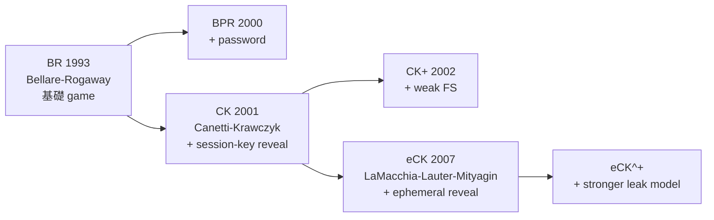
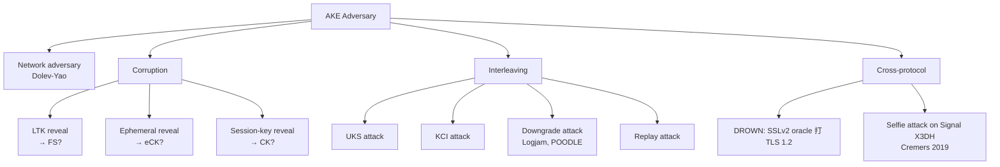
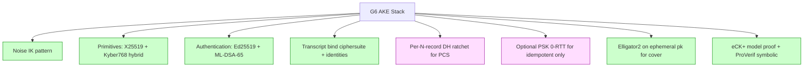

# 課堂 3.6 — 金鑰交換協議：從 DH 到 HMQV 到 SIGMA 到 X3DH

## 學前知道

- **前置課**：[3.1 密碼學的目標分類學](./3.1-crypto-goals-taxonomy.md)、[3.5 ECC](./3.5-elliptic-curves.md)
- **預計閱讀時間**：120 分鐘
- **必讀論文 / 規格**：
  - Diffie-Hellman, *New Directions in Cryptography*, IEEE TIT 1976
  - Krawczyk, *SIGMA: the SIGn-and-MAc Approach to Authenticated Diffie-Hellman*, CRYPTO 2003
  - Krawczyk, *HMQV: A High-Performance Secure Diffie-Hellman Protocol*, CRYPTO 2005
  - Canetti, Krawczyk, *Analysis of Key-Exchange Protocols and Their Use for Building Secure Channels*, EUROCRYPT 2001 (CK model)
  - LaMacchia, Lauter, Mityagin, *Stronger Security of Authenticated Key Exchange*, ProvSec 2007 (eCK model)
  - Krawczyk, Wee, *The OPTLS Protocol and TLS 1.3*, EuroS&P 2016
  - Marlinspike, Perrin, *The X3DH Key Agreement Protocol*, Signal whitepaper 2016
  - Cohn-Gordon, Cremers, Dowling, Garratt, Stebila, *A Formal Security Analysis of the Signal Messaging Protocol*, EuroS&P 2017
  - Adrian 等, *Imperfect Forward Secrecy: How Diffie-Hellman Fails in Practice* (Logjam), CCS 2015
- **必讀原始碼**：
  - `wireguard-go/device/noise-protocol.go`（Noise IK 實作）
  - boringssl `ssl/handshake_client.cc`（TLS 1.3 client KE）
  - signal-protocol/libsignal `protocol/src/state/session_record.rs`（X3DH + Double Ratchet）

> 3.1 已交代 SIGMA / KCI / UKS / FS / PCS 概念。本堂處理具體 protocol design：DH 怎麼從 1976 純 KEX 演化到 2026 modern AKE；為什麼 SIGMA 結構成為 TLS 1.3 / IPsec / Noise / WireGuard / Signal 共同骨架；G6 握手要選哪個。

---

## 動機：從 KEX 到 AKE 的演化是 50 年血淚史

DH 1976 給的純 KEX 沒有認證——MitM 立即可破。下面是 1976-2024 的修補史：

```mermaid
flowchart TD
    DH[DH 1976<br/>Just-DH<br/>no auth, MitM trivial]
    DH --> STS[STS 1992<br/>Diffie-Oorschot-Wiener<br/>add Sign(transcript)<br/>UKS bug found later]
    STS --> SKEME[SKEME 1996<br/>Krawczyk<br/>+ KCI resistance]
    SKEME --> SIGMA[SIGMA 2003<br/>Krawczyk<br/>Sign DH share + MAC identity]
    SIGMA --> SIGMAI[SIGMA-I<br/>+ identity protection]

    DH --> MQV[MQV 1995<br/>Menezes-Qu-Vanstone<br/>no signature, implicit auth via combined DH]
    MQV --> HMQV[HMQV 2005<br/>Krawczyk<br/>+ formal proof in CK model]

    DH --> 3DH[Triple DH<br/>OpenWhisperSystems 2013]
    3DH --> X3DH[X3DH 2016<br/>Signal<br/>+ one-time prekey for async]

    SIGMA --> TLS13[TLS 1.3 RFC 8446<br/>2018]
    SIGMA --> IKE[IKEv2 RFC 7296]
    SIGMA --> Noise[Noise Framework<br/>Perrin 2018]
    Noise --> WG[WireGuard<br/>Donenfeld 2017]
    Noise --> Ours[G6<br/>(我們的協議)]:::ours

    X3DH --> Signal_DR[Signal Double Ratchet<br/>2014]
    Signal_DR --> Ours

    classDef ours fill:#fde,stroke:#c39,stroke-width:2px
```

G6 站在兩條傳統交匯：SIGMA-I 結構（TLS 1.3 / Noise IK）+ X3DH/Double Ratchet 思想（PCS via per-message ratchet）。

---

## 核心概念

### 1. AKE 安全 model 階梯



| Model | 對手可洩什麼 | 強度 |
|---|---|---|
| BR | LTK after challenge | 弱 |
| CK | LTK + 部分 session keys | 中 |
| CK+ | + weak FS (LTK 在 challenge 之後 reveal) | 中強 |
| eCK | + ephemeral state (DH 私鑰) | 強 |
| eCK+ | + adaptive corruption | 最強 |

**G6 要在哪個 model 下證明？** Spec 寫 eCK + KCI-resistance + PCS。對應 SIGMA + ratchet 結構。

### 2. Just-DH (1976) 為什麼不夠

```text
A → B: g^a
B → A: g^b
shared K = g^ab
```

問題：
- **MitM trivial**: 對手 M 在中間，跟 A 換 g^a/g^m_A, 跟 B 換 g^b/g^m_B；A 跟 M 算 K_AM, M 跟 B 算 K_BM；A 與 B 各自以為跟對方 talk 但實際雙方都跟 M talk。
- **No identity**: 雙方不知對方是誰。

**修補方向**：
- **Authenticated DH**: 加 long-term 認證材料 (cert / signature / PSK)。
- **Implicitly Authenticated**: MQV-style 將 long-term key 與 ephemeral key 結合在 DH compute。
- **Externally Authenticated**: out-of-band 認證 (fingerprint, SAS)。

### 3. SIGMA-I：TLS 1.3 / Noise IK / G6 共同骨架

(已在 3.1 詳述，這裡聚焦 protocol-level 細節)

**SIGMA-I 三輪握手**（簡化）:
```text
Round 1 (A → B):  g^x ‖ (optional ID_A?)
Round 2 (B → A):  g^y ‖ ENC_K0( ID_B ‖ Sign_B(g^x, g^y) ‖ MAC_K1(ID_B) )
Round 3 (A → B):  ENC_K0( ID_A ‖ Sign_A(g^y, g^x) ‖ MAC_K1(ID_A) )

K0, K1, K_session = KDF(g^xy, distinct labels)
```

**TLS 1.3 對應**:
- Round 1 = ClientHello (KeyShare extension)
- Round 2 = ServerHello + Encrypted{Certificate, CertificateVerify, Finished}
- Round 3 = client's Encrypted{Certificate?, CertificateVerify?, Finished}

注意 TLS 1.3 server 可在 Round 2 直接送 application data (0-RTT response)。

### 4. HMQV：implicit authentication (Krawczyk 2005)

**MQV (Menezes-Qu-Vanstone 1995)** 沒有 signature，用 LTK + ephemeral 結合算 shared secret:

```text
A: 長期 sk_A = a; 公鑰 A = aG.   Ephemeral: x; X = xG.
B: 長期 sk_B = b; 公鑰 B = bG.   Ephemeral: y; Y = yG.

shared = (x + h(X)·a)(y + h(Y)·b) · G
       = (X + h(X)·A) · (Y + h(Y)·B)' s scalar combine
```

優點：no signature → 短 + 快；attacker without (a 或 b) cannot derive shared。
缺點：early MQV 缺乏 formal proof in modern AKE model；UKS-vulnerable in original spec。

**HMQV (Krawczyk 2005)**：加 hash 使 implicit auth 在 CK model 下 provably secure。
- 形式化證明 KCI + UKS resistant + Wpfs。
- 部分採用：Microsoft EFS、UEFI 一些 implementation。
- 沒成主流因 patent 顧慮 + SIGMA 結構更易組合。

**G6 不選 HMQV**：選 SIGMA-I (Ed25519 signature) 更符合 modern industry default。

### 5. X3DH (Signal 2016) — Asynchronous AKE

**問題**：Signal-style messaging 是 asynchronous——Bob 不在線時 Alice 仍想送加密訊息。Synchronous DH (TLS 1.3) 要求雙方同時在線，不適用。

**X3DH 核心 idea**：Bob 預先發布**多個** DH public keys (一個 long-term IK + signed pre-keys SPK + one-time prekeys OPK)；Alice 對其中 4 個做 DH 然後 combine。

```text
Bob 預先發布 (到 Signal server):
    IK_B      (long-term identity key)
    SPK_B     (signed pre-key, 1-week rotation)
    Sig_IK_B(SPK_B)    (proves SPK belongs to IK)
    [OPK_B_1, OPK_B_2, ...]    (one-time pre-keys, consumed once each)

Alice 發訊息 to Bob:
    Fetch (IK_B, SPK_B, Sig, OPK_B_j) from server
    Verify Sig_IK_B(SPK_B)
    
    Generate ephemeral EK_A
    
    DH1 = DH(IK_A, SPK_B)         // long-term ↔ signed prekey
    DH2 = DH(EK_A, IK_B)          // ephemeral ↔ long-term
    DH3 = DH(EK_A, SPK_B)         // ephemeral ↔ signed prekey
    DH4 = DH(EK_A, OPK_B_j)       // ephemeral ↔ one-time prekey
    
    SK = KDF(DH1 ‖ DH2 ‖ DH3 ‖ DH4)
    
    Send to Bob: IK_A, EK_A, OPK_index, AEAD(SK, message)
```

**為什麼 4 個 DH**：
- DH1 (long-long) — 認證雙方 identity。
- DH2 (eph-long Bob) — Alice 認證 Bob。
- DH3 (eph-eph-ish) — symmetric authentication via SPK。
- DH4 (eph-one-time) — **PCS 種子**（OPK 只用一次後丟，給後 ratchet 提供 randomness）。

**結合 Double Ratchet (詳見 [3.17 §3 Signal Double Ratchet 完整解剖](./3.17-advanced-frontiers.md))**：X3DH 給 initial shared secret，Double Ratchet 之後每 message 一個 fresh DH。

**G6 不直接用 X3DH**（G6 是 synchronous proxy 不是 messaging）但**借鑑兩件事**：
1. Multiple-DH combine → robust against single-key compromise。
2. One-time prekey 概念可用在 G6 的 "cover-traffic seed" 設計。

### 6. Noise IK Pattern（WireGuard 用）

```text
<- s                                          // server static pk pre-known to client
...
-> e, es, s, ss                               // client sends ephemeral, sees server
<- e, ee, se                                  // server sends ephemeral

Symbol convention:
    e, s = send ephemeral / static public key
    ee = DH(eph_us, eph_them)
    es = DH(eph_us, stat_them)
    se = DH(stat_us, eph_them)
    ss = DH(stat_us, stat_them)
```

每個 DH 用 MixKey(ck, dh_result) 更新 chaining key；transcript 用 MixHash(h, message) 更新 hash。最後 from ck 派生 send/recv keys。

**Noise IK 性質**：
- 1-RTT: only one round trip until both sides can send encrypted data。
- Identity protection for initiator (s is encrypted with es)。
- Identity protection for responder partial。
- FS via ephemeral keys。
- KCI-resistant。

**WireGuard 完全用 Noise IK + MAC1/MAC2 anti-DoS**。

**G6 採用 Noise IK 變體**：加上 PQ hybrid (Kyber768 KEM) 與 cover-traffic disguise。

### 7. Logjam 教訓 (Adrian 等 CCS 2015)

**漏洞**：TLS 1.0-1.2 允許 server 在 ServerKeyExchange 中送 fresh DH parameters (group + g + p)。Client 沒檢查這些 parameters 是否 secure → 接受 server 送的 weak group (e.g., 512-bit p, originally for EXPORT crypto)。

**Logjam attack**:
1. MitM 截 ClientHello → 改成只支援 DHE_EXPORT ciphersuite。
2. Server 接受並回 ServerKeyExchange with 512-bit p。
3. Pre-computed table (NFS on common 512-bit primes) → 解 DH。
4. MitM 完全掌控 session。

**真實影響**：8.4% Top 1M HTTPS sites vulnerable in 2015。

**修補**：
- TLS 1.3 廢 EXPORT ciphers + 強制 named groups (X25519, P-256, P-384, P-521, FFDHE2048+)。
- Client 必須拒絕 weak group parameters。
- 移除 1024-bit DH primes (NSA 可能 pre-compute)。

**G6 教訓**：
- **Hard-code curve**: G6 只允許 X25519 + (PQ-hybrid Kyber768)。No negotiable group。
- **Downgrade protection**: transcript hash 必含 ciphersuite list；任何 negotiation 結果 binding 到 transcript。

### 8. OPTLS (Krawczyk-Wee 2015) → TLS 1.3

OPTLS 是 TLS 1.3 設計的學術骨架。主要 contribution:
- **Static-Ephemeral DH for 0-RTT**: server 可預先發 long-term DH share；client 用 ephemeral with server's static → 0-RTT data (但 no FS for 0-RTT)。
- **Hybrid Mode**: full ephemeral-ephemeral DH after 0-RTT for FS。
- **形式化證明**: SIGMA-based + 0-RTT mode in CK model。

**TLS 1.3 (RFC 8446) 最終結構**:
- Mandatory 1-RTT mode = SIGMA-I derivative。
- Optional 0-RTT mode (PSK-based, not OPTLS static-DH)。
- Multi-key schedule (early_secret → handshake_secret → master_secret) via HKDF。

**G6 借鑑**:
- 1-RTT 主要 mode。
- Optional 0-RTT with PSK-only (limit to idempotent payload)。
- Multi-stage HKDF derive。

### 9. AKE Threat Surface Summary



**Selfie attack (Cremers 等 2019)**：對 Signal X3DH 的 attack——若 Alice 同時是 sender 與 recipient (multiple devices)，attacker 可讓 device 跟自己對話。修補：identifier binding 進 transcript。

**對 G6**：spec 必須處理 multi-device case + identifier binding。

---

## 與我們協議設計的關聯

| 設計問題 | 答案 |
|---|---|
| G6 握手結構 | Noise IK pattern (1-RTT) + SIGMA-I-style transcript binding |
| Authentication primitive | Ed25519 signature on transcript hash |
| Forward secrecy | Ephemeral X25519 per handshake |
| PCS | Per-N-record DH ratchet (Signal-inspired) |
| 0-RTT support | PSK-only mode (no static-DH 0-RTT due to replay concerns) |
| Downgrade protection | Hard-code ciphersuite; transcript binds full handshake messages |
| AKE model | eCK^+ with KCI + UKS resistance |
| Threat: Selfie / multi-device | Identifier binding in transcript |

---

## 動手：用 Noise framework 跑 IK handshake

```bash
# 用 noiseexplorer.com 互動式試 Noise IK pattern
# 或用 Rust noise-protocol crate:

[dependencies]
snow = "0.10"

# main.rs:
use snow::Builder;
let pattern = "Noise_IK_25519_ChaChaPoly_BLAKE2s".parse().unwrap();
let static_i = Builder::new(pattern.clone()).generate_keypair().unwrap();
let static_r = Builder::new(pattern.clone()).generate_keypair().unwrap();

let mut initiator = Builder::new(pattern.clone())
    .local_private_key(&static_i.private)
    .remote_public_key(&static_r.public)
    .build_initiator().unwrap();
let mut responder = Builder::new(pattern.clone())
    .local_private_key(&static_r.private)
    .build_responder().unwrap();

let mut buf = [0u8; 1024];
let mut buf2 = [0u8; 1024];
let len = initiator.write_message(&[], &mut buf).unwrap();
let len2 = responder.read_message(&buf[..len], &mut buf2).unwrap();
let len = responder.write_message(&[], &mut buf).unwrap();
let len2 = initiator.read_message(&buf[..len], &mut buf2).unwrap();
let mut t_init = initiator.into_transport_mode().unwrap();
let mut t_resp = responder.into_transport_mode().unwrap();
// ready to exchange encrypted data
```

---

## 自我檢查

1. 寫出 SIGMA-I 的精確訊息序列。為什麼 sign(g^x, g^y) 而不是 sign(transcript)？
2. KCI attack 的具體 scenario：A 的 LTK 洩給對手 M。M 能假冒 B 對 A 講話嗎？SIGMA-I 為什麼 resistance？
3. WireGuard 用 Noise IK 而非 IX 或 KK。為什麼選 IK？trade-offs 是什麼？
4. X3DH 的 4 個 DH 各扮什麼角色？少其中一個會失去什麼性質？
5. Logjam 的 root cause 是 cipher negotiation 不夠 secure。G6 如何 architectually 避免？
6. eCK model 與 CK model 差別？G6 證明選哪個？為什麼？
7. Signal X3DH 的 Selfie attack 怎麼發生？G6 multi-device 場景怎麼預防？

---

## 延伸閱讀

- Boyd, Mathuria, Stebila *Protocols for Authentication and Key Establishment* (Springer 2nd ed. 2020) — AKE 經典教科書。
- Perrin *Noise Protocol Framework* (revision 34, 2018) — Noise pattern 詳細 spec。
- Cohn-Gordon 等 *Formal Security Analysis of Signal* (EuroS&P 2017) — X3DH + Double Ratchet 完整證明。
- Bhargavan-Blanchet-Kobeissi *Verified Models and Reference Implementations for the TLS 1.3 Standard Candidate* (IEEE S&P 2017) — TLS 1.3 ProVerif 模型。

---

## 研究級補遺

### 1. 學界詞彙

- **AKE / IB-AKE / GAKE**: Authenticated Key Exchange / Identity-based / Group。
- **Implicit vs Explicit Authentication**: HMQV 是 implicit (no signature), SIGMA 是 explicit。
- **Test query / Reveal / Corrupt / Ephemeral oracle**：AKE model 的 oracle types。
- **Matching conversation** (Bellare-Rogaway 1993)：定義「同一 session」對於 AKE security。
- **Indistinguishability based AKE security**: session key 從 random 不可區分 → 強保證 (e.g., TLS 1.3 master_secret)。
- **Universally Composable (UC) AKE**: Canetti 2001 framework, ProvSec 標準。
- **Wpfs / Pfs**：weak / perfect forward secrecy。
- **Reveal queries**: SessionKey-reveal, EphemeralKey-reveal, LongTermKey-reveal。
- **Freshness predicate**：定義哪些 session 對對手仍 secure。

### 2. 形式化定義（eCK model 簡化）

```text
Adversary A has oracles:
    Send(P, sid, m)         // send message m to party P session sid
    Reveal(P, sid)          // reveal session key
    Corrupt(P)              // reveal long-term key
    EphemeralKeyReveal(P, sid)   // reveal ephemeral key
    Test(P, sid)            // get either real session key or random; A guesses bit b

eCK security:
    Adv^eCK_Π(A) = |Pr[A wins Test] - 1/2|
    
A session is fresh iff none of the following Reveal/Corrupt combinations:
    - Reveal(P, sid)  (cant reveal target session)
    - both Corrupt(P) and EphemeralKeyReveal(P, sid)  (cant know both)
    - similarly for partner
```

### 3. 關鍵論文

1. **Diffie-Hellman 1976**。
2. **Bellare-Rogaway 1993** *Entity Authentication and Key Distribution* — first AKE formal model。
3. **STS 1992** Diffie-Oorschot-Wiener。
4. **SKEME 1996** Krawczyk。
5. **MQV 1995, HMQV 2005**。
6. **Canetti-Krawczyk 2001** *Analysis of Key-Exchange Protocols* — CK model。
7. **LaMacchia-Lauter-Mityagin 2007** — eCK model。
8. **Krawczyk SIGMA 2003**。
9. **Krawczyk-Wee OPTLS 2015**。
10. **Marlinspike-Perrin X3DH 2016**。
11. **Cohn-Gordon 等 Signal analysis 2017**。
12. **Adrian 等 Logjam 2015**。
13. **Bhargavan-Leurent *Transcript Collision Attacks* (NDSS 2016)** — cross-protocol transcript binding attack。
14. **Brendel-Cremers-Jackson-Zhao 2021** — Ed25519 in AKE setting。
15. **Cremers 等 2019** *Selfie attack on Signal X3DH*。

### 4. G6 座標



### 5. 必追資源

- **Noise Explorer** noiseexplorer.com — interactive Noise pattern security analysis。
- **Tamarin Prover spec library** — TLS 1.3, Signal, 5G AKA 等 modeled protocols。
- **ProVerif spec library** — 同上 alternative tool。
- **IETF CFRG** — AKE 標準討論。
- **Real World Crypto talks** — 每年 KE 實踐分享。

### 6. 開放問題

- **Post-quantum AKE with FS + PCS + KCI 所有性質 hybrid**：當前 NIST PQ KEM (Kyber) 提供 FS 但 PCS 設計仍粗糙。
- **0-RTT 與 PCS / FS 的根本 tradeoff**：是否能設計 0-RTT data 同時享 FS？open。
- **AKE in lossy / GFW-adversarial network**：當對手可丟特定 packet 引發 protocol bug。
- **Formally verified production AKE implementations**：HACL\*, Project Everest 持續。

---

> **下一堂預告**：3.7 數位簽章 — ECDSA / EdDSA 細節差異、Schnorr / BLS aggregation、簽章與 CT (Certificate Transparency)。
