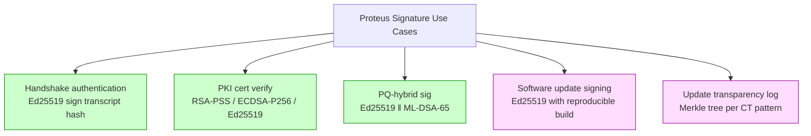
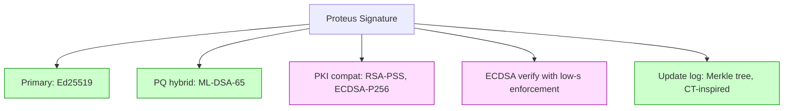

# 課堂 3.7 — 數位簽章：ECDSA / EdDSA / Schnorr / BLS / CT

## 學前知道

- **前置課**：[3.1](./3.1-crypto-goals-taxonomy.md)、[3.4](./3.4-rsa.md)、[3.5](./3.5-elliptic-curves.md)
- **預計閱讀時間**：90 分鐘
- **必讀論文 / 規格**：
  - Schnorr, *Efficient Signature Generation by Smart Cards*, J. Cryptology 1991（CRYPTO 1989 prelim）
  - ElGamal, *A Public Key Cryptosystem and a Signature Scheme Based on Discrete Logarithms*, IEEE TIT 1985
  - Bellare, Rogaway, *Random Oracles are Practical*, CCS 1993
  - Pointcheval, Stern, *Security Arguments for Digital Signatures and Blind Signatures*, J. Cryptology 2000（forking lemma）
  - NIST FIPS 186-5 (2023) — *Digital Signature Standard (DSS)*
  - Bernstein 等 Ed25519（已在 3.5）
  - Boneh, Lynn, Shacham, *Short Signatures from the Weil Pairing*, ASIACRYPT 2001（BLS）
  - Boneh, Drijvers, Neven, *Compact Multi-Signatures for Smaller Blockchains*, ASIACRYPT 2018（MuSig）
  - Laurie, *Certificate Transparency*, RFC 6962 (2013), RFC 9162 (2021)
  - Brendel, Cremers, Jackson, Zhao, *The Provable Security of Ed25519: Theory and Practice*, IEEE S&P 2021
- **必讀原始碼**：
  - `ed25519-dalek/src/signing.rs` (Ed25519 Rust ref)
  - bitcoin `src/secp256k1/src/ecdsa_impl.h`（ECDSA + low-s enforcement）

> 3.4 講 RSA signature；3.5 講 Ed25519 細節。本堂統合：簽章設計 design space + ECDSA 與 EdDSA 的精確比較 + Schnorr aggregation + BLS pairing-based + Certificate Transparency。Proteus 用 Ed25519，但 verify ECDSA / RSA cert 必須兼容。

---

## 動機：為什麼簽章不能 commodity 化

「我用 secp256r1 + SHA-256 簽就好」這句話會被學長打。差別大：
- **ECDSA**：nonce reuse → 全 sk 洩 (PS3 disaster)；malleability → Bitcoin BIP-66 修補。
- **EdDSA**：deterministic + sUF + canonical → 設計上比 ECDSA 更難誤用。
- **Schnorr**：tight reduction + native aggregation → 比特幣 Taproot 採用 (BIP-340)。
- **BLS**：pairing-based + signature aggregation + DKG-friendly → 區塊鏈共識用 (Ethereum 2.0)。

對 Proteus 必須：
1. **Sign side**: Ed25519 (主) + ML-DSA-65 (PQ hybrid)。
2. **Verify side**: Ed25519 + RSA-PSS + ECDSA-P256 (PKI 兼容)。
3. **Internal commitment / nonce / VRF**: 視場景挑 Schnorr 或 BLS。

---

## 核心概念

### 1. 簽章 design space

```mermaid
flowchart TD
    Sign[Digital Signature Schemes]
    
    Sign --> Hash[Hash-based]
    Hash --> Lamport[Lamport one-time]
    Hash --> Merkle[Merkle 1979 multi-tree]
    Hash --> SPHINCS[SPHINCS+ stateless]
    
    Sign --> DLP[DLP-based]
    DLP --> ElGamal[ElGamal 1985]
    DLP --> Schnorr_sig[Schnorr 1991]
    DLP --> DSA[DSA FIPS 186]
    DLP --> ECDSA_sig[ECDSA]
    DLP --> EdDSA[Ed25519/Ed448]
    
    Sign --> RSA_sig[RSA-based]
    RSA_sig --> RSA_textbook[Textbook RSA ❌]
    RSA_sig --> RSA_FDH[RSA-FDH]
    RSA_sig --> RSA_PSS[RSA-PSS]
    
    Sign --> Pairing[Pairing-based]
    Pairing --> BLS[BLS short]
    Pairing --> BB[Boneh-Boyen 2004]
    Pairing --> MuSig[MuSig/MuSig2 aggregation]
    
    Sign --> Lattice[Lattice-based<br/>PQ]
    Lattice --> Dilithium[CRYSTALS-Dilithium → ML-DSA]
    Lattice --> Falcon[Falcon → FN-DSA]
    
    Sign --> Code[Code-based<br/>PQ]
    Code --> Wave[Wave]
    
    Sign --> Iso[Isogeny-based<br/>PQ]
    Iso --> SQI[SQIsign 2024]
```



### 2. ECDSA 完整解剖 + 為什麼災難多

```text
ECDSA-Sign(sk, M):
    k ← random in [1, n-1]   // CRITICAL: must be fresh + uniform
    R = k · G
    r = R.x mod n              // if r=0, retry
    e = H(M)                   // hash, truncated to ⌈log₂n⌉ bits
    s = k^-1 · (e + r·sk) mod n
    if s = 0: retry
    return (r, s)

ECDSA-Verify(pk, M, (r,s)):
    e = H(M)
    u_1 = e · s^-1 mod n
    u_2 = r · s^-1 mod n
    R' = u_1·G + u_2·pk
    return R'.x == r mod n
```

**災難 #1: Nonce reuse**:
- 兩次簽 M_1, M_2 用同 k:
  ```
  s_1 = k^-1 (e_1 + r·sk)
  s_2 = k^-1 (e_2 + r·sk)
  ⇒ s_1 - s_2 = k^-1 (e_1 - e_2)
  ⇒ k = (e_1 - e_2) / (s_1 - s_2)
  ⇒ sk = (s_1 · k - e_1) / r
  ```
- **整個 sk 暴露**。

歷史災難：
- **Sony PS3 2010**：firmware 簽 update 用同一個 k → console hack。
- **Android Bitcoin wallet 2013**：SecureRandom bug 給 same k → 多人 wallet 被盜。
- **Cardano / Hyperledger 多次**。

**災難 #2: Nonce bias**:
- k 從 biased RNG → lattice attack 可從 ~256 簽章恢復 sk (Howgrave-Graham-Smart 2001)。
- **NetSec 2024 BLST C library bug**：產生 of-by-one bias → 私鑰可解。

**災難 #3: Malleability**:
- (r, s) valid ⇒ (r, -s mod n) 也 valid。
- 比特幣 transaction malleability attack → BIP-66 (2015) enforce `s ≤ n/2`。

**對 Proteus**：
- **不選 ECDSA** for own signature。
- **能 verify ECDSA** for PKI (含 low-s enforcement 防 malleability)。

### 3. EdDSA vs ECDSA：徹底對照

| 屬性 | ECDSA-P256 | Ed25519 |
|---|---|---|
| Nonce 來源 | external RNG | deterministic from sk + M |
| Nonce reuse 風險 | 全 sk 洩 | 不可能（deterministic） |
| Nonce bias 風險 | lattice attack 全 sk 洩 | 不可能（hash output uniform） |
| Malleability | (r, s)/(r, -s) both valid | canonical encoding 強制 |
| sUF-CMA | ✗ (default) | ✓ |
| Signature size | 64 byte | 64 byte |
| Sign speed | ~120k cycles | ~50k cycles |
| Verify speed | ~250k cycles | ~140k cycles |
| Batch verify support | 弱 | strong (2-3× speedup) |
| FIPS compliance | ✓ | ✓ (FIPS 186-5 2023) |
| Curve safety | NIST P-256 some issues | Curve25519 SafeCurves green |

**結論**：Ed25519 全方位優於 ECDSA-P256。唯一保留 ECDSA 理由是 PKI 兼容。

### 4. Schnorr Signature — 從 ID protocol 到簽章

**Schnorr Identification (1989)**:
```text
Setup: sk = x; pk = Y = x·G
Prover P, Verifier V:
    P: r ← random; R = r·G; send R
    V: c ← random challenge; send c
    P: s = r + c·x; send s
    V: check s·G == R + c·Y
```

**Fiat-Shamir Heuristic** (Fiat-Shamir 1986): 把 interactive identification 變 non-interactive signature by replacing challenge c with H(R ‖ M):

```text
Schnorr-Sign(sk = x, M):
    r ← random
    R = r·G
    c = H(R ‖ M)
    s = r + c·x  mod n
    return (R, s) or compressed (e ‖ s) with e = H(R ‖ M)

Schnorr-Verify(pk = Y, M, (R, s)):
    c = H(R ‖ M)
    check s·G == R + c·Y
```

**EdDSA = Schnorr with deterministic nonce + Edwards curve**：
- r = H(prefix_sk ‖ M) deterministically derived.
- Otherwise identical structure.

**Schnorr 在 modern protocols**:
- **Bitcoin BIP-340 (2021)** — Taproot 用 Schnorr 取代 ECDSA。
- **MuSig (Maxwell-Poelstra-Seurin-Wuille 2018)** — n-party Schnorr aggregation。
- **FROST (Komlo-Goldberg 2020)** — threshold Schnorr。

### 5. 簽章 aggregation

**問題**：BFT consensus / multi-sig wallet 需要 N 個簽章 → on-chain 體積 N×64 bytes。能不能壓成 1 個簽章？

**Schnorr Aggregation (MuSig)**:
```text
n parties, each sk_i, pk_i = sk_i · G
Aggregated pk = pk_1 + pk_2 + ... + pk_n (with hash-based key tweaks 防 rogue-key)
Each party signs with own sk_i + agreed nonce; aggregate s = s_1 + s_2 + ... + s_n
單一 (R, s) signature valid under aggregated pk
```

**BLS Aggregation**：BLS signature 天然支援 aggregation：
```text
BLS-Sign(sk, M):
    H = HashToCurve(M)
    σ = sk · H

BLS-Verify(pk, M, σ):
    e(σ, G_2) == e(H, pk)   // bilinear pairing check

Aggregate({(pk_i, σ_i, M_i)}):
    if all M_i == M:        // same message
        σ_agg = σ_1 + σ_2 + ... + σ_n
        verify: e(σ_agg, G_2) == e(H, pk_1 + ... + pk_n)
    else:                    // different messages
        verify: e(σ_agg, G_2) == ∏ e(H(M_i), pk_i)
```

**Ethereum 2.0** 用 BLS12-381 curve 做 validator signature aggregation：32k validators ⇒ 1 signature。

**Proteus 不直接用 aggregation**（單 client-server，不是 BFT）但 **borrowing for future group mode**。

### 6. Certificate Transparency (CT, Laurie 2013)

**問題**：Web PKI 信任 CA 不會 mis-issue cert。歷史上 DigiNotar 2011 災難（Iran 用 fake \*.google.com cert）證明 CA 會出事。需要：**所有 issued cert 必須 publicly logged**，CA 不能秘密發 cert。

**CT 設計**:
1. **Public append-only log**: 由獨立 operator 維護的 Merkle tree。每張 cert append 進 log。
2. **Signed Certificate Timestamp (SCT)**: log 對接受的 cert 回 SCT，CA 把 SCT 嵌進 cert 或 TLS handshake。
3. **Browser 強制**: 2018 Chrome 開始 reject 沒 SCT 的 cert。
4. **Monitors / Auditors**: 第三方持續 download log 並檢測異常。

**CT log 結構**：Merkle tree (RFC 6962 用 SHA-256-based hash tree)。
- Inclusion proof: 證明 cert 在 log 中 (~log_2(N) hashes)。
- Consistency proof: 證明 log 是 append-only (~log_2(N) hashes)。

**對 Proteus**：
- 不直接用 CT（Proteus 不是 cert-based PKI）。
- 但 Proteus 可以 borrow Merkle tree 結構做 **transparency log for protocol version updates**——讓 attacker 無法給特定 client 推 backdoor version。

### 7. 簽章在 Proteus 的角色



---

## 與我們協議設計的關聯

| 設計問題 | 答案 |
|---|---|
| Primary signature | Ed25519 (RFC 8032) |
| PQ-hybrid | + ML-DSA-65 (NIST FIPS 204) |
| PKI cert verify support | RSA-PSS-2048+ / ECDSA-P256 / Ed25519 |
| ECDSA verify | Enforce low-s normalization (防 malleability) |
| Transcript binding | sign hash of (full handshake message sequence including identities + ciphersuites) |
| Identity protection | Ed25519 pk encrypted in handshake (SIGMA-I) |
| Update transparency | Merkle tree log for spec version updates (CT-inspired) |

---

## 自我檢查

1. 寫出 ECDSA 與 EdDSA 簽章公式。指出兩者「nonce 來源」、「malleability」差異 3 句以內。
2. PS3 災難的具體 root cause？開發者犯了什麼錯？EdDSA 為何免疫？
3. BLS signature 為何能 aggregate？需要什麼 mathematical structure (pairing)？
4. Pointcheval-Stern forking lemma 在 Schnorr / Ed25519 證明中扮何角色？
5. ECDSA 的 low-s normalization 為何能修補 malleability？(r, -s mod n) 為何 valid？
6. CT 的 inclusion proof 大小 O(?)。SCT 在 TLS handshake 怎麼傳？
7. Proteus 用 Ed25519，對 TLS PKI 上的 ECDSA cert 該如何 verify? 必加什麼防護？

---

## 延伸閱讀

- Boneh-Shoup *Graduate Course in Applied Cryptography* Chapter 13 — modern signature treatment。
- Bernstein 2002 *Pippenger's algorithm* — fast multi-scalar exponentiation。
- Bellare-Neven *Multi-signatures in the plain public-key model* (CCS 2006) — multi-sig foundations。
- Boneh-Drijvers-Neven *Compact Multi-Signatures* (ASIACRYPT 2018) — MuSig。
- Ed25519 BCJZ formal analysis (IEEE S&P 2021) — production-grade proof。

---

## 研究級補遺

### 1. 學界詞彙

- **Forking Lemma** (Pointcheval-Stern 1996): rewind adversary 提取 sk; tight Schnorr-style EUF-CMA proof core technique.
- **Tight vs Non-tight Reduction**: tight 給 Adv ≤ Adv_DLP，non-tight 給 Adv ≤ q·Adv_DLP。
- **Knowledge of Exponent Assumption (KEA)**: pairing-based protocol 用。
- **Random Oracle Model (ROM) / Standard Model**: signature proof 是否依賴 hash 當 RO。
- **EUF-NMA vs EUF-CMA**: chosen-message vs known-message。
- **Strong vs Weak Unforgeability**: sUF 含 prevent signature malleability。
- **Threshold / Distributed signature**: n-of-m 構造。
- **Hash-to-Curve (RFC 9380)**：BLS / Schnorr-VRF 用 map element to curve 的 standard。
- **Verifiable Random Function (VRF, Micali-Rabin-Vadhan 1999)**：deterministic-yet-unpredictable signature; ENS、Algorand 用。

### 2. 形式化定義

**EUF-CMA game** (見 3.1)。
**sUF-CMA**: 改 win condition 為 `(m*, σ*) ∉ Q`（即使 m* 已 query, σ* 是新 sig）。
**Strong forking lemma**: 對 adversary 用同 random tape 但不同 ROM responses，rewind 提取 distinct (sig, sig') 解 sk。

### 3. 關鍵論文

1. **Schnorr 1991**。
2. **ElGamal 1985**。
3. **Pointcheval-Stern 1996** *Security Arguments for Digital Signatures*。
4. **Boneh-Lynn-Shacham 2001** BLS。
5. **Bellare-Neven 2006** Multi-signatures。
6. **Boneh-Drijvers-Neven 2018** MuSig。
7. **Komlo-Goldberg 2020** FROST threshold Schnorr。
8. **Laurie 等 RFC 6962 / RFC 9162** Certificate Transparency。
9. **Brendel-Cremers-Jackson-Zhao 2021** Ed25519 formal analysis。
10. **NIST FIPS 186-5 (2023)** DSS standard。

### 4. Proteus 座標



### 5. 必追資源

- **RWC talks** — 簽章 deployment 經驗。
- **CFRG** — IETF Schnorr / BLS / VRF 標準化。
- **NIST PQ Project** — ML-DSA / FN-DSA / SLH-DSA。
- **Bitcoin BIP-340/341/342 (Taproot)** — Schnorr deployment 實證。

### 6. 開放問題

- **Threshold ML-DSA**: lattice-based threshold signature 仍 active。
- **Aggregatable lattice signature**: ML-DSA 不天然 aggregate；open。
- **Concurrent secure multi-sig**: full async MuSig 仍 evolving (MuSig2 部分解)。
- **Post-quantum CT-like transparency**: hash-based Merkle tree 仍 PQ-safe。

---

> **下一堂預告**：3.8 Noise Protocol Framework 完整精讀 — 命名規則、每 pattern 安全屬性、WireGuard 怎麼用 Noise IK + cookie。
