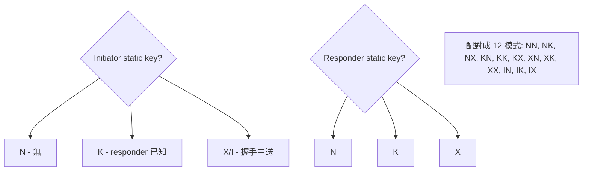

# 課堂 3.8 — Noise Protocol Framework 完整精讀

## 學前知道

- **前置課**：[3.1](./3.1-crypto-goals-taxonomy.md), [3.5](./3.5-elliptic-curves.md), [3.6](./3.6-key-exchange.md)
- **預計閱讀時間**：120 分鐘
- **必讀論文 / 規格**：
  - Perrin, *The Noise Protocol Framework*, revision 34 (2018)
  - Donenfeld, *WireGuard: Next Generation Kernel Network Tunnel*, NDSS 2017
  - Kobeissi, Nicolas, Bhargavan, *Noise Explorer: Fully Automated Modeling and Verification for Arbitrary Noise Protocols*, EuroS&P 2019
  - Lipp, Blanchet, Bhargavan, *A Mechanised Cryptographic Proof of the WireGuard Virtual Private Network Protocol*, EuroS&P 2019
  - Dowling, Rösler, Schwenk, *Flexible Authenticated and Confidential Channel Establishment (fACCE)*, J. Cryptology 2022
- **必讀原始碼**：
  - `wireguard-go/device/noise-protocol.go`
  - `wireguard-go/device/noise-helpers.go`
  - `snow` Rust crate
  - Noise reference implementations: https://github.com/noiseprotocol/

> Noise 是 modern protocol design 的 swiss army knife。WireGuard (Noise IK)、Lightning Network (Noise XK)、Signal (X3DH 部分 Noise-like)、Wire (Noise IK variants)、Whisper / Matrix Olm (Noise variants) 全部用。本堂處理：Noise pattern DSL、12 個 fundamental patterns 各自的 security profile、symbolic state machine、WireGuard 的 Noise IK + cookie reply 加固、G6 怎麼選 Noise variant。

---

## 動機：Trevor Perrin 為什麼設計 Noise

2014 年 Perrin 觀察：
- TLS 1.2 / IKEv2 / SSH 各自重新發明 KE + record layer，每個都複雜、每個都有不同 bug。
- Signal 自己設計 X3DH + Double Ratchet。
- WireGuard (then in design) 需要新 KE 但不想重新發明。

需要：**一個 framework 能 instantiate 不同 protocols，每個都有 well-defined security profile**。Noise 是答案。

設計目標：
1. **Modular**: handshake pattern 是 DSL 描述；可組合不同 (KEM, hash, cipher) 三元組。
2. **Provably analyzable**: 每 pattern 在 symbolic + computational model 下都可分析。
3. **Small spec**: ~50 頁，相對 TLS 1.3 spec 200+ 頁。
4. **Production-friendly**: 規範 + reference impl 一起；implementation 不超過 1000 行 code。

---

## 核心概念

### 1. Noise pattern DSL

Pattern 由兩段組成：
- **Pre-message tokens** (`-> s`, `<- s`)：handshake 開始前哪些 public keys 已知。
- **Message patterns** (`-> e, es`)：每 round message 中包含的 tokens。

**Tokens**:
| Token | 意義 |
|---|---|
| `e` | send ephemeral public key |
| `s` | send static public key (encrypted if cipher-state 已建立) |
| `ee` | DH(ephemeral_us, ephemeral_them) |
| `es` | DH(ephemeral_us, static_them) |
| `se` | DH(static_us, ephemeral_them) |
| `ss` | DH(static_us, static_them) |
| `psk` | mix PSK into chaining key |

**Naming convention**: `Noise_<pattern>_<kex>_<cipher>_<hash>`
- 例：`Noise_IK_25519_ChaChaPoly_BLAKE2s` (WireGuard)
- 例：`Noise_XK_25519_ChaChaPoly_SHA256` (Lightning Network)

### 2. 12 個 fundamental handshake patterns



| Pattern | Initiator static | Responder static | 用途 |
|---|---|---|---|
| **NN** | none | none | 純 ECDH, no auth |
| **NK** | none | pre-known | client-anon auth-to-server |
| **NX** | none | sent in handshake | client-anon, server cert-style |
| **KK** | pre-known | pre-known | mutual pre-shared |
| **KX** | pre-known | sent | initiator-anonymous-to-others, fixed server |
| **XX** | sent | sent | mutual, both unknown ahead → TLS-like |
| **IK** | sent (in 1st msg) | pre-known | **WireGuard 用** 1-RTT |
| **XK** | sent (in 3rd msg) | pre-known | **Lightning** 用，identity protected |
| **IX** | sent | sent | full mutual sent, 1.5-RTT |

**對 G6 候選**：
- **IK**：1-RTT，client 假設 server 公鑰已知 (out-of-band)。WireGuard 範式。**G6 採此**。
- **XK**：1.5-RTT 但 client identity protected to passive observer (encrypted only after first DH)。Lightning 範式。

### 3. Noise IK 完整精讀（WireGuard 用法）

```text
Pre-message:
    <- s                        // responder's static known by initiator

Messages:
    -> e, es, s, ss             // initiator → responder
    <- e, ee, se                // responder → initiator
```

**State variables maintained**:
- `ck` (chaining key): KDF chain seed
- `h` (handshake hash): transcript hash for binding
- `(k, n)` (cipher state): current AEAD key + counter

**Detailed handshake** (從 initiator 角度):

```text
Initialize:
    h = HASH(protocol_name)         // e.g. "Noise_IK_25519_ChaChaPoly_BLAKE2s"
    if prologue: h = HASH(h ‖ prologue)
    
Pre-message:
    MixHash(rs)                      // responder static pk

Message 1 (initiator → responder):
    e ← random; ephemeral = e_pub
    MixHash(e_pub)                   // h = H(h ‖ e_pub)
    MixKey(DH(e, rs))                 // es: (ck, k) = HKDF(ck, DH); n = 0
    EncAndHash(s_pub):                // encrypt own static pk
        c = AEAD-Encrypt(k, n, AD=h, s_pub)
        MixHash(c)
        n += 1
        send c
    MixKey(DH(s, rs))                 // ss
    EncAndHash(payload)               // encrypt 0-RTT payload if any

Message 2 (responder → initiator):
    e ← random; ephemeral = e_pub
    MixHash(e_pub)
    MixKey(DH(e, re))                 // ee
    MixKey(DH(e, rs))                 // se: from responder's eph to initiator's static
    EncAndHash(payload)

End of handshake:
    Split(ck):
        (k_send, k_recv) = HKDF(ck, "", 2)
    Both sides have transport keys for sending / receiving.
```

**安全屬性** (Perrin 2018, Lipp-Blanchet-Bhargavan 2019 verified):
- **1-RTT**: only one round-trip; initiator can send 0-RTT data in message 1.
- **Mutual authentication**: 雙方都需 own static + know other's static。
- **Forward Secrecy after message 2**: ee 提供 FS。
- **Initiator identity protection** (against passive observer)：initiator static encrypted via es。但 active MitM 知道 initiator 的 static if MitM 有 responder's static private key。
- **No KCI from compromised responder**: 對手知 responder static 不能 forge initiator → responder (需 initiator static)。
- **Replay resistance** in 0-RTT message via transcript hash binding + per-handshake fresh ephemeral。

### 4. WireGuard 對 Noise IK 的加固

WireGuard 不只用 Noise IK，還加：

```text
1. MAC1, MAC2 (anti-DoS):
    - MAC1 = MAC(H(label_mac1 ‖ S_pub_r), msg_so_far)
      確認 initiator 知 responder static (out-of-band check 之前 expensive crypto)
    - MAC2 = MAC(cookie, msg) (after cookie reply)
      確認 initiator 是 reachable host (防 spoofed IP DoS)

2. Cookie Reply:
    當 server overloaded, server 不做 crypto 直接回 cookie = MAC(secret, src_IP)。
    Client 重試時帶 cookie via MAC2。
    server verify cookie 確認 client IP 是 routable。

3. Rekey-after-time / Rekey-after-messages:
    - 每 120 sec or 2^60 messages 觸發 ephemeral DH ratchet。
    - 給 G6-style 粗粒度 PCS。

4. Persistent keepalive (optional):
    - 每 N sec 送 keepalive packet 防 stateful firewall drop。
```

**G6 借用 WireGuard 設計**:
- ✅ MAC1 (out-of-band 知識證明)。
- ✅ Cookie reply (anti-DoS) — 但加 cover-traffic disguise。
- ✅ Rekey-after-time/messages。
- ⚠️ Keepalive 改 timing-randomized 避免 traffic-shape fingerprint。

### 5. Noise XK vs IK 對比（identity protection）

**XK** (Lightning Network 用):
```text
Pre-message:
    <- s                    // responder static known

Messages:
    -> e                    // initiator sends only ephemeral
    <- e, ee                // responder sends own ephemeral
    -> s, se                // NOW initiator sends static (encrypted)
```

**1.5-RTT 但**：
- Initiator static 不在 message 1 中暴露。
- Passive observer 在 message 1 看不到 initiator identity。
- 對 active MitM with responder static private 仍可暴露（但 active MitM 已可全 disrupt）。

**IK vs XK trade-off**:
| | IK | XK |
|---|---|---|
| RTT | 1 | 1.5 |
| Initiator identity to passive | encrypted but only against passive (active with rs_priv can decrypt) | encrypted against passive AND active without rs_priv |
| 0-RTT data | yes (initiator → responder in msg 1) | no |
| WireGuard 選 | ✓ | |
| Lightning 選 | | ✓ |

**G6 選 IK**：1-RTT 對 proxy 場景重要；0-RTT data 是 cover-traffic 設計關鍵。Initiator identity protection 透過額外 layer（cover document hash）達成。

### 6. Noise PSK modes

加 PSK 進 chaining key：

```text
Noise_IKpsk0_25519_ChaChaPoly_BLAKE2s
                ^^^^
                psk 在 message 0 (pre-message phase) 混入

Noise_IKpsk2_...   // psk 在 message 2 混入
```

PSK 用途：
- **Quantum resistance**: PSK 之 entropy 不被 Shor 攻破；若 PSK out-of-band 安全分發，hybrid 模式即使 ECDH 被 Shor 破，PSK 仍提供 confidentiality。
- **Additional authentication**: PSK 等同 mutual pre-shared secret，加強 mutual auth。
- **Quantum-safe fallback**: WireGuard `--preshared-key` option 就是 NoiseIKpsk2。

**G6 PQ migration strategy**:
- Phase 1 (2026)：Noise IK + optional PSK (out-of-band PQ-safe channel)。
- Phase 2 (2027+)：Noise IK + Kyber768 KEM 完整 PQ hybrid。

### 7. Noise 的 formal verification

Noise 被 formally verified 三條 axis：

1. **Symbolic (Tamarin, ProVerif)**:
   - Kobeissi-Nicolas-Bhargavan 2019 *Noise Explorer*: 自動 generate ProVerif models for all 16 fundamental patterns; verify 18 security properties。
   - Available at https://noiseexplorer.com — interactive。

2. **Computational (CryptoVerif)**:
   - Lipp-Blanchet-Bhargavan 2019 *WireGuard ProVerif + CryptoVerif*：對 WireGuard 完整 mechanised proof。

3. **fACCE generic framework (Dowling-Rösler-Schwenk 2022)**:
   - Flexible Authenticated and Confidential Channel Establishment — generic security model 涵蓋 Noise + TLS 1.3 + IPsec 等。

**G6 計畫**:
- 用 Noise Explorer generate ProVerif model for G6 IK variant。
- Manual extend ProVerif model to cover G6's cover-traffic + PSK + PQ-hybrid 變動。
- 計畫產出 fACCE-compatible 證明。

### 8. Noise vs TLS 1.3 vs IKEv2 比較

| | Noise IK | TLS 1.3 | IKEv2 |
|---|---|---|---|
| Spec size | ~50 pages | ~150 pages (8446) | ~200 pages (7296) |
| Handshake RTT | 1-RTT | 1-RTT (skip CertVerify w/ PSK) | 2-RTT |
| Identity protection | initiator partial | both encrypted | both encrypted |
| 0-RTT support | yes (with caveats) | yes (PSK-resumption only) | no |
| FS | ephemeral DH | ephemeral DH | ephemeral DH |
| PCS | optional psk rekey | rekey via update_traffic_key | rekey via SA rekey |
| Cipher suite negotiation | hard-coded in name | negotiated | negotiated |
| Implementation size | ~1000 lines | ~10000 lines | ~30000 lines |
| Formal verification | Noise Explorer covers | partial (ProVerif, F\*) | partial |

**G6 偏向 Noise**: 小、modular、formally verified、與 WireGuard 互通 friendly。

---

## 與我們協議設計的關聯

| 設計問題 | 答案 |
|---|---|
| Handshake pattern | Noise IK variant + PQ-hybrid extension |
| Primitives | X25519 + Kyber768 + ChaCha20-Poly1305 + BLAKE2s/SHA-256 |
| Anti-DoS | MAC1 + cookie reply (WireGuard-derived) |
| Identity protection | initiator static encrypted via es (Noise IK 標配) + optional XK fallback |
| PCS | rekey-after-time/messages (粗粒度) + per-N-record DH ratchet |
| 0-RTT | optional via PSK or static-DH 1st message (with replay protection) |
| Formal verification | Noise Explorer + manual extension for G6 |

---

## 動手：用 snow 跑 Noise IK with PSK

```rust
use snow::Builder;

let pattern = "Noise_IKpsk2_25519_ChaChaPoly_BLAKE2s".parse().unwrap();
let psk = [0u8; 32];  // out-of-band shared PSK

// Initiator
let mut initiator = Builder::new(pattern.clone())
    .local_private_key(&initiator_static_priv)
    .remote_public_key(&responder_static_pub)
    .psk(2, &psk)
    .build_initiator()
    .unwrap();

// Responder  
let mut responder = Builder::new(pattern.clone())
    .local_private_key(&responder_static_priv)
    .psk(2, &psk)
    .build_responder()
    .unwrap();

// Handshake message 1
let mut buf = vec![0u8; 1024];
let len1 = initiator.write_message(b"0-RTT data", &mut buf).unwrap();
let mut payload_buf = vec![0u8; 1024];
let len_p1 = responder.read_message(&buf[..len1], &mut payload_buf).unwrap();

// Handshake message 2
let len2 = responder.write_message(b"response", &mut buf).unwrap();
let len_p2 = initiator.read_message(&buf[..len2], &mut payload_buf).unwrap();

// Transition to transport
let initiator_tx = initiator.into_transport_mode().unwrap();
let responder_tx = responder.into_transport_mode().unwrap();
```

---

## 自我檢查

1. Noise IK 的兩個 message 中各包含哪些 tokens？每個 DH (`ee`, `es`, `se`, `ss`) 做什麼？
2. 為什麼 WireGuard 選 Noise IK 而不是 XK？trade-off 是什麼？
3. WireGuard 的 MAC1 與 MAC2 各自防什麼 attack？G6 如何借鑑？
4. PSK 在 Noise 中怎麼混入 chaining key？對 PQ hybrid 為何關鍵？
5. fACCE framework 與 Noise 各自 security model 差異？哪些 G6 該採用？
6. 用 Noise Explorer 找出 IK pattern 的「unknown key share attack」是否存在？
7. G6 如果想做「對 active MitM with responder static 仍 identity-protect initiator」要 switch to 哪個 pattern？代價？

---

## 延伸閱讀

- Perrin *The Noise Protocol Framework* (revision 34, 2018) — 完整 spec。
- Kobeissi-Bhargavan-Beurdouche *Automated Verification for Secure Messaging Protocols* (EuroS&P 2019)。
- Lipp-Blanchet-Bhargavan *Mechanised Proof of WireGuard* (EuroS&P 2019)。
- Dowling-Rösler-Schwenk *fACCE* (J. Cryptology 2022)。
- noiseprotocol.org tutorials + reference implementations。

---

## 研究級補遺

### 1. 學界詞彙

- **HandshakeState / SymmetricState / CipherState**: Noise spec 中的三個 state object 抽象。
- **Pre-message vs Message section**: pattern 的兩段。
- **Token sequence**: `e`, `s`, `ee`, `es`, `se`, `ss`, `psk` 的有序集合。
- **MixHash / MixKey / EncAndHash**: state transition operations。
- **Split**: 結束 handshake 派生 transport keys 的 step。
- **One-way pattern vs Interactive pattern**: N\_/K\_/X\_ vs NN/IK/XK。
- **Fallback patterns**: Noise XX_fallback for upgrading from 0-RTT failures。
- **NoiseSocket** (deprecated): wire format wrapper for Noise。
- **fACCE (Dowling 等 2022)**：generic AKE-with-channel security framework, generalizes BR/CK to capture Noise + TLS。

### 2. 形式化定義

**Noise 安全屬性 hierarchy** (Perrin 2018):
- 0..5 levels of authentication (none → strong both-side)。
- 0..5 levels of confidentiality (none → strong both-side post-handshake)。
- 每 pattern 對 each message 有 (auth_level, conf_level) tuple。

例如 Noise IK 第一個 message (initiator → responder) 的 (auth_level, conf_level) = (1, 5):
- auth_level 1: identity claimed but not verified (initiator 簽 own DH share via es)。
- conf_level 5: encrypted to strong recipient (responder's static 已知, es 提供 confidentiality)。

### 3. 關鍵論文

1. **Perrin Noise spec revision 34** (2018)。
2. **Donenfeld WireGuard** (NDSS 2017)。
3. **Lipp-Blanchet-Bhargavan WireGuard ProVerif** (EuroS&P 2019)。
4. **Kobeissi-Nicolas-Bhargavan Noise Explorer** (EuroS&P 2019)。
5. **Dowling-Rösler-Schwenk fACCE** (J. Cryptology 2022)。
6. **Bhargavan, Stephens-Davidowitz 等 *fACCE for QUIC + TLS + Noise*** (CSF 2024)。
7. **Cremers-Hale-Kohbrok *The Complexities of Healing in Secure Messaging Protocols*** (EUROCRYPT 2023) — PCS in Noise+ratchet 結合。

### 4. G6 座標

```mermaid
flowchart TD
    classDef chosen fill:#cfc,stroke:#080
    classDef extend fill:#fdf,stroke:#909

    G6Noise[G6 Handshake = Noise IK + extensions]
    G6Noise --> Base[Base: Noise_IK_25519_ChaChaPoly_BLAKE2s]:::chosen
    G6Noise --> PSK[PSK extension for quantum-safe hybrid]:::chosen
    G6Noise --> PQ_KEM[+ Kyber768 KEM in custom token]:::extend
    G6Noise --> MAC1[MAC1 anti-DoS (WireGuard-style)]:::chosen
    G6Noise --> Cookie[Cookie reply for spoofed IP defense]:::chosen
    G6Noise --> CoverDisguise[Elligator2-disguised ephemeral pk]:::extend
    G6Noise --> Ratchet[Per-N-record DH ratchet for fine PCS]:::extend
```

### 5. 必追資源

- **noiseprotocol.org** — official spec + impl list。
- **noiseexplorer.com** — interactive pattern analysis。
- **github.com/noiseprotocol** — reference implementations。
- **wireguard.com/papers** — WireGuard formal analyses。

### 6. 開放問題

- **PQ-hybrid Noise**：當前 Noise spec 不直接支援 KEM；需要 protocol extension。Schwabe 等 2020 提出 PQNoise 草稿。
- **PCS in Noise-based protocols**: 當前 IK 只有 weak FS；要 strong PCS 需 X3DH-style multi-key or Signal Double Ratchet 外加層。
- **0-RTT replay protection in Noise**: 用 PSK + nonce 或 server-side tracking, 仍 active design。
- **Formal proof of all 16+ patterns under unified PQ adversary**: open。

---

> **下一堂預告**：3.9 PAKE — SRP, SPAKE2, OPAQUE; 為什麼密碼可以做 KE 不洩密碼。
