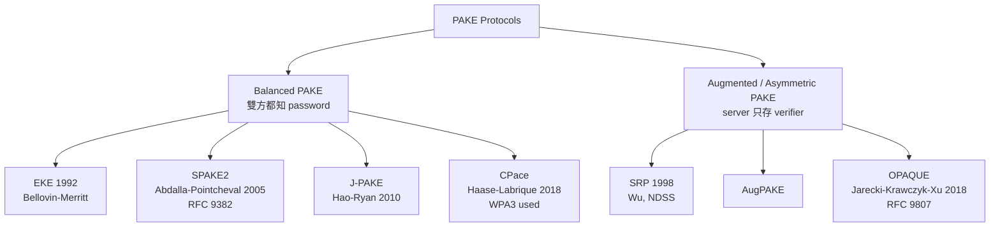
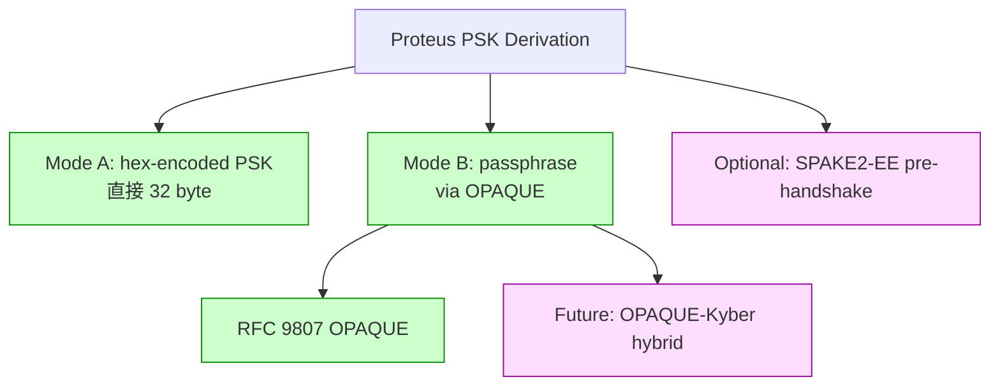

# 課堂 3.9 — PAKE：用密碼做金鑰交換而不洩密碼

## 學前知道

- **前置課**：[3.3](./3.3-hash-functions-kdf.md), [3.5](./3.5-elliptic-curves.md), [3.6](./3.6-key-exchange.md)
- **預計閱讀時間**：90 分鐘
- **必讀論文 / 規格**：
  - Bellovin, Merritt, *Encrypted Key Exchange: Password-Based Protocols Secure Against Dictionary Attacks*, IEEE S&P 1992（EKE 原型）
  - Wu, *The Secure Remote Password Protocol*, NDSS 1998（SRP）
  - Abdalla, Pointcheval, *Simple Password-Based Encrypted Key Exchange Protocols*, CT-RSA 2005（SPAKE2 origin）
  - Jarecki, Krawczyk, Xu, *OPAQUE: An Asymmetric PAKE Protocol Secure Against Pre-Computation Attacks*, EUROCRYPT 2018
  - RFC 9382 — *SPAKE2, a PAKE* (2023)
  - RFC 9807 — *The OPAQUE Asymmetric PAKE Protocol* (2025)
  - Krawczyk, *The OPAQUE Asymmetric PAKE Protocol Specification* (IETF CFRG draft 2017+)
  - Hao, Ryan, *J-PAKE: Authenticated Key Exchange Without PKI*, INDOCRYPT 2010
- **必讀原始碼**：
  - libsodium SPAKE2 (deprecated, replaced by OPAQUE)
  - opaque-ke (Facebook Rust OPAQUE impl)

> 上一堂處理 Noise 假設 server static pk 已 out-of-band 分發。但若使用者**只有 password**（沒有 cert、沒有 pk fingerprint）能不能 secure KE? PAKE 是答案——讓密碼 entropy 不外洩、不可離線 dictionary attack；Apple iCloud Keychain、WebAuthn fallback、Wi-Fi WPA3 全用 PAKE。Proteus PSK 模式從 passphrase derive 必走 OPAQUE。

---

## 動機：密碼只有 ~40 bit entropy，怎麼做 KE？

| Strategy | Pros | Cons |
|---|---|---|
| H(password ‖ salt) as PSK | 簡單 | 對手錄 handshake 後可 offline dictionary attack |
| Argon2(password, salt) as PSK | memory-hard 抗 GPU | 仍可 offline attack（雖然昂貴） |
| **PAKE** | offline attack 完全不可（每嘗試一次 password 必須跟 server 一次 online interaction） | 設計複雜，正確實作難 |

**PAKE 核心保證**：對手 passive 觀察 handshake → **不能** offline 試 password。對手 active MitM 每次 attempt 一個 password → server 端可 detect 並 rate-limit。

對 Proteus：若 PSK mode 來自使用者 type 的 passphrase，必走 OPAQUE 而非 Argon2-PSK。

---

## 核心概念

### 1. PAKE 分類：Balanced vs Augmented



**Balanced**: 雙方對等持有 password。Wi-Fi WPA3 (SAE = Dragonfly) 用 balanced。
**Augmented**: 只 client 知 password；server 存 password verifier（hash + salt）。Server compromise 不直接洩 password。更適合 server-client。

**Proteus 用 OPAQUE (Augmented)**：server 不存 plain password，被 hack 後 attacker 仍要 offline brute-force salted hash。

### 2. EKE 1992 (Bellovin-Merritt) — PAKE 鼻祖

最簡單的想法：
```text
Setup: shared password p (low entropy)
A: x ← random; X = g^x mod p_dh; send Enc_p(X)
B: y ← random; Y = g^y; send Enc_p(Y)
K = (decrypted X)^y = (decrypted Y)^x = g^{xy}
```

`Enc_p` 是 symmetric encryption with key derived from p。

**為什麼安全**: 對手觀察 (Enc_p(X), Enc_p(Y))。要 dictionary attack: 對 candidate p_i，Dec_{p_i} 得 X_i, Y_i。但 **任何 p_i 都產生 valid-looking X_i (g^x for some x mod p_dh)**——對手無法區分對錯的 p。

**缺陷**: 對 Diffie-Hellman 必須是「dictionary-attack-resistant encoding」——明顯的 (g, p) 設定下對手能 detect non-quadratic-residue 等。原 EKE 有後續 patch。

### 3. SPAKE2 (Abdalla-Pointcheval 2005, RFC 9382)

**Setup** (in prime-order group G of order q with generator g):
```text
Two public parameters M, N (independent group elements, "magic" generators)
Each party knows password p; w = H(p ‖ ...) mod q

A: x ← random in [0, q)
   T_A = g^x · M^w   (mask DH share with password-derived element)
   send T_A
B: y ← random
   T_B = g^y · N^w
   send T_B
A: shared = (T_B / N^w)^x = (g^y)^x = g^{xy}
B: shared = (T_A / M^w)^y = g^{xy}

Final K = KDF(shared, T_A ‖ T_B ‖ idA ‖ idB)
Use Confirmation:
A: K_A = MAC(K, "A confirm"); send K_A
B: verify K_A; K_B = MAC(K, "B confirm"); send K_B
A: verify K_B
```

**安全性**:
- Passive observer 看 (T_A, T_B): random group elements (regardless of w)——cannot dictionary attack。
- Active MitM: 每嘗試 candidate w_i 必須跟 honest server 一次 handshake → online rate limit 控制。

**特性**:
- **One-shot KE**: 2 messages handshake。
- **balanced**: 雙方對等。
- **No PKI**: 不需 cert。

**M, N 是 magic constants**: spec 中 hard-coded (e.g., SHA-512 of "M" / "N" mapped to curve)。

**Proteus 不選 SPAKE2**：balanced 不適合 server-client；OPAQUE 是 augmented 更適合。

### 4. SRP (Wu 1998) — 部署最久的 PAKE

SRP 是早期 augmented PAKE，被 Apple iCloud、AOL、1990s 多銀行採用。

**Setup**:
```text
User registration:
    salt ← random; x = H(salt ‖ username ‖ password)
    verifier v = g^x mod N
    Server stores (salt, v); discards x, password.

Login (SRP-6a, RFC 5054):
    C → S: username
    S → C: salt, B = k·v + g^b mod N    where k = H(N, g), b random
    C → S: A = g^a mod N                where a random
    Both compute:
        u = H(A, B)
        S_c = (B - k·g^x)^(a + u·x) mod N
        S_s = (A · v^u)^b mod N
        K = H(S_c) = H(S_s)
    Verify via M_1 = H(A, B, K); M_2 = H(A, M_1, K).
```

**問題與被取代理由**:
- 沒 formal security proof in modern AKE model。
- Bellovin-Merritt-style EKE 已過時。
- 對 pre-computation attack（server compromise → offline crack）vulnerable。
- OPAQUE 取代是 cryptographic community 共識。

### 5. OPAQUE (Jarecki-Krawczyk-Xu 2018, RFC 9807)

**核心 idea**: Augmented PAKE 同時提供 **pre-computation resistance**。即使對手攻入 server 偷 verifier，也不能 pre-compute hash table 給後續 offline crack。

**結構** (簡化):
- Client 用 **OPRF (Oblivious Pseudo-Random Function)** + password 派生「authenticated key」k：
  - k = OPRF(server_oprf_key, password)
  - Server 知 OPRF key but 不知 password；OPRF output 是 PRF-like，但 client interactively 才能算出。
- Client 用 k 解密 stored envelope 取得 own static private key + server static public key fingerprint。
- 雙方做 AKE (e.g., HMQV) using these keys。

**安全保證**:
- **No offline dictionary attack** by passive observer (PAKE 基本)。
- **No pre-computation attack**：server compromise 取 (oprf_key, salted_envelope)；要 brute-force 仍要 online query OPRF service per candidate password (即使 server 本身被攻陷 attacker 自己當 OPRF server)。OPRF key 是 secret 給 attacker effective bound。
- **Identity protection**：客戶端 username 不洩 (OPRF 隱藏 input)。
- **Forward secrecy**：透過 AKE 階段 ephemeral DH。

**Drawbacks**:
- Complex spec (~50 page draft)。
- Implementation pitfalls 多 (OPRF 必須正確實作)。
- 2 round trip handshake (vs SPAKE2 的 1.5)。

**部署現況** (2025):
- WhatsApp account recovery 用。
- 1Password Watchtower。
- Cloudflare PrivacyPass 部分元件。
- IETF CFRG ratified RFC 9807 (2025)。

### 6. PAKE 形式化 model

**PAKE Security Game** (Bellare-Pointcheval-Rogaway 2000 framework):
```text
Game PAKE(A, π, password_space P):
    pw ← uniform random in P
    Server / Client setup with pw
    A interacts:
        - send/receive messages (active MitM)
        - test queries: A picks (party, session_id) → if fresh, get random or real K
        - corrupt queries: get long-term state
    A guesses test-bit b'
    Adv = | Pr[b' == b] - 1/2 - q_send/|P| |
```

**關鍵**：`q_send/|P|` term 表示「對手每次 active interaction 最多消耗 |P|^(-1) 機率 narrow password」——對手只能 online attack one password per session interaction。離線觀察不給任何 advantage。

### 7. PAKE for Post-Quantum

當前 PAKE 全 DH-based ⇒ Shor 可破。PQ-PAKE 主要設計：
- **CRYSTALS-based**: 基於 Kyber 等 KEM 的 PAKE 變體。Beguinet-Chevalier-Cremers-Vergnaud 2023 *KOY-Yung PAKE PQ adaptation*。
- **Isogeny-based**: CSIDH-based PAKE (Abdalla 等 2022)。
- **OPAQUE with PQ-AKE**: 替換 internal AKE 部分為 PQ-hybrid。

**Proteus PQ-PAKE 計畫**: 目前 spec v1 用 classical OPAQUE；v2 (預計 2027) migrate 到 OPAQUE-Kyber hybrid when CFRG ratify。

### 8. PAKE 在 Proteus 的具體用法

Proteus 主要用 X25519 + cert/static-pk 模式 (Noise IK)。但**兩個場景需要 PAKE**：

1. **PSK from passphrase**: 若使用者用 passphrase 配置 Proteus 而非 hexadecimal PSK，**從 passphrase derive PSK 必走 OPAQUE-style 流程**，而非 simple Argon2。理由：server-stored verifier 仍能被 attacker 拿來離線試 password (Argon2 雖 memory-hard 但 sufficiently long brute force feasible)。OPAQUE 完全消除 offline attack。

2. **Anti-DoS pre-handshake auth**: Proteus 可選用 SPAKE2-EE (Ephemeral-Ephemeral variant) 在握手前 derive 一次 short-term key 證明 client 知道 server 的 weak shared secret，再做 expensive Kyber+X25519 handshake。對抗 amplification attack。

---

## 與我們協議設計的關聯

| 設計問題 | 答案 |
|---|---|
| Passphrase-derived PSK | OPAQUE (RFC 9807) |
| Augmented vs balanced | **Augmented** (server-client) |
| Pre-computation resistance | OPAQUE 給；Argon2-PSK 不給 |
| Server compromise handling | OPAQUE: 偷 verifier 仍須 online OPRF query per attempt |
| PQ migration | OPAQUE-Kyber hybrid (when CFRG ratified) |
| Anti-DoS pre-handshake | optional SPAKE2-EE layer |

---

## 動手：用 opaque-ke (Rust) 完整 register + login

```rust
use opaque_ke::{ClientRegistration, ServerRegistration, ClientLogin, ServerLogin, ...};
use rand::rngs::OsRng;
type CipherSuite = opaque_ke::ciphersuite::OpaqueCipherSuite;

// === Registration ===
// Client side
let mut rng = OsRng;
let password = b"correct horse battery staple";
let client_reg_start = ClientRegistration::<CipherSuite>::start(&mut rng, password).unwrap();
// send client_reg_start.message to server

// Server side
let server_setup = ServerSetup::<CipherSuite>::new(&mut rng);
let server_reg_start = ServerRegistration::<CipherSuite>::start(
    &server_setup, client_reg_start.message, b"user@example").unwrap();
// send server_reg_start.message back to client

// Client side
let client_reg_finish = client_reg_start.state.finish(
    &mut rng, password, server_reg_start.message, ...).unwrap();
// send client_reg_finish.message to server

// Server side
let server_reg_record = ServerRegistration::<CipherSuite>::finish(client_reg_finish.message);
// store (b"user@example", server_reg_record) in DB

// === Login ===  
// Similar 3-message flow, derive shared session key.
```

---

## 自我檢查

1. 為什麼 SPAKE2 的 M, N 必須是「magic constants」？對手選 M, N 能做什麼壞事？
2. SRP 為什麼被 OPAQUE 取代？pre-computation attack 具體是什麼？
3. OPAQUE 的 OPRF 為什麼是設計核心？OPRF 本身的安全保證是什麼？
4. PAKE 對 server-side rate limiting 的依賴：若 server 不限速，PAKE 的安全 hold 嗎？
5. Proteus 從使用者 passphrase derive PSK 用 Argon2 vs OPAQUE 差別具體在哪？
6. PQ-PAKE 為何難？Kyber-based PAKE 的 design challenge？
7. WPA3 的 SAE 是 balanced or augmented？兩者選擇對 Wi-Fi 場景的影響？

---

## 延伸閱讀

- Bellare-Pointcheval-Rogaway *Authenticated Key Exchange Secure Against Dictionary Attacks* (EUROCRYPT 2000)。
- Hao-Ryan *J-PAKE* (INDOCRYPT 2010) — alternative balanced PAKE。
- Haase-Labrique *CPace* (TCC 2018) — modern balanced PAKE，WPA3 部分用。
- Krawczyk *OPAQUE blog series* (Cloudflare 2018-2020)。
- IETF CFRG PAKE document collection。

---

## 研究級補遺

### 1. 學界詞彙

- **EKE (Encrypted Key Exchange)**: 1992 Bellovin-Merritt PAKE 原型。
- **AugPAKE / aPAKE**: augmented PAKE = asymmetric PAKE。
- **OPRF (Oblivious Pseudo-Random Function)**: client 給 input x, server 回 F_k(x), client 學 F_k(x) 但 server 不學 x。OPAQUE 核心。
- **PAKE BPR Model** (Bellare-Pointcheval-Rogaway 2000): 形式化 PAKE security。
- **Universal Composability (UC) PAKE**: stronger model, Canetti 等 2005。
- **SPHF (Smooth Projective Hash Function)**: PAKE 的 framework abstraction。
- **OPAQUE-3DH / OPAQUE-HMQV**：基於不同 AKE 後端的 OPAQUE 變體。

### 2. 形式化定義 (BPR 2000 簡化)

```text
Adversary capabilities:
    Send(party, sid, m): send message m to party
    Reveal(party, sid): reveal session key
    Test(party, sid): challenge — return real K or random based on bit b
    Corrupt(party): reveal long-term state (含 password verifier for server)

Win condition: A guesses b after fresh Test query.

Adv = | Pr[b' == b] - 1/2 |

PAKE security: Adv ≤ q_send / |P| + negligible
                where q_send = active sessions, |P| = password space size

意義: 對手每次 active interaction 最多消耗 1/|P| 機率精煉 password；
      passive observation 不給任何 advantage。
```

### 3. 關鍵論文

1. **Bellovin-Merritt EKE 1992** — PAKE 鼻祖。
2. **Wu SRP 1998** — 部署最久 augmented PAKE。
3. **Abdalla-Pointcheval SPAKE2 2005**。
4. **Bellare-Pointcheval-Rogaway 2000** — formal model。
5. **Canetti, Halevi, Katz, Lindell, MacKenzie *Universally Composable Password-Based Key Exchange* (EUROCRYPT 2005)** — UC PAKE。
6. **Jarecki-Krawczyk-Xu OPAQUE 2018**。
7. **Haase-Labrique CPace 2018**。
8. **Beguinet-Chevalier-Cremers-Vergnaud 2023 PQ-PAKE** — post-quantum migration。
9. **RFC 9382 SPAKE2 (2023)**。
10. **RFC 9807 OPAQUE (2025)**。

### 4. Proteus 座標



### 5. 必追資源

- **CFRG PAKE work** — RFC 9382, RFC 9807 + drafts。
- **opaque-ke Rust crate** — Facebook reference impl。
- **CryptoSlide / RWC talks on PAKE deployment**。
- **Hao Feng *PAKE crypto research site*** — j-pake author。

### 6. 開放問題

- **PQ-OPAQUE standardization**: CFRG draft 進行中但未 ratified。
- **PAKE + cover-traffic indistinguishability**: Proteus 場景下 PAKE handshake 必須與 cover protocol 流量 indistinguishable。Open design problem。
- **PAKE for IoT / constrained devices**: 低資源 device 下 OPAQUE 太重。
- **Threshold PAKE**: t-of-n server setup 仍 evolving。

---

> **下一堂預告**：3.10 零知識證明入門 — Sigma protocol, Schnorr identification, zk-SNARK / zk-STARK 概念。
