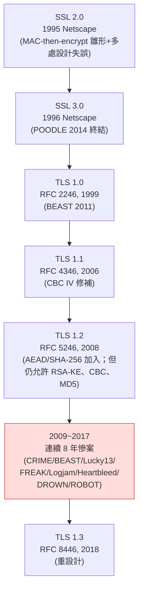
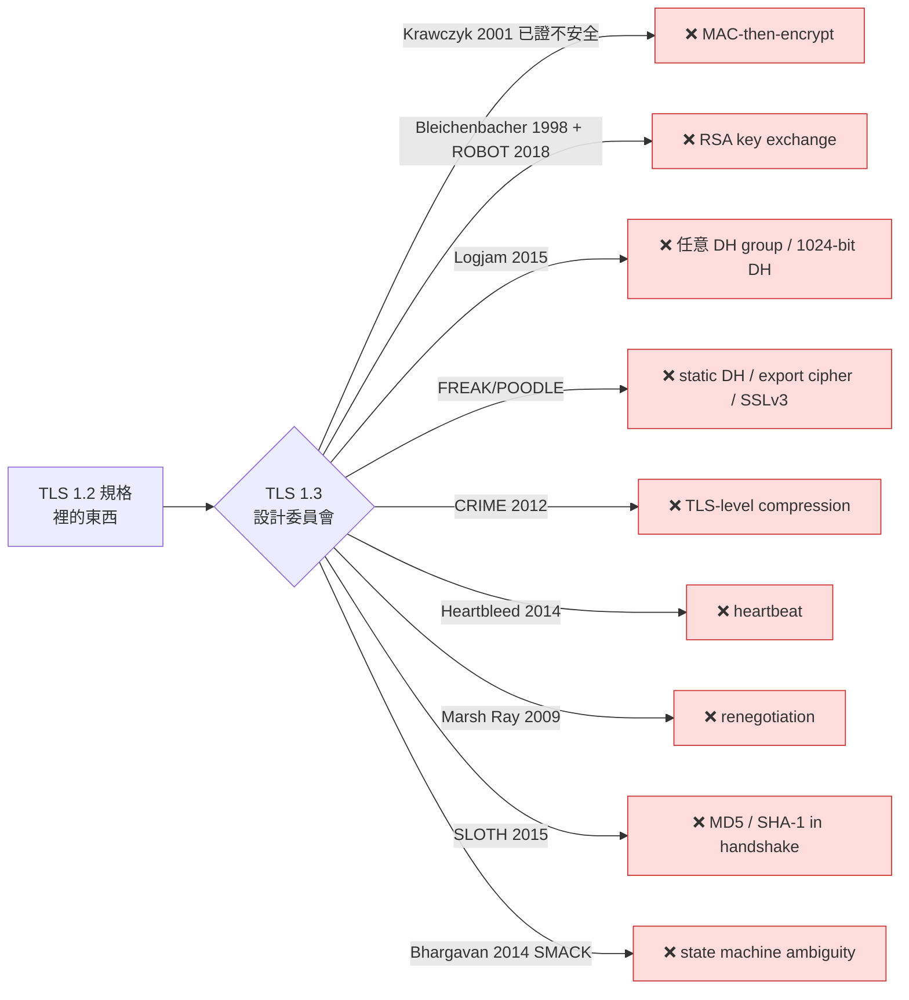

# 課堂 4.1 — TLS 歷史血淚史：SSL 2 到 TLS 1.3 的 28 年

## 學前知道
- 前置課：
  - [Part 3 密碼學基礎](../../SYLLABUS.md#part-3--密碼學紮實基礎16-堂)（尚未撰寫，但本堂需要的關鍵詞：**MAC**、**AEAD**、**Diffie-Hellman**、**RSA**、**block cipher mode (CBC/GCM)**、**padding oracle**、**bleichenbacher attack** — 不熟可先看 [Boneh & Shoup, *A Graduate Course in Applied Cryptography*](https://toc.cryptobook.us/), v0.6, 2023, §9-10）
  - 對「Web 應用」與「HTTPS」有最基本的概念（會點 URL、知道有個鎖頭）
- 預計閱讀時間：**45 分鐘**
- 必讀論文（本堂只是概述，深入版分散在 Part 3、5、9）：
  - Bleichenbacher, D. *Chosen Ciphertext Attacks Against Protocols Based on the RSA Encryption Standard PKCS #1*. CRYPTO 1998. — RSA-PKCS#1 v1.5 padding oracle 的起源
  - Adrian et al. *Imperfect Forward Secrecy: How Diffie-Hellman Fails in Practice*. CCS 2015. (Logjam) — 為何 1024-bit DH 不安全 + export-grade ciphersuite 的 downgrade 攻擊
  - Aviram et al. *DROWN: Breaking TLS using SSLv2*. USENIX Security 2016. — 為什麼留著 SSL 2 server 會反過來打 TLS client
  - Böck, Somorovsky, Young. *Return Of Bleichenbacher's Oracle Threat (ROBOT)*. USENIX Security 2018. — Bleichenbacher 1998 在 20 年後還活著
- 必讀原始碼：本堂無，純歷史

## 動機

「為什麼 TLS 1.3 跟 TLS 1.2 看起來像兩個不同的協議？」

答案是：**1.3 不是 1.2 + 一些 patch。它是 28 年累積的所有錯誤被當作設計約束之後，重新繪製的一張地圖**。每一個 1.3 拿掉的東西、每一個 1.3 強制的東西，背後都有一篇 USENIX Security 或 CCS 的論文、一個 CVE、一次跨產業緊急 patch。

讀完這堂課之後，你看 RFC 8446（TLS 1.3）就不再是「一份規格」，而是「Bhargavan、Beurdouche、Bellare、Krawczyk 那一輩研究者把 SSL 2 ~ TLS 1.2 28 年來的所有事故編譯成的設計判斷」。對我們設計新 SOTA 協議的意義：**任何「我自己發明的 handshake」99% 會踩進這份血淚史的某一格**。Part 11 的協議設計階段會反覆回來這堂課。

> **失敗框架（CLAUDE.md「Failure framing」）**：本堂呈現的是「研究界 + 業界 28 年踩雷史」，**不是**「TLS 1.3 是必然進化的結果」。Real talk：TLS 1.3 也已經有 [Selfie attack on PSK](https://eprint.iacr.org/2019/347)（Drucker & Gueron 2019）這種發現，意味著「formal verified」也只是局部的安全保證。學完這堂你應該感受到的是「**人類設計安全協議的能力跟攻擊者拆協議的能力是長期軍備競賽**」。

---

## 核心概念

### 1. 一張時間軸先抓住骨架



關鍵觀察：**從 1995 SSL 2 到 2018 TLS 1.3 ＝ 23 年**。而從 SSL 3 (1996) 到 TLS 1.2 (2008) 之間，主要 wire format 大致連續演化；**TLS 1.3 是唯一一次「斷代」**。為什麼斷代——下面細看。

### 2. 每一代死法

我用「協議版本 / 致命漏洞 / 漏洞的形式化分類」三欄一一拆解。

#### SSL 2.0（1995, Netscape）

**致命設計失誤**（同時，不是單一漏洞）：
1. **MAC key 跟加密 key 同源 + MAC-then-encrypt 順序不明** — 為日後的 Vaudenay padding oracle 鋪路。
2. **Handshake 完整性靠 truncated MD5** — `MAC = MD5(secret || pad || data)`，length-extension 的死路。
3. **支援 export-grade cipher**（40-bit RC4、40-bit DES）— 美國 1990s 的密碼出口管制遺毒，**這個遺毒會在 2015 年回來咬人**（FREAK、Logjam）。
4. **Cipher suite 選擇沒被 MAC 保護** — 攻擊者可以 downgrade 整段 handshake。
5. **不能驗證 client identity 與 cipher suite 一致** — Server can be tricked into thinking client requested a weaker suite.

**研究界的判決**：Wagner & Schneier, *Analysis of the SSL 3.0 Protocol* (1996) 一文已直接指出「SSL 2.0 不應再被使用」。但業界拖了 **16 年** 才在 RFC 6176 (2011) 正式禁用 SSL 2.0。然後又被 DROWN (2016) 證明「即使 client 跟 server 都用 TLS 1.2，只要 server 還支援 SSL 2.0，攻擊者可以利用 SSLv2 server 當 Bleichenbacher oracle 解密 TLS 1.2 session」。**留下舊版本本身就是攻擊面**。

#### SSL 3.0（1996, Netscape）→ TLS 1.0（1999, RFC 2246）

主要演化：
- 統一 `Finished` message 用 `MD5(...) || SHA-1(...)`，雙 hash 防 collision attack（SSL 2.0 死法 #2）
- 將 cipher suite negotiation 寫進 `Finished` 的 hash，防 downgrade（死法 #4）

**TLS 1.0 跟 SSL 3.0 wire-level 幾乎相同**，只有 PRF 跟一些細節微調。RFC 2246 對 SSL 3 的關係寫得很直白：

> The differences between this protocol and SSL 3.0 are not dramatic, but they are significant enough to preclude interoperability between TLS 1.0 and SSL 3.0.

**著名死法：BEAST (CVE-2011-3389)** — Duong & Rizzo, *BEAST: Surprising crypto attack against HTTPS*, ekoparty 2011。攻擊核心：CBC mode 的 IV 是上一個 ciphertext block 的最後一塊（**predictable IV**），加上 same-origin policy 的某些 bypass，攻擊者可以做 chosen-plaintext attack 去恢復 HTTPS cookie 一個 byte 一個 byte。

修補：TLS 1.1 引入 **explicit IV** — 每個 record 各自帶一個獨立 IV。但這只是「補了 CBC 的一個洞」。Vaudenay 2002 早就警告 CBC 還有 padding oracle 問題（Lucky13 2013 終結）。

**TLS 1.0 還活到 2020**。PCI DSS 規範 2020 年才強制全產業停用。

#### TLS 1.1（2006, RFC 4346）

主要演化：
- Explicit IV 修補 BEAST 形式攻擊
- 不再因 padding error 直接 fail（但 timing channel 仍存在 → Lucky13）

**TLS 1.1 是一個短命中繼版本**，業界普遍跳過直接上 1.2。

#### TLS 1.2（2008, RFC 5246）

**重要新東西**：
- **AEAD cipher suites**（AES-GCM、ChaCha20-Poly1305 in RFC 7905, 2016）
- **SHA-256** 取代 SHA-1 作為 PRF 與 `Finished` hash
- **Signature algorithms extension** — 讓 client 告訴 server 它接受哪些 hash 算法做 cert verify

**但 TLS 1.2 同時保留了所有舊路徑**：
- RSA key exchange（沒有 forward secrecy；Bleichenbacher 1998 可以解一切被動截獲的 session）
- CBC + HMAC（Vaudenay padding oracle + Lucky13）
- Export-grade cipher suites still negotiable
- MD5 signed certs still acceptable in some implementations
- Renegotiation 機制 → CVE-2009-3555（Marsh Ray）

這個「**新東西加進來、舊東西不踢出去**」的設計哲學就是 TLS 1.2 連續死 8 年的根本原因。下面把這 8 年慘案逐一審視。

### 3. TLS 1.2 時代的連續慘案（2009–2018）

以下我把所有重大事件做成一張表，包括：**攻擊年份、攻擊類型、形式化分類（passive/active × on-path/off-path × chosen-plaintext/chosen-ciphertext 等）、TLS 1.3 對應的「結構性修補」**。

| 年 | 漏洞 / 攻擊 | 形式化分類 | 攻擊根因 | TLS 1.3 修補 |
|---|---|---|---|---|
| 2009 | Insecure Renegotiation (CVE-2009-3555) | active MITM, on-path | renegotiation 不把上一個 session 的 hash 接進來 | renegotiation 整個拿掉 |
| 2011 | **BEAST** (CVE-2011-3389) | active, on-path, adaptive CPA | TLS 1.0 CBC predictable IV + same-origin bypass | CBC 拿掉，只剩 AEAD |
| 2012 | **CRIME** (CVE-2012-4929) | active, on-path, adaptive CPA | TLS-level compression 洩漏 secret 長度資訊 | TLS-level compression 拿掉 |
| 2013 | **Lucky13** (CVE-2013-0169) | active, adaptive CCA via padding oracle | MAC-then-encrypt 的 timing side channel | MAC-then-encrypt 路徑拿掉，只剩 AEAD (encrypt-then-MAC fused) |
| 2014 | **Heartbleed** (CVE-2014-0160) | passive memory disclosure | OpenSSL TLS heartbeat 沒檢查長度 | heartbeat 拿掉 (RFC 8446 §1.2) |
| 2014 | **POODLE** (CVE-2014-3566) | active, downgrade + CBC padding oracle | SSL 3.0 fallback + CBC | SSL 3 + CBC 都拿掉 |
| 2015 | **FREAK** (CVE-2015-0204) | active downgrade | export-grade RSA key (512-bit) still negotiable | 移除所有 export cipher，禁掉 RSA-KE |
| 2015 | **Logjam** (CVE-2015-4000) | active downgrade + offline NFS | export-grade DH 512-bit + 共用 prime | DH params ≥ 2048 強制、只允許固定 named groups |
| 2016 | **DROWN** (CVE-2016-0800) | cross-protocol via SSL 2 oracle | server 同時開 SSL 2.0 + 共用憑證 | SSL 2 已禁用、但需要 server admin 確實關掉 |
| 2016 | **SLOTH** (CVE-2015-7575) | hash collision on transcript | MD5 still accepted in sig_algorithms | TLS 1.3 強制 sig_algorithms 不含 MD5 |
| 2018 | **ROBOT** (CVE-2017-13099 等) | adaptive CCA | Bleichenbacher 1998 在 RSA-KE TLS 1.2 implementation 仍存活 | RSA-KE 拿掉 |
| 2019 | **Selfie attack on PSK** | active, requires PSK reuse misconfig | PSK 兩端都認為自己是 initiator | PSK binders 設計被檢視，TLS 1.3 部分緩解但需配置正確 |

**研究級觀察**：

1. **Padding oracle 是一個世代的主題**：Bleichenbacher 1998 → Vaudenay 2002 → Lucky13 (2013) → ROBOT (2018)。每次「修補」都只是 patch，**Krawczyk 2001 已經證明 MAC-then-encrypt 在某些場景天生不安全**（[Krawczyk, *The Order of Encryption and Authentication for Protecting Communications*, CRYPTO 2001](https://www.iacr.org/archive/crypto2001/21390309.pdf)）。TLS 1.3 的選擇——強制 AEAD——是這篇 17 年前論文的遲到實踐。

2. **Downgrade 是一個世代的主題**：FREAK、Logjam、POODLE 全是 downgrade。**「versions negotiation 必須被 transcript hash 保護」** 這條準則早在 SSL 3 就有，但實作裡只要有一條 fallback 路徑（例如「TLS 1.2 連不上就試 SSL 3」）就會被攻擊者觸發。TLS 1.3 用 `supported_versions` extension 把版本協商整個搬到 extension 裡並嚴格 transcript bind，這個改動本身就值得寫一篇 paper。

3. **Implementation bug 是另一個主題**：Heartbleed 不是設計錯，是 OpenSSL 一行 missing-length-check 的 C bug，但暴露的是「全世界都跑同一個 implementation 的 monoculture 風險」。這也是後續為什麼大家投資 BoringSSL、rustls、ring、s2n 等 reimplementation。

### 4. TLS 1.3 的設計哲學：「Ban-by-default」

對比 TLS 1.2 的「**加新東西、不拿舊東西**」，TLS 1.3 採取了相反原則：

> **如果我們不能證明它安全，它就不在規格裡。**

具體被「ban」掉的東西：



「Ban-by-default」的代價是**互通性**：TLS 1.3 client 跟 TLS 1.0 server 完全不能講話。但這個代價是有意識選擇——RFC 8446 §1.3 列出 "Major Differences from TLS 1.2" 第一句就是 "The list of supported symmetric algorithms has been pruned of all algorithms that are considered legacy."

### 5. 1.3 設計的核心 4 個 invariant

從 28 年血淚史抽出來的設計鐵則（在 Part 4 接下來幾堂都會反覆出現）：

1. **Always forward-secret**：每個 session 都用一個臨時 ECDHE share，server 長期金鑰只用來簽，不用來解密 traffic。RSA-KE 死了。
2. **Always AEAD**：對稱層只允許 AEAD（AES-GCM / ChaCha20-Poly1305 / AES-CCM）。MAC-then-encrypt 死了。
3. **Always transcript-bound**：所有 negotiation 參數（version、cipher、key share、PSK）都被一個 transcript hash 鎖住，且寫進 `Finished` 的 HMAC。
4. **Always encrypt early**：`ServerHello` 之後立刻切到加密狀態，憑證、SAN、ALPN 等在 `EncryptedExtensions` 裡傳，**這個 invariant 是 SNI 隱私問題與 ECH（Part 4.6）的起點**。

第 4 點是 Part 4.6（ECH）的關鍵伏筆：**TLS 1.3 把所有東西都藏進加密層之後，唯一還明文洩漏的就是 ClientHello 本身的 SNI**，這也是 GFW 過去十年最依賴的探測點。

### 6. 形式化驗證：1.3 是第一個 spec-first 設計的協議

這是 Part 5 的伏筆，但這堂必須提到。TLS 1.3 是**史上第一個 spec 跟 formal verification 共同進化**的 IETF 主流協議：

| 工具 / 團隊 | 驗證的東西 | 引用 |
|---|---|---|
| **miTLS / Bhargavan 等** | RFC 8446 record layer + handshake | Bhargavan, Delignat-Lavaud et al. *Implementing and Proving the TLS 1.3 Record Layer*. S&P 2017 |
| **Tamarin Prover / Cremers 等** | TLS 1.3 multi-stage key exchange 的 secrecy + authentication | Cremers, Horvat, Hoyland, Scott, van der Merwe. *A Comprehensive Symbolic Analysis of TLS 1.3*. CCS 2017 |
| **ProVerif / Bhargavan 等** | Selfie attack 的發現與緩解 | Drucker & Gueron. *Selfie: reflections on TLS 1.3 with PSK*. ePrint 2019/347 |
| **CryptoVerif / Blanchet** | computational 證明 TLS 1.3 handshake secrecy | Bhargavan, Blanchet, Kobeissi. *Verified Models and Reference Implementations for the TLS 1.3 Standardization Candidate*. S&P 2017 |

**核心意義**：「spec design → formal proof → 發現問題 → 改 spec → 再 prove」這個 loop 在 TLS 1.3 草案階段反覆跑了好幾輪。draft-05 ~ draft-23 之間每次有問題都被 verify tool 抓出來。這是設計安全協議的**新典範**，Part 5 整個 Part 都圍著這件事打轉。

---

## 與我們協議設計的關聯

對 Part 11 我們設計新 SOTA 協議的指引：

1. **不要重蹈「保留舊版本以求相容」的覆轍**。版本相容性不是免費的；它每一寸都是攻擊面。
2. **如果不能在 spec 階段 prove，就不要寫進 spec**。Part 5 我們會學 ProVerif、Tamarin，目標是新協議的 handshake 在 paper 一同 submit 時就附 ProVerif script。
3. **Negotiation 必須 transcript-bound**。我們的協議任何參數選擇（包括混淆參數、傳輸層 mode）都必須 hash-bound 進 handshake。
4. **AEAD only**。我們不發明新對稱原語；用 ChaCha20-Poly1305 + XChaCha20-Poly1305 + AES-GCM-SIV，並讓 Part 11 設計時討論「為什麼選這三個」。
5. **任何 RSA-KE / static DH 想法直接斃掉**。
6. **Side channel 是設計考量**，不是「後 mitigation」。Lucky13 是一個 timing oracle，Heartbleed 是一個 memory oracle，BREACH 是一個 compression oracle——我們協議設計時就要把 timing、memory、compression 寫進威脅模型（Part 11.7 詳講）。

---

## 動手（可選，30 分鐘）

### 實驗 A：用 `nmap` ssl-enum-ciphers 看自己 VPS 的 TLS 配置

```bash
nmap --script ssl-enum-ciphers -p 443 your.vps.example.com
```

看 server 願意接受的 ciphersuite，**有沒有 SSL 2 / SSL 3 / TLS 1.0 / TLS 1.1**。如果有，記下來，等我們做 Part 9（GFW 對抗）時會回來看「為什麼 GFW 也會用版本掃描判斷某個 server 是不是 proxy」。

### 實驗 B：用 `testssl.sh` 對自己 VPS 做完整體檢

```bash
brew install testssl
testssl --severity HIGH https://your.vps.example.com
```

testssl.sh 會掃所有經典攻擊：BEAST / CRIME / FREAK / Logjam / Heartbleed / DROWN / ROBOT。如果你的 server 全綠，恭喜，你已經比 2015 年的全 Internet 還安全。

> **redaction reminder**：本 repo 是公開的，不要把 `testssl` 輸出貼進 commit。實驗結果寫進 `~/code/vpn/confidential/` 而不是 `learn/`。

### 實驗 C：用 Wireshark 看一個 TLS 1.2 + TLS 1.3 的差別

到 `assets/captures/`（之後 Part 4.3 我們會建立）抓一份 google.com 的 TLS 握手 pcap，用 Wireshark 開：
- TLS 1.2 的 `Certificate`、`ServerKeyExchange` 是明文的
- TLS 1.3 的 `Certificate` 是加密的（藏在 `EncryptedExtensions` 之後）

這個視覺差異就是 TLS 1.3 的 invariant #4 的具象。

---

## 自我檢查

研究級題目（答得出來才算過關）：

1. **Bleichenbacher 1998 攻擊為什麼到 2018 年的 ROBOT 還能用？** 列出至少 3 個 implementation 層級的 anti-pattern。
2. **TLS 1.3 用 `supported_versions` extension 而非 `legacy_version` field 做版本協商**。如果攻擊者是 active MITM，他能不能把 1.3 降到 1.2？為什麼？提示：transcript hash 把 `supported_versions` 的值包進來，但 `legacy_version` 永遠是 `0x0303`（看起來像 1.2）。
3. **Krawczyk 2001 的「encrypt-then-MAC vs MAC-then-encrypt」結論是什麼？** 為何 TLS 1.0/1.1/1.2 在發 RFC 時就沒採用 encrypt-then-MAC？（提示：歷史包袱 vs 性能 vs 委員會妥協）
4. **DROWN 是一個 cross-protocol attack**。如果 client 跟 server 都用 TLS 1.2，攻擊者怎麼用 server 上 *另一個* 開著 SSL 2.0 port 的 service 來解密 TLS 1.2 session？描述 cross-protocol 的 oracle reuse 機制。
5. **TLS 1.3 仍然有 Selfie attack (Drucker & Gueron 2019)**。Selfie attack 的 root cause 是什麼？它對「PSK 是否一定要綁定 role」有什麼啟示？

---

## 延伸閱讀

- **必讀**：Bhargavan, Brzuska, Fournet, Green, Kohlweiss, Zanella-Béguelin. *Downgrade Resilience in Key-Exchange Protocols*. S&P 2016 — 形式化 downgrade attack 的 framework，TLS 1.3 設計的關鍵理論文獻。
- Krawczyk. *The Order of Encryption and Authentication for Protecting Communications*. CRYPTO 2001. — 17 年後才被業界完整採用。
- Aviram et al. *DROWN: Breaking TLS using SSLv2*. USENIX Security 2016. — Cross-protocol attack 的經典範例。
- Vaudenay. *Security Flaws Induced by CBC Padding*. EUROCRYPT 2002. — Padding oracle 的起源。
- AlFardan & Paterson. *Lucky Thirteen: Breaking the TLS and DTLS Record Protocols*. S&P 2013.
- Adrian et al. *Imperfect Forward Secrecy (Logjam)*. CCS 2015. — 同時做了**形式化 downgrade analysis** + **真實 attack measurement**，現代密碼學 systems 論文的範式。
- IETF TLS WG mailing list archive — 1.3 draft 演化軌跡，研究員必看的 primary source。

---

## 研究級補遺

### 1. 學界詞彙

| 口語 | 學界用詞 |
|---|---|
| 「TLS 1.3 設計過程裡的形式化驗證」 | **Spec-driven formal verification co-design**（Cremers 等人的用語） |
| 「版本協商被降級」 | **Version downgrade attack** / **rollback attack**（Wagner & Schneier 1996 起用） |
| 「Bleichenbacher 攻擊」 | **Chosen-ciphertext attack on RSA-PKCS#1 v1.5 padding oracle** |
| 「padding oracle」 | **Decryption oracle / Vaudenay-style padding oracle** |
| 「金鑰交換沒前向保密」 | **Lack of forward secrecy (FS)** / 在計算複雜度模型裡叫 **session-key indistinguishability under long-term key compromise** |
| 「降版本攻擊」 | **Cross-protocol attack**（DROWN 類）vs **intra-protocol downgrade**（FREAK/Logjam 類） |
| 「Heartbleed 那種記憶體漏」 | **Side-channel via implementation memory disclosure** — 不在 protocol formal model 內，但在 implementation correctness 裡 |
| 「Selfie attack」 | **PSK reflection attack under role confusion** |

讀論文時注意 `IND-CCA2`（indistinguishability under adaptive chosen-ciphertext attack）、`UF-CMA`（unforgeability under chosen-message attack）、`AKE`（authenticated key exchange）這些縮寫。Part 3.6（密碼學安全定義）詳講。

### 2. 對手分類學 / 威脅模型精化

TLS 28 年史的攻擊者光譜：

| 等級 | 能力 | 經典範例 |
|---|---|---|
| L1 | **passive eavesdropper**（off-path passive） | Heartbleed disclosure 後的被動截獲 |
| L2 | **on-path active** | BEAST、Lucky13、POODLE、ROBOT |
| L3 | **adaptive on-path** | 上一輪結果決定下一輪 query 內容（Bleichenbacher、Lucky13） |
| L4 | **cross-protocol active** | DROWN（用另一個 protocol 的 oracle 打目標 protocol） |
| L5 | **insider / state-level** | Logjam 的「猜 NSA 已預算 1024-bit DH log」場景 — 在 Adrian et al. CCS 2015 推測一個 state actor 投入幾億美金做 NFS 預算 1024-bit prime 就可以 passively decrypt 全網大量 traffic |

**Dolev-Yao 模型**（Dolev & Yao, *On the Security of Public Key Protocols*, IEEE TIT, 1983）對應 L3：攻擊者掌控網路、可以注入/刪改/重排封包、但密碼學原語視為黑盒。TLS 1.3 formal proof 主要在 Dolev-Yao 內做（symbolic model，Part 5.4 詳講）。L5 不在 Dolev-Yao 內。

### 3. 形式化定義

**TLS handshake 想要證明的安全屬性**（簡化版，formal 版 Part 5 講）：

- **Mutual authentication**：對於 honest peer，handshake 結束時兩端對「對方是誰」有共識。
- **Confidentiality of session key**：session key 在 Dolev-Yao 模型下對 attacker 為 indistinguishable from random（IND-CCA2-ish）。
- **Forward secrecy**：long-term key 之後被洩漏，**過去**的 session key 仍 indistinguishable。
- **Post-compromise security (PCS)**：本次 session 的洩漏不會擴散到之後 sessions（TLS 1.3 透過 PSK rotation 緩解，但不是純 PCS）。
- **Identity hiding**：transcript 中不洩漏 client identity 給 passive observer（TLS 1.3 對 server identity 部分達成；client identity 從 1.3 開始完全 hidden；server name 仍需 ECH 才能 hide — Part 4.6 詳講）。

每一條都在 Cremers et al. CCS 2017 與 Bhargavan et al. S&P 2017 用 Tamarin / miTLS 形式化過。

### 4. 領域的關鍵論文 / 規格 / 原始碼（必追）

| 引用 | 為何必追 | 之後在哪堂精讀 |
|---|---|---|
| RFC 8446 — *The Transport Layer Security (TLS) Protocol Version 1.3* | TLS 1.3 完整 spec | **Part 4.3 (本 Part 核心)** |
| RFC 5246 — TLS 1.2 | 為了對比，本 Part 4.2 用 | Part 4.2 |
| Bhargavan et al. *Implementing and Proving the TLS 1.3 Record Layer*. S&P 2017 | miTLS verified implementation | Part 5.5 |
| Cremers et al. *A Comprehensive Symbolic Analysis of TLS 1.3*. CCS 2017 | Tamarin 對 TLS 1.3 的完整 symbolic 證明 | Part 5.6 |
| Bhargavan et al. *Downgrade Resilience in Key-Exchange Protocols*. S&P 2016 | downgrade attack 形式化 framework | Part 4.2 |
| Adrian et al. *Imperfect Forward Secrecy (Logjam)*. CCS 2015 | systems + crypto 經典 | Part 3.13 / 9 |
| Aviram et al. *DROWN*. USENIX Security 2016 | cross-protocol 經典 | Part 4.5（discussion） |
| Bleichenbacher. *Chosen Ciphertext Attacks Against Protocols Based on the RSA Encryption Standard PKCS #1*. CRYPTO 1998 | 一篇 paper 改寫 30 年密碼學產業 | Part 3.10 |
| Böck et al. *Return Of Bleichenbacher's Oracle Threat (ROBOT)*. USENIX Security 2018 | implementation matters | Part 4.2 |
| Drucker & Gueron. *Selfie: reflections on TLS 1.3 with PSK*. ePrint 2019/347 | 連 formal verified 的 1.3 也仍有 corner case | Part 4.5 |

### 5. 我們協議的座標 / 設計取捨

從這堂可以收窄的設計空間：

- **handshake design space**：
  - ✅ ECDHE-only key exchange (no RSA-KE)
  - ✅ AEAD-only record protection (no MAC-then-encrypt)
  - ✅ Transcript-bound parameter negotiation
  - ✅ Encrypt-as-early-as-possible (post-ServerHello encryption)
  - ❓ 仍開放：要不要完全用 Noise framework 取代 TLS-style negotiation？（Part 11.5 討論）
  - ❓ 仍開放：versioning 是「IETF style monotonic + ban-by-default」還是「Noise style: 沒有版本，只有 pattern hash」？

- **fingerprint design space**（Part 4.4 + Part 11.9）：
  - 1.3 spec 的「invariant #4」讓 ClientHello 成為最後一塊明文。我們的協議要不要直接學 REALITY 模仿真實 TLS ClientHello？要不要走 ECH 路線？要不要完全跳 TLS 用 QUIC initial？Part 4.6/4.8 與 Part 7、11 反覆討論。

### 6. 必追資源 / 社群入口

- **IETF TLS WG**：https://datatracker.ietf.org/wg/tls/about/ — 1.3 draft 演化、ECH 仍在 active draft
- **IACR ePrint**：https://eprint.iacr.org/search?q=tls — 所有 TLS-related preprint 第一手
- **GFW.report**：https://gfw.report/ — TLS 在中國環境下的 measurement 與 censorship 視角
- **Cremers's group at CISPA**：Tamarin 對 TLS 1.3 持續追的學術主力
- **rustls security advisory feed**：https://rustls.dev/security/ — 看 formal-spec ⇄ implementation gap 的當代範例

### 7. 開放問題（research-level open problems）

1. **TLS 1.3 + post-quantum hybrid handshake 的 downgrade resilience**。X25519MLKEM768（draft-kwiatkowski-tls-ecdhe-mlkem）的 hybrid 模式下，攻擊者能否強制只用 classical 部分？目前 IETF TLS WG active 議題。
2. **PSK 模式的 mutual identity binding**。Selfie attack 之後，PSK 模式是否有 universal 補救還是必須 per-application 處理？
3. **ECH adoption 的部署 paradox**：ECH 要有 anonymity set 才安全；但只有 anonymity set 很大時才有 motivation 部署；典型 chicken-and-egg。學界目前無 clean answer。
4. **TLS 1.3 over MASQUE 的 nested-handshake state machine 正確性**。HTTP/3 + MASQUE + TLS 1.3 inner 三層 handshake 互動目前還沒有完整 formal model。Part 11.10 可能是我們的開放研究點。

---

> 下一堂（Part 4.2）：把這份血淚史固化成「TLS 1.2 vs TLS 1.3 完整對比表」，逐欄位、逐 cipher suite、逐 message 一一拆。
