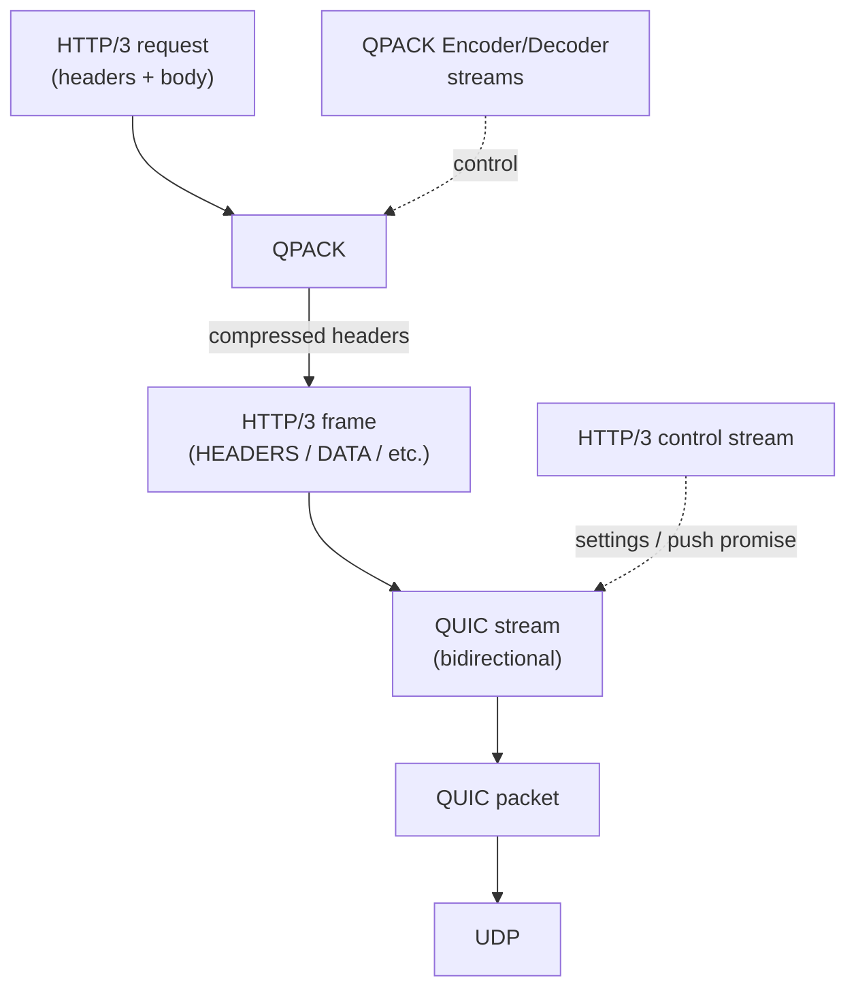
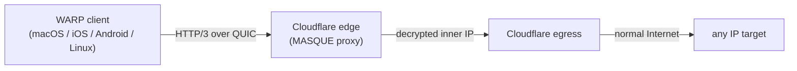

# 課堂 4.10 — HTTP/3 與 MASQUE：把 QUIC 變成 VPN

## 學前知道
- 前置課：[4.7 transport](./4.7-quic-transport.md)、[4.8 handshake](./4.8-quic-handshake.md)、[4.9 advanced](./4.9-quic-advanced.md)
- 預計閱讀時間：**60 分鐘**
- 必讀規格：
  - **RFC 9114** — *HTTP/3*（Bishop, June 2022）
  - **RFC 9204** — *QPACK: Field Compression for HTTP/3*
  - **RFC 9297** — *HTTP Datagrams and the Capsule Protocol*（Schinazi & Pardue, Aug 2022）— **MASQUE 基礎**
  - **RFC 9298** — *Proxying UDP in HTTP*（Schinazi, Aug 2022）— **CONNECT-UDP**
  - **RFC 9484** — *Proxying IP in HTTP*（Schinazi, Oct 2023）— **CONNECT-IP**
  - **draft-ietf-masque-connect-ethernet** — **CONNECT-Ethernet (active draft)**
  - **draft-schinazi-masque-proxy** — MASQUE Architecture overview
- 必讀部署:
  - **Apple iCloud Private Relay**（production-scale CONNECT-UDP）
  - **Cloudflare Zero Trust WARP**（從 WireGuard 遷到 MASQUE，2024）
  - **Google One VPN**（也用 QUIC-based tunneling）
- 必讀原始碼:
  - **quic-go/masque-go**（純 Go，CONNECT-UDP）：https://github.com/quic-go/masque-go
  - **Diniboy1123/usque**（純 Go，Cloudflare WARP re-impl）：https://github.com/Diniboy1123/usque
  - **Cloudflare quiche** + warp-go internal proxies

## 動機

對我們研究目標**最關鍵的一堂**。MASQUE = **把 QUIC 當隧道，把任意 traffic 包進 HTTP/3**——這對 anti-censorship 的意義：

> **如果你的 traffic 看起來跟訪問 Cloudflare / Apple / Google 的普通 HTTPS 一模一樣，GFW 就不能 block 你，除非他也願意 block Cloudflare**。

這是 anti-censorship 邏輯上的「終極武器」。但代價：MASQUE 部署需要可信 server-side proxy，且 GFW 對 MASQUE 已開始 measurement（2024-2025）。

讀完應該回答：
- HTTP/3 跟 H2 wire 差異
- QPACK 跟 HPACK 為何不同設計
- HTTP Datagrams 在 capsule 與 datagram frame 兩條路徑的取捨
- CONNECT-UDP / CONNECT-IP / CONNECT-Ethernet 三者覆蓋的 OSI layer
- MASQUE 對 GFW 的真實威脅與已知 detection 路徑

---

## 核心概念

### 1. HTTP/3 概念架構



關鍵：
- **每個 HTTP/3 request 一條 stream**（雙向 bidi）
- **三條 control streams**: HTTP/3 control + QPACK encoder + QPACK decoder（各自 unidirectional）
- HTTP/3 stream ID 用 QUIC stream ID（low-bit semantics from §4.7）

### 2. HTTP/3 frame types (RFC 9114 §7)

| Type | Frame | 用途 |
|---|---|---|
| 0x00 | DATA | request/response body |
| 0x01 | HEADERS | request/response headers + trailers |
| 0x03 | CANCEL_PUSH | 取消 server push |
| 0x04 | SETTINGS | 連線設定 (只在 control stream) |
| 0x05 | PUSH_PROMISE | server push 預告 |
| 0x07 | GOAWAY | 告知 graceful shutdown |
| 0x0D | MAX_PUSH_ID | server push 上限 |

對比 HTTP/2 frame:
- H2 有 PING、PRIORITY、WINDOW_UPDATE、RST_STREAM → H3 把這些搬到 QUIC layer（PING frame、stream priority via Extensible Priorities, MAX_STREAM_DATA, RESET_STREAM frame）
- 結果 H3 frame 列表更短，因 transport 層 reused

### 3. QPACK — HTTP header 壓縮的 reorder problem

HTTP/2 用 **HPACK** (RFC 7541) 壓 header。HPACK 維護 **dynamic table** 在 sender / receiver 共享。問題：HPACK 假設**順序 delivery**（這在 TCP 下成立）。

HTTP/3 跑在 QUIC，每條 stream 內順序，但**跨 stream 無序**。如果一個 stream 把 entry index N 插入 dynamic table，另一個 stream 用 index N 引用，**順序若亂**，receiver 解錯。

→ **QPACK** (RFC 9204) 重新設計：
- **Encoder stream** (unidirectional, control)：sender 在這條 stream 上 insert table entries
- **Decoder stream** (unidirectional, control)：receiver 回 ack「我已 fully process index ≤ N」
- **Request streams** 引用 index 前 sender 看 receiver 已 ack 多少
- 兩個 mode:
  - **Reference index ≤ ack'd**：保證 receiver 已 process，safe
  - **Reference index > ack'd**：等 receiver 真的 process 才繼續（block on insert count）

trade-off：QPACK 解決 reorder，但增加 RTT 在 dynamic table 大量插入時。Implementation 通常用 conservative dynamic table size。

### 4. SETTINGS — connection-level configuration

HTTP/3 control stream 的第一個 frame 是 SETTINGS：
```
SETTINGS Frame {
  Type (i) = 0x04,
  Length (i),
  Setting Identifier (i),
  Setting Value (i),
  ...
}
```

關鍵 settings:
- `0x06` `MAX_FIELD_SECTION_SIZE`
- `0x21` `H3_DATAGRAM` — 是否支援 HTTP Datagrams（RFC 9297）
- `0x33` `ENABLE_CONNECT_PROTOCOL` — 是否支援 RFC 8441 Extended CONNECT

**對 MASQUE 至關重要**: client 必須在 SETTINGS 宣告 `H3_DATAGRAM = 1` + `ENABLE_CONNECT_PROTOCOL = 1` 才能用 CONNECT-UDP / CONNECT-IP。

### 5. RFC 9297 — HTTP Datagrams 與 Capsule Protocol

**Problem**: HTTP/2 / HTTP/3 都是 stream-based reliable transport。VPN inner IP / UDP 是 datagram-style，需要 **unreliable + 隨意丟**。

**Solution**: **HTTP Datagrams** 提供 unreliable datagram-on-HTTP，兩個 wire 機制：

#### Path A: QUIC DATAGRAM frame
- HTTP/3 over QUIC + QUIC `DATAGRAM` extension (RFC 9221)
- 每個 HTTP Datagram 包成一個 QUIC DATAGRAM frame
- **Unreliable**: 丟就丟
- **Fast**: no retransmission, no head-of-line blocking
- **Constraint**: max size 由 QUIC `max_datagram_frame_size` transport param 決定（典型 1200 bytes）

QUIC DATAGRAM payload 內結構:
```
Quarter Stream ID (i),     # = stream_id / 4，識別關聯的 request stream
HTTP Datagram Payload (..),
```

#### Path B: Capsule Protocol
- 跑在 HTTP/3 stream 上（**reliable**）
- 把 datagram 用 Capsule 包起來在 stream 上 chain
- 用途：HTTP/2 fallback（沒 QUIC），或需要 reliable 的 datagram-like message
- 性能不如 Path A（reliable + ordered + flow control）

**典型 deployment 選 Path A**（CONNECT-UDP / CONNECT-IP），因為 VPN inner UDP / IP 本來 unreliable。

#### Capsule Protocol 結構

每個 capsule:
```
Capsule {
  Capsule Type (i),
  Capsule Length (i),
  Capsule Value (..),
}
```

Capsule types (RFC 9297 §3.3):
- `0x00` DATAGRAM — HTTP Datagram payload（reliable path）
- 後續 RFC 9484、CONNECT-Ethernet 等定義專有 types

### 6. RFC 9298 — CONNECT-UDP

**Goal**: HTTP client 透過 HTTP/3 server 把 UDP packets tunnel 到任意目標。

**Client 發起**:
```
HEADERS
:method = CONNECT
:protocol = connect-udp
:scheme = https
:path = /.well-known/masque/udp/{target_host}/{target_port}/
:authority = proxy.example.com
capsule-protocol = ?1
```

注意 `:method = CONNECT` 是 HTTP/2 Extended CONNECT (RFC 8441)。

**Server 接受**:
```
HEADERS
:status = 200
capsule-protocol = ?1
```

**之後雙方在這條 stream 上交換 HTTP Datagrams**:
- 每個 datagram = 一個 inner UDP payload (raw UDP body, no UDP header)
- Server 對 target 開 UDP socket，把 inner payload 包成 UDP packet 發出
- Reply 從 target 來 → server 把 UDP body 包成 datagram 送回 client

**Wire 上看起來**：client ↔ server 純粹是 HTTP/3 over QUIC over UDP 的 traffic，**第三方 observer 看不到 inner UDP target IP/port**。

### 7. RFC 9484 — CONNECT-IP

**Goal**: 升級到 Layer 3 — tunnel **任意 IP packet**。

**Client 發起**:
```
HEADERS
:method = CONNECT
:protocol = connect-ip
:scheme = https
:path = /.well-known/masque/ip/{ip_proto}/{target}/
:authority = proxy.example.com
capsule-protocol = ?1
```

`/.well-known/masque/ip/` 路徑帶 IP version + 目標。

**之後**:
- 每個 HTTP Datagram = **一個完整 IP packet**（含 IP header）
- Server 解 datagram，把 IP packet 從自己的 tun interface 發出
- Reply 透過 tun interface 收，包成 datagram 回 client

**這就是 VPN 等價**：client 看起來在發 HTTP/3，內部其實是 IP packets。Apple iCloud Private Relay、Cloudflare WARP 都這條 path。

#### CONNECT-IP 額外 capsule types (RFC 9484 §4)

- `ADDRESS_ASSIGN` (0x01): server 告訴 client「你在 inner network 的 IP 是」
- `ADDRESS_REQUEST` (0x02): client 要求 inner IP
- `ROUTE_ADVERTISEMENT` (0x03): server 告訴 client 哪些 inner subnet routes 走這條 tunnel

這就完整覆蓋一個 IP-layer VPN 該有的 IPCP 等價。

### 8. CONNECT-Ethernet (draft-ietf-masque-connect-ethernet, active)

**Goal**: Layer 2 — tunnel Ethernet frames。

用途：
- 跨資料中心 ethernet broadcast
- WoL (Wake-on-LAN) 透過 tunnel
- VPLS 替代

**Wire** 與 CONNECT-IP 類似但 datagram payload 是 Ethernet frame (含 MAC header)。

### 9. MASQUE 完整 deployment 範例：Cloudflare Zero Trust WARP

Cloudflare 2024 把 WARP（消費者 VPN）從 WireGuard 遷到 MASQUE：



從 GFW perspective：
- Client → CF edge 看起來是普通 HTTPS-to-CDN 流量
- 用 CF 共用 cert + ECH + 大 anonymity set
- IP-level：client 連 1.1.1.1 / 1.0.0.1 / 162.159.x.x 等 anycast IPs，這些 IP **不可能單獨 block**（CF 跨產業，block 即 collateral 嚴重）

**這就是 MASQUE 對 anti-censorship 的核心威脅**：把 traffic 藏在「全球 backbone CDN」流量裡，GFW 必須對整個 CDN 開戰才能 block。

### 10. MASQUE 與 GFW 的對抗（2024-2025 measurement）

GFW.report 與獨立 researcher 對 MASQUE 的 observation:
- **2023 Q4**：CF WARP MASQUE 開始 deploy；GFW 大致 transparent
- **2024 Q1**：part of China users 觀察 WARP MASQUE connection 速度顯著降（throughput throttling）
- **2024 Q2**：specific Apple iCloud Private Relay endpoints 被 selective RST
- **2024 Q3**：observed flow-level traffic shaping fingerprint detection（packet size + timing distribution 不同於 typical HTTPS）
- **2024 Q4**：MASQUE 流量被 IP-level 部分 throttle（特別是 mobile network）

**為什麼 GFW 不直接 block？**
- 直接 block CF/Apple = 大量 false positive
- CF 全球 14% Internet traffic → block 即經濟 / 政治 cost 巨大
- → **採 selective throttling / packet drop**，讓 MASQUE 體驗變差但不全 dead

→ 結論：MASQUE 是 **「indirect-fire weapon」**——GFW 必須對 collateral damage 大的 host platform 開戰才能 block。但 GFW 仍能用 traffic-shaping detection 來 selective throttle。

### 11. MASQUE 的 limitations

| Limitation | 描述 |
|---|---|
| **需可信 server-side proxy** | 不 self-hostable on 小 VPS（容易被識別） |
| **隨 HTTP/3 server 改變**：CF/Apple/Google 改版本可能 break | |
| **Inner protocol RTT 額外 layer**：inner-RTT = outer-QUIC-RTT |
| **PMTU 比 raw UDP / WireGuard 小** | header overhead ~120 bytes |
| **Traffic shape fingerprint** 仍 distinguishable in flow-level | |
| **0-RTT** 在 CONNECT-UDP / CONNECT-IP 仍 receive RFC 9001 §9.2 limit | |

### 12. 對我們協議的 inspiration

MASQUE 給我們的關鍵設計觀念：

1. **Tunnel inside ubiquitous traffic**：藏在「全球大 CDN」流量裡是 anti-censorship 的最強防禦
2. **Decouple transport from application**：QUIC datagram 機制讓 inner protocol 完全自由
3. **Use HTTP/3 control stream for capabilities**：協議能力協商可以走 stream，不必額外協議
4. **Layer 3 / Layer 2 abstraction 可選**：CONNECT-UDP < CONNECT-IP < CONNECT-Ethernet，越底層越 powerful

但 MASQUE 也教訓：
- **依賴大平台**是雙刃劍——你只能跟著 CF/Apple/Google 的版本走
- **Self-hosted 部署的 anonymity set = 1** → MASQUE 在 self-host 場景對 anti-censorship 提供有限

→ 我們協議考慮 **MASQUE-compatible + self-hosted-friendly** 混合設計：
- Spec 設計成可以 deploy 在 MASQUE proxy 之內（inner protocol）
- 同時設計成可以 self-host（outer 是 disguised plain QUIC）
- Part 11.5 + Part 7 詳

---

## 與我們協議設計的關聯

| MASQUE feature | 我們協議的選擇 |
|---|---|
| HTTP/3 + capsule protocol | ❓ optional（增加 indistinguishability vs 普通 HTTPS） |
| QUIC DATAGRAM-based inner | ✅ **核心** — inner SOCKS5/IP packet 走 DATAGRAM |
| CONNECT-IP-style Layer 3 | ✅ 採類似 wire 結構 |
| HTTP/3 SETTINGS H3_DATAGRAM=1 declaration | ✅ 模仿真實 MASQUE client |
| Address assignment via capsule | ✅ 採類似機制 |
| Outer: 偽裝 CF-fronted HTTPS | ✅ 採 SNI = cf or apple endpoint via REALITY-style borrowed handshake |

---

## 動手（45 分鐘）

### 練習 A：用 quic-go/masque-go 跑 CONNECT-UDP

```bash
mise use go@latest
git clone https://github.com/quic-go/masque-go
cd masque-go
go run examples/server/main.go &
go run examples/client/main.go --target 8.8.8.8:53 --query example.com
```

觀察 wire（tcpdump UDP port 443）。看 outer 是 HTTP/3 over QUIC traffic，inner 是 DNS query。

### 練習 B：開 WARP 並用 Wireshark 看 MASQUE traffic

1. macOS 安裝 WARP，啟用 MASQUE mode
2. tcpdump UDP port 443 host 162.159.137.85
3. Wireshark dissect 看 QUIC + HTTP/3 + DATAGRAM frame 結構

> redaction：你的 WARP traffic 含真實 inner traffic，不要 commit pcap。

### 練習 C：用 usque 自己跑 CF WARP MASQUE client

```bash
git clone https://github.com/Diniboy1123/usque
cd usque
go run . tunnel --mode socks5 --listen 127.0.0.1:1080
```

curl 透過 SOCKS5:
```bash
curl --socks5 127.0.0.1:1080 https://ipinfo.io
```

看 outbound IP 變成 CF edge IP — 確認 MASQUE tunnel 成功。

### 練習 D：對讀 RFC 9298 + RFC 9484 + masque-go source

讀 masque-go `client/client.go` 中 send/receive datagram 邏輯，對照 RFC 9298 §5 + §6。

---

## 自我檢查

1. **HTTP/3 把 PRIORITY 從 HTTP/2 移除**。priority 怎麼在 H3 重新引入？提示：搜尋 Extensible Priorities RFC 9218。
2. **QPACK 的 dynamic table 在 reorder 場景下需要 sender 等 receiver ack**。如果 sender 完全 disable dynamic table 會怎樣？header 流量 vs latency trade-off?
3. **CONNECT-UDP `:path = /.well-known/masque/udp/{host}/{port}/` 明文**。攻擊者觀察 outer HTTPS 能看到 target host / port 嗎？提示：QUIC 加密。
4. **CONNECT-IP `ADDRESS_ASSIGN` 給 client inner IP**。如果 attacker MITM HTTP/3 layer，能竄改 IP assignment 嗎？描述 attack 與防禦。
5. **MASQUE 對 GFW 的「indirect-fire」威脅**。如果 GFW 對 CF 全 block 會發生什麼？把問題框成 ECON game theory。

---

## 延伸閱讀

- RFC 9297 / 9298 / 9484 + draft-ietf-masque-connect-ethernet
- David Schinazi (主要 author) 的 IETF talks
- Cloudflare blog *Zero Trust WARP: tunneling with a MASQUE* (2024)
- Apple iCloud Private Relay 技術白皮書
- TUM evaluation paper (Steger et al. 2023)
- Probst. *Take the MASQUE off: exploring the new HTTP/3 proxies*. https://thibautprobst.fr/en/posts/masque/
- MASQUE WG mailing list

---

## 研究級補遺

### 1. 學界詞彙

| 口語 | 學界用詞 |
|---|---|
| 「MASQUE」 | **Multiplexed Application Substrate over QUIC Encryption** |
| 「Capsule」 | **Variable-length typed-length-value message in HTTP** |
| 「HTTP Datagram」 | **Unreliable Application-layer datagram** |
| 「TCP CONNECT」 | **HTTP CONNECT method (RFC 7231 §4.3.6)** |
| 「Extended CONNECT」 | **RFC 8441 protocol-specifying CONNECT (HTTP/2)** |
| 「IP-level VPN over HTTP」 | **CONNECT-IP (RFC 9484)** |
| 「Layer-2 VPN over HTTP」 | **CONNECT-Ethernet (draft)** |

### 2. 對手分類學

MASQUE 對手能力：

| 等級 | 能力 |
|---|---|
| M1 | passive observer — 看外層 HTTPS-to-CDN traffic |
| M2 | active drop — selective throttle 特定 endpoint |
| M3 | flow fingerprint — 統計分析識別 MASQUE traffic shape |
| M4 | endpoint blacklist — 全 block CDN（高 collateral cost） |
| M5 | TLS-level attack — 對 CDN 主動 probe |

### 3. 形式化定義

**MASQUE indistinguishability**：

> 對 PPT adversary $A$，protocol $M$ 提供 **HTTPS-indistinguishable tunneling** iff
> $$|\Pr[A(\text{Tunnel}) = 1] - \Pr[A(\text{Real HTTPS}) = 1]| \leq \epsilon$$
> 其中 $\text{Real HTTPS}$ 是同 CDN 的非 MASQUE 流量。

實作：通常 $\epsilon$ 在 wire-level 是 0（CDN 內 traffic 完全一致），但 **flow-level (size, timing)** 仍有差。Part 10 的 traffic analysis 是核心。

### 4. 領域的關鍵論文 / RFC

| 引用 | 為何必追 | 之後在哪堂精讀 |
|---|---|---|
| RFC 9297 / 9298 / 9484 | MASQUE core | 本堂 |
| RFC 9114 / 9204 | HTTP/3 / QPACK | 本堂 |
| RFC 9218 | Extensible Priorities | 本堂 |
| RFC 8441 | Extended CONNECT | 本堂 |
| Schinazi MASQUE architecture draft | overview | 本堂 |
| Steger et al. *Evaluation of MASQUE-Proxying* TUM 2023 | performance measurement | 本堂 |
| Apple iCloud Private Relay docs | production-scale | 本堂 |
| Frolov et al. 系列（GFW + circumvention） | counter-detection | Part 9 |

### 5. 我們協議的座標

- ✅ DATAGRAM-based inner channel
- ✅ Capsule protocol for control plane
- ✅ HTTP/3 SETTINGS-style capability negotiation
- ❓ Outer 是純 HTTP/3 (MASQUE-compatible) vs 自定 QUIC (Hysteria-style)
- ❓ Self-hosted 部署的 anonymity set 補救

### 6. 必追資源 / 社群入口

- IETF MASQUE WG: https://datatracker.ietf.org/wg/masque/
- David Schinazi GitHub: https://github.com/DavidSchinazi
- Cloudflare WARP blog
- net4people/bbs 中文 anti-censorship community

### 7. 開放問題

- **MASQUE traffic shaping** 的 formal anti-detection 仍 open
- **CONNECT-Ethernet** 在 production 的部署 viability
- **Self-hosted MASQUE** 與 CDN-fronted MASQUE 的 game-theoretic 對比
- **PQ-QUIC + MASQUE** 對 PMTU 衝擊

---

> 下一堂（Part 4.11）：quic-go 原始碼通讀。從目錄結構到核心 type，把 RFC 9000/9001/9002 在 production-grade Go 實作中找到每個對應。
