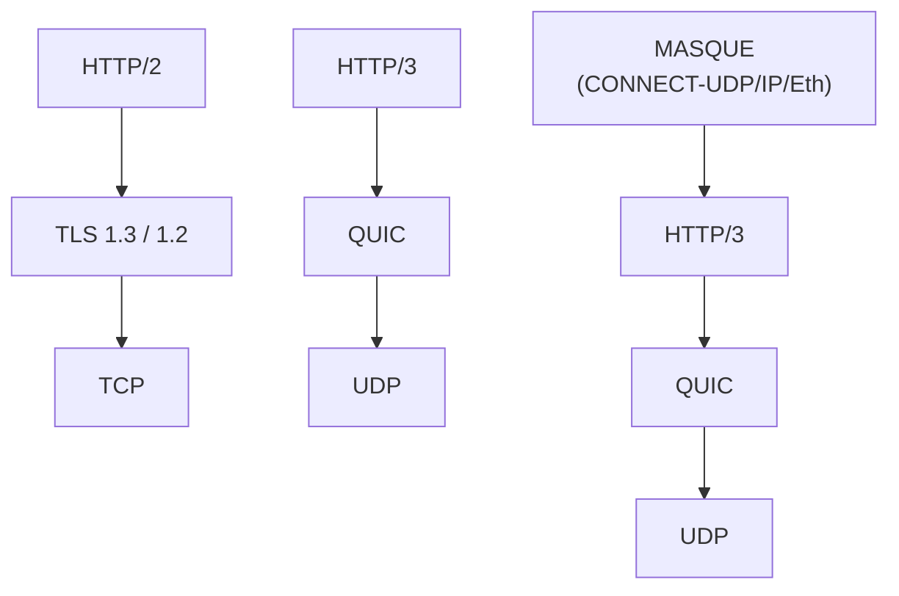
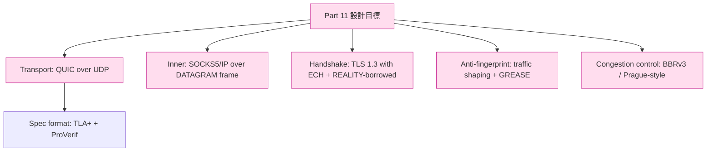

# 課堂 4.12 — HTTP/2 vs HTTP/3 vs MASQUE：從翻牆視角審視

## 學前知道
- 前置課：Part 4 整段（4.1–4.11）
- 預計閱讀時間：**40 分鐘**（這是 Part 4 期末整合課）
- 必讀規格：RFC 9113 (HTTP/2 over TLS)、RFC 9114 (HTTP/3)、RFC 9297/9298/9484 (MASQUE)
- 必讀 measurement：
  - GFW.report 2023-2025 系列 measurement
  - Frolov, Wustrow. *The Use of TLS in Censorship Circumvention*. NDSS 2019
  - Wu et al. *FEP*. USENIX Security 2023 — precis: [`notes/papers/wu-fep-detection.md`](../../notes/papers/wu-fep-detection.md)
- 必讀部署:
  - sing-box / xray-core / Hysteria2 / TUIC 各自選擇

## 動機

Part 4 結尾。把 HTTP/2、HTTP/3、MASQUE 三個 application transport 並排審視，**從翻牆設計者的角度**問四個問題：

1. **對手怎麼識別這條流量？** (fingerprint surface)
2. **對手能怎麼降質？** (interference vector)
3. **部署成本 / anonymity set / robustness** 各如何？
4. **我們協議要選哪一條（或哪些組合）？**

這堂課總結 Part 4 的所有 building block，並把結論直接餵給 Part 11 設計。

---

## 核心概念

### 1. Wire-level 對照



### 2. 對手識別表面

| 維度 | HTTP/2 over TLS over TCP | HTTP/3 over QUIC over UDP | MASQUE (CONNECT-UDP/IP) |
|---|---|---|---|
| **L4 protocol** | TCP（GFW 高度 instrument）| UDP（middle-tier instrument） | UDP（同 H3） |
| **L4 port** | 443（HTTPS 標準）| 443（QUIC over UDP）| 443 |
| **L5 cleartext** | TLS 1.3 ClientHello + SNI | QUIC Initial (long header, version, salt-derived keys, CRYPTO frames 內含 ClientHello + SNI) | 同 H3 (outer) |
| **JA3/JA4 fingerprint** | ✅ 完整 | ✅ JA4 (q variant) | ✅ JA4 (q variant) |
| **Connection ID pattern** | n/a | long header DCID/SCID lengths + content | 同 H3 |
| **Stream multiplexing** | 在 TLS 內看不到 | QUIC stream ID pattern (低 2 bits semantics) | 同 H3, 加 CONNECT-IP 特殊 SETTINGS |
| **Active probe** | TCP 3way + TLS Hello replay | QUIC Initial replay | 同 H3 |
| **Flow-level statistical** | bidirectional bytes/IAT distribution | datagram-heavy pattern (asymmetric) | datagram-very-heavy (一直丟 capsule/DATAGRAM) |
| **SNI** | 明文（除非 ECH）| 加密在 Initial 內，但 well-known key → GFW 可解 | outer SNI 同 H3 |

### 3. Interference vector — GFW 能怎麼搗亂

| 攻擊 | H2-over-TLS-over-TCP | H3-over-QUIC | MASQUE |
|---|---|---|---|
| **DNS-level block** | ✅ 容易（poison）| ✅ 容易 | ⚠️ 部分（如果走 DoH，DNS path 加密）|
| **IP-level block** | ✅ 直接（單 server）| ✅ 直接 | ❌ collateral cost 高（CDN）|
| **TCP RST injection** | ✅ GFW 經典手法 | n/a | n/a |
| **QUIC Initial drop** | n/a | ⚠️ 觀察到 | ⚠️ 觀察到 |
| **SNI-based block** | ✅（除非 ECH）| ✅（同樣 SNI 在 CRYPTO 內） | ❌（outer SNI = CDN public name） |
| **Selective throttling** | 容易 | 容易（drop UDP packet）| 觀察到 |
| **Active probe** | ✅ | ✅ | ⚠️ probe CDN 收效有限 |
| **Flow-fingerprint throttle** | 適用 | 適用 | 適用 — 2024 觀察到 GFW 對 WARP-MASQUE 流量 statistical detection |
| **Block UDP entirely** | n/a | ✅ ISP 級可實施 | ✅ 同 |
| **Block to CDN** | ⚠️ collateral | ⚠️ collateral | ❌ 極高 collateral |

GFW 的選擇是 **「最低 collateral cost 達到 censorship 目標」**。MASQUE 把這條 cost 函數推到極限——但**不是無敵的**。

### 4. 部署成本 / 自主性

| 指標 | H2 | H3 | MASQUE |
|---|---|---|---|
| **Server 需要** | nginx + cert | nginx (with QUIC) / Caddy / Apache + cert | MASQUE-aware proxy (Caddy, masque-go, quiche) + cert |
| **VPS 1-click 部署** | ✅ | ⚠️ 一般 | ❌（需要更多 setup） |
| **可 self-host?** | ✅ | ✅ | ⚠️ 可但 anonymity set = 1 |
| **依賴大平台?** | ❌ | ❌ | ✅（要享 anonymity 必須 fronted on CF/Apple/Google） |
| **Anonymity set** | 跟所有 H2 站共用 | 跟所有 H3 站共用 | 跟整個 CDN 共用 |
| **Maintenance** | 跟著 nginx | 跟著 nginx/Caddy + QUIC implementation | 跟著 CDN + MASQUE draft 演化 |

### 5. 效能

從 Langley 2017 + 後續 measurement:

| 指標 | H2 | H3 | MASQUE |
|---|---|---|---|
| **First byte latency (cold)** | 3 RTT | 1 RTT (TLS 1.3) | 1 RTT outer + tunnel setup |
| **First byte (resumption)** | 1 RTT (TLS 1.3 0-RTT) | 0 RTT | 0 RTT outer + tunnel setup |
| **HoL blocking** | 嚴重 (TCP) | 無 (QUIC stream multiplexing) | 無 (DATAGRAM) |
| **Mobile mobility** | 斷線 | Connection migration | Migration + inner mobility |
| **PMTU friendliness** | TCP fragments | QUIC PMTU discovery | smaller inner MTU (~120B overhead) |
| **Throughput (high BW)** | TCP CUBIC | QUIC BBR | Throughput - 5%~15% vs raw QUIC |

### 6. 從翻牆設計者視角的 take-aways

#### Take-away 1：H2 is dead for self-hosted anti-censorship

- TCP RST injection 對 H2 是 GFW 的工具集核心
- TLS-over-TCP 的 SNI fingerprint + JA3/JA4 是 GFW DPI 主要 target
- 部署成熟但 lab-grade 抗 GFW 表現低

#### Take-away 2：H3 over self-hosted VPS 是 mid-tier 選擇

- 對 statefull TCP-RST 攻擊 immune
- Connection migration 對手機友善
- 但 QUIC Initial 仍含 SNI（除非 ECH）
- GFW 2023+ 對 QUIC long-header pattern 已加 instrument
- xray-core / sing-box 走這條路線（VLESS over QUIC、TUIC）

#### Take-away 3：MASQUE 是 strong-arm 但有依賴

- 跟 CDN 同 anonymity set → IP-level 強防
- 但 traffic shape 仍可被 statistically detect
- 必須跟著 CDN/MASQUE spec 演化
- 適合 mass-market consumer VPN（CF WARP、Apple Private Relay）；對 power user 自主性低

#### Take-away 4：Hybrid 是現實設計

我們協議 Part 11 結論將是 **hybrid**：
- Outer: 走 disguised QUIC（看起來像普通 H3-to-CF）+ ECH-style SNI 加密
- Inner: 走 SOCKS5 / IP-packet over QUIC DATAGRAM
- Self-host 部署 + CDN-fronted 部署兩條 path 共存
- Traffic shaping 抵禦 statistical detection（Part 10/11）

### 7. 三個 transport 對 SOTA 標準的滿足

回顧 README 中的 SOTA 雙目標：
1. **VLESS+REALITY-grade anti-censorship**
2. **Hysteria2 / TUIC-v5-grade speed**

| | H2 | H3 | MASQUE |
|---|---|---|---|
| Anti-censorship (REALITY-grade) | ❌ (SNI 明文 + TCP RST) | ⚠️ (SNI 在 CRYPTO 內但可解) | ✅✅ (outer SNI = CDN) |
| Speed (TUIC-v5-grade) | ❌ (HoL blocking) | ✅ (QUIC + BBR) | ⚠️ (overhead ~5-15%) |
| 純自主部署 | ✅ | ✅ | ❌ |
| 部署成本 | 低 | 中 | 高 |

**我們的設計目標 = ✅✅ all four cells**，這意味我們 **不能直接抄任何一條既有路線**，必須混合 + 創新。

### 8. 跟既有 proxy 協議的對比

| 既有協議 | Transport 選擇 | Anti-censorship 等級 | Speed 等級 |
|---|---|---|---|
| **Shadowsocks** (legacy) | TCP-over-cipher | low (random byte fingerprint) | medium |
| **Trojan** | TLS-over-TCP | medium (SNI + JA3) | medium |
| **VLESS** | TCP/HTTPS | medium | medium |
| **VLESS+REALITY** | TLS-borrowed | high (REALITY) | medium |
| **Hysteria2** | QUIC | medium-high | high (BBRv2 user-space) |
| **TUIC v5** | QUIC | medium | high |
| **Apple iCloud PR** | MASQUE | high (CF + Apple set) | medium-high |
| **CF WARP MASQUE** | MASQUE | high (CF set) | medium-high |
| **(我們目標)** | hybrid | **high (REALITY + MASQUE 雙保險)** | **high (QUIC + custom CC)** |

### 9. Part 4 整段重點 takeaways

走完 Part 4 你已經建立的 mental model:

1. **TLS 1.3 是 28 年密碼學教訓的結晶**——所有設計都有 paper 支撐
2. **QUIC 是 36 年 transport 教訓的結晶**——UDP-based encrypted 是現代答案
3. **MASQUE = QUIC + HTTP/3 + capsule 提供「indirect-fire」anti-censorship**
4. **ClientHello / Initial packet 是最後一塊明文**，所有 fingerprint 與 SNI 都在這裡
5. **ECH + REALITY + MASQUE 是現代 anti-censorship 的三個 building block**
6. **Implementation 細節（quic-go）跟 RFC 之間有 ~20% 灰色地帶**——研究員要 carefully calibrate

## 與我們協議設計的關聯

Part 4 結束時的明確設計收窄：



Part 5 接下來教 spec-first 設計方法論（TLA+、ProVerif、Tamarin），Part 11 直接套用到我們協議設計。

## 動手

### 練習 A：對三個 protocol 抓 pcap 並算 JA3/JA4

對同一目標（cloudflare.com）：
1. curl --http2 → 抓 H2 ClientHello → JA4 (t prefix)
2. curl --http3 → 抓 H3 ClientHello → JA4 (q prefix)
3. WARP MASQUE → 抓 outer H3 → JA4

對比三組 JA4 hash + 流量 shape。

### 練習 B：跑 Wireshark 對三個 protocol 解析

確認 dissector 對三者的 frame-level 拆分。

### 練習 C：對 Wu-FEP 2023 paper 的 16-feature set 分析

讀 [`notes/papers/wu-fep-detection.md`](../../notes/papers/wu-fep-detection.md)，看 16 個 statistical feature 對三個 protocol 的可區分性。**這是我們協議要對抗的 baseline**。

### 練習 D：跨 protocol throughput 比較

對 1GB 大檔下載，分別走 H2-TLS、H3-QUIC、CF WARP MASQUE：
```bash
curl --http2 -o /dev/null https://big-file-url
curl --http3 -o /dev/null https://big-file-url
# 同樣 via WARP socks5
```

比較 throughput / time。

---

## 自我檢查

1. **如果你只能選一條 transport 設計 anti-censorship 協議**，從本堂表格選哪一條？為什麼？哪些 trade-off 是 deal-breaker？
2. **MASQUE 對 self-host 不友善**。能否設計一個「self-host MASQUE 但 anonymity set 大」的方案？提示：跨 server pooling。
3. **GFW 對 H3 long header 的 fingerprint** 包含哪些 features? (回顧 4.7) 哪些可以 obfuscate? 哪些 invariant?
4. **Hysteria2 vs TUIC v5 都是 QUIC-based**，但 wire 設計不同。看兩者源碼比較 — 哪些設計可以借鑑？(這是 Part 7 內容預告)
5. **我們協議要不要支援 plain TLS-over-TCP fallback?** trade-off?

---

## 延伸閱讀

- Frolov et al. NDSS 2019, 2020
- Wu et al. FEP USENIX 2023
- GFW.report 持續 measurement
- xray-core, sing-box, hysteria2, tuic 各自 design docs
- Part 5–12 整個其他 Part 都會回頭引用本堂結論

---

## 研究級補遺

### 1. 學界詞彙

| 口語 | 學界用詞 |
|---|---|
| 「藏在普通流量裡」 | **Steganographic tunneling / cover traffic** |
| 「跟大平台一起的指紋」 | **Anonymity set / cover traffic indistinguishability** |
| 「混合架構」 | **Hybrid covert channel** |
| 「依賴 CDN」 | **CDN-fronted circumvention** |

### 2. 對手分類學

到 Part 4 結束，完整 adversary taxonomy：

| 等級 | 能力 |
|---|---|
| A1 | passive SNI / hostname filtering |
| A2 | JA3 / JA4 hash-based filtering |
| A3 | active TCP RST / QUIC Initial drop |
| A4 | statistical flow fingerprinting (Wu-FEP-style) |
| A5 | adaptive ML classifier |
| A6 | global passive correlation + multi-vantage |
| A7 | endpoint compromise / CDN-level cooperation |

GFW 目前 ~A4 / A5 level。設計新協議目標 = 防到 A5 / A6。

### 3. 形式化定義

**Combined indistinguishability against statistical adversary**:

> 協議 $P$ 提供 $(t, \epsilon)$-statistical-indistinguishability against feature set $F$ iff
> $$\sup_{A \in \mathcal{A}_t^F} |\Pr[A(\text{Real}) = 1] - \Pr[A(P) = 1]| \leq \epsilon$$
> 其中 $\mathcal{A}_t^F$ 是 PPT adversary running in time $t$，用 feature set $F$ 做分類。

這條 framework 是 Part 10 + Part 11 的核心。

### 4. 領域的關鍵 papers

回顧 + 整段引用:
- Langley 2017 (QUIC SIGCOMM)
- Bhargavan 2017 (TLS 1.3 record)
- Cremers 2017 (TLS 1.3 symbolic)
- Frolov 2019, 2020
- Wu 2023 (FEP)
- Bhargavan 2022 (ECH symbolic)
- 各 IETF QUIC / MASQUE / TLS WG 主要作者

### 5. 我們協議的座標（Part 4 結束時的鏡頭）

```
我們協議 = Outer(disguised-QUIC with ECH-style SNI hiding)
        + Inner(SOCKS5/IP over DATAGRAM frame)
        + Anti-fingerprint(traffic shaping + GREASE + handshake mimic via REALITY)
        + Congestion(BBRv3 / Prague custom)
        + Spec(formal model in ProVerif + TLA+, Part 11.10)
        + Implementation(quic-go fork, Part 12)
```

接下來：
- **Part 5**: formal methods 把這份 spec 變 verified
- **Part 6**: VPN internals
- **Part 7**: 既有 proxy 協議拆 — 學別人選擇
- **Part 8**: QUIC-based 既有協議 (Hysteria2, TUIC) 拆
- **Part 9**: GFW research deep-dive
- **Part 10**: traffic analysis (Wu-FEP-style 全光譜)
- **Part 11**: 我們協議的真實設計
- **Part 12**: implement + evaluate

### 6. 必追資源

- IETF QUIC / TLS / MASQUE WGs
- GFW.report
- net4people/bbs

### 7. 開放問題（Part 4 結尾）

- **Formal anti-censorship definition** 仍 open
- **PQ-QUIC** 對 PMTU 衝擊未完整 measure
- **GFW A5+ 對抗** 是 long-term arms race

---

## Part 4 結語

完成 Part 4 = 你已經知道:
- TLS 1.3 wire format 每個 byte
- QUIC packet / frame / stream 三層結構
- MASQUE 三個 RFC 涵蓋 layer 3-4-2
- ECH / REALITY / MASQUE 三條 anti-censorship 路線
- quic-go production code 的 ~20 個關鍵檔案

這些建構 block 在 Part 5–12 全部被反覆引用。下一個 Part（5）我們進入 **「為什麼 spec-first design 是 PhD-level 設計協議的方法」**。

> Part 5 開始。
