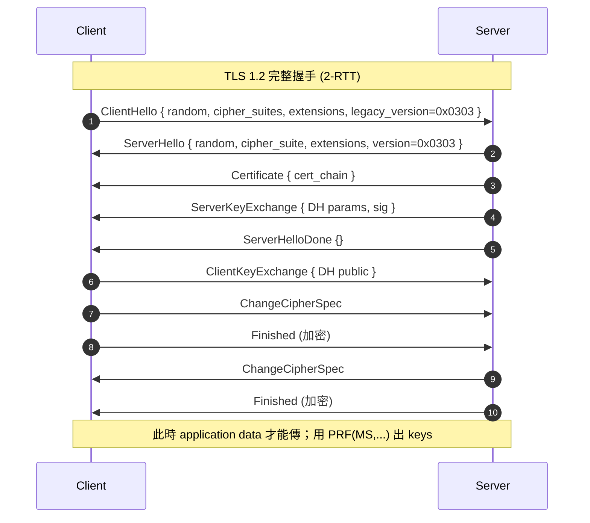
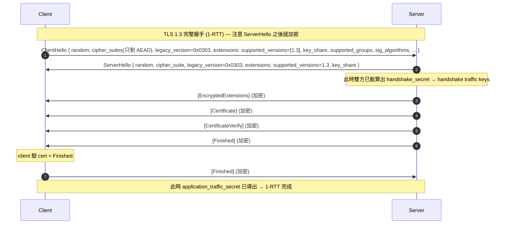
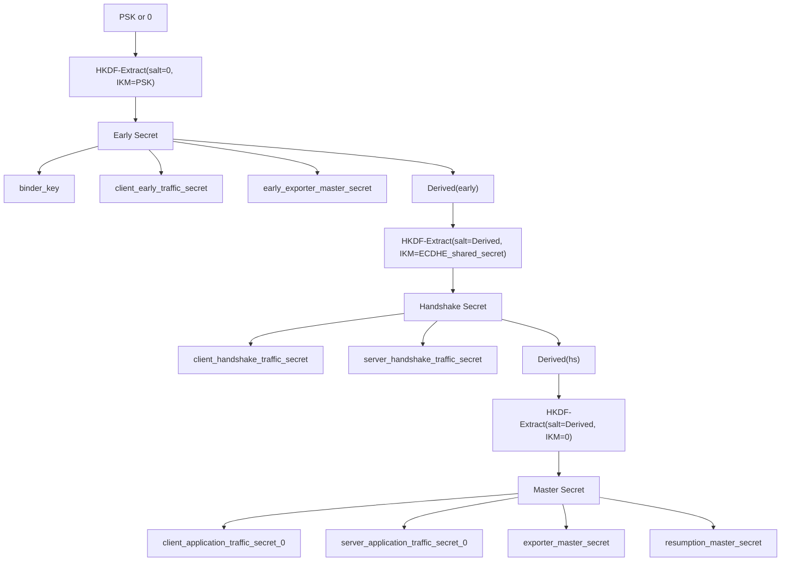
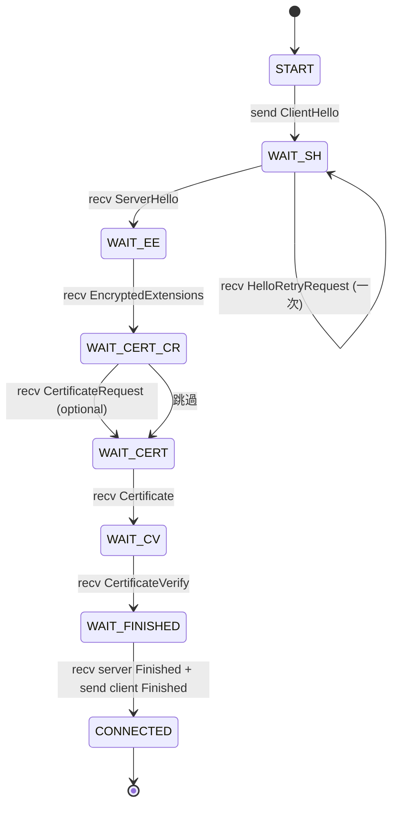

# 課堂 4.2 — TLS 1.2 vs TLS 1.3：差別不在一個 RFC，而在兩個世代

## 學前知道
- 前置課：[4.1 TLS 歷史血淚史](./4.1-tls-history-bloodshed.md)
- 預計閱讀時間：**40 分鐘**
- 必讀規格：
  - RFC 5246 — *The Transport Layer Security (TLS) Protocol Version 1.2*. T. Dierks, E. Rescorla, Aug 2008.
  - RFC 8446 — *The Transport Layer Security (TLS) Protocol Version 1.3*. E. Rescorla, Aug 2018. 特別讀 §1.3「Major Differences from TLS 1.2」與 Appendix C「Implementation Notes」。
- 必讀論文：
  - Bhargavan et al. *Downgrade Resilience in Key-Exchange Protocols*. IEEE S&P 2016 — 形式化「為什麼 1.3 的 transcript binding 可以擋 downgrade」。precis: [`notes/papers/adrian-logjam.md`](../../notes/papers/adrian-logjam.md) 後續引用。
  - Beurdouche et al. *A Messy State of the Union: Taming the Composite State Machines of TLS*. IEEE S&P 2015 (SMACK)。 — 為什麼 1.2 那麼多 state machine bug。
- 必讀原始碼：
  - rustls source: [`rustls/src/client/handshake.rs`](https://github.com/rustls/rustls) 與 [`rustls/src/server/handshake.rs`](https://github.com/rustls/rustls)（最新 main tag）— **rustls 沒有 TLS 1.2 ClientHello fallback；很乾淨的 1.3-only mental model**

## 動機

4.1 把 28 年的死亡史攤開，但問題是：**所以 RFC 5246 跟 RFC 8446 到底逐欄逐 message 哪裡不一樣？** 這堂課用「**對齊比較**」把兩個 spec 並排逐項拆，目的是建立你之後讀 RFC 時的座標感。

讀完之後你應該能在沒有 RFC 在手的情況下回答：
- TLS 1.3 ClientHello 跟 TLS 1.2 ClientHello 同樣的欄位（`legacy_version` 永遠 `0x0303`）是怎麼回事？版本協商實際在哪裡？
- 為什麼 1.3 的 ServerHello 之後立刻切到加密狀態，而 1.2 直到 ChangeCipherSpec 才切？
- 為什麼 1.3 沒有 `ChangeCipherSpec` 卻仍要傳這個 message？
- 為什麼 1.3 的 PSK 跟 1.2 的 session resumption 看起來功能相同但實際完全不同？

---

## 核心概念

### 1. Handshake message 集合的「砍/留/改/新」

我把兩個版本的 handshake message 列成一張對照表，每個欄位標 **「砍/留/改/新」**：

| Message | TLS 1.2 (RFC 5246) | TLS 1.3 (RFC 8446) | 結論 |
|---|---|---|---|
| `ClientHello` | ✅ | ✅，但 `cipher_suites` / `compression_methods` / `legacy_version` 全變 legacy；真實協商搬到 extensions | 改 |
| `ServerHello` | ✅ | ✅，但 `cipher_suite` 只挑對稱原語 + hash；`key_share` extension 帶 server DH | 改 |
| `HelloRetryRequest` | ❌ | ✅（用 ServerHello 的 wire format 但 random = 特殊常數） | 新 |
| `EncryptedExtensions` | ❌ | ✅（從 ServerHello 之後立刻就在加密內） | 新 |
| `Certificate` | ✅ 明文 | ✅ 加密 | 改 |
| `CertificateRequest` | ✅ 明文 | ✅ 加密 | 改 |
| `ServerKeyExchange` | ✅（DHE/ECDHE param 在這裡） | ❌（搬進 ClientHello/ServerHello 的 `key_share` extension） | 砍 |
| `ServerHelloDone` | ✅ | ❌（不需要——`Finished` 結束就好） | 砍 |
| `CertificateVerify` | ✅ 對 handshake hash 簽 | ✅，但簽的是新的 transcript hash 結構 + context string | 改 |
| `Finished` | ✅，verify_data = PRF(master_secret) | ✅，verify_data = HMAC(finished_key, transcript_hash) | 改 |
| `ChangeCipherSpec` | ✅，切到 record encryption | ⚠️ **僅作為 middlebox compat dummy**（RFC 8446 §5）| 改（語意） |
| `NewSessionTicket` | ✅，session resumption | ✅，但**只在 handshake 完成後** + 攜帶 PSK identity + lifetime | 改（時機/語意） |
| `KeyUpdate` | ❌ | ✅，post-handshake 換 traffic key | 新 |
| `HelloRequest` / renegotiation | ✅ | ❌（renegotiation 整個拿掉） | 砍 |
| Post-handshake `Certificate` 請求 | ❌ | ✅（post-handshake authentication） | 新 |

### 2. Wire-level 對比：兩種 handshake 的時間軸





關鍵差異總結：

1. **TLS 1.2 是 2-RTT，1.3 是 1-RTT**（不含 0-RTT；0-RTT 是 0-RTT 第四堂講）
2. **TLS 1.2 ServerHello 後仍是明文，直到雙方都送出 `ChangeCipherSpec`；1.3 ServerHello 後立刻切到 handshake key 加密**
3. **TLS 1.2 的 cert 是明文的；1.3 的 cert 在 `EncryptedExtensions` 之後，已是加密**
4. **TLS 1.2 PRF 是 SHA-256(MS, "label", ...) 多次混；1.3 用 HKDF-Extract/Expand-Label，每階段 secret 都嚴格 derive**

### 3. Cipher suite 命名規則 — 從 `WITH` 到 fused AEAD

TLS 1.2 的 cipher suite 命名是 4 段：

```
TLS_ECDHE_RSA_WITH_AES_256_GCM_SHA384
^^^^ ^^^^^^^^^ ^^^      ^^^^^^^^ ^^^^^^
 (1)   (2)    (3)        (4)     (5)

(1) protocol
(2) key exchange algorithm
(3) authentication algorithm (cert signing)
(4) symmetric AEAD
(5) hash for HKDF/PRF
```

TLS 1.3 的 cipher suite 名變成 2 段：

```
TLS_AES_256_GCM_SHA384
^^^^ ^^^^^^^^^^^ ^^^^^^
 (1)    (2)       (3)

(1) protocol
(2) symmetric AEAD
(3) hash
```

為什麼？因為 1.3 **把 key exchange algorithm 與 authentication algorithm 從 cipher suite 拆出來**：
- Key exchange → 由 `supported_groups` + `key_share` extensions 決定
- Authentication → 由 `signature_algorithms` extension 決定

這個重構解決了 1.2 cipher suite 爆炸的問題（每加一個 KEX + 每加一個 hash → cipher suite 數量乘）。TLS 1.3 規定的合法 cipher suite **只有 5 個**：

| TLS 1.3 cipher suite | AEAD | Hash |
|---|---|---|
| `TLS_AES_128_GCM_SHA256` | AES-128-GCM | SHA-256 |
| `TLS_AES_256_GCM_SHA384` | AES-256-GCM | SHA-384 |
| `TLS_CHACHA20_POLY1305_SHA256` | ChaCha20-Poly1305 | SHA-256 |
| `TLS_AES_128_CCM_SHA256` | AES-128-CCM | SHA-256 |
| `TLS_AES_128_CCM_8_SHA256` | AES-128-CCM-8 | SHA-256 |

對比之下，OpenSSL 1.0.2 跑 TLS 1.2 時可以列出**幾百個** cipher suite。Cipher suite 大爆炸本身就是 attack surface（SMACK paper：state machine 寫不對導致 1.2 implementation 經常選錯路）。

### 4. Key derivation：從 PRF 到 HKDF

#### TLS 1.2 PRF（RFC 5246 §5）

```
PRF(secret, label, seed) = P_<hash>(secret, label + seed)
  P_hash(secret, seed) = HMAC(secret, A(1) + seed) || HMAC(secret, A(2) + seed) || ...
  A(0) = seed
  A(i) = HMAC(secret, A(i-1))
```

PRF 用法：
- `master_secret = PRF(pre_master_secret, "master secret", random_C + random_S)`
- `key_block = PRF(master_secret, "key expansion", random_S + random_C)`
- 從 `key_block` 切出 `client_write_key | server_write_key | client_write_IV | server_write_IV`

問題：
1. 同一個 `master_secret` 既用於 application data 也用於 `Finished` 的 verify_data → key reuse
2. 從 `master_secret` 一次切出所有 keys，沒有「階段」概念，前向保密只靠 ephemeral KEX

#### TLS 1.3 Key Schedule（RFC 8446 §7.1）



特點：

1. **三段 HKDF-Extract**：先把 PSK 抽（沒 PSK 就用 0），再把 ECDHE shared secret 抽，再把 0 抽。每階段都「重新洗一次熵」
2. **每階段都 derive 自己的 traffic key**：early / handshake / application 三段各有獨立 key
3. **PSK 跟 ECDHE 是混合的**：1.3 允許 PSK + ECDHE 同時用（`psk_dhe_ke` mode）→ 兩個 entropy source 都需要被破才能拿到 application key
4. **Transcript hash 進入 derivation**：`Derive-Secret(Secret, Label, Messages)` 第三個參數是「**目前為止所有 handshake message 的 hash**」，這就是 transcript binding 的實現

公式：
```
Derive-Secret(Secret, Label, Messages) =
    HKDF-Expand-Label(Secret, Label,
                      Transcript-Hash(Messages),
                      Hash.length)

HKDF-Expand-Label(Secret, Label, Context, Length) =
    HKDF-Expand(Secret, HkdfLabel, Length)
  where HkdfLabel:
    uint16 length = Length
    opaque label<7..255> = "tls13 " + Label
    opaque context<0..255> = Context
```

「`tls13 ` 前綴」是為了防 cross-protocol attack：QUIC 用 `"quic "` 前綴；DTLS 1.3 用 `"dtls13 "` 前綴。如果攻擊者把 QUIC handshake transcript 餵進 TLS 1.3 server，HKDF 推不出同一個 secret，因為 label 不同。**這個前綴設計是 SLOTH (Bhargavan-Leurent NDSS 2016) transcript collision 攻擊的結構性修補**。

### 5. Version negotiation 機制的重構

這是 1.3 spec 最深的設計改動之一。背景：1.2 之前，client 的 ClientHello 第一個欄位 `legacy_version`（uint16）直接寫支援的最高版本，server 回 ServerHello 時也填一個 `legacy_version`。如果中間 middlebox 看到不認識的版本號就直接丟封包——這是 IETF 後來稱為 **middlebox ossification** 的問題。

→ TLS 1.3 設計時測試發現大約 **3%~5%** 的 Internet middlebox 看到 ClientHello 的 `legacy_version=0x0304` (TLS 1.3) 就拋棄連線。如果 1.3 真的把 `legacy_version` 填 0x0304，部署率會被打殘。

解法：
1. `legacy_version` 在 1.3 永遠填 `0x0303`（看起來像 TLS 1.2）
2. **真正的版本協商搬到 `supported_versions` extension**（RFC 8446 §4.2.1）
   - Client 在 ClientHello.extensions 裡填 `supported_versions = [0x0304, 0x0303, ...]`
   - Server 在 ServerHello.extensions 裡用 `supported_versions = 0x0304` 回應

但這還不夠安全。**downgrade detection**：1.3 server 強制在 `ServerHello.random` 的最後 8 bytes 填特定常數，如果它要回應 1.2 或更低版本：
```
"DOWNGRD\x01"   ← 表示 server 支援 1.3，但回應 1.2
"DOWNGRD\x00"   ← 表示 server 支援 1.3，但回應 1.1 或更低
```

1.3 client 解到 ServerHello.random 結尾是這個常數就 **abort**。

→ Bhargavan et al. *Downgrade Resilience in Key-Exchange Protocols* (S&P 2016) 證明：在 attacker 能改 wire 但無法偽造 server 簽章的前提下，這個常數 + supported_versions transcript binding 一起，TLS 1.3 的 version negotiation **是 downgrade-resilient 的**。

### 6. State machine：1.2 的混亂 vs 1.3 的線性

**1.2 SMACK paper (Beurdouche et al. S&P 2015)** 的核心觀察：1.2 spec 沒嚴格規範 message 順序與必要性。例如 `ServerKeyExchange` 在 RSA-KE 模式下可以省略，但 SMACK 發現有些 client 在 ECDHE 模式下「忘記」要求 `ServerKeyExchange` 而仍接受 RSA-style ClientKeyExchange——導致 server 可以「假裝是 RSA 模式」當作 oracle 來打。

**1.3 直接固定 state machine**：每個 client / server 角色寫成 **finite state automaton**（RFC 8446 Appendix A），明確規範哪些 message 在哪些狀態 valid。



這就是 SMACK 的根本修補。**這也是 Part 5 形式化驗證的入口**：state machine 規範 = Tamarin / ProVerif 可以直接吃的 protocol description。

### 7. ChangeCipherSpec 的「殭屍化」

TLS 1.2：`ChangeCipherSpec` 是「告訴對方下一條 record 用新 key 加密」的信號。
TLS 1.3：record 加密狀態完全由 key schedule 階段決定，**不需要 ChangeCipherSpec**。

但 RFC 8446 §5 規定 1.3 endpoint **可以**（且實作通常會）發送一個假的 `ChangeCipherSpec` 在 ClientHello/ServerHello 之後。為什麼？**middlebox compatibility mode**——很多舊 middlebox 看到 1.2-format ServerHello 後沒 ChangeCipherSpec 會 timeout。所以 1.3 用一條無語意的 dummy CCS 把 middlebox 騙過去。

這個「為了相容過去的破爛而留下的儀式」就是 ossification 的活化石。**Part 4.7 講 QUIC 時會看到，IETF 設計 QUIC 時直接跳到 UDP，部分動機就是「TLS 1.3 的 wire format 已被 middlebox 鎖死，再改也擋不住 ossification」**。

### 8. Session resumption：1.2 ticket vs 1.3 PSK

1.2 session resumption 兩種：
- **Session ID-based**（RFC 5246）：server 保留 session 狀態
- **Session ticket**（RFC 5077）：server 把加密的 session 狀態交給 client 保管，下次 client 帶回

1.2 ticket 的問題：
- ticket key 經常是 long-lived → 一旦 leak，**所有歷史 session 全部解密**（Pickle attack on session tickets）
- ticket 跟 application data 共用 key derivation 路徑，無 key isolation

1.3 PSK（RFC 8446 §4.6.1, §2.2）：
- Session resumption 改稱「PSK」，跟 external PSK 用同一條 wire 機制
- `NewSessionTicket` 含 `ticket_lifetime`、`ticket_age_add`、`ticket_nonce`、`ticket`（不透明 server state）、`extensions`
- Client 帶 PSK identity 回來時放在 `pre_shared_key` extension 裡
- **resumption_master_secret 跟 application_traffic_secret 是不同的 secret**（Key Schedule 圖中可見）→ ticket 被破不會立刻洩漏 application data

但 1.3 PSK 模式啟用了 **0-RTT**（下一堂課 4.5 詳講）。0-RTT 是雙刃劍——這就是 4.5 的核心。

---

## 與我們協議設計的關聯

從 1.2 → 1.3 的改動清單，抽出對我們新協議的設計準則：

| 1.3 改動 | 我們協議的對應決定 |
|---|---|
| Cipher suite 拆 KEX / Auth / Symmetric / Hash | 我們新協議同樣 modular；每塊可獨立替換 |
| HKDF-based key schedule，每階段獨立 secret | 採用同一架構，但增加「混淆專用 secret」階段 |
| `tls13 ` label prefix 防 cross-protocol | 我們協議用自己的 label space（例如 `mysota1 `），同樣前綴 bound |
| State machine 嚴格 FSA | 我們協議的 spec 在 Part 11.10 直接用 ProVerif/Tamarin 表達 |
| `legacy_version=0x0303` 騙 middlebox | 我們在 transport 層（QUIC datagram）跳過此問題；但如果走 TLS-over-TCP，需學 REALITY 模仿同樣 ossification 形狀 |
| 自殺 downgrade sentinel in ServerHello.random | 我們協議任何 negotiation 都 transcript-bound + sentinel-bound |
| Renegotiation 拿掉 | 我們協議沒有 renegotiation，只有 `KeyUpdate`-style rekey + new connection |
| Compression 拿掉 | 我們協議的 traffic shaping 不依賴 compression（避 CRIME/BREACH） |

### Ossification 的教訓

TLS 1.3 留下假 `legacy_version`、假 `ChangeCipherSpec`、假 session ID echo，全是因為 middlebox 把 wire format 鎖死了。**這對我們的協議設計極其重要**：

- 如果走 TCP-over-TLS path，我們的 wire format **必須** 跟現有 TLS 1.3 ClientHello 拓撲 indistinguishable（REALITY 的策略）
- 如果走 UDP path（QUIC），需要面對 GFW 對 QUIC 的策略（Part 9 詳）
- 任何「我自己發明 wire format」99% 會被 middlebox 鎖死，且在生產環境部署率慘烈

Part 11.4 與 Part 7 會反覆回來這個 trade-off。

---

## 動手（30 分鐘）

### 實驗 A：用 openssl 看 1.2 vs 1.3 cipher suite 列表

```bash
openssl ciphers -v "TLSv1.2" | head
openssl ciphers -v "TLSv1.3"
```

數一下兩邊的數量——1.2 通常列 100+，1.3 列 5 個。

### 實驗 B：強制 client 用特定版本連到 Cloudflare

```bash
# TLS 1.2 only
openssl s_client -connect cloudflare.com:443 -tls1_2 -msg | head -50

# TLS 1.3 only
openssl s_client -connect cloudflare.com:443 -tls1_3 -msg | head -50
```

`-msg` 會印出 handshake message 標題。觀察：
- 1.2 你會看到 `ClientHello`、`ServerHello`、`Certificate`、`ServerKeyExchange`、`ServerHelloDone`、`ClientKeyExchange`、`ChangeCipherSpec`、`Finished`
- 1.3 你會看到 `ClientHello`、`ServerHello`、然後 `EncryptedExtensions` 之後的東西**全部加密**（你只看到 `[encrypted handshake]`）

這個視覺對比讓你「看到」invariant #4「encrypt early」的具象。

### 實驗 C：用 Wireshark 看 ChangeCipherSpec 殭屍

抓一條本地 curl 到 Cloudflare 的 TLS 1.3 連線：

```bash
sudo tcpdump -i en0 -w /tmp/tls13.pcap host cloudflare.com and port 443 &
curl --tls13-ciphers TLS_AES_256_GCM_SHA384 https://cloudflare.com -o /dev/null
sudo killall tcpdump
wireshark /tmp/tls13.pcap
```

在 Wireshark filter `tls` 看一下會發現：
- 還是有 `Change Cipher Spec` packet
- 但 RFC 8446 規定它**沒語意**——這就是 middlebox compat dummy 的長相

> redaction：tcpdump 抓的 pcap 含你的真實 IP，不要 commit。實驗完刪掉。

### 實驗 D：對讀 RFC 5246 §7 跟 RFC 8446 §4

把兩個 RFC 的 message 定義並排，找出對應關係。給自己 30 分鐘：
1. RFC 5246 §7.4.1 ClientHello vs RFC 8446 §4.1.2 ClientHello
2. RFC 5246 §7.4.2 ServerHello vs RFC 8446 §4.1.3 ServerHello
3. RFC 5246 §7.4.9 Finished vs RFC 8446 §4.4.4 Finished

每個欄位都標一下「砍/留/改/新」。這個練習比我這堂課寫的對照表更有用——因為你會踩到 spec 裡那些 1.3 仍保留但 1.2 沒有的欄位（例如 ClientHello 的 `legacy_compression_methods`）。

---

## 自我檢查

研究級題目：

1. **TLS 1.3 為何 `legacy_version=0x0303`？如果 active attacker 改成 `0x0304`，會發生什麼？** 列出對 1.3-aware 與非 1.3-aware middlebox 的兩種結果。
2. **`tls13 ` label prefix 是怎麼防 cross-protocol 的？** 描述一個假設的攻擊：QUIC 跟 TLS 1.3 共用 ECDHE share 的場景，prefix 為什麼讓 cross-protocol HKDF derivation 不互通。
3. **`ServerHello.random` 最後 8 bytes 的 sentinel 為什麼放在 random 裡而不是另一個 extension？** （提示：random 在 1.0~1.2 已存在，sentinel 必須對舊 client invisible）
4. **TLS 1.3 三段 HKDF-Extract 第三段的 `salt = Derived(handshake_secret, "derived", "")`，`IKM = 0`**。為什麼 IKM 是 0 而不是另一個 secret？這個設計在 PSK + ECDHE 同時存在時提供什麼？（提示：考慮 forward secrecy 與 PSK identity 洩漏的 scenario）
5. **TLS 1.3 PSK 跟 1.2 session ticket 都是 server-side state**。為什麼 1.3 PSK 不會被 Pickle attack 完全打？描述 ticket 加密 key + resumption_master_secret 的 isolation。

---

## 延伸閱讀

- **必讀**：Beurdouche et al. *A Messy State of the Union: Taming the Composite State Machines of TLS*. IEEE S&P 2015. (SMACK)
- Bhargavan et al. *Downgrade Resilience in Key-Exchange Protocols*. IEEE S&P 2016.
- Bhargavan, Leurent. *Transcript Collision Attacks: Breaking Authentication in TLS, IKE and SSH (SLOTH)*. NDSS 2016. — 為何 hash collision 在 transcript 裡致命，1.3 的 hash 強度設計理由。
- David Wong (`@cryptodavidw`) 的 *Real-World Cryptography* (Manning, 2021) §9 — 對 TLS 1.3 工程細節的最好白話版本。
- Filippo Valsorda (`@filosottile`) 的 [TLS 1.3 in Go](https://blog.filippo.io/tls-1-3-in-go/) — 從 implementation 角度的視角。
- Aviram et al. *Practical Forgery Attacks on AES-GCM with Short Tags*（後續學術 follow-up）— RFC 8446 為何限制 AEAD record limit。

---

## 研究級補遺

### 1. 學界詞彙

| 口語 | 學界用詞 |
|---|---|
| 「TLS 1.2 還支援的舊路徑」 | **Legacy ciphersuites / legacy modes** |
| 「Middlebox 把 wire format 鎖死」 | **Protocol ossification**（IETF 用語，Wang & Bonaventure 等人 measurement） |
| 「假裝是舊版本」 | **GREASE-style randomization** + **legacy_version masquerading** |
| 「session 恢復」 | **Session resumption / abbreviated handshake / 0-RTT data** |
| 「ChangeCipherSpec 但無語意」 | **Compatibility mode message / sentinel message** |
| 「Server 簽 transcript 證明自己是 server」 | **Server-side proof-of-possession via CertificateVerify** |
| 「Server 簽的 context」 | **Context string** — RFC 8446 §4.4.3 詳列固定 string「TLS 1.3, server CertificateVerify」 |
| 「TLS 1.3 的 0.5-RTT」 | **Server-to-client early data window**（spec 未正式命名但 implementation 普遍如此稱） |

### 2. 對手分類學

1.2 → 1.3 主要強化的對手能力等級：

| 攻擊類型 | 1.2 是否易受 | 1.3 是否易受 |
|---|---|---|
| Passive eavesdrop with RSA-KE | ✅ | ❌（無 RSA-KE） |
| Active MITM downgrade to export | ✅ (Logjam) | ❌（supported_versions + sentinel） |
| Active MITM cipher suite manipulation | ⚠️ (SMACK) | ❌（FSA strict） |
| Cross-protocol oracle (DROWN-style) | ✅ | ❌（無 RSA-KE，且 label prefix） |
| Padding oracle (Lucky13-style) | ⚠️ (mitigated implementation) | ❌（無 CBC，AEAD only） |
| Compression-based (CRIME) | ✅ if compress on | ❌（無 compression） |
| Memory disclosure (Heartbleed) | implementation issue | ❌（無 heartbeat） |
| Renegotiation injection (Marsh Ray) | ✅ | ❌（無 renegotiation） |
| Transcript collision (SLOTH) | ✅ if MD5/SHA1 in sig_alg | ❌（forbidden by spec） |
| Replay 0-RTT | n/a | ⚠️ open（4.5 詳講） |
| Selfie attack on PSK | n/a | ⚠️ (Drucker-Gueron 2019) |

### 3. 形式化定義

「Downgrade resilience」的 Bhargavan-Brzuska 形式化（S&P 2016）：

> 對 protocol $P$ 與 attacker $A$ 控制 wire，協議 $P$ 是 **downgrade-resilient against profile $\Pi$** iff $\forall$ negotiated configuration $c$ in $\Pi$，attacker 不能讓 honest parties commit 到 $c' \prec c$（其中 $\prec$ 是「弱於」的 partial order）unless 攻破 underlying primitive。

對 TLS 1.3 而言，$\Pi$ 是 (version, cipher suite, KEX group, sig algorithm) 的笛卡兒積，$\prec$ 是「export-grade 弱於 normal」「SHA-1 弱於 SHA-256」「512-bit DH 弱於 2048-bit」這類。

### 4. 領域的關鍵論文（本堂相關）

| 引用 | 為何必追 | 之後在哪堂精讀 |
|---|---|---|
| RFC 8446 — TLS 1.3 | 必精讀 | Part 4.3 |
| RFC 5246 — TLS 1.2 | 為了對比 | 本堂 |
| Beurdouche et al. *A Messy State of the Union (SMACK)*. S&P 2015 | 為何 1.3 改 state machine | 本堂 + Part 5.3 |
| Bhargavan et al. *Downgrade Resilience*. S&P 2016 | downgrade 形式化 framework | 本堂 + Part 5 |
| Bhargavan, Leurent *SLOTH*. NDSS 2016 | transcript collision | Part 3.5 |
| Krawczyk. *Cryptographic Extraction and Key Derivation: The HKDF Scheme*. CRYPTO 2010 | HKDF 形式化 | Part 3.7 |
| Dowling-Fischlin-Günther-Stebila. *A Cryptographic Analysis of the TLS 1.3 Handshake Protocol Candidate*. JCS 2021 (CCS 2015 origin) | MSKE model | Part 5.7 |

### 5. 我們協議的座標

到此堂為止，協議設計空間裡已確定的東西：
- ✅ AEAD-only record（Krawczyk 2001 結論）
- ✅ HKDF-based key schedule with per-stage independent secrets（1.3 結構）
- ✅ Transcript hash binding 所有 negotiation 參數
- ✅ Cipher suite naming = AEAD + Hash only（KEX/sig 拆出）
- ✅ Strict FSA state machine（SMACK 教訓）
- ❓ Wire format 是否要模仿 TLS 1.3 / QUIC（REALITY vs Hysteria2 vs MASQUE 三種路線；Part 7、8、10 比較）
- ❓ 是否允許 0-RTT（Part 4.5 詳判斷）

### 6. 必追資源 / 社群入口

- **IETF TLS WG 郵件**：https://mailarchive.ietf.org/arch/browse/tls/ — 1.3 draft 演化每一輪信件
- **tls13.xargs.org** — 一個逐 byte 拆 TLS 1.3 handshake 的網站，極好的對讀工具（Part 4.3 會直接用）
- **rustls source** — 沒有 1.2 包袱的乾淨 1.3 implementation
- **BoringSSL source** — Chrome 用的 TLS implementation；對比 1.2/1.3 共存 codebase 的 trade-off

### 7. 開放問題

- TLS 1.3 + post-quantum key exchange hybrid 模式（X25519MLKEM768, draft-kwiatkowski-tls-ecdhe-mlkem）的 downgrade resilience 是否仍由 sentinel + transcript binding 覆蓋？
- ChangeCipherSpec dummy 在 wire 上的存在會不會反過來成為 GFW 指紋的一部分？（Part 9 + Part 10 + Part 11 都會回到這個問題）
- 1.3 的 `legacy_version=0x0303` 在 ossification 解開之後是否能升級？目前 IETF 對此態度悲觀

---

> 下一堂（Part 4.3）：拿一份真實 ClientHello 的 hex dump，**逐 byte 對 RFC 8446 結構拆**。
