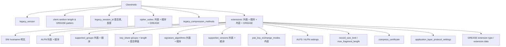

# 課堂 4.4 — TLS 擴展深度與 JA3/JA4 指紋學

## 學前知道
- 前置課：[4.3 TLS 1.3 握手逐 byte 解剖](./4.3-tls13-handshake-byte-level.md)
- 預計閱讀時間：**50 分鐘**
- 必讀規格：
  - RFC 6066 — *Transport Layer Security (TLS) Extensions: Extension Definitions*（SNI, max_fragment_length, server_certificate_type 等）
  - RFC 7301 — *Application-Layer Protocol Negotiation Extension*（ALPN）
  - RFC 8446 — TLS 1.3 §4.2「Extensions」
  - RFC 8701 — *GREASE for TLS*
  - RFC 8449 — *Record Size Limit Extension for TLS*
  - RFC 8879 — *TLS Certificate Compression*
  - RFC 9345 — *Delegated Credentials for TLS*
  - draft-vvv-tls-alps（ALPS, Application-Layer Protocol Settings）
- 必讀規範：
  - **JA3**：Althouse, Atkinson, Atkins (Salesforce, 2017) — https://github.com/salesforce/ja3
  - **JA4 / JA4+**：FoxIO LLC, John Althouse 等 (2023) — https://github.com/FoxIO-LLC/ja4/blob/main/technical_details/JA4.md
- 必讀原始碼：
  - Suricata `src/util-ja3.c`、`src/output-json-tls.c` — JA3 在 IDS 內的計算
  - utls (uTLS) library — Go 的「假裝是 Chrome ClientHello」實作
  - **xray-core REALITY** transport — 為了 evade JA3/JA4 對抗的 production code

## 動機

如果 4.3 教你「逐 byte 把 ClientHello 拆出來」，這堂教你 **「拆出來之後怎麼把它變成一個 fingerprint」，以及防禦方怎麼用這個 fingerprint 殺你**。

ClientHello 是 TLS 1.3 之後唯一還剩的大塊明文。**所有 censorship + threat-detection + bot 過濾，都靠對 ClientHello 的 statistical fingerprint**。對我們設計新協議：**fingerprint resistance 是 wire-format 設計第一公民**，不是事後 mitigation。

讀完應該回答：
- JA3 跟 JA4 為什麼是兩個 generation，差別不只是 hash 演算法
- 為什麼 Chrome 從 2023 開始 randomize extension order，但 JA4 仍然能識別 Chrome
- REALITY 是怎麼「借用真實 TLS server 的 ClientHello」做 indistinguishability
- 我們協議要選 A / B / C 三種 fingerprint resistance 策略中的哪一條

---

## 核心概念

### 1. ClientHello 的「指紋表面」（fingerprint surface）

ClientHello 暴露的「可被指紋化」的訊號：



每一個節點都被 JA3 / JA4 / 後續 ML-based classifier（Wu-FEP 2023）拿去當 feature。

### 2. 重要擴展的設計細節

#### `server_name` (SNI, type=0x0000)

```c
struct {
    NameType name_type;
    select (name_type) {
        case host_name: HostName;
    } name;
} ServerName;

opaque HostName<1..2^16-1>;     // ASCII / IDN-encoded

struct {
    ServerName server_name_list<1..2^16-1>;
} ServerNameList;
```

實務上 `server_name_list` 永遠只有一個 `host_name` 項。**這個 13–30 byte 的明文是 GFW 過去 10 年最依賴的探測點**。Part 4.6 完整講 ECH 的修補方式。

**JA4 不把 SNI 內容 hash 進去**，因為 SNI 是 destination-dependent；JA4 只把「SNI 是否存在」記成 `d`（domain）或 `i`（ip）。

#### `application_layer_protocol_negotiation` (ALPN, type=0x0010, RFC 7301)

```c
opaque ProtocolName<1..2^8-1>;

struct {
    ProtocolName protocol_name_list<2..2^16-1>;
} ProtocolNameList;
```

例值：`h2`, `http/1.1`, `h3`, `h3-29`, `acme-tls/1`, `dot`（DNS over TLS）, `c-webrtc` 等。

**ALPN 順序對指紋的影響極大**：
- Chrome 132: `h2, http/1.1`
- Firefox 122: `h2, http/1.1`
- curl/8.x default: `h2, http/1.1`
- Go `crypto/tls` default: 空（除非 application 設）→ **這就是為什麼 Go-based proxy 容易被指紋識別**
- xray-core 的 utls 模仿 Chrome → `h2, http/1.1`

JA4 的 `_a` 部分把「第一個 ALPN 的首末字元」記進去（`h2` → `h2`，`http/1.1` → `h1`），這是 JA3 沒有的維度。

#### `supported_groups` (type=0x000a, RFC 7919, RFC 8446 §4.2.7)

定 named curves / FFDHE groups 的偏好順序。**順序變了，fingerprint 變了**。

#### `key_share` (type=0x0033, RFC 8446 §4.2.8)

實作可以選擇：
- **只送 x25519 share**（最常見，1-RTT 預期成功）
- **送 x25519 + secp256r1 share**（防 HRR；但增加 ClientHello size）
- **送 x25519 + post-quantum hybrid share**（X25519MLKEM768, draft-kwiatkowski）

Chrome 從 2024 開始 default 帶 X25519MLKEM768 hybrid share。**這就是 2025+ 真實 Chrome ClientHello 變大到 1500+ bytes 的原因**——超過 IP MTU 會 fragment，這對 GFW 的 stateful inspection 很有意思（Part 9 詳）。

#### `signature_algorithms` (type=0x000d, RFC 8446 §4.2.3)

列舉 `SignatureScheme`：
- `0x0401` rsa_pkcs1_sha256
- `0x0501` rsa_pkcs1_sha384
- `0x0403` ecdsa_secp256r1_sha256
- `0x0503` ecdsa_secp384r1_sha384
- `0x0603` ecdsa_secp521r1_sha512
- `0x0804` rsa_pss_rsae_sha256
- `0x0807` ed25519
- `0x0808` ed448

順序與**子集合**都是指紋。JA4 把 `signature_algorithms` 直接 concat 進 `_c` 的 hash 後段。

#### `psk_key_exchange_modes` (type=0x002d)

兩個值：`psk_ke` (0)、`psk_dhe_ke` (1)。modern client 只送 `01`。

#### `record_size_limit` (type=0x001c, RFC 8449)

```c
uint16 record_size_limit;
```

Client 告訴 server「我希望你的 record fragment 不超過這個 size」。Firefox 預設 16385；Chrome 預設 16384。實作差異 1 byte 就成指紋。

#### `application_layer_protocol_settings` (ALPS, draft-vvv-tls-alps, type=0x4469)

ALPS 把 application 層的 settings（HTTP/2 `SETTINGS` 等）搬進 TLS handshake 一併協商，減少 0-RTT 額外 round trip。Chrome 是主要部署者。

#### GREASE (RFC 8701)

Google 設計 GREASE = "Generate Random Extensions And Sustain Extensibility"。目的：強迫 server 容忍未知 type/value。Chrome 在每個 ClientHello 隨機填入「保留值」當 placeholder：

GREASE values 列表（uint16）：
```
0x0A0A  0x1A1A  0x2A2A  0x3A3A  0x4A4A  0x5A5A  0x6A6A  0x7A7A
0x8A8A  0x9A9A  0xAAAA  0xBABA  0xCACA  0xDADA  0xEAEA  0xFAFA
```

每個 ClientHello 都有：
- 1 個 GREASE 值放在 cipher_suites 列表前面
- 1 個 GREASE 值放在 supported_versions 列表前面
- 1 個 GREASE 值放在 supported_groups 列表前面
- 1 個 GREASE extension（type 是 GREASE 值，內容隨機 0–N bytes）

JA3/JA4 都**過濾掉 GREASE** 再計算。但**「是否有 GREASE」這件事本身是個 binary signal**：Chrome/Firefox 有，舊版 OpenSSL 沒有。

### 3. JA3 演算法（2017）

```
ja3_string = "{version},{ciphers},{extensions},{groups},{ec_point_formats}"
ja3_hash = md5(ja3_string)
```

每個 field 用 `,` 分；field 內用 `-` 分；GREASE 過濾。

例子：
```
ja3_string = "769,47-53-5-10-49161-49162,0-10-11-23,23-24-25,0"
ja3_hash   = "ada70206e40642a3e4461f35503241d5"
```

**致命弱點**：JA3 對 extension **順序** 敏感。Chrome 2023 起對 extension 順序做 randomization → 同一個 Chrome 版本可以有 $10^9+$ 個不同 JA3 hash → JA3 從「識別 Chrome」變成「永遠都是新值」→ **JA3 在 2024 後對 modern browser 已大半失效**。

對應的對抗策略（Stamus Networks 2024 blog 等多家 IDS 廠商觀察）：JA3 仍對 **不更新的舊客戶端**（malware C2 用 OpenSSL 1.0.x）、**proxy implementation**（Go default crypto/tls）有效。對 modern Chrome / Firefox 失效。

### 4. JA4 演算法（2023）

JA4 設計三個目標：
1. 對 extension order randomization 不敏感
2. Human-readable
3. 涵蓋 QUIC

**Format**：`{a}_{b}_{c}` 三段

#### JA4_a — 10 字元 human-readable header

```
{protocol}{version}{sni}{cipher_count:02d}{ext_count:02d}{alpn_first}{alpn_last}

protocol: t (TLS over TCP) / q (QUIC) / d (DTLS)
version:  10/11/12/13/d1/d2/d3 (TLS 1.0 ... TLS 1.3, DTLS variants)
sni:      d (domain) / i (ip-style SNI) / n (none)
cipher_count: number of cipher suites (excluding GREASE)
ext_count:    number of extensions (excluding GREASE)
alpn_first/last: first ALPN value 的首末字元
```

例子：`t13d1516h2` =
- TLS over TCP
- TLS 1.3
- SNI is domain
- 15 cipher suites
- 16 extensions
- ALPN first value is `h2`（首字元 `h`，末字元 `2`）

#### JA4_b — 12 字元 cipher hash

把 cipher suite hex values **排序**（為了抵抗 cipher-stunting / random ordering），lowercase comma-separated，sha256 → 取 12 字元。

#### JA4_c — 12 字元 extension hash

把 extension hex values **排序**（同樣抵抗 extension randomization），filter 掉 GREASE + SNI (`0x0000`) + ALPN (`0x0010`)，comma-separated，再 append `_` + signature_algorithms (按原順序)，整個 sha256 → 取 12 字元。

例子：`t13d1516h2_8daaf6152771_e5627efa2ab1`

#### JA4_R （raw 版本）

JA4_b/_c 的 hash 對 share 與儲存方便，但 debug 時想看原始 list。`-r` 旗標輸出 raw：
```
JA4_r = t13d1516h2_002f,0035,009c,...,cca9_0005,000a,000b,...,ff01_0403,0804,0401,0503,...
```

#### JA4O （original-order）

不排序 raw 版本：
```
JA4_o = t13d1516h2_{ciphers in original order}_{extensions in original order}
```

JA4O 仍對 randomization 敏感，但「看原始順序」對 protocol implementation forensic 有用。

#### JA4+ 套件

| 名稱 | 對象 |
|---|---|
| **JA4** | TLS ClientHello |
| **JA4S** | TLS ServerHello + EncryptedExtensions（server fingerprint） |
| **JA4H** | HTTP request fingerprint |
| **JA4L** | TLS-on-network latency / 連線時間 |
| **JA4X** | X.509 certificate fingerprint |
| **JA4T** | TCP fingerprint（取代 p0f） |
| **JA4SSH** | SSH client fingerprint |

JA4+ 是 FoxIO License 1.1（非商業）；JA4 本身是 BSD-3。

### 5. JA3/JA4 在現實 censorship 中的角色

**GFW 對 TLS proxy 的識別策略**（基於 Wu et al. *FEP* USENIX Sec 2023，以及 GFW.report 系列）：

| 階段 | 策略 |
|---|---|
| **2017 之前** | 純 SNI blacklist + IP blacklist |
| **2018–2019** | SNI + DPI on Shadowsocks（random byte distribution）|
| **2020–2021** | JA3 fingerprint matching：Shadowsocks-libev、V2Ray default TLS、Trojan default TLS 全部都有獨特 JA3 |
| **2022** | Active probing：對可疑 TLS server 主動 send 各種探針，看 server response timing |
| **2023+** | Statistical / ML fingerprint：不再依賴單一 JA3，用 ClientHello + ServerHello + flow 統計綜合判斷（Wu-FEP 2023） |

**對抗演化**：
1. **xtls / TLS-relay**：把 client 跟 proxy 之間直接走真實 TLS handshake
2. **uTLS**：Go 程式碼層 mimic Chrome ClientHello 的 byte-level
3. **REALITY**：proxy 直接「借用」真實 TLS server 的 cert + handshake，client 流量穿透到 inner SOCKS5（Part 7.6 詳）
4. **Naïve / NaiveProxy**：用 Chromium 網路 stack 整個包起來

**為什麼 utls 不夠**：utls 只 mimic ClientHello，但 server 端回應、handshake timing、TLS records pattern、TCP fingerprint (JA4T) 仍可能露餡。Wu-FEP 2023 證明用 16 個 feature（包含 record size distribution、ALPN response、connection age）就能 99% 識別。

### 6. ServerHello 與 EncryptedExtensions 的指紋

JA4S 對 ServerHello + EncryptedExtensions 做指紋：
- ServerHello cipher_suite (chosen, 1 個)
- ServerHello extensions order
- EncryptedExtensions list

對 server fingerprinting：
- nginx 1.24 + OpenSSL 3.0：固定 JA4S
- Go `crypto/tls`：固定 JA4S
- Cloudflare edge：固定 JA4S（**這就是為什麼 REALITY 借 Cloudflare-fronted SNI 有效——server fingerprint 跟真實 Cloudflare 相同**）

### 7. uTLS：Go 層的 ClientHello mimic

uTLS（github.com/refraction-networking/utls）是對 Go `crypto/tls` 的 fork，加入「**指定 ClientHello fingerprint**」的能力：

```go
config := &utls.Config{ServerName: "example.com"}
conn := utls.UClient(rawTCPConn, config, utls.HelloChrome_120)
conn.Handshake()
```

`HelloChrome_120` 是一個預設的 fingerprint spec：cipher suites、extensions、order、key_share groups、GREASE positions 全部跟 Chrome 120 一致。

uTLS 在 xray-core、sing-box、hysteria2、Naïve 等所有 modern proxy 裡都有用。

**uTLS 的局限**：
- mimic ClientHello **byte-perfect**，但 application data 階段 record pattern 不模仿
- 必須**及時 update**：Chrome 每兩個月發新 stable，uTLS 需追蹤
- handshake timing 仍 detectable（real Chrome 連線到 youtube.com 有 TLS resumption + HTTP/3 fallback timing pattern）

### 8. REALITY 的策略（先預告，Part 7.6 詳）

REALITY 設計者 RPRX 觀察：**做完美的 ClientHello mimic 是 cat-and-mouse 永遠跑不贏的賽局**。REALITY 改變思路：

> 不要造假的 ClientHello。**借用真實 server 的 ClientHello + ServerHello 全部**。

Client 連到 REALITY proxy，proxy 把 ClientHello **forwards** 給真實 server（例如 microsoft.com），收到 ServerHello 也 forwards 回 client；只在 Certificate 階段 proxy 替換成「proxy 想要 inner 解密」需要的 cert + key。對 GFW passive observer，整段 traffic 跟「connecting to microsoft.com」**完全一致**——因為 ClientHello + ServerHello 完全是真實的。

REALITY 的代價是**延遲增加**（proxy 必須做 server-side TLS 中間轉發）+ **inner 協議必須在 1-RTT 完成**（複雜的 fallback 機制）。Part 7.6 詳。

---

## 與我們協議設計的關聯

到此堂我們對 fingerprint resistance 的三條路線有完整 vocabulary：

| 路線 | 範例 | 優點 | 缺點 |
|---|---|---|---|
| **A. ClientHello-mimic** | utls + xray standard TLS, sing-box | 部署簡單 | cat-and-mouse；對 statistical fingerprint 無解 |
| **B. ClientHello-borrow** | REALITY | indistinguishability 接近 perfect | 部署複雜；inner 限制嚴 |
| **C. ClientHello-bypass** | QUIC initial + 自定 wire | 完全跳 TLS handshake fingerprint | QUIC initial 自身有 long-header fingerprint；GFW 已對 QUIC 加管 |
| **D. ECH** | encrypted_client_hello + outer SNI | 標準化、有 IETF 加持 | anonymity set 部署慢；outer SNI 仍是指紋 |

**我們協議的初步取捨**（Part 11.4 反覆討論）：
- 想 PhD 水準的 SOTA → 不能只做 A
- B + D 混合：用 REALITY-style ClientHello borrow，但 inner 用 ECH-style 處理 inner SNI——這是 **double-blind** 設計
- 或：完全 C 路線，並對 QUIC initial 做更深層 obfuscation（Part 8 詳）

Part 11.9 把這個取捨形式化成 design-space。

---

## 動手（必做 30 分鐘）

### 練習 A：用 Wireshark 抓自己的 ClientHello 並手算 JA3

1. 抓 `https://example.com` 的 TLS handshake：
```bash
sudo tcpdump -i en0 -w /tmp/ch.pcap host example.com and port 443 &
curl https://example.com -o /dev/null
sudo killall tcpdump
```

2. Wireshark 開 `ch.pcap`，找 ClientHello，**Show Packet Bytes**。

3. 用 [salesforce/ja3](https://github.com/salesforce/ja3) 的 Python 工具或自己手算 JA3 string。

4. 同時用 [FoxIO-LLC/ja4](https://github.com/FoxIO-LLC/ja4) 計算 JA4。

5. 對比 [github.com/salesforce/ja3/wiki/JA3-Hashes](https://github.com/salesforce/ja3) 已知 fingerprint，看看你的 curl 撞到哪一個。

> redaction：pcap 含本地 IP，不要 commit。

### 練習 B：用 uTLS mimic Chrome 並驗證 JA4 變了

```bash
mise use go@latest
mkdir utls-test && cd utls-test
go mod init utls-test
go get github.com/refraction-networking/utls
```

寫 `main.go`：
```go
package main

import (
    "crypto/tls"
    "fmt"
    "net"

    utls "github.com/refraction-networking/utls"
)

func main() {
    conn, _ := net.Dial("tcp", "example.com:443")
    config := &utls.Config{ServerName: "example.com"}
    uConn := utls.UClient(conn, config, utls.HelloChrome_120)
    if err := uConn.Handshake(); err != nil {
        panic(err)
    }
    state := uConn.ConnectionState()
    fmt.Printf("Negotiated: TLS %x with %x\n", state.Version, state.CipherSuite)
    _ = tls.Config{}
}
```

跑時用 tcpdump 抓 ClientHello，算 JA3/JA4，跟 Go default `crypto/tls` 的 ClientHello 比較——你應該看到 JA4 從「Go default 指紋」變成「Chrome 120 指紋」。

### 練習 C：對讀 utls/`u_parrots.go` 的 Chrome ClientHello spec

讀 https://github.com/refraction-networking/utls/blob/master/u_parrots.go 中 `HelloChrome_120` 的 ClientHelloSpec 定義。**逐個 extension 對著 4.3 學過的 byte format 對齊**——看一個 production-quality mimic 是怎麼維護的。

### 練習 D：用 wireshark-dissector-ja4 plugin 看你抓的 pcap

FoxIO 提供 Wireshark Lua plugin（github.com/FoxIO-LLC/ja4/tree/main/wireshark）。安裝後 Wireshark 在每個 TLS 連線右側 panel 會直接顯示 JA4 字串。用這個 plugin 對你的 VPN traffic 走一輪。

---

## 自我檢查

1. **Chrome 從 2023 開始 randomize extension order**。為什麼這個改動讓 JA3 失效但 JA4 仍然有效？JA4 用了什麼結構性 trick？
2. **JA4 的 `_a` 部分把 cipher_count + ext_count 直接放進去**。Bot 可以 trivially 模仿 cipher_count，那 cipher_count 還有什麼指紋價值？
3. **uTLS 模仿 Chrome 120 ClientHello byte-perfect，但 Wu-FEP 2023 的 ML classifier 仍 99% 識別**。列舉 4 個 uTLS 沒覆蓋的 fingerprint surface。
4. **REALITY 完全借用真實 ClientHello + ServerHello**。它如何處理 application data 階段 record pattern 的指紋？這是 REALITY 的弱點還是設計上 acceptable？
5. **GREASE 既然是 random，為什麼 JA3/JA4 還能識別 Chrome？** 提示：考慮 GREASE 的位置 vs 內容。

---

## 延伸閱讀

- **必讀**：Althouse, Atkinson, Atkins. *Open Sourcing JA3*. Salesforce Engineering blog, 2017. — [link](https://engineering.salesforce.com/open-sourcing-ja3-92c9e53c3c41/)
- **必讀**：Althouse. *JA4+ Network Fingerprinting*. FoxIO Blog, 2023. — [link](https://blog.foxio.io/ja4+-network-fingerprinting)
- Wu et al. *How the Great Firewall of China Detects and Blocks Fully Encrypted Traffic*. USENIX Security 2023 — precis: [`notes/papers/wu-fep-detection.md`](../../notes/papers/wu-fep-detection.md)
- Frolov & Wustrow. *The Use of TLS in Censorship Circumvention*. NDSS 2019
- Frolov et al. *Detecting Probe-resistant Proxies*. NDSS 2020
- Brotherston, Lee. *Stealthier Attacks and Smarter Defending with TLS Fingerprinting*. DerbyCon 2015 — JA3 的 inspiration
- GFW.report 持續 measurement
- xray-core REALITY 設計討論：https://github.com/XTLS/REALITY

---

## 研究級補遺

### 1. 學界詞彙

| 口語 | 學界用詞 |
|---|---|
| 「指紋」 | **Implementation fingerprint / behavioral fingerprint** |
| 「主動探測」 | **Active probing** (Ensafi et al. 2015 IMC) |
| 「statistical fingerprint」 | **Distinguishability via statistical features** |
| 「mimic 真實 client」 | **Parrot-style imitation** （Houmansadr 2013 「The Parrot is Dead」 經典批判） |
| 「server-side mimic」 | **Decoy routing / probe-resistance** |
| 「ClientHello mimic」 | **TLS profile parroting** |
| 「ClientHello 借用」 | **TLS-level traffic relay / SNI proxying** |
| 「reasonable indistinguishability」 | 學術上需 formal indistinguishability game（如 Frolov-Wustrow 形式化） |

### 2. 對手分類學

JA-fingerprint 對手光譜：

| 等級 | 能力 |
|---|---|
| F1 | passive observer with SNI blacklist |
| F2 | passive observer with JA3 / JA4 lookup table |
| F3 | passive observer + ServerHello / cert 指紋（JA4S, JA4X） |
| F4 | F3 + active probing（Ensafi 2015, Frolov 2020）對可疑 server 送特殊封包 |
| F5 | F4 + flow-level statistical（packet size、IAT、burst 分布）— Wu-FEP 2023 |
| F6 | F5 + ML-based with embedding learned per ISP — 推測為 2024+ GFW 實際能力 |

**Parrot is Dead 經典命題**（Houmansadr et al. NDSS 2013）：模仿 protocol 在 wire-level 永遠不會 perfect；只要對手 invest 在 implementation-level distinguisher 就會輸。**因此 REALITY 採用「不模仿，借用」的設計改變了 game theory**。

### 3. 形式化定義

**TLS profile indistinguishability game** (Frolov-Wustrow style)：

> Define $\text{Real}$ = transcript of real Chrome connecting to chrome.com（distribution）。
> Define $\text{Proxy}$ = transcript of proxy fronted as chrome.com.
> Protocol is **$(t, \epsilon)$-indistinguishable** iff for any PPT adversary $A$ running in time $t$,
> $$|\Pr[A(\text{Real}) = 1] - \Pr[A(\text{Proxy}) = 1]| \leq \epsilon$$

JA3-resistance ↔ $A$ 限於 hash lookup；$\epsilon$ 通常 = 0 或 1。
JA4-resistance ↔ $A$ 限於 sort+hash；$\epsilon$ 同上。
Wu-FEP-resistance ↔ $A$ 為 16-feature linear classifier；$\epsilon$ ≪ 1 需 careful design。
Adaptive ML-resistance ↔ $A$ unbounded learning；目前 **open problem**。

### 4. 領域的關鍵論文

| 引用 | 為何必追 | 之後在哪堂精讀 |
|---|---|---|
| Althouse et al. JA3 (Salesforce 2017) | indispensable | 本堂 |
| Althouse JA4+ (FoxIO 2023) | indispensable | 本堂 |
| Houmansadr et al. *The Parrot is Dead*. NDSS 2013 | parrot 命題的 founding paper | Part 10 |
| Wu et al. *FEP*. USENIX Security 2023 | GFW statistical detection ground truth | Part 9, 10 |
| Frolov, Wustrow. *The Use of TLS in Censorship Circumvention*. NDSS 2019 | TLS proxy 系統綜述 | Part 10 |
| Frolov et al. *Detecting Probe-resistant Proxies*. NDSS 2020 | active probing 形式化 | Part 9.8 |
| Anderson et al. *Limitless HTTP in an HTTPS World*. ACM IMC 2018 | TLS implementation distinguisher | Part 10 |
| Bock et al. *Anyone Else Seeing This Error?: Analyzing Web Tracking via Errors*. CCS 2018（同團隊系列）| TLS error 指紋 | Part 10 |

### 5. 我們協議的座標

到此堂結論：
- ✅ **Wire format 必須在 spec 層強制 anti-fingerprint constraints**（GREASE position, extension order pattern）
- ✅ **Inner application data 階段也必須 fingerprint-resistant**（這是 utls 不解決的部分；Part 10 + Part 11.9 詳）
- ❓ 採 ClientHello-borrow 路線（REALITY）vs ClientHello-bypass 路線（QUIC initial obfuscation）— Part 11.4 決定
- ❓ inner SNI 是否再 ECH-style 加密 — Part 4.6 + Part 11

### 6. 必追資源 / 社群入口

- FoxIO blog（JA4 系列）: https://blog.foxio.io/
- Salesforce ja3 repo + wiki（known hashes）
- GFW.report blog
- IETF TLS WG（ECH, ALPS 仍 active draft）
- xray-core REALITY discussions: https://github.com/XTLS/REALITY/issues

### 7. 開放問題

- **Formal definition of TLS profile indistinguishability under adaptive ML adversary** 目前無公認 framework，是 PhD-level 開放問題
- ECH + outer SNI 對 fingerprint resistance 的綜合效果（outer SNI 仍是指紋；anonymity set 形式化）— Cremers 2022 CCS paper 啟動但未完成
- QUIC initial packet 的 long-header 是否能 obfuscate 到 indistinguishable from random — Part 8.5 open

---

> 下一堂（Part 4.5）：0-RTT 的甜頭與毒藥。為什麼 banking 不接受 0-RTT、為什麼 Cloudflare 預設關 0-RTT、為什麼我們協議需要 0-RTT 但需更嚴 anti-replay。
