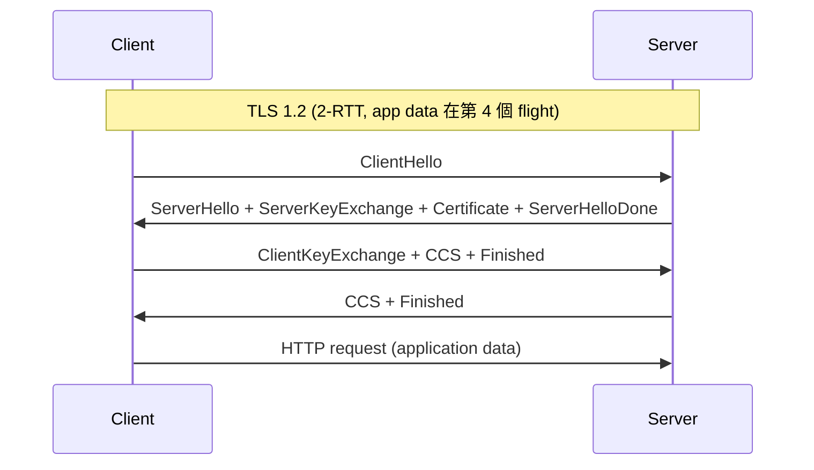
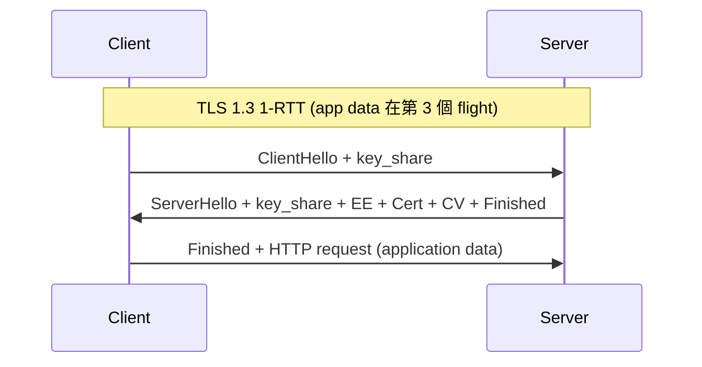
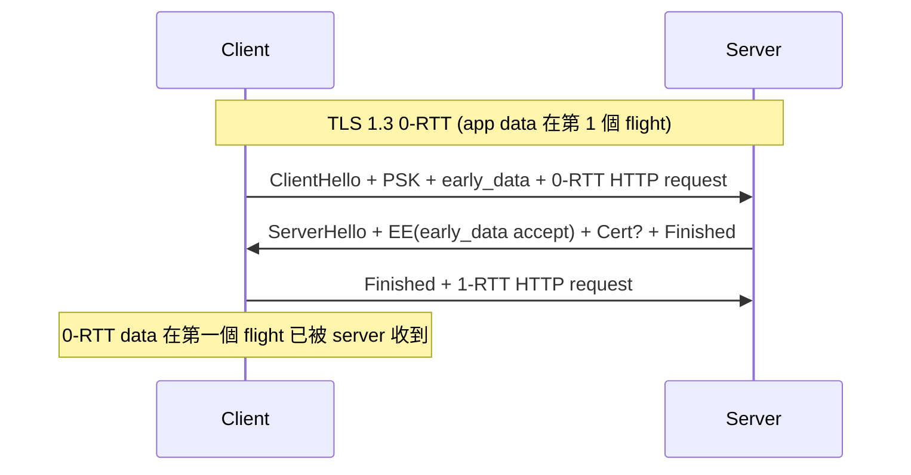

# 課堂 4.5 — 0-RTT 與重放攻擊：把雙刃劍拆開

## 學前知道
- 前置課：[4.3 TLS 1.3 握手逐 byte 解剖](./4.3-tls13-handshake-byte-level.md)、[4.2 TLS 1.2 vs 1.3 對比](./4.2-tls12-vs-tls13.md)（PSK 機制章節）
- 預計閱讀時間：**40 分鐘**
- 必讀規格：RFC 8446 §2.3、§4.2.10「early_data」、§4.6.1「NewSessionTicket」、§8「Anti-Replay」、§E.5「Replay Attacks on 0-RTT」
- 必讀論文：
  - **Fischlin, Günther**. *Replay Attacks on Zero Round-Trip Time: The Case of the TLS 1.3 Handshake Candidates*. IEEE EuroS&P 2017. precis: [`notes/papers/fischlin-gunther-zero-rtt.md`](../../notes/papers/fischlin-gunther-zero-rtt.md)
  - **Aviram, Gellert, Jager**. *Session Resumption Protocols and Efficient Forward Security for TLS 1.3 0-RTT*. J. Cryptology 2021 — puncturable PRF 達成 forward-secret 0-RTT 的構造
  - **Drucker, Gueron**. *Selfie*. precis: [`notes/papers/drucker-selfie.md`](../../notes/papers/drucker-selfie.md)（4.1 已寫）
- 必讀原始碼：
  - boring/openssl/rustls 中 0-RTT cache 實作；rustls `src/server/anti_replay.rs`
  - Cloudflare `0-RTT` blog post + worker code（https://blog.cloudflare.com/introducing-0-rtt/）

## 動機

0-RTT 是 TLS 1.3 對 1.2 「最甜美」的賣點：第一個 packet 就能帶 application data，**省一個 RTT**。對行動裝置在 4G 高 latency 場景，這個改善是 100ms 級別。

但 0-RTT 是雙刃劍——**它是 TLS 1.3 唯一一個無法 prove 同時擁有 forward secrecy + replay resilience 的階段**。Fischlin-Günther 2017 證明這條 trade-off 是密碼學結構性的，不是 implementation 細節。

讀完這堂課應該回答：
- 為什麼 banking 系統與 e-commerce 預設拒絕 0-RTT
- Cloudflare 的 0-RTT 預設策略是什麼，為何如此設計
- 我們協議要不要 0-RTT，怎麼設計才安全
- puncturable PRF 為什麼是 0-RTT 的「下一代解法」

---

## 核心概念

### 1. 為什麼 1.3 引入 0-RTT

對比 1.2 vs 1.3 vs 1.3+0-RTT 的 RTT 數：







省下的 RTT 在跨太平洋 150ms × 2 = 300ms 的場景下是巨大改善。**這是 1.3 的 marketing winning point**。

### 2. 0-RTT 的密碼學機制

0-RTT 預設條件：**雙方已有共享 PSK**（從之前 1-RTT NewSessionTicket 或 external pre-distribution）。

Client：
```
early_secret = HKDF-Extract(salt=0, IKM=PSK)
binder_key = Derive-Secret(early_secret, "ext binder", "")  # external PSK
           or Derive-Secret(early_secret, "res binder", "")  # resumption PSK
client_early_traffic_secret = Derive-Secret(early_secret, "c e traffic", ClientHello)
early_exporter_master_secret = Derive-Secret(early_secret, "e exp master", ClientHello)
```

`client_early_traffic_secret` 用來 derive 0-RTT 的 record key（AEAD）：
```
key = HKDF-Expand-Label(client_early_traffic_secret, "key", "", key_length)
iv  = HKDF-Expand-Label(client_early_traffic_secret, "iv", "", iv_length)
```

Client 用這對 (key, iv) 加密 0-RTT data，與 ClientHello 一起發送。

Server 收到 ClientHello，發現 `pre_shared_key` extension + `early_data` extension：
1. 用 PSK 對應的 binder_key 驗 binder（HMAC 對 ClientHello prefix）
2. 用 `client_early_traffic_secret` 解 0-RTT records
3. 若 server 願意接受 0-RTT → 在 EncryptedExtensions 包含 `early_data` extension（空 data）告知 client「我收到了」
4. 若 server 拒絕 → EncryptedExtensions 沒 `early_data`，client 需重發 application data in 1-RTT 階段

### 3. Replay attack 的具象

Attacker 是 on-path observer：
1. 截獲 client 的 0-RTT ClientHello + 0-RTT data
2. 等 client 連線完成
3. **稍後**對同一 server replay 整個 ClientHello + 0-RTT data
4. Server 用同一 PSK 對應 PSK identity，仍可 decrypt 0-RTT
5. **Server 處理 0-RTT data 兩次**

對 `GET /static/image.png` 這種 idempotent 請求，replay 無害。對 `POST /transfer?amount=100&to=alice`：
- Server 處理兩次 → 轉兩次帳
- 如果 server side 沒有 application-level idempotency（unique transaction ID），錢就 double-spent

**這是為什麼 TLS 1.3 RFC 8446 §8 與 §E.5 用 3 頁篇幅明確警告**：

> Application protocols MUST NOT use 0-RTT data without a profile that defines its use. That profile needs to identify which messages or interactions are safe to use with 0-RTT.

### 4. RFC 8446 §8 給的 anti-replay 機制

RFC 8446 提供三個 anti-replay mechanism，**並未強制**選哪一個：

#### Mechanism #1: Single-Use PSK
- Server 對每個 NewSessionTicket 標記為「**單次使用**」
- 第一次 0-RTT 使用後 server 刪除該 PSK identity
- Replay attempt → server 拒絕（PSK identity 不存在）
- **代價**：每個 ticket 只能用一次；client 跨 connection burst 場景需 multiple tickets

#### Mechanism #2: Client Hello Recording
- Server 維護一個 hash set 記錄最近 N 秒內看過的 ClientHello hash
- 新 ClientHello 進來先查 set
- **代價**：State 在每個 server side，分散式集群需 Redis/Memcached 共享；hash set 占記憶體

#### Mechanism #3: Freshness Checks via `obfuscated_ticket_age`
- 每個 NewSessionTicket 有 `ticket_age_add`（32-bit random）
- Client 帶 PSK 回來時送 `obfuscated_ticket_age = (now - ticket_issue_time + ticket_age_add) mod 2^32`
- Server 計算 expected age，比較 actual age；若 |diff| > 容忍度（典型 10s）→ 拒絕 0-RTT
- **代價**：clock skew 容忍度跟 anti-replay window 直接矛盾——窄 window 抓更多 replay 但拒絕更多 legitimate client；寬 window 增加 attack surface

**典型部署選擇**（基於 Cloudflare blog + Mozilla bug tracker）：
- Cloudflare：Mechanism #3 + restricted to GET requests with no sensitive headers
- AWS CloudFront：Mechanism #1（Single-Use）
- nginx + njs scripting：Mechanism #2 + Redis 集群同步

### 5. 真實場景下的 0-RTT 部署策略

| 場景 | 預設策略 |
|---|---|
| Cloudflare edge | 0-RTT enabled, 只允許 idempotent methods（GET, HEAD），不對 POST/PUT 啟用 |
| Fastly edge | 0-RTT enabled, similar restrictions |
| AWS ALB | 0-RTT disabled by default; need explicit opt-in |
| Google Cloud Load Balancer | 0-RTT enabled, restricted |
| Banking websites | 全 disable |
| GitHub | 開 0-RTT but explicit `Replay-Nonce` header for write operations |
| Cloudflare Workers | 0-RTT data 透過 `request.cf.tlsCipher` + `request.cf.earlyData` 可程式判斷 |

對 application developer 的建議（RFC 8446 §E.5）：

```
1. Read-only idempotent requests OK to accept in 0-RTT
2. State-mutating requests MUST be guarded by application-level idempotency key
3. Authentication tokens MUST NOT be issued or invalidated based on 0-RTT alone
4. Sessions MUST NOT be started solely on 0-RTT data
```

### 6. 0-RTT 的 forward secrecy 問題

RFC 8446 §2.3 直接寫：

> 0-RTT data, however, is **not forward secret**, as it is encrypted solely under keys derived using the offered PSK.

具象的意思：
- 1-RTT data 用 `application_traffic_secret`，secret 由 `ECDHE_shared_secret + PSK` 一起 derive → server 長期 key 之後洩漏，過去 1-RTT data **仍 secure**
- 0-RTT data 用 `client_early_traffic_secret`，secret 完全從 PSK derive → PSK 被洩漏 → 過去 0-RTT data **全洩漏**

PSK 是怎麼可能洩漏？
- Server 把 session resumption secret encrypt 為 NewSessionTicket，用「session ticket key」加密——server 內 secret，但 long-lived
- Session ticket key 通常每 24h rotate；但**舊 key 仍須保留以對舊 ticket 解密**
- Server 被攻破 → ticket key 洩漏 → 過去所有 NewSessionTicket → 過去所有 0-RTT data 都可解

**這就是 0-RTT「不可能 forward secret」的本質**：要在第一個 flight 解密，server 必須有「無 client 互動就能 derive key 的能力」——也就是 server 持有某種 long-lived state，那 state 一旦洩漏，過去全洩漏。

### 7. Puncturable PRF — Aviram-Gellert-Jager 的解法

Derler-Jager-Slamanig-Striecks (ePrint 2017/223) 與 Aviram-Gellert-Jager (J. Cryptology 2021) 給出**可前向保密的 0-RTT**。核心是 **puncturable PRF（PPRF）**。

**PPRF 概念**：一個 PRF $F_k(\cdot)$，加一個 puncture 操作 $\text{Puncture}(k, x) \to k'$，使得：
- $F_{k'}(y) = F_k(y)$ for all $y \neq x$
- $F_{k'}(x)$ 對所有人不可預測（包括知道 $k'$ 的人）

**0-RTT 用 PPRF**：
- Server 持 PPRF key $k$
- 每個 NewSessionTicket 含一個 nonce $n$；早期流量 key 由 $F_k(n)$ derive
- Client 用完 ticket → server puncture $k$ 在 $n$ 上 → 之後即使 $k$ 洩漏，過去 $n$ 對應的 key 也 unrecoverable

**問題**：PPRF 的有效 construction 是 binary tree-based GGM PRF + delete entry，**每次 puncture 是 log n 次 PRG 操作**；server 維護 $2^{32}$ 個可能 ticket 的 PPRF tree 需要 GB 級記憶體。Aviram 2021 提出 lighter construction 但仍有 production trade-off。

**目前部署狀態**：尚無主流 TLS library 提供 puncturable 0-RTT；OpenSSL/BoringSSL/rustls 都用 traditional ticket 模式。是研究級議題，**不是工程現實**。

### 8. 0-RTT 在 anti-censorship context 的特殊角色

對我們協議：

| 用 0-RTT | 好處 | 壞處 |
|---|---|---|
| 客戶端在 GFW 環境，第一個 packet 就要傳 inner SOCKS5 connect | 省 latency；對抗 SYN 等待 | replay 風險仍在；0-RTT data flow pattern 獨特 → fingerprint |
| 客戶端要切換 fronting domain | 0-RTT 讓切換瞬時生效 | 需 anti-replay state 跟 domain mapping 同步 |

**0-RTT 的 traffic pattern fingerprint** 是 anti-censorship 場景下獨特問題：
- 第一個 packet size > 普通 ClientHello（因為含 application data）
- 後續 packet 沒有「等 ServerHello」的 idle gap
- 整體 burst 形狀跟普通 1-RTT 不同

Wu-FEP 2023 等 statistical classifier 對這個 pattern 敏感。**如果我們協議默認用 0-RTT，反而給 GFW 一個新的識別 feature**。

→ 結論：**我們協議的 0-RTT 必須 optional + traffic-pattern-shaped**（fake idle gap）。

---

## 與我們協議設計的關聯

| 0-RTT 議題 | 我們協議的決定 |
|---|---|
| 接受 0-RTT data 還是禁用 | **Optional**，spec 預設 disabled，需 application 顯式 opt-in |
| Anti-replay 機制 | **Mechanism #1 (Single-Use PSK) + #3 (freshness window)** 雙保險 |
| Forward secrecy on 0-RTT | 採 **PPRF-based** 構造（接受實作複雜度，PhD-level contribution） |
| 0-RTT data 的 application semantics | spec 強制 idempotent only；非 idempotent 必須有 application-level nonce |
| Traffic pattern fingerprint | 0-RTT 模式下強制 padding + 假 idle gap，整體流量 shape 與 1-RTT 不可區分 |
| PSK identity 是否暴露 | PSK identity 必須在 outer encryption 內（ECH 或 inner channel） |

這幾條全部寫進 Part 11.7「我們協議的 handshake」。

---

## 動手（30 分鐘）

### 練習 A：觀察 Cloudflare 的 0-RTT 行為

對 `https://1.1.1.1` 連兩次（第二次帶 session ticket）：
```bash
# 第一次連線存 session
openssl s_client -connect 1.1.1.1:443 -tls1_3 -sess_out /tmp/cf.sess < /dev/null

# 第二次帶 session 連線，嘗試 0-RTT
openssl s_client -connect 1.1.1.1:443 -tls1_3 -sess_in /tmp/cf.sess -early_data /tmp/req.txt < /dev/null
```

`/tmp/req.txt`：
```
GET / HTTP/1.1
Host: 1.1.1.1

```

觀察輸出，找 `Early data was accepted` 或 `Early data was rejected`。

### 練習 B：在 nginx 上 enable + 測試 0-RTT

```nginx
server {
    listen 443 ssl http2;
    ssl_protocols TLSv1.3;
    ssl_early_data on;        # 啟用 0-RTT

    location /idempotent/ {
        # 接受 0-RTT
        proxy_pass http://backend;
    }

    location /sensitive/ {
        # 拒絕 0-RTT
        if ($ssl_early_data) {
            return 425 "Too Early";
        }
        proxy_pass http://backend;
    }
}
```

`$ssl_early_data` 變數在 nginx 標示這個 request 是不是 in 0-RTT。HTTP `425 Too Early` 是 RFC 8470 定義的 status code 專門給「不接受 0-RTT」場景。

### 練習 C：手寫 0-RTT replay attack (lab)

**僅在自己 VPS + 自己 nginx 環境做**，不要對任何第三方 server。

1. 用 openssl s_client 把 0-RTT request 抓下來（複制 ClientHello + 0-RTT records 的 byte sequence）
2. 寫一個 raw socket Python 程式重發整個 byte sequence
3. 觀察 server response 是否再次處理

對 GET request，你會看到 server 接受 + 處理；對 POST，server 多半會拒絕（取決於 anti-replay 配置）。

### 練習 D：讀 rustls anti-replay 實作

`rustls/src/server/replay_protection.rs` 與相關檔。看 rustls 採用什麼 anti-replay 機制（提示：Bloom-filter-based）。對比 RFC 8446 §8.2 對 Bloom filter 的討論。

---

## 自我檢查

1. **0-RTT 為什麼結構性不可能 forward secret？** 用 Fischlin-Günther 的 MSKE model 描述。
2. **HTTP `425 Too Early` 跟 HTTP `429 Too Many Requests` 不同**。425 的設計用途是什麼？由誰生成？
3. **Cloudflare 預設只對 GET 接受 0-RTT，但 HTTP/3 的 0-RTT 在 QUIC 層接受任何 stream data**。這個 layering gap 怎麼處理？（提示：application layer state machine）
4. **Single-Use PSK 對 burst 場景（client 1ms 內開 10 個並行連線）會失敗**。Server 怎麼設計才同時支援 burst + anti-replay？
5. **0-RTT 的 traffic pattern fingerprint** 對 anti-censorship 為什麼是雙刃劍？

---

## 延伸閱讀

- Cloudflare blog *Introducing Zero Round Trip Time Resumption (0-RTT)* — https://blog.cloudflare.com/introducing-0-rtt/
- Mozilla bug 1442498 — TLS 1.3 0-RTT support in Firefox 設計討論
- RFC 8470 — *Using Early Data in HTTP*（425 status code 的 spec）
- Aviram, Gellert, Jager. *Session Resumption Protocols and Efficient Forward Security for TLS 1.3 0-RTT*. J. Cryptology 2021
- Derler, Jager, Slamanig, Striecks. *0-RTT Key Exchange with Full Forward Secrecy*. EUROCRYPT 2018
- Boldyreva, Patton, Shrimpton. *Hedging Public-Key Encryption in the Real World*. CRYPTO 2017 — 對 nonce reuse 場景的相關技術

---

## 研究級補遺

### 1. 學界詞彙

| 口語 | 學界用詞 |
|---|---|
| 「0-RTT 提早資料」 | **Early data / pre-handshake application data** |
| 「重放」 | **Replay attack** (對應 freshness property in formal model) |
| 「Server 記憶體上的反重放紀錄」 | **Anti-replay cache / single-use ticket / nonce window** |
| 「PSK 對應的 session 重新建立」 | **Session resumption / abbreviated handshake** |
| 「向前秘密」 | **Forward secrecy (FS)** vs **Post-compromise security (PCS)** vs **Future secrecy** |
| 「punctured key」 | **Puncturable pseudo-random function (PPRF)** / **Forward-secure encryption** |
| 「不允許 0-RTT 的 HTTP 回應」 | **HTTP 425 Too Early** (RFC 8470) |

### 2. 對手分類學

0-RTT 場景對手能力：

| 等級 | 能力 |
|---|---|
| R1 | passive eavesdropper | 看 0-RTT data ciphertext，因無 FS 可在 PSK 洩漏後解密 |
| R2 | replay-capable on-path | 可截獲 + 稍後重發 ClientHello + 0-RTT data |
| R3 | adaptive on-path | 可截獲後修改 outer headers 但 PSK 簽章保護 inner |
| R4 | server compromise | 取得 session ticket key → 過去所有 0-RTT data 可解 |
| R5 | side-channel + replay | 對 server 的 anti-replay cache 做 cache-timing 探測來增加 replay 成功率 |

### 3. 形式化定義

**MSKE 0-RTT secrecy**（Fischlin-Günther 2017）：

定義 stages: $S_0$ (early-data) → $S_1$ (handshake) → $S_2$ (application)。

> A protocol is **$S_i$-key-indistinguishable** iff PPT adversary $A$ given oracle access to honest sessions and `Test(sid, i)` oracle (which returns either real $S_i$ key or random based on coin flip) cannot win with non-negligible advantage.

對 0-RTT 階段 $S_0$:
- **No FS**: PSK 洩漏即破 $S_0$ key
- **No replay-uniqueness**: $A$ 可讓兩個 honest session commit 到同一個 $S_0$ key

對 $S_1, S_2$:
- FS holds（ECDHE 引入新熵）
- Replay-uniqueness holds（每次新 ECDHE share）

### 4. 領域的關鍵論文

| 引用 | 為何必追 | 之後在哪堂精讀 |
|---|---|---|
| Fischlin-Günther EuroS&P 2017 | 0-RTT replay 形式化 | 本堂 |
| Dowling-Fischlin-Günther-Stebila JCS 2021 | MSKE 完整 model | Part 5.7 |
| Aviram-Gellert-Jager J. Cryptol 2021 | PPRF-based FS-0-RTT | 本堂 / Part 11 |
| RFC 8446 §8, §E.5 | spec-level anti-replay | 本堂 |
| RFC 8470 | HTTP 425 status code | 本堂 |
| Drucker-Gueron ePrint 2019/347 | PSK + Selfie | Part 4.1 / 本堂 |

### 5. 我們協議的座標

0-RTT 設計收窄：
- ✅ Optional in spec，default OFF
- ✅ Single-Use PSK + freshness window 雙保險
- ✅ Application-level semantics constraint by spec
- ✅ Traffic shaping to hide 0-RTT presence
- ❓ PPRF-based FS-0-RTT（如果 implementation 重量可接受） — Part 11.7 / Part 12 評估

### 6. 必追資源 / 社群入口

- IETF TLS WG mail archive
- Cloudflare research blog（0-RTT 與 ECH 持續 update）
- IACR ePrint 0-RTT 相關 papers tag

### 7. 開放問題

- **Puncturable 0-RTT 的 production-grade 實作仍 open**——目前無大規模部署
- **0-RTT 在 anti-censorship traffic shaping 下的 trade-off** 尚無 formal treatment
- **0-RTT + ECH 互動**：Cremers 2022 CCS 提出形式化但未涵蓋 anti-replay

---

> 下一堂（Part 4.6）：ECH。把 ClientHello 本身加密。HPKE 是什麼。Cloudflare 部署現況。GFW 對 ECH 的態度。
