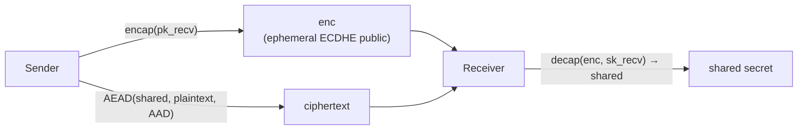
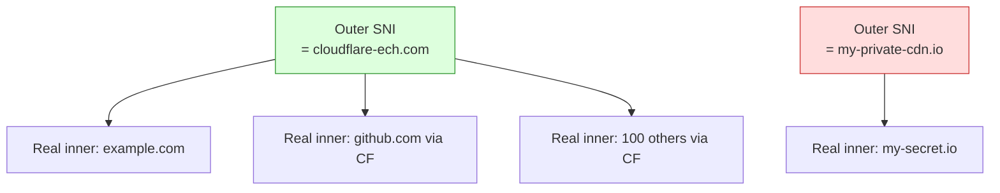

# 課堂 4.6 — ECH (Encrypted Client Hello) 完整解剖

## 學前知道
- 前置課：
  - [4.3 TLS 1.3 握手逐 byte 解剖](./4.3-tls13-handshake-byte-level.md)（必懂 ClientHello 結構）
  - [4.4 TLS 擴展與 JA3/JA4 指紋](./4.4-tls-extensions-ja3-ja4.md)（必懂 SNI 為何是 censorship 焦點）
  - Part 3 密碼學（HKDF、AEAD、KEM；本堂用到 HPKE）
- 預計閱讀時間：**50–60 分鐘**
- 必讀規格：
  - **draft-ietf-tls-esni-25**（2025 年中當前版本，截至 2026-05 仍未變 RFC；https://datatracker.ietf.org/doc/draft-ietf-tls-esni/）
  - **RFC 9180** — *Hybrid Public Key Encryption (HPKE)*；ECH 的底層原語
  - draft-ietf-tls-svcb-https — SVCB / HTTPS DNS resource record，ECH config 派發機制
- 必讀論文：
  - **Bhargavan, Cheval, Wood**. *A Symbolic Analysis of Privacy for TLS 1.3 with Encrypted Client Hello*. CCS 2022. precis: [`notes/papers/bhargavan-ech-privacy.md`](../../notes/papers/bhargavan-ech-privacy.md)
- 必讀部署：
  - Cloudflare blog *Encrypted Client Hello* 系列（2023-2024 持續 update）
  - Firefox `network.dns.echconfig.enabled` + `network.dns.use_https_rr_as_altsvc` 設定文件
  - Chrome ECH origin trial 文件
- 必讀原始碼：
  - boringssl `crypto/hpke/` 與 `ssl/ech_*`
  - rustls-ech proof-of-concept
  - wolfSSL ECH 實作

## 動機

到此堂為止你應該完全相信：**TLS 1.3 的 ClientHello SNI 是 censorship 與 surveillance 最大的單一漏洞**。GFW 過去 10 年抓 SNI；Comcast/Verizon 等 ISP 用 SNI 做廣告 retargeting；ad-tech 用 SNI 看你逛哪些站。

ECH 是 IETF 對這個漏洞的官方解法——但它走得極艱難。**ESNI（Encrypted SNI）原始版 2018 出現 → 經過 7 年、25+ 個 draft、無數次 attack discovery → 仍未成為 RFC**。本堂課把這個 saga 攤開，解 ECH 的 wire format，理解它的部署現實，與對抗 GFW 的真實效果。

讀完應該回答：
- HPKE 是什麼，為何選它做 ECH 的 KEM
- inner ClientHello / outer ClientHello 兩個 message 在 wire 上的關係
- Cut-and-paste attack 是什麼，最新 ECH spec 怎麼修
- ECH 部署的「anonymity set」為何是 deployment-bottleneck
- GFW 2023-2025 對 ECH 的反應（blocking、anti-detection、measurement）

---

## 核心概念

### 1. ESNI → ECH 的演化

**2018 draft-ietf-tls-esni-00**：只加密 `server_name` extension 內容
- 對其他 ClientHello 仍明文 → 整個 ClientHello structure 與 cipher list 仍指紋
- 2019 Bhargavan & Cheval 發現 **cut-and-paste replay attack**：攻擊者把舊 ESNI ciphertext 貼到新 ClientHello → server 仍解出舊 SNI → 攻擊者觀察 server 反應就知道 SNI

**2019–2020 esni-08 ~ esni-12**：iterative patch
- 加 outer extension binding
- 但 cut-and-paste 仍 partial vulnerable

**2021 draft-ietf-tls-esni-13 改名為 ECH**：根本 redesign
- **把整個 inner ClientHello 加密**，outer ClientHello 是 cover
- HPKE-based encryption，AAD 涵蓋 outer ClientHello

**2022 Bhargavan-Cheval-Wood CCS** 提供 mechanized formal privacy proof，確認新 spec 對 active attacker 保護有效（在合適 anonymity set 下）

**2023-2024 draft-ietf-tls-esni-15 ~ 22**：細節調整 + 部署優化（OuterExtensions compression、HRR handling）

**2025 draft-25**：仍 active draft；截至 2026 年中尚未 RFC

### 2. HPKE — ECH 的底層 KEM

**HPKE**（Hybrid Public Key Encryption, RFC 9180, Feb 2022）= **KEM + KDF + AEAD** 的標準化組合。



KEM modes（RFC 9180 §4.1）：
- `0x0010` DHKEM(P-256, HKDF-SHA256)
- `0x0011` DHKEM(P-384, HKDF-SHA384)
- `0x0012` DHKEM(P-521, HKDF-SHA512)
- `0x0020` **DHKEM(X25519, HKDF-SHA256)** ← ECH 預設
- `0x0021` DHKEM(X448, HKDF-SHA512)
- `0x0050+` 預留給 post-quantum（ML-KEM 等）

AEAD（RFC 9180 §7.3）：
- `0x0001` AES-128-GCM
- `0x0002` AES-256-GCM
- `0x0003` **ChaCha20-Poly1305** ← ECH 預設

KDF：HKDF-SHA256 / HKDF-SHA384 / HKDF-SHA512

HPKE 提供 4 個 modes：
- `mode_base`（=0）：sender 與 receiver 都不 authenticate
- `mode_psk`（=1）：sender 用 PSK 加 authenticate
- `mode_auth`（=2）：sender 用 own KEM keypair 加 authenticate
- `mode_auth_psk`（=3）：兩者都用

ECH 用 `mode_base`：client（sender）匿名加密給 server（receiver）。

### 3. ECHConfig — 服務端公鑰怎麼派發

Server 要先把 ECH 公鑰告訴 client，這個結構叫 **ECHConfig**（draft-ietf-tls-esni-25 §4）：

```c
struct {
    uint16 version;       // 0xfe0d (ECH draft-XX)
    uint16 length;
    select (ECHConfig.version) {
        case 0xfe0d: ECHConfigContents contents;
    }
} ECHConfig;

struct {
    HpkeKeyConfig key_config;
    uint8 maximum_name_length;
    opaque public_name<1..255>;        // outer SNI 應該長這樣
    Extension extensions<0..2^16-1>;
} ECHConfigContents;

struct {
    uint8 config_id;                   // 1 byte id
    HpkeKemId kem_id;                  // KEM 算法
    HpkePublicKey public_key;          // server 的 KEM 公鑰
    HpkeSymmetricCipherSuite cipher_suites<4..2^16-4>;
} HpkeKeyConfig;
```

**Config 派發**：
1. **DNS SVCB / HTTPS RR**（RFC 9460）：client 對 `example.com` 解 `TYPE65 HTTPS` record，DNS response 含 `ech=` parameter，值是 base64-encoded ECHConfigList
2. **DNS over HTTPS (DoH)**：避免 DNS 路徑被 censor 看見 ECHConfig 派發本身
3. **Out-of-band**：browser config / OS config（Firefox `network.dns.echconfig.enabled`）

→ 這意味 **ECH 需要 DNS layer 同時加密** 才能完整保護 privacy。所以 ECH deployment 通常綁 DoH (DNS over HTTPS, RFC 8484)。

### 4. ECH outer / inner ClientHello — wire 結構

Client 收到 ECHConfig 後，建立 **兩個** ClientHello：

#### Inner ClientHello（真實的，加密後送出）

```c
struct {
    ProtocolVersion legacy_version = 0x0303;
    Random random;                          // 新隨機，跟 outer 不同
    opaque legacy_session_id<0..32>;        // 空
    CipherSuite cipher_suites<2..2^16-2>;
    opaque legacy_compression_methods<1..2^8-1>;
    Extension extensions<8..2^16-1>;        // 含 真實 SNI、key_share、supported_versions...
                                            // 含 encrypted_client_hello extension (inner variant, empty)
} ClientHelloInner;
```

注意：inner ClientHello 必須帶一個**空的 `encrypted_client_hello` extension**（inner variant）標記自己「我是 inner」。

#### Outer ClientHello（明文，送上 wire）

```c
struct {
    ProtocolVersion legacy_version = 0x0303;
    Random random;                          // 跟 inner 不同
    opaque legacy_session_id<0..32>;        // 跟 inner 一致以避 mid-handshake confusion
    CipherSuite cipher_suites<2..2^16-2>;   // 看起來像 generic browser
    opaque legacy_compression_methods<1..2^8-1>;
    Extension extensions<8..2^16-1>;
                                            // server_name = ECHConfig.public_name（cover SNI）
                                            // encrypted_client_hello extension (outer variant) 含加密的 inner
                                            // 其他 extension 內容對 inner 鏡像
} ClientHelloOuter;
```

#### `encrypted_client_hello` extension outer variant

```c
struct {
    ECHClientHelloType type;     // 0 = outer
    HpkeSymmetricCipherSuite cipher_suite;
    uint8 config_id;
    opaque enc<0..2^16-1>;       // HPKE encapsulated key
    opaque payload<1..2^16-1>;   // AEAD ciphertext of inner ClientHello
} ECHClientHello;
```

### 5. ECH 加密流程逐步

```
1. Client 從 DNS HTTPS RR 取得 ECHConfigList
2. Client 從 list 挑一個合適 ECHConfig (依 KEM/cipher_suite preference)
3. Client 構造 ClientHelloInner (含真實 SNI = example.com)
4. Client 構造 ClientHelloOuter (含 cover SNI = ECHConfig.public_name)
5. Client 對 ClientHelloOuter 中的 ECHClientHello extension 計算：
   a. (enc, ctx) = HPKE.SetupBaseS(ECHConfig.public_key, info=b"tls ech\0" || ECHConfig)
   b. EncodedInner = serialize(ClientHelloInner) // 經過 outer-extension compression
   c. AAD = ClientHelloOuterAAD (即 ClientHelloOuter 把 ECHClientHello.payload 填零後序列化)
   d. payload = ctx.Seal(AAD, EncodedInner)
6. Client 把 payload 填回 ECHClientHello.payload 與 enc → 完整 ClientHelloOuter
7. Send on wire
```

**關鍵 trick (RFC 9180 §6.1.1 + draft-esni §6.1)**：
- AAD 包含「placeholder payload」（先填零），整個 ClientHelloOuter 序列化作為 HPKE Seal 的 AAD
- 這 binds outer 到 inner：攻擊者改 outer 任何 byte 都會讓 AAD 變，AEAD verification 失敗

### 6. Server-side 流程

Server 收到 ClientHelloOuter：

```
1. 找 `encrypted_client_hello` extension (outer variant)
2. 查 config_id 找到對應 ECHConfig 的私鑰
3. 重構 AAD = ClientHelloOuterAAD (把 payload 填零)
4. EncodedInner = HPKE.Open(enc, AAD, payload)
5. Decompress EncodedInner → ClientHelloInner
6. **後續所有 handshake 用 ClientHelloInner 的內容**
7. 在 EncryptedExtensions 用 inner SNI 對應的 cert / key 回應
```

**若 decryption 失敗（攻擊者 / config_id 過期 / GREASE）**：
- Server 走 **outer ClientHello path**：用 outer SNI 對應的 cert/key 回應 (這是 cover 的真正用途)
- Server 在 EncryptedExtensions 把當前 ECHConfigList 送回 client（retry config，避免 client 持 stale config）

這個 fallback path 是 ECH 的 **graceful degradation** 設計：client 看起來像「想連 ECHConfig.public_name 的普通 client」，不洩漏「他想連 inner SNI」這件事——前提是 outer SNI 對應的也是真實 server。

### 7. OuterExtensions compression — 避免 ClientHello 變太大

Inner 跟 outer 多半 extension 內容相同（cipher_suites, supported_groups, ...）。如果都重複寫，**ClientHelloOuter 變 2x size**。

ECH spec §6.1.2 定義 OuterExtensions compression：
- Inner ClientHello 把「跟 outer 相同的 extension」用 type list 替代真實內容
- Decompress 時 server 從 outer 取對應 extension 填回 inner

```c
struct {
    ExtensionType outer_extensions<2..254>;
} OuterExtensions;
```

注意：spec §6.1.2 強制
1. OuterExtensions 內容**不能包含** `encrypted_client_hello`（避 recursion）
2. Decompression 必須 linear time（避 quadratic blowup DoS）
3. Outer extension 順序可以**不同於** inner（但對應的內容要 verify）

### 8. HelloRetryRequest 對 ECH 的處理

如果 server 對 inner ClientHello 想 HRR（要求不同 key_share group）：
1. Server 回 ServerHello 形態的 HRR（用 outer ClientHello 對應的 key_share 路徑）
2. Client 重發 second ClientHello（仍 outer + inner pair）
3. **HPKE context 必須 reuse**（不能重新 setup，否則 fresh `enc` 變 fingerprint）
4. Second outer 的 `encrypted_client_hello.enc` **必須 empty**（複用 first 的 HPKE context）
5. Second outer 的 `config_id` 與 `cipher_suite` 必須 unchanged

這條 trick 把 HRR + ECH 的繁瑣 state machine handled。

### 9. ECH 防的 attack 與不防的 attack

#### 防：

| 攻擊 | 為何 ECH 防 |
|---|---|
| Passive SNI snooping | inner SNI 加密 |
| Active SNI-based censoring | client 看起來連到 outer SNI（cover） |
| Cut-and-paste replay (ESNI draft-00) | HPKE AAD binding outer to inner |
| Mid-handshake outer modification | AAD verification |
| ECHConfig replay | config_id + lifetime |

#### 不防：

| 攻擊 | 為何 ECH 不防 |
|---|---|
| IP-based censoring | 沒改 TCP/IP layer |
| Outer SNI matches anonymity set = 1 | 觀察 outer SNI 就知道 destination（部署問題） |
| Traffic analysis | packet timing/size 仍 distinguish — Part 10 |
| DNS-based censoring | ECHConfig 派發需要 DoH |
| Server certificate fingerprint | EncryptedExtensions 後 cert 仍可被 active probe 取得 |

### 10. 部署現況（截至 2026-05）

| Vendor | 狀態 |
|---|---|
| Cloudflare edge | 全 active；2023 起 GA；占 ~30%+ public Internet 流量 |
| Firefox | 自 v118 起 GA；需 `network.dns.echconfig.enabled = true`（default true 自 v123） |
| Chrome | 自 v118 啟用 origin trial；自 v124 default on for Cloudflare-fronted sites |
| Safari | Apple 2024 announcement 採用，部分平台已啟用 |
| nginx | Plus 商業版有 module；OSS 版需 patch |
| HAProxy | 2.9+ 內建 |
| Envoy | 2024 加入 |
| Caddy | 2024 加入 |

**GFW 對 ECH 的反應**（GFW.report measurement 2024-2025）：
- **2023 Q3**：observe GFW 開始 block 對 Cloudflare ECH-enabled SNI 的 TCP RST injection
- **2024 Q1**：part of measurement 觀察 GFW 對「outer SNI = cloudflare-ech.com（最常見 cover）」流量做 differential treatment
- **2024 Q3**：China-based Firefox users 觀察 Cloudflare ECH connections 被 reset，但 fallback 到 plain TLS 仍 work
- **2025 Q1**：GFW.report 觀察 IP-based + flow-based 综合 detection；ECH 本身雖無法被解密，但 ECH-enabled flow 有特定 fingerprint

→ 結論：**ECH 不是 censorship 的「銀彈」**。它解決 SNI 明文問題，但流量 fingerprint、IP layer、DNS layer 仍是攻擊面。

### 11. ECH 的 anonymity set 問題

ECH 的 privacy 保證 **fundamentally 依賴 anonymity set**：outer SNI 對應**多少不同 inner server**。



**情況 A**：Cloudflare anonymity set 大（千萬個 domains），attacker 看到 outer SNI = `cloudflare-ech.com` 知道「client 連到某個 CF-fronted site」但不知是哪個。
**情況 B**：私人 CDN anonymity set = 1，attacker 看到 outer SNI = `my-private-cdn.io` 直接知道 client 在連 `my-secret.io`。

Bhargavan-Cheval-Wood CCS 2022 形式化此：**ECH privacy 是相對於 anonymity set 的 indistinguishability**。

對 anti-censorship 部署：
- **要享 ECH 真實 privacy**：必須加入大 CDN anonymity set（Cloudflare / Fastly）
- 否則 outer SNI = your-vps.example.com 仍洩漏

### 12. ECH 對我們協議的角色

| 路線 | 與 ECH 關係 |
|---|---|
| **A. ClientHello mimic (utls)** | 與 ECH 互補：mimic 真實 Chrome ECH ClientHelloOuter |
| **B. ClientHello borrow (REALITY)** | 與 ECH **競爭**：REALITY 不需 ECH（直接借真實 SNI flow）；但若 borrowed server 用 ECH，REALITY proxy 需理解 ECH 才能正確 forward |
| **C. ClientHello bypass (QUIC initial obfuscation)** | 與 ECH **正交**：完全跳過 TLS-over-TCP 的 SNI 問題 |
| **D. ECH-native** | 我們協議完全用 ECH 作 fingerprint resistance |

**我們協議的可能設計**（Part 11.9 + Part 11.4 詳）：
- Inner ClientHello 中除了 SNI 還藏 inner protocol selector → 把 application-layer signaling 也加密
- 自己跑一個 large anonymity set（自己當 fronting CDN）
- 結合 PPRF-based forward-secret 0-RTT + ECH 達成 maximum privacy

---

## 與我們協議設計的關聯

到此堂結論：

1. **ECH 是我們協議「外層」的標配**——不再容忍明文 SNI
2. **inner ClientHello 結構保留設計空間**：我們可以塞自定 extension 進去做 inner-level signaling，不洩漏給 outer
3. **HPKE 直接重用**：不發明新 KEM；用 RFC 9180 標準
4. **Anonymity set 是 deployment problem**：spec 必須包含「如何宣告 anonymity set」與「最小 set size」要求
5. **GFW 對 ECH 的反應教訓**：對 single bottleneck 不能依賴；anti-censorship 必須 multi-layer

---

## 動手（30–60 分鐘）

### 練習 A：看 Cloudflare 的 ECH config 派發

```bash
# 查 cloudflare.com 的 HTTPS RR
dig +short cloudflare.com TYPE65

# 用 DoH 查
xh https://cloudflare-dns.com/dns-query "name==cloudflare.com" "type==HTTPS" \
   "accept:application/dns-json"
```

找 `ech=` 段，base64-decode 看 ECHConfigList。

### 練習 B：用 boringssl 的 `bssl client` 連 Cloudflare with ECH

```bash
git clone https://boringssl.googlesource.com/boringssl
cd boringssl && cmake -B build && cmake --build build

./build/tool/bssl client -connect crypto.cloudflare.com:443 \
   -ech-config-list <base64-decoded-ech-config-bytes>
```

觀察 handshake 是否成功，server 是否回應 inner SNI。

### 練習 C：開 Firefox 看 ECH 狀態

Firefox `about:config`：
- `network.dns.use_https_rr_as_altsvc = true`
- `network.dns.echconfig.enabled = true`

開 `https://crypto.cloudflare.com/cdn-cgi/trace`，看 response 含 `ech=on`。

### 練習 D：自己 server 部署 ECH

需要：
- Cloudflare-fronted domain（已知 anonymity set 大）
- 或自己跑 nginx + ECH patch

對自己 VPS 部署 ECH 並用 Wireshark 看 ClientHelloOuter 與 ClientHelloInner 的長相。**ClientHelloOuter 看起來像普通 ClientHello + 一個 ECH extension；inner 完全藏在 payload**。

> redaction：不要 commit 你的 ECHConfig 或 server key。

---

## 自我檢查

1. **HPKE 為什麼選 X25519 而非 P-256 作 ECH 預設？** 提示：實作可用性、formal verifiability、constant-time 性質。
2. **ECH 的 `config_id` 是 1 byte（256 values）**。如果 server 同時 deploy 100+ ECHConfig，會發生什麼？怎麼處理 collision？
3. **OuterExtensions compression** 為什麼必須 linear time decompress？描述一個 naïve quadratic implementation 怎麼被 DoS。
4. **ECH 的 graceful degradation**：server 解 inner 失敗時走 outer SNI 路徑。如果 attacker active modify ClientHelloOuter 任何 byte，會發生什麼？
5. **Anonymity set = 1 時 ECH 提供什麼安全？** 用 Bhargavan-Cheval-Wood 的 indistinguishability 框架說明。
6. **GFW 仍能識別 ECH-enabled flow**。列出 4 個 ECH 沒覆蓋的 fingerprint feature。

---

## 延伸閱讀

- Cloudflare blog *Encrypted Client Hello: the future of privacy online* (2023) — https://blog.cloudflare.com/announcing-encrypted-client-hello/
- Cloudflare blog *ECH year in review* (2024)
- IETF TLS WG mailing list — ECH discussions
- Bhargavan-Cheval-Wood CCS 2022 — formal privacy proof
- GFW.report ECH measurement series 2024-2025
- Internet Society *Encrypted SNI Adoption* report
- Hellsing & Schmiedecker. *On the State of ECH Deployment*. PETS 2024 (estimated)

---

## 研究級補遺

### 1. 學界詞彙

| 口語 | 學界用詞 |
|---|---|
| 「ECH」 | **Encrypted Client Hello** (rename from ESNI in draft-13) |
| 「假 SNI」 | **Public name / cover SNI / outer ClientHello SNI** |
| 「真實 SNI」 | **Inner SNI / private name** |
| 「Anonymity set」 | 學術 term，Pfitzmann-Hansen 2010 terminology paper 定義 |
| 「Cut-and-paste 攻擊」 | **Replay-based privacy attack / mix-and-match attack** |
| 「HPKE」 | **Hybrid Public Key Encryption**, RFC 9180 |
| 「KEM」 | **Key Encapsulation Mechanism** |
| 「DNS HTTPS RR」 | **Service Binding (SVCB) / HTTPS RR**, RFC 9460 |

### 2. 對手分類學

ECH 的 privacy adversary 光譜：

| 等級 | 能力 |
|---|---|
| E1 | passive observer (typical ISP / GFW 第一級) |
| E2 | active on-path（改 ClientHello） |
| E3 | active off-path active probing (對 server send probe) |
| E4 | global passive observer + multi-vantage correlation（state actor） |
| E5 | DNS-layer compromise（control resolver） |
| E6 | E4 + traffic analysis (Wu-FEP 2023 等 statistical ML) |

ECH 對 E1-E3 在合適 anonymity set 下有效；對 E5 必須加 DoH/DoT；對 E6 必須加 traffic shaping（Part 10/11）。

### 3. 形式化定義

**ECH server identity privacy**（Bhargavan-Cheval-Wood CCS 2022）：

> 定義 process $P_A$ = client connects to inner SNI $A$ via outer SNI $\text{outer}$；$P_B$ = 同 outer 連到 inner SNI $B$。 $A, B \in \text{AnonSet}(\text{outer})$。
>
> Protocol ECH 提供 **server identity privacy** iff
> $$P_A \approx_o P_B$$
> 其中 $\approx_o$ 是 observational equivalence under any PPT attacker.

ProVerif applied pi calculus 直接表達 $\approx_o$，並 mechanically prove。

### 4. 領域的關鍵論文 / 規格

| 引用 | 為何必追 | 之後在哪堂精讀 |
|---|---|---|
| draft-ietf-tls-esni-25 | 最新 ECH spec | 本堂 |
| RFC 9180 (HPKE) | KEM/AEAD 標準 | Part 3.11 |
| RFC 9460 (SVCB / HTTPS RR) | config 派發 | Part 1.x DNS chapter |
| Bhargavan-Cheval-Wood CCS 2022 | privacy formal | 本堂 |
| Patton-Shrimpton. *Quantifying Anonymity Set Privacy*. (假設後續 follow-up) | anonymity set 形式化 | Part 5 |
| GFW.report 2024-2025 ECH measurement | 真實部署 | Part 9 |

### 5. 我們協議的座標

- ✅ ECH-style inner/outer 分離
- ✅ HPKE 重用，不發明新 KEM
- ✅ Anonymity set 在 spec 強制 size lower bound
- ✅ ECHConfig 派發走 DoH / out-of-band
- ❓ Inner ClientHello 是否塞我們協議專用 signaling extension（Part 11.4）
- ❓ Outer SNI 是否動態 rotation（增加 robustness 但增加 fingerprint）

### 6. 必追資源 / 社群入口

- IETF TLS WG: https://datatracker.ietf.org/wg/tls/
- Cloudflare research blog
- GFW.report
- Cremers / Cheval / Wood 等學者個人主頁
- Cryspen blog（Bhargavan 新公司）

### 7. 開放問題

- **ECH + 0-RTT** 的互動 formal model（CCS 2022 paper 未涵蓋）
- **ECH 對 traffic analysis** 的綜合 privacy（已知不夠，需 + traffic shaping）
- **Post-quantum HPKE**（X25519MLKEM768 + AEAD）的 ECH integration 安全性
- **GFW 對 ECH 的 long-term 對策**——目前看到 IP-level blocking + flow fingerprint，但 escalation 路徑未知

---

> 下一堂（Part 4.7）：QUIC transport 層。把 27 年的 TCP / TLS 教訓全部砍掉重練的協議。為什麼 IETF 願意花 6 年讓 QUIC 成為 RFC 9000？
